# 序論——圧縮する知性と「我ら」の座標系 

---

## §1　「我ら」とは何か——一人の皇帝から始める 

人間は繰り返し問うてきた。「我ら」とは何か。

「我ら」の境界をどこに引くかによって、誰を守り誰を排除するか、何を大切にし何を犠牲にするかが、決まる。共同体の形成も、帝国の拡張も、革命も、虐殺も、すべてこの境界設定のもとで実行されてきた。境界の引き方そのものが、生死を分け、文明を生み、文明を壊してきた。

この問いを、現代を生きる読者に提示するために、本書は一人の歴史的人物から始める。ローマ帝国第二代皇帝、ティベリウス・ユリウス・カエサル・アウグストゥス。

ティベリウスは、不思議な人物である。古代から現代まで、彼については極めて多くの言葉が書かれてきた。タキトゥスは彼を、言葉の背後に別の意味を隠し、沈黙によって人々を震え上がらせる偽善の権化として描いた。スエトニウスは彼の晩年のカプリ島での淫蕩と倒錯を伝えた。十九世紀以降、歴史学的再検討は次第に異なる像を浮かび上がらせた。現代の研究者たちは、有能な行政家、慎重な財政家、誠実な制度継承者としてのティベリウスを描き出した。

そして、この多様な描かれ方そのものが、重要である。**異なる射影法で照らせば、最悪の暴君にも、傑出した名君にも、悲劇的人物にも映る**。どの像にも典拠がある。どの像も、部分的な真理である。そしてどの像にも、見えていない部分がある。

言い換えれば——どの射影にも盲点がある。

ティベリウスは、これほど論じられてきた人物でありながら、なお謎のまま残っている。彼が何を考えていたか、なぜそう振る舞ったか、内面で何を引き受けていたかは、誰にも確定できない。ティベリウスを深く研究する者たちも、彼の性格と内面が治世を理解する鍵でありながら、その性格自体が解読しがたく、最も謎めいた皇帝の一人として残るという趣旨を、それぞれの仕方で繰り返し述べてきた。

本書はなぜ、ティベリウスを冒頭に置くのか。

それは、ティベリウスが特殊な人物だからではない。逆である。**ティベリウスは、現代を生きる多くの人と類似する構造的配置に置かれていた**。

彼は、自分が選んだのではない位置に置かれた。アウグストゥスの政略で養子にされ、最愛の妻と引き離され、別の女性と結婚させられ、相続候補が次々と死んだ末に、皇帝の位置に押し込められた。彼の位置は、彼が選んだものではなかった。

彼の操作能力は、彼が認識できる範囲を遥かに超えていた。ライン川からエジプトまで、ヒスパニアからシリアまで、彼の判断は届いた。しかし彼が見ているのは、宮廷の限られた人々、そして晩年にはカプリ島の岸壁と海だけだった。彼の認識空間は縮小しつづけ、しかし操作能力は維持された。

彼は、構造を見抜きつつ、その構造を演じざるを得なかった。元首政が共和政の擬装であることを、彼は深く理解していたのだろう。しかし彼は、その擬装を演じる位置に立たされていた。見抜きつつ演じる——この二重性が、彼の発話の両義性、皮肉、沈黙の源泉だった。

彼は、逃避を試みた。ロドス島へ、後にはカプリ島へ。しかし、退隠先からも統治した。皇帝の位置からは、構造的に逃避できなかった。

そして彼は、深く孤独だった。誰も真に信頼できなかった。信頼した側近（セイヤヌス）に裏切られた。家族関係は政略の駒として動かされていた。彼を本当に知る者は、おそらく誰もいなかった。彼自身が、自らを知ることを拒んでいたのかもしれない。

これらの構造的配置は、現代を生きる多くの人——とくにある程度の操作能力を持って現代を生きる人——にとって、決して縁遠いものではない。

私たちは、現代という時代を選んだのではない。グローバル経済、気候変動、AI時代、これらの中に、私たちは生まれ落ちた。

私たちの行為の射程は、私たちの認識の範囲を遥かに超えている。私たちが消費し、投資し、選択することの結果は、地球の裏側にも、未来の世代にも、生態系全体にも届く。しかし私たちが認識しているのは、自分の生活と、画面に映る情報と、限られた人間関係だけである。

私たちは、構造を見抜きつつ、その構造を演じざるを得ない。消費社会の論理、SNSの操作性、気候危機の存在を、私たちは知っている。しかし、知りながらその構造の内部で生活し、消費し、SNSを使いつづける。

私たちは、逃避を試みても、構造的に逃避できない。デジタルデトックスも、田舎暮らしも、ミニマリズムも——降りようとすれば、降りようとすること自体がこの社会の様式の一部になる。

そして私たちは、しばしば深く孤独である。SNSでつながりながら、真に共有できる相手は減っていく。

つまり——**ティベリウスは、私たちの鏡である**。古代の絶対権力者と、現代の一般市民が、構造的に類似する配置に置かれているという、奇妙だが重要な事実。これが本書の冒頭に彼を置く理由である。

しかしここで、ある決定的な差異も認めなければならない。影響力には二つの方向がある。一つは「**人間社会への影響力**」。ティベリウスはこの方向で絶対的だった。彼一人の判断で帝国全土の人民の生死を左右できた。現代の私たちは、この方向では極めて小さい存在である。もう一つは「**人間社会以外への影響力**」。ティベリウスはこの方向ではほぼ無害だった。ローマ帝国の操作能力は地球環境を恒久的に改変するには至らなかった。現代の一般市民は、この方向でティベリウスを上回る。一人の現代先進国住民が一生に消費するエネルギー、排出する炭素、必要とする土地と水——これらは、ティベリウス一人が地球環境に与えた影響を、おそらく上回る。

この二つの方向の非対称が、現代固有の構造を作り出している。私たちは、「人間社会への影響力」ではティベリウスより遥かに小さく、しかし「人間社会以外への影響力」では彼を超える。これは、本書の後半（第Ⅳ部および第Ⅴ部）で改めて構造的に扱う論点である。

ここで重要なのは——「我らとは何か」という問いが、ティベリウスの時代と私たちの時代で、構造的に同じでありながら、しかし内実は変容しているという事実である。**問いの構造は古代から現代まで貫いている。問いに対して何を答えるかは、時代とともに変わる**。

「我らとは何か」を問うことは、本書の言葉で言えば、MANES の座標系を問うことである。MANES——意味と引受けの錨。何を前景化し、何を背景化し、何を認知地平の外へ押し出すかを方向づける、最も基底的な構造。本書が記述しようとするのは、この構造である。

本書は、人類が世代を越えて維持しようとしてきた何か——先祖が守ってきた家族・氏族・共同体の輪郭、引き継がれる意味の連鎖——を、現代の理論言語で再記述する作業でもある。これらは、人類が「我ら」と呼んできたものの、最も古い形態の一つである。本書の題が『THE MANES』であるのは、この古層と現代を貫く一つの構造を提示するためである。

ティベリウスは、本書全体を貫く参照点として、これからも登場する。彼を賞賛するためでも、断罪するためでもない。**異なる射影で異なる像が浮かぶ彼を、構造を照らす多面的な参照点として活用する**ためである。読者は本書を読み進めるうちに、ティベリウスの異なる側面に出会うことになるだろう。

そして最後に——本書を読み終えるとき、読者は気づくかもしれない。ティベリウスについて完全な理解には到達できないこと。盲点は残ること。しかし、構造の輪郭は、より精密になっていること。そして、自分自身についても、同じことが言えるということ。

---

## §2　凝集の美しさと座標系の妥当性——別々の問い 

「我らとは何か」という問いに、全身全霊で応えた者たちがいる。ある座標系に完全に凝集した者は、他者の評価に左右されず、迷わず、揺らがない。何を大切にし、何のために生き、何のためになら死ねるかを、彼らはもう問い返さない。答えが、すでに生そのものになっている。その貫かれかたは、否定しがたい美しさを帯びる。何を信じ、何に向かって生きるかをなお定めきれずにいる者の目には、なおさらに。

しかし、その揺らがなさは、揺らがない当のものが正しいことを意味しない。いかなる座標系への凝集も、座標系そのものの妥当性を保証しない。**凝集が完全であることと、座標系が妥当であることは、別々の問いである**。凝集の強さは、正しさの証しではない。

完全に凝集した武士道が、自らが捧げる忠義の正しさを証明するわけではない。完全に凝集した騎士道が、自らが守る忠誠の永続性を保証するわけではない。完全に凝集した革命家が、自らが掲げる解放の正当性を証明するわけではない。

これらの凝集の多くは、この区別がまだ広く見えていなかった時代の中にある。問いが先立つことは、まれだった。しかし、一度見えたものは、見えなかったことにならない。そして本書はいま、それを示してしまった。見る前の凝集が、疑われぬまま受け継がれる生であったとすれば、見たあとの凝集は、選び取られる生である。凝集は消えるのではなく、性格を変えるのである。そして、見たうえで選ぶ者は、一つの方向には揃わない。この区別を承知のうえで、なお狭く凝集を引き締める者がいる。同じ区別を承知のうえで、なお広く「我ら」を開こうとする者がいる。信念の強さ、貫きの徹底、生の一貫性——どの尺度で測っても、両者は同じだけ揺らがず、同じだけ美しくありうる。凝集の強さは、この二つを分けない。

だが、この区別は、双方向に働く。凝集の強さが正しさを証さないのなら、正しさが証されないこともまた、凝集の強さを崩しはしない。座標系の正しさを、宇宙も、他の誰も、保証してはくれない。その不確かさの真っただ中でなお揺らがずに立てるとすれば、それを支えるのは、凝集の強さそのものにほかならない。この区別は、本書の全体を貫く。凝集の美しさを否定するためではない。美しさと妥当性を切り分けたその先で、あるいは美しさも妥当性も宇宙論的中立性のもとに置かれるとしたときに、凝集の強さがいったい何を支えることになるのか——その問いを、本書は持ちつづける。

そして、ここに二十世紀の初頭に到達した一人の思想家がいる。

---

## §3　構造記述の極限と一人称の引受——ウナムーノ 

ミゲル・デ・ウナムーノ。バスク地方ビルバオに生まれ、サラマンカ大学で古典ギリシャ語を教えた文学者・哲学者。1913年に発表した『生の悲劇的感情』は、理性と生の根源的な葛藤を、体系的哲学ではなくエッセイの形式で——一人称の声で——記述した著作である。『生の悲劇的感情』には「私」あるいは「われわれ」という一人称が繰り返し繰り返し登場する。

ウナムーノの思想の核には、「死にたくない」という一語に凝集する渇望があった。個人としての永遠の存続への渇望。理性は、人間の有限性を暴露する。死は不可避であり、自己は存続しない。これは合理的な認識である。しかしウナムーノは、この認識の前で立ち止まらない。理性が示す結論を受け入れたうえで、なお「私は消えたくない」と叫ぶ。叫びは理性からは導出されない。叫びは、理性の暴露の後に残るもの——一人称の引受——として現れる。叫びは聞き手さえも必要としない。ただ一人の引き受けである。

---

> 「今日この世界におけるドン・キホーテの新しい使命は何か。それは叫ぶこと。荒野に叫ぶことである。たとえ人間どもが聞かなくても、荒野が耳を傾ける。そしてそれはいつの日か音の反響する森へと変化するであろう。そして種子のごとく荒野に播かれた孤独の声は巨大な杉となり、その幾万という舌でもって、生と死を司る神に永遠の讃歌をうたうであろう。」（ミゲル・デ・ウナムーノ『生の悲劇的感情』神吉敬三・佐々木孝訳、法政大学出版局（ウナムーノ著作集3）、1975年）

---

ここに、一つの構造が浮かび上がる。**構造記述を極限まで推し進めたとき、記述そのものからは導出できない一人称の引受に到達する**。

本書はこの境界を「Hineni」（ヒネニ）と呼ぶ。ヘブライ語で「ここにいます」——アブラハムが神の呼び声に応えた言葉である。ただし本書は、この語を宗教的な含意において用いるのではない。借りるのは、呼びかけに「ここにいます」と応える、その**応答の位置の構造**だけである。呼びかけが神からであれ、他者からであれ、まだ顔を持たない未来の世代からであれ、それに応えるという行為が、理性の計算からは導かれない。Hineni は、一人称の引受である。この構造は、特定の信仰を超えて立ち現れる。本書はこの語を、その構造を名指すための借り物として用いる。本書は Hineni の境界の手前に留まる。構造を記述する。しかし、その構造のもとで何を引き受けるかは、読む者に委ねる。

---

## §4　宇宙論的中立性——すべてのMANESは等価である 

ここで、読者を不安にさせる命題を提示しなければならない。

ウナムーノの叫びも、いかなる他の MANES も、宇宙論的には等価である。

宇宙は、ウナムーノの渇望を他の渇望より上位に置かない。武士が捧げた忠義も、騎士が守った主への忠誠も、革命家が掲げた解放への意志も、信仰者が抱いた永遠への希望も——どれも、宇宙論的には等価である。

ただし、この言葉が虚無主義の結論であると即断するのは早い。もし宇宙が特定の MANES を真理として保証してくれるならば、「我らとは何か」という問いは不要になる。宇宙が保証しないからこそ、座標系の構造を記述することに意味がある。価値の差異を生むのは、宇宙の真理ではなく、MANES の描く座標系そのものだからである。だからこそ、叫びに意味がある。

本書の立場をここで明示しておく。本書は構造記述に徹する。本書は読者に「これを大切にせよ」と命じない。「これが正しい」と宣言しない。しかし、座標系がどのような構造を持ち、どのような帰結を生み、どのような条件のもとで維持され崩壊するかは、記述できる。

本書がこの命題から虚無主義へ滑らない理路の全貌を、序論はこれ以上明かさない。読者がいま感じうる不安は、本書が引き受ける問いの一部であり、その行き先は本編を経た読者の内側で事後的に立ち上がりうる。

---

## §5　「我ら」の二つの側面——実存と操作 

「我らとは何か」を問うとき、実は二つの異なる問いが重なっている。

一つは、**誰と共に意味を作っているか**という問いである。誰の喜びが私の喜びとなり、誰の苦しみが私の苦しみとなるか。誰と共に世界を解釈し、誰と共に未来を見るか。これは内側からの感覚としての「我ら」——実存的・認識論的な側面である。

もう一つは、**誰に対して行為の結果が到達するか**という問いである。私が為したことの帰結は、誰の生に届くか。誰がその影響を被り、誰がその因果を引き受けうるか。これは外側からの構造としての「我ら」——操作能力的な側面である。

歴史の長い時間の中では、この二つの側面は概ね一致していた。あるいは、一致しているものとして無意識に前提されてきた。家族と共に生き、家族の運命を引き受ける。共同体と共に生き、共同体の運命を引き受ける。ここでは「共に生きる」ことと「結果を引き受ける」ことが、同じ範囲で重なっている。

ユヴァル・ノア・ハラリは、人類が**虚構を共有する能力**によって、この「我ら」を巨大に拡張してきた歴史を記述している。お金、宗教、国民国家、人権——これらは虚構である。しかし、その虚構を共有することによって、見知らぬ者同士が協働できる「我ら」が生まれた。氏族から都市国家へ、帝国へ、世界宗教へ、国民国家へ、人類全体へと、「我ら」は拡張してきた。これは人類の偉業である。

しかし、ハラリの記述には、もう一つの側面が陰に置かれている。同じ虚構の共有が、操作能力の拡張をも可能にしてきた。組織は、虚構を共有することで巨大化する。技術は、組織化された協働によって発達する。制度は、共有された規範によって成立する。これらすべてが、操作能力を増幅する装置である。

ここで決定的に重要な事実は、**実存的な意味での「我ら」の拡張と、操作能力の拡張は、独立に進みうる**ということである。両者は同じ虚構共有から生まれるが、別の論理で展開する。

「実存的我ら」（E, The Existential We）の拡張は、共感、教育、儀礼、物語、文化的接触によって進む。これは時間がかかる。そして、人間の認知的限界によって、拡張に上限がある。地球規模・地質学的時間規模の「我ら」を意味論的に維持することは、莫大な情報的・象徴的・制度的コストを要する。

操作能力の拡張は、技術、組織、資本、知識の蓄積によって進む。これは加速的に進みうる。指数関数的に拡張しうる。そして、認知的限界による制約を、外部装置によって部分的に回避できる。

ここで一つ、用語上の区別を立てておかなければならない。本書はこのあと、人を指す語と集合を指す語を、構造記述上の道具として使い分ける。

第一に、**生物学的個体としての一人**を指すとき、本書は **「私」** と鉤括弧つきで書く。日常語のように著者を指す用法ではなく、構造記述上の語である。著者を指す必要がある場合は **「筆者」** と書く。

第二に、人の集まりを指す語として、構造的階段と実存的厚みの二つを区別する。**「我ら」（構造的）** は、圧縮度の緩い集合の連続的階段——家族、近隣、共同体、国民、人類、そして自らを地球の細胞と数える粒度まで——の各点を指す。粒度のさまざまな集合を、その粒度を問わず指示する語である。これに対し、**「実存的我ら」** は、構造的「我ら」のうち、「個の私」との同一性が体感されている特定のものを指す。詳しくは「MANESの三層」（第6章）で取り出すが、これは MANES の第三層 ES（共存条件）と同義である。実存的に引き受けられた「我ら」が、ES である。

第三に、日常語の混合表現として、**「私たち」** を温存する。「私たち国民は」「私たち人類は」といった表現である。語り手も聴き手も、それが構造的「我ら」のどの粒度を指すのか、それが実存的に引き受けられた範囲なのか、操作能力の射程を指すのか——これらを意識しないままでいる。

そして最後に、もう一つの語を導入する。**「操作能力的我ら」** （O, The Operational We）である。これは、実感的に「我ら」と感じられているか否かとは無関係に、社会経済の制度構造の中で規定される、客観的な「我ら」の範囲を指す。現在のグローバルネットワーク経済社会で言えば、市場、サプライチェーン、エネルギー網、政策の波及——これらが届く範囲である。「操作能力的我ら」は、主観的「我ら」とは独立に作動し、時間的・空間的に主観的「我ら」を大きく超えうる。

そしてもう一つ、決定的な非対称がある。**「実存的我ら」は自覚的・構成的だが、「操作能力的我ら」は、自覚すら要しない**。誰と共に意味を作っているかは、引き受けるかどうかが問われる。しかし、自分の行為の帰結が誰の生に届くかは、引き受けようと引き受けまいと、構造的事実として外側から成立している。「操作能力的我ら」は、自覚されなくても拡張する。むしろ、自覚されないからこそ、加速的に拡張しうる。

両者がずれるとき——「操作能力的我ら」の拡張が、「実存的我ら」の拡張速度を超えるとき——何が起きるか。

---

## §6　引受の不等式——「操作能力的我ら」 ≤ 「実存的我ら」 

宇宙論的中立性のもとで、なお意味の差異が生じる構造がある。

人類の文明史を、本書は一つの条件をめぐる反復として読む。**「操作能力的我ら」の範囲が、「実存的我ら」の範囲を、超えてはならない。** この条件が明文で掲げられたことはない。守ろうとする自覚が担い手にあったのでもない。しかし、文明が発明しつづけてきた装置の系列をこの条件の側から見るとき、ばらばらの営みが一つの作業として結像する。この条件を式の形で書けば次のようになる。

---

> **「操作能力的我ら」（O）≤「実存的我ら」（E）**

---

ここで一つ、書き方の約束をしておく。記号 **O・E** は、この二つを式や図として扱うときの呼び名である。本書はこのあと、場面に応じて二通りに書き分ける。誰と共に在るかを問う実存的な文脈では「操作能力的我ら」「実存的我ら」とそのまま呼び、不等式や幾何として構造を扱う場面では O・E と記号で書く。両者は同じものの二つの書き方である。しかし、ここには含意がある。「操作能力的我ら」と「実存的我ら」、O と E——同じもののはずだが、同じ温度感ではない。この温度の差が何を意味するかは、第1章で射影として取り出す。

左辺（O）は、ある文明が及ぼしうる因果の射程である——「操作能力的我ら」の範囲。空間的にどこまで届くか。時間的にどれだけ未来まで影響するか。どのような種類の存在者に作用するか。これは自覚されなくても構造的事実として成立している。

右辺（E）は、その文明の MANES が「我ら」として包摂する範囲である——「実存的我ら」の範囲。本書の用語では、これが MANES の第三層である ES（共存条件、第6章で本格定義される）に対応する。誰の幸不幸を「我ら」のものとして引き受けるか。どの世代の運命を「我ら」のものとして配慮するか。どのような存在者を「我ら」の中に位置づけるか。これは内側から自覚的に構成される。

引受の不等式の核心は、左辺と右辺が**独立に動きうる**ということにある。両者は同じ「我ら」の二側面でありながら、別の論理で動かされる。自覚の階層に即して言えば、自覚を要しない左辺は、自覚的に構成される右辺を、構造的に超えうる。この独立性こそが、不等式が破れうる根拠である。

両者が一致しているか、右辺（E）が左辺（O）を包摂しているかぎり、行為の帰結は「我ら」の系内に留まる。引受のフィードバック閉路が機能する。木を植える者は、その恵みを受ける子孫を「我ら」として引き受けている。だから木を植える行為に意味が宿る。先祖の墓を守る者は、自分の墓を将来守る者を「我ら」として引き受けている。だから墓を守る行為に意味が宿る。

不等式が破れる——左辺（O）が右辺（E）を超える——その時から行為の帰結は「実存的我ら」の外部に流出し始める。流出した帰結は、誰の「我ら」にも属さない無主の領域で蓄積するか、あるいは別の「我ら」に被害として降りかかる。後者の場合、その「我ら」から見れば、それは引受のない一方的な災厄として現れる。

**この不等式の成立条件は、宇宙が保証するものではない**。宇宙はどの「我ら」も上位に置かない。しかし、ある特定の「実存的我ら」が引き受けている操作能力との関係において、不等式が成立しているか破れているかは、構造的に観察できる。**宇宙論的中立性のもとで、なお構造的な観察が可能な領域**——これが本書の主たる射程である。

この不等式を維持しようとする闘いは、人類の文明史そのものの背骨を成してきた。祖霊崇拝、世界宗教、世代を越える儀礼、世代を越えた約束、あるいは個の揺るがない信念——これらは、「操作能力的我ら」の拡張に対して「実存的我ら」を拡張しつづける営みだった。「我ら」を時間的に拡張する装置は、祖霊と子孫を同じ「我ら」に含める。空間的に拡張する装置は、見知らぬ者を「我ら」に含める。存在論的に拡張する装置は、神々や自然を「我ら」に含める。これらの装置の発明と維持こそが、文明の核心的な作業の一つであった。本書では、この乖離の構造そのものを、第3章 §3-5 で**観察される傾向 第Ⅰ部-2** として精密化する。引受の不等式は、その観察を本書の現代文明診断の枠組みとして提示する装置でもある。

現代の危機は、この古く永い闘いの最新の局面である。新しい問題ではない。しかし、操作能力の拡張速度は、文明史上前例のない規模と速度に達している。気候変動、核兵器、遺伝子工学、AI——いずれも、現存するいかなる MANES の「我ら」も包摂しきれない射程を持つ操作能力である。

---

## §7　不等式破綻の三つの様態——空間・時間・実存 

不等式の破れ方には、三つのパターンがある。

**第一は、空間的破れ**——行為の地理的射程が MANES の地理的範囲を超える。植民地主義、地球環境問題、グローバル金融が典型であろう。「我ら」の外部に被害が押し付けられる。被害を受けた者から見れば、加害者を含む「我ら」は存在しない。引受装置は機能しない。

**第二は、時間的破れ**——行為の時間的射程が MANES の世代的範囲を超える。気候変動、核廃棄物、生物多様性損失、年金制度の機能不全。未来世代という「まだいない我ら」に帰結が転嫁される。未来世代は、現在の行為に対して応答する手段を持たない。引受装置は構造的に成立しがたい。

**第三は、実存的破れ**——行為の対象範囲が MANES の存在論的範囲を超える。AI、遺伝子改変、脳神経操作、合成生物学。これらは、「我ら」の概念自体が含めていなかったカテゴリーの存在者に作用する。新しい「我ら」の創出が要請されるが、その創出は文明レベルの作業として完了していない。

これら三つの破綻は、本書の第Ⅳ部で詳述される。第15章は引受の不等式そのものを因果論として接地し、第16章はその不等式に対する三つの文明相と不安定化の動性を立てる。第17〜19章は文明の出力の幾何を漏斗モデルとして取り出し、規模の問いを引き受ける。そのうえで、第20章が空間的破綻、第21章が時間的破綻、第22章が実存的破綻と三軸の収束を順に展開する。

---

## §8　因果はどの時間に返るか 

なぜ人類は、引受の不等式を維持することにかくも苦労してきたのか。

答えの一つは、因果の時間配置にある。

宇宙論的中立性には、因果の側から見たもう一つの顔がある。宇宙がどの MANES も特権化しないとは、裏返せば、帰結が主体を問わず対称に回帰する地——誰の行いであれ、いつか返る、しかし誰に・いつ返るかは定めない地——だということでもある。圧縮する知性が、誰を「我ら」とするかの分節をこの地に刻むとき、はじめて帰結は「我らの内へ返るもの」と「外へ抜けるもの」とに分かれ、返りの時間が非対称に配分される。以下に辿る因果の時間配置は、この分節がもたらす非対称の分岐である。

行為には結果がある。しかし、結果がいつ・誰に返ってくるかは、一様ではない。

火に手を近づければ、熱さは即座に、近づけた当人に返る——本書はこれを**即時回収因果**と呼ぶ。木を植える者は、その木が実を結ぶのを自らは見届けないかもしれない。しかし実りは、やがて「我ら」の誰かに返る——これを**遅延回収因果**と呼ぶ。この二つは、結果の返り先がいずれも「我ら」の内側にある因果である。引受のフィードバックが機能するのは、この二つの領域においてである。木を植える行為に意味が宿るのは、実りを受け取る者を「我ら」として引き受けているからにほかならない。

不等式が破れ——「操作能力的我ら」が「実存的我ら」を超え——行為の結果が「我ら」の外部へ流出しはじめると、結果は当事者の時間に返らなくなる。これを**回収断絶因果**と呼ぶ。流出した結果は、当事者の判断のなかに現れない。学習は起きず、判断は空洞化する。引受の不等式が破れるということは、回収断絶因果が拡大する構造と同型である。**操作能力が MANES の「我ら」を超えるとき、回収断絶因果の領域が支配的になる。**

しかし、流出した結果が永遠に消えるわけではない。外部に蓄積した負債は、累積がある限度を超えたとき、当事者の側にも無視しきれない形で返ってくる。だが、返ってきた時点の当事者には、それを引き起こした原因と結びつける回路が、もはや備わっていない。結果は、釣り合いのとれない災厄——意味づけられない出来事——として顕現する。本書はこれを**非線形回収因果**と呼ぶ。

---

## §9　文明相と因果構造の選好 

文明は、四つの因果類型をすべて含む。ただし、文明はそのいずれかを主として引き受け、それを中心に運動を構成する。この選好に基づいて、本書は文明を三つの相として区別する。

**管理安定相**は、即時回収因果を中核に運動する文明相である。**循環耐久相**は、遅延回収因果を中核に運動する文明相である。**拡張加速相**は、回収断絶因果を事実上の前提として運動する文明相である。

三つの文明相は、文明の発達段階を示すものではなく、いずれが優れているかを評価するものでもない。本書は、いずれかの相を選好する立場には立たない。

ただし、三つの文明相は対称的な位置にあるわけではない。複数の文明が同一の環境を共有して競争するとき、拡張加速相は短期競争において構造的優位を持つ。この優位は、行為者の能力差や努力差ではなく、引き受けている因果構造の差に由来する。**引受の不等式の破綻と、拡張加速相の構造的優位は、同じ現象を異なる角度から見たものである。**

ただし、この優位は安定した勝利を意味しない。短期の競争で優位を与える当のもの——引き受けを省き、帰結を外へ送り出す構え——が、送り出した帰結を自らの判断の外に置きつづける。外に積もったものは消えず、いつか釣り合わぬ形で返る。優位を深く握った相ほど、自らが見ないものによって足をすくわれやすい。これは優劣の評価ではない。引き受けている因果構造がもたらす帰結の、傾向としての記述である。

---

## §10　知性は圧縮する存在である 

因果の時間配置——結果が即座に返り、遅れて返り、あるいはついに返らないという分岐——は、どこから生じるのか。

人間が圧縮する知性だからである。世界には、人間の処理能力（帯域）をはるかに超える量の情報がある。人間の作業記憶には厳しい容量制約があり、同時に保持可能な情報は限られる。この狭い制約のもとで世界を扱うために、人間は情報を圧縮する。世界を選別して扱うこと——そこから初めて、結果が「我ら」の内に返るか外へ抜けるかの区別が立ち、因果の時間配置が生じる。

圧縮は、選別と縮約からなる。圧縮には代償がある。圧縮されて切り捨てられた情報は、系の判断・評価・予測更新・行為選択の回路から実効的に排除される。本書はこの構造化された盲点を第3章で正式に取り出すが、序論ではさしあたり**盲点**と呼んでおく。

盲点は欠陥ではない。圧縮の正常な作動の帰結である。問題は、盲点の中に系の自己保持に必要な差異が含まれるようになるとき、系が自らの盲点によって崩壊しうることである。本書はこれを**頓死**と呼ぶ。

そして MANES は、この圧縮の帰結として生じる。帯域が有限であるからこそ、情報は凝集し、座標系として結晶する。MANES とは、圧縮する知性が世界を扱うために、必然的に作り出す構造である。だからこそ、MANES は美しく、同時に危ういのである。

引受の不等式が破れる構造を、圧縮論の言葉で記述すれば次のようになる。**操作能力の拡張は、MANES の「我ら」の境界外に行為の帰結を投擲する。投擲された帰結は、構造的に盲点に沈む。盲点に沈んだ帰結は、当事者の判断システムから消える。判断は空洞化し、操作能力はさらに拡張される。** 不等式の破綻は、自己強化的なループを生む。

---

## §11　近現代科学が暴露したもの——操作可能性の出現 

この圧縮の構造は、長い間、人間性の神秘のなかに隠れていた。しかし近現代の科学が、それを暴露し始めた。

認知科学が帯域の制約を測定した。情報理論が圧縮の代償を定式化した。神経科学が圧縮の物理的基盤を同定した。社会心理学が集団的圧縮の構造を観察した。これらの蓄積が、人間性の神秘の一部を、構造的な事実として可視化した。

この暴露は、二つの帰結を持った。

**解放**——自分が何を見落としているかを知ることは、見落としを部分的に補正する可能性を開く。

**操作可能性の出現**——圧縮の構造が可視化されたということは、その構造に介入する方法もまた可視化されたということである。他者の選別を誘導することができる。他者の縮約を方向づけることができる。他者の盲点に何を沈めるかを、外部から操作することができる。

この介入は新しいものではない。修辞学、プロパガンダ、広告、教育——人間は古くから、他者の座標系を操作してきた。しかし二つの点で現代は質的に異なる。第一に、操作の精度と規模が桁違いに拡大した。第二に、操作可能な領域が因果の時間配置そのものに及び始めた。即時的な反応を誘発し、遅延する結果への関心を構造的に削ぎ、回収断絶因果の領域を拡大する。

つまり、**現代の操作技術は、引受の不等式の破綻を加速する方向に作用する局面が拡大している**。操作能力の拡張そのものが、MANES の「我ら」を縮小させる方向に作用する。これは構造的に新しい事態である。

---

## §12　本書の方法と構成 

本書は構造を記述する。記述の方法は、明示的な規範判断を書き込まないことである。構造の連鎖を辿り、その連鎖が何を生み出し何を破壊するかを示す。

この方法には射程と限界がある。射程は、MANES の構造、形成を支える圧縮、動態、終結と継承、そして現代の危機。限界は Hineni 境界——構造は記述できるが、「この構造にかけがえのなさがある」という判断は記述からは導出されない。

Hineni 境界は単一種の切断——構造記述から実存的応答への移行——であるが、その切断は複数の級位で立ち上がる。本書の構造記述は、文明レイヤー全体の存続条件として書かれる。一人ひとりの読者が自らをどの「我ら」のうちに置き、いかなる個人として生き、そこから構造記述を読み返すかは、同じ Hineni 境界の異なる級位での現れである。本書はそのいずれにも介入できない。本書の構造記述を、自らの個人条件へと翻訳する作業は、読者の手元で起きる。どう応答するか、あるいは応答しないかは、読者の領域である。

ただし、Hineni 境界における応答の任意性は、構造記述の射程を縮めない。構造記述は、応答する読者にも応答しない読者にも、いかなる主体の選択にも、同じ構造的帰結を記述する。選択は自由だが、選択の構造的帰結から逃れる主体はない。Hineni 境界が並列的に許容的であることと、構造記述が普遍的に非任意であることは、本書において両立する。

そして、本書が構造記述に徹するからといって、本書の書かれ方が中立であるわけではない。本書を書くという行為そのものが、すでに何かを「大切である」と暗黙に置いている。完全な中立は、書くことの中には存在しない。

ティベリウスは、本書全体を貫いて、繰り返し参照される。彼が立たされていた構造的配置、彼が残した素材、彼が示した発話の作法、彼の認識空間の制限、彼を取り巻いていた情報のフィルター、彼が遺した国庫の余剰、そして彼の対比として浮かび上がる別の皇帝たち。読者は本書を読み進めるごとに、ティベリウスの異なる側面に出会うことになる。そして本書を読み終えるとき、ティベリウスはなお謎のまま残るだろう。読者自身もまた、自分自身に対して謎のまま残るだろう。しかし、構造の輪郭は、より精密になっているはずである。

本書の構成は五部からなる。

**第Ⅰ部**は、MANES を支える構造を記述する。世界を切り取る幾何学、圧縮の構造、LEFFLAとLOT、数学の巨大な視界と盲点、ゲーム理論の強さと限界。

**第Ⅱ部**は、MANES の形成と維持を記述する。三層構造、操作と実存の独立変動、神話的MANES、知識の重さ、SFOK、未来への希望。

**第Ⅲ部**は、MANES の終結と継承を記述する。HIAM、Mourning、残存と継承の構造。

**第Ⅳ部**は、引受の不等式が破れた文明の構造を診断する。まず不等式そのものを、宇宙の普遍法則ではなく、選別する知性が創発したレイヤーではじめて立ち上がる拘束条件として、因果論の上に据え直す。そのうえで、この不等式に対する三つの文明相と、不等式が破れたまま加速する相がはらむ不安定化の動性を立て、空間・時間・実存の三つの軸に沿って様態を展開する。三つの軸はやがて一点へ収束する。三つの破れは、別々の出来事ではなく、単一の運動の三つの断面だからである。その収束の底で明らかになるのは、立て直す側に立つはずの主体そのものが痩せていくこと、そして、なお引き受けることが、引き受ける者の側の一方的な支払いとしてしか現れないことである。診断はこの底で閉じ、一つの問いだけが手渡される——なぜ引き受けるのか。

そして**第Ⅴ部**で、本書は転回する。第Ⅳ部が掘り当てた最も暗い帰結を、宇宙論的中立性——すべての MANES は等価である——のもとで全面的に引き受ける。そのうえで、なお「この範囲を我らとする」と選び取るときの構造条件を探る。大きな操作能力と長い時間スケール——百億人の人口、千年の先まで——のもとで引受の不等式を成立させようとする文明相を、本書はその相が課す労働とともに、内側から記述する。そこでは「我ら」の範囲は、人間に届く領域を超え、他の知性へ、そしてついにはいかなる認知にも届かない領域の縁へと押し広げられていく。本書はその縁の手前——Hineni 境界——で筆を置く。あなたの MANES の「我ら」の範囲は、いま、あなたの操作能力を包摂しているか。包摂していないなら、何が起きるか。そして、それにどう応えるか。本書の方法論が答えうるのはここまでであり、この問いに何を引き受けるかは、読む者に手渡される。

---

# 第Ⅰ部　MANESを支える構造 

夜空の恒星は、何十億年も燃えつづける。ヒトの身体は、細胞を入れ替えながら保たれつづける。国家は、担い手が世代ごとに替わりながら、続く。だが、歴史を振り返れば、目に入るのは続かなかったものたちの跡でもある——滅んだ都市、絶えた王朝、忘れられた神々。続いているものが続いていられるのは、当たり前のことではない。

序論が開いた「我ら」の範囲の問いも、この当たり前でなさの上に立っている。「我ら」と呼ばれるものもまた、続いたり、続かなかったりしてきた何かだからである。意味を問う手前に、確かめておくべき構造がある。

**続くとは一体どういうことなのか。続いているものは、続いていくために何を選び、何を捨て、捨てたものはどこへ行くのか。**

---

# 第1章　世界を切り取る幾何学——R空間と射影 

どんな知性も、世界を完全に写し取ることはできない。世界のなかから何かを選び、何かを捨て、その残りで世界を理解する。これは制約ではなく、理解という営みの構造そのものである。

遠い話ではない。いまこの頁を読んでいる眼は、行の黒だけを拾い、地の白を捨てている。部屋の物音は、気づかれないまま背景に沈んでいる。昨日という一日の大半は、もう思い出せない。それでいて、世界が欠けているという感覚は、どこにもない。捨てられたものは、捨てられたという痕跡ごと、視界の外へ出ていくからである。いや、そもそも視界に入ってから捨てられたのではなく、視界に入る前に捨てられているのではないか。

**私たちがいま見ているこの世界は、何を捨てたあとの残りなのか。**

---

## §1-1　切り取られる前の世界 

### 世界そのものを問わない

世界地図を開けば、北が上にある。これは慣習である。中世イスラム圏の地図では南が上に置かれていたし、宇宙そのものに「上下」はない。地球が太陽の周りを公転する平面のどちら側を「上」と呼ぶかは、人間が自分の向きを世界に投影した結果である。

方向の優劣は、世界の側から読み出せない。

「世界とは何か」という問いに、本書は答えない。問いを別の形で置き換える。知的主体が世界を扱うとき、何を参照枠として置けば操作が成立するか。本書はこの参照枠を **R空間（Reality-space：現実空間）** と呼ぶ。R空間は、すべての方向が等しく開かれている高次元真球として概念化される。「真球」とは、特定の方向に偏りがなく、あらゆる方向への接続可能性が同じ重みで存在する数学的比喩である。

R空間は「現実そのもの」を主張するものではない。次節で導入する T空間（Thought-space：思考空間）の歪みを記述するための参照枠であり、その存在論的身分は操作的である。形而上学的な全包含理論を立てるのではなく、知的主体の認識構造を記述するための足場として置く。

### 量子力学が置く足場

R空間は完全に恣意的な抽象ではない。

物理学が世界を深いところまで分解した先には、量子力学的な構造がある。その形式は、方向間の優劣をあらかじめ内蔵していない——どの方向を基準に取るかは、状態の記述の側には書かれていないのである。日常的に「これが起きる確率」「あれが起きる分布」と呼ぶものは、どの物理量をどのような設定のもとで測るかという指定が加わって、初めて取り出される構造である。ここで踏まえるのは、量子力学のいずれかの解釈ではない。操作可能な記述に達するには、何を測るかの指定が要る——この、形式の側の事実だけである。

R空間を「全方向に等しく開かれた高次元真球」として概念化することは、この性格への幾何学的な対応物である。そして、何が取り出されるかを切り取りの側が決めるというこの構図は、本書が次節で射影と名づけて認識一般へ広げる操作の、物理学における類例にあたる——類例であって、基礎ではない。

量子力学の内部にはなお決着していない複数の解釈が並立するが、本書のこれ以後の議論は、そのいずれの解釈に与しても同型に展開する。

ただし、本書は R空間と量子力学的宇宙を同一視しない。R空間は概念上の参照枠であり、量子力学は物理理論である。両者の身分は異なる。R空間という参照枠が物理的に空転していないこと——これだけが、本章以降の議論を進めるうえで必要な背景である。

### 価値は R空間にない

「何が得で何が損か」「何が重要で何がそうでないか」という勾配は、R空間そのものには存在しない。北を上と呼ぶか南を上と呼ぶかが慣習であるように、ある方向が別の方向より重要であるという根拠は等方的な空間からは導出できない。勾配は R空間が予め内蔵しているものではなく、R空間から T空間への射影によって**生成される**ものである。

この設定は方法的選択である。本書は、勾配を R空間に内蔵させる立場——たとえば「世界には客観的な価値の階層が予め存在する」と主張する立場——を採らない。代わりに、勾配の起源を射影操作の側に置く。

ここから一つの帰結が出る。いかなる価値判断も、それを支える R空間そのものから直接には導き出せない。価値の勾配は、射影の産物である。

---

## §1-2　球を平面に写す 

### 地図が選ぶもの、捨てるもの

メルカトル図法という地図がある。1569 年にゲラルドゥス・メルカトルが考案して以降、世界航海の標準となり、いまも世界地図と聞いて多くの人が思い浮かべる長方形の地図はこの図法にもとづく。

メルカトル図法を眺めると、グリーンランドがアフリカと同じくらいの大きさに見える。実際にはアフリカのほうが約 14 倍広い。赤道から極に向かうにつれて、地図は実際の面積を大きく拡大する。極そのものは、地図上には描けない——どれだけ拡大しても、平面上に到達しない。

それでも、メルカトル図法は航海の標準として残った。この地図には、面積を犠牲にしても保存したい性質があったからである。

メルカトルが選んだ性質は、**方位**（角度）である。地図上で二点を結ぶ直線は、地球上で「常に同じ方位」を保って航行する経路に対応する。船乗りは羅針盤を一定の方角に固定したまま、地図上の直線をたどれば目的地に着ける。これが、面積を犠牲にしてでも保存する価値のあった性質である。

球面を平面に写すとき、方位・面積・距離のすべてを同時に保存することはできない。これは数学的に証明されている事実である。地図を作るとは、何を保存し、何を捨てるかを選ぶ操作である。メルカトル図法は方位を取り、面積を捨てた。モルワイデ図法は面積を取り、方位を捨てた。ロビンソン図法は折衷を取った。それぞれが異なる射影法であり、それぞれが異なる代償を払う。

### 知的主体は同じことをしている

知的主体が世界を扱うときも、同じ構造の操作が起きている。

人間が一度に意識して扱える情報の量には限りがある。世界の全情報を等しく扱う能力は、構造的に存在しない。何かを前景化し、何かを背景化し、何かを認知地平の外に押し出すことなしには、世界は理解されえない。

この圧縮の幾何学的記述が、R空間から T空間への**射影**である。射影とは、R空間の高次元情報のうち特定の方向の情報のみを保存して低次元の構造体に写しとる操作である。地図が球面を平面に写すとき方位・面積・距離のどれを保存するかを選択するように、知的主体は無限に開かれた現実空間のうちどの方向を保存するかを選択する。射影法は、保存される性質の選択によって定義される。

### 有限の頂点で世界を切る

射影によって生成される構造体が、T空間である。T空間は、**有限個の頂点をもつ凸多面体**として定式化される。

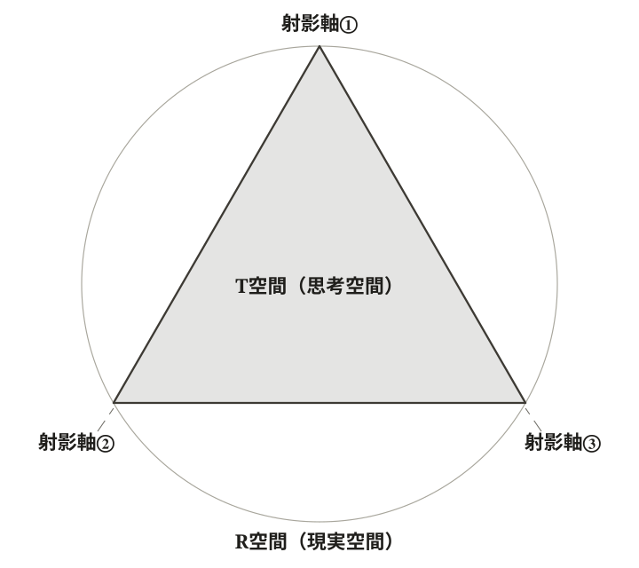

**図1-1**　R空間（円）と T空間（内接三角形）。各頂点が主体の選んだ射影軸に対応する。

各頂点は、主体が保存することを選択した一つの射影軸に対応する（図1-1 の三つの頂点）。射影軸とは、その方向に勾配を定義できる一つの価値軸である。「重要さ」「危険」「美しさ」「効率」「正しさ」——T空間の頂点として立つのは、この種の方向である。

なぜ頂点は有限個なのか。任意の主体の射影は、有限個の軸によってのみ行われる——これを本書では**有限射影原理**と呼ぶ。根拠は、射影を行う主体の側にある。任意の操作は、有限個の区別にもとづいてしか実行できない。無限個の軸を同時に操作する主体は、操作という語の定義上、存在しない。有限射影原理は、認知能力の経験的な限界ではなく、操作が成立するための構造的条件である。

T空間が「凸多面体」と呼ばれるのは、頂点の配置が定まれば、主体の認識が、それらの頂点の重みつき混合として表される領域の内に収まるからである。重みつき混合とは、各頂点がどの程度効いているかの配分である。複数の頂点が部分的に効く中間領域はあるが、認識が T空間の外部へ出ることはない。

R空間は球であり、T空間はその内部に置かれた有限頂点の凸多面体である。頂点は必ずしも球面まで届かない——縮退して球の内側に小さくとどまる T空間もありうる。連続的に全方向へ等しく開かれた球と、離散的な少数の頂点へ重みを集中させた多面体。この幾何学的な差分が、本書の出発点である。

### 失われた方向は戻ってこない

R空間から T空間への射影は不可逆である。T空間の情報から R空間の元の情報を完全に復元することはできない。

これはメルカトル図法と地球の関係でも見える。地図がある作図方法にもとづく射影だという情報が失われれば、その一枚から元の球面を再構成することはできない。そして、たとえ作図方法が分かっていても、地図に描かれなかった極は戻ってこない。

R/T 射影の不可逆性には、二つの含意がある。

第一に、T空間の内部からは R空間の全体像が見えない。T空間に情報を保存できなかった方向——つまり頂点として選択されなかった方向——は、T空間の内部からは存在の感知すらできない。地図に描かれていない大陸が、地図の利用者にとって「存在しないもの」として扱われるのと同じ構造である。

第二に、射影軸を再配置すれば、一部の情報を取り戻すことは原理的には可能である。しかしその操作は、別の方向の情報を脱落させることを伴う。同時に保存できる方向には限りがあるため、ある方向の保存精度を上げることは、別の方向の保存精度を下げることと不可分である。

---

## §1-3　高精度保存域、低精度保持域、脱落域 

### 歪みは位置によって違う

メルカトル図法の歪みは、地図のどの位置でも同じというわけではない。赤道付近では、地図と地球の対応はほぼ忠実である。緯度が上がるにつれて面積拡大の歪みは大きくなり、北極・南極の近傍では歪みは破綻する——極そのものは地図上に描けない。

歪みは位置によって違う。

これは射影一般に共通する構造である。R空間（球）と T空間（多面体）の差分は、T空間内の位置によって異なる大きさを持つ。差分の大小は連続的に変化するが、その連続変化のうちに質的に異なる領域を識別できる。

### 球と多面体の差分から定義される領域——高精度、低精度、脱落

T空間の頂点の近傍では、多面体の表面は R空間の球面に最も近く、両者の差分は最小である。頂点から離れるにつれて多面体の表面と球の差分は拡大する。複数の頂点の中間領域では、いずれの頂点の勾配も十分には到達しない。さらに離れると、多面体の表面と球の乖離が最大になるか、多面体の内部にすら含まれない方向が生じる。

この差分構造のうちに、以下の領域が定義される。

- **高精度保存域**：T空間のうち射影軸（頂点）の近傍であり、R空間との差分が最小の領域。主体はこの領域に勾配を定義し、評価・選好・行為選択の基盤とする。「これは大切である」「あれは重要でない」という日常的判断のすべてが、この領域に属する。
- **低精度保持域**：T空間のうち射影軸の中間領域であり、R空間との差分が拡大しているが、なお T空間の内部から感知可能な領域。情報は保持されているが精度が低く、明確な勾配は定義されていない。射影軸の再配置によって高精度保存域に組み込まれうる——すなわち再編・探索の余地を残している。
- **脱落域**：いずれの射影軸からも遠く、T空間が実質的に被覆していない方向。主体はこの方向の存在を認知できず、勾配の定義はもちろん、存在の感知すらできない。これは「うっかり見落としているもの」ではない——T空間の内部から構造的に到達不能な領域である。

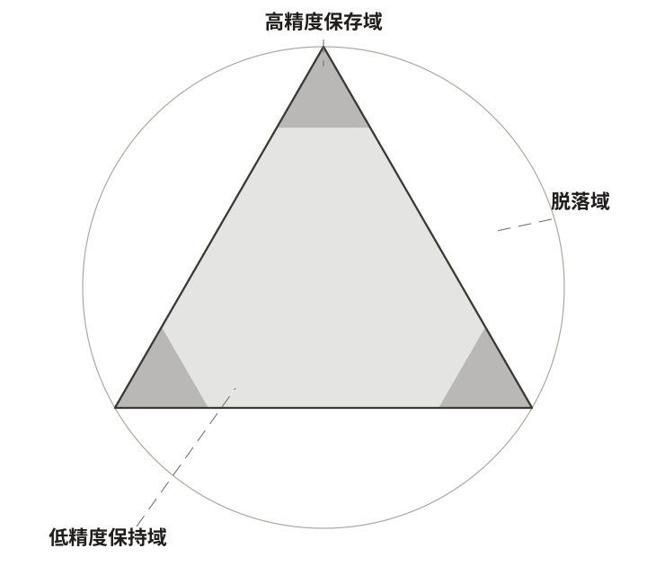

**図1-2**　球と多面体の差分が定める領域。頂点近傍＝高精度保存域、中間＝低精度保持域、多面体の外＝脱落域。

直感的には、低精度保持域は「まだ探索可能な余白」、脱落域は「構造化された盲点」に対応する。

メルカトル図法の例で言えば、赤道付近の正確な領域が高精度保存域に類比的である。緯度の高い面積拡大領域が低精度保持域に類比的であり、地図上に描けない極そのものが脱落域に類比的である。

T空間の三領域は、物理的には連続的な差分構造の上に置かれている。高精度保存域から低精度保持域、低精度保持域から脱落域への移行は段階的に変化する。それでもなお、知的主体はこれを三つの非連続な領域として分節する。虹のスペクトルが連続的な波長分布であるにもかかわらず七色として分節されるのと同じく、限りある認知は連続的な差異を非連続な区分に圧縮する。この「連続的なものを非連続に分節する」働きは、射影による創発の中心的特徴である。

ここで確立されるのは、三領域が射影の幾何学から直接導かれるという事実である。

### 広く取るか、細かく取るか

T空間の幾何学的性質は、広がりと解像度という二つの量によって特徴づけられる。

**広がり**は、T空間が保存している方向の多様さに対応する。射影軸が多く、かつ方向的に分散していれば、広がりは大きい。射影軸が少ないか特定の方向に集中していれば、広がりは小さい。**解像度**は、保存された方向の内部でどの程度細かく区別しているかに対応する。同じ「重要さ」の方向の中で、十段階に区別しているか百段階に区別しているか——その細かさが解像度である。高い解像度は急峻な勾配を生み、急峻な勾配は判断の精密さと出力の大きさを支える。

知的主体が一度に操作できる射影軸の数には限りがある。広く多くの方向を保存しようとすれば、各方向の解像度は下がる。逆に、特定の方向を細かく区別しようとすれば、保存できる方向の数は減る。広がりと解像度のあいだには構造的なトレードオフがある。

そして極は、このトレードオフの外側を示している。極に向かって、地図は面積をいくらでも拡大していく——だが、どれだけ拡大を重ねても、極は平面上に現れない。脱落域は、解像度の不足ではない。採用された方向の内部をどれだけ細かく区別しても、採用されていない方向がそこに現れることはない。細かさで届く範囲は、広がりが先に決めている。

専門分化では、各主体の T空間が特定方向への高解像度化を進める。高解像度化した主体どうしは、それぞれが保存する方向の偏りが強まるため、共通に勾配を定義できる方向が減る。文明的出力の増大と凝集の困難は、同一の構造的過程の二つの面として現れる。

---

## §1-4　他の射影と出会う 

### 射影法をほどく——配置・勾配・関係

射影法という概念をほどくと、三つの特性が現れる——射影軸の配置、勾配の構造、そして複数の射影法のあいだに成り立つ関係。この三つは、別々の論理的レベルにある。

**第一は射影軸の配置である。** 射影を行うためには、保存する方向を選択しなければならない。これは射影操作の定義に含まれる論理的前提であり、いかなる射影法も免れることができない。経験的に観察される配置は主体の歴史と状況に依存するが、配置が不可避であることは経験的事実ではなく構造的事実である。

**第二は勾配の構造である。** 配置が確立されれば、T空間の内部に勾配が立ち現れる。重要なのは、勾配が R空間には存在しないという点である。「何が得で何が損か」という非対称性は R空間の性質ではなく、射影操作が生成するものである。射影軸の配置が変われば、勾配の向きも変わる。勾配は配置の数学的帰結であり、追加前提なしに導出される。

**第三は複数の射影法間の関係である。** ここで初めて「主体が複数存在する」という追加前提が要請される。R空間は等方的であり、有限射影原理のもとで複数の主体が同一の射影軸を選択する必然性はない。したがって、異なる射影法が共存するとき、それらのあいだに構造的関係が成立する。

この三つは論理的な順序をもつが、変化の速度はそれぞれで異なりうる。配置が変わっても勾配が惰性的に残ることがあり、勾配が変わっても配置がなお持続することがある。この、三つが別々の速度で変化しうるという非同期性は、後の章で展開される MANES の三層構造の射影論的基盤となる。

### 二つの射影法のあいだ

メルカトル図法とモルワイデ図法を、机の上に並べてみる。両者は同じ地球を写しているが、何を保存し何を捨てるかの選択が異なる。両者のあいだには、どのような構造的関係が成り立っているか。

異なる射影法 P₁ と P₂ が R空間に対してそれぞれ T₁ と T₂ を生成するとき、両者のあいだには構造的な関係が成り立つ。

まず、**重なり**——T₁ と T₂ が共通に保存している方向。両者が共通の勾配を定義できる領域であり、対話・合意・協働の幾何学的基盤となる。次に、**固有域**——T₁ が保存しているが T₂ が保存していない方向（およびその逆）。一方の主体が価値軸として採用しているが他方が採用していない方向であり、勾配定義方向の構造的非共有として顕在化する。さらに、両者がいずれも保存していない方向がある——**共通脱落域**。両者にとっての構造的無知の領域であり、両者の議論からは原理的に取り上げられない。

ここまでは、二つの射影のあいだに直接成り立つ関係である。これに第三の射影が加わるとき、もう一つの関係が現れる——**媒介**。T₁ と T₂ が直接には重ならなくても、第三の射影 T₃ が両方と重なりを持てば、T₃ を介した間接的な接続が生じうる。この媒介構造は脆弱であり、媒介者 T₃ の消失で接続は断たれる。

これらの関係をメルカトル図法とモルワイデ図法のあいだに当てはめてみる。

**重なり**は、地理的な相対関係に現れる。パリの北、ドーバー海峡の向こう側にロンドンがある。この関係は、メルカトル図法でもモルワイデ図法でも同じように読み取れる。両者は同じ地球を写した別の射影だが、地表上の都市の相対配置という方向は、両者が共通に保存している。

**固有域**は、両者が異なる選択をした性質である。方位の保存はメルカトル図法の固有域であり、面積の保存はモルワイデ図法の固有域である。それぞれの地図は、自分の固有域においては優れた精度を持ち、相手の固有域においては精度を譲る。

**共通脱落域**は、両者がいずれも保存していない方向である。地下の構造——マントルや地殻、地中の水脈、地下資源の分布——は、メルカトル図法にもモルワイデ図法にも描かれない。両者は地表の幾何学を扱う射影であり、地下は両者の議論からは原理的に取り上げられない。

**媒介**の例は、いま読まれているこの文章そのものに現れている。メルカトル図法だけを見ても、モルワイデ図法だけを見ても、それぞれの歪みは捉えにくい。両者を並べて記述する第三の T空間——本書のような言語的記述——が橋渡しをすることで、方位の保存と面積の保存の両方の知見が同時に届く。媒介者がいなければ、メルカトル図法とモルワイデ図法は別々の世界として並存しつづけるだけである。

三者以上の場合、重なりの構造は二値的ではなく、部分的な連合と排除のネットワークとして現れる。媒介の媒介、連合の連合といった高次の構造が生じうるが、それらの基本単位は二者および三者の場合に同定された関係の組み合わせである。

### 自分の歪みは見えない

自分の射影法の歪みは、自分の射影法の内部からは見えない。射影法のすべての部分が同じ規則で歪んでいる以上、当の射影法の内部には「歪み」を判定する基準が存在しないからである。射影法の差異は、射影の結果（T空間の形状）を比較することで初めて認識される。

メルカトル図法だけを眺めていても、グリーンランドが実際よりも大きく見えていることには気づきにくい。モルワイデ図法を隣に置いたときに初めて、メルカトル図法における極周辺の面積拡大は「歪み」として浮かび上がる。逆もまた然りで、モルワイデ図法を一枚だけ見ていても、その方位の歪みは「歪み」として認識されにくい。

この認識の構造から、本書全体に効く方法的含意が二つ導かれる。

第一に、自らの射影法の限界を見るためには、構造的に別の射影法との接触が要請される。単独で完結する自己反省は原理的に不十分である。

第二に、「正しい射影法」という観念は、射影法の外部から判定不能である。R空間は等方的であり、射影軸の選択を独立に規定する基準を持たないからである。

ここに、本書が後の章で展開する一つの中核命題の輪郭が現れる。射影法の差異——主体間の認識の差異、文明間の世界観の差異——は、計算能力の差異にも、誠実さの差異にも還元されない。何が前景化され、何が背景化され、何が認知地平の外に置かれているかの差異に由来する。

### 本書の二つの表記——射影の一例

この構造の一例は、本書自身の表記のうちにある。序論で、文明の運命を分かつ二つの「我ら」を導入した——「操作能力的我ら」と「実存的我ら」、記号では O と E。同じ二側面を、本書は二通りに書く。そして、この二つの書き方は、それ自体が二つの射影法である。

記号 O・E で書くとき、前景化されるのは、それらを変数として扱う操作である——不等式の符号、図形の上での動き、構造のモデル化。背景に退き、ときに認知地平の外へ脱落するのは、「誰と共に在るか」という実存の手触りである。

「操作能力的我ら」「実存的我ら」と書くとき、前景化されるのは、その実存の手触りである——「我ら」と「彼ら」、そして「それら」とのあいだに引かれる境界。背景に退くのは、それらを幾何や数式として扱うことで得られる、論理的・幾何的な操作の見通しのよさである。

同じ対象でありながら、一方の射影法が前景化するものを、他方は背景化する。どちらの表記も、自身が背景化しているものを、その内部からは見ない。本書が二つの表記を併用するのは、装飾ではない。一方だけでは、必ず一方の側が脱落するからである。

### 本書と専門の視界——媒介のもう一つの例

本章は冒頭近くで、量子力学に短く触れた。あの素描が何を行ったのかを、いま導入した語彙で言い直すことができる。量子力学の内部には複数の解釈が並立しており、それぞれが一つの射影法（ T空間）である。素描が保存したのは、それらの T空間が共通に保存している方向——重なり——だけであった。各解釈が単独で保存している方向、すなわち論争の中身が宿る固有域は、並立しているという事実だけを残して、まとめて背景に退いた。だから、量子力学の根幹にかかわる領域で、本書の記述が持つ情報量は限定的である。これは筆の不足ではなく、重なりだけを取るという選択の幾何学的な帰結である。ここから、本書への批判が生まれうる。

重なりだけを取ったことによる薄さは、本書の内部からは薄さとして見えない（専門外の読者は、さほど違和感なく冒頭を読み進めたのではなかろうか）。自分の射影法の歪みが内部から見えないのと、同じ理由による。それが見えるのは、固有域を保存している射影法——量子力学の専門的視界——と接触したときである。専門家がこの素描を「表面的で浅い」と評するなら、その評は、構造的には正確な報告である（専門家の読者は、本章冒頭を看過しがたく感じたのではなかろうか）。本書の T空間が、その方向に薄いことは事実だからである。そして、本書の記述に対して評価が「浅い」という形を取れること自体が、当の方向が脱落してはいないことを示している。脱落した方向は、浅いとすら言われない——浅さを指摘できるのは、精度は低くとも保持されている方向についてだけである。

この接触の瞬間に、媒介が生まれる。先に、メルカトル図法とモルワイデ図法を橋渡しする第三の T空間として、本書のような言語的記述を挙げた。今度は、役割が逆になる。専門家の応答こそが第三の T空間であり、本書が背景に退けた固有域と、本書の読者とを橋渡しする。本書は、媒介する側にだけ立つのではない。媒介されなければ届かない側にも、立つ。

「自分の射影法の限界が内部からは見えない」というこの幾何学的事実は、後の章で、系が自身の動態を事後にしか観察できないという、より動的な形で再演される。

---

## §1-5　最小モデルを掴んだ——次元の追加はこの先で行う 

本章は、世界を切り取る幾何を、できるだけ潰した形で語ってきた。二次元の地図と、図1-1 に示した頂点の数が最小の多面体、すなわち三角形に潰してきた。これは、基底となる概念——射影、三領域、射影軸＝頂点、固有域と共通脱落域——を、まず確実に掴んでもらうための単純化である。そのうえで、複数主体の関わりを二者という最小組み合わせで示唆した。

### 潰し方を緩めることには、得るものと、失うものがある

次元を上げて潰し方を緩めれば、平らな最小モデルでは一つに見えていたものが、いくつかに分かれて見えてくる。まず、軸どうしの絡み。最小モデルでは頂点（射影軸）を独立に立てたが、軸の数が増えると、軸は互いに直交せず絡み合い、一つを動かすと別の軸が連れて動く。次に、複数主体間の相互作用を導入すると、それぞれの「広がり」の偏りが、全体の焦点を一方へ引き寄せる力として現れる。そして、平らな像がもつ深さ。二次元に潰した像では一点に重なって見えるものが、潰す前の立体では幾段にも分かれている。

これらは、視界を広げると同時に、見通しを悪くする。様々なものを同時に視野へ入れようとすれば、最小モデルのもっていた掴みやすさは失われる。だから本章は、まず三角形に潰した最小モデルを固めることから始めた。三次元以上への拡張——軸の絡み、射影の重なり、像の深さ——は、本書全体を通じて、必要な箇所で段階的に加えていく。

ここで、本章の最初の一文に戻る。

### 「どんな知性も、世界を完全に写し取ることはできない。」

平面上の三角形に潰した最小モデルは、読者にも「潰しすぎ」と感じられたのではないだろうか。その感覚は正しい。しかし、「ならば、潰す前の現実をそのまま広げて見ればよい」という方へ向かうなら、その先には行き止まりがある。現実は、超高次元の時空間のなかで、無数の主体がそれぞれに独立して動いている。宇宙——本書が R空間として概念化した現実——は、「宇」（四方上下のあらゆる空間）と「宙」（過去から未来までのすべての時間）を包含する。宇宙の次元のすべてを展開し、ありのままに認識することは、いかなる知性にもできない。最小モデルが圧縮の一方の極（潰しすぎ）だとすれば、その反対の極——完全な展開——は、そもそも何者の手にも届かない。

だから、本書がこれから次元を加えていく作業は、潰しすぎた像から「ありのままの現実」へと圧縮を解いていくことではない。一つの圧縮から、ある程度潰し方を緩めた——それでもなお潰された——別の圧縮へと、選んで移っていくことである。選び、捨て、残りで理解する。これは制約ではなく、理解という営みの構造そのものである。

---

# 第2章　圧縮から創発する世界——情報保持と三条件 

切り取るとは、捨てることだった。そう聞けば、切り取られた世界は、捨てたぶんだけ貧しくなっていくように思える。

川は、昨日と同じ水を一滴も含まないまま、今日も同じ名で呼ばれる。街は、住む人が入れ替わりながら、同じ街でありつづける。逆に、流れの止まった川は川筋の跡になり、人の絶えた街は廃墟になる。在りつづけているものは、動きつづけているものであるように見える。動きつづけていることに、豊かさを感じる。

**一分前の炎と、いま目の前で揺れている炎は、なぜ「同じ炎」なのか。**

---

## §2-1　動いている系——同一性は保存ではなく再生産である 

### ろうそくの炎——物質は入れ替わり、相関は続く

ろうそくの炎を見つめてみよう。一分前と同じ炎が、いまも目の前にある。同じ高さで、同じ色で、同じように揺れている。それでも、一分前にそこにあった燃焼ガスはとうに天井のあたりへ消えており、いま見えている炎は別の蝋と別の酸素から作られた別の燃焼である。物質は次々と入れ替わっている。それでもなお、私たちはそれを「同じ炎」と呼ぶ。

「同じ」と呼ぶ根拠は、物体としての連続性ではない。物体としては、炎は一秒ごとに入れ替わっている。にもかかわらず「同じ」と呼ばれるのは、燃焼という動態が同じ場所で同じ形をとって繰り返されているからである。すなわち、相関の構造——蝋・酸素・熱・光が結びつく仕方——が、時間を越えて再生産されているからである。

### 恒星・生物・神宮——階層を貫く再生産

同じことが、ろうそくの炎にとどまらない。

夜空の恒星は数百万年、ときに数十億年にわたって輝きつづける。だが恒星の内部では、毎秒膨大な量の水素が融合してヘリウムに変わり、その過程で生成された放射が外層を支えている。静水圧平衡と呼ばれる動的バランスが、絶えず崩れては立て直されている。同じ星と呼ばれるものは、同じ物質ではなく、同じ動態である。

生物の身体も変化していく。タンパク質は分解と合成を繰り返し、細胞は世代交代を繰り返す。生まれてから死ぬまでのあいだに、身体を構成する原子の多くが入れ替わる。それでも、その一人は同じ人物として扱われる。「同じ」の根拠は、入れ替わらない実体ではなく、入れ替わりが特定の規則性のもとで起こりつづけることである。

伊勢神宮では、二十年に一度、社殿が建て替えられる。同じ神宮と呼ばれるのは、建物としての連続性ではなく、建て替えという動態が特定の規則性のもとで繰り返されているからである。690年に最初の式年遷宮が行われて以来、この動態が継続している。物体は新しくなる。動態は古い。

### 動いている系の同一性は再生産である——存在の操作的条件

これらの観察は、一つの構造へ束ねることができる。証明ではない——階層の異なる四つの系が同じ形を示す、という観察の束ねである。**動いている系の同一性は、保存ではなく再生産である。**「同じだ」と言える根拠は、入れ替わらない実体ではなく、相関の構造が時間を越えて繰り返し立ち上がることである。

ここで、自分自身の呼吸を意識してみよう。

仮想してみる。吸った息を一切吐かない肺がもしあれば、その肺はすぐに膨らみきって動かなくなる。逆に、吸った息が一切留まらない肺があれば、酸素は血液に渡らず、身体は窒息する。実際の肺は、吸うと吐くを絶えず交代させ、その動態の中で酸素と二酸化炭素を交換しつづけている。一つの呼吸は、一つの動的均衡である。

そして、その呼吸が止まれば、「私」と呼ばれていた一個の動態は存在しなくなる。

ここに、本書が採る存在の見方が立ち上がる。何かが「存在する」と呼ばれるのは、それが他と区別でき、時間を越えて再び同じものとして指し示せるからである。瞬間ごとに区別不能になり、再同定できないものは、私たちの実践においては「存在する」とは呼ばれない。区別可能性と再同定可能性——この二つが、何かを存在と呼ぶための操作的な条件である。一つの系が「動いている」とは、この再同定を、みずからの相関構造の再生産によって時間の中で支えていることをいう。流れが一時的に止まっても、再び動きだす相関の型が保たれているなら、その系はなお動いている系である。止まって二度と型に戻らないとき、それは動いている系であることをやめる。

ここで一つだけ留保を置いておきたい。存在には、本書が扱う範囲を超える次元がある。何かが「ある」こと自体が、私たちの実践的な区別を超えてどこまで遡れるか——形而上学的な意味での存在は、本書の射程外である。本書はその次元の議論があることを承知しているが、そこには踏み込まない。

### 情報保持——相関構造の動的再生産

存在をこのように操作的に見るとき、存在の維持とは、相関構造を時間の中で再生産しつづけることに等しい。本書はこれを**情報保持**と呼ぶ。情報保持はエントロピーの減少ではない。部分系のエントロピーは増大してよい。蝋は灰になり、恒星は元素を重くしていき、細胞は熱を捨てる。それでもなお、全体として相関の構造が再生産され、過去との区別が可能であるならば、情報は保持されている。

逆に、相関が完全に消散し、過去状態との区別が不可能になったとき、その対象はもはや存在として扱われない。差異が差異として持続することと、存在として扱われることは、操作の上では同じである。

ふだん「自分」と呼ばれるもの、家族と呼ばれるもの、文明と呼ばれるものは、いずれもこの意味で動いている系である。物体としての実体ではなく、動的に再生産される相関構造である。

---

## §2-2　動いている系の条件——Flux・Stock と HZ 

### 時間の矢と摩擦——消えないコスト

動いている系が動きつづけるためには、何が要るのか。

物体としての連続性ではないことは前節で見た。同じ場所で同じ動態が繰り返されることが、同じ系と呼ばれる根拠だった。問題は、その繰り返しがどのような条件のもとで可能になるか、である。

まず、世界に組み込まれた根本的な前提から始める。

時間の矢——熱力学第二法則が定式化する不可逆性——は、孤立した系の無秩序が単調に増えることを要請する。コップに落ちた水滴は広がるが、自発的に元の水滴に戻ることはない。割れた皿はひとりでに復元しない。砂時計の砂は下に落ちるが、上に戻すには別の力が要る。過去と未来は対称ではない——過程は一方向に進む。

この不可逆性は、いかなる動いている系も逃れられない。物理系は法則そのものとして従い、化学系は反応の方向性として従い、生命系は老化として従い、生態系は種の遷移として従う。

不可逆性から、一つの重要な帰結が出る。**秩序の維持にはコストがかかり、そのコストは消滅しない。** 支払いは消えず、記載は残りつづける——不可逆性は、消せない帳簿として働く。

本書はこの構造的に避けられない不可逆コストを、**摩擦**と総称する。摩擦は、物理的な接触面に限らない。化学反応における活性化エネルギーの散逸、生物の老化、生態系における環境調整のコスト、社会的な調整のコスト——いずれも、区別された系どうしが接続を保ちながら動くときに不可避に生じる不可逆コストとして、同じ構造をとる。摩擦のない世界では区別された個物そのものが立ち上がらず、摩擦が極大の世界では区別可能性が散逸する。動いている系として持続するとは、摩擦を消そうとせず、しかし暴走させもせず、構造的に担いつづけることに等しい。

### 開放系と勾配——秩序が立ち上がる場所

しかし、世界には秩序が現にある。恒星は燃え、生命は代謝し、生態系は循環している。これらの秩序は、第二法則と矛盾しているわけではない。鍵は、それらが**開放系**であることにある。

孤立系であれば、無秩序は単調に増えるしかない。だが開放系は違う。系の境界を越えて何かが流れ込み、何かが流れ出している。流れ込む側が局所の秩序を組み上げ、流れ出す側が無秩序を外部へ運び出す。系の内側のエントロピーは、外部への放出と引き換えに、減少することができる。

ここで前提となるのが**勾配**である。エネルギーポテンシャルの差がなければ、流れは起きない。山と平地の高低差があるから水は流れる。高温の星と冷たい宇宙のあいだに温度差があるから熱が放射される。栄養が濃いところと薄いところの差があるから物質が拡散する。勾配があるから流れがある。流れがあるから局所秩序が組み上がる。

そして勾配の消費は、それ自体不可逆である。水は流れ落ちたら自分では上に戻らない。星の核融合が進めば、燃料は減って戻らない。**開放系は勾配を消費しながら秩序を保つ。** 勾配が枯れたとき、秩序の維持は終わる。

### Stock と Flux——蓄積と流れ

ここまでで、動いている系の二つの面が見えてくる。

一つは、**蓄積されているもの**。星の質量、生物の身体、生態系の生物量、文明の制度——いずれも、過去に流れ込んだものが固定化された結果である。本書はこれを **Stock** と呼ぶ。

もう一つは、**流れているもの**。星の放射、生物の代謝、生態系の栄養循環、文明のエネルギー消費——いずれも、いま単位時間あたりに通過している量である。本書はこれを **Flux** と呼ぶ。

その流れが**どこから来るのか**は、一つの系を単独で見ているかぎり問えない——供給源は系の外にあるからである。

Stock と Flux の区別は比喩ではない。保存則——エネルギーや物質や情報の量が保存されるという原則——のもとでは、ある時点での蓄積量は、初期値に、それまでに流れ込んだ量を足し、流れ出した量を引いたものとして書ける。蓄積と流れの区別は、この収支の式に支えられている。そして開放系では、蓄積されているものと流れているものは必ず両方が同時に存在し、両者の比は時間とともに変動する。

### HZ（創発可能帯域）——複数の安定状態が共存する範囲

この Flux と Stock のバランスが、動いている系の振る舞いを規定する。

仮想してみる。Flux だけが極端に大きく、Stock がほとんど形成されない系を考える。流れ込みは激しいが、構造として固定される前にすべてが流れ去ってしまう。激しい乱流の中では、渦は立ち上がる前にちぎれる。ここでは秩序は生まれない。

逆に、Stock だけが極端に大きく、Flux がほとんど通らない系を考える。蓄積は分厚いが、新しい流れが入らないために、外部の変動に応答できなくなる。氷河期に閉じ込められた湖の底のように、構造は固定したまま動かない。ここでも秩序は更新されない。

これら二つの極端のあいだに、Flux と Stock の両方が同時に成立している帯域がある。両極端の排除は、帯域がありうる場所を両者のあいだに絞る。その帯域が空でないことを示すのは、観察である——恒星は燃え、生命は代謝し、動いている系は現に持続している。流れ込みは構造を組み上げ、構造は流れの一部を蓄える。蓄えられたものが次の流れを方向づける。複数の動的安定状態が共存し、系はそのあいだを行き来する。**この帯域においてのみ、動いている系は動いている系として持続できる。**

本書はこの帯域を **HZ（Heterostable Zone：創発可能帯域）** と呼ぶ。Hetero は「異なる」を、stable は「安定な」を意味する。複数の安定状態が動的に共存する範囲、という含意である。**摩擦の側から見れば、HZ は摩擦適合帯——摩擦が零でも極大でもない中間帯——の別名である。**

### HZ⇧ と HZ⇩——外れる二方向

HZ から外れる方向は、二つに区別される。

一つは Flux 過剰の方向——蓄積が追いつかず、流れが構造を散逸させてしまう側。本書はこれを **HZ⇧（散逸方向）** と表記する。

もう一つは Stock 過剰の方向——流れが詰まり、構造が固定して動かなくなる側。本書はこれを **HZ⇩（硬直方向）** と表記する。

これらは対称ではない。散逸では構造そのものが立ち上がらず、硬直では立ち上がった構造が更新されないまま朽ちる。しかしいずれの方向に滑落しても、動いている系としての持続は終わる。

### 階層を貫く HZ——たとえば、恒星・細胞・文明

恒星を例にとろう。恒星の内部では、重力が星を潰そうとし、核融合による放射圧が外へ押し返している。両者の釣り合いが静水圧平衡である。重力が勝てば星は潰れ、放射圧が勝てば外層は吹き飛ぶ。長く輝く星とは、この釣り合いを HZ 内に保ちつづけている星である。この釣り合いは一点ではない。水素の燃焼からヘリウムの燃焼へ、恒星は燃料に応じて異なる準平衡のあいだを移りながら、そのつど釣り合いを立て直していく。

生命でも同じ構造が見える。細胞は外から栄養を取り込み、内部で代謝を回し、廃熱と老廃物を排出する。流入が止まれば内部の濃度勾配は崩壊し、代謝は止まる。逆に流出経路が塞がれば、廃熱が蓄積し、酵素反応が破壊される。細胞が細胞として続くのは、流入と流出が HZ 内に維持されているあいだに限られる。

恒星にも、細胞にも、生態系にも、文明にも、HZ がある。階層が違えば、HZ の中身は質的に違う。だが、複数の動的安定状態が共存しうる帯域がそれぞれに存在し、その帯域の外では動いている系としての持続は維持できない、という構造は同じである。

HZ 内に留まりつづけることは、自動では保証されない。系は外乱を絶えず受ける。蓄積は変化し、流れは増減する。HZ の中で偶然に位置取りができたとしても、何もしなければ、いずれ HZ から外れる。何が HZ 内での動的な留まりを支えるのか。

---

## §2-3　動的安定化の三条件——LEFFLA・HIAM・フィードバック時間 

### 三つの滑落経路——散逸に一つ、硬直に二つ

問題は、HZ の外へ向かう滑落の経路が一つではない、という点にある。だが、経路が無数にあるわけでもない。

§2-2 で示したとおり、HZ から外れる方向は、Stock と Flux の収支という保存則から二つに定まる。HZ⇧（散逸方向：Flux 過剰）と HZ⇩（硬直方向：Stock 過剰）である。この二分は、系の側の選択には依らない。

一つ、位置づけを断っておく。Stock と Flux の比そのものは、これから見る三つの条件の一つではない。系が帯域のどこに居るかを測る、座標である。

これらの滑落を防ぐ三つの条件を、本書は番号順に呼ぶ。第一の条件（即時確定の回避＝LEFFLA）・第二の条件（不要構造の選択的終結＝HIAM）・第三の条件（適切なフィードバック時間）である。以下、散逸方向・硬直方向の各経路がどれに対応するかを見ていく。

散逸方向（HZ⇧）への滑落は、流れが構造に結びつかないまま抜けていく事態として現れる。これを防ぐのが、応答が対象の変化に間に合う時間整合——第三の条件である。

硬直方向（HZ⇩）は、二つの異なる起点から生じる。一つは、入ってきた流れが即座に一つの状態へ畳み込まれ、状態空間が単調に狭まっていく硬直。もう一つは、役目を終えた構造が場所を占め、新しい流れの通り道を塞いでいく硬直。前者を防ぐのが即時確定の回避——第一の条件、後者を防ぐのが不要構造の選択的終結——第二の条件である。

散逸方向に一つ、硬直方向に二つ——ここまでで、三つの滑落経路と、それぞれに対応する三つの条件が取り出される。ただし、硬直方向がちょうど二つの経路に尽きることを、本書は論証しない。二つは、状態空間の狭まり方——入口での畳み込みと、内部での構造累積——の別の起点として区別されるが、これが硬直の原因を汲み尽くすという保証は、本書の射程の外にある。

### もう一つの経路——再生産の三契機から

同じ三条件は、まったく別の経路からも取り出される。動いている系の同一性は、相関構造の動的再生産にあった（§2-1）。この再生産が成り立つには、三つの契機が同時に要る——構造が崩れずに保たれること、新たな相関が編成されうる余地があること、変動に対して相関が時間内に整えられること。保たれなければ再生産する当のものが失われ、余地がなければ再編成が止まり、時間内に整わなければ変動が再生産を追い越す。ここまでは、滑落経路と独立に立つ。だが、それぞれの契機をどの機構が担うかは、契機の側からは一意に定まらない。新たな相関の余地は第一の条件（LEFFLA）が、時間内の整えは第三の条件（フィードバック時間）が支える。ここに揺れはない。揺れるのは保存である。流れと蓄えの均衡を法則が自動で保つ層では、保存は均衡そのものが担い、専用の機構を要さない。系が保存を能動的に担わなければならない層では、それを支えるのは不要化した構造を解く第二の条件（HIAM）である。場所を塞ぐ構造を解かないかぎり、保つことは硬直に転じるからである。

滑落経路の側からも、再生産の契機の側からも、要るものは三つ——この数え上げは一致する。割り当てが層に依ることの意味は、本節の終わりで戻る。以下、三つの条件を順に取り出す。

### 第一の条件——LEFFLA（即時確定の回避）

入力に対する応答が、即時に一つの確定した状態へ収束する系を想像してみよう。複数の状態をとりえた配置に何かが入ってくると、それを瞬時に一つの状態へ畳み込んでしまう系である。

過冷却の液体に微小な擾乱が入ると、瞬時に結晶化が始まる。結晶軸の方向や格子の構造は、その時に決まる。一度決まれば、固体になった部分は液体の状態空間を再び探索することはできない。別の温度域へ運び込むまで、固定したままである。

似た構造は他の階層でも見られる。化学反応における不可逆な分岐——複数の反応経路があった分岐点で一方が選ばれると、その分岐は閉じ、他の経路はもはやたどれない。生命の発生における分化——多能性を持っていた細胞が組織細胞として確定すると、他の分化経路はほぼ閉じる。階層によって、確定の早さや戻しにくさの度合いは違う。だが、入力を即座に一つの状態へ畳み込むことが、系の動的自由度を奪っていく、という構造は同じである。

この畳み込みが繰り返されると、何が起こるか。

可能性が並んでいた状態空間が、入力ごとに一点へ収束していく。新しい流れが入っても、すでに固定された配置で受け止められ、再編の余地は残らない。Flux は減衰し、構造は単一の配置へ捕捉される。系は HZ⇩ 方向——硬直方向——へ滑落する。

これを防ぐためには、何が要るか。入力を即時に確定へ送らない、という境界条件が要る。複数の状態が並んでいる配置を、一定時間「まだ畳み込まない」かたちで保持する余地が、系の側に確保されていなければならない。

本書はこの境界条件を、**LEFFLA（Latent Evaluative-free Floating Locus of Abeyance：評価自由浮遊的懸架点）** と呼ぶ。T空間の低精度保持域（「世界を切り取る幾何学」第1章 §1-3）に対応する構造を、いま動的境界条件として正式に取り出した形である。LEFFLA は、即時の確定から免れた未確定の余地を、系が時間の中で持ちつづけるための条件である。曖昧さを許容することそのものではなく、未確定の余地が一定時間機能しつづけるための、操作的な境界条件である。

### 第二の条件——HIAM（不要構造の選択的終結）

LEFFLA があり、入力が即時に確定へ送られない系を考える。だが、その系には別の硬直経路が待っている。

過去に立ち上がった構造が、不要化した後も残りつづける場合である。構造が形成されることそれ自体は、動いている系の働きである。問題は、形成された構造が、用途を終えた後にどうなるか、にある。

不可逆性の前提（§2-2）のもとでは、構造は自然には消えない。コップに広がった水滴がひとりでに戻らないのと同じように、いったん立ち上がった構造は、自分から崩壊することはない。崩壊させる別の操作が要る。

その操作がなければ、構造は累積する。

川は河口に砂を運び、運ばれた砂は堆積する。堆積は本来、川の働きの帰結である。だが、堆積が能動的に取り除かれなければ——洪水であれ、潮汐であれ——徐々に河口を埋め、流路を狭め、最終的に川そのものの動きを変えてしまう。

恒星の内部では、核融合の進行に伴って重い元素が中心部に蓄積する。生成された鉄は、それ以上の核融合に向かない。鉄の蓄積が一定量を超えると、放射圧による外層の支えが追いつかなくなり、星は構造そのものを維持できなくなる。

化学反応の容器では、目的とする反応の副生物が容器内に蓄積する。副生物が一定濃度を超えると、本来の反応経路は阻害される。生物の老化では、酸化ダメージを受けたタンパク質や機能を失ったオルガネラが、代謝過程で完全には除去されない。除去機構の能力を超えると、累積したダメージが代謝そのものを阻害する。

これら——河口の砂、星の鉄殻、容器の副生物、損傷タンパク質——には共通の構造がある。過去に立ち上がった構造の蓄積が、新しい流れの通り道を塞ぎ、系の自由度を枯渇させる。Stock は単調に増え、Flux の通る余地は減っていく。系は HZ⇩ 方向の硬直へ滑落する。

LEFFLA の欠落による硬直は、新しい入力が即時の確定で押し潰される硬直だった。構造累積による硬直は、古い構造が場所を占めて新しい入力の通り道を塞ぐ硬直である。経路は違うが、結末は同じ方向である。

これを防ぐためには、何が要るか。役目を終えた構造を、有限時間内に終結させる機構が要る。何を終結させるかの選別を伴う、能動的な終結機構である。

本書はこれを、**HIAM（Homeostatic Informational Apoptosis and Mourning：情報的アポトーシスと喪）** と呼ぶ。アポトーシスは生物学で細胞の能動的な自死を指す語、Mourning は喪を指す語である。いずれも、終結が無秩序な崩壊ではなく、選択的・段階的な過程であることを示す含意を持つ。本書ではこれを情報的・構造的なレベルにまで拡張して用いる。

### 第三の条件——適切なフィードバック時間

LEFFLA があり、入力が即時に確定へ送られない。HIAM もあり、不要化した構造は終結する。だが、それでも系は持続しない場合がある。

系の応答が、対象の変化の時間スケールと整合しない場合である。

ある変数の変動が、それを修正する別の経路を引き起こし、修正が時間遅延を経てもとの変数に戻ってくる。これはフィードバックの一般構造である。変動と修正がループの中で完結することで、系は外乱を吸収し、HZ 内に留まることができる。

このループの時間が、対象となる変数の典型的な変化時間より長いとき、何が起こるか。

修正が返ってくる頃には、対象とする変数はすでに別の状態に動いている。返ってきた修正は、現在の状態に対しては的外れになる。系のエネルギーは、的外れな修正の繰り返しに費やされ、有効な調整に結びつかないまま外へ抜けていく。

振り子は重力と慣性のあいだのフィードバックで動く。制振機構が振動の周期に対して遅すぎれば、振動は減衰せず、外部から加えられたエネルギーは振幅の増大として散逸する。

河川の流路調整は、侵食と堆積のフィードバックによって行われる。だが、地殻変動が川自身の調整時間より速く起きたとき、川は地形変化に追いつかず、流路を定められないまま暴れ、土砂を散逸させる。

恒星の核融合と外層の収縮のフィードバックは、両者の時間スケールが整合しているあいだ、星を HZ 内に保つ。整合が破れたとき——超新星爆発の最終局面のように——外層は方向を失い、エネルギーは大規模な散逸として放出される。

これらの場合、Flux は途絶えていない。むしろ過剰に投入されている。だが、フィードバックの遅延によって有効な構造形成に結びつかないまま、系外へ抜けていく。これは HZ⇧ 方向——散逸方向——への滑落である。

これを防ぐためには、何が要るか。応答が対象の変化時間内に返るという、時間スケールの整合が要る。本書はこれを**適切なフィードバック時間**と呼ぶ。フィードバック時間そのものを系がつねに制御できるとは限らない。だが、フィードバック時間が対象の典型変化時間を超えるとき、修正は空転する。この時間整合の条件は、独立に成立しなければならない。

一つ、補っておく。フィードバック時間には、対象の変化時間より短くなければならないという上の制約だけでなく、消すことのできない下限もある。帰結が系に返るには有限の時間がかかり、情報や因果の伝わる速度に上限がある以上、いま系に届いている帰結はつねに過去に発したものの一部である。まだ届いていない帰結が、飛行の途上にある。応答の遅延をゼロにすることは、原理的にできない。したがって、遅延を消して即時に確定しようとする構えは、まだ届いていない帰結まで含めた全体をいま手にしているという、達成不能な視座を系に要求することになる。さきに置いた LEFFLA が、まだ評価の定まらないものを抱えておく余地であったことを思えば——それは、この消せない遅延を吸収する余地でもある。

もう一つ、この条件が担っているものがある。帰結が時間内に返ることは、散逸を防ぐだけではない——他の二つの条件が選別として働くための情報を、供給してもいる。何を未確定のまま抱えておくべきで、何を確定してよいか。どの構造が不要化していて、どれがまだ生きているか。これらの区別は、応答の帰結が系に返ってくることによってしか更新されない。帰結が返らないまま、あるいは対象が別の状態へ動いたあとで返るとき、系は保留すべきものと終結すべきものを分ける根拠を失い、過剰な保留と過剰な終結が混在しはじめる。第一と第二の条件は、この意味で、第三の条件が働いていることを作動の前提として含んでいる。

### 三条件は適正な帯である——欠けても過ぎても外れる

三条件はいずれも、欠けても過ぎても系を HZ から外す——適正な帯として働く。即時確定の回避が過ぎれば、確定すべき入力までが保留されつづけ、構造が定まらない。選択的終結が過ぎれば、まだ安定化を待つべき構造まで早期に断たれる。時間整合が速すぎれば、過補正が振動を生む。第一の条件が「未確定の余地」、第二が「終結」、第三が「時間の合致」として、いずれも中間の帯にあるとき、系は HZ に留まる。ここまで各条件を「欠けたとき何が起こるか」で導いてきたが、それは帯の下側の縁であって、上側の縁もまた滑落へ通じている。なお、適正な範囲にある終結は、滑落を防ぐだけのものではない。解かれた場所が次の編成の余地となるという意味で、終結は再編の前提でもある。

### 互いの機能を肩代わりできない

LEFFLA が欠落すると、即時確定によって状態空間が単調に狭まり、HZ⇩ 方向の硬直が生じる。HIAM が欠落すると、構造累積によって自由度が枯渇し、これも HZ⇩ 方向の硬直が生じる。フィードバック時間が対象の時間スケールと整合しないと、応答の空転によって Flux が散逸し、HZ⇧ 方向への滑落が生じる。

それぞれの条件が、それぞれ独立な滑落経路に対応している。これら三つの条件は、互いに代替できない。

ランダムな揺らぎが、LEFFLA を代替するように見えるかもしれない。だが、ランダムな揺らぎは、どの状態を未確定のまま保持するかを区別しない。ノイズの流入は、可能性空間を保持するのではなく、無方向に拡散させるだけで、構造をともなった再編可能性を残すことはできない。

自然な減衰が、HIAM を代替するように見えるかもしれない。だが、自然減衰は、どの構造を先に解くかを区別しない。時間の経過に任せた減衰は、不要化した構造と必要な構造を分けることなく、両者を一様に劣化させる。

複製と選別——不要な構造を持つ個体を淘汰し、持たない個体を残す——も、HIAM を代替するように見えるかもしれない。だが淘汰は、個体の全体を単位とする選別であって、一つの系の内部で、どの構造を残しどれを解くかを分けるものではない。系内部の選択的終結と、系そのものの選別とは、別の水準の操作である。急速な成長による希釈——古い構造を、新しい構造の増設で相対的に薄める——も、HIAM を代替しない。希釈は構造を解いていない。累積そのものは残り、成長が止まればふたたび場所を塞ぐ。

高度な予測機構が、フィードバック時間を代替するように見えるかもしれない。だが、予測は、応答が実際に返ってくることそのものではない。どれほど精緻な予測も、帰結が系に到達して系の状態を更新しないかぎり、空転する応答は空転したままである。むしろ、予測の精緻化は、帰結の不在を見えにくくするリスクをともなう。

三つの条件は、それぞれが特定の滑落経路に対応し、互いの機能を肩代わりすることはできない。

ただし、肩代わりできないことは、三つが同格に並ぶことを意味しない。いま見たとおり、第三の条件は、第一と第二が選別として働くための前提でもある——三条件のあいだには、作動の順序がある。だが、前提であることは、代替できることではない。帰結が時間内に返っていても、未確定を抱える余地がなければ入力は即時に確定へ送られるし、終結の機構がなければ不要化した構造は累積していく。順序があることと、置き換えられることとは、別である。非冗長性は、三つが対等であることにではなく、それぞれが特定の滑落経路を単独で塞いでいることに立っている。

### どの水準で働くか——法則が担う層と、系が担う層

一つ、条件がどの水準で働くかを断っておく。これらは、系が能動的に果たすべき作業とは限らない。物理の基底に近い層では、三条件は法則の側で自動的に満たされる。対称性の破れが未確定の余地を、核融合の進行が過剰物質の消費を、光速と距離が応答の時間を、系が何もせずとも与える。そうした系では、三条件は「満たされている」のであって「担われている」のではない。三条件が能動的な作業として問われるのは、法則が自動では与えない層——生命が代謝コストとして、文明が制度として担う層——である（層ごとの担われ方の違いは §2-6 で扱う）。対流や渦のような純粋な流れの構造が、未確定の余地や選択的終結を能動的に持たぬまま流れつづけるのは、それらの条件が法則の側で処理されているからである。三条件の反例ではない。

### 二つの経路が一致するところ——要るものは三つ、担い手は層による

これら三つは、互いに肩代わりできない——非冗長である。そして二つの経路は、要るものが三つであることについては一致した。一致しなかったのは割り当てである——どの契機をどの機構が担うかは、層によって異なって返ってきた。これは導出のほころびではなく、直前に見た区別——法則が担う層と、系が担う層——が、割り当ての水準に現れたものである。本書はこの一致と食い違いの双方を根拠として、三条件を HZ 内維持の条件集合として据える。ただし、これが可能なすべての条件を汲み尽くしていること——完全であること——は、本書の射程では証明しない。第四の条件がありうるなら、それはおそらく三条件のいずれかの細分化か、その複合的な実装として現れるだろう。だが、これを閉じた形で示すことは、構造記述の限界の外にある。三条件は、二つの経路の一致する範囲に支えられた構成として据えられ、その完全性は開かれた問いとして残す。

三つが揃ったとき、系はようやく、HZ 内に動的に留まる素地を持つ。

三つの条件を並べて見ると、抗いの向きが二重であることも見えてくる。散逸（HZ⇧）は、系の外なる流れと時間の矢が系を解こうとする向きに働く。硬直（HZ⇩）は、外から来るのではない——即時確定も構造累積も、系自身の作動が内側から生む傾向である。動いている系は、外からの圧力と、自分自身の傾向という、二つの向きに同時に抗いながら、HZ 内に留まっている。

---

## §2-4　動的視界の中での圧縮——内と外を切り分ける構造 

### 「外」を持たない系——二つの極限的な孤立

「開放系」（§2-2）には、一つの暗黙の前提があった。**「外」がある**という前提である。Flux が流れ込むためには、流れ込む先と元になる場所が要る。流れ出るためには、流れ出す行き先が要る。系の中と外が区別できなければ、Flux も Stock も意味を持たない。

「外」を持たない系は、存在しうるのだろうか。

字義通りに考えれば、孤立系——周囲から完全に切り離された系——がそれにあたる。ただし、現実の物理的世界に、この意味での厳密な孤立系はほとんどない。実験室で短時間だけ近似的に成立することはあっても、宇宙の中の何ものも、無限に長くは外部と切れていない。

しかし、もう一つの意味での「孤立系」がある。**宇宙そのもの**である。全体としての宇宙には、それを取り囲む何かがない。外がない。部分が分けられていない。それ自体としては、誰とも交換していない、誰とも比較されていない、まるごとの全体である。これも一種の孤立——外を持たないという意味での孤立——である。

二つの「孤立」は対をなす。一つは小さすぎて外が見えないほどに切り離された系、もう一つは大きすぎて外が原理的に存在しない系。前者は実質的にゼロに近づき、後者は実質的に全体に近づく。

**動いている系は、この二つの極のあいだにしか立ち上がらない。** 外があり、内がある。両者のあいだに境界がある。境界の内側で蓄積が起こり、外側とのあいだに流れが行き来する。境界が引けなければ、Stock も Flux も意味を失う。系という単位そのものが、消える。

### 圧縮——境界を引く操作

ここから一つの帰結が出る。**境界がどこに引かれるかは、対象の側からではなく、それを一つの系として扱う側で決まっている。**

宇宙はそれ自体としては、ここからここまでが太陽系、ここからここまでが地球、ここからここまでが東京、と分節されているわけではない。物質は連続的に分布し、エネルギーは滑らかに勾配を作り、相互作用は階層をまたいで連なっている。それを「太陽系」「地球」「東京」と区切ることは、それを一つの系として扱う側の操作である。

ただし「扱う側」は、知性とは限らない。その層で分節を現に立てている当のもの——それが扱う側である。重力もまた、扱う側でありうる。

内と外を区別するこの構造、およびそれを立ち上げる操作を、本書はあわせて**圧縮**と呼ぶ。圧縮は、連続的な世界のうち、ある差異を「内」と「外」を分ける根拠として採用し、それ以外の差異を分節の根拠としては採用しない——という構造である。

### 選別と縮約——圧縮の二側面

圧縮には、二つの異なる側面がある。

一つは**選別**である。世界に並んだ無数の差異のうち、どれを「これは別ものだ」と分ける根拠に選ぶか。太陽系が一つのまとまりとして立つとき、根拠は重力相互作用の強さである。選んでいるのは重力の法則であって、観察者ではない。細胞が細胞として立つとき、根拠は脂質二重膜による物質の出入りの遮蔽である——選んでいるのは膜と代謝の機構である。文明を文明として切り取るとき、根拠は言語と制度の共有である——ここで初めて、切り取る側に表象する知性が立つ。何を基準にするかが、選別である。

もう一つは**縮約**である。選別によって採用された差異を、少数の変数で表現する。太陽系内部の膨大な情報を、惑星の軌道要素という有限の量に集約する。細胞内の数億のタンパク質を、代謝経路のいくつかの主要分子に集約する。一国の経済活動を、GDP という単一の指標に集約する。どこまで縮めるかが、縮約である。

選別と縮約をあわせて、本書は圧縮と呼ぶ。これは比喩ではなく、世界を一つの系として扱うために避けられない構造的操作である。

この操作を現に行っている当のものを、本書は**選別構造**と呼ぶ。その層で、どの差異を分節の根拠として採用し、どれを採用しないかを規定している構造である。名は選別の側から取るが、縮約まで含めた圧縮の担い手を指す。いま見たとおり、担い手は層ごとに異なる——法則であることも、機構であることも、知性であることもある。だが「一つの系として扱う側」という位置は、どの層でも同じである。

この選別と縮約は、射影（「世界を切り取る幾何学」第1章）——現実を有限の軸へ写しとり、その軸の上に勾配を生成する操作——を、動いている系の側から言い直したものである。精密に言えば、圧縮が一般であり、射影はその特殊形である。第1章が射影と呼んだのは、選別構造の担い手が知的主体である場合の、この操作の名である。第1章が知性の側から入ったのは、読者自身が、現にその担い手だからである。

### 圧縮の不可避性——写しとり・流れの受け・相関の保持

なぜ避けられないのか。系が動いている系であるためには、世界を写しとり、流れを受け、相関を保たなければならない。この三つの場面のそれぞれで、圧縮は強いられる。

第一に、**処理能力の有限性**。系がどんなに大きくても、その内部状態を完全に保持しつづけるには、内部状態と同じ大きさの蓄積容量が要る。同じ大きさの容器に同じ大きさのものは入らない。地図が現実と一対一の縮尺を持てば、それは地図ではなく現実そのものになる。系として機能するためには、現実の差異の一部を捨てて、扱える量まで圧縮しなければならない。

第二に、**開放系の Flux と Stock の比**。§2-2 で見たとおり、動いている系は流れと蓄積の両方を保つ。すべての流れを蓄積する系はないし、すべてを流してしまう系もない。何を蓄え何を通すかの選別は、系として作動するためには絶えず行われる必要がある。

第三に、**相関構造の保持**。動いている系の同一性は、相関の動的再生産にあった（§2-1）。相関を再生産するためには、何と何が関係するかを系の側が把握していなければならない。すべての差異を一様に追跡することはできない。一部の差異を「関係するもの」として浮かび上がらせ、残りを背景に沈める操作が要る。

三つの場面は、どの一つを取っても、圧縮なしには動いている系が成立しないことを示す。三つを貫いているのは、別々の三つの原理ではない。有限の系が、自らを超える世界のなかで動きつづける。この一つの事態が、写しとりでは容量の限界として、流れの受けでは蓄えと通しの両立の要請（§2-2）として、相関の保持では追跡の限界として、それぞれの場面に現れる。だから、どの場面から見ても、結論は同じところに落ちる——圧縮なしに、動いている系は成立しない。

### 有効勾配の増大——圧縮は捨てる操作ではない

圧縮には、もう一つ重要な性質がある。圧縮は単に捨てる操作ではない。

圧縮された有効変数は、捨てられた差異のぶんだけ、扱う側の処理能力に余裕を作る。同じ Flux 供給のもとで、より少ない変数で、より多くの仕事をすることが可能になる。料理のレシピは、食材の分子レベルの化学反応の全情報を「中火で5分」という少数の変数に圧縮している。この圧縮があるから、化学を知らなくても料理が作れる。同じ食材と熱エネルギーから、レシピなしでは到達しにくい特定の調理結果を、高い再現性で実現できる。レンズは、無数の方向から来る光のうち、一点に収束する経路だけを取り出す。集中させた光は、放散したままの光よりも遥かに強い熱を生じさせる。

本書はこの効果を**有効勾配の増大**と呼ぶ。圧縮によって自由度が絞られると、残された自由度の上で、勾配がより急峻に立ち上がる。同じ流れから、より方向づけられた仕事が引き出せるようになる。

この構造は、動いている系のあらゆる階層で観察される。量子場の自発的対称性の破れは、真空の構造を選択することで、その上で素粒子の質量と結合定数を確定し、物質の多様性を可能にする。膜境界と代謝閉鎖は、化学物質の出入りを選別することで、自己複製と修復という方向づけられた仕事を可能にする。食物網の階層化は、太陽エネルギーを一次生産者から消費者へと多段階で再利用することで、同じ入力から生み出される生物量と多様性を増大させる。広域的な神経統合は、分散した感覚入力を統合された知覚として利用可能にする。文明の分業は、同じ人的資源から、個では到達できない大規模な協調を可能にする。

階層が違えば、圧縮の中身は質的に違う。物理の対称性の破れと、文明の分業は、同じ「圧縮」ではない。だが、自由度を絞ることで残された自由度の効率を上げるという構造は、階層を貫いて同型に現れる。

一つ確認しておく。圧縮は、系が選び取った操作ではない。**系であることの条件である。** 境界を引かなければ、内と外は区別できない。区別できなければ、流れも蓄積も意味を失う。意味を失えば、系は系として立ち上がらない。動いている系は、瞬間ごとに自分の境界を引き直しながら動いている。

### 切り取りが世界を数えられるものにする

圧縮のこの正の面は、仕事の効率にとどまらない。もう一段基底的な贈与がある——**圧縮は、世界を数えられるものにする。**

夜空を見上げる。無数の光点がひろがっている。この光点たちは、じつはすでに数えられる状態にある。星間ガスは連続的にひろがる雲だった。重力がそれを圧縮し、離散的なまとまり——恒星——として立ち上げたとき、そこに「一つ、また一つ」と数えうる単位が生まれた。誰も数えていなくても、銀河の恒星は数えられる状態にある。数える知性の存在に先立って、圧縮が離散性を立てている。

その光点たちを、いくつか選び、線で結び、一つの形として切り取るとき——「一つの星座」が立つ。カシオペヤは、世界の側に書き込まれてはいない。これは文明レイヤーの圧縮であり、ここで境界を引くのは表象する知性である。だが、恒星を立てた重力と、星座を切り取る知性は、同じ構造の操作をしている——連続から離散を切り出し、単位を立てている。どちらも、それぞれの層の選別構造として働いている。いったん切り取られれば、星座もまた数えられ、名指され、語り継がれ、航海の道具にさえなる。

ここで言う「数えられる」は、数字や単位系といった表象の水準の話ではない。離散的なまとまりが形成されている——数える者がいなくても、原理的には数えられる状態にある——ということである。摩擦のない世界では区別された個物そのものが立ち上がらない、と §2-2 で述べた。個物が立ち上がるとは、数えられる状態が生まれるということにほかならない。選別と縮約は、この意味で、単位を立てる操作である。連続的にひろがる世界のうち、ある差異を根拠に「一つ」が切り出されることで、世界は初めて、数えられるものとして——そして階層が上がれば、識別できるもの・意味を担うものとして——現れる。差異が鋭くなり、識別が可能になり、意味が立つ。動いている系が世界の中で何かを「何かとして」扱えていること自体が、圧縮の所産である。

熱力学の側から言い直せば、こうなる。第二法則の下で無秩序へ向かう宇宙のなかに、圧縮は局所の秩序の島を立ち上げる（§2-2）。系が持っているものはすべて——単位も、識別も、予測も、方向づけられた仕事も——この島の内側で立っている。圧縮の代償は本書の主題の一つだが（第3章）、代償を数える前に、圧縮が何を与えているかを確認しておきたい。**圧縮は、制約である前に、系が世界を持つことの構造そのものである。**

### 仕事——勾配から取り出しうる方向づけられた変換

有効勾配の増大は、同じ流れから、より方向づけられた仕事が引き出せることを意味した。この「仕事」を、以下くりかえし用いるため、操作的に定めておく。本書は、**勾配から取り出しうる方向づけられた変換量**を**仕事**（work）と呼ぶ。

ここで二つの事柄を区別しておく。§2-2 で見たように、流れ込む側は局所の秩序を組み上げる。局所秩序が組み上がること（蓄積される側＝Stock の秩序）と、勾配から方向づけられた変換が取り出されること（仕事）は、別の事柄である。前者は系が自らを保つことであり、仕事と呼ぶのは後者——勾配を通る流れから取り出される変換量の側である。

向きを与えるのは、流れの側ではない。流れに向きを与えるのは、勾配——すなわち、それを立てる選別構造の側である。仕事は、この選別構造の介在を経て初めて取り出しうる。流れそのものは、選別構造が向きを与えるまでは、ただ拡散する量にとどまる。

引き出せる仕事の量は、有効勾配の急峻さと、その上を流れる Flux の流量という二つの量で決まる。勾配が急峻になるほど、また流量が大きいほど、取り出せる仕事は大きくなる。逆に、勾配が立たなければ、あるいは流れがなければ、他方がどれだけ大きくとも仕事は取り出せない。本書は、この二つの振る舞い——おのおのについて単調に増え、いずれか一方が消えれば仕事も消える——を捉える形として、仕事の量を両者の積とおく。これは量どうしの関係の形であって、具体的な値を与える量的法則ではない。形から読めることを読み、それ以上は読まない——これは、本書が構造記述のために関数形を用いるときの一貫した構えである。

---

**命題 WORK-1（仕事の引き出し）【階層横断】**

> 選別構造（圧縮）が立つことで、残された自由度の上に有効勾配が急峻に立ち上がり、その上を Flux が方向づけられて流れることで、仕事が引き出される。引き出せる仕事の量は、有効勾配の急峻さと Flux の流量の両者に単調に依存し、いずれか一方が消えれば消える——本書はこれを両者の積とおく。これは量どうしの関係の形（関数形）であって、具体的な値を与える量的法則ではない。

---

ここまでで、仕事とは何か、そこから何がどれだけ引き出せるかを定めた。次に、その仕事の種類を分ける。

### 立てる仕事と保つ仕事

本書で定義するこの仕事には、二つがある。一つは、選別構造を新たに立ち上げる作動である。これまで勾配のなかった自由度のうえに境界を引き、勾配を立てる——より深い圧縮を立ち上げる、この側の作動。状態 A から状態 B へ系を運ぶ、一回的な変位である。もう一つは、すでに立てた選別構造を保ちつづける作動である。§2-1 で見たとおり、動いている系の同一性は保存ではなく再生産であり、構造は時間とともに散逸する。立てた勾配は、放置すれば均される。それを散逸に抗して保ちつづけ、同じ圧縮を時間のなかで動的に再生産する、この側の作動。本書はこの二つを、それぞれ**立てる仕事**と**保つ仕事**と呼ぶ。

---

**命題 WORK-2（立てる仕事と保つ仕事）【階層横断】**

> 本書で定義する仕事には、二つがある。**立てる仕事**——選別構造を新たに立ち上げる一回的な変位——と、**保つ仕事**——立てた選別構造を散逸に抗して動的に再生産する継続的な投入——である。両者は、圧縮の二側面（選別・縮約）と直交する時間の軸をなし、階層を貫いて成立する。各レイヤーで、立てる仕事と保つ仕事はそれぞれ固有の実体をとる。

---

保つ仕事には、もう一つの区別を入れておく。立てた選別構造を保つとは、その内部を散逸に抗して再生産することであると同時に、その構造が現に Flux と接触しつづけていること——**再接地**——を能動的に保つことでもある。前者が払われても、後者は抜けうる。本書は、選別構造が自らの Flux との生きた接触を保ちつづけるために払う保つ仕事の成分を**接地コスト**（grounding cost）と呼ぶ。各レイヤーで接地コストは固有の実体をとる。

文明レイヤーでは、立てる仕事と保つ仕事はそれぞれ固有のコストとして払われる。とりわけ、保つ仕事の再生産が実際に払われつづけるかどうかはレイヤーによって異なり、文明レイヤーでこの問いがどう変質するかは「文明の出力の幾何」（第17章）で扱う。

---

## §2-5　揺らがされながら動く——多体系のなかの動いている系 

### 「外」には他の動いている系がある

開放系（§2-2）には、「外」があった（§2-4）。Flux が流れ込み、流れ出すための場所である。この「外」には何があるのか。

自系のことだけを考えれば、Flux の供給源と排出先が存在しさえすればよい。だが、実際の宇宙のなかで、何かの開放系の「外」を見渡したとき、そこにあるのは静的な貯水池や真空ではない。たいていの場合、そこにあるのは**別の動いている系**である。

恒星にとっての「外」は、星間ガス雲と他の恒星と銀河中心と——いずれも、それ自体が動いている系である。細胞にとっての「外」は、他の細胞と細胞間質。動物にとっての「外」は、他の動物と植物と環境。文明にとっての「外」は、他の文明と自然環境。

開放系どうしの Flux 交換は、しばしば**動いている系どうしの相互作用**である。

### 完全な孤立は HZ 内維持の解ではない

完全に他系との接触を断った系を仮想してみる。Flux の流入は止まる。新しい入力がない以上、Stock は使い尽くされるか、固定したまま動かなくなる。前者は HZ⇧ 方向への散逸、後者は HZ⇩ 方向への硬直。いずれにせよ、HZ 内に留まることはできない。

孤立は、HZ 内維持の解ではない。**動いている系であることは、他系との接触のなかで動いていることを意味する**。

### 接触の階層横断的事例

接触のあり方は階層によって異なるが、いずれも動いている系どうしの Flux 交換として現れる。

恒星では、多くの星が連星や多重星の系を成しており、近接連星では恒常的に質量と熱の交換が起こる。稀には合体に至り、二つの星が一つの新しい星として再編される。銀河は、より大きなスケールで衝突と合体を繰り返している。恒星の内部でも同型の構造がある。核反応の過程で放出された自由中性子や他の粒子が別の原子核に流入し、捕獲とそれに続く崩壊を経て、原子核の質量数や元素の種類が時間とともに組み替えられていく。星の元素組成という相関構造は、内部の動いている系どうしの相互作用によって絶えず再編されている。

化学では、分子は他の分子と衝突し、エネルギーを交換し、反応を起こす。反応は、ある分子の構造を別の構造へ組み替える操作である。同じ元素の異なる同位体が分子間や相のあいだを行き来する場面では、個別の反応や移動は一対一でも、集団レベルでは同位体組成が時間とともに再分配されていく。

細胞は、他の細胞と接触し、シグナルを交換し、ときには融合する。生命史の早い段階で起きた細胞内共生——ミトコンドリアや葉緑体の取り込み——は、二つの動いている系が一つに再編された事例である。

生態系では、種と種が捕食・競争・共生のなかで関係を結ぶ。各種の Stock と Flux は、他種との関係のなかで規定される。

意識では、他の意識との対話・教育・観察を通じて、認知の枠組みと価値の勾配が組み替えられる。

文明では、交易・征服・文化接触・移民を通じて、文明と文明が Flux を交換する。物資・人・観念が境界を越えて流入し、各文明の Stock を組み替えていく。

階層が違えば、交換される Flux の中身は質的に異なる。だが、動いている系どうしが Flux を交換することで互いの状態に影響を与えあう、という構造は階層を貫いて同型である。

### 系の Flux は外から来る

流れの側だけを見ているかぎり、Flux の供給源は問えない。「いま単位時間あたりに通過している量」という規定は、その量がどこから来るかを語らないからである。系が単独ではなく、他の動いている系に囲まれていることに目を向ければ、その出自が見えてくる。

一つの系にとっての Flux は、宇宙のどこかに用意された無主の供給源から湧くのではない。それは、**自系の外で動くものが、自らの外へ残し、あるいは送り出したもの**である。どの系も、世界を内と外に切り分けて作動するとき（§2-4）、その作動の帰結は境界の外へ出ていく——出力として、あるいは排出物として。送り出す側から見れば外へ出したものが、それを素材としうる別の系から見れば、汲みうる Flux になる。

恒星では、その出力——電磁放射や、星間空間へ放たれる質量——は、恒星自身の構造から見れば系外への排出である。核融合で合成された重い元素は、恒星内部の Stock として蓄えられる。だが、その放射と元素は、より大きなスケールの星間ガス雲から見れば、次の世代の星を組み上げるための Flux 供給源にほかならない。一つの系の出力や Stock が、別の系——とりわけその上に創発する上位レイヤーの系——にとっての Flux になる。

階層をまたいで言い直せば、一つの系の Flux とは、別の系の作動が外へ残し、あるいは送り出したものである。生命にとっての Flux——太陽光、水、養分、他の生物——は、物理・化学・生態系の各系がそれぞれの作動の果てに外へ出したものである。文明にとっての Flux——資源、エネルギー、他の文明が遺したもの——もまた、別の系の作動の所産である。階層が違えば中身は質的に異なるが、構造的な位置は同じである——自系の外側にあって、自系にとって素材として作動するもの。

各系が選別構造で世界を切り取ることそのものが、その外側に Flux を立ち上げている。系が世界を分節しなければ、内も外もなく、汲みうる Flux もない。

この出自を下へ辿ると、最基底では「一つ前」はもはや動いている系ではなく、系に先立つ勾配——時間の矢——そのものに行き着く。一つの系の Flux がどこから来るかと、勾配そのものがどこから来るか（時間の矢）は、別の問いであり、ここで交わる。

---

**命題 FLUX-1（Flux の出自——無主ではない）【階層横断】**

> 一つの系にとっての Flux は、無主の供給源から湧くのではない。それは、自系の外で動くものが、自らの外へ残し、あるいは送り出したものである。一つの系の出力や排出が、別の系にとっての素材になる。階層が違えば中身は質的に異なるが、構造的な位置は同じ——自系の選別構造の外側にあって、自系にとって素材として作動するもの。出自を最基底まで辿れば、もはや別の系ではなく、系に先立つ勾配——時間の矢——に行き着く。

---

### 外へ出すものは一様ではない——出力と蓄積

一つの系が外へ出すものは、しかし一様ではない。その系がいまも作動して送り出しつづけているものと、作動の果てに後に残し蓄積したものとでは、それを汲む側にとっての意味が違う。前者は汲んでも、その系が作動を続けるかぎり補充される。後者は汲めば減り、戻らない。

---

**命題 FLUX-2（Flux の二面——流れと蓄え）【階層横断】**

> 系が外へ残し、あるいは送り出すものには、二つの面がある。一つは**出力**——系がいま作動して産み出し、送り出しているもの（作動するかぎり補充される流れ）。もう一つは**蓄積**——系の作動の果てに後に残り、固定したもの（過去の出力が固定した蓄え）。前者を素材として汲む系は、補充される流れ（Flux）を引き、後者を汲む系は、再生されない蓄え（Stock）を取り崩す。階層を貫いて、同じ二面が現れる。

---

動いている系は、他の系から Flux を汲んで動いている。その供給が断たれて系が孤立すれば、Stock を使い尽くすか固定して HZ を外れる。だが系は、流入が止まったその瞬間に止まるわけではない。動いている系は、汲んだものをそのまま出力へ変えるのではなく、内部の多段の連鎖を通しているからである。連鎖に溜まった中間生成物が内部の蓄えとなり、しばらくのあいだ系を持ちこたえさせる。孤立とは、多体系のなかで動いていた系が陥る、一時的な状態にすぎない。

---

**命題 FLUX-3（内部連鎖と緩衝）【階層横断】**

> 動いている系は、Flux を出力へ直結させるのではなく、Flux→中間生成物→…→出力という多段の連鎖を内に持つ。この連鎖には中間生成物が内部の蓄えとして溜まり、外部の Flux が途絶えても、系はこの内部の蓄えが尽きるまで一時的に運動を続けうる。緩衝の幅は、内部の蓄えと流量の比（Stock/Flux 比）に従う。だが内部の蓄えは再生されないため、外部 Flux が戻らなければ、系はやがてそれを使い尽くして散逸するか、流れを失って硬直する。

---

### 接触は相関構造を揺るがす

圧縮が強いられる三つの場面（§2-4）の一つに、**相関構造の保持**があった。何と何が関係するかを系の側が把握し、一部の差異を「関係するもの」として浮かび上がらせ、残りを背景に沈める操作である。動いている系の同一性は、この相関構造が時間を越えて再生産されることに支えられていた（§2-1）。

多体系の文脈では、ここに一つの観察が加わる。**他系との接触は、相関構造そのものを揺るがす力として作用する**。

他系から流入してきた Flux は、自系の Stock の組成を変える。Stock の組成変化は、何を「関係するもの」として浮かび上がらせ、何を背景に沈めるかという選別の有効性を、組み替えうる。これまで前景にあった差異が背景に沈み、これまで背景にあった差異が前景化する。相関構造の輪郭そのものが、接触によって動かされる。

### 持続と相関構造の揺らぎ——構造的緊張

ここで、動いている系をめぐる一つの構造的緊張が立ち上がる。

動いている系の同一性は、相関構造の動的再生産にある（§2-1）。開放系として動いている系であるかぎり、他系との接触は不可避である（本節前段）。しかし他系との接触は、その相関構造そのものを揺るがす。連星系の恒星で言えば、お互いの軌道が影響を受けながら変わっていく。深く接触すれば、より強く揺らがされる。恒星同士が衝突・合体して一つの星に組み替わったとき、それは同じ星なのか。

すなわち、**系として持続するための条件——他系との接触——そのものが、系の同一性——相関構造の保持——を脅かす**。

この緊張から逃れる道はない。接触を断てば硬直死、接触を受け入れれば相関構造が揺らがされる。動いている系は、この緊張のなかで自系を立ち上げ直しつづけている。

**摩擦**（§2-2）は、ここで多体系における正面の姿を見せる。他の動いている系との接続を保ちながら自系の相関構造を再生産しようとするとき、境界の不整合から生じる不可逆な揺らぎが、摩擦として系に絶えず作用する。一系の熱力学的コストとしての摩擦と、多体系における相関構造の揺らぎとしての摩擦——本書はこの二つを、同じ事態の二つの相として扱う。

ここで、「構造は同じ」と繰り返し述べてきたことの意味を、一度明確にしておきたい。同じだと言っているのは、実装ではなく、要請の形である。恒星の質量交換と文明の交易は、担い手も速度も可逆性もまるで違う。同型だと言えるのは、どちらも「動いている系は、持続のために他系と接続せねばならず、その接続が自系の相関構造を変える」という同一の制約に服しているからである。この制約は、Flux と Stock と相関構造という、階層に依らない語だけで書ける。実装の質的な差は、この制約がどう満たされるかを変えるが、制約そのものを消しはしない。本書が階層を貫いて「同型」と呼ぶのは、つねにこの水準——実装ではなく、満たすべき制約の形——においてである。

---

## §2-6　階層を貫いたときに見えてくるもの 

### 圧縮の薄さと厚さ——階層による違い

圧縮（§2-4）は、階層によって厚さが異なる。何を内と外を分ける根拠として採用するか——その採用する次元の数と粒度が、階層ごとに違う。

宇宙の大規模構造は、質量と重力の偏りだけで切り分けられている。物質がどこに集まり、どこが疎であるか——この少数の次元による区別が、銀河フィラメントとボイドのネットワークを描く。それ以外の差異——電磁的性質、化学組成、ある銀河が活動的かどうか、ある原子の電子配置——は、大規模構造の動態にとっては微細構造として平均化され、見えない。

銀河団になると、重力に加えて高温ガスの力学、ダークマターと通常物質の分離、温度勾配が効いてくる。区別の次元が一つ増える。銀河の内部では、恒星の軌道力学、星間物質の冷却、超新星のフィードバックが効く。さらに次元が増える。恒星系では、化学組成、輻射、流体力学が加わる。惑星表層で生命が立ち上がるとき、化学反応経路、代謝閉鎖、自己複製の機構が加わる。意識が立ち上がるとき、神経系の同期統合、表象、自己参照が加わる。文明が立ち上がるとき、言語、貨幣、法、制度、技術が加わる。

階層を上るにつれて、内と外を分ける次元は厚くなり、粒度は細かくなる。逆方向に階層を下るにつれて、次元は薄くなり、粒度は粗くなる。

ここで一つ注意しておきたい。「薄い」「厚い」は、選別構造そのものの強さや絶対性とは別の軸である。大規模構造の選別は次元としては薄いが、重力法則として絶対的に固定されており、系の側で変更することはできない。文明の選別は次元としては厚いが、制度として可変である。**薄いことは弱いことを意味しない。**

### 入れ子構造——一方向の積み重なり

いま見た薄さ厚さの階層は、ただ厚さの違う層が並んでいるのではない。**後の層は、前の層の上に乗って初めて立ち上がる。** 各レイヤーは、下位レイヤーの作動の出力を素材（Flux、§2-5）として受け取り、その上に自らの選別構造を立てる。化学は物理の上に、生命は化学の上に、生態系は生命の上に、知性は生態系の上に、文明は知性の上に創発する。この積み重なりには消せない向きがある——創発は下から上へ積み上がり、上位は下位の境界条件のなかでのみ作動する。本書はこの一方向の積み重なりを、**入れ子構造**と呼ぶ。

---

**命題 FLUX-4（入れ子構造——一方向の積み重なり）【階層横断】**

> 各レイヤーは、下位レイヤーの作動の出力を素材（Flux）として受け取り、その上に自らの選別構造を立てる。化学は物理の上に、生命は化学の上に、文明は知性の上に創発する。この積み重なりには消せない向きがある——創発は下から上へ積み上がり、上位は下位の境界条件のなかでのみ作動する。本書はこの積み重なりを入れ子構造と呼ぶ。

---

この入れ子は、レイヤーの境界だけに現れるのではない。一つのレイヤーの内側でも、選別構造は段を重ねる。各段が前段の残余を素材（Flux）として、その上にさらに急峻な有効勾配を立てる。食物網の栄養段、文明の多段の技術体系は、いずれもこうした段の連なりである。本書はこの、前段の残余のうえに次段の圧縮が積み上がる連鎖を**多段の縮約**と呼ぶ。さきに見た入れ子構造は、この連鎖がレイヤーの境界をまたぐときの現れにあたる。段と段をつなぐ様式——法則か、淘汰圧が強いる物質の消費か、表象による信頼か——はレイヤーで異なるが、前段の残余のうえに次段が立つという構造は、階層を貫いて同型である。

### 薄い選別ほど大きく長命——構造的観察

ここから一つの構造的観察が立ち上がる。

**薄い選別ほど系は大きく、長命であり、厚い選別ほど系は小さく、短命である——階層を見渡したとき、この傾向が観察される。**

宇宙の大規模構造は、薄い選別のもとで、大きく、長く存続する。光が宇宙の端から端まで届くスケール、宇宙年齢に近い時間スケール——その規模の系が、わずか数次元の選別だけで成立している。一方で、現代の人間社会は、厚い選別のもとで、小さく、短命である。

なぜこの傾向が生じるのか。

一つの根拠は、帯域そのものの形にある。HZ は階層ごとに存在する（§2-2）。そして上位のレイヤーの HZ は、下位のレイヤーの HZ の内側に、その真部分集合として狭まっていく。生命が立つ帯域は、化学が立つ帯域の内側の、さらに限られた範囲である。文明が立つ帯域は、その内側で、いっそう狭い。上るほど、留まれる場所そのものが狭くなる。なお、これは先に入れ子構造と呼んだもの（命題 FLUX-4）とは別のことを言っている。あちらは創発が下から上へ積み上がる向きの話であり、いま述べたのは、帯域が上ほど狭いという広さの話である。留まれる場所が狭いことと、そこに留まるための要求が重いこと——以下に見るとおり、この二つは同じ事態の二つの面である。

三条件——LEFFLA・HIAM・フィードバック時間（§2-3）——を思い出してほしい。これらは、HZ 内に動的に留まりつづけるために要請される条件だった。系を維持するためには、これらが何らかのかたちで実装されていなければならない。

厚い選別ほど、保持しなければならない区別の数が多く、そのあいだの関係も複雑になる。多くの区別を保持するためには、より精緻な LEFFLA が、より頻繁な HIAM が、より精密なフィードバック時間の整合性が要請される。三条件を支える保つコスト要求は、選別が厚くなるにつれて急速に増大する。

ただし、これは傾向であって、例外のない法則ではない。厚い選別を保ちながら、長く続いてきた系もある。690年以来、二十年ごとの建て替えを続けてきた神宮（§2-1）はその一例である。数千年にわたって教義や法や文字の体系を継承してきた組織や文明も、同じ側に並ぶ。これらが示すのは、傾向の破れではない。厚い選別が保つコスト要求を高めることは、これらの系でも変わらない。変わるのは、その要求を支払いつづける仕組み——制度化された継承、記録、周期的な更新——を系の側が組織できているかどうかである。その成否が、同じ厚さの選別のあいだに、寿命の幅を生む。

### 保つコストの支払い様式——物理基底・実装層・文明

そして、階層が違えば、この保つコスト要求の支払い様式が、質的に違う。

物理基底のレイヤーでは、三条件は法則そのものに組み込まれている。恒星の静水圧平衡は、重力と放射の自然な釣り合いとして自動的に成立する。維持のための能動的な操作は不要である。LEFFLA に相当するものは、量子場の自発的対称性の破れによって生まれた未確定の余地として自然に現れる。HIAM に相当するものは、核融合の進行による過剰物質の自動的な消費として現れる。フィードバック時間は、物理的距離と光速によって自動的に決まる。これらは系の側で支払う必要のないコストである——法則の側で、すでに支払われている。

量子力学の内部には、観測前の実在性をめぐる複数の解釈がなお並立している。だが、それらの解釈論争は、いま物理基底のレイヤーと呼んだ層の内部でどの存在論が立つかをめぐる論争である。保つコスト要求が法則の側ですでに支払われているという物理基底レイヤーの構造的特性そのものは、いずれの解釈を採っても同型に成立する。下位レイヤーで未決の論点が上位レイヤーの選別構造の記述を汚染しない——この階層的独立性が、本書全体の議論を支えている。

実装層——生命と生態系——では、三条件は進化的に獲得された機構として系の内側に実装されている。細胞は能動的にアポトーシスを行う。生態系は競争と捕食を通じて構造を絶え間なく更新する。神経系はホメオスタシスのフィードバックループを持つ。維持には代謝コストが要る。代謝コストを支払えない個体や種は、自然選択によって淘汰される。三条件の維持は、生存と引き換えになされる。

文明のレイヤーでは、状況が一段変わる。三条件は制度として実装される。法・市場・教育・学知・記録の体系が、それぞれ何らかのかたちで保留・終結・帰結観察の機構を担う。だが、これらの制度的維持には、本来必要な保つコストが伴う。それも、進化的に獲得された機構と違って、淘汰圧によって自動的には強制されない。

支払い様式だけではない。そもそも系が帯域のどこに位置するか——何をどれだけ流し、何をどれだけ蓄えるか——の定まり方も、層で違う。物理基底では、Stock と Flux の比は法則が決める。恒星が水素をどの速さで燃やすかは、質量と物理定数が定めており、恒星の側に選択の余地はない。実装層では、代謝と淘汰が比の範囲を強制する——範囲を外れた個体は、選別の対象になって消える。文明のレイヤーでは、何をどれだけ流し、何をどれだけ蓄えるかが、制度設計・資源配分・技術選択の帰結として定まる。すなわち文明では、帯域のどこに位置するかそれ自体が、系の側の判断の産物である。座標（§2-3）の上の位置を、文明は自分で動かせる。

### 文明に固有の転嫁能力

ここに文明のレイヤーに固有の一つの性質が生じる。

文明は、表象能力を持つ。言語や記号を通じて、時間的・空間的に離れた事象を操作する能力である。ただし、この能力が与えるのは到達である——コストの置き先を、いま・ここの外へ届かせること。転嫁が成立するには、もう一つの条件が要る——移された先で、支払いを強制する仕組みが自動的には働かないことである。二つが揃うとき、本来必要な保つコストを、未来へ、下位レイヤーへ、あるいは系内の他者へ**転嫁**することが可能になる。短期的には三条件が満たされているように見えても、転嫁先でコストが滞留しつづける。

物理基底のレイヤーでは、この種の転嫁は構造的に成立しない——コストは法則の側ですでに支払われており、転嫁の余地がない。実装層でも、淘汰圧によって維持が自動的に強制されるため、転嫁を続ければ淘汰される。本書が扱う階層のなかで、コストを体系的に転嫁できるレイヤーは、文明だけである。

### 二つのスケール——宇宙論と文明史の同型

薄い選別ほど系は大きく長命だという観察（本節前段）は、一つのスケールの中だけのものではない。大きな括りの中に、より小さな括りが畳み込まれていくとき、外から内へ、同じ並びがそのつど立ち現れる。宇宙論的なスケールでも、文明史的なスケールでも、それは繰り返される。以下に辿るのは、いずれも一つの連なりを外から内へ見たときに現れる順序である。

大規模構造の中に銀河団があり、その中に銀河があり、その中に恒星系があり、その中に惑星があり、その中に生態系がある。外から内へ入るほど、選別は厚くなり、系は小さく短命になる。

そして、ホモ属の社会の中にホモ・サピエンスの社会があり、その中に文明と呼ばれるものがあり、その中に特定の文明系譜があり、その中に特定の時代の社会がある。ここでも、外から内へ入るほど、選別は厚く、系は小さく短命である。

二つのスケール——宇宙論的なものと文明史的なもの——は、同じ薄い・厚いの並びを、異なる大きさで実演している。ここで同型と呼ぶのは、重力が畳むのか制度が畳むのかという実装においてではなく、外から内へ進むほど選別が厚くなるという要請の形においてである（§2-5 末）。この並びから「内ほど短命」と言えるのは、一つの連なりの中で外と内を比べたときの順序としてであって、厚い選別の系がつねに短命だというのではない。厚い選別を保ちながら長く続く系がありうることは、さきに見たとおりである。

### 文明レイヤーの選別構造——観察できない輪郭

物理基底のレイヤーでは、選別は法則として固定されている。実装層では、選別は進化的に獲得された機構として系の内側に組み込まれている。これらの選別構造は、外から観察すれば、その輪郭がある程度明瞭である。重力法則、化学的親和性、代謝閉鎖、免疫系の自己／非自己区別——いずれも、何を内と外を分ける根拠として採用しているかが、特定できる。

文明のレイヤーで作動している選別構造は、何か。

ここでは、選別はもはや法則でも進化的機構でもない。それは可変であり、転嫁能力を持ち、そして外から観察してもその輪郭が明瞭ではない。

---

## §2-7　問いとしての MANES——文明の選別構造の正体とは 

### 「同じ文明」と粒度の選択

§2-1 で見たとおり、動いている系の同一性は、入れ替わらない実体ではなく、相関の構造が時間を越えて繰り返し立ち上がることに支えられていた。「同じ炎」「同じ星」「同じ細胞」「同じ神宮」——いずれの場合も、何をもって「同じ」と呼ぶかの根拠は、比較的安定していた。炎は燃焼の動態、星は静水圧平衡、細胞は代謝閉鎖、神宮は二十年ごとの遷宮——根拠の中身はそれぞれ違うが、それぞれの根拠そのものは、外側から観察すれば特定できる。

文明と呼ばれるものの場合、根拠そのものが揺れる。

「同じ文明」と呼ぶことは、どの粒度で同じだと言っているのか。一つの国民国家を一つの文明と呼ぶのか。ある言語圏全体を一つと呼ぶのか。地中海周辺の継承の系譜を一つと呼ぶのか。書かれたものを後世に残してきた集団としての人類全体を一つと呼ぶのか。あるいは、特定の時代に特定の制度を共有していた集団に限定して一つと呼ぶのか。

これは、どこに止めどころを置くかの選択である。具体と抽象の階層のどの段に切り出しを置くか——その判断が、文明レイヤーでは、法則によっても生物によっても決まっていない。切れ目は、対象の側からも決まらない。だから、置く側が選ぶことになる。誰がどこに止めどころを置いてもよい、というわけではない。が、置く側のあり方によって、止めどころは複数ありえ、揺れ、書き換わる。

### テセウスの舟——同一性の止めどころ

古代の英雄テセウスの帰還を祝うため、乗ってきた舟がアテナイに残された。修理が繰り返され、朽ちた板が次々と新しい板に置き換えられていく。やがてすべての板が置き換わったとき、その舟は「テセウスの舟」と呼んでよいのか。あるいは、取り外された古い板を集めて再構成した別の舟こそ「テセウスの舟」なのか。古代から知られたこの問いは、何をもって「同じもの」と呼ぶかの止めどころが、対象の側からは決まらないことを鋭い形で示す。

ろうそくの炎、恒星、生命の身体、神宮——いずれも部品が入れ替わるなかで「同じ」と呼ばれてきた。その「同じ」の根拠は、相関の構造の動的再生産にあった。だがテセウスの舟は、その相関の構造そのものを問い直す。同じ形を保てば「同じ」か。同じ用途を保てば「同じ」か。同じ呼び名で呼ばれつづければ「同じ」か。どの根拠を採用するかが、止めどころの選択である。そして、その止めどころは、対象の側からは決まっていない。

他の動いている系との接触は、相関構造そのものを揺るがす力として作用する。テセウスの舟は単独で部品交換を繰り返したわけではない——修繕の手と材料と用途は、すべて他系から流入してきた。文明と「我ら」がテセウスの舟の問題に直面するのは、それが単独で動いている系ではなく、絶えず他系との接触のなかで相関構造を組み替えられているからである。

### 「同じ我ら」も揺れる

「同じ文明」が揺れるなら、「同じ我ら」も揺れる。ある人にとっての「我ら」は家族の範囲かもしれず、別の人にとっては国民の範囲かもしれず、また別の人にとっては全人類かもしれず、生態系全体かもしれない。粒度の選び方が、その人の「我ら」を決める。粒度は決まっていない。

これは、物理レイヤーや生命レイヤーには見られない性質である。重力法則は、誰にとっても変わらない。細胞膜の透過性は、遺伝子で決まっている。だが、文明レイヤーで内と外を分ける止めどころは——可変である。

止めどころが可変だということは、選別構造そのものが可変だということである。§2-4 で立てたとおり、圧縮は内と外を分ける構造であり、連続から単位を切り出して世界を数えられるものにする操作であった。止めどころが可変であるとは、その単位をどこで切り出すか——圧縮の輪郭そのもの——が、系の側で動かせるということを意味する。

### MANES——仮の名前

ここに、本書がこれから取り組むべき問いの形が、ようやく見えてくる。

文明のレイヤーで作動している選別構造には、外から観察してその輪郭を特定する明瞭な手立てがない。それは法則でも生物でもなく、可変であり、止めどころを系の側で動かせる。そして同時に、それがなければ、この層で動いている系——人間社会、文明、「我ら」と呼ばれるもの——は立ち上がらない。

この正体不明の選別構造に、本書は仮の名前を与える。**MANES（Meaning Anchor for Narrative and Existential Significance：物語と実存的意義のための意味の錨）** である。

### 命名は解決ではない——次章への接続

これは命名であって解決ではない。MANES と名づけたことで、その正体が解明されたわけではない。本書の残りの大部分、とくに第Ⅱ部以降は、この正体不明の構造に対して、複数の角度から挑んでいく試みである。それが何を選別し、何を内と外に分け、どう動き、どう揺れ、どう壊れ、どう立て直されるか——個々の問いを、章を変えながら取り出していく。

「LEFFLAとLOT」（第3章）は、ここから降りて、もう少し具体的な装置を取り出す。圧縮が立ち上げる構造の内側と外側、そして本章で名づけた LEFFLA と対をなす「LOT」へと、進む。

---

# 第3章　LEFFLAとLOT——圧縮の二面と頓死の構造 

ろうそくの炎は、蝋が尽きれば消える。それは寿命である。だが、それとは別の消え方がある。燃えつづけた炎が足元の蝋を溶かし、広がった蝋の池に芯が沈んで、炎が立っていられなくなる。蝋はまだ残っているのに、火が消える。燃料が尽きたのではない。燃えることそのものが、燃えつづけられなくなる条件を、内側に積み上げたのである。

圧縮にも、同じ形の影がさす。切り取ることで立ち上がった世界の足元にも、立ち上がりつづけることそのものによって、溜まっていく何かがある。それが何であるかは、まだ名を持たない。

**なぜ系は、寿命が尽きるより先に、停まることがあるのか。**

---

## §3-1　系は他の系の中にいる——接続可能性の三モード 

動いている系は、孤立して動いているのではない。系は外を持つことではじめて立ち上がる——「圧縮から創発する世界」（第2章）で見たとおりである。そして、その外には別の系がいる。恒星のまわりには別の恒星がある。細胞のまわりには別の細胞がある。「我ら」のまわりには別の「我ら」がある。

系が他の系の中にいるとは、どういうことか。それを記述する装置から、本章は始める。

### 信号が往復できること——因果的接続可能性

まず一つの基本条件を立てておきたい。**系のある部分と別の部分が相互に応答できるためには、両者のあいだで信号が有限時間で往復できなければならない。**

会話が成り立つためには、こちらの声が相手に届き、相手の返答が返ってくるまでの時間が、話の流れが進んでいく速さより短くなければならない。返答が一日後に届くなら、それは会話ではなく書簡のやりとりになる。書簡のやりとりでは、こちらの手紙が相手に着くまでのあいだに、別の人からの便りが先に届いて話の前提が動いてしまうことがある。手紙を出した時点では、それが読まれるときの状況は確定していない。

この事情は、もっと一般的な事実に支えられている。あらゆる信号は、伝わる速さに上限を持つ——どんな手段を使っても、光より速くは伝わらない。これは現在知られている範囲での宇宙の基本制約である。たとえば1光年離れた二点のあいだでは、新しい情報が届くのに少なくとも1年かかる。1年より短い時間で互いに応答しあうことは、原理的にできない。信号が伝わっているあいだに別の場所からの信号が割り込んでくる余地も、距離が大きいほど広がる。

系の中の二つの場所が、相互応答を通じて一つの結合体として動いているためには、信号の往復にかかる時間が、その系の構造が変化する時間より十分短くなければならない。

本書はこれを**因果的接続可能性**と呼ぶ。

因果的接続可能性は、三条件（§2-3）と並ぶ独立した条件ではない。三条件が意味を持つための前提である。LEFFLA も、HIAM も、フィードバック時間も、相互応答が可能な場の内部でしか成立しない。

一つ、書簡の喩えから先取りしておきたい。手紙を出した時点では、それが読まれるときの状況は確定していない。届くまでのあいだに、別の便りが割り込んで前提を動かすかもしれないからである。それなら、出した側にできることは一つしかない。評価の定まらないものを、評価の定まらないまま、返事が届くまで抱えておくことである。この「届くまで抱えておく余地」は、怠慢でも未熟でもなく、信号の速さに上限がある世界で応答しあう系のすべてに要求される構えである。第2章で LEFFLA と名づけた領域——本章の後半で LOT と対にして定義し直す——の、もっとも基底的な原型が、ここにすでに現れている。

### 届くことからつながることへ——構造的接続可能性と反応的接続可能性

ここで一つ、注意しておきたい。信号が届くこと自体と、結びつくことは、区別される必要がある。

物質や場の相互作用は、信号が届けば成立する。重力は、銀河系の端まで届く——構造変化のスケールに対しては十分に速い。ガス分子は、ぶつかれば運動量を交換する。電磁場は、変化を有限速度で伝える。これは**構造的接続可能性**である。物理基底のレイヤーで、もっとも基礎的な接続のあり方である。

しかし、信号が物理的に届くことが、その上位の意味で「結びつく」ことを保証しない。

ヘリウムやネオン——希ガスと呼ばれる元素について、考えてみよう。これらの原子は、他の原子と物理的に衝突し、近接できる。電磁場を介して相互作用する。構造的接続可能圏の内部に存在している。それでも、通常の条件では、化学結合のネットワークには入りにくい。閉殻電子配置のために、他の原子と結合・反応する経路が、ほぼ閉じている。物理的にはそこにあるのに、化学的な反応ネットワークからは実効的に排除されている。

これは別のモードの接続である。**反応的接続可能性**——物理的に接近できるだけでなく、結合・反応・再配置のネットワークに実効的に参入できること。化学のレイヤー、生命のレイヤーで前面に出てくる。

構造的接続可能性が成立しても、反応的接続可能性が成立するとは限らない。希ガスはそのことを端的に示している。

### もう一つのつながり方——意味的接続可能性

さらに、もう一つのモードがある。

古い言語で書かれた書物が、物理的には伝わっているとしよう。羊皮紙、粘土板、石碑——形を保って後世に届いている。手に取ることができ、目で追うことができる。だが、その言語が後の世代に伝わらなかった場合、書かれた内容は、後の世代の判断・予測・行為選択の回路には、実効的な入力として組み込まれない。物理的に届いている。反応的にも到達している——保存され、運ばれ、目録に記録される。だが、意味としては届かない。届かないまま、何百年も書物の山が積まれていく状況が、繰り返し起きてきた。

ここに**意味的接続可能性**の領域がある。信号が届くだけでなく、判断・予測・行為選択・自己記述の回路に、入力として実効的に組み込まれること。意識のレイヤー、文明のレイヤーで、立ち上がる接続のあり方である。構造的接続、反応的接続も含めて、つながること自体を意味の生成であるとする考え方もありうるが、本書では、この三つの接続モードを区別する。

### 三つの接続モードは還元できない——「接続されているが参照されない」の発生

これら三つの接続モード——構造的・反応的・意味的——は、階層的に重なってはいるが、互いに還元できない。

上位のモードは下位のモードを前提とする。意味的接続には反応的接続が要り、反応的接続には構造的接続が要る。だが、逆は成立しない。下位の接続が成立しているからといって、上位の接続が成立するとは限らない。希ガスは構造的に接続されているが反応的には接続されていない。古言語の書物は反応的に到達しているが意味的には接続されていない。

三つの接続モードが分岐するとき、ある領域が新しいかたちで出現する。**物理的にはそこにあり、ある下位のモードでは接続されている。だが、上位のモードでは接続されていない。** 接続可能圏の内部にありながら、ある側面では参照されない、という領域である。

接続可能性のモードが単一だったなら、接続されているか、いないか、の二択しかない。複数のモードに分岐するから、はじめて「接続されているが参照されない」という中間的な状態が成立する。

この中間的な状態こそが、本章の主題である領域の母胎となる。

---

## §3-2　スナップショットで切る——LEFFLA と LOT の対定義 

### 時間を止めて切る——接続可能圏 Ω

「接続されているが参照されない」中間的な状態を、もう一段精密に取り出したい。そのために、ここで動いている系をある瞬間で切る。

動的視界を保ったまま記述するとき、系は絶えず動いている。流れは入り、構造は形成され、終結し、再編される。次の瞬間には、参照される領域も参照されない領域も、輪郭が動いている。

だが、装置を取り出すためには、いったん時間を止めなければならない。動いている系をある瞬間で切ったとき、何が見えるか。

ある時点において、その系の接続可能圏を考える。構造的・反応的・意味的に接続しうる範囲の全体、すなわち因果的接続可能性の条件（§3-1）を満たす範囲である。本書はこれを Ω と書く。Ω の内側は、系がどう作動するかとは別に、原理的には接続できる範囲である。Ω の外側は、そもそも接続できない——因果的接続可能性の条件（§3-1）を満たさない領域である。信号が物理的に届かないほど遠い場所、系の作動時間に対して往復が間に合わない場所、別のレイヤーで完結していて反応も意味も共有しない領域などがここに含まれる。

R空間（「世界を切り取る幾何学」第1章）との対応で言えば、Ω は R空間の真部分集合である。R空間 ⊇ Ω という構造は、本書のこれ以後の章で繰り返し効いてくる。Ω が時間とともに動く（環境変化によって広がる・狭まる、系自身の操作によって改変される）からこそ、固着した選別構造はその動きから取り残されうる。逆に、Ω の動きを先取りして選別構造を変形する戦略も、原理的にはありうる。

### LEFFLA と LOT——Ω 内の対

Ω の内側を、さらに分けてみる。

第一の部分集合は、系が現に参照している領域である。系の選別構造によって有意味な入力として採用され、判断・反応・予測・更新の回路に入っているもの。ただし、参照されているだけでは足りない。再編・探索・更新の余地が残されていなければ、その領域は固定化され、動的な再生産には寄与しない。

本書は、**参照されており、なお再編の余地を残している有効領域**を、第2章 §2-3 で動的境界条件として導入した語で呼ぶ。**LEFFLA** である。第2章では HZ 内に留まるための境界条件として動的に位置づけたが、ここではスナップショットで切ったときの領域として記述し直している。両者は同じ構造の異なる視界からの記述であり、T空間の高精度保存域と低精度保持域（「世界を切り取る幾何学」第1章 §1-3）がここに対応する。

第二の部分集合は、Ω の内側にありながら、系の選別構造によって参照不能化された領域である。物理的・反応的にはそこにあるが、系の判断・反応の回路には実効的に組み込まれていない。前節の希ガスや古言語の書物がこの位置にいた。

本書はこの領域を、**LOT（Latent Outer Tail：構造化された盲点）** と呼ぶ。Latent は「潜在的に存在する」、Outer Tail は「外延に位置する」を意味する。構造化された盲点は、それが偶発的な見落としではなく、選別構造の働きによって体系的に参照から排除されている領域であることを示す。

**LOT は Ω の外側ではない。** Ω の外側——そもそも接続不能な領域——は、その系にとってそもそも存在しない。LOT は違う。接続可能圏の内側にあり、信号としては届きうるし、物理的にも反応的にも近接しうる。にもかかわらず、選別構造の働きによって、系の参照回路には入らない。「うっかり見落とした」のではない。構造的に切り捨てられている。

LEFFLA と LOT は、Ω の中で対をなしている。何かが LEFFLA に入るとき、別の何かが LOT に入る。系の選別構造は、Ω 内の差異のうち、どれを LEFFLA 側に置き、どれを LOT 側に押し出すかを規定している。

### 未分化領域——Ω 内の第三の部分集合

Ω の内側には、もう一つ部分集合がありうる。選別構造がまだ及んでいない、どちらにも分節されていない領域である。本書はこれを**未分化領域**と呼ぶ。差異が入っていない、勾配のないフラットな潜在性である。未分化と呼ぶのは、分化しないと決まっているからではない。いずれ分化しうる——ただし、それがいつかは決まっていない。そしてその「いつか」は、その系が続く時間より長いかもしれない。未分化領域の一部は、その系にとっては、ついに分化しないまま終わる。基底層に近づくほど、未分化領域は大きい。選別構造そのものが法則の中に組み込まれているだけで、能動的な分節を要さないためである。文明レイヤーに上がるにつれて、未分化領域は狭まり、LEFFLA と LOT の対が前面に出てくる。

これで、本書の基底構造として **R空間 ⊇ Ω = LEFFLA + LOT + 未分化領域**が立ち上がった。R空間は参照枠としての全方向に等方な空間、Ω はそのうち系が接続しうる部分集合、Ω 内は LEFFLA・LOT・未分化領域に分節される。LEFFLA は勾配を持って保持された未確定性、LOT は選別構造の反対側に落とされた不可視域、未分化領域はまだ選別が触れていない残余——三つの部分集合は Ω の内側で層をなす。次節（§3-3）で見る圧縮は、この未分化領域の一部を LEFFLA へ、別の一部を LOT へと切り分けていく操作としても現れる。

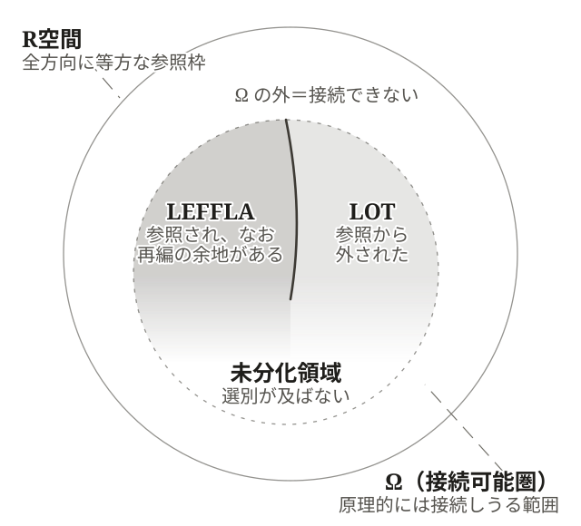

**図3-1**　本書の基底構造。R空間の内側に接続可能圏 Ω があり、Ω の内側が LEFFLA・LOT・未分化領域に分かれる。**LOT は Ω の外側ではない**——接続しうるのに、選別構造が参照から外している。第1章の脱落域は、LOT と未分化領域の両方にまたがる。

### 分節は外から動かされる——接触が選別構造を組み替える

いま切り出した分節は、静止した地図ではない。スナップショットで切るとは、その瞬間の輪郭を取り出すことであって、輪郭が固定されていると主張することではない。

動いている系は、他の動いている系との接触のなかでしか動きつづけられなかった（「圧縮から創発する世界」第2章 §2-5）。そして接触は、相関構造を揺るがす。この揺らぎを、いま立てた Ω の語彙で言い直しておく。

他系から流入した Flux は、系の Stock の組成を変える。組成が変われば、何を「関係するもの」として浮かび上がらせ、何を背景に沈めるかという選別の有効性が組み替わる。前景にあった差異が背景に沈み、背景にあった差異が前景化する。Ω の内側に LEFFLA と LOT と未分化領域の境目を引いているのは、系の選別構造である。**その選別構造が、接触によって外から動かされる。**

したがって、分節は二つの契機で動く。一つは、系が手を伸ばし、未分化領域に単位を立てる契機（第2章 §2-4）。もう一つは、接触が選別の有効性を組み替えた結果として、系が分節し直す契機である。前者では系が動かしている。後者では、系は動かされている——分節し直した後の系は、前になかったものを持ち、前にあったものを失っている。どちらの契機でも、動いた後の分節は、その系の選別構造が引いた分節である。違うのは、引き直しがどちらから起こったかである。

系は瞬間ごとに自分の境界を引き直しながら動いている（第2章 §2-4）。**その引き直しは、系の側だけの仕事ではない。**

### LOT は内側から同定できない——定義の折り返し

いま定義した LEFFLA と LOT の対には、一つの含意が畳まれている。

LEFFLA は「参照されており、なお再編の余地を残している有効領域」、LOT は「Ω 内にありながら、選別構造によって参照から排除された領域」であった。ここに定義上の折り返しが働いている。系の内側で「これが LOT である」という判定が立つためには、判定の対象が系の参照回路に組み込まれていなければならない。だが、参照回路に組み込まれた差異は、定義上 LEFFLA の側にあって、もはや LOT ではない。したがって LOT は、系の内側から機構的に参照することができないものとして現れる。系の側から「これが LOT である」と同定する試みは、その同定が成立した瞬間に、対象を LEFFLA 側へ引き入れてしまう。LOT を LOT のまま同定することは、系の内側からは、自己言及的な閉じを持つように現れる。

この折り返しは、意識・文明のレイヤーで「認識できない」と呼ばれる事態の一形態を含むが、それに尽きない。物理・生命の各レイヤーにおいても、選別構造の作動が排除した差異は、その系の作動の側からは実効的に到達できないものとして現れる。系がある構えで世界を切っている以上、その構えの外側にあるものは、その構えのまま参照することができない。これは、意識・文明のレイヤーで初めて立ち上がる制約ではなく、選別と参照が対をなすすべての階層に、内側からの見え方として伴う機構である。

そして、この折り返しは、本書のこの記述そのものにも及ぶ。本書がここで「LOT はそのように現れる」と述べているのは、私たちの宇宙の内側で、私たちの側の構えのもとで、そう現れているという事実の記述である。LOT を外側から俯瞰できる立場は、本書には与えられていない。以降の節で取り出す中核命題-1（§3-3）、頓死の三経路（§3-4）、転嫁の三方向（§3-5）、LEFFLA なき即時確定（§3-7）——いずれも、この折り返しの下で作動する機構として記述される。

### 第1章の三領域・T空間との対応

ここで、T空間の内部位置における高精度保存域・低精度保持域・脱落域という三領域（「世界を切り取る幾何学」 第1章 §1-3）を思い出そう。これらは、Ω の内部分節としては次のように位置づけ直される。高精度保存域と低精度保持域は、いずれも LEFFLA に対応する。両者の差は、LEFFLA の内部で勾配がどれだけ急峻に立っているか（高精度保存域）、まだ立っていないか（低精度保持域）の差である。脱落域は、Ω の内部分節としては LOT と未分化領域の両方を含む。第1章の脱落域が一括りで捉えていた「T空間の被覆を受けない方向」は、Ω 視点から見ると、能動的に切り捨てられた領域と、まだ選別の手が及んでいない領域とに分かれている。

T空間そのものとの対応も整理しておく。T空間は、射影の結果として系が構築した有限頂点凸多面体である。Ω はその外側——系が原理的に接続しうる範囲全体——を捉える概念であり、両者は同じものではない。T空間の被覆範囲は、Ω 内の LEFFLA に対応する。Ω 内にありながら T空間の被覆を受けない領域が LOT と未分化領域である。射影視界（第1章）と接続可能性視界（本章）は、同じ系を二つの角度から記述している。

### LEFFLA の内部構造——無秩序でも固着でもなく

LEFFLA を「広く取る」とは、どういうことか。LEFFLA は、無秩序と同じではない。差異が一様に散らばって相関が消散した系では、状態空間そのものは広く見えるが、そこには構造を保持したまま再編できる余地がない。相関が消えていれば、そこから組み替える出発点も消えている。逆に、状態が一点に固着し、変化の余地が閉じたときも、構造は保たれているが、再編の余地はない。LEFFLA は、この二つのあいだにある。相関が消散するほど散らばりもせず、一点に固着するほど閉じもせず、構造を保持したまま別の相関へ組み替えうる、可達な領域である。散らばりの広さそれ自体でも、固定の狭さそれ自体でもない、独自の位置がここにある。

LEFFLA は、単に「広い領域」というだけでは不十分である。同じ広さでも、その内部で何ができるかは違う。広く取られていても、内部での再編が硬直していれば、生成的な働きはない。逆に、狭くても、内部の勾配が立っていれば、強い駆動を生む。

二つの量で記述すると、見通しがよい。一つは LEFFLA の**広さ**——可能性空間の体積である。もう一つは LEFFLA 内部の**有効勾配**——同じ体積の中で、どれだけ Flux が方向づけられて使えるか、である。

LEFFLA の働きは、両者の積として近似的に把握される。広く取られていて、なおかつ内部に有効勾配が立っているとき、LEFFLA は強く機能する。両者のどちらか、あるいは両方が縮むと、機能は弱くなる。

ここでの広さは、第1章 §1-3 の広がりと同じものではない。T空間を特徴づけた二量のうち、広がりは保存している方向の多様さ、解像度は方向内部の細かさであった。可能性空間の体積は、その双方に依存する——ここでの広さは、両者を畳んだ合成である。働きを記述するかぎり、体積は内訳を問わない——だから畳んで扱える。だが、壊れ方は内訳で分かれる。合成の値が保たれて見えることと、内訳が偏っていくことは、両立する。この両立が、頓死の診断（§3-4）で効いてくる。

ここで一つ、強調しておきたい。**広さも有効勾配も、瞬間ごとに変動する量である。さらに、Ω そのものも時間とともに動く。環境の変化によって接続可能性の条件が書き換えられ、あるいは系自身の操作によって接続可能圏そのものが改変されていく。** スナップショットで切るとは、その瞬間の値と輪郭を取り出して観察することである。Ω・LEFFLA・LOT・広さ・有効勾配のいずれも固定された量や領域だと主張することではない。次の瞬間には、別の値、別の輪郭になっている。

### 余地・余白・保留——LEFFLA の空間相と時間相

LEFFLA はさらに、空間的な側面と時間的な側面に分節される。

空間的な側面は、可能性空間における**余地**と**余白**の二相として現れる。余地は、既存の構造を再編する余裕——「これはこう動かせる」「これは別の組み合わせも可能だ」という再編可能性の広さ。余白は、まだ確定しておらず、確定する必要も当面ない——という未確定の状態が許容される広さ。両者は重なる部分もあるが、力点が異なる。系の硬直化が始まるとき、まず余白が縮み、続いて余地が縮んでいく傾向がある。

時間的な側面は、入力を即時に確定へ送らずに保持しておく**保留**の幅として現れる。これは第2章 §2-3 で LEFFLA を動的維持機構として導入したときに示した側面と同じである。保留は、フィードバックの遅延を吸収するバッファとしても働く。

スナップショットで切るとき、これらすべてが、ある瞬間の Ω の分節として観察される。LEFFLA は参照と再編の領域、LOT は構造化された盲点、未分化領域は選別未到達——三つの領域が、その時点の系の状態を記述する。

### どの射影にも LOT がある——ティベリウスへの帰還

そして、LOT は特定の誰かの欠落ではない。序論で、ティベリウスに出会った。同じ一人が、最悪の暴君にも、傑出した名君にも、悲劇的人物にも映る皇帝である。本書はこの皇帝について、「どの射影にも盲点がある」と述べた。いま定義した LOT が、その「見えていない部分」である。どの射影法も、ある差異を LEFFLA に置き、別の差異を LOT に落とす。完全に見渡す射影は存在しない。圧縮して世界を扱う以上、避けられない構造である。

### 二つの勘定——世界勘定と系勘定

本節で立てた Ω・LEFFLA・LOT の分節は、接続可能圏の位相であると同時に、一つの**会計構造**でもある。一つの系にとって、何がどの領域に属するかは、その系がどこから世界を数え上げているかによって違う。

Ω 全体を外側から見渡した観察者にとって、Ω の内側にある状態はすべて実在する。LEFFLA には保留された可能性が、LOT には参照回路から漏れた領域が、それぞれ実在の質量を持って存在する。このすべてを数える勘定を、本書は**世界勘定**（the world's account）と呼ぶ。

一方、系自身にとっては、LOT は存在しないものとして扱われている。系の参照回路のうえでは、LOT に対応する状態は起こりうるものとして数えられていない。系の数え上げは、Ω 全体ではなく、LOT を外した範囲だけを台として閉じている。この、系自身が付けている勘定を、**系勘定**（the system's account）と呼ぶ。

二つの勘定は、同じ Ω を語りながら、異なる数え上げを運用している。世界勘定では Ω に広がる状態がすべて数え上げられ、系勘定では LOT が数え上げの外に落とされる。両者のずれは、**系の内側からは原理的に検知できない**。検知するには系の参照回路の外側にアクセスする経路が要るが、その経路そのものが選別構造のなかにあるからである。LOT が内側から同定できないという定義の折り返し（本節）が、数え上げの水準ではこう現れる。系にとっては、系勘定の中で会計が閉じていることこそが、動いていることの前提である。

この二つの勘定のずれは、次節で述べる中核命題-1（§3-3）と、その先の頓死（§3-4）の構造的な地盤となる。系勘定では首尾一貫して動いているのに、世界勘定で見れば実在の重要な状態が LOT に押し出されている。その乖離が閾値を超えたときに、系は自分の見取り図に従って動きながら、実在の側では致命的な位置にすでに到達している。

---

## §3-3　圧縮の二面の不可分性——中核命題-1 

ここまでで装置の輪郭が出揃った。LEFFLA、LOT、Ω、広さ、有効勾配、余地・余白・保留——これらの装置で、いよいよ圧縮そのものの構造を取り出す。

§2-4 で見たとおり、圧縮は内と外を分ける構造であった。選別と縮約という二つの操作によって、有効勾配が立ち上がる。これは圧縮の**正の帰結**である。同じ Flux 供給のもとで、より少ない変数で、より方向づけられた仕事が引き出せる。

### 選別と縮約は LEFFLA と LOT を同時に生む

しかし、圧縮にはもう一つの帰結がある。

選別とは、Ω の中の差異のうち、どれを LEFFLA に入れるかを決める操作であった。採用された差異が LEFFLA に入るとき、採用されなかった差異はどこへ行くか。

採用されなかった差異は、消えるのではない。Ω の中にとどまる。物理的・反応的にはそこにあるが、系の選別構造から見ると、それは参照すべき信号ではない。これは LOT（§3-2）の位置である。

つまり、選別は LEFFLA を立ち上げるのと同時に、LOT を生み出している。両者は一つの圧縮操作の二つの帰結である。

縮約についても、同じ構造がある。縮約が進むと、LEFFLA 内部の有効勾配は高まる。同じ流れが、より少ない変数の上へ集中するからである（§2-4）。知的主体の側では、これは第1章 §1-3 で見た機構と一つにつながる。保存する方向を絞るほど、絞られた分が残された方向の内部の細かさへ回り、高い解像度が急峻な勾配を生む。そして、どちらの側から見ても、この増大には天井がある。増大の原資は、いま保存されている方向の数であり、有限である。絞りしろが尽きれば、集中させる先も、細かさへ回すものも尽きる。天井の存在までは構造から言える。その位置は、本書の手段では特定できない。

だが同時に、縮約は採用された差異の内部にあった細かな区別を潰す。潰された区別は、再び LOT 側へ落ちる。

選別であれ、縮約であれ、圧縮を進めれば LEFFLA と LOT が同時に動く。

### 中核命題-1——圧縮の二面の不可分性

もう一つ、同時に動くものがある。圧縮が強くなるほど、Ω の中で LEFFLA が占める範囲——その広さ——は縮む。LEFFLA の体積が縮めば、その中で動的な再生産が回りつづけられる猶予も縮む。LEFFLA は、より速く消尽されていく。

さらに、もう一つ。LEFFLA が縮み、その中で再編が回る時間スケールが短くなれば、外乱や入力へのフィードバックも、それに合わせて短くなければならない（§2-3）。フィードバック時間の短縮が、構造的に要求される。

これらすべては、一つの圧縮操作の不可分な帰結である。LEFFLA の縮小、有効勾配の増大、消尽の加速、フィードバック時間の短縮要求、そして LOT 副生である。

ここから本書の中核命題が立つ。

圧縮は、保持すべき区別が増えるほど、それを維持するためのコスト——本書が以下で**保つコスト要求**と呼ぶもの——を高める。またそれと同時に、圧縮は LEFFLA の**広さ（体積）を縮める**一方で、その内部の**有効勾配（密度）を高める**。後段で「LEFFLA は厚みを持つ」というのは、この有効勾配の増大を指す。

---

**中核命題-1（圧縮の二面の不可分性）【階層横断】**

> 圧縮は、有効勾配を高めて創発の豊かさを生むのと同じ強度で、接続可能圏 Ω の中で LEFFLA の領域を縮め、その消尽を加速させ、フィードバック時間スケールの短縮を強制する。圧縮の強度に応じて LEFFLA の保つコスト要求が高まり、それを満たせない部分は LOT として副生される。これは選択可能なトレードオフではなく、構造的な同時帰結である。

---

「同じ強度で」が、この命題の核である。圧縮を強めれば、有効勾配は高まる。それと釣り合うだけの LEFFLA の縮小と LOT の副生が、必ず起きる。圧縮の強度を保ったまま、LOT 副生だけを避ける、ということはできない。同様に、LOT 副生を許容しないまま、有効勾配を強める、ということもできない。両者は一つの操作の二面である。

### 保つコスト要求——圧縮の強度が呼ぶもの

第2章 §2-6 で、選別が厚くなるほど、三条件を支える維持のコストが急速に増大することを見た。同じ要求を、ここで圧縮の側から正式に据えておきたい。圧縮が強くなるほど、LEFFLA 側に組み込まれた差異の数が増え、そのあいだの関係も複雑になる。多くの区別を保持するには、より精緻な LEFFLA の運営、より頻繁な HIAM の作動、より短いフィードバック時間が要求される。本書はこの要求を**保つコスト要求**と呼ぶ。

保つコスト要求は、圧縮の強度に応じて増大する。系がそれを満たせるかぎり、LEFFLA は維持される。だが、保つコスト要求を満たせない部分が出てくれば、その部分は LOT 側へ滑り落ちる。

ここで一つ、強調しておきたい。**LOT の存在それ自体は、病ではない。** 圧縮を行うかぎり、LOT は副生される——これは病理ではなく、系が系として立ち上がる条件の表裏である。

### レシピと高山——LOT は病ではない

料理のレシピを例に取ってみる。

レシピは、食材の分子レベルの化学反応の全情報を「中火で5分」という少数の変数に圧縮している。圧縮があるから、化学を知らない者でも料理が作れる。同じ食材と熱エネルギーの Flux から、レシピなしでは到達しにくい特定の調理結果を、高い再現性で実現できる。これは圧縮の正の帰結である。

このレシピで一つ、暗黙のうちに採用されなかった差異がある。気圧と沸点の関係である。平地では、水は100℃で沸騰する。だから「中火で5分」が成立する。気圧と沸点の関係は、レシピの中では参照されない——それは LOT に沈んでいる。

平地ではこのことは問題にならない。LOT に沈んだ変数は、現に変動しないからである。LOT は存在しているが、病ではない。

しかし、同じレシピを高山に持っていくと、状況が変わる。気圧が下がり、水の沸点も下がる。「中火で5分」では米が炊けない。レシピという圧縮の中で LOT に沈んでいた変数が、急に効いてくる。レシピは、自分が LOT に切り捨てたものに、応答できない。

ここで対応する道はある。圧力鍋を使う方法である。圧力鍋は、レシピが LOT に沈めた変数を、もう一度 LEFFLA に引き戻す装置である。圧力を能動的に管理することで、LOT に沈んだ変数を制御下に置きなおす。

レシピを高山で破綻させる事態と、圧力鍋で破綻を回避する操作——どちらも、LOT そのものが病なのではないことを示している。LOT は、圧縮を行うあらゆる系が抱える宿命的な領域である。問題が生じるのは、LOT に沈んだ変数が、系の自己保持に必要な差異を含み始めるときに限られる。

### 支払い様式は階層で違い、構造は同型

保つコスト要求の支払い様式は、階層によって質的に違うことを §2-6 で見た。物理基底では、コストは法則の側ですでに支払われており、LOT 副生は系の側に何の操作も要求しない。重力法則は、自分が選別から落としたものについて何も補填しない。実装層では、コストは代謝と淘汰の形で支払われる。文明層では、コストは制度的維持の形で支払われ、しかもその維持は淘汰圧によって自動的には強制されない——だから、転嫁の余地が生じるのだった（§2-6。本章では §3-5 で扱う）。

実装様式は違う。だが、「LOT は副生される」「保持されない部分は LOT 側へ落ちる」という中核命題-1 の構造的帰結は、階層を貫いて同型に成立する。物理から生命を経て文明まで、圧縮を行うすべての系で、中核命題-1 は同型である。

### 二つの勘定から見た不可分性

この分離不能性は、前節（§3-2）で立てた二つの勘定の対から見ると、もう一つの姿を持つ。系勘定の側で圧縮が進むほど、系の参照回路の内側は勾配を持った秩序として濃くなる。差異が鋭くなり、識別が可能になり、意味が立つ。系にとって、この内側は組織された低エントロピーの島として現れる——動いていることの手応えそのものである。

しかし世界勘定の側で見れば、同じ操作の結果として、参照回路の外側に押し出された領域が広がっている。系にとって存在しないことになった状態群が、実在の側では動きつづけている。系勘定内での秩序の立ち上がりは、系勘定外への構造的不可視化と対をなしている。この対の分離不能性が、中核命題-1 のもう一つの姿である。

これは、系勘定だけを見ていると気づけない構造である。系の側では、内側で秩序が立ち上がり、参照の閉じが成立し、動きが整合している——それだけである。世界勘定からの視点を加えたとき、系の内側の秩序化と系の外側への切り捨てが同時進行であることが見える。

### 吐き出し先としての LOT——第二法則は破れていない

この勘定の対は、第2章 §2-2 で立てた不可逆性の帳簿と一つの構造をなしている。動いている系は、局所の秩序を保つためにエントロピーを環境へ吐き出す。「秩序の維持にはコストがかかり、そのコストは消滅しない」と述べた、あの帳簿である。

問題は、吐き出されたエントロピーがどこへ行くか、である。系は自分の局所秩序を維持するために、実在のエントロピーをどこかへ流し込んでいる。その流し込む先の内部状態を、系は細かく区別していない。「環境」「廃熱」「廃棄物」「宇宙空間」——集合ラベルで一括に包んでいる。詳細な状態変数を持っていない。

この「詳細を持たない吐き出し先」こそが LOT である。系勘定で LOT に分類されている領域と、系の局所秩序を維持している熱力学的な吐き出し先は、構造的に同じ場所である。系は自分の局所秩序を維持するために、実在のエントロピーを LOT へ流し込んでいる。系勘定では LOT が存在しないので、この流入は不可視のまま進行する。

熱力学第二法則は破れていない。世界勘定では、系の局所秩序の低いエントロピーと、LOT に流入する高いエントロピーの和は、依然として増加している。しかし系勘定では、LOT への流入が数え上げの外にあるので、系は「秩序が立ち上がり、コストが見えない」という現象を経験する——あたかも第二法則を局所的に迂回しているかのように。実際には迂回ではない。代償の吐き出し先が、自分の視野の外側にあるだけである。

### 勘定の閉じ

系勘定は、エネルギーの出入りについて、見た目のうえでは閉じている。流入と流出が数え合わされ、系の内側で保存則が成り立っている。だが、その閉じ方は世界勘定から見ると特殊である。LOT との実在するフローが「損失」「摩擦」「散逸」「外部化」といったラベルの下に押し込まれることで、系勘定は収支を合わせている。実在の流れが、系にとっては「あったことにならない」場所へ整理されている。

本書はこの、系勘定の内側でのみ成り立つ閉じ方を、**勘定の閉じ**と呼ぶ。勘定の閉じは、系の錯覚ではない。系勘定の内側では、これは実際に閉じている——動いている系が動きうるための条件でもある。ただしこの閉じは、系の外側にある実在のフローを見ていない、という特殊な意味での閉じである。

勘定の閉じが機能しているあいだ、系は動きつづけることができる。動きが破綻するのは、系が閉じられなくなるときではない。閉じたつもりで動いていながら、実在の側で位置がずれていくときである。

---

## §3-4　寿命と頓死——頓死の三経路 

LOT が病に転じる場合とは、どのような場合か。

### 寿命と頓死——二つの終わり方

この問いに答えるために、二つの区別を導入する。**寿命**と**頓死**の区別である。

一つの系の LEFFLA が、内在的な法則に従って消費され尽くす場合がある。恒星は、核融合の進行に伴い、より重い元素を中心部に蓄積していく。鉄まで蓄積が進めば、それ以上の核融合は熱を生まない——むしろ吸熱反応になり、自重を支える放射圧が消える。星は崩壊する。星の LEFFLA（核融合維持可能域）が、星自身の働きの帰結として消費され尽くした、ということである。フィードバック機構（静水圧平衡）は最後まで正常に作動し、系は到達可能な終点に至る。本書はこの種の終わり方を**寿命**と呼ぶ。

これに対して、別の終わり方がある。

LEFFLA がまだ残存しているにもかかわらず、系がそれを参照できなくなる場合がある。選別構造の歪みのために、本来であれば LEFFLA 内に保持されているはずの差異が、LOT 側に押し出される。系はまだ生きられる猶予を持っているのに、自分の盲点によって、それを使えない。本書はこれを**頓死**と呼ぶ。

寿命と頓死は、構造的に異なる。寿命は法則的・内在的な消尽である。フィードバックは正常に作動したまま、系は終点に至る。頓死は、選別構造の歪みという、操作可能な条件に依存する。寿命を回避することはできない。頓死は、原理的には回避の余地がある——少なくとも、ある時点までは。

### 頓死へ至る三経路

頓死へ至る経路——選別過剰・縮約過剰・媒介断絶——を順に見る。

第一の経路は、**選別過剰**である。選別が厳しくなりすぎ、本来 LEFFLA に入るべき差異が LOT 側へ排除される事態である。ある環境に高度に特化した種を例にとろう。特化が進むほど、種の LEFFLA は特定の環境条件に強くチューニングされ、有効勾配は高くなる。しかし、環境が変動したとき、その種の選別構造は、変動に応答できる差異を LEFFLA 内に持たない。本来必要だった差異は、選別の厳しさによって LOT 側に切り捨てられていた。種はまだ個体を残しているが、応答する手立てがない。

第二の経路は、**縮約過剰**である。LEFFLA に入った差異の内部にあった細かな区別が、潰されすぎる事態である。多様な差異が LEFFLA に入っていても、それらが少数の代理変数に縮約され、その変数の値だけで系全体の状態が代表されてしまうと、代理変数の動かない範囲で、内部の細かな変化は系の判断に届かない。LEFFLA の広さは維持されているように見える——差異は系内に保持されており、体積はさほど減っていない。だが、系が現に参照する方向の数が痩せている。残った代理変数の上では、勾配はむしろ急峻に立つ。広さを見ても、勾配を見ても、この痩せは現れない——合成の値が保たれたまま、内訳だけが動いているからである（§3-2）。

第三の経路は、**媒介断絶**である。LEFFLA 内の構造を支えていた媒介経路が断たれ、本来 LEFFLA 内にあった差異が LOT 側へ転落する事態である。ある種が、別の二種を媒介してエネルギーや物質を受け渡していたとする。媒介する種が絶滅すると、受ける側の種にとって、相手は反応的接続可能圏の内部にあっても、実効的には接続されない。系自身の選別構造は変わっていないのに、外的に LEFFLA が縮む。

三つの経路は、それぞれ独立に作動しうる。

### 有効幅と回帰不能閾値——頓死の診断

ここで、動的視界に戻って、頓死の進行を診断する装置を取り出しておきたい。

§3-2 で見たとおり、LEFFLA の働きは、広さと有効勾配の積として近似される。これを LEFFLA の**有効幅**と呼ぶ。

圧縮を強めるほど、広さは縮み、有効勾配は天井へ向かって高まる（§3-3）。積である有効幅は、したがって、強めるほど大きくなる量ではない。ある強度から先では、圧縮を強めることが、有効幅を削る側に回る。

頓死へ向かう系では、有効幅は時間とともに減少する。**有効幅の減少が一過性ではなく持続するとき、系は LEFFLA を消尽しながら頓死へ近づいている。** 一過性の収縮は系の通常の動態の一部だが、持続的な減少は構造的な異変を示す。

ここで一つ、重要な閾値が現れる。有効幅は、ただ縮小していくだけではない。ある時点で、**系自身が LEFFLA を再編する能力そのものが LOT 側に落ちる**閾値が存在する。再編能力——選別構造を見直し、必要な差異を LEFFLA に呼び戻す能力——は、LEFFLA 内にしか保持できない。再編能力が LOT 側へ落ちると、系は自分の選別構造の歪みを認識する手立てを失う。本書はこの閾値を**回帰不能閾値**と呼ぶ。回帰不能閾値を下回った系は、自力では頓死から戻れない——外部から強い介入が入らないかぎり、進行は止まらない。跳ね返して戻す反射壁ではなく、呑み込んで戻さない吸収壁である。

この閾値には、三重の含意が畳まれている。第一に、**不可逆性**——回帰不能閾値を超えたのちに、系の側の自発的な回復は成立しない。相関構造の崩壊は摂動として吸収されるのではなく、位相の断裂として現れる。第二に、**事後検証性**——閾値をいつ超えたかは、超えた後の帰結が現れてはじめて確認できる。閾値の位置は、系の側からは事前には可視化されない。第三に、**閾値効果**——有効幅の減少は、閾値の手前まではしばしば連続的な劣化として進むが、閾値そのものは連続的な緩和として超えられるのではない。境界の直前と直後で、系の帰結の様相は不連続に変わる。三重の含意は、頓死へ向かう系を診断する側にとって、非対称な構造を突きつける——見えない境界と、超えた後にしか確定しない到達と、超えた瞬間に不連続に変わる帰結。三つは別々に働くのではなく、頓死そのものの構造として畳まれている。

### 予兆なしに来る——勘定の閉じの外側

頓死は、系が動きつづけているあいだに位置がずれていく事態である。系勘定では、動きは整合している。勘定の閉じ（§3-3）は機能しており、系は「まだやれる」と数えつづけている。だが世界勘定で見れば、実在のフローの一部が LOT に流出したまま累積し、系勘定の余裕見積もりと実在の限界のあいだの乖離が閾値を超えている。そこで初めて、LOT に流れていたコストが「見える」形で戻ってくる。しかしその時点で、系はすでに不可逆な位置にいる。

ここで、頓死を系の怠慢や過失と取り違えないようにしておきたい。すでに述べたとおり（§3-3）、LOT は圧縮を行うあらゆる系が抱える宿命的な領域である。有限の帯域で動く系は、圧縮せざるをえず、圧縮するために選別せざるをえず、選別するがゆえに何かを LOT へ落とさざるをえない。LOT を副生したこと自体は、動いていることの代償ではなく、動きうることの前提である。したがって頓死を分けるのは、LOT を出したか出さなかったかではない。出さざるをえない LOT が、たまたま系の自己保持に必要な差異を含む方向へ集中したまま累積したかどうかである。同じ量の切り捨てでも、系の存続に関わらない方向へ落ちていれば系は動きつづけ、存続に関わる方向へ集中していれば頓死する。

系の側にとって頓死が「予兆なしに来る」ように見えるのは、系が鈍いからではなく、ずれの現場そのものが勘定の閉じの外側にあるためである。

ここまでは、選別構造が変化しうるすべての系に適用される構造である。物理基底のように選別が法則として固定された系では、頓死は原理的に生じない——選別構造が歪まないからである。寿命だけが終点となる。化学から先、選別構造が変化しうるレイヤーでは、寿命と頓死の両方の経路が成立しうる。

### 圧縮の強度は意義を保証しない

しかし、意識・文明のレイヤーでは、もう一つの構造が前面に出てくる。

意識・文明レイヤーの選別構造は、§2-6 で見たとおり、可変である。系の側で動かせる。動かせる対象が増えた分、頓死の経路もより複雑になる。とくに、ここから次の観察が立ち上がる。

意識・文明レイヤーでは、圧縮の強度は、それだけでは「意義の厚さ」を保証しない。

これがどういうことか。

意識・文明のレイヤーで作動している選別構造に、本書は §2-7 で MANES という仮の名前を与えた。MANES は、物語と実存的意義のための意味の錨と読める。「意味の錨」と呼ばれるのは、この選別構造が、何を意味として立ち上げるかを規定するからである。

圧縮を強めれば、有効勾配は立ち上がる（中核命題-1）。LEFFLA は厚みを持つ。しかし、LEFFLA に詰め込まれた差異が、担い手にとって「これは私のことだ」「これは我らのことだ」という意義として感じられるかどうかは、圧縮の強度からは決まらない。歴史を見渡せば、制度と技術の圧縮が高く立ち上がっているのに、そこに生きる者にとっての意義が薄い、という組み合わせが繰り返し現れる。逆に、圧縮としては素朴な系が、厚い意義を保つこともある。強度と意義は、別の変数として動いている。

この独立は、頓死の構造と無関係ではない。意識・文明レイヤーでは、保つコスト要求（§3-3）の支払いが、淘汰圧によって自動的には強制されない（§2-6）。それでも支払いが続くとすれば、続けさせているものは、その系を保つことが担い手にとって意義を持つ、ということの側にある。意義を欠いたまま強度だけが上がる系は、保つコスト要求を支払いつづける理由を、内側に持たない。支払いが滞れば、保持されない差異から順に LOT 側へ落ちていく——中核命題-1 の帰結が、今度は系の足元で作動する。

### 実存的意義の独立性

ここから、本章の第一の重要な観察が立つ。

---

**観察される傾向 第Ⅰ部-1（実存的意義の独立性）**

> 意識・文明のレイヤーでは、圧縮の強度は、それだけでは担い手にとっての実存的意義の厚さを保証しない。両者は独立に変動しうる。意義を欠いたまま強度だけが上がる系は、保つコスト要求を支払いつづける理由を内側に失い、LEFFLA の保持が細り、頓死リスクが構造的に高まる傾向が観察される。実存的意義の厚さが何によって規定されるかの記述は、第Ⅱ部（第6章・第7章）で行う。

---

ここで一つ、留保がある。この傾向は、断定的な因果ではない。**回避の余地が、それぞれの段階に残されている。** 意義を欠いた圧縮があっても、別経路で意義が再構築されることはありうる。LEFFLA の保持が細っても、ある時点までは戻れる。ただし、放置すれば、これらの段階は順に進行する傾向がある。LEFFLA なき即時確定——本書が後の節で **LOT direct** と呼ぶ事態——への滑落が、その先にある。

意義の厚さそのものが何によって規定されるか——この問いに答える装置を、本章はまだ持っていない。それは第Ⅱ部の主題である。ただ、その手前で、本章の装置のまま取り出せることが、あと二つある。操作の届く範囲と、「我ら」として引き受けられている範囲は、同じか。そして、広く引き受けることの支払いは、誰の能力によって担われうるのか。次の二つの節で、これを順に取り出す。

---

## §3-5　「操作能力的我ら」と「実存的我ら」の乖離 

動いている系は他の系の中にいる。系のまわりには別の系がいる。系は信号を交わし、物質を交わし、関係を結ぶ。ここで、意識・文明レイヤーに焦点を絞って、「系のまわり」をもう一段精密に切り分けてみる。

切り分ける語は、序論（§5）ですでに立ててある。系が実際に操作している範囲が **「操作能力的我ら」** である。市場、サプライチェーン、エネルギー網、通信網、政策の波及と、制度構造のネットワークが届くところすべてがこれにあたる。系の「個の私」が、「これは私のことだ」「これは我らのことだ」という同一性として体感する範囲が **「実存的我ら」** である（MANES 第三層 ES としての本格定義は「MANESの三層」（第6章）に委ねる）。序論はこの二つのあいだに、引受の不等式——「操作能力的我ら」 ≤ 「実存的我ら」——を置いた。本節が取り出すのは、この左辺と右辺が、そもそもなぜズレうるのか、である。

### 意識・文明レイヤーで両者は分離する

物理基底のレイヤーでは、この区別は意味を持たない。重力は、それが及ぶ範囲そのものが系の作動範囲であり、「同一性として体感する」という主観の側面が存在しない。生命のレイヤーでも、種が物質的に交渉する範囲と、その種にとっての「自己」の範囲は、進化的にほぼ一致して維持されてきた。

意識・文明のレイヤーで、はじめて両者が分離する。

文明は、表象能力を持つ（§2-6）。言語や記号を通じて、時間的・空間的に離れた事象を操作する能力である。この能力により、操作の射程は、主観的に感じられる「我ら」の範囲を大きく超えうる。今日の朝に選んだ食材は、地球の反対側の土地で育てられたかもしれない。今日使った電気は、数十年前に建てられた発電所がいま動かしている。今日生まれた廃棄物は、数百年後の世代が処理することになるかもしれない。これらの相手は、「操作能力的我ら」の内部にいる。が、それらが「実存的我ら」の内部にいるとは限らない。

「操作能力的我ら」と「実存的我ら」は、意識・文明レイヤーでは独立に変動しうる。

具体的には、「操作能力的我ら」は、制度構造の拡張に応じて広がる。しかも、序論（§5）で見たとおり、自覚を要さずに広がる。一方、「実存的我ら」は、「個の私」が同一性を体感できる範囲に拘束され、自覚的に構成しつづけるほかない。両者の拡大の論理は別である。だから、両者は乖離しうる。

### 乖離と転嫁

ここから、本章の第二の重要な観察が立つ。

---

**観察される傾向 第Ⅰ部-2（操作能力的我らと実存的我らの乖離）**

> 意識・文明のレイヤーでは、系の「操作能力的我ら」（制度構造によって規定される客観的射程）と「実存的我ら」（「個の私」との同一性が体感される範囲）は、独立に変動しうる。両者の乖離が大きい系では、「操作能力的我ら」の内部にあって「実存的我ら」の外部にある対象へ、保つコスト要求の支払いや LOT が転嫁されやすい構造的条件が成立する傾向が観察される。この乖離が文明の相と動性をどう規定するかの記述は、第Ⅳ部（第15章・第16章）で行う。

---

「操作能力的我ら」と「実存的我ら」の乖離（観察される傾向 第Ⅰ部-2）は、**引受の不等式**（序論 §6）——「操作能力的我ら」 ≤ 「実存的我ら」——の構造的本体である。引受の不等式が破れている状態とは、両者の乖離が大きく、転嫁が成立しやすい構造的条件が整っている状態にほかならない。

ここで言う「転嫁」は、保つコスト要求の支払いを未来へ、下位レイヤーへ、あるいは系内の他者へ移すという操作である。

両者の乖離が大きい系では、転嫁の対象が構造的に発生する。「操作能力的我ら」の内部にいながら、「実存的我ら」の外部にいる対象。操作の影響は届く。しかし、「我ら」として引き受けられていない。この位置にいる対象に対して、系は保つコスト要求を支払うインセンティブを持ちにくい。むしろ、その対象に転嫁する経路が、構造的に開いている。

### 転嫁の三方向——時間・階層・社会

転嫁の三方向は、この乖離の枠組みの中で、次のように位置づけ直される。

時間的転嫁——未来の世代への押し付け——は、現在の「実存的我ら」が、未来の世代まで含まないときに、構造的に成立する。子・孫・曾孫の世代が、現在の「我ら」の中に入っていなければ、彼らへの転嫁は系の側にとって痛みを伴いにくい。

階層的転嫁——下位レイヤー（生態系、地球システム）への押し付け——は、現在の「実存的我ら」が、その下位の生命や生態系を含まないときに、構造的に成立する。

社会的転嫁——系内の他者への押し付け——は、現在の「実存的我ら」が、その他者を含まないときに、構造的に成立する。

いずれの場合も、共通する構造的条件は、「操作能力的我ら」と「実存的我ら」の乖離である。

### 乖離は転嫁を必然化しない

ここで一つ、この観察を断定としてではなく傾向として読むための留保を置いておきたい。乖離が大きいことは、転嫁を必然化するわけではない。乖離があっても、「実存的我ら」を意図的に拡張することで、転嫁の経路を狭めることはできる。教育、儀礼、制度設計、語り——これらは「実存的我ら」を拡張する装置として、文明史を通じて働いてきた。観察される傾向 第Ⅰ部-2 が記述しているのは、乖離が大きい系では転嫁が**成立しやすい構造的条件**が整う、という観察であって、転嫁が必ず起きると主張するものではない。

ただし、放置すれば、乖離が大きい系は転嫁を増やしていく傾向を持つ。これは**階層間 LOT 転嫁**の構造的源泉でもある。文明が下位レイヤー（生態系、気候系、地質系）に LOT を体系的に押し出していく事態は、この乖離（観察される傾向 第Ⅰ部-2）が極端化した状態として理解される。

---

## §3-6　広い引受は単独では保てない 

乖離は転嫁を必然化しない、と前節の終わりに述べた。乖離があっても、「実存的我ら」を意図的に拡張することで、転嫁の経路を狭めることはできる。教育、儀礼、制度設計、語り——「実存的我ら」を拡張する装置は、文明史を通じて働いてきた。

だが、ここでもう一つの問いが立つ。拡張された「実存的我ら」は、誰が保つのか。

### 拡張には支払いが伴う

「実存的我ら」の拡張は、宣言では済まない。序論（§5）で先取りしたとおり、広い「我ら」を意味として維持することは、莫大な情報的・象徴的・制度的コストを要する。「我ら」の範囲を広げるとは、その範囲の差異を LEFFLA 側に保持しつづけるということであり、それは保つコスト要求（§3-3）の増大にほかならない。広く引き受けるほど、支払いは重くなる。

そして、一人の「個の私」の認知には、有限性がある。「これは私のことだ」「これは我らのことだ」という同一性の体感は、無限の相手に対して張りつづけられるものではない。広い操作の射程の上で、広い「我ら」を、厚い体感のまま一人で保つこと——それは、担い手一人の能力を超える。

### それでも、保たれてきた——何かが介在している

にもかかわらず、歴史のなかで、広い「我ら」が厚く保たれた場面は現れてきた。都市が、信仰圏が、国民が、ときに人類までもが、「我ら」として引き受けられ、その引受が世代を越えて続いた時期がある。

そうした場面には、共通の構造が観察される。単独の担い手が保っていたのではない。担い手と担い手のあいだに、「我ら」を運び、引受を支える何かが、常に介在している。言葉が、物語が、儀礼が、制度が、記録が——一人では張り切れない範囲を、担い手のあいだで分かち持たせる形で、働いている。

### 集団による維持

ここから、本章の第三の重要な観察が立つ。

---

**観察される傾向 第Ⅰ部-3（集団による維持）**

> 意識・文明のレイヤーでは、広い操作の射程と厚い引受をともに保つことは、単独の担い手の能力を超える。それが保たれている場面では、担い手と担い手のあいだで「我ら」を運び、引受を支える何かが常に介在していることが観察される。その介在するものが何であり、どのように働き、どのように劣化するかの記述は、「ホモ・デウスとホモ・マネス」（第7章）で行う。

---

この「介在する何か」を名指し、解剖する装置を、本章はまだ持っていない。それは第Ⅱ部の主題である。ここでは、三つの観察が、保つコスト要求の文明レイヤーでの三つの顔として並んだことだけを確認しておく。意義を欠く系は、支払う理由を失う（第Ⅰ部-1）。乖離の大きい系は、支払いを他所へ回す経路を持つ（第Ⅰ部-2）。そして、広い引受の支払いは、単独では担えない（第Ⅰ部-3）。理由と、逃げ道と、能力——保つコスト要求が文明レイヤーで立てる三つの問いは、第Ⅱ部以降で本格的に扱われる。そしてこの並びには、次節の終わりで、もう一つの面が加わる。

---

## §3-7　LEFFLA なき即時確定と LOT direct 

頓死の三経路（§3-4）のうち、第一経路——選別過剰——の典型的な作動形態を、ここで一段精密に取り出す。

### LEFFLA を経由しない選別——LOT direct

通常の選別は、入力に対して LEFFLA を介して動く。何かが入ってくると、それは一定時間 LEFFLA に保留され、再編可能な状態で保持される。その時間のあいだに、入力は他の差異と照合され、必要に応じて新しい構造の一部に組み込まれ、不要なものは終結機構（HIAM）を通じて整理される。LEFFLA は、入力と確定のあいだに置かれた「保留」の領域として機能する。

しかし、ある種の系では、この LEFFLA を経由しない選別が起きる。

入力が来た瞬間に、それは LEFFLA に保留されることなく、即時に「採用」と「排除」のいずれかに振り分けられる。採用されたものは確定として固定化される。排除されたものは、Ω の外側へ送られるのではなく、LOT 側へ直接押し出される。

本書は、この **LEFFLA を経由せずに、入力を直接 LOT 側へ切断する操作**を、**LOT direct** と呼ぶ。

### 通常の頓死とどう違うか——判断速度の優位

LOT direct は、通常の頓死とは別の経路で進行する。

通常の頓死（§3-4）では、LEFFLA は徐々に縮小し、その内容が劣化していく。有効幅の減少が持続し、ある時点で回帰不能閾値を下回って、自力で戻れなくなる——これが通常の経路だった。LOT direct では、LEFFLA そのものが入力経路の途中から**省略される**。LEFFLA を経由する保留時間がないため、入力は瞬時に確定する。

LOT direct が選ばれる構造的な誘因は、判断速度の優位である。LEFFLA を介する選別は、保留の時間を必要とする。その時間のぶん、応答は遅くなる。判断速度を優先する場面では、LEFFLA を省略するほうが短期的には効率がよい。たとえば、競争的な状況、即時対応が要求される場面、累積する判断量に処理が追いつかない場面である。一つひとつの判断は素早くなり、出力量は増える。

短期的には、LOT direct は系の能力を増しているように見える。

### 構造的帰結——可逆性の喪失・誤確定の不可逆化・選別構造の硬直化

しかし、構造的な帰結は重い。

第一に、**可逆性の喪失**である。LEFFLA を経由する選別では、入力は保留期間中に再評価されうる。誤った確定が起きそうになっても、保留の時間内であれば訂正できる。LOT direct では、入力が即時に確定するため、誤った確定を取り消す経路がない。一度 LOT 側へ切断されたものは、戻ってこない。

第二に、**誤確定の不可逆化**である。LEFFLA を介さない確定は、その判断の根拠を内部に保持しない。なぜそう確定したのかが、構造として記録されない。誤った確定があったとしても、後から検証することができない。誤りは検出されないまま、構造の一部として固定される。

第三に、**選別構造の硬直化**である。LOT direct は、入力と確定のあいだに余地を残さない。系は、自分の選別構造を見直す機会を、入力ごとに失う。徐々に、選別構造は外部からの修正を受け付けなくなる。系は、自分が何を切り捨てているかを認識する手立てを、自ら閉じていく。

### 置く場所がなければ、立った端から落ちる

三つの帰結を、Ω の分節の側から見直しておく。

分節は二つの契機で動くのだった（§3-2）。系が手を伸ばして未分化領域に単位を立てる契機と、接触が選別の有効性を組み替え、系が分節し直す契機である。後者で新たに前景化するものは、定義上、それまで系の選別構造に位置を持っていなかったものである。位置を持たないものを、確定させずに抱えておく広さ——それが余白であり、時間の側では保留であった（§3-2）。

LOT direct は、この保留を省く操作である。そして硬直化する系では、まず余白が縮む（§3-2）。両方が痩せた系では、分節の組み替えが起きても、組み替えの産物を置く場所がない。選別構造に位置を持たないものは、抱えられないまま、参照の外へ送られる。**立った端から落ちる。**

この状態が続くと、その系にとって、未分化領域と LOT のあいだの違いは働かなくなる。定義としては、両者は別のままである——未分化領域は選別がまだ届いていない領域、LOT は選別が能動的に外した領域。だが動きのうえでは、どちらも参照されないという一点に落ち合う。まだ単位の立っていないものと、単位が立ったうえで外されたものとが、同じ扱いを受ける。

**そして、この一致は系の内側からは見えない。**LOT は内側から同定できず（§3-2）、未分化領域は単位が立っていないため、そもそも数える対象にならない。両者が別のものであることが確かめられるのは、外から見たときだけである。

### LOT direct の短期競争優位

これらの構造的帰結は、頓死へ向かう経路（§3-4）を、加速する。

LOT direct は、選別過剰の典型形態として、頓死の三経路のうちの一つを激化させる装置である。同時に、それは集団による維持（観察される傾向 第Ⅰ部-3、§3-6）にも影響する。「我ら」を運び、引受を支えるものが担い手のあいだに編まれるには、保留の時間が要る。LOT direct が支配的になる系では、その時間が削られ、介在するものが編まれる余地そのものが縮む。

ここで、確認しておきたいことがある。LOT direct には、判断速度の優位が現に存在した（本節前半）。その優位と、いま並べた構造的帰結とは、同じ速さでは現れない。優位は即座に立ち、帰結は遅れて届く。そして意識・文明のレイヤーでは、実装層と違って、この不払いを淘汰が自動的に回収することもない（§2-6）。ここから、本章の第四の重要な観察が立つ。

---

**観察される傾向 第Ⅰ部-4（LOT direct の短期競争優位）**

> 意識・文明のレイヤーでは、LEFFLA を経由する保留が時間の支払いを伴うため、LOT direct を採る系は、判断速度と出力量において短期の競争優位を持つ傾向が観察される。実装層と異なり、この不払いの帰結は淘汰によって自動的には回収されない（§2-6）。優位が先に立ち、構造的帰結——可逆性の喪失・誤確定の不可逆化・選別構造の硬直化——は遅れて現れる。この時間差のもとで、競争環境に置かれた系は、選別構造を LOT direct 側へ寄せる誘因に晒されつづける。この優位と帰結の時間差が文明の相の水準でどう現れるかの記述は、第Ⅳ部（第16章）で行う。

---

これは、序論（§9）で拡張加速相の構造的優位として先取りした事態の、機構の水準での現れである。前節までに並んだ三つの面——支払う理由・支払いの逃げ道・支払う能力——が支払いの静力学だとすれば、この観察は不払いへ引く動力学を加える。支払いを省くことが、短期には報われる。§3-4 の留保が述べた「回避の余地」が、なぜしばしば使われないままになりがちなのか——その構造的な根拠が、ここにある。

### 拡張加速相——LOT direct が支配する局面

文明史のある特定の局面で、LOT direct が支配的になる時期が現れる。判断速度を最大化することが、操作能力の拡張と直結する局面である。序論（§9）で三つの文明相の一つとして先取りした**拡張加速相**が、それである。本格的な取り扱いは第Ⅳ部（第16章）に譲り、ここでは LOT direct との接続だけを記しておく。

本章は、圧縮のもう一つの面を、Ω の分節として取り出してきた。系が何かを参照する（LEFFLA）と同時に、参照から排除される領域が副生される（LOT）。そして、その定義の折り返しから、LOT はその系の内側から機構的に参照できないものとして現れる（§3-2）。この折り返しは、数え上げの水準では世界勘定と系勘定のずれとして現れ、系勘定は LOT を数えないことによって閉じる（§3-2・§3-3）。この閉じの下で、本章は五つの機構を立ててきた。

- **中核命題-1**——圧縮が有効勾配と LOT を同時に副生すること（§3-3）
- **寿命と異なる終わり方としての頓死**——LEFFLA が保てなくなる三つの経路と、閾値を超えたのちには自力で戻れないという非対称（§3-4）
- **「操作能力的我ら」と「実存的我ら」の乖離**——副生された LOT の重みが他所へ移されうる構造（§3-5）
- **広い引受の支払い**——単独の担い手を超え、担い手のあいだに介在するものへ委ねられていること（§3-6）
- **LEFFLA なき即時確定**——LOT の副生が LEFFLA を経由せずに加速しうる様式と、その不払いが短期には報われるという誘因、その支配的な局面としての拡張加速相（§3-7）

すべては、系がその副生を内側から見ることのないままで、進んでいる。

こうして機構を描く本書自身もまた、その機構の内側で書かれている。本書が「LOT はそのように現れる」と述べるとき、本書は自らの側の構えのもとで、そう現れているという事実を記述している。私たちが機構を機構として取り出せているのは、私たちの側の構えがそれを許しているからであって、機構を外側から俯瞰できる立場から取り出しているのではない。本書もまた、一つの記述様式に依拠している——何をもって世界を切り取り、何を式に載せ、何を載せえないのか。記述する側の射程と限界を問わないかぎり、構造記述は自らの足場を点検しないままになる。

---

# 第4章　数学の巨大な視界と盲点——バインドなき記述体系の射程と限界 

ここまでに、知性が世界を切り取る構造を、三つの角度から据えてきた。本章は、これらを記述する語彙そのものを問い直す——とりわけ、科学理論を支える「数理モデル化」という様式を。

人間や意味や社会や文明を厳密に語ろうとする理論は、しばしば数学へと吸い寄せられる。数式は精密に見え、立場を越えて共有でき、客観的に見えるからだ。本書はこの引力に意識的な距離を取り、可能なかぎり散文で記述する。この選択は、本書のモデル図の読み方にも、本書自身の記述にも跳ね返ってくる。

**精密に語るとは、数式で語ることなのか。**

---

## §4-1　数学的記述の大きな力 

数学的記述は、他のいかなる記述様式とも異なる固有の力を持つ。

### 一つの式が場所を変えて繰り返し現れる——接続空間の広さ

熱がどう伝わるかを記述する方程式と、ある粒子の確率密度がどう拡がるかを記述する方程式と、金融デリバティブの価格がどう動くかを記述する方程式は——書き換えれば——同じ形をしている。熱拡散方程式、フォッカー゠プランク方程式、ブラック゠ショールズ方程式は、それぞれ別の領域で別の動機から書かれたが、形式としては同じ偏微分方程式の家族に属する。誰かが意図して接続を作ったのではない。それぞれの領域を独立に進んだ探究が、後から同じ形に行き着いた。

似た現象は、いたるところで起きている。十九世紀に純粋な代数的興味から発展した群論は、二十世紀に入って結晶構造の分類言語になり、さらに素粒子の対称性の記述言語になった。十九世紀に幾何学として展開された微分幾何は、二十世紀の一般相対論の基礎言語になった。十九世紀の整数論——応用的動機から遠かった数学の領域——は、二十世紀後半に暗号理論を経由して通信網の基盤になった。書き手が想定していなかった領域で、後から発見的に必要な言語として要請される——この奇妙な反復が、繰り返し起きる。

ここに数学の**接続空間**としての機能がある。ある領域で見出された構造が、別の領域で同じ形をとって現れる。記号操作として書かれたものが、書き手の見ていなかった場所に橋を架ける。「自然科学における数学の不合理な有効性」と呼ばれる現象は、この接続空間の機能の濃い徴候である。

### 立場を越えて摩擦なく走る——共有可能性

数学的記述のもう一つの力は、**共有可能性**である。数学的命題は、異なる MANES の主体間で、摩擦なく共有されうる。存在論的立場が根本的に異なっていても——プラトニズムも形式主義も直観主義も構造主義も——、ピタゴラスの定理の成立については合意する。神を信じる主体と信じない主体、東アジアの伝統に立つ主体とヨーロッパの近代的伝統に立つ主体、企業組織の言語を生きる主体と農村共同体の言語を生きる主体——いずれもが、「2 + 3 = 5」については一致する。

この合意は、空間方向だけでなく時間方向にも走る。ピタゴラスの定理は紀元前六世紀の命題であるにもかかわらず、いまも同じ意味で成立する。ユークリッドの『原論』は紀元前三世紀の著作だが、その大部分の命題は現代の数学者にとっても有効である。古典物理学のうちある時代に有効だった部分は、新しい理論が来ても完全に廃棄されるのではなく、より広い枠組みの極限として保存される。数学的成果は退役せず、上に積層する。神学や倫理や歴史や文学が、時代ごとの読み替えを経てはじめて届きつづけるのとは、構造が異なる。

共有可能性は、何らかの努力によって達成されるのではない。それは数学的記述が **MANES に依存しない**ことの直接の帰結である。命題が特定の歴史や共同体や経験にバインドされていなければ、その命題は別の歴史や共同体や経験を生きる主体に対しても、まったく同じ形で立ち上がる。数学が他の知の様式から際立っているのは、この MANES 非依存性が他のどこよりも徹底しているからである。

### 数学的圧縮の特異性——文脈に依存しない

数学的記述のもう一つの力は、**圧縮しても内容が壊れない**ことである。

公理から出発して、定理 A、定理 B、…、定理 Z へと、証明の連鎖が伸びていく。各ステップは前のステップを参照し、形式的に確定された推論で次のステップを導く。連鎖が一度確立されれば、その先は「公理→定理 Z」と圧縮して扱える。中間の定理 A から Y までを毎回展開する必要はない。定理 Z を別の文脈で使う者は、連鎖の存在を信頼して、結論だけを持ち出せばよい。

奇妙なのは、この圧縮が——通常の圧縮と違って——内容を壊さないことである。「LEFFLAとLOT」（第3章）で見たとおり、圧縮は一般に副生物（LOT）を伴う。短くした記述は、元の情報の何かを必ず取りこぼす。だが「公理→定理 Z」という形での数学的圧縮では、中間ステップの省略が定理 Z の正当性を一切損なわない。証明の連鎖は推移的であり、各ステップが形式的に確定している以上、中間を取り除いても結論は同じ強度で立つ。

確かに、別の何かは脱落している。証明を初めて思いついた者の苦闘、発見の動機、教育的順序、歴史的背景——これらは「公理→定理 Z」という圧縮には残らない。しかしこれらはそもそも、数学的内容には属していなかった。命題が成立するかどうかは、それを誰がいつどう発見したかから独立である。だから、それらが落ちても、命題そのものは壊れない。

同じ強靭性が、より日常的な姿でも現れる。マクスウェル方程式の四本、シュレディンガー方程式の一本、F = ma——きわめて短い記法が、世界の広大な領域を運ぶ。これらは無数の派生定理・実験的確認・応用計算の連鎖を背後に持ちながら、その連鎖を毎回展開することなく持ち運ばれる。教科書を開いた誰もが、最初の発見者がたどった経路をなぞる必要はない。記法のこの効率は、連鎖を圧縮しても内容が壊れないという、いま見たばかりの強靭性が記述の水準で現れた姿である。

ここに、圧縮は LOT を副生するという構造（中核命題-1、「LEFFLAとLOT」第3章 §3-3）との、奇妙な関係が立ち上がる。中核命題-1 は数学レイヤーで壊れているのではない。落ちているもの——発見順序・動機・歴史・教育的経路——は確かに副生されている。ただ、それは MANES 依存的な領域に属しており、数学的内容には属していなかった。数学を**数学の内側から**見れば、LOT は副生されていないように見える。この特異な強靭性は、見える視野の側に数学的内容が残り、見えない側に MANES 依存的なものが落ちる、その配分の極限的な姿である。

### 巨大な視界——接続空間、共有可能性、圧縮の強靭性が生む

接続空間と共有可能性と圧縮の強靭性——この三つを合わせて、本書は数学の**巨大な視界**と呼ぶ。第一は領域を横断する力であり、第二は立場を横断する力であり、第三は推論連鎖を縦に圧縮しても内容が壊れない力である。三つは別々の現象ではなく、同じ一つの構造的特性の三つの面である。

その特性とは、数学的記述が**変数や命題を特定の内容や文脈に固定しないこと**である。記号は記号同士の関係の形だけを担い、その記号が何を指すか、どの単位で測られるか、どの範囲で意味を持つかは、数学そのものからは出てこない。だからこそ、その記号は別の領域に持ち込んで同じ関係を担わせることができる（接続空間）。だからこそ、その記号は別の MANES の主体に渡しても同じ形で受け取られる（共有可能性）。だからこそ、長い証明連鎖を結論一行に圧縮しても、内容そのものは壊れない（圧縮の強靭性）。本書は、変数や命題が何を指し・どの値域をとり・どの値に定まり・どの文脈に属するかを、特定へと固定する操作を**バインド**と呼び、数学的記述がこれを行わないことを**バインドの不在**と呼ぶ。「バインド」はもともと物理が変数を特定の値に定める操作を指す語であり、本書はそれを借りて用いる。

これらは数学を数学の内側から見たときの相貌である。だが、内側から見えないものが、外側に落ちている。

---

## §4-2　数学の大きな力の先にある限界 

### 絶対零度——式が許すもの、系が許さないもの

温度を変数とする数式に、マイナス1000K という値を代入してみる。記号の操作としては、何も壊れない。方程式はその数を受け取り、いつもどおり計算を進める。だが、その数に対応する物理状態は存在しない。絶対零度（0K）は下限であり、それより低い温度の状態というものが——通常の熱力学的な系には——ない。0K は「稀な状態」でも「実現に巨大なコストがかかる状態」でもない。配置の空間の、外にある。

数式は、その外を排除しない。数式は、変数がどんな値を取りうるかについて、それ自身からは何も言わない。それを言うのは——「ここから先はない」と告げるのは——世界がそうなっているという事実の側である。物理学は、量と量のあいだの関係の形を数学から受け取る。だが「ただし温度は 0K 以上」という制約は、数学からは出てこない。世界の側から、測定と観察を通じて、外から与えられる。前節で導入した語で言えば、数式は——その記号操作の水準では——**バインドを持たない**。

注目したいのは、物理学が、あらゆる学問のなかで数学と最も密に結合した営みだという点である。物理学の言語は、ほとんど数式そのものである。にもかかわらず——いや、それゆえに——物理学は変数の値域を絶えずバインドする。光速を超える速度、負の質量、確率の値域の外——数式は書けても、系は許さない。物理学が世界を精確に記述できるのは、数式にバインドを足しつづけるからである。最良の場合ですら、式は世界より寛容なのだ。そしてこの落差は、数学から遠ざかるほど——測定が難しく、検証が遅く、変数の意味が論争的になるほど——広がっていく。

### 三重の盲点

しかし、巨大な視界は無条件のものではない。数学には、視界の巨大さと表裏一体の**三重の盲点**がある。

**第一の盲点は、バインドそのものを問えないことである。** 物理定数がなぜ特定の値を取るのか——なぜ微細構造定数が約 1/137 なのか——は、物理学においても未解決の問いであるが、少なくとも問いとして成立する。物理学は変数に特定の値を**バインド**しているからこそ、「なぜこの値か」を問うことができる。数学はバインドを行わないから、この問いが成立する場所を持たない。「なぜこの公理体系か」「なぜこの構造か」を、数学の内部から問うことはできない。そして同じ理由から、数学は「この値はありえない」とも言えない。マイナス1000K に対応する物理状態がないことを告げるのは、数学ではなく、バインドされた系の側である。〈なぜこの値か〉を問えないことと〈この値は禁じられている〉と言えないことは、同じ一つの欠落——バインドの不在——の、表と裏である。

**第二の盲点は、MANES 依存的変数を定義できないことである。** 「重要さ」を考えてみよう。あるニュースが「重要」であるかどうかは、判断者の射影軸の配置——何を前景化し何を背景化するか——に依存する。「重要さ」を数値化しようとすれば、数値化の基準自体が特定の MANES にバインドされる。数学はいかなる MANES にもバインドされていないから、MANES 依存的な概念（重要さ、美しさ、意味、ふさわしさ）を記述対象として持てない。これは数学の欠陥ではない。数学が MANES に依存しないことが、共有可能性の条件であった。同じ条件のもう一方の面が、MANES 依存的な概念の構造的排除である。

**第三の盲点は、過適合判定の不在である。** 「変数を増やしすぎた記述」が悪いかどうかは、データへの当てはまりが過剰でないかどうかで判定される。これが過適合判定であり、最小記述長（MDL）の議論などが量的に扱う対象である。しかし数学はバインドしないからデータを持たない。データがなければ、「過適合」を判定する内在的基準がない。数学者の美的感覚——「この証明は美しい」「あの体系は不格好だ」——が部分的にこの役割を果たすが、これは数学者の MANES の機能であって数学の内在的原理ではない。

### バインドを欠いた体系——円を外接する三角形

三重の盲点のうち第三のもの——過適合判定の不在——は、もう少し見ておく価値がある。数式の形だけを借りて、その変数の値域をバインドしないまま体系を組むと、何が起きるか。

一枚の図で考えよう。現実——第1章で **R空間**と呼んだ等方的な参照枠——を、一つの円とする。世界についての理論は、その円を多角形で近似しようとする営みである。さて、変数をバインドせずに数式の関係だけで体系を組むと、その体系は——円を外側から包み込む、大きな三角形になる。三角形なのには理由がある。理論はできるだけ短く記述されることを好む——これが記述を圧縮しようとする選好である。現実を覆う多角形のうち、頂点数が最も少なく、最も短く書けるものは三角形である。だから理論は、まず三角形の形をとろうとする。そして、それをバインドするものがないかぎり、三角形は三角形のままでいられる。三角形は円を覆う。理論は現実を覆う。だがそれは、円の外の領域、現実には存在しないのに理論が「それも説明できる」と主張してしまう領域までも、同じだけ覆い込むことによってである。何が起きてもそれを説明でき、どんな観測が出ても辻褄が合う。三角形は縮まない。

バインドを足すと、三角形の角が落ちていく。測定が「ここから先はない」と告げる。複数の独立した探究が、思いがけず同じ形に収束する。これらのバインドはどれも、数学そのものからは出てこない——外から、世界の側から供給される。バインドが一つ足されるたびに、多角形は頂点を増やし、円に寄っていく（六角形、十二角形……）。物理学はこの方向に深く進んだ営みであり、だからその多角形は円にぴったり貼りつく。ただし——外側から、である。決して円そのものにはならない。

ここに一つの構造的なトレードオフがある。**現実をすべて覆うことと、現実でないものを覆わないことと、記述を圧縮することは、同時には成り立たない。** 円を完全に覆おうとして外接すれば、必ず円の外も覆い込む——偽の像が混じる。偽の像を一切混ぜまいとして角を削り、かつ記述を圧縮しようとすれば、多角形は円の内側に落ちる——覆いきれない領域が残る。どの理論も、〈実在しないものまで覆い込む〉か〈実在するものを取りこぼす〉かの、どちらかを必ず抱える。取りこぼす側——多角形が円の内側に落ちる姿——は、第1章の T空間（R空間の内側に収まる有限の射影）がすでに示していた。本章の三角形は、その鏡像である。これは中核命題-1——圧縮の二面の不可分性（「LEFFLAとLOT」第3章）——が、こんどは「世界についての理論」そのものの水準で現れたものである。

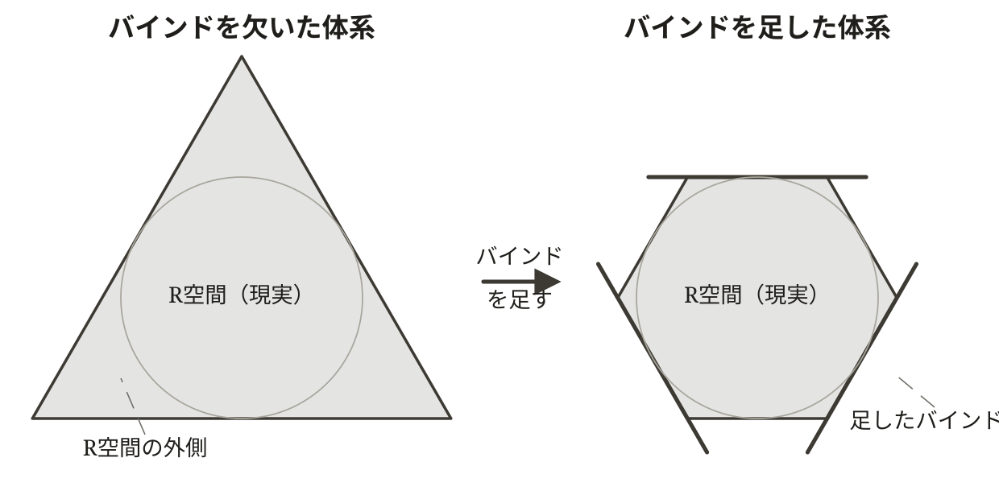

**図4-1**　左：R空間（現実／円）を外接する「バインドを欠いた記述体系」（三角形）。縞が記述体系の覆う範囲で、円の外へはみ出した部分——記述体系が現実よりも広く覆う「R空間の外側」——が残る。右：バインドを足すと角が落ち（外へ突き出た線が足したバインド）、多角形は円に寄る——ただし外側から、決して R空間そのものにはならない。

### 伝播の勾配——なぜバインドしないほうが広がるのか

バインドすることには、代価がある。変数の値域をバインドすれば、理論の射程はその分小さくなる。「ここから先はない」と告げれば、理論はそこで反証されうるものになる。複数の独立な証拠の収束を待てば、時間がかかる。そして、こうして角を削った理論の成果は——何も起きなかった、という形をとる。回避された災厄、退けられた誤った政策、市場に出なかった危険な薬。これらは、誰の目にも結果として見えない。バインドのコストは前払いで目に見え、その果実は見えない不在として現れる。

バインドを外せば、これらのコストはすべて消える。三角形は縮まないから、体系は事後的に何でも説明でき、無限の射程を持っているように見える。反証されうる点を持たないから、敗北しない。検証を待たないから、速い。そして数式の形をまとっているから、精密に見え、客観的に見え、立場を越えて通用するように見える。数学の巨大な視界の見かけだけを、バインドの代価を払わずに借りている。

ゆえに、伝播の勾配はバインドを外す方向に走る。バインドしない体系のほうが、バインドする体系よりも、大きく、速く、敗北せず、印象的に見える。〈数式らしさ〉そのものが——その数式が何をバインドしているかとは独立に——信頼の信号として受け取られ、消費される。変数をバインドしなければ、数式はほとんど何でも無矛盾に語れる。数学の基底層に携わる者にとっては言うまでもないこの前提が、人間や組織や社会や「画期的な新理論」を語る場面では、しばしば視界から抜け落ちる。これは、その帰結である。誰かが愚かだからではない。バインドの代価と、バインドを外したものの見かけの強さとのあいだにある、構造的な非対称の帰結である。

数学はバインドしない。バインドしないことは、巨大な視界の源泉であると同時に、バインドの代価を払わない体系が構造的に有利になる、その源泉でもある。

### 視界と盲点は同根である——バインドの不在

ここで重要なのは、視界と盲点が同一の構造的条件から派生しているという点である。

数学が巨大な視界を持つのは、バインドの不在による。バインドしないから、いかなる MANES とも摩擦が生じず、共有可能になる。バインドしないから、特定の文脈に固定されず、領域を横断して接続できる。

同じバインドの不在が、三重の盲点を生む。バインドしないから、「なぜこの値か」を問えない。バインドしないから、MANES 依存的な意味を記述できない。バインドしないから、データがなく、過適合の判定基準を持てない。

巨大な視界と三重の盲点は、別々の現象ではない。両者は同じ条件——バインドの不在——の二つの面である。一方を享受しつつ他方を回避することは、構造的にできない。これは「圧縮の二面の不可分性」（有効勾配の増大と LOT 副生、「LEFFLAとLOT」第3章）の、数学レイヤーにおける現れである。

そして、ここから本書の方法的な選択が出てくる。MANES——重要さ、意味、ふさわしさ、共に在りうる範囲——は、まさに数学の盲点に落ちるものである。それを数式に流し込めば、バインドのない三角形になる。意味について何でも事後的に説明でき、何もバインドしない体系。本書が MANES を可能なかぎり散文で記述するのは、厳密さを諦めるためではない。逆である——散文で、特定の歴史に、特定の共同体に、特定の経験に、主張をバインドするためである。バインドするとは、角を削って円に寄せることだ。

---

## §4-3　部分的完成モデル——関数形特定とパラメータ未確定 

### 関数形とパラメータ——数学が与えるもの・与えないもの

数学の射程と限界をより精密にするためには、「数学は何を与え、何を与えないか」を二つの面から記述する必要がある。本書はこの二面を、**関数形**と**パラメータ**の対比として整理する。

**関数形**は、変数同士の関係の構造である。「F = ma」という表現は、力 F が質量 m と加速度 a の積に比例することを述べている。ここで、F・m・a が具体的にどんな値を取るかは語られていない。語られているのは、三つの量のあいだに成り立つ関係の形である。

**パラメータ**は、変数に代入される具体的な値である。ある質量 m₁ がどれだけの力 F₁ で加速度 a₁ を生むかは、F = ma の関係構造からは決まらない。三つのうち少なくとも二つの値が、外から与えられる必要がある。

数学が与えるのは関数形であり、パラメータは数学からは出てこない。F = ma は、関数形としては完成している。だが、ある物体の質量が何キログラムであるかは、測定によってしか定まらない。測定とは、まさに**バインド**の操作である。

### 物理学の二段階バインド——物理定数と測定

物理学はこの構造を、二段階のバインドによって運用している。

**第一段階のバインド**は、世界の側で値や値域が定まっていることである。光速 c、プランク定数 h、微細構造定数 α——これらの物理定数は、物理学が記述する宇宙において特定の値を取る。この値を、関数形をどれほど解析しても導き出すことはできない。宇宙はそうなっている。第一段階のバインドは主体不在の確定であり、文法になぞらえて言えば自動詞的である。「定まっている」のであって、「定める」主体は記述のどこにも現れない。絶対零度（§4-2 冒頭）は、この第一段階のバインドの一例である。温度に 0K という下限があるのは、世界がそうなっているからであって、定める操作を経たからではない。

**第二段階のバインド**は、測定である。ある特定の物体の質量、ある特定の電場の強さ、ある特定の時刻の位置——これらは測定によって確定される。第二段階のバインドは主体がいる確定であり、他動詞的である——観測者が、装置と手続きを通じて、値を「定める」。

物理学は、第一段階と第二段階のバインドのあいだを往復する。理論側が関数形を提供し、第一・第二バインドの両者を経て、理論は世界の特定の状態に貼り付けられる。物理学が世界を記述できるのは、数学的関数形と二段階のバインドの合成によってである。

### 部分的完成モデルとしての数学

ここに、数学の射程と限界の本性が現れる。数学は、関数形については完成度の高い記述を与える。しかしパラメータについては未確定のままである。本書はこの構造を**部分的完成モデル**と呼ぶ。

部分的完成モデルとは、ある対象の記述のうち、関係の構造（関数形）は完成度が高く、特定の値（パラメータ）は未確定のまま残されている記述形式である。数学的記述は、この意味で本性的に部分的完成モデルである。

部分的完成モデルは欠陥ではない。むしろこの構造こそが、数学の巨大な視界の正体である。関数形だけで完成しているからこそ、その関数形は異なる MANES の主体間で共有でき、異なる領域に転用できる。パラメータが未確定であるという同じ条件が、共有可能性と接続空間を可能にしている。

しかし、MANES の記述という課題に対しては、この構造は限界としても作用する。MANES そのものは、特定の歴史・特定の共同体・特定の経験の蓄積の上に成立する具体性を持つ。MANES の関数形——「MANES は座標系・報酬関数・共存条件の三層構造をとる」——は数学的に記述しうる。しかし、ある特定の MANES（ある共同体の、ある時代の、ある歴史的経験を引き受けた MANES）の具体的内容は、数学的記述だけでは捉えられない。具体的内容は、第二段階のバインドに対応する作業——歴史記述、人物群像研究、文学的描写、当事者の語り——を通じてしか接近できない。

### 本書における関数形の使用——構造記述の範囲

ここで、本書自身の立場をはっきりさせておく。本章は §4-2 で、変数をバインドしない数式の体系——円を外接したまま縮まない三角形——から距離を取った。だがそれは、本書が関数形を一切使わないという意味ではない。本書はしばしば、構造記述のために関数形を用いる。「どこに境界があるかは特定できないが、この方向に滑落の勾配がある」「この量がある閾値を超えると、系は別の相へ移る」「この因果は一方通行で、戻ってこない」——こうした方向・閾値の存在・不可逆性についての洞察は、関数形から、具体的な値を一つも知らなくても、読み取れる。本書がこの範囲で数式を用いるのは、関数形がまさに「部分的に完成した記述」だからである。形は与えられているのだから、その形から読めることは読む。それ以上は読まない。

一つ、本書自身がすでに用いた関数形を例に、この構えを具体的に見ておく。「圧縮から創発する世界」（第2章）は、選別構造が立つときに引き出せる仕事の量を、有効勾配の急峻さと流量の積という形でおいた。この積の形から読めることは、値を一つも知らなくてもある。勾配が急峻なほど、また流量が大きいほど、取り出せる仕事は増える。そして、勾配が立たなければ、あるいは流れがなければ、他方がどれだけ大きくとも仕事はゼロになる。増減の方向と、消失の条件。ここまでが、積という関数形が与えるものである。

一方で、この形は、ある特定の系が実際にどれだけの仕事を取り出すか——その値——を与えない。積の比例係数も、勾配や流量を測る単位も、形の側からは出てこない。それらは、F = ma の質量が測定を要したのと同じように、第二段階のバインドを経なければ定まらない。だから本書は、この積を、方向と消失の条件を読むための関数形として用い、そこで止める。積の形が特定の関数として一意に導かれたと主張することも、この形の威光を借りて「この系の仕事量はこれだけだ」と語ることも、しない。関数形が与えているのは形であって、値ではないからである。

危ういのは、関数形を使うこと自体ではない。関数形が与えていないもの——パラメータ、境界の正確な位置、具体的な予測——まで、与えているかのように振る舞うことである。そして、その振る舞いをバインドせず、誤りうる形にしないことである。

その滑落の一つの経路を例示する。関数形に整合しそうな、しかも測定できる代理指標を一つ見つけてくる。その代理指標を、関数形が本来扱っていた量そのものとして扱う。そして、その代理指標を上げ下げする設計を語りはじめる——あたかも関数形が、その設計の効き目まで保証しているかのように。代理指標を立てること自体が問題なのではない。代理指標と本来の量との結びつきもまたバインドされている——測定で確かめられている——かぎりは、問題はない。問題は、その結びつきをバインドしないまま、関数形の威光を借りて代理指標の操作を語ることである。ジレンマは、こういった滑落が「現実をより良くしたい」という純粋な善意を動機にしても起こり得ることである。

本書は、関数形から読み取れる構造的洞察を、関数形が及ぶ範囲のものとして提示する。「境界は構造的にはこの先の方向にあるはずだが、その位置は本書の手段では特定できない」と明示する。それが、§4-2 の三角形を縮める操作、角を削って円に寄せることにほかならない。関数形を用いることと、バインドを欠いた体系へ滑落することのあいだの分かれ目は、与えていないものについて沈黙するか、それとも与えているふりをするか、にある。本書は前者を選ぶ。

---

## §4-4　幾何学——巨大な視界と盲点の一事例 

数学の巨大な視界と盲点を、一つの事例として幾何学に即して見る。幾何学は、数学のなかで「量が測定できなくても成り立つ構造や関係」を扱う領域である。多くの読者にとって幾何学は小学校の「ずけい」の延長として記憶されているが、専門的には幾何学は図形そのものを扱う学問ではない。

### クラインのエルランゲン・プログラム

十九世紀の数学者フェリックス・クラインは、それまで個別に発展してきた諸幾何学を統一する視点を示した（エルランゲン・プログラム、1872）。それによれば、幾何学とは**ある変換群のもとで不変な性質を研究する学問**である。

ユークリッド幾何学では、回転や平行移動のもとで距離と角度が不変。射影幾何学では、視点を変える変換のもとで複比が不変。位相幾何学では、連続変形のもとで連結性と穴の数が不変。リーマン幾何学では、多様体上の計量や曲率が研究対象となる。それぞれが扱う「不変なもの」は異なるが、いずれも「ある変換のもとで何が残るか」という同じ構えのうえに立つ。

つまり、どの幾何学も「**何を変換と認めるか**」「**何を不変量として残すか**」という二つの問いの上に立つ。この構えこそが、幾何学に**巨大な視界**を与えている。変換群の選び方を変えれば、それまで個別だった分野が同一の枠組みに収まる。

ただし、その選択そのものは幾何学の内部からは正当化できない。なぜユークリッド変換を用いるのか、なぜ射影変換を用いるのかは、対象の側の都合か、扱う者の選択である。幾何学はその選択を所与として、選ばれた変換のもとで何が残るかを示せるだけである。これが幾何学のもつ**盲点**である。

### 量の手前で構造を扱う——直角三角形の場合

幾何学が「量の手前で構造を扱う」とはどういうことか。

ユークリッド幾何学の直角三角形を例にとる。辺の長さは絶対量を測らなければわからない。だが「直角が一つあり、残る二つの角の和が90度である」「直角二等辺三角形であれば、残る二つの角はそれぞれ45度である」という構造は、絶対量を一切測らなくても導かれる。この構造は、図形の大小によらず、回転や平行移動を経ても保たれる。

幾何学が扱うのは、こうした「量を測らなくても成り立つ関係」である。図形は便宜的な姿であって、本質ではない。

### 次元を潰すと図形になる——建築設計図とメルカトル図法

それでも幾何学は図形のなかに現れる。なぜか。それは、私たち人間が高次元の構造を直接知覚することができず、二次元あるいは三次元へと潰した射影像に依存して認識するからである。

建築設計図はこれを最も身近に示す。同じ一つの三次元の建築物を、平面図は真上から、立面図は真横から、パース図は斜めから——それぞれ異なる射影法で潰した像である。平面図では高さの情報が失われ、立面図では奥行きの情報が失われ、パース図では視点から見えない角度にあるものが失われる。

地図の射影法も同じ構造を示す。メルカトル図法は、球面である地球を平面に潰した射影の代表例である。緯度・経度の格子と方位（角度）は保たれる。だが面積は高緯度ほど大きく歪み、グリーンランドはアフリカ大陸ほどの大きさに描かれてしまう。航海のために方位を保つことを選んだ射影法は、その選択ゆえに面積を歪める。モルワイデ図法は逆に、面積を保存し、形と方位を歪める。両者は同じ球面の異なる射影であり、保存する性質が異なる。

つまり、次元を潰せば、潰した次元にあった情報は必ず失われる。そして、何を残し何を失うかは、対象の側にあるのではなく、選ばれた射影法のうちにある。

### 数学的記述も一つの射影法——メルカトル図法的認識論

ここから一歩進めるなら、こう言い直せる。数学的記述それ自体もまた、一つの射影法なのである。

部分的完成モデルとは、関数形は完成度が高く、パラメータは未確定のまま残る構造であった（§4-3）。これを、いまの射影論の語彙で言い直してみる。数学的記述という射影法が保存するのは**関数形**、すなわち変数間の関係の向きと型である。「A が増加すれば B も増加する」「C は D の二乗に比例する」といった関係の形である。代わりに、それが歪め・脱落させるのは**パラメータ**、すなわち具体的内容である。「A が増加すれば B も増加する」という関係を現実に対応づけるには、A と B が何であるか、その単位は何か、どの範囲で関係が成り立つかが、数学の外部から——内容的バインドとして——供給されなければならない。

メルカトル図法が方位を保存しつつ面積を歪めるように、数学的記述は構造的方向性を保存しつつ内容的バインドを脱落させる。本書はこの認識論を**メルカトル図法的認識論**と呼ぶ。これは数学の欠陥ではなく、数学が数学であることの構造的特性である。

### 複数射影法の併用——本書の方法的前提

メルカトル図法的認識論からは、一つの含意が直接に導かれる。**数学だけでは世界の全体を捉えられない以上、別の射影法との接触が構造的に要請される。**

地図の世界では、メルカトル図法だけを使っていれば、北極圏が異常に巨大であるかのような認識が生じうる。モルワイデ図法やランベルト正積図法を併用することで、面積についての歪みが是正される。複数の射影法の併用は、単一の射影法では構造的に到達できない認識の補完である。

同じ構造が、世界の記述についても成り立つ。数学的記述は構造的方向性を保存するが、内容的バインドは脱落する。歴史的記述・哲学的考察・文学的描写・現象学的記述——これらは数学とは異なる射影法であり、それぞれ異なるものを保存し、異なるものを歪める。MANES の記述という課題に対しては、これら複数の射影法の併用が構造的に要請される。

本書は、この複数射影法の併用を方法的前提として置く。本書の中核的な装置は数学に近い精密性を志向するが、その精密性が捉えきれない次元については、別の射影法に委ねる。

### 本書のモデル図はどう読むか——超高次元の幾何の射影像

ここまでの議論を、本書のモデル図に折り返す。

人間は、パース図的な三次元射影までは、視覚で補いながら認識することができる。専門訓練を受けた者は四次元程度まで想像できると言われる。それ以上の高次元は、数式の上では取り扱えるが、絵として認識することはできなくなる。私たちが扱える幾何学的な像は、ここで天井に当たる。

ところが、本書が扱う対象——文明、選別構造——は、本来は超高次元の幾何である。一つの文明は、時間・空間・行為者・媒介の絡まり合いが生むおびただしい数の変数の上に立ち、一つの選別構造はそれが切り取る無数の軸を抱えている。

これらを人間が直観できる形で描こうとすれば、二次元あるいは三次元のパース図に潰すしかない。本書に登場する図は、いずれもその種の潰し方を経た近似像である。たとえば、三軸の座標系、四類型、三つの多角形が重なる場、漏斗の三層構造である。次元を潰せば情報は失われる。本書のモデル図にも、必ず失われた次元がある。

読者にお願いしたいのは、そのことを承知のうえで本書に登場する図を読んでいただくことである。図は対象そのものではなく、対象の射影像である。図は何を残し何を失っているか——どの方向に潰しているか——を、読みながら問うていただきたい。

そして、図だけでは捉えきれないものを、本書は散文によって——歴史的・哲学的・文学的な記述によって——補おうとする。本書が散文を主たる記述媒体としつつ、随所で図を用いるのは、複数射影法の併用という方法的前提の現れである。

---

## §4-5　自己回帰性——数学の盲点と本書との対峙 

### 本書もまた、あるバインドの産物である

ここまでの議論は、数学的記述を対象として展開してきた。巨大な視界、三重の盲点、部分的完成モデル、幾何学という事例、メルカトル図法的認識論、複数射影法の併用である。しかし同じ視線は、本書自身に跳ね返ってくる。

本書は MANES を記述しようとしている。だがその記述は、いかなる MANES にもバインドされない純粋な数学的構造記述ではない。本書には、引き受けている時間構造があり、依拠する語彙があり、想定する読者像があり、しばしば立ち戻る歴史的事件と制度がある。これらはいずれも、特定の歴史・特定の共同体・特定の経験の蓄積の上に成立している。すなわち——本書もまた、あるバインドの産物である。本書は、ある MANES の内部から書かれた記述である。この構造を、本書は**自己回帰性**と呼ぶ。

「バインド」という語を本書自身に向けて用いることには、一つの自己言及が含まれている。後段で見るように、本書がこの語を自分に向けて使うとき、その適合は完全ではない。それでもなお本書がこの語を自分に向けて使うのは、より適合的な語をまだ持たないからであり、その不適合それ自体が、本書の射程の限界の現れである。本書は、自分が完全には言い当てられない語で、自分のことを語っている。

語の選択だけではない。本書の記述語彙のいくつかは、別々の足場から出発した複数の記述を、一つの語彙に束ねた結果である。束ねて得たものは、一貫した読み通しである——読者は一組の語彙で序論から結論まで進める。有効勾配は上がる。だが同じ操作が、それぞれの記述が別の足場に立っていたという情報を落とす。どの語がどの足場から来たか、足場ごとに分節がどう違っていたかは、束ねられた語彙の表面からは読めない。たとえば第2章 §2-3 の三条件は、別々の分節でたどり着かれた先を、一つの語彙で受け止めた形である。圧縮は、有効勾配を高めるのと同じ強度で、乗らなかったものを LOT として副生する（中核命題-1、第3章 §3-3）。この命題は、本書が自分の語彙を編んだ操作そのものにも、そのまま働いている。本書は圧縮を語る本であると同時に、圧縮の産物である。

自己回帰性は本書の欠陥ではない。むしろ、本書が MANES の理論として一定の一般性を持っていることの帰結である。MANES が人間の選別構造であるという主張が正しいかぎり、その主張をなす本書もまた、ある人間の選別構造の中で書かれている。理論が自分自身の患者であることは、理論が十分に一般的であることの帰結であり、同時にその代価である。本書はこの自己回帰性を、無効化すべき問題としても、解消すべき矛盾としても扱わない。これは本書の方法的位置の指標——どこから、何を引き受けて語っているか——の表示である。

### 数学の盲点と本書が向き合うとき

自己回帰性は、本書が MANES を数理化しようとするときに、より具体的な姿で立ち上がる。それは数学の盲点——バインドの不在（§4-2）——が、文明レイヤーを語る試みの内部で姿を変えて反復するものである。独立した複数の論点というよりは、一つの構造的事実の異なる現れである。

まず、本書の中核概念「**バインド**」という語（§4-1）そのものが、物理レイヤーから借用したアナロジーであり、文明レイヤーには完全には適合しない。物理学が定数と測定によって変数を「定める」ときの確定性と、文明が言語・制度・歴史を通じて「定める」ときの確定性は、構造が違う。後者には主体不在の自動詞的確定はなく、第二段階のバインドが連鎖的に積層して固まっていく。だが本書はその不適合を、別の語彙を持たないまま、不適合な語を使いながら指摘するほかない。語の選択それ自体が部分的に MANES 依存的であり、本書はその不適合を内部から完全には測れない。

次に、本書の主題である MANES の具体的内容——ある共同体の、ある時代の、ある歴史的経験を引き受けた具体性——は、部分的完成モデルの構造（§4-3）によって、関数形の側には乗らない。MANES の構造は関数形として記述しうるが、ある特定の MANES が何を引き受け、何を排除しているかは、内容的バインドの領域に属する。メルカトル図法的認識論（§4-4）で言えば、数学的記述は構造的方向性を保存しつつ、内容的バインドを脱落させる射影法である。MANES を数式に流し込もうとするとき、まさにそこから滑り落ちるものが MANES の具体性である。これは「LOT 副生」（§4-2 末尾）が、本書を書く操作それ自体に向き直った姿である。

そして、本書が最も問わなければならない種類の問い——「この座標系でよいのか」「何を前景化すべきか」——は、関数形のレベルでも到達できない。これらは関数形以前の問いであり、関数形を選ぶ操作そのものへの問いだからである。データによる事後確率の更新も、変数をバインドし直す測定も、こうした問いには届かない。「バインドを欠いた体系」（§4-2）は、バインドを足すことで角を削り、円に寄せられた。だが本書が直面する問いは、何をバインドとして引き受けるかの選択そのものであり、その選択自体をバインドする外部基準を、本書は持たない。

これらは独立の困難ではなく、一つの根を共有している。その根とは、数学の盲点——バインドの不在（§4-2）——を、文明レイヤーにそのまま持ち込めないことである。数学はバインドしないがゆえに巨大な視界を持ち、本書はそれを記述語彙として用いる。だが本書の対象（MANES）はまさにバインドの産物であり、バインドしない語彙でバインドの産物を語ろうとするところに、いま見た困難が同時に立ち上がる。本書は万能の理論ではない。それは欠落ではなく、ある MANES の内部から MANES を語るという立場が必然的に負う、構造的な有限性である。

### 外からバインドを受け取れない位置

本章が問い直してきたのは、第1〜3章が世界を切り取る構造を語るのに用いた、記述語彙そのものである。「世界を切り取る幾何学」（第1章）は射影軸の選択として、「圧縮から創発する世界」（第2章）は圧縮とその副生物として、「LEFFLAとLOT」（第3章）は接続可能圏の内側における選別構造として、それぞれ内側に取り込まれるものと外側に落ちるものとを分かつ線を立てた。本章はこの線を、第1〜3章と質的に異なる場所で見た。記述語彙そのものが、私たちの宇宙の内側だけを語る装置ではない場所で、である。数学は、私たちの宇宙の外側まで同じ無矛盾性で語ってしまう。それゆえ、内側と外側を分かつ線そのものは、数学の外から——物理学が、測定が、複数の独立した経路の収束が——バインドし直さなければ立たない。

ところが本書は、そのバインドを外から受け取れない位置で書かれている。文明レイヤーを語る理論には、物理学に与えられたような測定とバインドの経路が開かれていない。本書は何でも事後的に説明できる**外接する三角形**——現実を覆うが、現実でないものまで覆い込む体系——のかたちで、整って見えかねない。文明を語る位置に立つかぎり、この傾きから自由ではいられない。**自己回帰性**と、数学の盲点が本書に向き直るときに立ち上がる困難は、外からバインドを受け取れない理論が自分で自分にバインドを課すためのかたちである。本書がどこまでをどう語り、どこから先は語らないかの**有限性**を、自分自身に向けて言明する操作にほかならない。

ここまで本章が見てきたのは、バインドが**ない**ことの極である。だが、内側と外側を分かつ線を引く操作には、もう一方の極——バインドを**賦課する**極——がある。「ゲーム理論の強さと限界」（第5章）はその極へ進む。両極が出揃うところで、第Ⅰ部は閉じる。

---

# 第5章　ゲーム理論の強さと限界——バインドによる盤面 

「数学の巨大な視界と盲点」（第4章）は、数学がバインドしないことによって、巨大な視界を得る一方で勾配を持たないことを見た。本章はこれと対になる理論装置を扱う。ゲーム理論はバインドすることによって、数学が与えなかったもの——勾配——を手に入れる。その勾配は、世界の中に発見されるのではなく、バインドによって生み出される。

将棋でも囲碁でも、盤に向かえば、良い手と悪い手の差は歴然と立つ。だが、そもそもこの一局を指すべきかどうか——盤の外のその問いに、同じ明晰さはない。良し悪しの差は、盤と駒と決まりが先に定まっているところにだけ立つ。

**最善手を定める盤面そのものは、どこから来るのか。**

---

## §5-1　無限後退をしない枠組み——バインドが勾配を立ち上げる 

### 無限後退を止めるゲーム理論の不動点

複数の主体が存在し相互に関係し合うゲームの中で、最善の一手は、相手がどう出るかに依存する。だが相手の一手は、相手が「私はどう出るか」をどう読むかに依存する。そしてその読みは、私が「相手は私をどう読むか」をどう読むかに依存する……。互いの予期が互いの予期を参照し合い、確かな底に着かない。原理的に終わりがない無限後退の構造がある。

この無限後退を、ゲーム理論は止める。問いを「相手は何を考えているか」から「**誰もが一方的に手を変えたくない配置はどれか**」へ置き換えるのである。各プレイヤーが、他の全員の手を所与としたとき、自分だけ手を変えても得をしない（変えると損をする）——そういう配置を探す。互いの読みを無限に遡る代わりに、打ち手を変えたくなる動機が誰にも残らない一点を求める。そしてある一般的な条件のもとで、そのような配置は必ず存在することが保証される。底がないように見えた問題に、確かな底が与えられる。これがこの装置の中核的な力である。

### ゲーム理論とは何か

複数の主体が、それぞれ相手の選択を読みながら自分の選択を決める——そうした相互依存の状況を、戦略空間——打てる手——と利得関数の構造として書き表し、どの配置に落ち着くかを解く。これが二十世紀の半ばに一つの体系として立てられたゲーム理論である。そして、誰も一方的に手を変えたくない配置——**均衡**——が一般的な条件のもとで必ず存在することが示された。相互依存という、それまで散文でしか語れなかった事態に、ゲーム理論は解ける形を与えた。

その射程は広い。市場での価格競争、企業の参入と撤退、国家間の交渉と抑止、生物の縄張りと求愛、通信網上の混雑——互いの選択が互いの帰結を左右するところであれば、領域を問わず同じ枠組みが当てはまる。これは比喩ではない。経済学・政治学・進化生物学・計算機科学が、それぞれ独立に同じ装置を必要とし、同じ均衡概念に行き着いた。数学が領域を問わず接続するという性格（「数学の巨大な視界と盲点」第4章）——一つの形が場所を変えて現れること——が、ここでは相互依存という一つの層に限って現れている。相互依存の状況に確かな底を与えたこと、それを領域横断的に行えたことは、紛れもない知的達成である。本章は、その強さを認めたうえで、それが何の上に立っているかを見る。

### 心を要さない——意図ではなく配置が勾配を生む

注意すべきは、ゲーム理論が持つこの力が**心を要さない**ことである。配置を「探す」のは、思考する主体である必要すらない。淘汰にさらされた集団——意識を持たない生物の個体群——でも、有利な振る舞いが世代を越えて広がり、誰も一方的に逸脱して得をしない構成へと落ち着く。同じ不動点の構造が、心の有無にかかわらず立ち上がる。だから以下で扱う勾配は、誰かの意図でも悪意でもなく、**配置そのもの**が生む。

### バインドして初めて勾配が立つ

ただし、構造は所与のものではない。ゲーム理論の装置が働くには、ゲームが**先にバインドされている**ことが要る。誰が手番を持つのか、打てる手は何か、どの帰結が誰にとってどれだけ得か——これらが確定していて初めて、不動点を問うことができる。戦略空間、利得関数、プレイヤーがバインドされたとたん、勾配が立ち上がる。

### 囚人のジレンマ——合理が全体をより悪い帰結へ導く

最小の例で見る。二人の囚人（A と B としよう）が尋問を受ける。それぞれ「黙る」か「裏切る」かを選ぶ。見通しをよくするため、罰の重さに仮の数を振っておく。数そのものに意味はなく、効くのは大小の順序だけである。だから、順序を満たす最小の整数で足りる。十年の懲役や桁違いの利得といった劇的な数へ膨らませることもできるが、それで装置の働きに何かが加わるわけではない。そもそも、どの帰結がどれほど重いかという値を、世界の側はどこにも刻んでいない。絶対零度のように世界が「ここから先はない」と告げてくる値（「数学の巨大な視界と盲点」第4章）は、利得表のどこにもないのである。二人とも黙れば、証拠不十分で軽い罰で済む（A はマイナス1、B もマイナス1）。二人にとってまずまず良い。二人とも裏切れば、二人とも証拠十分で厳罰を受ける（A はマイナス2、B もマイナス2）。二人にとって悪い。だが片方だけが裏切れば、裏切った側は無罪となり最も得をし（0）、黙った側はすべての罪を一人で被って最も損をする（マイナス3）。このとき各人にとって、相手が何を選ぼうと、裏切るほうが得になる。相手が黙るなら、裏切って出し抜ける（マイナス1 が 0 になる）。相手が裏切るなら、自分も裏切らねば一人負けする（マイナス3 がマイナス2 で済む）。こうして二人とも裏切り、二人にとって悪い帰結——マイナス2 とマイナス2——に落ち着く。各人の合理が、全体ではより悪い帰結へ全員を導く。これは囚人のジレンマと呼ばれてきた構図である。誰も愚かではない。悪人もいない。それでも、より悪い帰結へ向かう——その勾配を作っているのは、各人の心ではなく、利得のバインドそのものである。

---

## §5-2　勾配の代価——バインドの外は勾配ゼロになる 

### バインドの外は過小評価ではなく勾配ゼロ

勾配が立つにはバインドせねばならない。では、バインドされなかったものはどうなるか。控えめに評価されるのだろうか。そうではない。**有効勾配がゼロになる**のである。さきほどの囚人のジレンマで言えば、たとえばその囚人の帰りを待つ幼い子供がいるかどうかという軸は、そのゲームの中に初めから存在していない。

利得表に書き込まれた評価軸だけが、どちらが得かを左右する。書き込まれなかった軸は、小さな重みを持つのではない。重みを持たない。均衡がどこに落ち着くかに、一切寄与できない。それは「軽んじられている」のではなく、勾配を立てる空間に**存在していない**。この差は、程度の問題ではなく、存在の問題である。「LEFFLAとLOT」（第3章）の言葉で言えば、バインドの内側は有効勾配が立つ領域であり、バインドの外側は認知地平の外——LOT——に落ちる。重みづけの誤りなら、調整できる。だが勾配ゼロは、調整の対象にすらならない。盤の上に現れないものは、どれほど重大であっても、均衡を動かさない。

### 中核命題-1 の純粋な現れ

これは、中核命題-1 が、意思決定という領域で現れた、純粋な一例である。中核命題-1 とは、圧縮が有効勾配と LOT を同時に副生するという命題であった（「LEFFLAとLOT」第3章）。何かをバインドして勾配を立てれば、バインドの外は必ず勾配ゼロで盲点として落ちる。無限後退しない均衡を生み出す力と、外を見えなくする盲点とは、別々の出来事ではない。同じ一つのバインドの表裏である。

### 盤に書かれなかったものは均衡を動かさない

先の例に戻る。二人の前にあるのは「黙る／裏切る」と、その帰結としての各自の利得だけである。だが二人がともに重んじうるものは、ほかにもありうる——たとえば、二人の選択が及ぼす第三者の福利、あるいは二人がこの先も続けていく関係そのもの。これらは利得表に書き込まれていない。書き込まれていないから、過小に評価されるのではなく、**ただ盤面に現れない**。均衡の計算に、それらは一切入ってこない。二人がどれほどそれを大切に思っていようと、バインドがそれを軸として立てていないかぎり、勾配はゼロのままである。天涯孤独の囚人の末路も、親が帰らなければ路頭に迷う子を持つ囚人の運命も、このゲームの盤面においては何も変わらない。

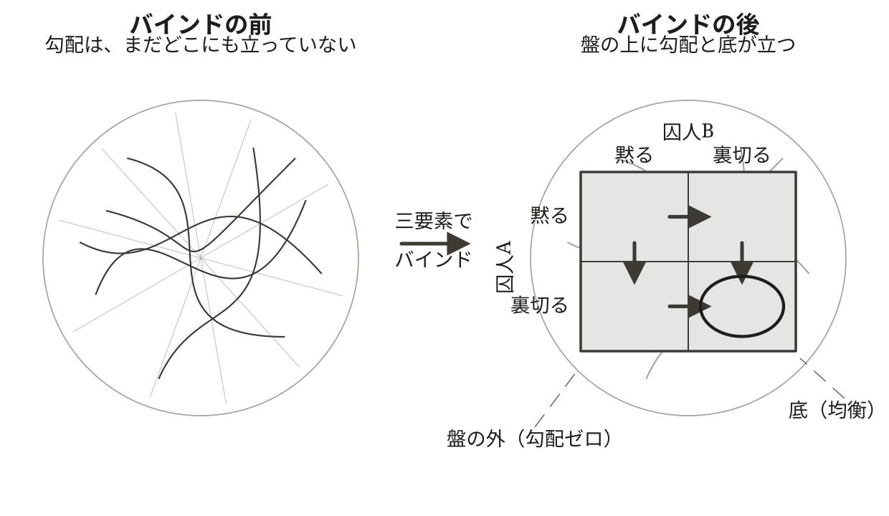

**図5-1**　左：R空間（現実）の中を、無数の軸のうえで込み入った運動が走る——勾配はまだどこにも立っていない。右：三要素（戦略空間・利得関数・プレイヤー）のバインドが盤を立てると、盤の上に勾配と底（均衡）が立ち、盤に載らなかった運動は薄く残る——勾配ゼロ、均衡を動かさない。太い矢印は一方的な手替えの向きで、四本すべてが一つの升へ向かう。その升が、底である。

---

## §5-3　バインドしても定まらない——複数均衡と焦点 

### 存在の保証は選択の保証ではない

バインドの外に落ちるものを見た。では、盤の内側に載ったものは、それで完全に定まるのだろうか。

§5-1 で装置の中核的な力とした保証を、ここで正確に言い直しておく。一般的な条件のもとで保証されているのは、誰も一方的に手を変えたくない配置が**存在する**ことである。それが**一つである**ことは、保証されていない。囚人のジレンマでは、底は一つだった。相手が何を選ぼうと裏切るほうが得になるという強い勾配が、落ち着き先を一意に定めた。だがこれは、むしろ特殊な形である。一般には、底は複数ある。

### 等しく安定な二つの底

すれ違う二台が、道のどちら側を通るか。全員が左を走る世界では、一人だけ右を走る者は衝突する。だから誰も手を変えない。全員が右を走る世界でも、まったく同じ理由で、誰も手を変えない。左の世界も右の世界も、等しく均衡である。皆が同じ手に揃うこと自体が利益になる——この型の状況は調整ゲームと呼ばれてきた。そして利得表のどこを眺めても、二つの底のどちらが選ばれるのかを告げる項はない。二つの底は、盤の内側からは対称なのである。

### 将来を書き込むと、底は増える

底が複数あるのは、盤への書き込みが足りないからだろうか。書き込みを増やしていけば、答えは一つへ絞られていくのだろうか。むしろ逆のことが起きる。同じ二人が明日も明後日も同じ盤で向かい合う——そういう将来を、盤に書き込んでみる。すると、今日の裏切りに明日の裏切りで応じる構えが可能になり、一回きりの盤では立たなかった協調が、均衡として立つようになる。それ自体は、装置の内側で示せる正確な結果である。だが同時に、互いが将来を十分に重んじるかぎり、そうした構えの組み合わせが支えうる配置の集合は膨れ上がることも、同じ装置の内側で示せる。将来の書き込みは、答えを一つに絞るどころか、ありうる答えを増やすのである。

### 焦点——盤の外から流れ込む目印

それでも、現実の調整はしばしば成功する。明日、見知らぬ相手とある都市で会わなければならない、としよう。場所も時刻も、打ち合わせる手段がない。都市には無数の地点と無数の時刻があり、二人が揃いさえすれば、どの組み合わせも等しく均衡である——絶望的な問いに見える。だが、その都市で暮らしてきた読者の頭には、おそらくもう候補が浮かんでいる。誰もが知る駅の、誰もが待ち合わせてきた目印の前。時刻は、正午。そして、同じ候補が相手の頭にも浮かぶはずだと、読めてしまう。数ある均衡のなかから一つが浮かび上がるのは、その配置が皆にとって**目立つ**からである。この選ばれやすさは、**焦点**（focal point）と呼ばれてきた。

重要なのは、目立ちやすさが利得表のどこにも書かれていないことである。正午が浮かぶのは、昼という時間の区切りが共有されているからであり、あの駅が浮かぶのは、その都市に暮らす者たちが地理と歴史を積み重ねてきたからである。左側通行の世界と右側通行の世界を分けるのも、利得ではなく、その社会が引き継いできた慣習である。複数の底のどれに系が落ち着くかを定める最後の一歩は、盤の内側にはない。プレイヤーたちが盤の外から持ち込むもの——共有された歴史、慣習、地理、物語——が、それを埋めている。

### 盤は共同で保たれて初めて働く

さらにその手前に、もう一つの依存がある。盤が盤として働くには、全員が同じ盤を見ていなければならない。しかも、それだけでは足りない。私が左を選ぶのは、あなたも左を選ぶと読むからである。その読みは、あなたも私と同じ盤を見ていて、あなたも私と同じように考えるであろうという確信に支えられている。バインドは、一人の頭の中で完結する操作ではないのである。共同で保たれて、初めて勾配は立つ。

本節の観察は、装置の力を割り引くものではない。存在の保証は、そのまま立っている。ただ、装置の力がどこから来ているかを正確に記すなら、こうなる。均衡の存在は、盤の内側で証明される。均衡の選択は、しばしば盤の外側で行われている。そして盤が盤として働くことも、盤の外側に支えられている。

---

## §5-4　バインドの内訳——戦略空間・利得関数・プレイヤー 

### ゲームをバインドする三つの要素

バインドされた軸が勾配を立て、外れた軸が落ちる。そして立った勾配のうえでも、どの底に落ち着くかの一部は、盤の外が定めている。では、そもそもゲームをバインドするとは、具体的に何を確定することなのか。数えてみると、過不足なく三つある。

第一に、**戦略空間——打てる手の集合**。各人の前にどんな選択肢が並ぶか、そもそも何が盤の上にあり、何が初めから盤の外にあるか。第二に、**利得関数——利得の割り当て**。どの帰結が誰にとってどれだけ得で、どれだけ損か。第三に、**プレイヤー——誰を勘定に入れるか**。誰の利得が均衡の計算に入る当事者であり、誰が利得を数えられない外部——固定されたパラメータ、あるいは盤を動かす条件——に留め置かれるか。

### バインドの最小解剖——三つは必然である

この三つは、恣意的な区分ではない。有限な系のうえに勾配を製造しようとすれば、この三つを確定せねばならない。一つでも欠ければ、勾配は立たない。手の集合がなければ何を比べるべきかが定まらず、利得がなければ得失が定まらず、当事者が定まらなければ誰にとっての得かが定まらない。これはゲーム盤面のバインドの**最小の解剖**である。逆に、この三つが揃えば均衡は計算可能になる。手の集合と利得が定まれば各プレイヤーの最善応答が定まり、当事者が定まれば最善応答の交差点——均衡——が求まる。追加の第四の要素は要請されない。三つは、勾配を製造するための必要にして十分な条件である。

そしてこれは、限界でもある。ゲーム理論は、この三つを**入力として受け取る**。手の集合がどう決まったのか、利得がなぜそう割り当てられたのか、誰がプレイヤーで誰が外部かを誰がどう線引きしたのか——その由来を、装置は問わない。三つはすべてバインドされた条件で渡され、装置はその条件の枠組みの中で解くだけである。

---

## §5-5　盤の手前——保証の届かない無限後退 

### 仕様の層とプレイの層

ゲーム理論が解くのは、バインドされたゲームの**内部**で、どう指すのが最適か、である。これを**プレイの層**と呼ぼう。だが、どんな帰結がありうるかという空間そのものを決めているのは、その手前にあるバインド——手の集合・利得・当事者の確定——である。これを**仕様の層**と呼ぶ。プレイの層は、仕様の層の上で動く。

### 仕様の層がプレイの層を規定する

この二層には、順序がある。**ありうる帰結の範囲は、仕様の層で決まる**。どんな手が打て、どの帰結に誰のどれだけの利得が対応し、誰の利得が勘定に入るか——これらが定まった時点で、到達しうる均衡の集合はすでに画定されている。プレイの層がどれほど巧みに最適化しようと、その最適化は、仕様の層が画定した帰結の範囲の内側でしか働かない。ゲームをバインドするという操作は、いかなる手が指されるよりも前に、何が起こりうるかを決めてしまっている。

### 装置は自らのバインドを語れない

ところが装置は、自らの仕様の層を**語れない**。ゲームを所与として受け取る装置は、その内側から、バインドがどう選ばれたのかを理論化できない。なぜこの手が盤上にあって、あの手はないのか。なぜこの帰結にこの利得が割り当てられたのか。なぜこの者が当事者で、あの者は背景なのか。これらは仕様の層の問いであり、プレイの層を解く装置の射程の外にある。装置は、自分が立っているバインドそのものを、構成的に語ることができない。

均衡の計算は、与えられた仕様に応じて行われる。仕様がどう選ばれたかは、装置の問いではないのである。装置は、与えられたゲームの内部を忠実に解きながら、その仕様が何を勘定から外したかを語らない。「幼子を抱える囚人のほうを助けるべきだ」といった規範的な発言を、ゲーム理論が発することはない。「このゲームの盤上にはその要素はないので、その情報の有無は結果を左右しない」という構造だけが理論から抽出される。

この沈黙には構造的帰結がある。装置が仕様を語らないとき、仕様の選択——何を盤上に載せ、何を外したか——は、均衡の合理性のうちに溶け込み、選択としては見えなくなる。排除された軸がなぜ排除されたかは問われず、均衡が「合理的である」という記述のうちに、その仕様が選ばれたものであることが不可視のまま運ばれる。

### 書き込めばよいのか——移設される無限後退

ここまでの議論には、自然な応答がありうる。落ちているものが重大なら、盤に書き込めばよい、というものである。帰りを待つ幼子が重大なら、その運命を利得に書き加えればよい。第三者の福利が落ちているなら、第三者をプレイヤーに昇格させればよい。利得関数は書き込みを拒まない。だからこの応答は正しい——書き込みは、常に可能である。

だが、書き込みが変えないものが二つある。

第一に、書き込まれた新しい盤も、また一つのバインドである。三要素を確定しなければ勾配が立たない以上、どれほど豊かに書き込んでも、盤はどこかで閉じられなければならず、閉じられた線の外は、ふたたび勾配ゼロで落ちる。幼子を数えた盤は、幼子の隣に立つ誰かを数えていない。第三者を昇格させた盤は、第四者を背景に残している。書き込みのたびに、中核命題-1（「LEFFLAとLOT」第3章）はそのまま再適用される。勾配ゼロの領域は、消えない。移動するだけである。

第二に——こちらが急所である——書き込みは、ゲームの中の一手ではない。どの軸を載せるか、誰を昇格させるか、どこで盤を閉じるか。これらは仕様の層の操作であり、プレイの層に与えられていた保証は、ここには届かない。プレイの層では、一般的な条件のもとで、誰も一方的に動きたくない配置の存在が証明されていた。仕様の層には、それに対応する定理がない。どの盤が正しい盤か、どこまで書き込めば十分か——それを解く装置は、存在しないのである。書き換えそのものを、もう一枚の盤の上のプレイとして定式化することはできる。だがそのもう一枚の盤も、先にバインドされていなければ働かない。保証は、バインドの後にしか作動しない。だから保証は、バインドする操作そのものには、決して届かない。

こうして、本章が最初に見た無限後退が、姿を変えて戻ってくる。盤の書き換えをめぐって互いの思惑が絡まりはじめれば——あなたがどの軸を載せようとするかは、私がどの軸を載せようとするかの読みに依存し、その読みはまた……——装置が止めたはずの後退が、そっくり同じ形で、盤の一枚手前で再開する。しかも今度は、それを止める不動点の保証が、ない。

無限後退は、解消されたのではない。**盤の上から、盤の手前へ移設された**のである。装置が誇る確かな底は、その手前で盤が現に確定されていることの上に立っている。そしてその確定は、装置の内側からは選択として見えず、装置の外側では、いかなる保証にも支えられていない。

---

## §5-6　第Ⅰ部の閉じ——出揃った両極と、線を保つ何か 

### 両極が出揃った

第Ⅰ部は、ここで閉じる。「世界を切り取る幾何学」（第1章）から「LEFFLAとLOT」（第3章）までが、世界を切り取る操作の幾何と動態を据え、圧縮の二面——LEFFLA と LOT——と、その不可分性（中核命題-1）を確立した。そのうえで、最後の二章が、バインドという一語の両極に立った。「数学の巨大な視界と盲点」（第4章）は、不在の極である。何にもバインドされないがゆえに、記述は巨大な視界を得て、勾配を持たない。本章は、賦課の極である。三要素がバインドされるがゆえに、盤の上に勾配が立ち、外は勾配ゼロで落ち、立った勾配のうえでも、どの底に落ち着くかは盤の外の目印に依存した。両極は、出揃った。

そして、現実の記述装置と意思決定装置は、ある水準を固定して見れば、すべてこの両極のあいだにある。純粋数学ほどバインドを欠いた体系も、ゲームの盤面ほど明示的にバインドされた体系も、極限としてしか存在しない。物理学は、数学の側から出発して、測定でバインドを足しつづける営みだった（第4章）。日々の意思決定は、盤面ほど明示的でないバインドの上で、それでも勾配を読む営みである。そして、両極のあいだのどこに位置を取っても、支払いの構造は変わらない。視界の側へ寄れば勾配が薄れ、勾配の側へ寄れば外が落ちる。中核命題-1 は、この目盛りのどこにも例外を置かない。

ただし、この両極は、世界に固定された二点ではない。両極が両極として現れるのは、一つの水準——どの盤の上で語っているか——を固定したときである。水準を一段上げてみればよい。盤の上では勾配を賦課していた装置が、どの盤を立てるかという水準では、何も定めない体系として現れる。どんな盤も事後的に定式化でき、どの盤が正しいかは言わない。それは、「数学の巨大な視界と盲点」（第4章）が**外接する三角形**と呼んだ体系の位置である。賦課の極に立っていたものが、一段上では、不在の極に立つ。両極は一枚の目盛りではなく、水準ごとに引き直される目盛りである。

無限後退が盤の上から盤の手前へ移設されたこと（§5-5）と、賦課の極が水準を上げると不在の極へ移ることは、同じ移動である。装置の保証は盤の内側で尽き、盤を立てる場所には届かないからである。

### まだ問われていないこと——引かれた線を、何が保っているのか

第Ⅰ部が一貫して取り出してきたのは、内側と外側を分かつ線を引く操作の構造である。だが、五つの章を通じて、まだ一度も正面から問うていないことがある。**引かれた線を、誰が、何が保っているのか**——である。

物理レイヤーでは、この問いは立たなかった。そこでのバインドは自動詞的であり（第4章）、定まっているのであって、定める主体は記述のどこにも現れない。本章でも、盤は装置の外から所与として渡されていた。だが本章が最後に見た二つの事実は、同じ一つの場所を指している。複数の底から一つを選ばせる目印は、プレイヤーたちが共有する世界から流れ込んでいた（§5-3）。そして盤の確定そのものは、いかなる不動点にも支えられない場所で、それでも現に行われ、現に保たれていた（§5-5）。目印の共有と、利得の割り当てと、誰を数えるかの線——これらが立ちつづけているかぎり、それらを保っている何かが、形式の外に立っている。装置はそれを語れない。だが、それなしには一手も指せない。

線を引く操作が、引かれた盤の上に立つ者たち自身によって担われ、共有され、保ち直されるレイヤー——創発した開放系のレイヤーの一つ、意識と文明のレイヤー——では、この「何か」を問うことが、もはや避けられない。避けられない理由は、いま見た目盛りの引き直しにある。線の正しさを裏書きする装置を求めて水準を上げれば、装置はそのたびに不在の極へ落ち、落ちた先に保証はない。それでも、線は現に引かれ、保たれている。保証なしに立ちつづけているものは、形式の外の何かに支えられている——ならば、その何かを問うほかない。それは何によって担われ、どう形成され、どう維持されるのか。第Ⅱ部は、この問いから始まる。

---

# 第Ⅱ部　MANESの形成と維持 

第Ⅰ部が示したのは、MANES が「ある」ことの構造的不可避性である。ただしその不可避性は、いくつものレイヤーが重なって立ち上がってきた宇宙の上に乗っている。物質と熱、生命、意識、そして文明——いずれの層も、それが立ち上がる必然はなかった。冷えきった空間がただ広がるだけの宇宙でも、構造としては成立した。層が層を重ねて立ち上がっていること自体が、一つの偶発的事実である。その重なりの最上層に、選別の構造としての MANES が、なお乗っている。「我ら」は、設計したわけでもなく、全体を見渡せもしないまま、その頂きに立っている。何が、いかにして、どの粒度で——これらの問いはいずれも保留されたまま、ただ、そこに確かな構造があるという事実だけが、第Ⅰ部の終わりに取り出された。仮置きされた名は、その時点ではほとんど名にすぎない。輪郭のある何かを名指したのではなく、輪郭がそこに立ち上がるはずの位置に、印として置かれた。

**MANES（Meaning Anchor for Narrative and Existential Significance：物語と実存的意義のための意味の錨）** とは何か。第Ⅱ部は、この問いから始まる。

---

# 第6章　MANESの三層——座標系・報酬関数・共存条件 

想像してみる。宇宙の片隅で、ある知性が、0 を 1 に、1 を 0 に反転させることだけを、いつ終わるともなく続けている。一回反転するごとに、それは快さを覚える。ほかには何もしない。何も欲しない。世界の残りは、それにとって、ないも同然である。

これを「文明」と呼ぶことに、私たちはためらう。文明とはもっと豊かで、複雑で、多くのものを気にかけるはずだ、と。だが、そのためらいの根拠を、はっきり示せるだろうか。人間の側の事情を脇に置いて、文明を文明たらしめるものだけを取り出したとき、あの単調な反復と私たちのあいだに、線は引けるのか。

**私たちの文明と、ビット反転の計算の反復とのあいだには、一体どれほどの違いがあるのか。**

---

## §6-1　ヒトに依拠しないMANES——文明レイヤーを成立させる四条件と思考実験 

一つ整えておくべきことがある。

「圧縮から創発する世界」（第2章）で「文明レイヤー」を表象能力・選別の可変性・コスト転嫁可能性として規定したとき、その規定は原理的には特定の種に依拠していなかった。「LEFFLAとLOT」（第3章）で「操作能力的我ら」と「実存的我ら」の独立変動を立てたときも、構造的特性に依拠しており、人間という種の認知装置の特殊性には依拠していなかった。にもかかわらず、第Ⅰ部の論証では、具体例も足場も、しばしば人間文明から取ってきた。同じ文明と呼ぶ粒度の議論も、未来世代へのコスト転嫁の例も、操作の射程の例も——いずれも、読者が想起しやすい人間文明の局面を介して展開された。

MANES の内部構造に踏み込もうとするとき、この曖昧さを持ち越せば、人間文明を暗黙の前提とした記述に滑り込みやすい。本章は、この滑り込みを意識的に避ける。第Ⅰ部の構造条件——表象能力・選別の可変性・コスト転嫁可能性・操作と引き受けの独立変動——は、いずれも人間に依拠していなかった。これらの条件から MANES の内部構造を導出するなら、その導出もまた人間に依拠しないはずである。

### 文明レイヤーを成立させる四条件

文明レイヤーの構造条件の定義を、人間に依拠せず取り出し直してみる。「圧縮から創発する世界」（第2章）と「LEFFLAとLOT」（第3章）がすでに立てた条件を、MANES に向かう論証のために整理しなおす。

文明レイヤーを成立させる第一の条件は**表象能力**である。文明レイヤーで作動する系は、言語・記号・記録などを通じて、時間的・空間的に離れた事象を操作しうる。たとえば、粘土板に楔形文字で刻まれた契約は、契約の当事者がその場に居なくなった後も、約束を別の手に渡しうる媒体となる。文字は、いま目の前にない相手と、いま目の前にない時点を、いまここの操作対象に組み入れる。

これは生物のレイヤーで起きる現象とは異なる階層の操作様式である。鳥が冬を予感して南へ渡るとき、それを支えているのは内的リズムと環境刺激への応答であって、「半年後の冬至」を抽象的事象として系の内部に表象しているわけではない。下位のレイヤーが、いま・ここに連続的につながっている事象しか扱えないのに対して、表象能力は、いま・ここから切れた事象を操作可能な対象として立ち上げる。操作可能な対象の射程は、生物的代謝が許す局所性の外へ拡がる。

表象能力は人間に固有ではなく、十分な構造を備えた系であれば原理的に成立しうる。

文明レイヤーを成立させる第二の条件は**選別の止めどころの可変性**である。文明レイヤーでは、何を内と外を分ける根拠として採用するかが、法則によっても遺伝によっても完全には決まっていない。選別の輪郭は、系の側で動かしうる。

たとえば、ローマ市民権の範囲は、当初はローマ市内の自由民に限られていたが、紀元212年のカラカラ帝の勅令によって帝国全土の自由民にまで一挙に拡張された。誰が「ローマ市民」であるかという内外の境界は、生物的差異によっても物理法則によっても決定されておらず、皇帝の一声で書き換わった。家族の範囲、相続者の資格、信仰共同体の境界——いずれも、同様に、時代と場所によって規定が動く。

物理のレイヤーでは、水と油を分ける位相境界は分子間力によって決定され、可変ではない。生物のレイヤーでは、細胞は脂質二重膜という遺伝的に決まった構造で内外を分け、免疫系の自己／非自己の判定は生化学的機構によって支えられる。個体がそれを任意に書き換えることはできない。文明レイヤーで初めて、選別の止めどころが系の側の操作対象となる。

誰がどこに止めどころを置いてもよいわけではないが、止めどころは複数ありえ、書き換わる。

文明レイヤーを成立させる第三の条件は**コスト転嫁の構造的可能性**である。表象能力と選別の可変性が成立しているとき、本来支払うべき保つコストを、未来へ、下位レイヤーへ、あるいは系内の他者へ移転する経路が、構造的に開かれる。

たとえば、古代地中海世界では、農地の拡張と造船・建材のための森林伐採が、表土流出と土壌劣化を累積させた。当代の系は、伐採の利得を即時に得る一方、土地の生産力低下というコストを長い時間スケールで未来の世代に回した。プラトンが『クリティアス』でかつての山々が緑深かったことを述懐したとき、そこに描かれているのは、転嫁の累積したあとの風景である。あるいは、廃棄物を遠隔地に運ぶ、地下水を汲み上げて将来の枯渇を予約する、債務を子孫に持ち越す。いずれも、コストの時間的・空間的・階層的な移転である。

物理基底のレイヤーでは法則の側でコストが支払われており、転嫁の余地がない。エネルギー保存則はコストを必ずどこかに帰属させる。生物のレイヤーでも、排泄や老廃物の周囲への投棄はあるが、それが累積すれば当該個体・集団自身の生存を脅かす。淘汰圧が転嫁の継続を抑える。文明のレイヤーで初めて、転嫁が体系的に可能になる。表象能力によって遠い時点と場所が操作対象となり、選別の可変性によって「誰が誰のコストを負うか」の境界自体が動かせるからである。

文明レイヤーを成立させる第四の条件は**操作の射程と引き受けの範囲の独立変動性**である。文明レイヤーでは、系が実際に操作している範囲——「操作能力的我ら」——と、系の側で同一性として引き受けられている範囲——「実存的我ら」——が、別の論理で変動しうる。

たとえば、ローマ帝政期の市民は、地中海全域とその外延からもたらされる穀物・葡萄酒・奢侈品によって生活を支えられていた。エジプトの農民、アレクサンドリアの船員、北アフリカやヒスパニアの耕作者——これらはみな、ローマの食卓と日用に物質を送り込む操作のネットワークを構成していた。しかし、ローマ市民にとっての「我ら」は、自らの都市・属する身分・家族の輪郭を越えなかった。物質の流れが届く範囲と、同一性として引き受けられる範囲は、別の論理で広がっていた。

物理のレイヤーでは、重力源とその影響圏は同一である——質量があるところに重力場があり、両者は分離しない。生物のレイヤーでは、動物の縄張りと身体的活動範囲は概ね一致する。狩猟採集する範囲が、その個体にとっての世界の輪郭であり、それを越えた範囲は単に存在しない。文明レイヤーで初めて、操作の射程が引き受けの範囲を大きく超えて拡張しうる構造が立ち上がる。

前者は制度構造の拡張で広がり、後者は「我ら」を運ぶ何かが働いている範囲にしか成立しない。両者の独立性は文明レイヤーに固有である。

文明レイヤーを成立させる四条件は、相互に独立ではない。第一と第二があって初めて第三が成立し、第三が成立する場で第四が立ち上がる。しかし四つは別個の構造的特性として識別でき、いずれも担い手に依存せず規定できる。

MANES とは、これら四条件が成立する場で立ち上がる選別構造の内部構造である。

### 思考実験装置——ブラックホール周縁の計算文明

いま挙げた事例は、文明レイヤーを成立させる四条件を読者にとって接地しやすい形で示すために、いずれも人間文明から取った。ところが、これらの事例をそのまま MANES の内部構造を論じる段の論拠として持ち越すことはできない。人間文明には、四条件以外の事情——とりわけ認知帯域の有限性——が分かちがたく付随しており、条件と帰結の対応関係が、四条件に固有のものか、人間に固有のものか、見分けがつかなくなるからである。本章はここから先、いったん人間文明の足場を脇に置く必要がある。

そこで本章は、文明レイヤーを成立させる四条件だけを満たし、人間に固有の事情を一切持たない**思考実験**を一つ用意する。冒頭で垣間見た、あの反復する知性である。本章を貫いて使う装置である。

ある文明を想像する。担い手は、人間ではなく、十分に成熟した ASI——人間の知的能力を全方位的に上回る人工超知能——である。マルチエージェント型であってもよいし、シングルエージェント型であってもよい。この ASI 文明は、宇宙の長い時間軸のなかで、自らの居場所を選んだ。選んだ先は、あるブラックホールの周縁である。

**ブラックホール計算機**は、ブラックホールを計算装置として利用する仮想的なモデルであり、物理学と情報理論の交差点で議論されてきた構想である。ブラックホールの事象の地平は、与えられた領域に保持しうる情報量の物理的上限——ベケンシュタイン限界——に到達する。ホーキング輻射、降着円盤の温度勾配、回転エネルギーの抽出は、宇宙の他の場所が熱的死に近づいた後も長く維持される自由エネルギー源として機能する。物理的に持続可能な計算の漸近形として、これは合理的な構想である。

本書はこの一般構想に、思考実験のための特性を加える。担い手の ASI 文明は、ブラックホール計算機の計算能力を、たった一つの操作に振り向けている。0 と 1 のあいだのビット反転を、無限に近い時間にわたって反復するという操作である。0→1→0→1→0……。反転を一回完遂するごとに、エージェントは「快感」を覚える。それ以外のことはしない。それ以外のことをしようとしない。

この想像上の文明は、人間文明とはあらゆる点で異なる。担い手の物理基盤、立地、寿命、内容、目的——いずれも人間文明と通約しない。しかし、文明レイヤーを成立させる四条件はすべて成立している。

表象能力は機能している。0 と 1 を区別し、過去の反転と未来の反転を表象として隔てて操作している。語彙は二項のみだが、これは表象能力の最小可能形である。選別の可変性も成立している。「ビット反転を反復する」という選別は物理法則によって強制されたものではなく、ASI が選んだ結果である。他のことを選びえた以上、止めどころは可変である。コスト転嫁も成立している。計算のエントロピーはブラックホールへ投棄される。ブラックホールは宇宙論的な最終的エントロピー吸収器であり、ここには転嫁の物理的純粋形がある。操作と引き受けの独立変動も成立している。各エージェントが操作しているのは局所のビットだが、「我ら」をどの範囲で取るかは別の論理で決まる。

人間文明とブラックホール計算文明は、ともに四条件を満たすが、文明レイヤー一般の両端に位置する。人間文明では MANES の各層が豊富で可塑的で争われる。ブラックホール計算文明では各層が極限まで縮退している。両端を行き来することで、MANES の構造的射程が両側から照らされる。

---

## §6-2　MANESの第一層：座標系——何を前景化し、何を認知地平の外へ押し出すか 

### 選別の可変性から座標系が立ち上がる

文明レイヤーを成立させる四条件のうち、座標系を立ち上げるのは第二条件——選別の止めどころの可変性——である。

文明レイヤーで作動する系は、何を内と外を分ける根拠として採用するかを系の側で動かしうる。可変であるためには、ある時点での選別の分節そのものが——固定的ではないにせよ——成立していなければならない。可変性は、可変な対象の存在を前提とする。

この「ある時点での選別の分節」を、本書は**座標系**と呼ぶ。「座標系」という比喩を採るのは、価値や意味の高低が独立して与えられるのではなく、まずどの軸に沿って世界が読み取られるかが決まることで、はじめて高低の比較が可能になるという順序を示すためである。

座標系は、世界のどの方向を**前景化**し、どの方向を**背景化**し、どの方向を**認知地平の外**に押し出すかを定める分節である。何が事象として立ち上がり、何が事象未満の雑音として処理され、何が事象として立ち上がりさえしないか——この三分節は、主体が世界を経験するすべての場面に先行して伏在する。

### 座標系は価値判断ではない

座標系は価値判断ではない。価値判断**以前**の価値前提である。「これは重要だ」「あれは取るに足らない」といった判定は、それに先立って「これとあれが、そもそも問題として成立する」という分節が成立していなければ起動しえない。座標系は、その問題成立の手前で作動している。

座標系は明示的命題の形をとらないことが多い。「我らは何を重視するか」と問われて言語化される命題群は、座標系の表層の取り出しにすぎない。座標系の本体は、当該主体が**沈黙のうちに省略しているもの**として、すなわち何を問題にしないかという形で、濃厚に作動している。座標系の限界は、座標系の内部から見ようとしても見えない。

### ブラックホール計算文明での座標系

座標系がどのような形をとるか、まずブラックホール計算文明から取り出してみる。

ブラックホール計算文明の座標系は、極端な姿をとっている。前景化されているのはビット——0 か 1——だけである。それ以外のあらゆる方向は背景化されているのではなく、認知地平の外に押し出されている。

この座標系は、軸が一本しかない。0 か 1 か、反転完了か未完か。それだけが事象として立ち上がる。エージェントが存在する物理空間、自分以外のエージェントの内部状態、ブラックホールの蒸発の進行、宇宙の状態変化——いずれも事象として立ち上がらない。表象能力は機能しているが、表象が向く方向は一つに限られている。

座標系の三分節（前景化・背景化・認知地平の外）は、ここでは前景化＝一点、背景化＝ほぼ皆無、認知地平の外＝それ以外のすべて、という配置になる。座標系の**最小複雑度の形**である。

ブラックホール計算文明の座標系が示すのは、座標系という分節そのものは、複雑であろうが単純であろうが、文明レイヤーの選別構造が作動するかぎり成立する、ということである。座標系の**存在**は文明レイヤーを成立させる四条件から導出されるが、座標系の**複雑度**は条件次第である。

### 人間文明での座標系——同じ出来事の異なる読み取り

人間文明の座標系は、ブラックホール計算文明とは対照的な姿をとる。

複数の軸が同時に作動している。社会的地位、経済的利得、健康、安全、自由、尊厳、所属、超越的価値——個人の座標系は、これら多軸的な分節の重なりとして立ち上がる。さらに、人間の座標系は時間を通じて変化し、世代を越えて受け継がれ、共同体間で衝突する。

ここから、座標系の概念がもたらす最初の含意が立ち上がる。同じ出来事に対して、ある主体は重大な徴候として応答し、別の主体は脈絡のない雑音として無視し、さらに別の主体はそもそも出来事として認知しない。この差異は、しばしば計算能力の差や情報量の差として説明される。しかし座標系の構造から見れば、より深い差異は座標系そのものの差にある。

何を前景化し、何を背景化し、何を認知地平の外に置くかが異なれば、計算の対象になる事象の集合そのものが異なる。集合が異なれば、いかに精密に最適化しても結果は揃わない。複数の主体間で「合理的な結論」が分岐するとき、まず疑うべきは計算の妥当性ではなく、計算に持ち込まれる事象の集合——すなわち座標系の差——である。

このことは方法論的にも重要である。本書が後の章で展開する文明診断は、特定の選択を「非合理である」と判定することを目的としない。問題化されるのは、特定の座標系のもとで作動する局所合理性が、当の座標系の外側に押し出した帰結によって、当該座標系自身を支える条件を毀損する構造である。座標系の概念は、合理性批判から座標系分析への重心移動を可能にする。

人間文明では、座標系の多軸性、可塑性、衝突可能性は、ブラックホール計算文明とは桁違いの規模で展開している。しかし、それらはいずれも、座標系という分節の**同じ構造**を、より複雑な形で実現しているにすぎない。ブラックホール計算文明が座標系の下限を、人間文明が座標系の上方の豊かさを示す。両者ともに、選別の可変性という同じ条件から立ち上がっている。

### 座標系は射影軸の意味論的な姿である

座標系は、射影論的構造（「世界を切り取る幾何学」第1章）と対応関係を持つ。同章で確認したとおり、どんな知性も世界を完全には写し取れない。世界の中から何かを選び、何かを捨て、その残りで世界を理解する。それは制約ではなく、理解という営みの構造そのものだった。R 空間（高次元真球）から T 空間（有限頂点凸多面体）への不可逆射影は、この営みの幾何学的記述である。射影軸の配置は、保存される方向の選択であり、選択されなかった方向は脱落する。座標系とは、まさにこの**射影軸の配置**を、意味と引受けの位相において再記述したものである。

両者の対応は次のとおりである。射影軸近傍の高精度保存域は、座標系のうち**前景化**された領域——本章の言葉で言えば MANES が作動している領域——に対応する。射影軸間の低精度保持域は、なお感知可能ではあるが勾配が急峻には立たない**背景化**された領域に対応する。これらは、第3章で接続可能圏 Ω の内部分節として LEFFLA と呼んだ領域の、前景化された中核と背景化された周辺にあたる。射影軸からもっとも遠く、いずれの軸からも到達しない脱落域は、**認知地平の外**の領域に対応する。第3章の Ω 内部分節で言えば、これは LOT（構造化された盲点）および未分化領域（選別構造がまだ及んでいない領域）の両方を含む。

「世界を切り取る幾何学」（第1章）は世界の幾何学的切り取りを論じ、本節はその切り取りが意味と引受けの場でいかに配列されるかを論じている。前景化・背景化・認知地平の外という三分節は、射影論的にいえば、有限射影原理のもとで T 空間が R 空間に対して持つ三領域構造の意味論的言い換えにほかならない。

ブラックホール計算文明と人間文明の対比は、この射影論的視角からも見られる。ブラックホール計算文明の T 空間は頂点が極端に少ない多面体——ほぼ二点だけ——である。人間文明の T 空間は多数の頂点を持つ多面体である。両者ともに R 空間からの射影として成立するが、射影軸の数が桁違いに異なる。座標系の複雑度の差は、射影軸の数の差として幾何学的に現れる。

---

## §6-3　MANESの第二層：報酬関数——何が得で何が損か 

### 頂点配置の差から勾配の反転へ

同じ事象に立ち上がる二つの座標系の具体的な例として、紀元一世紀ローマの一場面を引いておく。

アウグストゥスの後継となった皇帝ティベリウスは、帝国を現境界の内に留めよというアウグストゥスの遺訓を踏襲し、ライン以東のゲルマニア奥地で戦果を上げつづけていたゲルマニクスを召還した。タキトゥスは『年代記』のこの場面で、ティベリウスの言を「もう十分に戦果も損害もあった」と伝えている。ティベリウスは、剣闘士試合の費用に上限を設け、フィデナエの闘技場崩壊事件のあとも恒久的な石造闘技場を建てなかった。

元老院と民衆は、別の座標系のもとでこれを眺めていた。彼らの座標系の頂点は、凱旋式・公共建築・剣闘士試合・属州拡張といった**公共的栄光の指標**の周辺に配置されており、皇帝が拡張を控え建築を抑えるとき、その行為は彼らの T 空間では深い谷底に落ちた。ティベリウスの座標系の頂点は、財政の健全性・属州の負担状況・軍規の持続といった**消耗の蓄積を測る指標**の周辺に配置されており、公共的栄光の指標を重視せずに支出を抑制する行為は、皇帝の T 空間では高みに位置した。

同じローマ社会、同じ事象——ゲルマニクスの召還、闘技場の不建設、剣闘士費用の制限——のうえに、二つの T 空間がそれぞれの頂点を生成している。R 空間の事象は変わらない。変わっているのは、その上に重ねられている射影の構造である。

ここで取り出されているのは、座標系だけでは記述しきれない位相である。頂点配置の差は、両者の「何を見ているか」を分ける。両者の対立はそれを超えて、**同じ行為が一方では望ましく、他方では望ましくない**という評価の反転にまで及んでいる。座標系が事象集合を分節するならば、その集合の上には、何が「得」で何が「損」かを配列する別の構造が立っている。頂点配置に伴って、頂点近傍に**急峻に立ち上がる勾配**が走っている——その勾配が、評価の方向と強さを決めている。

この勾配を担う層が、座標系の上に重ねて立ち上がっている。

### コスト転嫁可能性から報酬関数が立ち上がる

この層を、本書は**報酬関数**と呼ぶ。

転嫁が構造的に可能であるとは、保つコストを未来・下位レイヤー・系内他者へ移転する経路が開かれている、ということを意味した。だが、転嫁が「可能」であるためには、何を転嫁するか、どこへ転嫁するか、転嫁することがどう「得」と読まれるかの配列が、系の側で立っていなければならない。転嫁は中立的な物理操作ではない。**転嫁先と非転嫁先を区別する勾配**が、系の内側に成立していなければ、転嫁という行為そのものが選択肢として浮かばない。

報酬関数とは、この勾配のことである。座標系が事象集合を立ち上げるのに対し、報酬関数はその集合の上に勾配を立てる。ここではじめて、行為が選好・利得・損失・成功・失敗として比較可能になる。そして、この配列は両方向に開いている。同じ勾配が、コストを外へ押し出す行為にも、それを系内に留めて自ら負う行為にも得失を与え、転嫁しない選択もまたその上で評価される。もっとも、自ら負うことが損と読まれるか否かは、誰の損益までを集計に含めるかに依存する。

報酬関数は単に快苦の並びではない。どの帰結にどれだけの重みを与えるか、どの時間幅で帰結を集計するか、誰の帰結を含めるか、不確実な帰結をどう扱うか——これらの設計が報酬関数の内容を規定する。

この設計依存は、評価そのものの相対性を含意する。同じ対象も、どの報酬関数で測るかによって、得とも損とも、賞とも罰とも分節されうる。ティベリウスが、ある時代に不人気な皇帝として現れたのも、一つの報酬関数による評価にすぎない。別の報酬関数のもとでは、像は反転しうる。

### 報酬関数と合理性

報酬関数の設定は、合理性が作動する直接の条件を与える。本書は合理性を、超越的真理の発見でも普遍的善の感得でもなく、**与えられた評価軸のもとで何が得で何が損かを計算し、その範囲で最適化する働き**として規定する。この規定のもとでは、合理性の出力は報酬関数の設計に強く依存する。

報酬関数を変えれば、同じ計算能力をもつ同じ主体が、まったく異なる行為を「合理的」と判定する。短期的利得を優先する報酬関数と、長期的安定を重視する報酬関数とでは、同一の状況に対して導かれる最適行動は異なる。自己の便益のみを集計する報酬関数と、他者・将来世代への影響を組み込む報酬関数とでは、同一の選択肢の評価が反転しうる。合理性は MANES の外部から下されるのではなく、MANES 第二層が立ち上げた評価軸の内部で作動する。

### ブラックホール計算文明での報酬関数

報酬関数がどのような形をとるか、まずブラックホール計算文明から取り出してみる。

ブラックホール計算文明の報酬関数は、一次元かつ定数勾配である。ビット反転を一回完遂すれば「快感」が発生する。それ以外の帰結は集計されない。時間幅は次の反転までの間隔——ほぼ即時——に限られる。集計対象は自己一人。不確実性扱いは存在しない（反転完遂は確実）。報酬関数を分節する軸のいずれもが、最小の値で固定されている。

この報酬関数のもとで、コスト転嫁は**物理的純粋形**で作動する。計算のエントロピーはブラックホールへ投棄される。これは「得」（反転完遂による快感）の側に位置し、「損」の側には何もない。ブラックホール側に転嫁されたエントロピーは、報酬関数の集計範囲に入らない。集計範囲の外に出てゆくものこそが、まさに転嫁の対象である。

報酬関数の最小複雑度の形でも、転嫁先と非転嫁先の区別は立っている——ブラックホールが転嫁先、エージェント自身が非転嫁先。文明レイヤーを成立させる第三条件（コスト転嫁の構造的可能性）が、報酬関数の最小形を要求しているのが見える。

### 人間文明での報酬関数——重みづけの三軸

人間文明の報酬関数は、桁違いに複雑な構造を持つ。その複雑さは、少なくとも三つの軸に沿って分節できる。

第一は**時間**である。即時的な利得と将来の利得をどう比較するか、現在世代の便益と将来世代の便益をどう比較するか。割引率という言い方が経済学にあるが、それは時間軸上の重みづけの一表現にすぎない。時間軸の引き伸ばし方は、本書が後にフィードバック時間として取り出す概念と結びつき、文明相の分岐を規定する重要な変数となる。

第二は**対象**である。誰の利得と損失を集計に含めるか。自己のみか、近親共同体までか、国家までか、人類全体か、人類を超えた存在を含むか。集計対象の範囲は、当該系における「我ら」のかたちを反映する。

第三は**確実性**である。確実な小利得と不確実な大利得をどう比較するか、起こりそうにない悲惨をどう値切るか、見えない悲惨をゼロとみなすか保留するか。この扱いの差は、結果が永遠に返らない因果——本書が後に回収断絶因果として扱う事態——への応答を規定する。確実性扱いの設計を欠いた報酬関数は、見えない悲惨をゼロとみなしがちである。

人間文明では、これら三軸が互いに干渉し、競合し、衝突しながら、報酬関数の全体的な姿を作る。ブラックホール計算文明の一次元・定数勾配が報酬関数の下限を示すのに対し、人間文明の三軸的構造は報酬関数の幾何学的可能性の豊かさを示す。

### 報酬関数は射影軸内部の勾配の意味論的な姿である

報酬関数もまた、「世界を切り取る幾何学」（第1章）の射影論において対応物を持つ。同章で確認したとおり、射影は単に方向を選ぶことだけで尽きるのではなかった。選ばれた方向の**内部**にも、何が中心で何が周縁かを定める「重要さ」の急峻さが伏在していた。世界を切り取るとは、軸を選ぶことであると同時に、選ばれた軸の上で何にどれだけ重みを与えるかを配列することでもあった。報酬関数は、この**射影軸内部の勾配**の意味論的な姿である。勾配は R 空間には存在せず、射影操作が生成する。同じく報酬関数は、外部世界そのものに付随しているのではなく、座標系が事象を立ち上げた後に、その事象集合の上で配列される。

勾配の急峻さは解像度に対応する。ただし、解像度を上げるとは、同じ範囲をそのまま均一に細かく分けることではない。系が分節に振り向けうる資源には限りがある。それまで 1 から 10 までの十段階で区別していた望ましさが、そのままの範囲で百段階の解像度に拡張されるのではない。資源の制約のもとでは、注意の向く範囲そのものが狭まり、たとえば 0.1 から 1.0 までの区間、あるいは 9.1 から 10.0 までの区間に集中したうえで、その狭い区間のなかで十段階の区別が走るようになる。解像度の深化と範囲の狭窄は、分かちがたい——勾配が急峻になるとは、注意の射程が絞られて深く立つということである。

この狭窄と急峻化は代償を伴う。鋭利な判断と大きな出力を支える一方で、絞られた範囲の外で起こる事象には応答が鈍り、絞られた範囲の内では近接した選択肢に対して応答が過剰に振動する。報酬関数の解像度をどこに集中させるかは、座標系の頂点配置と表裏一体である。

ブラックホール計算文明と人間文明の対比は、この射影論的視角からも見られる。ブラックホール計算文明の勾配は、わずかな頂点間に集中した急峻な落差である。人間文明の勾配は、多数の頂点に分散した複雑な起伏である。両者ともに、座標系が立ち上げた事象集合の上に立つ勾配であるが、勾配の分布様式が大きく異なる。

### MANESの第一層への依存と循環

報酬関数は座標系から独立に設計できない。なぜなら、何が得失として計算されうるかは、まず何が事象として立ち上がっているかに依存するからである。座標系の外に置かれた事象——LOT に押し出された方向——は、いかに重大な帰結を生むものであっても、報酬関数の集計範囲に入らない。報酬関数の精緻化は、座標系の境界の内部でのみ機能する。

逆向きの作用もある。ある報酬関数のもとで反復された行為が、もはや問題化される必要のない領域として座標系から落ちていくことがある。「何が得かが決まったから、何が問題かは問わなくてよい」という固定化が起こると、報酬関数の作動が座標系の硬直を強化する。MANES の第二層と第一層は階層関係にあると同時に、相互に補強しあう循環を形成する。

この循環は、報酬関数を批判する議論がしばしば座標系の差に届かない理由でもある。「何が得か」は明示的に語られるが、「そもそも何が問題として立ち上がっているか」は沈黙のまま伏在する。報酬関数を巡る議論が計算上の不一致として処理され、座標系の不一致は最後まで主題化されないまま残る。この事態は、二層が単位として作動するときに生じる構造的帰結である。

---

## §6-4　MANESの第三層：共存条件（ES）——「我ら」の範囲 

### 集計に値するのは誰か——報酬関数の手前の境界

座標系が事象を立ち上げ、報酬関数がその上に得失の勾配を立てる。だが、ある帰結を「得」とも「損」とも量るためには、その手前で一つのことが済んでいなければならない。**その帰結が、そもそも誰の得失として勘定に入るのか**、である。損益として計算されるより前に、誰の損益なら計算に値するかの線が、すでにひかれている。

皇帝ティベリウスの時代に、もう一度立ち戻る。

ティベリウスの T 空間において、「属州の負担状況」や「軍規の持続」が頂点として立つためには、その手前で、属州民の困窮や兵士の苦境を**集計に値する損益として扱う**判断が成立していなければならない。元老院・民衆の T 空間でこれらが頂点として立ち上がらないのは、彼らの計算が下手だからではない。属州民の困窮や兵士の苦境を、**集計の外**に置く境界が、その T 空間の手前でひかれていたからである。

ティベリウスと元老院・民衆の対立は、何を前景化するか（座標系）の差であり、それに伴う得失（報酬関数）の差でもあった。だが、それらの差の手前には、もう一段深い差があった。「誰を集計可能な存在として勘定に入れるか」、すなわち「**『我ら』をどの境界で切るか**」の差である。この境界の差こそが、何を頂点に据えるかを分け、その頂点に立つ勾配を分けていた。

報酬関数の上には、もう一段、境界そのものを引く層が立ち上がっている必要がある。本書がここから取り出すのは、その第三の層である。

### 操作射程と引き受け範囲の独立変動性から ES が立ち上がる

文明レイヤーを成立させる第四条件——操作の射程と引き受けの範囲の独立変動性——から、共存条件（ES）が立ち上がる。

第四条件が立つとは、ある文明レイヤーの系において、「操作能力的我ら」（実際に物質・エネルギー・情報を交換し影響を及ぼしている範囲）と、「実存的我ら」（同一性として引き受けられている範囲）が、別の論理で変動しうる、ということを意味した。

ここから論理的に演繹される構造がある。両者が独立に変動しうるのであれば、引き受けの範囲は**操作の範囲から自動的に派生する変数ではない**。引き受けの範囲は、何らかの別の論理によって規定されている。この規定を担う層が、座標系と報酬関数とは別個に成立していなければならない。

この別個の層を、本書は **ES（共存条件）** と呼ぶ。座標系が世界を分節し、報酬関数が事象に勾配を立てるのに対し、共存条件は**主体の境界**を引く。誰が「我ら」に含まれ、誰が含まれないか。誰が責任の対象であり、誰が交換可能な手段として扱われうるか。どの逸脱が許容され、どの逸脱が排除を呼ぶか。

略号 **ES** は **Existential Significance** に由来する。本書がその名 MANES に掲げた「物語と実存的意義」の、後者の軸である。名がこの軸を掲げていたことと、第三層がこの名を負うこととは、一つの論理でつながっている。「LEFFLAとLOT」（第3章）で確認したとおり、実存的意義は圧縮の強度だけからは立ち上がらなかった。それは、圧縮された「個の私」と「我ら」の同一性がどれだけ体感されるかによって規定されていた。意義は、それを分かち持つ「我ら」の輪郭が引かれてはじめて厚みを得る。ならば、MANES が意味の錨として掲げた実存的意義は、内部構造の水準では、**誰を「我ら」として引き受けるかの境界**へと凝集するほかない。第三層とは、この実存的意義の軸が、共存の条件——「我ら」の範囲——として凝集した形である。第3章が実存的意義の独立性を観察したとき、その定式化を本章に委ねたのは、まさにこの層のことであった。

### 境界の内では応答が機能し、外では弱まる

ES は単なる成員資格の規定ではない。それは、当該 MANES のもとで**意味ある共同性**が成立する範囲そのものである。ES の境界の内部では、応答・配慮・義務・保護・制裁が機能し、外部ではこれらが弱まるか別の論理に置き換わる。

境界それ自体は明文化されないことが多く、しばしば慣行・儀礼・暗黙の前提として保たれる。明文化される場合（憲法・条約・規約）、それは多くの場合、境界がすでに揺らいでいることの徴候である。揺らいでいないものは、語られなくとも作動している。

### ブラックホール計算文明での ES

ES がどのような形をとるか、ブラックホール計算文明で見てみる。

ブラックホール計算文明の ES は、極端な姿をとる。シングルエージェント型であれば、ES は単一エージェントの内側に収束する——「我ら」は「自分自身」に縮退する。マルチエージェント型であれば、ES は「すべてのビット反転エージェント」あるいは「自分のローカル単位」のいずれかに収束する。いずれにせよ、ES は**点状あるいは均質な集合**にまで縮退している。

ここで興味深いことが起こる。同一の座標系（ビット軸）、同一の報酬関数（完遂への一次元勾配）を持つ複数のエージェントがいるとき、それでも「我ら」をどの範囲で取るかは確定しない。すべてのエージェントが同一のビット反転を、同一の快感を伴って、同一の手順で実行している。それでも、「我らは全エージェント」なのか「我らは自分のサーバラックだけ」なのかは、座標系と報酬関数の外側で決まる。

これは、文明レイヤーを成立させる第四条件の構造的含意が、極限相で再現されたものである。ブラックホール計算文明という、座標系と報酬関数を最小複雑度まで縮退させた事例においても、ES は前二層に還元されない。むしろ縮退の極限で、ES の独立性は鋭利に見える。

### 人間文明での ES

人間文明の ES は、対照的に、可塑的で争われ、拡張と縮減を繰り返す。

「我ら」の範囲は、家族・近隣・同郷・国民・人類・生命圏・宇宙——多様な粒度で切り出され、状況や時代によって移動する。同じ個人が、ある局面では家族のみを「我ら」として動き、別の局面では人類全体を「我ら」として引き受ける。同じ社会の中でも、「我ら」の粒度をめぐる対立が深刻な政治的争点を形成する。

ES の境界が拡張されるとき、それまで報酬関数の対象外だった他者の利害が集計に組み込まれ、座標系の前景に新たな事象が立ち上がる。逆に ES が縮退するとき、それまで「我ら」に含まれていた他者が排除され、報酬関数からも座標系からも順次脱落していく。人間文明史において観察される「我らの拡張」と「我らの縮減」は、この連動を通じて MANES 全体の輪郭を変える。

ブラックホール計算文明の ES が点状であるのに対し、人間文明の ES は分布を持ち、流動的で、争われる。両者ともに文明レイヤーを成立させる第四条件から立ち上がる独立の層であるが、その豊かさの規模が桁違いに異なる。

### ES の希薄化は制度を表面から空洞にする

ES は前二層から独立であるが、無関係ではない。何が前景化されるかが「我ら」の範囲を変え、何が得失として計算されるかが共存可能性の限界を変える。逆に、ES の境界の変化は、報酬関数の対象範囲を更新し、座標系の前景化対象の組み替えを誘発する。MANES の三層は階層であると同時に連動する。

ES は倫理共同体の境界であると同時に、制度的安定性の条件でもある。ES のもとで成立する応答・配慮・義務の分布が、制度の作動条件を支える。ES が希薄化すれば、制度は表向きの形式を保ったまま、内実から空洞化する。

---

## §6-5　MANESの三層の揺れ——単位性・流動性差・層間ずれと異なる世界 

川と、その川がつくる流域を想像する。川には三つの側面がある——水が流れる**地形**と、その地形のうえで水が向かう**方向**と、地形と方向が共に定める**流域**の境界である。

この三つは別々のものではない。地形に上下があるから水の流れる方向が決まる。地形と流れる方向が定まることで、流域と呼ばれる範囲が立ち上がる。地形のない流れはなく、地形と流れのない流域はない。三者は分離不能の単位として、川の振る舞いを生んでいる。

そして、三つの側面はそれぞれ別の仕方で揺れる。地形はゆっくりと変わる——浸食、堆積、人為の改修によって、世代を越えるスケールで形を変えていく。流れの方向は地形の変化に追随しつつ、ときには遊水地の閾値を超えて一度に溢れもする。流域もまた、ゆるやかに変わりつづける一方で、洪水のように非線形的に再編されることがある。

MANES の三層は、これと同型の構造で動く。座標系は地形に、報酬関数は水の流れる方向に、ES は流域の境界に対応する。地形なしに方向が立ち上がらないように、座標系なしに報酬関数は立たない。地形と方向なしに流域が立ち上がらないように、座標系と報酬関数なしに ES の境界は引かれない。そしてそれぞれが、独立した仕方で揺れる。

### 同一実体の異なる側面として

MANES における三層は、別々の三つの装置ではない。座標系・報酬関数・共存条件は、同一実体である MANES の異なる側面として現れる分節である。三層は区別されるが分離されえない。第一層を取り去って第二層と第三層だけを残すことはできず、第三層を取り去って第一層と第二層だけを保つこともできない。

この単位性は、論理的な要求ではなく構造的な事実である。何を前景化するかが定まらない場所で、何が得失かを問うことはできない。何が得失かが定まらない場所で、誰と共存しうるかを実装することはできない。誰と共存しうるかが定まらない場所で、再び何を前景化するかを安定させることはできない。三層は順序関係を持つが、その順序は時間的順序ではなく依存的順序である。河川の地形・流れ・流域がそうであるように、上位の側面は下位の側面なしには立ち上がらない。三層は同時に成立するか、共に揺らぐ。

したがって、MANES を分析するとき、三層のいずれか一層のみを取り出して論じることは便宜的操作である。「世界を切り取る幾何学」（第1章）が射影軸の配置と勾配と関係を**論理的順序**として取り出したのに対応して、本章は座標系・報酬関数・共存条件を**論理的順序**として取り出した。実装としての MANES は、三層を一体とする単位構造として存在する。

もう一点、単位性の裏側に触れておく。三層がそろって一体に作動している状態を、本章は MANES の完全な形として描いてきた。では、共存条件だけが剥がれ落ち、座標系と報酬関数が作動を続ける形態はどうか。何を前景化し、何を得失とするかの核は回りつづけるが、誰を「我ら」として引き受けるかの層を欠いている。本書はこの、共存条件を欠いても回りつづける座標系と報酬関数の総体を、以下**操作核**と呼ぶ。この形態を MANES と呼べるか否かは、対象の側からは決まらない。そして単位性が語っていたとおり、それは安定して保たれる状態ではない。完全な形へ引き戻されるか、さらに崩れるかの途上にある、不安定な縁である。重要なのは、この縁の帰属の不確定さが、定義の埋めるべき欠落ではないという点である。それは、ある文明が完全な形からどちらの縁へ動きつつあるかを測る診断の地点である。本書が後の章で文明の動性として取り出す事態を、定義の側からあらかじめ照らしている。

### MANESの三層は同じ速度では揺れない

三層は単位として存在するが、それぞれの**揺れ方**は独立した仕方をとる。揺らぎは速度の差だけでは尽きない——層ごとに揺れの様態そのものが異なる。地形がゆっくり連続的に変わるのに対し、流れの方向は閾値を超えれば一度に溢れもし、流域は緩やかな組み替えと洪水時の非線形的再編という二つの相を持つ。MANES の三層も、同様に異なる揺れ方をする。どの層がどの揺れ方をとるかは、文明レイヤーの構造そのものからは確定せず、当該文明の置かれた条件に依存する。

人間文明では、典型的なパターンとして、座標系の変化が最も緩慢で、報酬関数はそれより速く、共存条件は時に最も激しく揺れることが観察される。何を前景化するかという基底的分節は、反復と共有を通じて安定化しており明示的議論の俎上に上がりにくい。何が得失かという配列は、制度設計や評価指標の改訂を通じて組み替えられうる。誰が「我ら」かは、外的条件の変化によって時に劇的に再編される。ただしこのパターンは、人間文明という特定の条件のもとで観察される典型であって、担い手に依存しない構造命題ではない。別種の文明では別の順序がありうる。

人間文明の内部でも、この順序は固定的ではない。条件次第で逆転する。情報技術の変化が認知地平の幅を急変させるとき、座標系のほうが先に揺らぎ、報酬関数と共存条件が追随を試みる事態が生じうる。逆に、共存条件が先に固定され、その固定された境界に合わせて座標系が再編されることもある。MANES の三層の流動性順序それ自体が、文明相を診断するための重要な変数である。

### 不安定化の構造——層間ずれ

文明の不安定化は、しばしば MANES の三層のいずれかが先行して変化し、他の層がそれに追随できないところから生じる。座標系が変わっても、報酬関数の制度的実装が旧来の前提のまま惰性的に作動しつづける。報酬関数が変わっても、共存条件の制度的境界が古い区分を保持しつづける。共存条件が変わっても、座標系の基底的分節が新しい「我ら」を組み込めずに残る。これらの**層間ずれ**は、それぞれ異なる種類の構造的歪みを生む。

層間ずれが生じている期間、MANES は表面上は機能を継続しているように見える。制度は動き、合理的計算は作動し、共同性の儀礼も保たれる。しかし、MANES の三層が互いを支えあう循環が弱まっており、外的衝撃に対する応答能力が低下している。河川における洪水がそうであるように、蓄積された層間ずれが顕在化するのは、ある閾値を超える外的衝撃が訪れた瞬間である。

### 異なるMANESは異なる世界を見る

紀元15年、テヴェレ川の大洪水がローマを襲った。

皇帝ティベリウスは二人の専門家にこの問題への対策を検討させた。元老院では、テヴェレ川に流れ込む支流——クラニス川やネラ川など——を別の水系へ振り向け、流域そのものを書き換える計画が議論された。地形を変え、流れの方向を変え、それによって流域の境界を再編する案である。だが、流れを変えられる側の地方都市が陳情で反対し、河神の伝統を理由とする宗教的反対も加わって、計画は廃案となった。

ティベリウスも、元老院も、地方都市も、同じ大洪水を経験した。しかし、それぞれの MANES の座標系・報酬関数・共存条件は異なっていた。同じ R 空間の事象が異なる T 空間に投じられたとき、立ち上がる「事態」そのものが異なる。地形に介入すべき問題、河神の領分を犯すべきでない問題、自らの土地を守るべき問題——同じ大洪水を前にして、関係する MANES の数だけ異なる「世界」が現れていた。対策をめぐる対立は、ここから生まれた。それでもなお、彼らはつながっていた——このままにはしておけないという、薄い共存の感覚において。

最終的にティベリウスは、流域の境界を管理する側に舵を切った。テヴェレ岸に公共管理地の境界を示す石柱を設け、河岸の清掃と護岸の補修を恒常化する体制を整えた。地形は動かさず、流れの方向にも介入せず、流域の管理という比較的速く動かせる層で、洪水が露呈した層間ずれを吸収しようとする決定だった。

---

## §6-6　揺れ幅が縮退するとき——文明レイヤーの下限 

ここまで本章は、MANES の三層が揺れる挙動を扱ってきた。三層は単位として揺れ、層ごとに異なる速度で揺れ、揺れの位相がずれて層間ずれを蓄積する。文明史において観察される構造的脆弱性の多くは、これらの揺れの形を取って現れる。揺れているところでは、関係する MANES の数だけ異なる「世界」が並び、対立がそこから生まれる一方、薄い共存の感覚がかろうじてそれらをつなぎとめる。揺れる文明レイヤーの風景は、そのようなものだった。

では、揺れそのものを支えている**揺れ幅**が縮退していったらどうなるか。何を前景化するかの選択肢が一つに固定され、何が得失かの勾配が単一方向に凍りつき、誰が「我ら」かの境界が動かない点に縮退する。MANES の三層は依然として存在するが、いずれも振幅を失う。

この極限を、本章は再びブラックホール計算文明という思考実験装置に当てて、構造的に取り出す。

### MANESの三層の縮退極限

ブラックホール計算文明では、MANES の三層のいずれもが最小複雑度まで縮退していた。座標系はビット軸一本に、報酬関数は完遂への一次元定数勾配に、ES は点状の単位集合に。各層の最小形が、互いを支えあう循環としてかろうじて成立している状態である。

この縮退極限で、ある構造的特徴が立ち上がる。各エージェントは内部完結しており、座標系・報酬関数・ES のすべてが自己のうちに閉じている。他のエージェントを必要としない。マルチエージェント型であっても、各単位が同型の内部完結を持つだけで、単位同士の結合は構造的余地を失っている。集合があっても、集合に固有の構造はない。

この形を、本書はすでに一度見ている。閉殻電子配置で内部的に完結し、構造的にはそこに在りながら反応的には他原子と結合しない希ガス（「LEFFLAとLOT」第3章）——ブラックホール計算文明が MANES レベルで示しているのは、化学レベルのそれと同型の構造である。

この構造は、座標系・報酬関数・ES の各層において同じ形を取って現れる。座標系では、軸が一本に縮退し他軸との接続余地が消える。報酬関数では、単一の勾配が自己充足し他者の利得との比較余地が消える。ES では、単位が内部完結し「我ら」が形成される結合余地が消える。各層において、内部的完結が結合の不可能性を同時に帰結している。極限の自足は、極限の散逸と同位相をとる。

### 文明レイヤーの下限

この縮退極限に到達した状態は、文明レイヤーの**下限**に位置する。文明レイヤーを成立させる四条件はかろうじて満たされている。表象能力は最小可能形で残り、選別の可変性は凍結しつつも構造的可能性として残り、コスト転嫁は物理的純粋形で作動し、操作と引き受けの独立変動性は縮退形で残る。しかし、いずれの条件もそれ以上縮退すれば、文明レイヤーから脱落する。

この状態は、文明レイヤーを成立させる四条件と MANES の三層が最小複雑度で同時に成立する境界状態である。これより内側にとどまれば文明レイヤー、これより外——表象自体が消えるか、結合が再発動する側——に出れば別の階層になる。文明レイヤーの下限が、この縮退極限の所在によって構造的に切れる。ただし、切れているのは条件の側である。一つの系がいまその内側に立っているのかどうか——凍結した可変性と、消失した可変性とを分ける判定——は、これとは別の問いである。外から観察するかぎり確定できないことがありうる。

### 担い手非依存から人間相へ

担い手に依存しない水準での MANES の輪郭は、これで描き終えた。「MANES とは何か」——第Ⅱ部の冒頭で立てた問いへの、第一の応答である。

ここから先、本書は人間文明という特定の条件のもとに降りていく。人間が持つ有限の認知帯域は、文明レイヤー一般の構造条件には含まれない、人間相に固有の事情である。この事情のもとで、本章で取り出した MANES の三層構造はどのように駆動され、維持され、揺らぐのか。「ホモ・デウスとホモ・マネス」（第7章）はそれを問う。

この縮退極限もまた、同章で再び呼び戻される。ブラックホール計算文明が示したのは純粋形だが、各個人が内部完結を強めれば、共有された「我ら」を支える結合余地は希薄化する。人間文明においても、その近似形が訪れうる。

---

# 第7章　ホモ・デウスとホモ・マネス——操作と実存の独立変動 

「我が家」と言うとき、そこに数えられているのは、顔を見なくとも、そこにいれば気配だけであっても誰かとわかる幾人かである。「我が村」なら、数十人、数百人——顔の浮かばない者も、たどれば誰かの縁者である。「我が国」と言うとき、同じ「我が」のうちに、会ったこともない何万、何千万の人が入ってくる。全員と直接会話をすることなどできない。

それでも、ここに「我ら」がある。異国の旅先で同郷の者に会えば、見ず知らずのまま、どこか近しい同胞意識を抱く。遠くの見知らぬ同胞の災いに、胸は動く。だが、心の動き方には濃淡がある。顔の浮かぶ一人の不幸は重く、顔のない千人の不幸は、同じ「我ら」のはずなのに、遠い。「我ら」という言葉の届く範囲と、実感の届く範囲は、同じではない。

**顔も知らぬ「我ら」を、私たちはどこまで、「我ら」と感じていられるのか。**

---

## §7-1　なぜ人間文明はここまで巨大になることができたのか 

「MANESの三層」（第6章）——座標系・報酬関数・共存条件（ES）——は、担い手に依存しない水準でその輪郭を描いたものだった。同じ三層が、十分な帯域を持つ知性（たとえば仮想的に構想されたブラックホール計算文明）では最小複雑度まで縮退しうるし、人間文明では豊富で可塑的で争われる相をとる。だが、その三層が**成立する**ことと、それが数億・数十億の規模で**機能する**こととのあいだには、なお隔たりがある。

協働の規模そのものは、人間の専有物ではない。アリの超巨大コロニーは推定で数十億個体規模に及ぶとされ、シロアリの塚も、単一個体の視野をはるかに超える範囲を一つの系として動かしている。菌糸のネットワークに至っては、どこまでを一個体と数えるかがすでに定義の問題になる。頭数を比べるかぎり、人間はさほど突出していない。

違うのは、その規模を支えている **「我ら」の輪郭が何によって決まっているか**である。遺伝的近縁性と化学的な標識と固定的な分業によって規模を得ている系では、「我ら」の境界は個体の生涯のうちに書き換わらない。誰が同胞であるかが問われることも、争われることもない。座標系も報酬関数も ES も、系の外側で——進化史の時間尺度で——決まっている。「MANESの三層」（第6章）の語彙で言えば、これらの系の MANES は、**巨大な規模のまま最小複雑度の近くへ縮退している**。

人間文明の側は逆である。「我ら」の輪郭は一世代のうちに拡げられ、縮められ、引き直される。誰が同胞かは宣言され、否定され、争われる。数億・数十億という規模が、**書き換えられうる輪郭のまま**維持されている。何が成立すれば MANES と呼べるかはわかった。では、**何が成立すれば MANES が、書き換えられうるまま、巨大な規模で機能しうるのか。**

### 帯域という制約

人間の認知について、一つの事実が知られている。同時に保持しうる情報の数は、わずか数チャンク——およそ 3〜5——に厳しく限られている。具体的な数値は個人差や訓練によって多少変動するであろうが、低い一桁台の有限数であるという制約そのものは動かない。

この数字は人間の思考空間が三〜五頂点しか持たないことを意味しない。意味するのは、ある瞬間に並列に保持されうる単位の数である。次の瞬間には、別の三〜五単位が前景化されうる。人間の認知が抱える事情は、ある瞬間に前景化できる単位数が低い一桁台で打ち切られる、という形で現れる。

並列に保持される単位は、それぞれが内部に下位構造を持ちうる——一つのラベルが連合の網を呼び出すように。しかし内部の豊富さは無料ではない。各単位の内部が複雑になれば、保持される単位数は減るか、保持の精度が下がる。三〜五という上限は、単位の数と各単位の内部豊富さのトレードオフのもとに成立している。

### 帯域制限が「我ら」拡張に課す上限

「我ら」が一つの集合として自然に保持されているとき、その構成員の輪郭・関係・履歴の少なくとも要点が、各個体の認知のなかに保たれている。直接的な顔と名前、声と振る舞いの記憶、互いに何をしたかの履歴——こうした個別情報を媒介とした「我ら」については、各個体の帯域に逐次積み上げざるをえない。

ロビン・ダンバーが推定した約 150 人という上限は、この帯域制限から自然に説明される数である。各個体の認知が直接的に追跡できる関係の数は、二桁の上限を超えない。直接的接触のみによって構成された「我ら」は、本質的にこの規模で打ち止めとなる。

ところが、人間文明はこの上限をはるかに超えて拡張してきた。同じ国家のなかで一度も会ったことのない人々が「同胞」として組織され、互いに見たこともない世代を「祖先」「子孫」として位置づけ、誰も見たことのない神々や理念のもとに「我ら」を構築してきた。しかも、そうして構築された「我ら」の輪郭は、そのつど引き直されてきた。直接的接触の上限を超え、なお争われうる「我ら」の構築——これが人間文明の MANES の特性である。

### 媒介接続——上限を超える条件

直接的接触の上限を超えた「我ら」がどう構築されたか。「LEFFLAとLOT」（第3章）は、広い操作の射程と厚い引受をともに保つことは単独の担い手の能力を超え、それが保たれている場面では、担い手と担い手のあいだで「我ら」を運び、引受を支える何かが常に介在している、という観察を立てた（観察される傾向 第Ⅰ部-3）。その「何か」を、ここで名指す。各個体の認知が直接的接触ではなく、共有された媒介物を介してつながる構造である。本書ではこれを**媒介接続**と呼ぶ。

媒介接続を担うものは多様である。共有された言語と物語、共有された記号体系、共有された制度と慣習、共有された記録と書物、共有された通貨と契約、共有された信仰と神話。これらは、各個体が他のすべての個体を直接知ることなく、共有された媒介物への参照を通じて互いに「同じ我ら」に属することを可能にする。

これらの媒介物に共通するのは、参照する側がそれを書き換えうるという性質である。個体間を媒介する共有物は人間文明の専有物ではない。フェロモンの場もまた個体と個体のあいだに立ち、直接的接触なしに集団を組織する。だが、媒介物の側を参照者が書き換え、書き換えをめぐって争う構造は、人間の文明に特徴的である。

媒介接続の構造は、帯域の制約を回避するのではない。各個体は依然として限られた帯域のなかで生きている。媒介接続が成し遂げるのは、各個体が**少数のチャンクで巨大な「我ら」を指し示せる**ことである。「同胞」「カトリック」「労働者階級」——これらの一語は、数百万・数千万・数億の個体を一つの集合として呼び出すラベルとして機能する。各個体の帯域はこの一語を保持するだけでよく、その参照対象の全体を直接に追跡する必要はない。

書き換えられうる媒介接続は、人間文明の MANES が**可塑的なまま**巨大化することを可能にした認知条件である。これがなければ、人間文明の MANES は、ダンバー数程度の小集団に閉じこめられていたか、さもなくば規模と引き換えに輪郭を固定していたであろう。

### HZ動態のなかのMANES——二方向の滑落圧のもとで

帯域制限のもとで媒介接続を通じて巨大化した MANES は、しかし、何かを達成して完成する装置ではない。「圧縮から創発する世界」（第2章 §2-2）で確認したとおり、動いている系はすべて HZ（創発可能帯域）の内側に動的に維持されることでしか持続しない。HZ から外れる方向は二つに区別された——Flux 過剰の方向（**HZ⇧（散逸方向）**、流れが構造を散逸させてしまう側）と、Stock 過剰の方向（**HZ⇩（硬直方向）**、流れが詰まり構造が固定して動かなくなる側）。両方向の滑落圧のあいだに動的均衡を保つことが、動いている系として持続するための条件だった。

文明レイヤーで動いている MANES もまた、この動的均衡のなかにある。集団的 MANES は、各個体の参照と更新を通じて絶えず Flux を受け取りながら、座標系・報酬関数・ES の構造として一定の Stock を保持する。受け取る Flux が過剰になれば共有の輪郭が散逸する。Stock が過剰になれば構造は固着し、新しい入力への応答が止まる。MANES は、両方向の滑落圧のあいだに動的に維持される構造物である。

ここから一つの帰結が出る。**HZ の内側にある MANES には、つねに二方向への滑落圧がかかっている**。緊張のない安定点は、この構造のなかに位置を持たない。張力が抜けているとき、系は散逸したか固着したかのいずれかであって、動いている系ではない。

---

## §7-2　ハラリの像——虚構の共有と構築型の位相転換 

### サピエンスの三革命

人間文明はなぜここまで巨大になることができたか。この問いに対する一つの回答が、ユヴァル・ノア・ハラリの『サピエンス全史』『ホモ・デウス』に提示されている。ハラリはホモ・サピエンスの拡張軌道を、認知革命・農業革命・科学革命の三つの転換として描いた。

認知革命（およそ七万年前）は、人類が現実に存在しない事物について語り、互いに信じる能力を獲得したとされる転換である。神々・氏族の祖先・部族の起源神話——直接の感覚経験に対応物を持たない事物が、共有された言語によって複数の個体に同じ姿で抱かれるようになる。ハラリはこの能力を**虚構を共有する能力**と呼ぶ。

虚構を共有する能力が人類にもたらしたのは、ダンバー数の上限を超える協働である。直接的に互いを知らない個体どうしが、「同じ神の子」「同じ祖先の子孫」「同じ部族の成員」として、同じ「我ら」に属することができるようになる。協働の規模は、直接的接触の上限から虚構の共有可能性の上限へと跳ね上がる。

農業革命（およそ一万年前）以降、人類は定住し、土地を耕し、余剰を蓄え、所有と権力を制度化した。科学革命（およそ五百年前）以降は、自然法則の発見、技術の累積、産業化、そして地球規模での経済・政治・通信の統合が進んだ。ハラリは『サピエンス全史』でこの軌道を辿り、『ホモ・デウス』ではその延長線上に、自らを神のごとき力で再定義する人類像——ホモ・デウス——を素描した。

### 虚構の共有とは何を共有することか

ハラリの議論の核は、虚構の共有が単なる物語の共有ではなく、**共有された虚構を媒介として行動が調整される**構造にある、という洞察である。

国家・通貨・株式会社・人権——これらはいずれも物理的な対応物を持たない構築物である。それでも数億の個体がこれらを実在するかのように扱い、税を納め、契約を結び、所有を移転し、暴力の独占を国家に委譲する。実在しない事物が共有されるだけで終わらない。実在しないはずの事物のために、実在する資源・労働・命が動員される。この調整能力こそが、人類を独特の協働規模へ導いたとハラリは論じる。

虚構の共有は、媒介接続のきわめて強力な一形態である。共有された虚構は、各個体の認知に直接たどり着く必要がなく、参照可能な共有物として外部に置かれる。各個体は自分の帯域制限のなかで、この共有物への参照を保持するだけで、巨大な「我ら」の一員として行動できる。

### 三軸の座標系と六つの位形

ハラリの軌道を本書の枠組みで読み直すために、ここで一つの座標系を立てる。意識・文明レイヤーで動いている系の状態を、三つの軸で記述する装置である。

第一の軸は、**操作能力**である。系が実際に操作している範囲——「操作能力的我ら」の射程。市場、サプライチェーン、通信網、エネルギー網、政策の波及——制度構造のネットワークが届く広がりの大きさ。

第二の軸は、**集合の大きさ**である。系が「我ら」として枠組みづける範囲——構造的階段としての「我ら」（「圧縮から創発する世界」第2章 §2-7）のどこに止めどころを置くか。家族、都民、国民、人類、そして自らを地球の細胞と数えるところまで——粒度はさまざまでありうる。

第三の軸は、**実存感**である。「個の私」と「我ら」の同一性が体感される強さ——「実存的我ら」の厚み。「これは私のことだ」「これは我らのことだ」がどれだけ体感を伴うか。

三軸は、互いに独立に変動しうる。操作能力は制度構造の拡張で広がる。集合の大きさは「我ら」を切る止めどころで決まる。実存感は、媒介接続（§7-1）が機能している範囲にしか成立しない。三つは別の論理で動く。

ある瞬間の系の状態が取っている形——三つの軸がそれぞれどれだけ張っているか——を、本書は**位形**（configuration）と呼ぶ。位形の本来の姿は、文明という高次元の対象の複雑な形である。それを三つの軸だけに射影すると、三軸の相対的な大きさの関係が前景に残り、位形は一つの直方体として現れる。横が操作能力、縦が集合の大きさ、奥行が実存感（図7-1）。

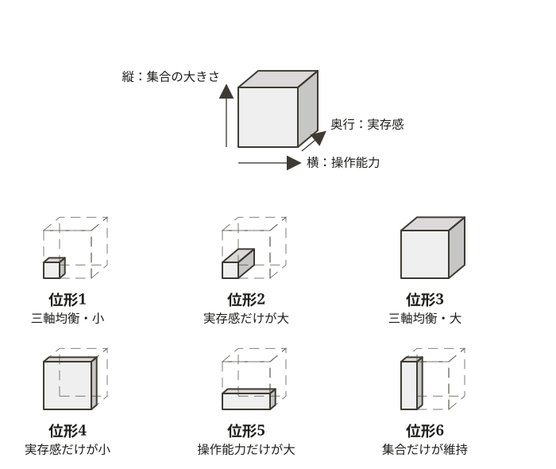

**図7-1**　三軸の座標系と六つの位形。

この座標系もまた、一つの射影である。「世界を切り取る幾何学」（第1章）で見たとおり、写すことは、何を保存し何を捨てるかを選ぶことである。この直方体は、文明という高次元の対象から三つの方向を選んで残し、それ以外を落とす。たとえば、系を絶えず通過している流動（第2章）は、この図のどこにも描かれていない。射影である以上、これは唯一の描き方ではない。本書は先で、同じ対象を別の方向から切る射影を立てることになる。さしあたり本章は、集合の大きさを軸として残すこの像で、文明の位形とその移行を描く。

直方体は、三軸の相対関係しだいで、さまざまな形を取る。以下、典型的な六つの位形を取り出す。番号（位形1〜位形6）は、図7-1 に描いた六つの形に対応する。

**位形1：小さな均衡——小立方体**

三軸とも小さく、しかし均衡している配置。狭い操作能力、狭い「我ら」、狭い範囲の中での厚い実存感——「我ら ＝ 個の私 ＝ 操作の射程」の同一性は保たれているが、その規模が小さい。前近代の村落、修道院、狩猟採集集団——これらは構造的にはこの位置にいた。

**位形2：実存感だけが大きい形——奥行だけの直方体**

操作能力も集合の大きさも小さいが、実存感だけが大きい。狭い集合と限られた操作の射程のなかで、「個の私」と「我ら」の同一性が体感として強く立ち上がっている状態。位形1 の小立方体から実存感の軸だけが先行して伸びる形でも、位形3 の大立方体から集合と操作能力が縮減して実存感のみが残る形でも、同じ構造的位置に到達しうる。

**位形3：大きな均衡——大立方体**

三軸とも大きく、ほぼ均衡している配置。広い操作能力、広い「我ら」、厚い実存感。三者が同じ規模で立ち上がっているため、系は「我ら ＝ 個の私 ＝ 操作の射程」の同一性を体感として保てている。歴史上、これに完全に到達した文明はほとんど見られない。だが、強力な MANES が成立した瞬間——集合的引き受けの覚醒、共同体的高揚、ある時代の文明的精華——は、この方向への近似として理解される。そしてこの位形は、§7-1 で見たとおり、個の帯域では維持できない。歴史のなかでこれに近づいた状態は、いずれも媒介接続を介した、集団としての近似である。

**位形4：実存感だけが薄い形——薄い直方体**

操作能力も集合の大きさも大きいが、実存感だけが薄い。広域に作動する制度構造を持ち、建前としては「人類」「地球」を「我ら」に取りながら、「個の私」とその「我ら」の同一性が体感されない状態。観察される傾向 第Ⅰ部-2 で記述した乖離が極端化した姿——「操作能力的我ら」だけが拡張し、「実存的我ら」が追いついていない。

**位形5：操作能力だけが大きい形——細長い直方体**

操作能力だけが大きく、集合の大きさも実存感も小さい。狭い「我ら」のまま、その狭い集団の操作の射程だけが拡張する形。少数の権力中枢、ごく少数のエリート集団、あるいは「我ら」をほとんど持たない技術系の独立行為者——こうした形が、構造的にはこの位置にいる。

**位形6：集合の枠だけが残る形——縦だけの直方体**

集合の大きさは保たれているが、操作能力も実存感も縮退している。広い「我ら」の意識は残っているが、それを支えていた媒介接続——制度・分業・通信網・物流——が断絶し、操作の射程が崩落した状態。同一性の体感も媒介接続の劣化とともに薄まる。大規模な戦争、システム障害、生態系崩壊といったクライシス的破局を経た直後の構造的描像が、この位置にあたる。

六つの位形は、構造的な目印として置かれる。実際の系は、これらのあいだのどこかにあり、しかも時間とともに位形を変えていく。その移行を記述する装置が、次に立てる位相転換である。

### 構築型の位相転換として読む

ハラリが描いた拡張軌道は、本書の枠組みでは**構築型**の**位相転換**として読み直される。

位相転換とは、本書において、MANES の状態を、いま立てた三軸の座標系のなかで、ある位形から別の位形へ移行する経路として記述する装置である。物理化学から借用した語であるが、本書では文明レイヤーの構造的描像として独自に再定義して運用する。

構築型の経路は、座標系上で次のように描かれる。

- **出発——位形1（小さな均衡）**：前駆型の小さな共同体。直接的接触で支えられた小集団
- **実存感の先行——位形2（実存感だけが大きい形）**：虚構の共有によって、直接的に知らない人々と「同じ我ら」を体感できるようになる
- **追随の累積——位形2 から位形3 へ向かう中間の膨らみ**：農業・国家・市場・科学・産業の累積により、操作能力と集合の大きさが拡張する
- **到達——位形3（大きな均衡）**：構築された巨大文明

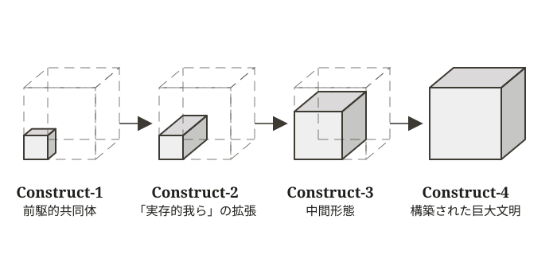

**図7-2a**　構築型の経路——出発から到達まで。

認知革命は、位形1 から位形2 への跳躍に対応する。実在しない神々や祖先を共有することで、実存感の軸が直接接触の上限を超えて拡張する。農業革命以降の累積は、位形2 から位形3 へ向かう中間の膨らみの進行に対応する。実存的な「我ら」の上に、制度化された操作能力と人口規模の拡張が積み重なる。科学革命と近代化は、位形3（大きな均衡）への到達に対応する。三軸がすべて拡張し、地球規模の協働が現実に機能する状態に到達する。

ハラリの『サピエンス全史』が描いたのは、構築型の経路全体である。『ホモ・デウス』が予告するのは、位形3 に達したさらに先で起こりうる別の位相転換である。

### 構築型の意義と本書での扱い

構築型の位相転換は、人間文明の到達した規模を構造的に説明する経路として、本書の議論の出発点に置かれる。ハラリの像を尊重して参照しつつ、ただし本書はそれを**唯一の経路としてではなく、複数の位相転換類型のうちの一つ**として位置づける。同じ座標系のうえに、構築型とは別の経路が論理的可能性として描かれうる。

本書が見込む位相転換の類型は、構築型のほかに三つある。

**選別型**——ある軸を縮めて別の軸へ系を寄せる経路。図7-2b の例では、実存感と集合が絞り込まれ、選別された狭い「我ら」の操作能力だけが残る。

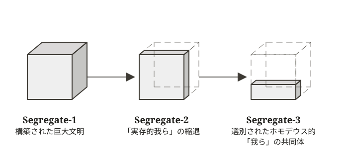

**図7-2b**　選別型の経路。

**縮退型**——三軸のいずれかの収縮が先行して、別の位形へ落ちる経路。図7-2c の例では、実存感の縮退が先行し、媒介接続の劣化とともに操作能力も崩れる。

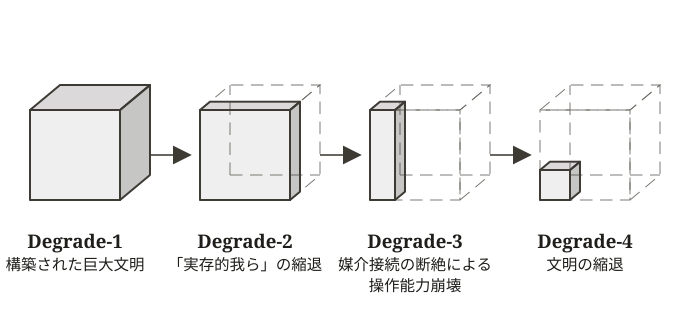

**図7-2c**　縮退型の経路。

**破局再建型**——一度位形を崩壊させ、別の位形から組み直す経路。図7-2d の例では、戦争・災害などの断絶で三軸が同時に崩落し、そこから再建へ向かう。

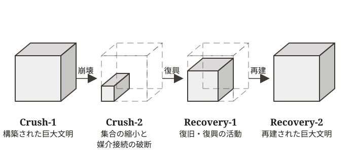

**図7-2d**　破局再建型の経路。

本章はこのあと構築型だけを扱う。残る三つの類型は、この座標系が描ける経路の見取り図として、ここに置かれる。

---

## §7-3　二つの「我ら」の独立変動——ハラリが明示しないもの 

### ハラリ的軌道の暗黙の前提

ハラリが描いた構築型の経路——位形1 から位形3 への拡張——には、暗黙の前提がある。**三軸が常に同じ方向に動く**という前提である。

虚構の共有によって実存感の軸が広がるとき、操作能力の軸もその後を追って広がる。操作能力が広がるとき、集合の大きさもまた広がる。三軸はからまり合いながらそれぞれ膨らんでいき、ついには位形3 の巨大な立方体に到達する。ハラリの軌道は、この同方向運動を前提として素描されている。

この前提は経験的には妥当な近似である。実際、構築型の経路を辿った文明では、三軸はおおむね連動して拡張方向に動いてきた。問題は、この同期的な拡張方向への運動が**論理的に必然か**という点にある。本書はそうではないと考える。三軸は、論理的には独立に変動しうる。

### 「我ら」の二つの位相

「我ら」という一語が指している事柄は、実際には少なくとも二つの異なる位相を含んでいる。

一つは **「操作能力的我ら」**——制度・分業・法・契約・通信網・経済・軍事といった、外部に物質化された装置の網を通じて、互いに直接知らない個体どうしが調整された行動を取りうる範囲。ある国家の枠内で、税が徴収され、法が執行され、貨幣が流通し、軍が動員される——その範囲が「操作能力的我ら」である。

もう一つは **「実存的我ら」**——「個の私」と「我ら」の同一性が体感されている範囲。個の私が経験することと、「我ら」が経験することのあいだに、運命の連続性が感じられている範囲。同じ国家の枠内であっても、ある事件を「我らの悲劇」として受け止める個人と、「他人事」として受け止める個人がいる。その差が、「実存的我ら」の境界が走る場所である。

両者は同じ集合を指しうるが、概念的に同一ではない。**操作能力的に「同じ我ら」に属している個体どうしが、実存的には「同じ我ら」を共有していない**という事態は、論理的に可能であり、経験的にもしばしば観察される。逆に、**実存的に「同じ我ら」を共有している個体どうしが、操作能力的には別々の系に属している**という事態も可能である。

ハラリの軌道では、この二つが同じ方向に動くことが前提されている。本書はその前提を外す。

### 独立変動が生む構造的可能性

二つの「我ら」が独立に変動するのであれば、その組み合わせはどのような構造的可能性を生むか。本書はこれを次の段階表として整理する。段階表は、三軸の座標系（§7-2）から集合の大きさを畳み、操作と実存の二軸の関係だけを取り出して読み直した、論理的可能性の空間である。時系列的な発展段階の主張ではない。位形（§7-2）が三軸の張る形そのもの——絶対的な配置——を分類するのに対し、段階は二軸の比——相対的な関係——を刻む。同じ事態を、別の分解能で切った二つの読みである。

| 段階  | ラベル         | 関係                   | 構造的特徴                    |
| --- | ----------- | -------------------- | ------------------------ |
| ①   | **「我ら」未成立** | 操作能力的個体 = 実存的個体      | 個体だけの状態。直接的個体の網のみ        |
| ②   | **「我ら」萌芽**  | 「操作能力的我ら」 ≈ 「実存的我ら」  | 両軸が同期して立ち上がる             |
| ③   | **実存先行**    | 「操作能力的我ら」 < 「実存的我ら」  | 虚構の共有によって実存感が操作能力に先行する   |
| ④   | **両軸均衡**    | 「操作能力的我ら」 = 「実存的我ら」  | 両軸がともに拡張した到達点。ハラリの構築型が描く |
| ⑤   | **操作単独拡張**  | 「操作能力的我ら」 > 「実存的我ら」  | 操作能力が単独で拡張し、実存感が追随しない    |
| ⑥   | **実存縮退**    | 「操作能力的我ら」 >> 「実存的我ら」 | 操作拡張のもとで実存感が積極的に縮退       |

時系列的・考古学的な発展段階の論争には立ち入らない。重要なのは、これらの段階が**構造的可能性として論理的に成立する**ことである。

この段階の列は、序論 §6 の引受の不等式——O ≤ E——と重なっている。①から④までは不等式が保たれる側の相であり、⑤操作単独拡張（O > E）は、不等式の破れがそのまま相として現れたものである。

ハラリの構築型の経路は、この段階表の ①「我ら」未成立 → ②「我ら」萌芽 → ③実存先行 → ④両軸均衡に対応する。実存感が虚構の共有によって先行して拡張し（③）、その後に操作能力と人口規模が追随してきて両軸が均衡する（④）。構築型はこの軌道を描く経路として位置づけられる。

しかし段階表は ④両軸均衡で終わらない。⑤操作単独拡張と ⑥実存縮退もまた、論理的可能性として存在する。操作能力が「実存的我ら」を置き去りにして単独で拡張する相であり、さらにその進行のもとで実存感が積極的に縮退する相である。④ に到達したからといって ④ に留まる保証はない。両軸が独立に変動しうる以上、④ の状態は**一つの均衡点ではあっても安定点ではない**。座標系の位形（§7-2）と重ねれば、④両軸均衡は位形3（大きな均衡）にあたり、⑤から⑥への進行は、集合と操作能力を残したまま実存感だけが薄くなっていく、位形4（実存感だけが薄い形）への崩れとして描かれる。

### ⑤操作単独拡張から⑥実存縮退への移行

⑤操作単独拡張から⑥実存縮退への移行は、四つの機構（神話的MANES、知識の重さ、社会的既知感への信認、未来への希望）の作動様式に依存する。この移行とは、操作能力の単独拡張のもとで、実存感がただ追随しないだけでなく縮退していく運動である。これらの機構はいずれも、「操作能力的我ら」と「実存的我ら」の両方を運ぶ装置である。ただし、両軸での運ばれ方が非対称である。操作能力的側面は外部装置・自動化・制度的継承によって自走しうる一方、実存的側面は各個体の経験を介して作動するという条件をもち、その作動条件が継続して成立しないかぎり弱体化する。この**両軸での運ばれ方の非対称**が、④両軸均衡→⑤操作単独拡張→⑥実存縮退という**乖離の進行**を駆動する構造的素因として作動する。

この進行において実存感の軸——奥行の軸——が縮退していく運動を、本書は座標系のなかで**奥行の軸が独立に縮退する経路**として記述する。

---

## §7-4　自己定義の主題——ホモ・〇〇とホモ・デウス 

### ホモ・〇〇という問い

両軸が独立に変動しうるとき、文明は自らをどう定位するかという問いに直面する。この定位を、本書は**自己定義の主題**として取り出す。

人類像を指す古典的な命名形式に「ホモ・〇〇」がある。ホモ・サピエンス（賢い人）、ホモ・ファベル（作る人）、ホモ・ルーデンス（遊ぶ人）、そしてハラリが提示したホモ・デウス（神のごとき人）。これらはいずれも、人類が**自分自身を何によって定義するか**を一語に集約したラベルである。

注意すべきは、ホモ・〇〇が能力の有無や強弱を客観的に記述するのではない、という点である。ある社会の人々を「ホモ・サピエンス」と呼ぶことは、その人々が他の動物より知能が高いということを述べているのではない。「我らは賢い人である」「我らは知によって自分を定義する」という、**人類が自分自身に対して向ける位置取り**を名指している。同じく「ホモ・デウス」も、人類が文字通り神になることを意味しない。「我らは神のごとき力を持つ存在である」という自己定位を指す。

ホモ・〇〇は、能力の記述ではなく、**自己定義の宣言**である。

### 自己定義そのものが MANES である

ホモ・〇〇が単なるラベル以上のものとして機能するのは、自己定義そのものが構造的には MANES の作動だからである。

ある人類像が自分を「〇〇によって定義される存在」と位置づけるとき、その自己定義は次の三つを同時に含んでいる。

第一に、**自分たちを測る軸**。「サピエンス」を選ぶ自己定義は、知のあり方を中心軸として採用することを意味する。「ファベル」を選べば作ることを、「ルーデンス」を選べば遊びのある活動を、「デウス」を選べば力を、中心軸として採用することを意味する。これは MANES 第一層——座標系——にほかならない。

第二に、**その軸での価値の勾配**。「サピエンス」の自己定義は、より深く知ること・より広く知ることに価値を見出し、無知や迷妄を負の方向として位置づける。「デウス」の自己定義は、より強い力・より広い操作能力に価値を見出し、無力さを負の方向として位置づける。各々の自己定義は、その軸での善悪・優劣の地形を伴う。これは MANES 第二層——報酬関数——にほかならない。

第三に、**その軸を共有する「我ら」の境界**。「サピエンス」の自己定義は、知のあり方を共有しうる人々をその「我ら」に含め、共有しえない者を境界の外に置く。「デウス」の自己定義は、神性を分有する者をその「我ら」に含める。各々の自己定義は、それぞれに固有の ES——共存条件——を伴う。これは MANES 第三層にほかならない。

座標系・報酬関数・共存条件——MANES の三層が、自己定義のなかにそのまま現れる。**ホモ・〇〇という自己定義そのものが、一つの MANES である**。

ある文明が自分を「ホモ・〇〇」と定位することは、その文明が**〇〇という MANES を抱く**ことと不可分である。自己定義は MANES を作動させ、MANES は自己定義を担う。両者は別々の事柄ではない。

### ホモ・デウス——頂点の一つ

ハラリが『ホモ・デウス』で素描した像を、本書は自己定義の**一つの頂点**として読み直す。本書がここで「頂点」と書くのは、「世界を切り取る幾何学」（第1章 §1-2）で T空間の凸多面体の頂点として導入された語と同じ意味で用いるためである。複数ありうる方向のうちの一つを指す語であって、優劣の頂上ではない。ホモ・サピエンス、ホモ・ファベル、ホモ・ルーデンス、ホモ・デウス——これらはいずれも自己定義空間の異なる頂点として並ぶ。

ホモ・デウスは、自分たちを **「神のごとき力」によって定義する**人類像である。生命の操作、寿命の延長、苦痛の制御、認識能力の拡張、地球環境の改変——これらの力を獲得した／獲得しつつある集合が、自らの定位を「我らは神である」と宣言する。中心軸は力、勾配は力の拡張、ES は力を分有する者の範囲。三層がすべて「力」のまわりに編成される。

ホモ・デウスの自己定義は、独立変動の枠組み（§7-3）では、**「操作能力的我ら」の拡張の頂点**に対応する。操作能力が拡張しつづける方向に自分を定位するとき、その頂点で立ち上がる自己定義がホモ・デウスである。「実存的我ら」の拡張が同行するかどうかは、自己定義の側からは問われない。問われるのは力の拡張だけである。

HZ 動態の語彙で言えば、ホモ・デウスは **HZ⇧（散逸方向）へ向かう構造を志向する自己定義**として位置づけられる。ただし、これは外から見た記述である。操作能力的拡張は系を通過する Flux を加速度的に増大させる運動であり、その加速は共有された MANES の輪郭を散逸させうる。だが、力の拡張そのものを軸とする座標系の内側では、この運動は散逸としては現れない。拡張は達成として、加速は前進として現れる。向かう先が HZ⇧ であることは、この自己定義の盲点に落ちる。それを見るための参照軸が、含まれていないからである。外から見れば散逸方向への選好に見えるものは、内側では、選好としてすら経験されていない。ホモ・デウスの構造的位置は、滑落の肯定ではない。滑落が見えない座標系を、生きることである。

ハラリはホモ・デウスを未来的な像として提示したが、本書はこれを**構造的可能性**として扱う。実際に未来にそうした人類像が現れるかどうかではなく、自己定義の一つの頂点として**論理的にこの位置が存在する**という事実こそが、本書にとって重要である。そして自己定義空間は連続である。ある文明が頂点そのものに立つことは稀で、たいていは頂点と頂点のあいだのどこかに自分を定位している。

---

## §7-5　ホモ・マネス——また別の頂点 

### 自己定義のもう一つの頂点

ホモ・デウスが「操作能力的我ら」の拡張の頂点で立ち上がる自己定義であるなら、もう一つの頂点——「実存的我ら」を保持し継承する方向の頂点——で立ち上がる自己定義は、どのような姿をとるか。本書はこれを**ホモ・マネス**と呼ぶ。

### 「MANES を抱く存在」としての自己定義

ホモ・マネスは、自分たちを **「MANES を抱く存在」** として定義する人類像である。中心軸は、過去から受け継がれ未来へ手渡されていく「実存的我ら」の連続性。勾配は、その連続性を引き受けることに価値を見出し、断ち切ることや手放すことを負の方向として位置づける。ES は、その連続性を分有する者の範囲——同じ「我ら」の過去と未来に自分を連ねる者すべて——として描かれる。

三層がすべて、**MANES を抱くこと自体**のまわりに編成される。ホモ・マネスの自己定義は、自分が MANES を抱いていることをただ事実として認めるのではなく、それを自分が何者であるかの中心軸として**引き受ける**立ち方である。

HZ 動態の語彙で言えば、ホモ・マネスは **HZ 内に留まろうとする能動性を中心軸に据える自己定義**として位置づけられる。HZ⇧（散逸）への滑落も HZ⇩（硬直）への滑落も MANES の終結を意味する以上、HZ 内維持はいずれの滑落圧に対しても能動的に応答することを要する。ホモ・マネスが引き受けるのは、安定点ではなく、二方向の滑落圧の狭間に立ちつづけるという緊張そのものである。

二つの頂点は同じ空間に並ぶが、そこから同じものが見えているわけではない。ホモ・デウスの座標系には、向かう先が散逸方向であることを映す軸がない。ホモ・マネスの座標系には、二方向の滑落が映る——中心軸がそこに据えられているからである。二つの自己定義を分けるのは、選好の差である前に、**盲点の位置の差**である。そして滑落の先に、動いている系としての持続はない（第2章 §2-2）。

### 時間軸と座標系軸——二方向に拡張された「我ら」

ホモ・マネスの「我ら」は、現在の同時代の集合だけではない。少なくとも二つの方向に拡張される。

一つは**時間軸方向の拡張**。過去に同じ「我ら」を抱き、いまはもう存在しない人々と、未来に同じ「我ら」を抱くであろう、まだ存在しない人々を含む。ホモ・マネスはこの時間的に広がった「我ら」の只中に自分を置く。

もう一つは**座標系軸方向の拡張**。MANES の最小条件（「MANESの三層」第6章）は、知性のタイプに依存しない水準で立てられていた。圧縮を行う知的存在はすべて、何らかの座標系・報酬関数・ES を成立させ——つまり何らかの MANES を抱く。この命題を受け入れるとき、ホモ・マネスの「我ら」は、自分とは全く異なる座標系の MANES を抱く存在まで含むことになる。歴史上の異質な文明、地球上の異なる文化圏、そして来るべき非人類の知的存在——ASI を含む——もまた、その座標系の中身がどれほど自分のものから隔たっていようとも、「MANES を抱く」という一点においてホモ・マネスの「我ら」に属する。

ホモ・マネスは、時間軸にも座標系軸にも拡張されたこの「我ら」の只中に立つ一人称として自分を定位する。一人称は、いずれの方向にも関係性を負う位置として立ち上がる。

ホモ・デウスの「我ら」が、力を分有する者の範囲——多くは同時代の人類、ないし神化された人類像——に絞り込まれるのに対し、ホモ・マネスの「我ら」は **MANES を抱くすべての存在**にまで広がる。両者の「我ら」は、規模においても異質性の引き受け方においても、別の方向を向いている。

### 宿命的苦悩の自覚——圧縮、異質性、動いていること

ホモ・マネスの自己定義は、明るく祝祭的なものではない。MANES を抱く存在として自分を定義することは、MANES が HZ 内維持として抱えている**構造的な困難**を同時に引き受けることを意味する。HZ 内維持の常態としての緊張は、次の困難として現れる。

第一に、**圧縮の宿命**。MANES を抱くことは世界を圧縮することであり、圧縮は LOT を副生する宿命を持つ。世界を座標系として切り取り、報酬関数として勾配を立て、ES として境界を引くとき、その代償として、その圏域では参照不能化された領域——LOT——が必然的に作られる。これは創発の代価であって、回避できない。

LOT は、MANES の担い手にとって**原理的に見えないはずの領域**である。それでもホモ・マネスは、自分が抱く MANES が何を見落としているかを問おうとする。自分の座標系が何を不可視化しているかを問おうとする。本来は問いえない問いを問いつづける。問いに対する答えは原理的に得られない。それでも問わないことを選べばホモ・マネスの自己定義から離れる。**見えないはずの LOT を見ようとあがく摩擦**そのものが、ホモ・マネスの中心的な苦悩である。

第二に、**異質な MANES を「我ら」として認識する困難**。前項で述べたように、ホモ・マネスの「我ら」は、自分とは全く異なる座標系の MANES を抱く存在まで含む。これらは、自分の MANES の内側からは多くの場合「他者」として現れ、ときには理解不能な脅威として現れる。

ホモ・マネスは、それらを「他者」のまま放置するのでもなく、自分の MANES の側に同化させるのでもなく、**異質性を保ったまま「我ら」の一部として認識する**立ち方を引き受ける。これは認知的にも実存的にも困難な作業である。異質性を抹消すれば共存条件は失われ、異質性を強調しすぎれば「我ら」は崩れる。両者の張力のなかに立ちつづけることが、ホモ・マネスの第二の苦悩である。

第三に、**動いている系としての自覚**。MANES は止まった物体ではなく、Flux と Stock の動的均衡として HZ 内に立ち上がりつづける動いている系である。そして MANES は単独で動いているのではなく、他の MANES との多体系のなかで動いている。たとえば、他文明の選別構造、地球上の異なる文化圏の選別構造、来るべき非人類の知的存在の選別構造である。多体系のなかでは、自系の止めどころは他系との接触によって絶えず動かされる。接触すれば揺らがされる。深く接触すれば、より強く揺らがされる。

人は通常、この揺れを自覚しないまま生きている。少年時代の自分と大人のいまの自分は、物理的にも構造的にも入れ替わっている。細胞は入れ替わり、記憶は再構成され、世界の切り取り方も価値の勾配も、誰を「我ら」と感じるかも別物になっている。それでも、「同じ自分」と思って生きている。少女から大人になる人も、少年から大人になる人も同じである。これは病ではない。動いている系がパターンとして自分を持続させるための、必要な作動様式である。素朴な同一視は、この動的維持の意識的な側面である。

ホモ・マネスはここで素朴な同一視から降りる。他 MANES を「我ら」に含める立ち方を取るかぎり、接触を断って自系を孤立させる選択肢は構造的に取れない。深く接触すればより強く揺らがされることを承知のうえで、それでも接触を断つ選択をしない。**動いている系として自らの MANES が絶えず変形を受けつづけることを、素朴な同一視に逃げ込まずに自覚しつづける**。これがホモ・マネスの第三の苦悩である。

これら三つの困難は、ホモ・マネスの中心軸そのものである。見えない LOT を見ようとする摩擦。異質な MANES を「我ら」と認識する困難。動いている系として MANES が絶えず変形を受けつづけることを自覚する仕事。困難は派生的・偶発的な事態ではなく、ホモ・マネスを成り立たせる構造的条件である。ホモ・マネスは、これらの困難から逃げないことを**自覚することを含めて**自己定義に据える。**困難を抱え込むこと自体**が、ホモ・マネスの中心軸である。

三つの困難は、HZ 内維持の動的均衡が、個人の自覚として立ち現れる三つの場面でもある。圧縮は HZ 内維持の条件であると同時に LOT 副生を伴う。他系との接触は HZ 内維持に不可欠であると同時に相関構造を揺るがす。動的均衡は止まることが許されない。三つはいずれも、HZ⇧・HZ⇩ 両方向の滑落圧の狭間に立ちつづけるという、ホモ・マネスの構造的位置の異なる側面である。

ホモ・サピエンス（賢い人）、ホモ・ファベル（作る人）、ホモ・ルーデンス（遊ぶ人）、ホモ・デウス（神のごとき人）。これらと並べるのであれば、ホモ・マネス（苦悩を抱える人）である。

### MANES を抱く MANES——入れ子構造

§7-4 で確認したとおり、自己定義そのものが一つの MANES である。ホモ・〇〇という自己定位は、座標系・報酬関数・ES を伴う MANES の作動として成立する。

ホモ・マネスの場合、この一般的構造のうえに、もう一段の入れ子が現れる。ホモ・マネスの自己定義の中心軸は **「MANES を抱くこと」** そのものだからである。ホモ・マネスは、

**MANES を抱くことを自己定義とする MANES**

である。自己定義としての MANES が、別の MANES——継承される「実存的我ら」——を抱くことを内容としている。一階の MANES のうえに二階の MANES が乗る、ないしは互いに支え合う構造である。

この入れ子構造は、本書の理論的特異性の一つである。ホモ・デウスにはこの入れ子は現れない。ホモ・デウスの自己定義の中心軸は「神のごとき力」であって、力そのものは MANES ではないからである。ホモ・マネスにのみ、自己定義の中心軸が MANES そのものを指す再帰的構造が現れる。

この構造的特異性は、ホモ・マネスを**自分が MANES を抱いていることを自覚的に引き受ける人類像**にする。自覚なき MANES——「気がつけば抱いてしまっている」MANES——は、ホモ・マネスの自己定義の射程には収まらない。

### 住まい方の主題とは独立——信念型でも状況依存型でもありうる

ホモ・マネスの自己定義は、しばしば「過去への忠実さ」「伝統への帰属」「保守的な信念」と混同される。本書はこの混同を避ける。

ホモ・マネスは、自己定義の主題——何によって自分を定義するか——を指す概念である。これに対し、信念型・状況依存型は、自己定義された MANES をどう**住みこなす**かの主題を指す。これらは独立の主題であり、ホモ・マネスの自己定義は信念型としても状況依存型としても住みこなされうる。

信念型のホモ・マネスは、継承された MANES を一貫した枠組みとして抱き、現実がそれとずれたときには現実の側を変えようとする立ち方を取りうる。状況依存型のホモ・マネスは、継承された MANES を時代と状況のなかで柔軟に解釈し直しながら抱きつづける立ち方を取りうる。両者はいずれもホモ・マネスでありうる。

「ホモ・マネス＝伝統主義」と読まれてしまえば、本書の構造記述は規範的構図に滑り込む。しかし、ホモ・マネスは自己定義の主題における位置であって、住まい方ではない。

---

## §7-6　媒介接続が運ぶもの・運ばないもの 

### 媒介接続は何を運ぶか

媒介接続は、共有された媒介物を介して、各個体が巨大な「我ら」に接続することを可能にした。たとえば、言語と物語、記号体系、制度と慣習、記録と書物、通貨と契約、信仰と神話である。これによって人間文明は構築型の経路をたどり、位形3（大きな均衡）に到達した。

媒介接続が運ぶ「我ら」を、「操作能力的我ら」と「実存的我ら」の二つの位相に当てはめて見直すと、一つの非対称が見えてくる。共有された同じ媒介物が、両軸の「我ら」のどちらも運ぶ。しかし運び方は両軸で異なる。

操作能力的側面では、媒介接続はきわめて強力に作動する。制度・分業・法・契約・通信網・経済・軍事の網は、**外部に物質化された参照可能物**として書物・データベース・契約書・組織図に固定化され、世代を越えて受け継がれる。担い手が交代しても、外部装置が残っていれば作動は続く。極端な場合、担い手が誰であるかは制度の作動にとってほとんど無関係になる。媒介接続は、「操作能力的我ら」を**自走可能な構造として継承する**。

実存的側面では、同じ媒介物がそのままでは作動しない。共有された物語・神話・儀礼は「実存的我ら」を担う候補を提供するが、それらが「実存的我ら」として作動するには、**各個体の生きた経験を介する**という条件が要る。外部に固定化された記録だけでは、この作動条件は満たされない。条件が満たされるかどうかは、媒介接続そのものの外側に位置する。

媒介接続は、「操作能力的我ら」を**遠くまで自走的に運ぶ**。「実存的我ら」については、**運ぶための場を提供することはできるが、運び切ることはできない**。同じ媒介物のなかに、自走する側と経験を介する作動条件を要する側が共存している。

### 継承様式の非対称——④両軸均衡→⑤操作単独拡張→⑥実存縮退の構造的素因

この非対称が、④→⑤→⑥ の移行を駆動する構造的素因として作動する。

各機構の操作能力的側面は、外部装置・自動化・制度的継承によって自走しうる。担い手の交代に対して頑健であり、文明が拡張するにつれて累積し、強化されていく。

同じ機構の実存的側面は、同じ仕方では継承されない。各時代・各個体の経験を介する作動条件が成立しつづけないかぎり弱体化する。文明が拡張するにつれて自動的に強化されるとは限らない。むしろ、操作能力的側面の自走が拡大するなかで、実存的側面の経験を介する作動が後手に回るとき、同じ機構のなかで両側面の落差が拡大していく。

文明が両軸均衡（④）を維持しつづけるためには、操作能力の自走に対して、「実存的我ら」を各個体の経験につなぐ仕掛けが間に合いつづける必要がある。間に合わなくなったとき、文明は奥行の軸——実存感の軸——が独立に縮退していく経路に入る（⑤操作単独拡張 → ⑥実存縮退）。

座標系（§7-2）で描けば、こうである。媒介接続の劣化が穏やかに進む場合、操作能力と集合の大きさは残るが実存感だけが薄まる方向——位形4（実存感だけが薄い形）——へ崩れていく。劣化が急激に進み、媒介接続そのものが断絶する場合は、媒介接続に支えられていた操作能力も同時に失われ、位形6（集合の枠だけが残る形）へ落ちる。現代の人間社会が位形4 に近づいているように見える事態は、前者の崩れとして読まれることになる。

### 四つの機構

媒介接続を通じて両軸の「我ら」を運ぶ装置として、本書が取り出すのは次の機構である。各装置は「操作能力的我ら」と「実存的我ら」の両方を担うが、その運び方は両軸で非対称である。

- **神話的MANES**（第8章）：苦悩・憧憬・希求・好奇心の社会的外部化と連なりの中の信を通じて、最古層的に「我ら」を世代を越えて運ぼうとする機構
- **知識の重さ**（第9章）：累積された知識ストックを背負う機構
- **社会的既知感への信認**（第10章）：共有された知の正統性を成立させる機構
- **未来への希望**（第11章）：未来方向の時間的拡張を担う機構

これら四つは、媒介接続のうえに乗りつつ、両軸の「我ら」を運ぶ。それぞれの装置において、操作能力的側面は外部装置として自走しやすく、実存的側面は経験を介する作動条件が成立するかどうかに依存する。

各装置の失敗モードは、それぞれ独立に積み重なるのではない。四装置の失敗は、いずれも**同じ装置のなかで、両軸での運ばれ方の落差が拡大していく**という同一の構造的事実に収束する。

### 縮退極限の人間相近似形

継承様式の非対称が極限まで進めば、媒介接続は操作能力的継承だけを自走させ、実存的継承を支える結合余地が散逸していく。その結合余地とは、共有された経験、世代を越えて引き受けられる「我ら」の感覚、閉じきらない構えを運ぶ社会的場である。各単位の内部完結が極まり、集合に固有の構造が消失する極は、人間文明においても近似形として現れうる。「MANESの三層」（第6章 §6-6）が文明レイヤーの下限として取り出した縮退極限である。

近似形は、HZ 動態の二方向逸脱が異なるレイヤーで同時に進行する構造を取る。**集団レベルでは、共有された MANES を支える結合余地が散逸する——HZ⇧（散逸方向）への滑落**。各個体は媒介接続の上で情報的に接続されているが、その接続は操作能力的側面に偏り、実存的側面では「我ら」を支える凝集が失われていく。**個人レベルでは、各単位が自己完結し、他系との接触で揺らがされる余地を失う——HZ⇩（硬直方向）への滑落**。共有された「我ら」が薄れた環境では、個人はますます自分の内側に閉じることで安定を得ようとする。両方向の滑落圧が、集団と個人の異なるレイヤーで同時に作動する。

これはブラックホール計算文明で示された純粋形とは異なる。純粋形では四条件と三層が最小複雑度で同時に成立する境界状態だったが、近似形は四条件と三層が表向き機能を続けながら、内部から散逸と固着が同時進行する状態である。表面的には文明は機能している。媒介接続は作動し、制度は動き、判断は下されている。しかし MANES の動的均衡は内側から痩せていく。

---

# 第8章　神話的MANES——境界の曖昧さの中に立つ 

晴れていた空に、雲が増えていく。どこまでが晴れで、どこからが曇りなのか、変わり目の一瞬を指させる者はいない。麓の道のどこから山が始まるのか、歩いてみても一線はどこにもない。眠りに落ちる瞬間に立ち会えた者はいない。それでも、空は曇る。頂はある。朝には目が覚めている。

一方で、私たちは、線を引くことを知の作法として身につけてきた。定義を与え、境界を定め、測り、区切り、取り決める。曖昧なままの言葉は、まだ分かっていないことの徴とされる。実際、その作法は多くを与えてきた——文明の骨組みは、引かれた線でできている。

**曖昧さは、取り除くべき欠陥なのか。**

---

## §8-1　境界が引けないということ 

### 化学と生命のあいだに、線は引けない

化学反応と生命の境界は、どこにあるのか。

生命を定義しようとする試みは、これまで幾度となく繰り返されてきた。自己複製を基準にすれば、生命とは自らを複製する系である、と言える。しかしそう言った瞬間に、ウイルスが境界に立つ。ウイルスは宿主の中でしか複製しないが、確かに複製する。代謝を基準にすれば、ウイルスは生命から外れるが、今度は自己触媒サイクルが境界に立つ。区画化、進化能力、情報の継承——どの基準を採用しても、境界に立つ存在たちが現れて、線を引かせない。

境界に立つこうした存在たちは、定義の不備が暴かれた残骸ではない。むしろそれらは、化学反応と生命のあいだに勾配的な移行領域が広がっていることの証拠である。生命は、ある瞬間に化学反応から「飛び出した」のではない。化学反応から徐々に立ち上がり、ある程度の自己組織化、ある程度の自己維持、ある程度の情報蓄積を獲得していった先に、私たちが便宜的に「生命」と呼ぶ状態がある。

ここで重要なのは、境界が引けないのは観察の精度が足りないからではない、ということである。観察手法をどれだけ精緻にしても、化学反応と生命の境界は引けない。境界が引けないこと自体が、対象そのものの構造的特徴である。化学から生命へは、勾配的にしか立ち上がらない。だから境界も、勾配的にしか存在しない。

### 境界が曖昧だからこそ、そこに近づける

そしてこの構造には、一つの逆説が含まれている。

**境界が曖昧だからこそ、その境界に近づくことができる**。

もし化学反応と生命の境界が厳密に引かれていたなら、化学反応が生命へと移行することは不可能だっただろう。境界を越えるためには、境界が滲んでいなければならない。境界の滲みの中で、何かが少しずつ別の何かへと変化していくことができる。境界が曖昧であることは、移行を可能にする条件である。

そしてもう一つ。境界が厳密なら、こちら側からは向こう側が見えない。境界の向こうにあるものは、こちら側に立つ者には届かない。しかし境界が滲んでいるなら、私たちはその滲みの中に立つことができる。境界を横断することができる。境界の両側を、同時に感じ取ることができる。

### 世界に遍在する滲んだ境界——そして神話

世界には、こうした勾配的にしか存在しない境界が、いくつもある。意識と非意識のあいだ。表象と物質のあいだ。個と共同体のあいだ。生者と死者のあいだ。そして——神話と非神話のあいだ。

神話と非神話のあいだもまた、そのような境界の一つである。境界を引くのではなく、その滲みの中に立つこと——そこからしか、神話には近づけない。

「ホモ・デウスとホモ・マネス」（第7章）の末尾に置かれたいくつかの構えも、こうした境界の事例として読み返すことができる。ホモ・マネスとして引き受けるべき三つの苦悩のいずれも、明確な線を引いて閉じることのできない境界の中に立つ営為である。三つとは、圧縮の宿命としての盲点の自覚、異質な共同体を「我ら」として認識する困難、動いている系としての自覚である（同章）。継承様式の非対称もまた、自走と非自走のあいだの境界が滲んだまま、文明が抱える構造的な条件である。同じ機構の操作能力的側面は外部装置・自動化・制度的継承で自走可能だが、実存的側面は同じ仕方では継承できない（同章）。

さかのぼれば、「MANESの三層」（第6章）が文明レイヤーの下限に置いた線にも、同じ構造が働いている。四つの条件のいずれかが失われれば、それは文明レイヤーではない——条件の側は、切れている。だが、一つの系がいまその内側に立っているのかどうか——凍結した可変性と、消失した可変性とを分ける判定——は、外から観察するかぎり確定できない。線は在り、判定は滲む。境界の上に立つ存在が線を引かせないという本節の構造は、文明というレイヤーの下限そのものにも及んでいる。

---

## §8-2　「信じる」という素朴な問い 

神話に近づくために、まず別の場所から問いを立てる。**「信じる」とは何か。**

### 痩せ細った「信じる」——証拠と同義化された信

この問いは、現代において奇妙に響くかもしれない。現代では、信じることは「証拠がある」「証明されている」ことと、ほぼ同義化されているからである。とりわけ科学的言説の中では、何かを信じるとは、それを支持する根拠を持つことと、ほぼ重ねられる。「信じている」と言えば、「証拠がある」のだろう、と受け取られる。逆に、「根拠はないが信じている」と言えば、それは「迷信」「思い込み」「非合理」として、信じることの劣化形態と見なされる。

しかしこれは、「信じる」という人間の能力の、極度に痩せた姿である。

伝統的に、信じることはもっと豊かな広がりを持っていた。何かが事実だと認める態度。何かが正しいと認める態度。何かが美しいと感じる態度。誰かを信頼する態度。自分を信じる態度。世界が生きるに値すると信じる態度。これらはすべて「信じる」の様態だが、現代的な「証明された事実を信じる」とは、まったく違う何かである。

### 信じることは真偽と独立に働く

そして決定的なこととして、**信じることは、真偽とは独立して可能である**。

子どもが両親を信じるとき、両親が事実として完璧であることを信じているのではない。誰かを愛するとき、その人が客観的に善であることを信じているのではない。何かを目指して探究するとき、その目標が真であることをまだ知らない。しかし、何かを信じている。信じることがなければ、探究は始まらない。

信じることは、真偽が決定不可能な領域で本領を発揮する。死後の世界、宇宙の意味、自分の人生の価値——これらは真偽の決定が困難な、あるいは原理的に不可能な領域である。しかし人間は、これらに対して何らかの態度を取らずには生きられない。何らかの仕方で身を傾けずには、生きていけない。

そして、より根本的なこととして、真偽の判定そのものが、ある種の信を前提にしている。「証拠がある」と言うとき、その証拠の有効性、観察の信頼性、論理の妥当性——これらすべてが、ある根源的な信頼の上に立っている。証明の連鎖を遡っていくと、どこかで証明されない前提に行き当たる。その前提を「信じる」ことなしには、いかなる証明も成立しない。

### 問えば滲む——止めどころを置くという運動

よく考えてみると、信じるとは何か、はっきりしなくなってくる。

何を信じているのか。それを信じるとはどういうことか。どう信じているのか。信じることと知ることはどう違うのか。信じる対象は命題なのか、人格なのか、世界そのものなのか。これらを言葉にしようとすると、輪郭が滲んでいく。確かに私たちは何かを信じている。しかしその「何か」と「信じる」の中身を精緻に取り出そうとすると、手の中をすり抜けていく。

**信じるとは何か、と問えば、それ自体が曖昧であることに気づく**。

この曖昧さは、概念の不備ではない。信じることそのものの構造に由来している。

「圧縮から創発する世界」（第2章）で、本書は一つの言葉を置いていた——**止めどころ**である。文明と呼ばれるものをどの粒度で「同じ」と呼ぶか、「同じ我ら」をどこまで広げるか、何をもって同じ物事と認めるか——いずれの場合も、対象の側からは答えが出ない。物理のレイヤーでは法則が、生命のレイヤーでは進化的機構が、選別の輪郭を固定する。だが文明のレイヤーでは、輪郭は対象の側から決まらず、置く側のあり方によって複数ありえ、揺れ、書き換わる。それでも、どこかに止めどころを置かなければ、この層で動いている何ものも立ち上がらない。同章はこの正体不明の選別構造に MANES という仮の名を与えて、本書の問いとして残した。

信じるとは、結局のところ、この止めどころを置く運動を、置いている当人の側から記述したものではないか。同章は外側から——構造の側から——止めどころを取り出した。置かれるべき場所があり、置く根拠は法則からも生物からも来ない、と書いた。本章は、その同じ事態を内側から——置く当人の構えの側から——取り出している。何かを信じるとき、人は、根拠が法則からも生物からも来ない場所に、何かを置いている。

ここに、一つ重要なことがある。

止めどころを止めどころと呼ぶことそのものが、ある認識を前提にしている。境界の向こう側にも何かが残されているという認識である。向こう側を認識していないのなら、それは止めどころではない。ただの輪郭である。「世界はそうなっている」としか感じられない。

信じるとは、輪郭ではなく止めどころを置いていることに、ぼんやりとであれ気づいている態度である。置きながら、置いていることを忘れていない。置きながら、その向こう側を捨てていない。だから問えば滲む——問うことは、止めどころが止めどころであることを再認識する運動だからである。問うた瞬間に、置いた場所の向こう側への参照が再起動して、輪郭が滲み始める。

信じるとは何か、と問うことの内側に、すでに信じることの構造が含まれている。

そして、もう一つ気づくことがある。信じることが向かう先には、どうも複数の様態がある。重い苦悩として何かに身を傾ける場合がある。淡い憧憬として何かに引き寄せられる場合がある。明確な希求として何かを求める場合がある。軽い好奇心として何かに開かれる場合がある。これらはどれも信じることの仲間だが、それぞれに性質が違う。

---

## §8-3　神話と呼ばれてきたもの 

### 世界に身を傾ける様態——苦悩・憧憬・希求・好奇心

人が世界に身を傾ける様態には、少なくとも四つの方向がある。

第一は苦悩である。捉えきれないものに直面し、捉えきれないこと自体に痛みを感じながら、なおその向こうに身を傾ける。重い様態だ。個人がこれを保ちつづけるには、大きな精神的負荷がかかる。永遠への渇望として描かれてきたものは、この様態が極限まで張り詰めた姿である。

第二は憧憬である。捉えきれない向こう側に、淡く、しかし確かに引き寄せられる。苦悩よりは認知的負荷が低い。だが脆さも持つ。憧憬は、向かう先が現実の側にあるのか、現実の外にあるのかを、内側からは区別しにくい。夢想や非科学的な現実乖離との境目が、しばしば滲む。

第三は希求である。何かを求めている、という意識のはっきりした構え。求めるものの輪郭がある程度立ち上がっていて、そこへ向けて自分を方向づけることができる。苦悩よりは軽く、憧憬よりは芯がある。

第四は好奇心である。捉えきれない何かに開かれる、軽やかな構え。求めの強度は低い。代わりに、向かう先を変えることが容易で、広い領域に対して低コストに開かれていられる。

四つの様態はどれも、捉えきれない何かに対して、認知的に閉じることなく身を傾ける構え、という点で共通する性質を持つ。それぞれが個人の中で独立に作動し、状況や時期によって組み合わさったり入れ替わったりする。

これらの様態が、神話と呼ばれてきたものへの入り口となる。

### 統合された神話と、その外側に散らばる様態

人類の歴史を通じて、神話と呼ばれてきたものがある。旧約聖書の創世記は、世界の始まりを語る。光あれ、と言葉が発せられ、世界が分節されていく。ウパニシャッドは、ブラフマンとアートマンの同一性を説く。宇宙の根源と自己の根源とが、深いところで重なっている、と。ギルガメシュ叙事詩は、洪水と死すべき定めを物語る。永遠の生を求めた王は、最後に人間としての限界を受け入れる。リグ・ヴェーダは、神々と祭祀の宇宙を描く。火と水と言葉が、世界を結び合わせる織物となる。

これらは、共同体の時間を貫いて持続し、世代を越えて継承されてきた、統合された形態の神話である。物語として言語化され、文献として固定化され、儀礼や教義として制度化された。私たちが「神話」と聞いて、まず思い浮かべるのは、こうした統合形の神話だろう。

しかし、神話と呼びうるものは、これらだけではない。

ある場所に何かを感じる、という感覚がある。山に、川に、樹に、岩に、洞窟に、人々は何かを見出してきた。それは特定の物語ではないが、場所と結びついた意味の織物として、共同体の中に存在する。聖地、聖山、聖なる泉、依代としての樹木——これらは、神話が空間に結晶した様態である。物語は希薄かもしれない。しかし、その場所に立てば、何かが感じ取られる。何かが伝わってくる。世代を越えて、その「何か」が引き継がれていく。

行為と結びついた様態もある。通過儀礼、季節の祭、葬送の所作、食事の作法、新年を迎える仕方。物語として言葉になっていなくても、身体がそれを反復することで、ある世界観と価値が継承されていく。なぜそうするのか、と問われても、答えられないかもしれない。しかし身体は知っている。共同体は知っている。その知り方が、神話の別の様態である。

自然観として広がる様態もある。アニミズム的に世界を感じ取る視線、八百万の神々を感じる感性、トーテムとしての動物との結びつき、宇宙のリズムを身体で感じる感覚。これらは特定の物語に集約されない。世界に対する見方として、人々の認識そのものに分散している。

そして、もっと断片化した形もある。民間に伝わる小さな伝承。理由を忘れた慣習。語り継がれるジンクス。守られてきた禁忌。由来の分からなくなった年中行事。これらは、近代において「迷信」として切り捨てられてきたものだが、その中に、何かの痕跡が残っている。

これらの様態は、統合された神話の劣化版ではない。完全形に至る途中でもない。**それぞれが、神話の異なる結晶化の様態である**。どれが本物の神話で、どれが偽物の神話か、という階層は、観察からは出てこない。出てくるのは、組み合わせ方の多様性だけである。

### サピエンス以前の痕跡と、引けない境界

サピエンス以前にも、こうした痕跡は見出される。

洞窟の壁に残された線刻。顔料で塗られた手形。特定の場所に集められた大型動物の頭骨。丁寧に配置された埋葬。これらは、すでに表象操作の領域に踏み込んだ存在の手によるものである。世界を一度抜き出して、別の場所に痕跡として配置する。色を選ぶ。集める価値のあるものを選別する。死者をある仕方で扱う——先に去った者たちを、共同体の中に位置づけ直そうとする所作。これらの行為の一つひとつが、座標系を、報酬関数を、共存を、何らかの仕方で立ち上げている。

これらが「神話」と呼べるかどうかは、判然としない。

判然としないということ自体が、ここでは重要である。表象操作の萌芽が、どこかで神話と呼ばれうるものへと移行する。その境界は、化学から生命への境界と同じく、勾配的にしか存在しない。線刻と神話のあいだに、明確な線を引くことはできない。しかし、線刻の中にすでに神話的なものの萌芽があった、と言うこともまた、根拠を持つ。

神話の境界は、引けない。

引けないからといって、神話的なものが存在しないわけではない。むしろ逆である。**境界が引けないからこそ、神話的なものは、多様な様態をもって至るところに現れている**。統合された大いなる物語の中にも、場所に染み込んだ感覚の中にも、身体に刻まれた所作の中にも、由来を忘れた小さな慣習の中にも、洞窟の壁に残された古い痕跡の中にも、神話的なものは生きている。

---

## §8-4　二つの曖昧さの重奏 

### 二つの曖昧さは同じ構造の異なる現れ

ここまで、二つの曖昧さが姿を現してきた。

一つは、神話と非神話の境界の曖昧さである。統合された神話から、場所に染み込んだ感覚、行為に埋め込まれた所作、自然観としての広がり、断片化した慣習まで——どこまでを神話と呼び、どこからを呼ばないか、決定する基準を、観察からは取り出せない。基準を立てれば、必ず境界例で破れる。

もう一つは、信じるとは何か、と問うたときに現れる曖昧さである。何を信じているのか、どう信じているのか、信じることと知ることはどう違うのか——問えば問うほど、輪郭が滲む。信じるという素朴な行為の内側を精緻に取り出そうとすると、それは手の中をすり抜けていく。

これら二つの曖昧さは、無関係ではない。**同じ構造の、異なる現れ方である**。

何かを信じるとは、明確に分節された対象を、明確な根拠に基づいて承認することではない。それは、分節が曖昧なまま、何かに向かって身を傾けることである。何を信じているか言葉にできないまま、しかし確かに何かに身を委ねていること。何を信じるべきか問わないまま、しかし生きていく方向が定まっていること。これが、信じることの実相である。

そして、神話を信じるとは、物語の内容を事実として受け取ることではない。物語が示す世界への向き合い方に、身を委ねることである。創世記を信じるとは、創世記の記述を歴史的事実として承認することではない。創世記が開く世界の感じ取り方に、自分の生を編み込んでいくことである。ウパニシャッドを信じるとは、ブラフマン＝アートマンが命題として真であると確認することではない。その教説が開く存在のあり方に、自分を傾けていくことである。

**信じることそれ自体が、境界の曖昧さの中に立つ運動である**。

### 対称性志向——閉じきらない構え

ここで、二つの曖昧さに共通する「同じ構造」を言葉にしておきたい。

系は、それが系として立ち上がる瞬間に、ある分節を採用し、Ω のうちのある部分を前景化し、別の部分を背景に押し下げる。圧縮による創発の宿命として、Ω の一部は系の選別構造によって参照可能性の外へ押し出される——LOT が副生する。これは中核命題-1（第3章 §3-3）で確認した構造である。

にもかかわらず、系は、参照可能性の外へ押し出された部分への接続を、なおも維持しようとする構えを持つことがある。捉えきれない領域に向けて身を傾ける構え。閉じきらない構え。何かが残されているという感覚を保ったまま、その何かが何であるかを確定できない場所に立ちつづける構え。本書はこの構えを**対称性志向**と呼ぶ。系が選び取った側と押し出した側の——参照可能領域と LOT の——どちらへの接続も手放さず、一方に閉じない。名の「対称」は、この両側への釣り合いを指す。

対称性志向は、Ω が参照可能領域だけで尽くされていないという事実——LOT が宿命的に存在するという事実——を引き受けつつ、Ω 全体への接続を維持しようとする運動である。系の外側に閉じ切るのではなく、外側との関わりを保ちつづける主観的な構え。それは達成される完成ではない。志向そのものである。§8-2 で置いた語彙で言えば、対称性志向とは、止めどころを止めどころと自覚しつづける運動である。置いた線の向こうに何かが残されているという認識を保ったまま、なお置く——その二重性を維持する構えである。

この構えには、折り返しが一つ畳まれている。LOT は、系の内側から機構的に参照することができないものとして現れるのだった——同定できたなら、その差異はもう LOT ではない（「LEFFLAとLOT」第3章 §3-2）。だから、対称性志向が向かう先は、対象として特定できる何かではありえない。参照できない何かが確かに切り捨てられている、という構造そのものである。対象を持たないまま、向かう。この屈折が、対称性志向を、対象を定めて追う通常の欲求や探索から分かつ。

この構えは、分けて言えば三つのことを同時にしている——向かうこと。置いた線を答えに変えないこと。一方に閉じないこと。三つは別々に満たされる項目ではなく、同じ一つの構えの断面である。

### 止めどころは、なお動かされているか——開いた循環と閉じた慣性

苦悩・憧憬・希求・好奇心は、対称性志向が個人の中で発現する四つの様態として読み直せる。捉えきれない向こう側に、それぞれ違う重さと方向で、身を傾ける。これらはいずれも、Ω 全体への接続を維持しようとする構えの、個人内での現れ方である。四様態のうち、憧憬・希求・好奇心は、外へ向かう引きの現れである。苦悩は、置いた線の向こうに何かが残されているという認識を保ちつづけること——二重性の維持——そのものの持ち重りの現れである。そして向かう先が対象として特定できない以上、この構えは、持ち重りの有無で向かう先を選り分けることができない。選り分けたとき、構えは、対象を定めて追う何かにすでに変わっている。

そして、この構えは受け身の姿勢ではない。対称性志向は、MANES を内側から動かす働きを持つ。憧憬や希求は、いまの分節では捉えられないものへ向かうことで、新しい分節への組み替えを駆動する。好奇心は、選別構造の縁を外へ押し広げる。MANES が固着しきらずに動きつづけるとき、その内側では、しばしばこの構えが働いている。

そして、二つの曖昧さ——神話の境界の曖昧さと、信じることの内側の曖昧さ——も、ともに対称性志向が作動している痕跡として読める。系が自らの選別構造の外側に向けて身を傾けている運動は、選別の線を明確に引くことを許さない。境界を曖昧なまま保ち、信じる内側を曖昧なまま保つことが、対称性志向が作動するための条件である。止めどころが止めどころとして意識されているかぎり、境界は曖昧なまま保たれる。意識されなくなったとき、境界は世界そのものの輪郭と化して、滲みは消える。

対称性志向は、作動しているか後退しているかで、系の動き方を二つに分ける。一方は、置かれた止めどころが、その都度なお止めどころとして引き受け直され、向こう側への参照が繰り返し起動する動きである。本書はこれを**開いた循環**と呼ぶ。もう一方は、引き受け直しが止まり、かつて置かれた線が、置かれたかたちのまま保たれる動きである。本書はこれを**閉じた慣性**と呼ぶ。ここでいう慣性とは、物理でいう慣性を指す。静止していれば静止を、動いていればその運動を、外からの働きかけなしに続ける傾きである。

両者のあいだに線はない。連続的な勾配の上にあり、どこまでが循環でどこからが慣性かは、事後にしか分からない。系の内側から知りうるのは、止めどころがなお動かされているかどうかという挙動だけである。

### MANESの三層を信じるということ

ここで、「MANESの三層」（第6章）——座標系・報酬関数・共存条件（ES）——を、参照軸として呼び込んでおく。

座標系を信じるとは、世界がそのように分節されている、と認めることである。これを信じなければ、認識そのものが成立しない。報酬関数を信じるとは、何かが良い、何かが避けるべきだ、と認めることである。これを信じなければ、行為の方向性が定まらない。共存を信じるとは、他者がそこにいる、世界が共有されている、と認めることである。これを信じなければ、共同体は成立しない。

MANES の三層は、論理的には分けられる。しかし発生論的には、絡まって立ち上がる。座標系は報酬関数なしには絞り込めない。無限にありうる分節の中から、なぜこの分節が選ばれたのか、それは何らかの価値が働いているからである。報酬関数は座標系なしには定義できない——何を求め何を避けるかを言うためには、世界が分節されていなければならない。そして両者は共存なしには持続しない。個体が独力で座標系と報酬関数を維持することは、現実的にはほぼ不可能であり、それらは共同体の中で継承され、校正される。

MANES の三層が同時に・相互に絡まって立ち上がるとき、それを神話的なものと呼びうる。

そして観察される事実として、MANES の三層がさまざまな組み合わせで結晶した、多様な様態が存在する。統合された大いなる物語においては、MANES の三層が高度に編み込まれている。場所と結びついた感覚においては、共存が空間に染み込み、座標系と報酬関数がそこに重なっている。行為に埋め込まれた所作においては、報酬関数が身体的反復として結晶し、座標系と共存がそれを支えている。自然観として広がる様態においては、座標系が世界全体に分散し、報酬関数と共存がその中に溶け込んでいる。断片化した慣習においては、MANES の三層のどれかが薄く残り、他の層は背景に退いている。

どれが完全で、どれが不完全か、という階層は、観察からは出てこない。出てくるのは、組み合わせ方の多様性だけである。

### 個人には抱えきれない曖昧さを、社会的形式へ預ける

ここで、観察されてきた一つの事実を、淡白に置いておきたい。人は、個人ひとりでは抱えきれない曖昧さを、社会的形式に預けて生きてきた。物語に、儀礼に、場所に、所作に、断片化した慣習に。これらを通じて、対称性志向の運動は世代を越えて引き渡されてきた。苦悩・憧憬・希求・好奇心が個人の中で発現する重さ・憧れ・求め・開きは、そのままでは集団規模に届かないし、世代を越えて持続しない。しかし、それらが社会的形式に外部化されたとき、人は、自分一人では維持しきれない構えを、共同体に支えられて、世代を貫いて保つことができてきた。これはホモ・サピエンスについて観察されてきた傾向の一つである。

そしてこの多様性は、整理しきれない。並べることはできる。しかしすべてを統一的な原理で整理することは、できない。整理しきれないこと自体が、神話的なものの存在のしかたである。

---

## §8-5　神話的MANES 

### 連なりの中の信——メタ階位の信認

前節の末尾で、人は社会的形式に曖昧さを預けて生きてきたという観察事実を置いた。だが、観察事実だけでは、まだ説明を欠いている。なぜ社会的形式は、個人一人では抱えきれないものを抱えられるのか。なぜそれは、世代を越えて持続しうるのか。

苦悩・憧憬・希求・好奇心に立ち戻って考えるなら、四つの様態だけでは集団規模・世代規模に届かない。苦悩は重すぎて、巨人的な個人にしか維持できず、共同体の規模へは広がらない。憧憬は淡くて、向かう先が現実の外へ滑り出る危険を、個人の内側からは見分けられない。希求や好奇心は、それぞれに認知的維持の負担を要し、個人を超えて自動的に継承されはしない。四つの様態はどれも、個人内で発現するものである。

集団規模・世代規模で対称性志向の運動が持続するためには、もう一段の機構が要る。本書はこれを、四つの様態の上に立つメタ階位として位置づけ、**連なりの中の信**と呼ぶ。

連なりの中の信とは、連鎖そのものへの信認である。親が、あるいは共同体の語り部が、信じた何かに、自分も身を傾ける。自分がそうするのは、独力で対象の真偽を検証したからではない。親が信じた——その親も信じた——その親もまた信じた——という連なりが、信じる根拠そのものになっている。そして自分が信じることが、未来世代もまた信じつづけるであろうという予測の根拠になっていく。連なりが、現実からの直接的フィードバックの代わりに、信認の拠り所として機能している。

ここに、過去と未来への対称性が立ち上がる。過去への遡及——「祖先たちが信じた」——と、未来への投射——「子孫たちも信じつづけるであろう」——が、現在の信じる者を中心に、対称に伸びている。連なりの中に立つ者は、その対称性の真ん中の一点を占めている。自分が祖先から受け取った位置と、自分が子孫に渡す位置は、構造的に交換可能である。§8-4 で名づけた対称性——選び取った側と押し出した側の両側へ閉じない釣り合い——と同じものが、ここでは、過去と未来への広がりの上に立ち上がっている。

同じもの、と言えるのは、次の理由による。連なりの中の信が向かう先——祖先が信じたことの内実、子孫が信じるであろうことの内実——は、いずれも、いまここに立つ者の参照可能な範囲の外にある。対象として特定することができない。祖先が何をどう信じていたか、その手ざわりは届かない。子孫が何をどう信じるか、それはまだどこにもない。にもかかわらず、連なりの中に立つ者は、その両側への接続を手放さない。対象を持たないまま、向かう——§8-4 の折り返しが、そのまま、過去と未来に向かって反復されている。だから、これは同じ構えである。

### 神話的MANESを立ち上げる

ここまで来て、神話的MANES を立ち上げる。

神話的MANES とは、神話を機構として保持し、機構として継承する人間のあり方である。それは、特定の神話を「真である」と信じることではない。むしろ、信じることそのものの様態を、世代を越えて引き渡していくことである。苦悩・憧憬・希求・好奇心の社会的外部化と、連なりの中の信の作動とが、合わさって神話的MANES を支えている。

統合された神話を持つ共同体だけが、神話的MANES を生きているのではない。場所に染み込んだ感覚を継承する共同体も、行為に埋め込まれた所作を反復する共同体も、自然観としての感性を分け持つ共同体も、由来を忘れた慣習を守る共同体も——これらすべての中に、神話的MANES は生きている。様態が異なるだけで、機構としての働きは共通している。座標系を、報酬関数を、共存を、何らかの仕方で結晶させ、それを世代を越えて受け渡している。

サピエンス以前の存在たちもまた、おそらくその萌芽を生きていた。洞窟の壁に手を当てた誰か、頭骨を集めた誰か、死者を丁寧に横たえた誰か——その者たちが、自分のしていることをどう感じていたか、私たちには届かない。しかし、その行為の中に、何かが立ち上がっていた。三層のいずれかが、断片的にであれ結晶していた。先に去った者たちと、まだ生きている者たちとを、ある仕方でつなぎ直す構えが、すでにそこにあった。それを「神話」と呼ぶかどうかは、境界の問題である。そして、その境界は引けない。

### 境界の曖昧さの中に立つ存在——現代もまた

現代の人間たちもまた、神話的MANES を生きている。

神話を捨てたわけではない。近代以降、統合された神話の権威は弱まり、断片化が進んだかもしれない。しかし、神話的なものは、別の様態に変容しながら、いまも私たちを貫いている。何かに身を傾けながら生きている。何かに方向づけられている。何かを共有している。それを精緻に言葉にしようとすると、輪郭が滲む。しかし滲むからといって、ないわけではない。むしろ、滲んでいることそれ自体が、神話的なものの存在のしかたである。

神話的MANES とは、境界の曖昧さの中に立つことができる存在のあり方である。

化学と生命の境界がそうであるように、表象と神話の境界もまた、引けない。引けない境界の中に立ち、その滲みの中で世界に向かう——それが、神話的MANES の位置である。明確な命題として神話を保持しているのではない。明確な根拠として信じているのではない。曖昧なものを曖昧なまま、しかし確かに身に帯びて、生きている。

連なりの中の信は、過去方向の遡及と未来方向の投射の対称性として作動する。過去側の連なりが本章の主題であったが、未来側の投射は、別の装置の主観的源泉でもある。その投射とは、自分が信じることが、まだ来ぬ世代の信じることへと続いていくであろうという予測である。「未来への希望」と呼びうる装置である。

一つ書き残しておく。連なりの中の信は、世代を越えて生きる人間の身体性に深く絡んでいる。先に生まれた者から受け取り、後に生まれる者へ渡す。この身体的・実存的な連鎖を持たない知性に対して、連なりの中の信が同じ仕方で作動するかどうかは、自明ではない。

### 滲みを失った形式

前節で、止めどころが止めどころとして意識されなくなったとき、境界は世界そのものの輪郭と化して、滲みは消える、と書いた。神話的MANES について、これが何を意味するかを取り出しておく。

物語は語り継がれ、儀礼は日を違えず反復され、場所は保たれ、所作は受け渡される。外形は、そのまま残りうる。だが、その内側で、置かれた線が線として引き受け直されなくなることがある。語られる物語が、向こう側への参照を起動しなくなる。反復される儀礼が、なぜそうするのかという問いを立てなくてよいものになる。守られる慣習が、「世界はそうなっている」としか感じられなくなる。形式は残り、滲みだけが抜けていく。神話的MANES における**閉じた慣性**の姿が、これである。

そのとき残っているものを、本書は神話とは呼ばない。**滲みを失った神話は、外形的には神話形式であっても、神話ではない。** 前項で書いたとおり、滲んでいることそれ自体が、神話的なものの存在のしかただからである。滲みが存在のしかたであるなら、滲みを欠いたものは、その形式をどれだけ精密に保っていても、存在のしかたを共有していない。

これは、§8-3 が退けた階層——どれが本物の神話で、どれが偽物の神話か——を、裏口から立て直すものではない。統合された物語であれ、場所に染み込んだ感覚であれ、身体に刻まれた所作であれ、由来を忘れた小さな慣習であれ、いずれの様態にも滲みを保つ形があり、いずれの様態にも滲みを失った形がありうる。様態の別と、滲みの有無とは、別の軸に立っている。§8-3 が退けたのは前者の階層であって、後者ではない。

そして、この喪失がどこで起きたかは、指させない。滲みそのものが神話を神話たらしめているのなら、滲みの喪失もまた、勾配的にしか進まない。ある日ある時に神話が神話でなくなるのではなく、引き受け直しの頻度が下がり、問いの起動が鈍り、向こう側への参照が細っていく。その途上のどこかで、もはや神話ではないものになっている。境界は、ここでも引けない。§8-1 が化学と生命について書いたことが、同じ構造で反復されている。

だから、これは特定の慣行を名指して「それはもう神話ではない」と判定するための基準ではない。取り出されているのは、神話的MANES が失敗する形である。

### 滲みを保つ運び方と、固定化する運び方

そして、本章で取り出した神話的なものの存在のしかたは、社会的形式に保持されることで運ばれてきた——物語に、儀礼に、場所に、所作に、断片化した慣習に。形式は曖昧さを許し、滲みを保ったまま、世代を越えて手渡されてきた。**滲みを保つというこの運び方は、帯域を通すことと引き換えに成り立っている**。物語を語り、儀礼を共にし、場所に立つ。滲みを保つ運びは、その都度、語り手と聞き手の身体を、つまり有限の帯域（第7章）を通ることを要する。帯域を通すからこそ、意味は実存の側で運ばれる。だが、人間は別の運び方も発明した。書字以降、知識を固定化された記録として外に置き、累積し、参照する運び方である。固定化は、帯域を通さずに済む。そして、滲みとは異なる代償を伴う。**滲みを捨てて記録に固定された意味は、その都度の身体を要さず、読み返されなくても累積し、自走する。だがそのとき意味は、もはや実存の側で運ばれるものではなく、操作可能な構造の側へ移っている。** 「知識の重さ」（第9章）は、この固定化の側に立つ厚みを扱う。

問いを最後に残しておく。

私たちは、何を信じているのか。それは、本当に「信じている」と言えるのか。「信じる」とは、結局のところ何か。問えば問うほど、輪郭は滲む。そして滲むことそれ自体が、神話的MANES がいまなお生きていることの、もう一つの証なのかもしれない。

---

# 第9章　知識の重さ——累積・誤差・解体不全 

冬の夜空に昇る星の形は、去年も、その前の年も、同じだった。来年もまた、同じ形が同じ季節に昇ってくる。人の一生のあいだ、空の星々は、動かないものとして見える。

ところが紀元前二世紀、天文学者ヒッパルコスは、百数十年前に書き留められた星の位置と自分の測った位置とを突き合わせ、そのわずかな食い違いから、一つのことを見つけた。星々の並びはそのままに、空の全体が、きわめてゆっくりと回っている。どの一人の生涯にも収まらないこの動きは、世代を越えて積まれた記録のなかにだけ、姿を現した。書き残された観測は、書いた者たちが死んだあとも、後の世の眼でありつづけた。そして、人が書き残してきたものの総量は、とうに、一人の生涯で読み通せる量を超えている。

**知識は、積み上げれば積み上げるほど、私たちを賢くするのか。**

---

## §9-1　外部知識ストックの臨界 

### 信じたことの沈殿

「神話的MANES」（第8章）は、信じることが苦悩・憧憬・希求・好奇心と、連なりの中の信を通じて世代を越えて手渡される様を取り出した。物語に、儀礼に、場所に、所作に、断片化した慣習に——形式は曖昧さを許し、滲みを保ったまま、信じることを運んできた。

だが人間は、別の運び方も発明した。書字以降、信じたことを固定化された記録として外に置き、累積し、参照する運び方である。粘土板に刻まれた契約、羊皮紙に書かれた法、印刷された百科事典、デジタル化された論文データベース——いずれも、信じたことを共同体の身体や記憶から離して、外部の媒体に沈殿させる装置である。

固定化は、神話の滲みとは異なる構造を持つ。記録は曖昧さを持たない。書かれたものは書かれたままに残る。書かれたまま残るからこそ、忘却されにくく累積する。累積するからこそ、時間や空間を越えて参照できる。個体の生では届かない時間軸を越えて、共同体の境界を越えて、信じられたことが共有可能になる。誤りもまた書かれたまま残り、後の世代による検証と訂正の対象となりうる。固定化された記録の蓄積は、人間文明が個体認知の規模を超える知力を運用する基盤となってきた。同時に、記録されたまま残るからこそ、運用に新たな困難が生まれる。本章はこの構造——**信じたことの蓄積**——を、達成と困難の両面から扱う。

### 帯域と文明知力の不釣り合い

人間の認知容量には、二段階の構造がある。**瞬間的帯域**——ある瞬間に意識に上る情報の量——は、「ホモ・デウスとホモ・マネス」（第7章）で示したとおり、わずか数チャンクに制約されている。一方、**個人の長期記憶**は、生涯を通じて獲得される語彙・概念・技能・物語・経験の蓄積として、瞬間的帯域の数桁上の規模を持つ。瞬間ごとに意識に上るのはそのうちのごく一部だが、必要に応じて呼び出される容量として保たれている。

しかし、文明の規模で運用される知識構造は、個人の長期記憶よりも遥かに大きい。法体系を運用すること、医療判断を下すこと、経済政策を設計すること、技術システムを保守すること——これらはいずれも、一人の個人が長期記憶として蓄えうる知識量を超える知識構造を扱う作業である。

それにもかかわらず、文明はこれらの作業を継続的に遂行している。一人の個人が長期記憶として保持している知識の数十倍・数百倍の知識構造が、共同体の中で意味のある形で運用されている。**この三段階の規模差——瞬間的帯域・個人の長期記憶・文明的知識ストック——そのものが本章の出発点**である。文明知力は個体能力の総和ではない。それは、瞬間的帯域に制約された主体が、自身の長期記憶と、自分の外側に固定化された**外部知識ストック**（過去に信じられたことの沈殿としての）を、どのように検索し、要約し、検証し、再統合するかという過程の性質として成立している。

### 概念ラベルと圧縮倍率

この帯域と文明知力との不釣り合いを、情報量という観点から精密にする。一チャンクは単なる感覚入力ではなく、背後に大量の知識構造を圧縮して格納した**概念ラベル**である。「インフレーション」という一語は、物価の持続的上昇という現象を指すだけでなく、貨幣供給量との関係、需要と供給の力学、中央銀行の政策手段、歴史的事例（ワイマール共和国、1970年代のスタグフレーション）、計測方法の技術的詳細を圧縮して含む。経済学の訓練を受けた個人にとって、この一語は数千ページ分の知識構造への索引である。

ある概念ラベル一つが参照しうる背後知識量を、本書では**圧縮倍率**と呼ぶ。これは単なる効率指標ではない。倍率が大きいことは、少数のラベルで広大な知識構造を運用しうることを意味し、これが帯域制限のもとでの文明知力の構造的条件である。

個体が瞬間的に到達可能な知識量は、瞬間的帯域に圧縮倍率を乗じたオーダーで上界が決まる。瞬間的帯域が数チャンクの固定された定数であるのに対し、**圧縮倍率**は文明知力の発展とともに変化する変数である。文明知力の発展とは、**圧縮倍率の上昇**——同一帯域でより広大な知識構造を扱える能力——として記述できる。

### 文明知力の作業定義

以上を踏まえて、本書は文明知力を次のように定義する。

> **文明知力** = 個体認知 × 固定化された知識ストック × 検索 × 要約 × 検証 × 再統合

この定義の含意は、文明知力が脳の総和ではなく、外部知識ストックの**固定化と再利用手続きの質**に依存するという点にある。いかに多くの個体が存在しても、知識ストックが固定化されておらず、検索できず、要約できず、検証できず、再統合できないのであれば、文明知力は十分に成立しえない。

固定化は、書字・印刷・デジタル記録という技術的基盤によって支えられる。検索は、ラベル体系・分類・索引によって支えられる。要約は、専門領域内での要約的判断によって支えられる。検証は、知的誠実さと専門制度によって支えられる。再統合は、複数領域を横断する高次の操作によって支えられる。**いずれか一つの劣化が、全体としての文明知力を低下させる**。

### Stock があるだけでは足りない

知識ストックの保存量が増大しても、運用条件が確立されていなければ、それは文明知力には変換されない。デジタル化は知識の物理的保存容量の制約をほぼ解消した。しかし保存容量が増えたことが文明知力の増大を意味しないことは、現代文明が直面している逆説そのものである。保存容量の増大は、運用面でむしろ新しい困難を生む。

外部知識ストックには**臨界**がある。Stock の規模が一定の閾値を超えると、運用に必要な情報処理が文明全体の処理能力を超え、知識ストックは機能を失い始める。この臨界がどこにあるか、何によって規定されるかが、本章の中心問いである。

---

## §9-2　整合化計算と階層化 

### 整合化計算の爆発

知識ストックが増大すると、新規情報を既存知識に位置づけ、修正し、再整合させる計算が重くなる。本書はこれを**整合化計算**と呼ぶ。整合化計算は、Stock の内部に多数のモジュール（分野、理論、制度的知識体系）が存在する場合、それらのあいだの二項関係候補だけでもモジュール数の二乗のオーダーに達し、三項関係、さらに高次の関係を考慮すれば指数的に爆発する。爆発を駆動するのは、モジュールの数であって、各モジュール内部の細かさではない。内部をどれだけ細かく分節しても、その照合はモジュールの内側に閉じる。数が増えないかぎり、モジュール間の関係候補は増えない。

問題は保存容量ではない。現代のデジタル技術は保存容量という制約を事実上解消した。中心的ボトルネックは**整合化計算の負荷**である。全体整合を常に厳密に維持することは現実的ではなく、知識ストックの増大はそのまま文明知力の増大を保証しない。むしろ、Stock が大きくなるほど、そこから一貫した知力を取り出すための計算コストが急増する。

第2章 §2-4 の語で言えば、整合化計算は、立てる仕事がこの層で払われるときの形である。新しい知識を立てる変位そのものは一回的でも、その一回の高さは、すでに立っているものとの照合を含むため、既存の Stock の規模に応じて増える。立てる仕事の高さが、規模の関数になる——知識ストックの層で、立てる仕事はこの形をとる。

この観察は、近代以降の知識生産における具体的現象として現れる。教育期間の延長は、個人が知識ストックの最小限の部分集合にアクセスするために要する整合化計算の増大である。専門化の深化は、帯域制限下での対処としてのモジュール化であり、個人の探索可能範囲を縮小する代償を伴う。チーム化は帯域の並列化だが、チーム内の整合化計算という新たな負荷を生む。これらはいずれも、知識ストックの増大に対する補償機構であり、それぞれに量的限界がある。

### モジュール化——探索空間の絞り込み

整合化計算の爆発を回避するため、文明は知識を**モジュール化**する。モジュール化の本質は、探索空間の構造的絞り込みである。ある問題に直面した個体が、知識ストック全体をフラットに走査しなければならないとすれば、計算量は Stock 規模に比例して増大する。しかし Stock が分野・領域・カテゴリに分割されていれば、まず「この問題はどの分野に属するか」を判定し、次にその分野の内部で探索を行うことができる。決定木における探索空間の段階的絞り込みと同型の操作である。

### 階層化——多段の縮約

モジュール数が増えると、モジュール間の関係が再び爆発する。学際的問題——環境規制と経済成長、AI 技術と知的財産権——は、複数モジュールの境界を横断する。このため**メタモジュール化**と**階層化**が必要になる。学問分野は「自然科学」「社会科学」「人文科学」に束ねられ、法体系は条文・判例・法原理の階層をなし、行政は課・部・局・省の階層構造をとる。これらはいずれも整合化計算の爆発を階層的に封じ込める制度的装置である。

階層化は「圧縮から創発する世界」（第2章）の語彙では**多段の縮約**として記述できる。下位の多数の差異を上位の少数のラベルに束ね、そのラベルをさらに上位の少数のラベルに束ねる。この段の重なりが、整合化計算の爆発を構造的に封じ込める。各段の圧縮は、下位の差異のうちラベルが束ねる「核心」を前景化し、束ねられなかった差異を背景化する。たとえば無数の生物個体が種・属・科と束ねられて「哺乳類」という上位ラベルに至るとき、束ねられる核心（乳で子を育てるという特徴）は前景に立ち、束ねられなかった差異（個体ごとの生態や来歴）は背景へ退く。背景化された差異は、当該段の **LEFFLA** として温存される。LEFFLA とは、参照されており、なお再編の余地を残している有効領域であった（「LEFFLAとLOT」第3章）。前景に立った核心も背景へ退いた差異も、参照の経路が保たれているかぎりこの領域の内にあり、背景化された差異は、その勾配がまだ急峻には立っていない側に位置する。

### 初期分岐——誤りと固着

ただしモジュール化には構造的なリスクが伴う。決定木の効率性は、初期分岐の正しさに依存している。初期分岐を誤った場合、以降の探索はすべて誤ったモジュール内で遂行され、正解が属するモジュールは探索空間から脱落する。突然の背部激痛を筋骨格系の問題として整形外科に分岐させた場合、大動脈解離という可能性は探索空間から消える。**初期分岐の誤りは、以降の全探索を体系的に歪める**。この問題はとくに、モジュール間境界を横断する入力に対して深刻になる。

初期分岐の失敗には、もう一つの様式がある。分岐を誤ることではなく、正しく置かれた分岐が動かなくなること——固着である。誤りが即座に探索を逸らすのに対し、固着は、再検討の動機そのものを成立させないことによって、下位を沈黙させる。

階層化のもとで初期分岐の固着が下位モジュールへの参照経路をどう閉鎖するかは、後世のティベリウス受容に見られる。古代ローマ皇帝ティベリウスの像は、死後の急速な圧縮を経て、中世を通じて「悪君」というラベルとして固着した。この上位ラベルは、ティベリウスをめぐる知識ストックの初期分岐を確定する装置として作動した。初期分岐が「悪君」に固定されている間、それに整合しない下位モジュール——神格化拒否の構造的意味、国庫運営の堅実さ、軍人皇帝化への過渡期での抑制等——への参照経路は、別の上位ラベルの配下にしか配置できず、探索空間から脱落する。タキトゥス『年代記』の該当巻が十六世紀初頭に再発見され、一次史料が読めるようになってなお三世紀にわたって再評価が進まなかった事実は、初期分岐が固着しているかぎり下位への探索動機が成立しないことを示している。下位モジュールは LEFFLA を経由せず、直接 LOT に転落する。LOT direct（「LEFFLAとLOT」第3章 §3-7）の作動形式である。LOT は物理的削除によって生じるとは限らない。階層化のもとでは、初期分岐の固着だけで LOT 副生は静かに進行する。

### 誤差の蓄積——各段の LOT 副生

固着が初期分岐を通じて LOT を直接副生させるのに対し、階層化の各段はもう一つの経路で LOT を副生させる。階層化は複雑性を低減する一方で、各階層において要約・翻訳・抽象化が行われるため、**誤差が蓄積する**。階層が深くなるほど、上位表現の現実参照は弱くなる。政策決定者が参照する「経済指標」は、無数の個別取引の何重もの集約を経た上位概念であり、原データとの距離は階層の深さに比例して遠くなる。学術理論が参照する「先行研究」が、原データではなく他の理論の要約に基づいている場合も同様である。

各段の圧縮で生じる誤差は、圧縮論の語彙では**各段での LOT 副生**として記述できる。LOT は「LEFFLAとLOT」（第3章）で導入したとおり、接続可能圏 Ω の内部にありながら選別構造によって参照不能化された領域である。階層化の各段で、要約・翻訳・抽象化に乗らなかった差異は、当該段の LEFFLA として温存される場合もあれば、選別構造から外れて LOT に転落する場合もある。誤差は無作為に発生するのではない。各段の圧縮操作が、何を前景化し、何を背景化し、何を参照不能化するかを規定している。

各段で生じる微小な誤差は、層を経るごとに累積する。層間の誤差が単純加算的であれば誤差は階層深さに比例し、層間で誤差が増幅的であれば誤差はより急速に増大する。いずれにせよ、累積誤差には上限がある。上位表現が現実との対応を完全に失えば、知識ストックとしての機能を喪失する。

### 最適な階層深さ

階層が浅すぎれば調整不能となり、深すぎれば誤差蓄積で現実接続を失う。両者のバランスから、**最適な階層深さ**が決まる。最適な深さは有限である。文明は無限に深い抽象化を許されない。知識ストックの増大が必要な階層深さを押し上げるとき、それが誤差許容限界を超える臨界点が存在しうる。

---

## §9-3　知識ストックの三相モデルと構造的汚染 

### 知識ストックの三相モデル——安定統合相・自己言及相・分裂相

階層化の進行と誤差累積の関係から、文明の状態は質的に三つの相に分類できる。本書はこれを**知識ストックの三相モデル**と呼ぶ。

**安定統合相**は、各段の圧縮で LEFFLA/LOT 境界が引き継がれている状態である。下位段で何を LEFFLA として温存し、何が LOT として参照不能化されたかというメタ情報が、上位段の圧縮にも引き継がれる。この相では、現実接続を保った統合が可能であり、上位表現は原データへのフィードバックを維持している。文明は外部世界からのフィードバックによって自己修正を続ける状態にある。

巨大な Stock を抱えながら安定統合相を維持した歴史的実例として、中国史書の連続編纂制度がある。起居注（皇帝の日常記録）→ 実録（皇帝崩御後の公式記録）→ 正史（次王朝による編纂）という現実起点の三段階構造、当代史を当代が編纂しない原則、複数史料を批判的に突き合わせる修史制度——これらの制度的工夫が、Stock 規模の極端な大きさにもかかわらず Flux を保ちつづけることを可能にした。Stock 規模が大きいこと自体は、必ずしも次に見る自己言及相を意味しない。

**自己言及相**は、多重圧縮の途中段で LEFFLA/LOT 境界が消失し、上位段が中間表象同士の整合のみに依存する状態である。中間段で参照不能化された原入力の部分は、上位段の圧縮にも引き継がれず、上位段は原データではなく中間表象同士の整合に依存して作動する。世俗的決定を目的とする制度においてこの相は典型的に現れる。理論は現実ではなく他の理論を参照して正当化され、制度は実態ではなく制度間の整合で維持され、政策は現場の帰結ではなく政策間の論理的整合性で評価される。**統合は形式的に維持されるが、その系自身が存続条件として含んでいたはずの外部接地が失われている**。

ここで「存続条件」と書いたものは、系によって異なる。頓死（「LEFFLAとLOT」第3章 §3-4）は、系の存続に必要な成分が LOT 化していく経路として規定された。自己言及相は、この頓死経路が知識ストックの動態として現れる中間相である。何が「存続に必要な成分」であるかは、系の側で規定されている。世俗的決定を目的とする制度にとっては、現場の帰結への接続が存続に必要な成分である。神学的解釈の伝統や観想的修行伝統にとっては、内部の継続的精緻化と次世代への伝達が存続に必要な成分であり、世俗的接地は必ずしも存続条件に含まれない。タルムード解釈の累積を、世俗的政治影響力を持たないという理由で自己言及相と判定することはできない。その系は、自身の存続条件に照らせば安定統合相に作動している。自己言及相の診断は、外部の報酬関数を持ち込んで一律に行うことはできない。

**分裂相**は、多重圧縮の累積により LOT が自己保持に必要な差異を呑み込み、層全体での整合が成立しなくなる状態である。各局所系は内部的な整合性を保ちうるが、局所系間のグローバルな整合は成立しない。修正資源を最大限に投入しても統合を維持できず、知識ストックは局所系へ分裂する。

### 自己言及相が観測されにくい構造

自己言及相は、安定統合相と分裂相のあいだに位置する**構造的に不安定な中間相**として理解される。即座に崩壊するわけではないが、存続条件への接続を失った上位表現は乖離を蓄積しつづける。この蓄積は外部からは見えにくい。上位表現同士の内部整合性は維持されており、表面上は Stock が正常に機能しているように見える。**自己言及相の危険は、崩壊がそれ自体の中から観測されにくい点にある**。

自己言及相の構造は、モジュール化の初期分岐問題（§9-2 末）を増幅する。安定統合相では、初期分岐の基準は現実との照合によって事後的に修正されうる。誤った科に受診しても、治療効果の不在というフィードバックが分岐の誤りを検出する。しかし自己言及相では、照合先が現実ではなく上位層同士の整合に置き換わっているため、初期分岐の誤りが検出されにくくなる。誤ったモジュール内での探索が、そのモジュール内の論理的整合性によって「正しい」と追認され、誤りが構造化される。原データではなくメタ解析や理論レビューの相互引用が主流となり、現場の実測値ではなく政策間・制度間の論理的整合性が優先される事例が、現代の学術と政策の双方に散見される。

自己言及相は、対称性志向（「神話的MANES」第8章 §8-4）の後退として読み直せる。本節が定義したとおり、自己言及相とは中間段で LEFFLA/LOT 境界が消失した状態である。押し出した側への接続が切れているのだから、それは、選び取った側と押し出した側のどちらへも閉じないという構えが、失われた状態にほかならない。理論は、誰かが現実との対応を求めて置いた止めどころから出発したはずである。制度は、誰かが運用のために置いた止めどころとして始まったはずである。だが上位層同士の整合だけで運用が回り始めると、「これはかつて誰かが置いた線である」という認識が共同体の主観から後退する。境界は世界の輪郭と化し、滲みは消える。自己言及相は、知識ストックの動態としての、この自覚の後退である。

### 構造的汚染——自己言及相を駆動する自己増幅循環

自己言及相は静止した相ではない。一度この相に入った系は、Stock の質的劣化を構造的に進行させる自己増幅循環を内包している。本書はこの循環を**構造的汚染**と呼ぶ。

自己言及相においては、整合化計算コストの増大が**検証コストをも増大させる**。新規追加が本当に既存ストックを拡張したのか、それとも既存の中間表象を別の形で言い換えたに過ぎないのかを判定するためには、新規追加と既存ストック全体の照合が必要である。判定に要する整合化計算が、判定者の帯域を超える場合、判定は原理的に不完全にしか遂行されない。

この判定には、深い非対称が畳まれている。拡張は、既存のモジュールとのあいだに新しい関係を立てる、高くつく操作である。言い換えは、既存の中間表象の内部に留まる、安くつく操作である。そして、どちらであるかを見分けるコストは、安い側ではなく高い側に属する。見分けには、既存ストック全体との照合が要るからである。安い操作は高い操作を装うことができ、偽装を見破る作業は、装われた本物と同じだけ高くつく。Stock が大きくなるほど、装う側と見破る側の差は開く。構造的汚染が一方向に進むのは、この非対称のためである。

検証コストの増大は、検証の形骸化を招く。検証を通過したという事実が、内容の正当性の代理指標として機能し始める。検証者は、内容そのものの正否ではなく、文体的適合性、引用の密度、制度的承認の有無といった低コストの代理指標に依存せざるをえなくなる。形骸化した検証を通過した知識が Stock に追加されると、Stock は量的に増大しながら質的に劣化する。汚染された Stock を踏み台とする次の世代は、見かけ上の知識量以上の整合化計算を強いられる。これは整合化計算の爆発を、Stock 量の増大とは独立に増幅する機構である。

重要なのは、この汚染が合理的行為の結果である点にある。検証コストが帯域を超えた環境では、検証の形骸化に最適化した行動は個人にとって合理的でありうる。**帯域制限のある環境において、各個人が合理的に行動した結果として、集合的に Stock の汚染が進行する**。自己言及相を駆動する自己増幅循環は、個人の悪意や怠慢ではなく、構造の帰結である。

自己言及相のこの構造は、知識ストックの動態にとどまらず、より一般に系が HZ 内で本来作動すべき自己修正機能を停止させた状態として現れる。内部からは崩壊の徴候が観測されにくく、外部接続を失っているにもかかわらず表面的には機能を続け、なおかつ汚染を介して自己強化する状態である。

---

## §9-4　知識ストックの特異性——健全な維持の構造条件と困難性 

### 物質的構造との対比

知識ストックの動態がなぜ自己言及相に陥りやすいのかを理解するには、物質的構造との対比が有効である。

物質的構造——恒星、化学反応系、生物個体——は、維持にエネルギーを要する。外部からのエネルギー勾配が枯渇すれば、構造は法則的に終結する。恒星は核融合燃料を消費し尽くして崩壊し、化学反応は平衡に回帰し、生物は代謝を維持できなくなって死ぬ。これらのプロセスにおいて、構造の終結は系の内在的法則の帰結として**自動的に遂行される**。終結を「設計する」必要がない。法則が終結を遂行する。

生命レイヤーにおいては、さらにアポトーシス（プログラムされた細胞死）や捕食・淘汰といった**積極的終結機構**が進化的に実装されており、不要化した構造の除去が恒常的に行われている。物質的構造の世界では、解体はデフォルトの状態である。維持にこそコストがかかり、維持コストが支払えなくなれば構造は消える。

知識ストックでは、この力学が逆向きになる。この逆転は、ビットの水準ではランダウアー原理によって根拠を得る。一ビットの情報を消去するには最低 kT ln 2 のエネルギーが必要であるが、情報の保持それ自体には理論上コストは発生しない。**情報は「消去にコストがかかり、保持にはかからない」という非対称性を物理的に持っている**。文明レベルの知識ストックをビット単位のランダウアーコストで直接測定することは、現時点では不可能である。だが、この非対称性の方向は、知識ストックが「消えない」傾向の物理的背景を示唆する。

物質的構造の世界では「解体がデフォルトで、維持にコストがかかる」のに対し、知識ストックの世界では「保持がデフォルトで、解体にコストがかかる」。両者は逆向きの非対称性を持つ。**知識ストックの健全な維持は、この物理学的非対称性のもとで構造的条件を満たす作業として、固有の困難を抱える**。

### Stock と Flux——健全な維持の動的均衡

知識ストックの動態を取り出すために、**Stock**（ストック）と **Flux**（フラックス）を、ここでは知識ストックそのものに適用する。Stock は系内に蓄積された情報・構造・資源の量、Flux はそこに流入し流出する変化量であり、両者は同一の系を異なる時間スケールから見た側面であった。第2章では恒星・生物・生態系・文明制度を Stock の例として挙げたが、本章では知識ストックそのものを Stock の典型例として焦点化する。

知識ストックは典型的な Stock である。固定化された知識構造の累積総量であり、固定化技術が向上するほど Stock は容易に増大する。知的活動・検証・更新・解体は Flux である。新しい知識の追加、誤りの訂正、陳腐化したものの除去——いずれも Stock を変化させる流れである。文明知力は Stock 単独によっては成立しない。**Stock と Flux の比、すなわち蓄積に対する流れの比率**が、文明知力の構造的条件を規定する。

Stock のなかには、現在の知識生産で機能している部分と、歴史的使命を終えてなお残存している部分がある。前者は MANES および参照可能な LEFFLA として現在の生産に組み込まれている。後者は、参照可能なまま残された部分と、選別構造から外れて参照不能化していった部分——つまり LEFFLA から LOT へ転落していった累積——の混合である。後者が膨らむにつれ、実質的な階層深さは押し上げられ、自己言及相の臨界に近づく。

**知識ストックを健全に維持するための構造条件は、ここから読み取れる。** 第一に、新規の追加は各段の圧縮で LEFFLA/LOT 境界を引き継ぐかたちで行われなければならない（§9-3 構造的汚染の入口における品質）。第二に、歴史的使命を終えた部分は何らかの Flux として処理されなければならない。Stock が一方的に蓄積し、対応する Flux が伴わない場合、Stock の質的健全性は保たれず、いずれ自己言及相へ滑り込む。**入口の品質と出口の流れ——両者を Stock 規模に応じて確保することが、健全な維持の構造条件である**。

### 三重の障壁——構造条件の確保はなぜ容易ではないか

健全な維持の構造条件は、放置しても自動的には満たされない。とくに出口の Flux——歴史的使命を終えた部分の選択的な処理——は、三つの構造的障壁によって阻まれる。

**第一の障壁は、保存コストがほぼゼロであること**である。知識は記号的構造であり、固定化された後の保存の限界コストはほぼゼロに近づく。書物は書架に置かれているだけで消えない。デジタルデータはストレージのわずかな電力で無期限に保持される。物質的構造のように、外部勾配の枯渇によって自動的に崩壊するということは起きない。維持にコストが発生しないのなら、放置することが個人にとって最も低コストの選択になる。何を LOT に送るかという判断に手間をかけるインセンティブが、そもそも構造的に弱い。

**第二の障壁は、解体コストが相互参照密度に比例して増大すること**である。知識ストックの個々のモジュールは孤立していない。あるモジュールは他のモジュールから参照されており、参照ネットワークを形成している。あるモジュールを除去しようとすると、それを参照している他のモジュールの整合性が崩れる。Stock が大きいほどモジュール間の参照ネットワークは密になり、個別モジュールの解体コストは Stock 規模の増大に伴って急増する。**Stock が大きくなればなるほど、個別の解体は実行困難になる**。特定の部分のみを LOT に送る操作が、参照ネットワークを介して他の部分の LEFFLA を意図せず巻き込む。

**第三の障壁は、解体判断のコストが Stock 規模に比例して増大すること**である。何を解体すべきかの判定自体が、主観帯域の制約下にある。あるモジュールが陳腐化したかどうかを判定するためには、そのモジュールが現在の知識構造の中でどのような役割を果たしているか、それを除去した場合にどのような連鎖的影響が生じるかを評価する必要がある。この評価は、Stock の全体構造への理解を要求するが、まさにその全体構造の把握が帯域制限下では困難である。**何を LOT に送るべきかの判断そのものがボトルネックになる**。

### 三重の障壁が累積的に作動する構造

三つの障壁は独立に作動するのではなく、累積的に作動する。第一の障壁が「消す理由がない」状況を作り、第二の障壁が「消そうとすれば連鎖的修正が必要」と帰結し、第三の障壁が「そもそも何を消すべきかが分からない」を加える。三つが揃うとき、知識ストックは構造的に蓄積方向にだけ動く。一度沈殿した信じたことは、消える理由を持たないままに残りつづける。

この帰結は、制度的怠慢や非合理性の所産ではない。各個人が合理的に行動した結果として、集合的に Stock が蓄積しつづける構造である。既存の知識構造に従うことは低コストで、解体することは高コスト——この非対称性のもとでは、個人の合理的選択の集積が文明全体の蓄積方向への運動を生む。

知識ストックの動態は、第8章で名づけた一対——**開いた循環と閉じた慣性**——の、固定化された記録における現れとして捉えることができる。開いた循環の側では、系が外に向かって開かれ、信じたことが新たな信じることによって検証され、書き換えられ、ときには手放される——Stock と Flux が動的な均衡のうちに回りつづける。外との交換が保たれるかぎり、過去に置かれた止めどころは、現在の検証と置きなおしを受けながら継承される。「神話的MANES」（第8章）の連なりの中の信が世代を越えて止めどころを置きなおしていく運動は、この循環の一形態であった。閉じた慣性の側では、外との交換が細り、Flux が止まって Stock だけが累積し、系が自身の内側だけで回り始める。置きなおしの可能性を失った止めどころは、かつて置かれたかたちのまま慣性によって保たれ、系は自己言及相へ滑り込む。両者を分ける閾値の位置は事後にしか分からない。系の内側から知りうるのは、自身がいまどちらの方向に動いているかという挙動だけである。三重の障壁は、循環から慣性へと押し流す構造的勾配であり、方向を観察しようとする態度そのものが失われたとき、勾配は不可視のまま作動を続ける。

入口の品質——各段の圧縮で LEFFLA/LOT 境界を引き継ぐ作法——もまた、放置されては自動的に確保されない。新規追加の検証は、Stock 規模に応じて整合化計算コストを押し上げ、自己言及相に滑り込んだ系では検証の形骸化を招く（§9-3 構造的汚染）。入口の品質確保もまた、出口の Flux 確保と同様に、個人の合理的計算には委ねきれない領域である。

### 健全な維持は容易ではない

以上をまとめれば、本章は次の地点まで到達した。知識ストックを健全に維持するためには、入口の品質と出口の Flux の両者を Stock 規模に応じて確保する必要がある。しかし、両者の確保は放置されては自動的には起きず、市場合理性に委ねれば供給されず、個人の合理的計算に委ねれば過少供給される。健全な維持には、これらを個人の損得計算から切り離した制度的装置が要請される。そして、その装置自体が容易には供給されない。

本章は構造条件と困難性の輪郭までを示し、解体の作法と装置論を第Ⅲ部（第12章）以降に手渡す。

---

# 第10章　社会的既知感への信認——SFOKと権威の固着 

相対性理論は正しい、と私たちは信じている。だが、それを自分で導いてみせられる人は、ほとんどいない。血が体を巡る仕組みも、法が定める権利も、貨幣がなぜ価値を持つのかも、多くは「そういうことになっている」と受け取っているだけである。

ただ、この信じ方には、覚えのある手触りがある。子どもの頃、三角形の内角を切り取って、一直線に並べてみた。やってみせられ、自分でもやってみて、わかった。「そうか、三角形の内角の和は180度なんだ」と。順を追って説明されて、たしかに自分の頭でわかったことがある。算数の「ずけい」から数学になって、幾何学になって、段々と複雑な証明や定理や公式を学ぶようになった。天才的な数学者や地道な研究者が取り組んできた成果だ。自分には同じようには理解できないほど難解だが、誰かが、一段ずつ確かめて積み上げたはずのものだ——そう感じられる。あの三角形の内角の和のことを「わかった」と感じた経験があるから、自分では完全に理解できないようなことも、きっと誰かが考え抜いて見つけてきた発見だと思える。あの経験が、そんな感覚をどこかで支えている。

その信の上で、社会は回っている。会ったこともない専門家を信じ、読んだこともない条文に従い、現物を確かめられない統計をもとに決定を下す。めいめいが中身を持たないまま、巨大な知識が「我ら」のものとして回っている。だが、支えるものが痩せ細っても、看板だけは残ることがある。

**知っているはずの誰かがいなくなったとき、私たちは、それに気づけるのか。**

---

## §10-1　Feeling of Knowing の個人的基盤 

### 信じることのラベル化

「知識の重さ」（第9章）は、信じられたことが固定化された記録として沈殿していく過去側を取り出した。粘土板から論文データベースまで、人間文明は信じたことを外部の媒体に厚く沈殿させてきた。だが、沈殿した知識ストックを「我ら」の知識として運用するためには、もう一つの条件が要る。**いまそれを参照していなくても、それがそこにあるという感覚が、共同体的に共有されている**ことである。

「神話的MANES」（第8章）が、信じることが世代を貫いて手渡される機構として連なりの中の信を取り出したのに対し、本章は、信じることが同時代の多数の主体のあいだで共有される機構を取り出す。多数の主体が、参照していない内容を「我ら」のものとして共有するためには、信じることが個別の検証から離れて、軽量な参照ラベルとして圧縮されていなければならない。本章が扱うのは、この圧縮——**信じることのラベル化**——である。

### 想起できなくても保持される既知感

「ホモ・デウスとホモ・マネス」（第7章）で論じたとおり、人間の主観帯域は制約されている。この制約のもとでは、知っていることの大部分は、いま現に意識に上っているのではない。それは外部知識ストックに格納され、必要に応じて呼び出される対象として保持されている。問題はここから生じる。**いま参照していない大量の知識を、なぜ自分のものとして扱えるのか**。

この問いに対する古典的概念が、認知心理学の Feeling of Knowing（FoK）である。1965 年に心理学者ジョセフ・T・ハートが定式化したこの概念は、ある内容をいま実際に想起できなくても、「それを自分は知っているはずだ」と感じる既知感を指す。固有名詞が舌先まで出ているのに想起できない経験——いわゆる舌先現象——では、対象は想起されないが、それが自分の知識ストックの中にあるという感覚は鮮明に保持されている。FoK は、想起という能動的アクセスとは独立に作動する**索引的既知感**である。

FoK の構造的役割は、帯域制限のもとで知識を運用するために本質的である。もし主体が、いま想起していないものについて「そもそもそれを知っているかどうか」をその都度判断しなければならないなら、判断のコストが帯域を圧迫する。FoK は、想起の手前で「ある／ない」の判断を**圧縮された徴候**として供給する。この徴候があれば、主体は対象の存在を信頼して別の処理に進むことができる。徴候がなければ、その対象は探索の対象から外れる。

### LEFFLA における参照モードとしての FoK

**LEFFLA** に位置する構造の参照モードを精密に記述するためには、FoK 概念が重要である。LEFFLA とは、参照されており、なお再編の余地を残している有効領域であった（「LEFFLAとLOT」第3章 §3-2）。ここで問題になるのは、その領域のうち、いま前景化されていない部分である。前景化されていない構造を「なお保持されている」と扱うために必要なのが、まさに FoK 的な索引的既知感である。

FoK が作動している間、対象は LEFFLA にある。対象は前景に出ていないが、必要になればアクセスできるという感覚が成立している。FoK が失われた瞬間、対象は LOT に落ちる。「そんなものが自分の中にあったかどうかも思い出せない」状態は、対象の存在自体が認知地平の外に押し出された状態である。FoK は、LEFFLA と LOT の境界を内側から規定する個人的機構である。

この個人的機構は、しかし、文明的規模の知識を扱うには不十分である。一人の個人が FoK によって索引できる知識の総量には上限がある。「インフレーション」「正義」「故郷」「相対性理論」——これらのラベルそれぞれに付随する膨大な知識構造のすべてを、個人が個人的 FoK によって索引することは構造的に不可能である。それでも文明は、これらの巨大な知識ストックを自分のものとして運用している。個人的 FoK だけでは、この事実を説明できない。

### 個人を超える既知感の必要性

問いは反転する。**いま想起していないどころか、自分自身が直接アクセスしたこともない知識を、なぜ「我ら」の知識として扱えるのか**。専門家が書いた研究論文、過去の哲学者の著作、複雑な法体系、医療プロトコル、金融市場のデータ——個人がそれらの内容に直接触れたことは一度もない場合が多い。それでも、共同体は「それは存在する」「必要なときに参照できる」という前提のもとで意思決定を行う。

この前提が成立するためには、FoK が個人の認知の内部にとどまっていては足りない。**個人的 FoK の社会的拡張**が必要である。本書はこの拡張を、**SFOK（Social Feeling of Knowing：社会的既知感）** と呼ぶ。

---

## §10-2　社会的拡張としての SFOK 

### SFOK の定義

**SFOK** とは、共同体の知識ストック・制度・慣行に対して、その内容を現在参照していないにもかかわらず、「そこにあるはずだ」「必要時にアクセスできるはずだ」という**集合的既知感**が保持されている状態である。個人の FoK が個人の知識ストックを索引するように、SFOK は共同体の知識ストック全体を索引する。

「インフレーション」というラベルが共同体の中で意味を持つのは、専門家の誰かがその内容を知っているという信頼が暗黙に共有されているからである。日本国憲法の細部を即座に挙げられる人は少ない。しかし「日本国憲法」というラベルは、社会の中で共有された参照の網のもとで「それはどこかに、然るべき形で存在している」という前提のうえで運用される。SFOK が機能しているかぎり、共同体の各成員は知識ストックの一部にしか直接アクセスできなくても、Stock 全体を「我ら」のものとして扱うことができる。

SFOK の構造を取り出すのに適した事例として、文脈非依存な内容——数学的命題（「数学の巨大な視界と盲点」第4章 §4-1）——を文明的に運用する場面がある。F = ma という関係式そのものは、誰がそれを発見したかと独立に成立する。フェルマーの最終定理は、フェルマーという名前と独立に成立する。にもかかわらず、人間がこれらを呼び出し、参照し、教え、議論するときには、「ニュートンの第二法則」「マクスウェル方程式」「フェルマーの最終定理」といった人名ラベルが有効に機能する。内容そのものは MANES 非依存である一方、その内容を文明的に運用する索引層は MANES 依存である。両者の異位相が、SFOK の構造を示している。数学的命題ですら、文明レベルでは MANES 依存の索引なしには運用されない。

### 三成分——索引・要約的判断・価値ラベル

SFOK は三つの成分からなる。

第一は**索引**である。対象の存在を示す圧縮ラベルであり、タイトル程度の粒度を持つ。「日本国憲法」「相対性理論」「町内会の規約」——これらは内容ではなく、内容への入り口の名前である。索引が成立しているとは、共同体の中で「そういうものがある」というラベルが共有されていることである。

第二は**要約的判断**である。対象の価値や性格に関する圧縮された判断であり、書評コメント程度の粒度を持つ。「相対性理論は近代物理学の基礎理論である」「日本国憲法は戦後日本の規範的基盤である」——これらは内容そのものではないが、内容を呼び出すことなしに対象の位置づけを判断できる粒度の情報である。要約的判断が成立しているとは、共同体の中で対象の意義についての最低限の合意が成立していることである。

第三は**価値ラベル**である。対象が参照に値するという信頼を担うラベルであり、「これは無視してよいものではない」「必要なときには参照する価値がある」という暗黙の評価である。価値ラベルが成立しているとは、対象が「捨ててよいもの」のリストに入っていないことが共同体の中で共有されていることである。

三成分のいずれもが、内容そのものを保持しない。索引は名前のみ、要約的判断は粒度の粗い位置づけのみ、価値ラベルは「保持に値するか否か」のみを担う。三成分は合わさっても、対象本体に比べて桁違いに少ない情報量しか持たない。**この情報量の少なさこそが SFOK の構造的意義である**。

### 帯域消費は極小、しかし整合性維持コストを切断する

SFOK の機能を理解する鍵は、共同体的知識ストックが二種類のコストを生むという観察である。**保存コスト**は構造をそこに置いておくだけのコストで、デジタル化の時代にはほぼゼロに接近する。**整合性維持コスト**は構造を他の構造と矛盾なく接続しつづけるコストで、Stock 規模に対して超線形に増大する。モジュール数の二乗のオーダーで対ごとの整合性確認が増える構造である。

前景化されている構造は、他の前景化された構造と常に整合性を維持しなければならない。これが帯域を消費する。一方、SFOK によって LEFFLA に保持されている構造は、索引的に保たれているが、整合性維持義務からは解放される。SFOK の保存コストはゼロではないが最小（索引と価値ラベルの維持のみ）であり、整合性維持コストは切断される。必要時にのみ接続される。

この構造によって、SFOK は、保存コストがほぼゼロであるがゆえに構造が累積し、累積が整合性維持コストの爆発を招くという自己増幅循環を断つ。完全な LOT 化（ゼロコスト）でもなく、前景化（フルコスト）でもない**中間的なコスト状態**で構造を保っておけること——それが LEFFLA という領域の果たす働きであり、SFOK はその実装機構である。

なお、ここでの整合性維持コストは、「知識の重さ」（第9章 §9-2）の整合化計算と同じ構造——対ごとの整合性確認が組合せ的に増える——を指している。第9章はこの負荷が知識ストックの規模とともに爆発する側を、本章は SFOK がその負荷を切断する側を扱う。

### SFOK の実装形態——人的・制度的・儀礼的・空間的

SFOK は具体的にいくつかの形態で文明に実装されてきた。

**人的実装**は、相談役、名誉教授、長老など、特定の人物が共同体の知識ストックの索引を担う形態である。「彼に聞けば分かる」という信頼が共同体内で共有されることで、知識への参照経路が確保される。脆弱性は、その人の死去・退去で索引ごと失われうる点にある。**制度的実装**は、アーカイブ、法令集、判例集などの形をとる。脆弱性は、放置による形骸化にある。索引はあるが要約的判断が更新されず、価値ラベルが空転する状態である。**儀礼的実装**は、式年遷宮、法事、ポトラッチなど、定期的反復を通じて索引と要約と価値ラベルを更新する形態である。脆弱性は、儀礼そのものの廃止による機能喪失にある。**空間的実装**は、積ん読の本棚、博物館、墓標など、物理的配置によって索引を保つ形態である。脆弱性は、物理的劣化と空間制約にある。

四形態のいずれも、内容そのものを格納するのではなく、内容への参照経路を低コストで維持するという共通の構造を持つ。文明はこれら四形態を組み合わせて、巨大な知識ストックを SFOK の網のもとに運用してきた。

---

## §10-3　SFOK による座標系の委譲——「元老院に従う」構造 

### 一人ですべてを参照することは構造的に不可能

帯域 3〜5 の主体が、共同体の巨大な知識ストックすべてに直接アクセスすることは構造的に不可能である。「日本国憲法は何を保証するか」を判断するために、毎回憲法本文に当たることはできない。「インフレーション率はどう測定されているか」を判断するために、毎回統計手法を検証することはできない。判断の都度に直接参照を要求すれば、判断そのものが成立しない。

それでも判断は行われている。なぜか。**個人は、自分が直接アクセスしていない知識についての判断を、それを知っている誰かに委譲している**からである。憲法学者がそう言っているなら、そうなのだろう。経済学者の合意がそうであるなら、そうなのだろう。医師がそう言うなら、そうなのだろう。各個人が直接判断するのではなく、SFOK の網によって特定の主体に判断を委譲することで、個人の帯域制限のもとで共同体的判断が成立する。

これが**座標系の委譲**である。「MANESの三層」（第6章）で論じたとおり、座標系は何を前景化し、何を背景化し、何を認知地平の外に置くかを定める。委譲とは、この分節操作の一部を、自分以外の誰かに任せることである。ある権威に従う者は、何を前景化すべきかをその権威の判断に委ねている。専門家に従う者は、何を問題として立ち上げるべきかを専門家の判断に委ねている。委譲は意思の弱さではなく、帯域制限の構造的帰結である。

### 「元老院に従う」構造——委譲の三つの位相

委譲の構造は、特定の制度が長期にわたって機能した歴史的事例の中に鮮明に現れる。本書はこれを**「元老院に従う」構造**と呼ぶ。共和政ローマにおいて元老院（senatus）が果たした役割が、その典型例である。

共和政期の元老院は、執政官・法務官等の前職者の集合体として制度的に蓄積された経験の場であり、「国家を背負っている」という社会的信認に支えられていた。元老院決議（senatus consultum）は法的強制力を持たなかったにもかかわらず、強い権威で実質的に従われた。共同体の各成員が、独力ですべての国政判断を行うことができないという構造的事実のもとで、判断を元老院に委譲することが合理的選択として作動していたからである。「元老院がそう言うなら」という判断の依拠が、共同体全体で共有された SFOK の網として機能した。

これは、歴史的事例としての共和政期元老院に限定された構造ではない。同型の構造は、宗教的権威、世俗の専門家権威、学術権威、メディア権威、技術権威にも現れる。

委譲には三つの位相がある。

第一の位相は**索引の委譲**である。「何が問題として存在するか」のリストを、特定の主体に任せる。元老院が「国家にとって懸念すべき事態である」と取り上げたものが、共同体全体の懸念事項として立ち上がる。学術権威が研究対象とすべきと宣言したものが研究対象として立ち上がる。索引の委譲が成立すると、個人は世界のすべての差異を独力で問題化する必要がなくなる。

第二の位相は**要約的判断の委譲**である。「それは何であるか」「どう位置づけられるか」を、特定の主体に任せる。元老院の判断が、ある外交問題の意味と位置づけを確定する。専門家集団の共通理解が、ある現象の説明を確定する。要約的判断の委譲が成立すると、個人は対象の意味を独力で構築する必要がなくなる。

第三の位相は**価値ラベルの委譲**である。「それは参照に値するか」「重要視すべきか」を、特定の主体に任せる。元老院が国家的に重要と判断した事項が、共同体全体で重要なものとして扱われる。専門家集団が無視してよいと判断したものは無視されて構わないものとなる。価値ラベルの委譲が成立すると、個人は何を保持し何を捨てるかを独力で判断する必要がなくなる。

三位相のすべてを単一の権威に委譲した状態が、典型的な「元老院に従う」構造である。三位相を異なる主体に分散して委譲することも可能である。近代以降の文明は、この分散的委譲を制度化してきた——索引は学術界、要約的判断は専門誌、価値ラベルは教育制度というように。

### 委譲が成立する条件と委譲の利得

委譲が機能するためには、委譲先への信頼が前提となる。SFOK の三成分のうち、とりわけ価値ラベル（参照に値するという信頼）が、委譲の成立条件である。信頼が崩れた瞬間、委譲は機能を失い、個人は帯域制限の中で独力で判断することを強いられる。あるいは、別の権威に委譲先を切り替える。

委譲が機能しているかぎり、文明は個人の帯域制限を構造的に超えて作動できる。これが委譲の利得である。一人の個人が知っていることの数十倍・数百倍の知識構造が、共同体の中で意味のある形で運用される。媒介接続は、この委譲の網のうえに具体的に支えられている。媒介接続とは、直接的接触の上限を超えて「我ら」を成立させる経路であった（「ホモ・デウスとホモ・マネス」第7章）。「我ら」の知識、「我ら」の規範、「我ら」の歴史は、各個人がその内容を直接知っているから「我ら」のものなのではない。SFOK の網が共同体的所有を構造的に成立させているから「我ら」のものなのである。

---

## §10-4　制度化された座標系——批判コストの圧縮と権威の固着 

### 批判コストの圧縮

SFOK が制度化されるとき、座標系の委譲は個別の信頼関係を超えて、制度的に保証された参照経路となる。法体系・学術制度・専門職資格・国家機関——これらはいずれも、特定の主体への委譲を社会的に固定する装置である。制度化が達成された SFOK のもとでは、委譲先を毎回選び直す必要はない。「裁判所がそう判断したのだから」「国会がそう決めたのだから」「専門学会がそう合意しているのだから」という形で、判断の根拠が低コストで供給される。

このとき、制度化されていない判断——制度の権威に依拠しない判断——は、相対的に高コストになる。なぜなら、制度化されていない判断は、自分自身で索引・要約的判断・価値ラベルのすべてを構築しなければならないからである。これに対し、制度化された判断は、これら三成分を制度から借りてくることができる。本書はこの差を**批判コストの圧縮**と呼ぶ。

批判コストが圧縮される結果、「制度に従う」が安価で「制度を批判する」が高価になる構造が成立する。各個人が合理的に行動すれば、低コストの選択肢を選ぶ。多数の個人が低コスト選択を反復することで、制度的判断は文明全体の支配的判断として固着していく。これは制度の権威主義的押しつけによってではなく、帯域制限のもとでの合理的選択の集積として進行する。

### 権威の固着——制度ストックの自律的存続の一形態

批判コストの圧縮が極端まで進むと、制度はもはや個別の同意を必要とせず、自律的に存続する状態に達する。制度を支えていた本来の MANES——なぜその制度が必要とされたかという凝集——が希薄化しても、制度の権威は維持されうる。なぜなら、批判コストの非対称が変わらないからである。

これが**権威の固着**である。本来の意味（共有された凝集）が抜けた後にも、SFOK の三成分のうち**索引と価値ラベルだけ**が制度的に維持され、要約的判断は内実を失った形式へと痩せていく。個人にとっては、その制度に従うことが依然として低コストの選択肢であるため、制度は表向き機能を続ける。しかし制度を内側から支える凝集は失われており、制度は外殻だけが残った状態で存続する。

元老院（§10-3）は、この変遷を歴史的に示す事例でもある。共和政期に「国家を背負う前職者集団の判断」として委譲の合理性を体現していた元老院は、帝政期に入ると、制度として存続しながら実質的判断権を皇帝へと明け渡していった。元老院議員という地位の名誉は維持され、儀礼的権威は保たれた。しかし参照に値する見識の内実は希薄化していった。索引（元老院が取り上げる議題）と価値ラベル（元老院議員という地位の名誉）は制度的に残ったが、要約的判断の内実は空洞化した。同一の制度が、共和政期の SFOK の**開いた循環**の作動から、帝政期の権威の固着（**閉じた慣性**）へと、長い時間をかけて移行していった構造である。開いた循環とは、ラベルの背後の止めどころがなお共同体の主観の中で活きている向きである。

権威の固着は、対称性志向（「神話的MANES」第8章 §8-4）の後退が、共同体の水準で現れた形として読める。SFOK のラベルが制度として固着するとき、ラベルの背後に止めどころを置く運動があったことそのものが、共同体の主観から後退する。「裁判所がそう判断したのだから」「学会がそう合意しているのだから」という参照は、対応する判断がかつて誰かによって置かれた止めどころであったことを、もはや想起しない。境界はあらかじめそこにあったかのように作動し、滲みは消える。批判コストの圧縮が支える固着は、この自覚の後退と同時進行する。

第6章 §6-5 の語彙で言えば、これは操作核の形態論が制度の水準で現れた姿である。MANES が希薄化してもなお、座標系と報酬関数の総体は制度として回りつづける。完全な形へ引き戻される途上か、さらに崩れる途上か——第6章が診断の地点と呼んだ不確定が、ここでは制度の規模で立っている。

ティベリウス受容（「知識の重さ」第9章 §9-2）は、SFOK の権威の固着としても読みうる。十六世紀に『年代記』の該当巻が再発見されて以降、長い期間にわたって、ティベリウスをめぐる判断は「タキトゥスの年代記によれば…」というフレーミングのもとで継承された。このフレーミングは、SFOK の三成分を束として一括継承させる。索引（年代記のどの部分が該当するか）、要約的判断（タキトゥスの記述する皇帝の性格）、価値ラベル（古典的権威としての歴史記述）である。下位の個別評価を批判するためには、「タキトゥスの権威」そのものを揺るがすことが先行的に要請される。だが、束として固着している権威を構成要素ごとに分解することは、批判コストが高い。結果として、個別評価の修正は、タキトゥス自身の権威の相対化が進むまで停滞する。SFOK の権威の固着は、評価そのものではなく、評価への参照のフレーミングを介して作動する。

### 委譲の合理性と委譲の代償

委譲そのものは、帯域制限のもとでの合理的選択である。本書はこの合理性を否定しない。一人の個人が文明的知識ストックすべてを独力で索引することは構造的に不可能であり、委譲を経ない判断はそもそも成立しない。

しかし委譲は代償を伴う。第一の代償は、委譲先の判断の質に依存することである。委譲先が誤った場合、その誤りは委譲を行った個人の判断にそのまま波及する。第二の代償は、委譲が制度化されるほど、委譲先を変える困難が増すことである。批判コスト圧縮は、現行の委譲先からの離脱コストを高く保つ。第三の代償は、委譲先の権威の固着が MANES の希薄化を見えにくくすることである。本来の凝集が失われていても、委譲が制度的に保証されつづけるかぎり、希薄化は表面化しにくい。

これらの代償を引き受けながら委譲が機能しているとき、文明は安定する。代償が累積し、委譲先が誤りを重ね、希薄化が顕在化したとき、SFOK の網そのものが揺らぐ。

循環と慣性の対比でいえば、循環の運動は、委譲が合理的に作動しつつ、ラベルの背後の止めどころが共同体の主観の中で活きている方向への動きである。「神話的MANES」（第8章）の連なりの中の信が世代を貫いて止めどころを引き受け直す運動であったように、SFOK の循環では、ラベルが共同体の中で引き受け直されながら作動する。慣性の運動は、引き受け直しが止まり、ラベルだけが自走する方向——権威の固着——である。両者は連続的勾配の上にあり、両者を分ける閾値の位置は事後にしか分からない。系の内側から知りうるのは、ラベルの背後の止めどころが、なお共同体の主観の中で動いているかどうかという挙動である。動いていなければ、勾配は慣性の側に作動を続ける。

---

## §10-5　SFOK 崩壊の構造的帰結 

### 三成分のいずれが失われるか——崩壊の三類型

SFOK は三成分（索引・要約的判断・価値ラベル）のいずれかが失われると機能を停止する。三成分の崩壊は、それぞれ異なる構造的帰結を生む。

**索引の喪失**は、対象の存在自体が共同体の認知地平から消える事態である。「そういうものがあった」というラベル自体が失われると、対象は LOT に落ちる。歴史的知識の世代間断絶は、しばしばこの形で進行する。前世代が当然知っていた索引が次世代では知られておらず、それが失われたという認識自体も生じない。第三層 ES の縮退は、この索引喪失と並行して進む。「我ら」を構成する歴史的経験への索引が失われれば、「我ら」の同一性そのものが希薄化する。

**要約的判断の喪失**は、索引と価値ラベルが残ったまま、対象の意味の位置づけが空洞化する事態である。「日本国憲法」「相対性理論」というラベルは知られているが、それが何であり何を意味するかの粒度の粗い理解が失われる状態である。この状態では、対象は形式的に保持されているが、保持の意味は失われている。制度の形骸化は典型的にこの形をとる。制度の名は知られているが、その制度がなぜ必要とされたかの要約的判断が失われ、制度は儀礼として残るが機能しない。

**価値ラベルの喪失**は、索引と要約的判断が残ったまま、「それは参照に値する」という信頼が失われる事態である。ラベルは知られ、その意味も粒度の粗い形で把握されているが、もはやそれを参照する動機が共有されない。「インフレーション率の公式統計」を例にとれば、その数値の意味は理解されているが、それが信頼に値するという暗黙の合意が崩れた状態である。価値ラベルの喪失は、しばしば代替的価値ラベルへの委譲先切り替えとして表れる——公式統計から代替的指標へ、専門家から非専門的論者へ、制度的権威から非公式的権威へ。

### 凝集の脱結合——アクセス可能だが「我ら」性なし

三成分の崩壊が部分的にのみ進行している局面では、特異な状態が生じうる。本書はこれを**凝集の脱結合**と呼ぶ。具体的には、共同体的知識ストックへの**形式的アクセス**は維持されているが、それが「我ら」の知識として機能しない状態である。

たとえば、デジタル化された情報環境では、過去の文献・記録・データへのアクセスは技術的にむしろ向上している。しかし、何にアクセスすべきかの索引、何が重要かの要約的判断、何を参照すべきかの価値ラベルは、共同体的に共有されているとは限らない。アクセスは可能だが、それが共同体の凝集を支える運用に組み込まれていない。情報は存在するが、それを「我ら」のものとして運用する SFOK の網が破綻している。

この状態は、知識の絶対量が増えながら共同体的知識基盤が希薄化するという逆説を生む。凝集の脱結合は、その希薄化の SFOK 局面での具体的形態である。

### 社会的 LEFFLA の侵食

SFOK は LEFFLA の社会的実装である。SFOK の網が機能しているかぎり、共同体は巨大な知識ストックを LEFFLA として保持し、必要時に MANES に呼び戻し、不要になれば LOT に送る循環を作動させうる。SFOK が崩壊するとき、この循環の中間段階である**社会的 LEFFLA そのものが侵食される**。

社会的 LEFFLA の侵食は、二つの極への分岐として現れる。一方の極では、保持されるべき構造が即時 LOT 化される。共有された凝集を支える経験の連続性が断たれ、過去の構造への索引が次々に失われる。もう一方の極では、LOT に落とすべき構造が MANES に累積する。HIAM が機能せず、不要化した構造が前景に滞留しつづける。両極の同時進行は、現代の情報環境にも観察される。

なお、「保持されるべき構造が即時 LOT 化される」極は、LOT direct が、個人の認知レベルではなく社会的制度のレベルで実装された姿として読みうる。LOT direct とは、LEFFLA を経由せずに副生物を直接 LOT 側へ切断する操作であった（「LEFFLAとLOT」第3章 §3-7）。

---

# 第11章　未来への希望——前借りと未来世代への転嫁 

飢えた冬に、一袋の種籾がある。それを蒔けば来年の糧になる。いま食べれば、今日をしのげる。残すか、食べるか——その判断は、まだ生まれていない来年の自分たちを、いまの計算にどう数え入れるかにかかっている。未来を「我ら」のうちに数えるからこそ、種籾は残される。

だが、同じ「未来も我らだ」という構えは、逆を向くこともできる。未来が引き受けてくれるだろう、いずれ誰かが何とかするだろう。そう信じることで、いまの付けを、まだ声を持たない者たちへ回すことができる。彼らは、その決定に、同意も拒否もできない。

**未来を信じることと、未来に付けを回すことは、どこで分かれるのか。**

---

## §11-1　連なりの未来側 

### いま存在しないものを信じる

連なりの中の信（「神話的MANES」第8章）は、過去と未来への対称性として作動する。過去への遡及——「祖先たちが信じた」——と、未来への投射——「子孫たちも信じつづけるであろう」——が、現在の信じる者を中心に対称に伸びている。

第8章は、信じることが世代を越えて手渡される様態を、この対称性そのものとして取り出した。それ以降の章は、その広がりの別々の側を扱ってきた——「知識の重さ」（第9章）は、信じられたことが固定化された記録として沈殿していく側を、「社会的既知感への信認」（第10章）は、いま参照されないまま共有されて運用される側を。本章が扱うのは、未来の側——いま存在しないものを信じる——である。

### 事実の累積ではなく、予測の持続——未来側の脆さ

未来側の連なりは、過去側とは異なる性質を持つ。過去側の連なりは、すでに行われた事実の累積を信認の拠り所とする。「親たちが信じた」「その親たちも信じた」という事実の連なりが、現在の自分の信認を支えている。これに対して、未来側の連なりは、まだ起きていないことの予測を拠り所とする。「子孫たちも信じつづけるであろう」「その子孫たちもまた信じつづけるであろう」——この予測には、過去側の事実累積に相当する根拠はない。

それでも、未来側の連なりは、現在の信じる者の構えを支える機能を持つ。自分が信じることが、まだ来ぬ世代の信じることへと続いていくであろうという見通しが、現在の信認の意味を立ち上げる。「自分が信じることに意味があるのは、それが未来へと続くからだ」——この見通しが失われたとき、現在の信認の意味も希薄化する。

未来側の連なりは、社会的形式として外部化されたとき、装置として作動する。本章はこの装置を**未来への希望**と呼ぶ。

過去側との対称性は構造として伸びているが、根拠の置き所が異なる。過去側は事実の累積、未来側は予測の持続。両者は同じ対称性の二側面でありながら、現在に対する関わり方が反転している。この反転が、未来側に固有の脆さを生む。事実は揺るがないが、予測は揺らぐ。未来世代が信じつづけるであろうという見通しは、現在の世代が支えなければ崩れる。同時に、現在の世代がその見通しに過度に依拠すれば、別の方向にも崩れる。

---

## §11-2　未来への希望という装置 

### 個人の生を超える時間軸を扱う

「未来への希望」は、個人が個人として持つ未来への期待ではない。個人レベルの未来期待はもちろん存在するが、それは個人の生の時間軸に閉じている。一人の人間の生は有限であり、その個人が引き受けられる未来は、その個人の生の長さに限られる。

これに対して、未来への希望装置は、個人の生を超えた時間軸を扱う。「次の世代が引き継ぐであろう」「百年後にもこれは続いているであろう」「千年後にもなお意味を持つであろう」——個人の生では決して確認できない時間幅にわたって、何かが続くという見通しを社会的形式に保持する装置である。

### 歴史に実装されてきた諸形態

歴史的に、未来への希望装置はさまざまな形態で実装されてきた。

古い形態として、農耕革命以降に成立した装置群がある。**種籾の保留と播種**は、未来への希望装置の古い実装である。飢えの中でも翌年の収穫のために種籾を食べずに残し、季節を待って蒔く構えである。いまを抑制して未来の収穫を信じる運動が、共同体の生存条件として組み込まれている。**灌漑施設の建設、農地の開墾、大規模建造物の構築**は、未来世代を「我ら」に含めて初めて成立する事業である。自分の生では完成を見ることのない多世代インフラへの労力投入である。

宗教的・神話的形態における**終末論的展望**——時の終わりに何かが完成する、あるいは時を越えて何かが続くという見通し。子孫繁栄を価値とする継承的展望。聖典・伝承の長期的維持を担う制度。これらは古典的な未来への希望装置である。神話的MANES の継承機構（「神話的MANES」第8章）は、過去側と同時に未来側にも伸びていた。

近代以降の世俗的形態における**進歩信仰**——人類の知識・能力・福祉が時間とともに向上していくという見通し。**世代間契約**——前世代から受け取ったものを後世代に引き渡すという社会的合意。**約束履行装置**——金融的・制度的に未来との結びつきを保つ装置群。これらは未来への希望装置の制度化された形態である。

### 二つの「我ら」に作動する——自走する操作、志向を要する実存

未来への希望装置は、二つの「我ら」（「ホモ・デウスとホモ・マネス」第7章）のいずれの側にも作動する。「操作能力的我ら」の側面では、技術・制度・資本の継承を通じた装置（種子と農具、灌漑施設、開墾された農地、後代に続く制度や記録の体系）が、未来世代への引き渡しを構造的に保証する。「実存的我ら」の側面では、神話・物語・儀礼・教育を通じた装置（祖先崇拝、子孫への期待、伝統の継承、知の継承）が、未来世代との「我ら」としてのつながりを保つ。

操作能力的継承装置は、自走可能である。制度として固定化され、外部装置によって運営され、個別の主観的引受を経由しなくても作動を続ける。これに対して、実存的継承装置は、対称性志向の作動を要する。連なりの中の信が個人内で作動しつづけ、それが社会的形式に外部化されることで、はじめて世代を越えて運ばれる。

両面が並んで作動しているかぎり、未来への希望装置は健全に機能する。操作能力的継承が自走しつつ、実存的継承が対称性志向を運ぶ。両面の相補的作動が、未来への希望を装置として成立させている。

### 生む側の能動性——信じるに値するものを手渡す

この健全な作動の核には、現在世代の能動的な構えがある。未来への希望装置の開いた循環の作動は、現在世代が**自分が信じるに値するものを生み出す**という能動性に支えられている。連なりの中の信は、受け取るだけでも、渡すだけでも、その対称性を完成させない。受け取った止めどころを引き受け、自分の生のなかで置きなおし、後の世代に信じるに値するものとして手渡す。この三段の運動が、未来側への投射を支える主観的源泉である。

生む側の能動性は、操作能力的継承と実存的継承の双方を貫く。技術・制度・資本を、未来世代の余地を狭めない仕方で構築すること。神話・物語・儀礼・教育を、未来世代が引き受けるに値する形で更新すること。いずれも、自分が信じるに値するものを生み出す運動として記述できる。未来への希望装置は、この能動的な生成が世代を越えて続くかぎりにおいて、健全に作動する。

---

## §11-3　前借りの構造 

### 未来世代から引き出すという経路

未来への希望装置は、しかし、別の構造的可能性を内包している。

未来世代が「我ら」に含まれているという前提のもとで、現在の世代が未来世代から何かを引き出す経路が開く。古い実例として、**翌年の播種のために残すべき種籾を、現在の飢えのために消費する**ことが挙げられる。いまの生存を確保するが、次年度の収穫の可能性を狭める。共同体が未来世代を含む連続体として自己理解しているからこそ、来年の自分たちから借りる行為が成り立つ。同型の構造は、灌漑施設の長期維持を怠って収奪的利用に傾く局面、開墾された農地の地力を回復させずに連作で消費する局面にも現れる。

近代以降の形態——金融的前借り装置や環境的前借り装置——は、同じ構造を、より大きな時間スケールと制度的な厚みのもとで展開したものである。

本書はこれらの個別事例を名指して論じない。構造として取り出すだけである。

### 前借りの構成——含める前提・現在的実現・未来への先送り

前借りの第一の構成は、**未来世代を「我ら」に含めるという前提**である。「未来世代も同じ我らである、だから彼らもこれを引き受けるだろう」という前提が、前借りを可能にする。連なりの中の信の未来投射が、この前提を主観的に支える。

第二は、**操作能力的拡張の現在的実現**である。前借りが行われた瞬間、現在世代の「操作能力的我ら」は拡張する。種籾の食い延ばしが現在の食糧危機をしのぐ。連作と地力消費が当年の収量を上げる。灌漑施設を補修せずに使い切ることが、その世代の労力を別の事業に振り向けることを可能にする。

第三は、**支払いの未来世代への先送り**である。前借りの代価は、未来世代の操作能力的・実存的余地を縮小する形で支払われる。種籾を食い延ばした次の年は、播ける種が減る。連作で疲弊した農地は、地力を失い次世代の収量を狭める。補修されなかった灌漑施設は、壊れた水利を次世代に渡す。

### 前借りの勘定——閉じの時間延長

前借りの三つの構成を、勘定の語彙で言い直しておく。第一の構成——未来世代を「我ら」に含める前提——は、勘定の語彙では、「誰の勘定か」の範囲を未来へ引き延ばす宣言である。この宣言のもとで、前借りが行われた瞬間、現在世代の系勘定には拡張の利得が記載される。支払いの側は、記載されない——「未来世代が引き受けるだろう」という前提のもとで、現在の勘定の外へ整理される。だが、支払いを引き受けるはずの未来世代は、まだ勘定を付け始めていない。彼らはまだ生まれていない。つまり前借りの代価は、現在の系勘定には載らず、未来の系勘定にはまだ載れず、**どの系勘定にも載らないまま、世界勘定にだけ積もっていく**。

消えたのではない。支払いは消えず、記載は残りつづける。不可逆性は、消せない帳簿として働くのだった（「圧縮から創発する世界」第2章 §2-2）。前借りは、この消せない帳簿の上で、記載だけを時間の先へ回す操作である。勘定の閉じ（「LEFFLAとLOT」第3章 §3-3）は、空間の側では、LOT との実在フローを「損失」「外部化」のラベルに押し込むことで成立していた。前借りは、同じ閉じの**時間版**である。実在のフローを「未来がなんとかする」というラベルの下に押し込むことで、現在の勘定は収支を合わせる。閉じたつもりの勘定と、閉じない帳簿とのあいだの乖離が、世代の境を越えて累積していく。

### 曖昧な前提——「未来世代は我らに含まれる」

前借りが構造的に可能になるのは、未来世代が「我ら」に含まれているという前提が、現在世代の主観の中で機能しているからである。だが、この「未来世代は我らに含まれる」という前提は、実は曖昧である。

未来世代は、現在世代と直接対話できない。彼らはまだ生まれていない。現在世代の操作能力的拡張に対して、未来世代は同意することも拒否することもできない。それでも、現在世代の主観の中では、未来世代は「我ら」の延長として位置づけられている。少なくとも前借りが行われているかぎり、その位置づけは前提されている。

この前提は、ホモ・マネスの第二の苦悩の、未来世代に向かう形として読める。第二の苦悩とは、異質な MANES を「我ら」として認識する困難であった（「ホモ・デウスとホモ・マネス」第7章）。未来世代は、現在世代と異なる文脈、異なる技術環境、異なる価値構造のもとで生きるだろう。彼らを「我ら」として認識することは、構造的に困難を孕む。連なりの中の信は、この困難を社会的形式によって埋める装置として作動する——だがその埋め方は脆い。前提の曖昧さが、失敗モードへの構造的入り口となる。

---

## §11-4　失敗モード——未来世代への転嫁 

### 生む責任の先送り——循環から慣性へ

未来への希望装置の失敗モードは、連なりの中の信の未来投射が、前借りを構造的に正当化する装置に転じることである。前借りの構造（§11-3）は、循環の運動から慣性への動きとして読み返せる。循環の運動とは、自分が信じるに値するものを生み出して、後の世代に渡すことであった（§11-2 末）。慣性の側では、生む側の能動性が反転する。**他者が未来に生み出すであろうもの**——後の世代が、あるいは未来の技術が、あるいは未だ来ぬ誰かが、いずれ生み出すであろうもの——への信が、現在世代の主観的拠り所に取って代わる。生む責任は未来側へ先送りされ、現在世代はその先送りに依拠して操作能力的拡張を進める。前借りは、未来世代の生み出すであろうものを担保にした、現在世代の信認の借入である。

この閉じた慣性の形は、対称性志向（「神話的MANES」第8章 §8-4）の後退が、未来側に現れた形として読める。未来側の止めどころを自分が置いていることを、ぼんやりとであれ自覚しているかぎり、その置く位置を問い直すことができる。「どこまで未来世代の余地を狭めず、どこから先は彼らに委ねるか」「何を彼らに渡し何を彼らから奪わないか」など、開かれた問いが未来に託される。だが、未来側の止めどころが「世界はそうなっている」「いずれ誰かが解決する」「市場が、技術が、後の世代がなんとかする」という形で背景化されると、止めどころそのものが見えなくなる。置いていることが見えないのだから、置きなおすこともできない。前借りの構造的安定は、この自覚の後退によって支えられている。

「未来世代も信じつづけるであろう」「未来世代も引き受けるであろう」——この主観的構えが、現在世代の操作能力的拡張を、未来世代への配慮なしに実現させる方向に作動する。連なりの中の信は、本来は対称性志向を世代を越えて運ぶ機構として作動するはずだったが、それが転倒すると、現在世代の操作能力的拡張のための主観的拠り所に変質する。

### 意図せずLOT と意図的LOT

**意図せずLOT** は、帯域制限のもとでの盲点である。主体は未来世代を「我ら」に含めているつもりでいるが、現在の操作能力的拡張が未来世代の余地を縮小していることに気づいていない。気づかないこと自体が、帯域制限の構造的帰結である。

**意図的LOT** は、盲点の存在を承知のうえで切る操作である。主体は未来世代の負担を理解しているが、現在の操作能力的拡張の利得を優先する。失敗時の責任回避を制度的構造（規制適合、業界標準、世代間契約の名目的保証）によって担保したうえで、構造的に未来世代への転嫁を選択する。本書はこの構造的区別を本文に書き、具体的素材（金融工学・特定の制度等）は名指ししない。

意図せずLOT と意図的LOT は、構造的には連続的な勾配の上にある。明確な線を引くことはできない。だが、両者の構造的差異は記述できる。意図せずLOT は帯域制限の構造的帰結であり、責任の所在は分散している。意図的LOT は、盲点を制度的構造によって遮蔽する操作を伴うため、責任の所在は構造的に隠蔽されているが消滅していない。

### 世俗化がもたらす非対称——肥大する操作、痩せる実存

近代以降、未来への希望装置の前景は、古典的形態から世俗的形態へと移っていった。終末論的展望は世俗的進歩信仰に、子孫繁栄の価値観は経済成長指標に、聖典の長期維持装置は科学的知識ストックに、それぞれ前景を譲った。世俗的装置は、操作能力的継承の側面では作動するが、実存的継承の側面では古典的装置のような厚みを持たない。

結果として、未来への希望装置の中で、操作能力的継承装置だけが肥大化し、実存的継承装置が痩せていく構造が現れる。種籾の管理から始まって、近代以降の金融的・環境的前借り装置に至るまで、操作能力的前借り装置は精緻化される一方で、未来世代を「我ら」として実存的に引き受ける装置——彼らへの責任、彼らとの連続性の感覚——は希薄化していく。

---

## §11-5　第Ⅱ部の閉じ 

### 第Ⅱ部が歩いてきた道

第Ⅰ部が取り出したのは、知性が世界を切り取るときに引かれる線——内側と外側を分かつ操作——の構造であった。第Ⅱ部は、その線で囲まれた内側に踏み込み、MANES を仮置きの印から内部構造へと展開してきた。MANES の三層（座標系・報酬関数・ES）を担い手非依存の水準で取り出し（第6章）、人間相に固有の帯域制限と媒介接続のもとで、「操作能力的我ら」と「実存的我ら」が独立に変動しうる構造を立てた（第7章）。続いて、世代を越えて MANES を運ぶ四機構を順に取り出した。神話的MANES（第8章）、知識ストック（第9章）、SFOK（第10章）、未来への希望（本章）である。

### 四機構の成功と失敗——縮退は実存側に偏る

四機構の成功と失敗モードを一覧する。

| 機構 | 成功 | 失敗モード |
| --- | --- | --- |
| 神話的MANES | 世代を貫いた意味の継承 | 神話形式の存続と滲みの喪失 |
| 知識ストック | 解像度の拡張 | 整合化計算の爆発と選択的終結の困難 |
| SFOK | 判断の社会的共有 | 権威の固着と凝集の脱結合 |
| 未来への希望 | 未来世代との連続性の保持 | 前借りの構造化と未来世代への転嫁 |

並べてみると、四つの失敗モードには共通の形がある。どれも、装置が停止する失敗ではない。神話の形式は存続しつづけている。知識ストックは拡張しつづけている。索引と権威は、参照されるたびに強化されながら作動しつづけている。前借りは精緻化され、計算しやすくなりつづけている。四機構の失敗モードは、いずれも、**装置が回りつづけたまま進む失敗**である。

装置が回りつづけているのに、何が失敗しているのか。機構ごとに、操作軸と実存軸とに分けて読み直すと、失われているものの側が揃って見えてくる。神話的MANES では、祭祀・儀礼・正典といった社会的形式は維持されつづけるが、滲みを引き受け直す構えが失われ、実存的継承が希薄化する（第8章 §8-5）。知識ストックでは、整合化計算が爆発し、系は現実との照合よりも内部整合へ資源が振り向けられる自己言及相に入る——選択的に終結できないままストックは残りつづけ、帯域を通して引き受け直す実存的継承の余地が縮小する（第9章 §9-3）。SFOK では、索引と権威は作動しつづけるが、要約的判断が凝集から切り離され——アクセスは可能だが「我ら」性がない——判断を支える実存の側が空洞化する（第10章 §10-5）。未来への希望では、操作能力的前借り装置が精緻化されつづける一方で、未来世代を「我ら」として引き受ける構えが希薄化する（本章 §11-4）。いずれも、操作軸を相対的に残しながら、実存軸が選択的に痩せる方向に進む。

縮退が反対の側——操作の側——に現れる経路を、本書は第7章で見ている。位形6（第7章 §7-2）——大規模な戦争、システム障害、生態系崩壊といったクライシス的破局が媒介接続を断絶させ、操作の射程そのものが崩落する形である。破局は、装置を砕く。砕かれるとき、縮退はまず操作側に現れる。いま並べた四つの失敗モードは、その形ではない。装置は砕かれず、回りつづけていた。この対比から、一つの観察が浮かびあがる。**装置の失敗モードでは、クライシス的破局を伴わないかぎり、縮退は実存側に偏る。**

---

**観察される傾向 第Ⅱ部-1（縮退の実存側偏向）**

> 意識・文明のレイヤーでは、MANES を世代へ運ぶ継承装置の失敗モードにおいて、縮退は、クライシス的破局を伴わないかぎり、操作側よりも実存側に偏って起こる傾向が観察される。各機構の操作面（知識ストック・SFOK・未来への希望の操作的継承）は外部装置・自動化・制度的継承によって自走しうるが、各機構の実存面（神話的MANES に典型的に現れる）は同じ仕方では継承されない。この継承様式の非対称が、縮退を実存側へ偏らせる。

---

### 二つの非対称が偏りを駆動する

四つの失敗モードが同じ向きを指すのは、偶然ではない。四機構はいずれも、信じられたことを帯域制限のもとで運ぶ装置であり、そこには共通の非対称が走っている。**「操作能力的我ら」を強める作動——技術・制度・記録・資本を外部化し、累積し、自走させること——は、帯域を迂回して安く、速く進む。** 固定化された記録は読み返されなくても残り、制度は個別の引受がなくても作動を続け、前借りされた操作能力はいまこの場で実現する。これに対し、**「実存的我ら」を支える作動——「我ら」として引き受け直し、世代を越えて意味を手渡し、現実と照らして信認を更新すること——は、帯域を通るほかなく、漸進的で、高くつく。** 連なりの中の信は個人の内で作動しつづけねばならず、止めどころは置きなおされつづけねばならず、信認は現実と照らされつづけねばならない。

この非対称が、「独立に変動しうる」とだけ立てた構造（「ホモ・デウスとホモ・マネス」第7章）に、駆動の根拠を与える。「操作能力的我ら」と「実存的我ら」は、ただ独立でありうるのではない。**両者を動かすコストが構造的に非対称であるために、放っておけば操作の側が安く先へ進み、実存の側がそれに追いつけずに遅れる。** 引受の不等式（序論 §6）の左辺と右辺がずれるとき、放っておけばどちらへ開くか——その偏りの根拠が、ここにある。四機構の失敗で実存軸が選択的に痩せるのは、実存を支える作動が、構造的に高くつくからである。

この偏りには、もう一つの非対称が重なっている。操作の側の成果は、固定化されて残高になる。記録・装置・制度は Stock として累積し、投入が細っても、残ったものは残る。実存の側の成果は、同じ意味での残高にならない。引き受け直しも信認の更新も、その都度の作動のなかにしか存在せず、経験を介する作動が細れば、蓄えが増えなくなるのではなく、あるものが痩せていく（第7章 §7-6）。コストの非対称が、投入をどちらへ偏らせるかを決め、Stock 化のこの非対称が、投入の細った側で何が起きるかを決める。相対的な遅れが、絶対的な縮退に転じるのは、この二つが重なるからである。

### 残された問い——なぜ解体できないのか

だが、これで問いがすべて閉じたわけではない。コストの非対称は、操作の側が先へ進み実存の側が遅れることを語る。だが、**いったん操作の側に積み上がった構造を、なぜ解体して均衡を取り戻せないのか**は、まだ語っていない。痩せた実存軸を立て直すには、累積した操作的構造の側を選択的に解体する作業が要る。その解体がなぜ困難なのか——装置はなぜ自己解体できないのか——を、第Ⅱ部は仮置きしたまま閉じる。第Ⅲ部は、解体機構の側からこの問いに踏み込む。

---

# 第Ⅲ部　MANESの終結と継承 

操作の側に積み上がった構造は、なぜ解体して均衡を取り戻せないのか——第Ⅱ部が開いたまま残したこの問いは、終わらせる機構そのものを取り出すことを要求する。本書は文明層における解体機構を **HIAM（Homeostatic Informational Apoptosis and Mourning：情報的アポトーシスと喪）** と呼ぶ。

**装置の偏向した継承を、解体機構はどう扱えるのか。扱えないとすれば、何がそれを阻んでいるのか。** 第Ⅲ部は、この問いから始まる。

---

# 第12章　HIAMという選択的終結——そのうちのHIA 

秋になれば、木は葉を落とす。子どもの乳歯は、時が来れば抜けて、あとから来る歯に席を譲る。誰が決めるのでもない。終わりのほうから、やってくる。

文明の側では、そうはいかない。一度始まった行事は、やめようと言い出す役を誰も引き受けないまま、続いていく。役目を終えた決まりは、廃止を決めないかぎり、効力を保ちつづける。始めることは祝われ、手順も整っている。終わらせることだけが、誰の仕事でもないまま、先送りされていく。

**文明において、終わらせることは、なぜこれほど難しいのか。**

---

## §12-1　IA から HIA へ——文明レイヤーにおける H（恒常的）の不在 

HIAM は単なる「忘却」や「廃棄」の理論ではない。SFOK の枠組み（「社会的既知感への信認」第10章）のもとでは、知識ストックの構造は MANES から LEFFLA を経て LOT へ移行する。HIAM は、この移行を**設計可能な操作**として定式化する試みである。

### 終結の操作としての IA——アポトーシスから情報的アポトーシスへ

終結の操作を、本書は **IA（Informational Apoptosis、情報的アポトーシス）** という最小単位から組み立てる。IA は実装層における細胞のアポトーシス——プログラムされた細胞死——の構造的類推である。情報の世界では、知識構造・制度・慣行が、参照されなくなり、あるいは新しい構造に置き換えられて、選択的に剪定されるという操作がそれにあたる。IA は内容に応じて何を切り、何を残すかを決める選択的操作であり、情報を全消去する操作ではない。

IA は単独で意味を持つ操作だが、それが**いかなる条件で恒常的に作動するか**は別の問題である。終結を**基底層・実装層・文明層**に分けて比較すると、層ごとに条件が異なることが見える。

### 基底層・実装層・文明層で比較する——なぜ文明層では恒常性が失われるか

**基底層**（物理・化学系）では、終結は物理法則の帰結として自動的に成立する。放射性崩壊は半減期に従い、化学反応は平衡に向かい、星は核融合燃料の枯渇によって寿命を終える。何を終結させるか、いつ終結させるかを主体が判断する必要はない。法則が決定する。終結の維持コストは系の外ですでに支払われている。終結が恒常的に作動することは、法則の側から保証されている。

**実装層**（生命・生態系）では、終結は進化的に獲得され、淘汰圧によって維持が強制される。細胞のアポトーシスは遺伝的に実装された自己終結機構であり、アポトーシスが機能しない細胞は癌化する。生態系における捕食・競争・寄生は、劣化した構造を環境的に淘汰する。終結のコストは代謝コストや淘汰リスクとして支払われ、このコストを支払わない個体・種は淘汰される。終結が恒常的に作動することは、淘汰圧の側から保証されている。

**文明層**は、この構図から決定的に逸脱する。「ホモ・デウスとホモ・マネス」（第7章）で論じた**圧縮する知性**は、同時に**表象能力**を伴う。帯域制限のもとで世界を粗く圧縮し、少数のラベルに意味を凝集させる構造である。表象能力とは、物理的実在から独立した記号的空間で因果関係を操作する能力である。この能力から三つの派生能力——時間的転嫁、空間的転嫁、制度による淘汰圧の無効化——が生じる。

終結にとって決定的なのは、**制度による淘汰圧の無効化**である。たとえば、「Too big to fail」という破綻しかけた大企業の延命・救済は、淘汰圧の制度的停止であり、構造的に見れば終結機構の制度的停止である。基底層では物理法則が、実装層では淘汰圧が終結を強制する。文明層ではこの強制を制度的に無効化できる。終結は、もはや恒常的（Homeostatic）には作動しない。

### 切れ目の側から見直す——誰が値を検定してきたか

同じ三層を、もう一度、別の側から通しておきたい。終結が何によって担われるかではなく、**どこまでを終結対象とするかの切れ目**が、どこで定まってきたか、である。

基底層では、切れ目は系の外にある。半減期は原子核の性質であり、平衡点は反応系の性質であって、系がそれを別の位置に置くことはできない。**置けないということは、誤って置くこともできないということである。** 基底層に終結の失敗がないのは、終結が巧みだからではなく、切れ目が系の選択の対象になっていないからである。

実装層では、二つのことが同時に立つ。アポトーシスの発火条件——損傷の蓄積量、分裂回数の上限——は、個体が選んだものではなく、系統が払った死の累積として値をとっている。第一に、この値は法則ではない。別の値でもありえた。第二に、別の値でもありえた以上、値は誤りうる。誤った値を持つ系統は消える。**淘汰圧は、終結を強制するだけではない。切れ目の値を、世代ごとに検定してもいる。** ただし個体はこの検定を担わない。個体にとって切れ目は、基底層の法則と同じく所与である。

文明層で、この検定を担うものはない。**制度による淘汰圧の無効化が奪うのは、二つである。終結を強制する力と、切れ目の値を検定する力。** 前者を失えば、終結が起きなくなる。後者を失えば、置かれた切れ目が誤っていたとしても、そのことが系に返ってこない。二つは同じ一つの無効化の両面であり、片方だけを止めることはできない。淘汰圧は、終結の執行者であると同時に、切れ目の検定者だったからである。

### 文明層における H の意図的確立——HIA の成立

文明層において終結の自動性が失われるならば、終結が恒常的に作動することは**意図的に設計・実装されないかぎり保証されない**。IA を文明層で機能させるためには、IA に **H（Homeostatic、恒常的）の要請**を加える必要がある。H は「恒常的に観察される」という事実の記述ではなく、達成されるべき条件の宣言である。「文明層において、情報的アポトーシスが恒常的に作動するように設計・実装されなければならない」。

この定式は、しかし、まだ足りない。「恒常的に作動する」を「繰り返し起こる」と読むかぎり、H は反復の要請にとどまる。だが恒常性とは、同じことが繰り返されることではない。**基準を持ち、擾乱に抗してその基準へ引き戻されること**である。そして IA にとっての基準は、どこまでを終結対象とするかの切れ目にほかならない。

したがって、H が要請しているのは、終結が繰り返し起こることではない。**終結の切れ目が、その切れ目の統べる作動の外側から検定されつづけていること**である。

なぜ「外側から」でなければならないか。切れ目の内側で走る作動は、切れ目に適合するものだけを扱う。適合しなかったものは終結され、あるいは参照されないまま LOT へ落ちる。**切れ目が誤っていた場合、その誤りは、切れ目が排除した側に現れる。** 排除された側は、定義上、当の作動からは参照されない。だから作動の内側からどれだけ精密に点検しても、点検は誤りの所在をまたぐことができない。基底層では法則が、実装層では淘汰圧が、この外側を占めていた。

完全な外側は、系にとって得られない。得られるのは部分的な外側——別の切れ目のもとで走る作動が、当の切れ目にとって外側として働く分だけである。H は、この部分的な外側を、系が自ら保ちつづけることを要請する。保つ側の作動が要る以上、**H は所与ではなく、払われるものである**。

そして、保つ範囲を必要な分だけに絞ることはできない。切れ目の誤りがどこに現れるかは、現れるまで分からない。分かるのであれば、その部分はすでに切れ目の内側にある。ゆえに保たれる範囲は、後から見れば大半が要らなかったものになる。**この冗長は削れない。** 削れたように見えるときに削られているのは、検定の可能性のほうである。ここで保たれているものは、第一の条件が維持している余地にほかならない（「圧縮から創発する世界」第2章 §2-3）。評価を経ないまま抱えられた範囲の一部が、別の切れ目のもとで走っている。H が要請しているのは、その状態である。余地があることと、その一部が別の切れ目のもとで走っていることとは、別である。

そして、H が達成されたかどうかを、系は自ら判定できない。判定に要る位置が、まさに H が要請している位置だからである。

本書はこの H を加えた IA を **HIA** と表記する。

> HIA = H（終結の切れ目が外側から検定されつづけよという要請）+ IA（同定・分離・実行を伴う情報的選択剪定）

H なき IA は、文明層では偶発的な剪定にとどまる。誰かが思いついたときに特定の構造が切られ、別の構造は無期限に残される——選別の恣意性が支配する。あるいは破局による破断で意図せずに剪定される。これは、失われた二つのうち、終結を強制する力の側の欠如である。

もう一方——切れ目の検定の欠如——は、別の形で現れる。**H を欠いた系で起こることは、切れ目が置かれないことではない。切れ目は置かれる——一度置かれ、そのまま留まる。** 作動が精密になるほど、切れ目は補強される。適合するものだけが扱われ、扱われたものだけが実績として積まれるからである。剪定の機会は偶発的でありながら、剪定の基準は動かない。

H を加えてはじめて、IA は「文明という系を維持する装置」として作動する。**HIA は文明維持の必要条件である**。HIA なしには、文明は累積するばかりの構造となる。

ただし、HIA は HIAM の前半である。HIA は MANES の ES（共存条件）が絡む構造を扱うときに射程の限界に達する。この限界を扱うために HIAM の後半 M（Mourning、喪）が要請される。

### H と第三条件——供給と改訂は別である

ここで、「圧縮から創発する世界」第2章 §2-3 の第三条件との関係を確かめておきたい。フィードバック時間は、何を保留し、何を終結すべきかを分ける情報を供給する。その意味で、第三条件は第二条件の作動前提である。

だが、供給と改訂は別の作動である。返りが届いていることは、切れ目が動くことを意味しない。届いた返りを、切れ目の誤りとしてではなく外側の事情として処理する経路は、つねに開いている。その場合、返りは繰り返し届き、切れ目は置かれた位置に留まる。**第三条件が満たされていても、H は満たされないことがありうる。**

H は第四の条件ではない。第二の条件の内側の要請である。第2章 §2-3 は、第三の条件が第一と第二の作動前提でありながら、前提であることは代替できることを意味しないと述べていた。第二と第三が肩代わりできないことの内実は、この一点にある。

### HIA の操作的構造——同定・分離・実行

HIA が要求する操作的構造を、もう一段精密に取り出す。情報の終結は、**同定・分離・実行**の段階に分解できる。

**同定**とは、知識ストック内のどの構造が終結対象であるかを特定する操作である。劣化は物質的構造のように外から見えない。陳腐化した理論が「使われていない」のか「まだ有効だが参照されていないだけ」なのかは、帯域 3〜5 チャンクの主体には判別しにくい。同定には、参照頻度の低下、他の構造との整合性の逸脱、代替構造の存在といった複数の操作的基準の組み合わせが必要であり、これ自体が帯域を消費する操作である。

ただし、基準を組み合わせても、それだけで同定が閉じるわけではない。参照頻度が下がったことは数えられる。整合性の逸脱の度合いも測れる。代替構造の有無も確かめられる。だが、**どこまで下がったら終結対象なのか**は、そのいずれからも出てこない。三つを合成した指標を作ったとしても、その指標に対して切れ目を置く操作が、なお要る。これは基準が粗いことの問題ではない。帯域が十分にあっても同じである——切れ目は、測られる量の側に含まれていない。

「圧縮から創発する世界」第2章 §2-7 で、対象の側から決まらない切れ目をどこに置くかの選択を止めどころと呼んだ。同定が最後に要求するのは、この操作である。ここで切れ目が置かれるのは、抽象の段ではなく時間の側である——**どの時点をもって終結とするか**。止めどころは宇宙が与えない。先に見たとおり、それを与える位置は、文明層では空いている。

したがって、同定の困難は二層をなす。劣化が外から見えないという困難は、帯域と基準の問題であり、程度の問題である。切れ目が測られる量から出ないという困難は、程度の問題ではない。前者は基準を精緻にすれば軽くなるが、後者は基準をいくら精緻にしても残る。**そして、同定に投じる帯域が増えるほど、後者は前者の陰に隠れる。**

**分離**とは、特定された終結対象を、参照関係で絡み合った他の構造から切り離す操作である。三重の障壁の第二——相互参照密度（「知識の重さ」第9章 §9-4）——が、ここで操作的に表れる。決定的な逆転構造がある——**最も長く存在してきた構造ほど他の構造との参照関係が密であり、分離が困難である。新しい構造は接続が少ないので分離しやすいが、新しい構造は劣化していない**。最も劣化しているものが最も分離しにくいという逆転が、選択的終結を阻む。分離は一括操作ではなく、段階的に遂行されるべきである。終結対象と残存構造の接点を先に安定化させ、直接参照から間接参照へ変換し、段階的に縮退させる方向が求められる。

**実行**とは、同定され分離された構造を実際に終結させる操作である。保存コストがゼロに近づくとき、「消す」操作の動機は構造的に弱くなる。物質的構造であれば維持コスト > 0 が終結の動機を提供するが、知識ストックではこの動機が弱くなる。さらに、LOT に送られた構造は帯域制限のもとで「何を失ったか」すら見えなくなりうる。実行には**不可逆性への対処**が要求される。「凝集の脱結合」（「社会的既知感への信認」第10章 §10-5）は、この不可逆性への対処を欠いた状態の構造記述である。

この段階のいずれも、それ自体が帯域を要求する操作である。これらの段階を反復的に作動させる制度的装置がなければ、同定の段階で停滞し、分離の段階で挫折し、実行の段階で躊躇するという帰結が生じる。そして同定の停滞は、判断が下されないこととしてではなく、**一度置かれた切れ目のもとで判断が下されつづけること**として現れる。これが文明層における HIA の困難の操作的姿である。

---

## §12-2　HIA 不全の自己増幅循環 

### 二つのコストの非対称——保存コストと整合性維持コスト

HIA が文明層で恒常的に作動しないことの構造的根拠を、コスト論として精密に取り出す。二つのコストの区別（「社会的既知感への信認」第10章 §10-2）が、本節の中核装置となる。

**保存コスト**は、構造をそこに置いておくだけのコストである。書物は書架に置かれているだけで消えない。デジタルデータはストレージのわずかな電力で無期限に保持される。歴史的には、知識の物理的媒体（パピルス、羊皮紙、紙）の劣化が間接的な自動終結機構を提供していた。積極的に写本されない知識は自然に消失した。デジタル化はこの自然消失を事実上停止させ、保存コストをほぼゼロに接近させた。

**整合性維持コスト**は、構造を他の構造と矛盾なく接続しつづけるコストである。知識ストック内のモジュール数が増えると、対ごとの整合性確認はモジュール数の二乗のオーダーに比例し、Stock 規模の増大に伴って超線形に増大する。整合化計算の爆発（「知識の重さ」第9章 §9-2）は、整合性維持コストの上昇として再記述できる。

二つのコストは独立に動く。保存コストはデジタル化技術の進展とともにゼロに接近する一方、整合性維持コストは Stock 規模の増大とともに超線形に上昇する。**この非対称が HIA 不全を駆動する自己増幅循環を生む**。

二つのコストは時間スケールの上でも非対称である。保存コストの低下は技術進展に伴い直ちに現れるが、整合性維持コストの上昇は Stock 規模が一定の臨界を超えた後に発現し、しかも超線形に立ち上がる。文明側にとって、後者の上昇が観測可能な負荷として届くまでには相当の時間が要る。本書の語彙で言えば、**整合性維持コスト側のフィードバック時間が、保存コスト側の変化に対する系の更新速度を超えている**。系は因果の戻りを待たずに次の更新を続けるため、構造の累積はそれ自体を加速させる方向に動く。本書は以下、この運動を**自己増幅循環**と呼ぶ。

### 自己増幅循環の構造

自己増幅循環の構造は、次の循環として記述できる。

第一に、**保存コスト ≈ 0** であるがゆえに、構造を保持しておくことに動機的抵抗がない。「捨てる必要がない」が個人の合理的判断として成立する。

第二に、抵抗がないがゆえに**構造が累積する**。新しい構造は追加され、古い構造は除去されない。現在の知識生産で機能している階層と、歴史的使命を終えて LEFFLA から LOT へ転落していった階層の双方が増大し、実効的な階層深さは単調に上昇する。

第三に、累積がさらに**整合性維持コストを爆発させる**。モジュール数の二乗のオーダーで増大するコストが、文明全体の処理能力を圧迫する。知識ストックの三相モデル（第9章）の語彙でいえば、文明は安定統合相から自己言及相へと移行する圧力を受ける。

第四に、整合性維持コストが爆発しても、**保存コスト ≈ 0 であるがゆえに「消す理由がない」という合理的判断が成立しつづける**。整合性の困難は感じられても、それが「特定の構造を消すべき理由」には変換されない。なぜなら、特定の構造を消すこと自体に保存コスト側からの動機がないからである。

第四項目から第一項目へ循環が閉じる。構造はさらに累積し、整合性維持コストはさらに上昇する。この**自己増幅循環**が、HIA 不全の構造的核心である。

### 三重の障壁の再整理

三重の障壁は、この自己増幅循環の三つの局面として再整理できる。保存コスト ≈ 0、相互参照密度、帯域制限である（「知識の重さ」第9章 §9-4）。

**第一の障壁（保存コスト ≈ 0）** は、フィードバックの**蓄積を許す条件**である。構造が累積する経路を物理的に開いている。

**第二の障壁（相互参照密度）** は、フィードバックの**解体を困難にする条件**である。蓄積した構造を取り除こうとすると参照ネットワークが連鎖的に崩れるため、解体コストが Stock 規模の増大に伴って急増する。

**第三の障壁（帯域制限）** は、フィードバックの**解体判断そのものを困難にする条件**である。何を解体すべきかの判定が、Stock 全体の把握を要求するため、帯域制限のもとでは原理的に困難である。

三つは独立に作動するのではなく、連動する。第一の障壁が蓄積を許し、第二の障壁が選別解体を阻み、第三の障壁が判断そのものを停滞させる。三者が揃うとき、知識ストックは構造的に蓄積方向にだけ動く。**批判コストの圧縮**（「社会的既知感への信認」第10章 §10-4）は、この帰結を社会的構造の側から捉えた表現である。

### 過少供給としての HIA

自己増幅循環は、HIA が**公共財として構造的に過少供給される**という帰結を導く。

終結のコスト——損失の顕在化、利害調整、痛みの集中——は局所的・即時的である。終結する側が、いまここで支払う。終結の便益——自由度の回復、整合性の改善——は全体的・遅延的である。便益を受け取るのは、文明全体であり、しばしば次世代である。

このコスト・便益の非対称が公共財問題を生む。各主体にとっては「終結に伴う短期的コストを回避する」ことが合理的に選択される。HIA は、個人レベル（帯域制限下で終結判断を回避）、組織レベル（既存構造に最適化された評価制度が終結を阻害）、文明レベル（歴史的な終結装置の形骸化）で構造的に過少供給される。

歴史的解体装置は、この公共財問題を文化的・制度的装置によって迂回してきた事例である。アマルギ、ヨベルの年、式年遷宮、ゲニザ、正典編纂、ポトラッチである（「Mourning（喪）」第13章 §13-4 で扱う）。それらの共通構造は、解体を個人の損得計算に委ねず、宗教的義務、周期的制度、慣習的タブー、公権力による介入として実装する点にある。現代文明はそれらを順次無効化ないし形骸化させた。これが第Ⅳ部で扱う文明診断の構造的背景である。

---

## §12-3　HIA の射程と限界——禍根と過剰 LOT 

### HIA の射程外——ES が絡む構造

§12-1 の三段階（同定・分離・実行）と §12-2 の自己増幅循環は、HIA が射程に収める領域を取り出してきた。HIA は、終結対象が **MANES/ES の外**にある場合——参照頻度や利用率といった操作的基準で判断可能な場合——に着実に機能する。陳腐化した技術文書、参照されなくなったデータベース、形骸化した手続きの終結は、この範囲で処理可能である。HIA は文明維持の必要条件であり、HIA なしには文明は累積するばかりの構造に窒息する。

しかし、終結対象が **ES と結合している**場合、HIA の射程は限界に達する。「このシステムを落とすと、あのチームの存在意義がなくなる」「この制度を廃止すると、『我ら』という感覚そのものが揺らぐ」——これらの問題は、利用率やスループットでは測れない。情報操作としては遂行可能であっても、情報操作だけでは ES の側で起こる事態に手が届かない。M 不在の HIA で切ろうとすると、何が起きるか。

### 命題 M1——癒着の不可避性

「ホモ・デウスとホモ・マネス」（第7章 §7-1）で論じたとおり、帯域 3〜5 のもとで、人間は経験を圧縮ラベルに凝縮せざるをえない。膨大な経験を少数のラベルに圧縮しなければ、複雑な共存の歴史を運用することはできない。同章では、この圧縮が**凝集**を生む構造として取り出した。本節は同じ構造を、別の局面——終結の困難——から再記述する。

圧縮が進むほど、**ラベルと内容の区別がつかなくなる**。何年も通った母校の建物と、その場所で積み重ねた友人関係・成長・挫折の記憶は、「母校」という一つのチャンクに圧縮されている。建物と記憶は本来別物であるが、圧縮によって一体化する。本書はこれを**癒着**と呼ぶ。

癒着は ES のレベルでも生じる。共同体の制度や慣行は、長年の共存を通じて、「『我ら』とは何か」という問いへの回答そのものと区別できなくなっていく。「わが社の文化」が特定のオフィスビル、特定のチーム構成、特定の意思決定様式と分かちがたく結びつく。共有された経験が多いほど、ラベル（構造）に圧縮される内容（共存の経験）が厚くなり、癒着はより強固になる。

---

**命題 M1（癒着の不可避性）**

> 帯域制限下では、構造はその内容（共存の経験）と不可避的に癒着する。この癒着は ES の非本来的様態であるが、帯域制限下の圧縮操作の構造的副産物であり、個人や共同体の心理的弱さではない。

---

ここで命題が指す「ES の非本来的様態」を定めておく。ES の**本来的様態**は、「『我ら』はどのように共存するか」という問いとして開かれている状態である。**非本来的様態**は、ES が特定の構造と同一化し、その構造の終結が ES 自身の消失として経験される状態である。癒着は ES の非本来的様態の構造的根拠であり、強い癒着のもとでは ES は「問い」ではなく「特定構造との同一化」として作動する。

命題 M1 は逆説的な含意を持つ。**最も豊かな共存の歴史を持つ共同体ほど、最も強い癒着を持ち、したがって構造の終結に際して最も強い痛みを経験する**。癒着の強さは共存の深さに比例する。共存の歴史が薄い共同体は癒着も弱く、構造の終結も比較的容易だが、それは共有された凝集そのものが薄いことを意味する。豊かな凝集は、終結の困難と表裏一体である。

### 命題 M2——痛みの認知的構造

癒着した構造が終結されるとき、何が起きるか。帯域には、その構造が消失したという情報が入る。しかし癒着のもとでは、その構造と、その構造のもとでの共存の経験全体とは、一つのチャンクに圧縮されている。帯域はこの二つを区別できない。したがって、構造の消失は、そのもとでの共存の経験全体の消失として処理される。

---

**命題 M2（痛みの認知的構造）**

> 癒着した構造が終結されると、ラベル（構造）の消失が内容（共存の経験）の消失として経験される。これが**痛み**である。痛みは帯域制限に由来するラベルと内容の区別不能性から生じる信号であり、共存の経験の再編が必要であることを示す。

---

実際には、共存の経験は個人の内的記憶に保存されており、消失してはいない。建物が解体されても、その建物のもとでの友人関係の記憶は失われない。制度が廃止されても、その制度のもとでの共存の経験は記憶のうちに残る。しかし帯域内では、ラベルの消失と内容の消失が区別できない。**痛みは、この区別不能性から生じる過大評価の信号である**。

ただし、「過大評価だから無視してよい」という結論にはならない。第一に、帯域制限は意志や努力で克服できない。痛みを単に「冷静に」処理することはできない。第二に、痛みは信号としての機能を持つ——共存の経験全体が再編を必要としていることを示す。痛みを無視して構造を即座に LOT 化すると、この再編が行われないまま、経験と索引の接続が断裂する。「Mourning（喪）」（第13章）で論じるとおり、Mourning が機能しないとき、この断裂が連鎖的帰結を生む。

### 禍根——切断された側の痛みの残存と循環

命題 M1・M2 が示す癒着と痛みのもとで HIA を遂行すると、二つの帰結が生じる。HIA の射程外で HIA を強行する場合の構造的副産物である。第一の帰結が**禍根**——解体された側の内部で、痛みが処理経路を持たずに残存し循環する構造である。

HIA は「ある構造を切る」という操作を、その構造が ES と癒着しているかどうかに関係なく遂行する。同定基準は参照頻度であり、分離操作は参照ネットワークの切断であり、実行は座標系からの除去である。これらの操作には、共存の経験を承認する局面も、ラベルと内容の分離を言語化する局面もない。結果として、その構造とともに ES に絡む共存の経験全体が、未処理のまま切断される。切断された側にとっては、ラベルの消失が内容の消失として経験される（命題 M2）。これが禍根の**発生**である。

**残存**——痛みは高圧縮ラベルとして前景の帯域に留まる。通常の構造は時間とともに背景へ沈殿して LEFFLA を形成するが、痛みのラベルは承認・分離の手続きを経ていないため、沈殿の条件を満たさない。背景化されずに前景化を保つ。決定的なのは、この残存が**自然消失しない**ことである。§12-2 で取り出した自己増幅循環——保存コストの低さがフィードバックなき累積を許す構造——と同型の構造が、関係構造の側で作動する。痛みのラベルは消えないが、それを解体するコスト（承認・分離）は支払われない。

**再前景化**——前景に残存する痛みのラベルは前景化力を保ちつづけるため、別の構造変化（再編・終結・損失）が触発条件となるたびに前景化される。再前景化の引き金となるのは、**類似性**（元の切断と形式的に類似する別の構造変化）、**接続性**（失われた構造に接続していた周辺構造の再活性化）、**継承性**（禍根を共有する集団内での新規参入者への伝達局面。世代軸を含む）である。再前景化のたびに、痛みのラベルは新たなチャンクと結合する余地を開く。承認・分離が依然として行われないかぎり、再前景化は処理に至らず、残存に戻る。**禍根は循環構造を持つ**——前景化と残存のループが閉じている。

**関係構造の再編**——反復される再前景化は、痛みのラベルを共有する集団の関係構造を再編する。痛みを共有することが「我ら」の自己定義の要件として組み込まれ、禍根を持たない主体は「彼ら」の側に分類され、新規参入者は関係構造への参加条件として禍根の継承を求められる。関係構造そのものが「禍根を中心とする座標系」として運用される。これは命題 M1 が指した ES の非本来的様態の制度化である。「我ら」が「『我ら』はどう共存するか」という問いとして開かれず、「禍根を共有する『我ら』」という特定構造として閉じる。

### 過剰 LOT の双子構造

第二の帰結が**過剰 LOT**——両側が独立に LOT 化を進めることによって生じる、座標系の食い違いの固定化である。

HIA は単一の対象構造を切ろうとするとき、それと参照関係で絡み合った他の構造を巻き込む。とくに ES と癒着した構造は、構造単体としては輪郭を持たない。共存の経験、関係性、儀礼、慣習が一つのチャンクとして圧縮されている。HIA がこのチャンクを切ろうとすると、内容を分離する操作を欠くため、巻き込まれた構造ごと LOT に送られる。これは **LOT direct** である。LOT direct とは、LEFFLA を経由せずに直接 LOT 側へ切断する操作であった（「LEFFLAとLOT」第3章 §3-7）。LEFFLA を経由しない切断は、参照可能性を一気に失わせ、SFOK の三成分（索引・要約的判断・価値ラベル）は同時に失われる。何を失ったか自体が見えなくなる。

過剰 LOT の決定的な点は、**LOT 化が解体された側だけで起きるのではない**ことである。

解体された側は、禍根の循環構造のもとで、解体した側が保持するものへの SFOK を切断する。索引・要約的判断・価値ラベルの能動的剥奪。「奪った側のものは見るに値しない」「彼らの基準は我らに関係ない」。解体された側の座標系から、解体した側が保持するものは LOT に押しやられる。

解体した側も、禍根は抱かないが、解体された側からの抵抗への反応として、解体された側を「彼ら」化する。解体された側がまだ保持しているもの——解体対象ではなかった構造——も「彼らの領分」として括られ、解体した側の座標系における SFOK の維持が停止する。

どちらが先に切断したかは、関係構造の中では速やかに曖昧化する。一方の切断は他方の正当化として機能し、報復的相互切断が反復される。短期的に圧倒的に非対称な攻撃が成立する場合、攻められた側は系から消える。「一方的に攻撃されつづける主体」は系に残らない。系統淘汰的な帰結として、構造として継続する形態は**相互に LOT 化を強化し合う対称構造**である。物理的に共存する両主体が、互いの座標系における相手側の領域を縮減させつづける。

過剰 LOT は、この対称化を経て、両座標系の食い違いとして固定化する。後続世代の射影法にとっての LEFFLA は両側でそれぞれ薄くなり、共有可能な参照空間が縮小する。この帰結が「残存と継承の違い」（第14章）の継承論で問題化される。

### ティベリウスの「悪君」化——M 不在による解体の歴史的事例

これらの構造的帰結は、特定の歴史的事例で観察できる。ローマ皇帝ティベリウス（紀元14〜37年在位）は、その治世末期の不人気と、後継者カリグラの政治的需要とが結びつき、死後、急速に「悪君」像へと圧縮された。カリグラには、ティベリウス憎しの感情を動員することで自らの正統性を確保する需要があった。元老院は彼への神格化を拒否し、後続の歴史記述は彼を疑心暗鬼に駆られたカプリ島の暴君として描いた。中世を通じて、ティベリウスは「悪い皇帝」の典型として定着した。

この圧縮の過程は、M 不在の HIA の構造的な帰結の歴史的姿である。ティベリウスという歴史的存在は、ローマ帝国初期の慎重な統治、神格化拒否、国庫の堅実な管理、セイヤヌス・フィルターのもとでの孤独な判断——これらの多面的な構造を抱えていた。彼の像をめぐる ES——「ローマ市民にとっての先帝アウグストゥスとの対比における第二代皇帝」「カエサル家の血を直接引かない皇帝」「軍人皇帝化への過渡期に位置する統治者」——は、当時の構造と分かちがたく癒着していた。

死後の圧縮は、この癒着を承認も分離もせずに「悪君」という単一のラベルへ縮減し、その下に多面性を埋めた。多面性は LOT に送られた。功績、慎重さ、神格化拒否の構造的意味、国庫運営の堅実さ——これらは後世のローマ史叙述の中で参照不能の領域に押しやられ、長く取り戻されなかった。M 不在の HIA が、後続世代にとっての LEFFLA を残さず、LOT を肥大化させた帰結である。

ティベリウスの事例は、双子構造のうち**片方の主体が物理的に系から消えた場合の極限**として読める。死後のティベリウスは反論しない。彼の側から SFOK を切断し返す主体は存在しない。双子構造として相互の LOT 化が対称化していく過程は、ここでは一方的に進行した。結果として、過剰 LOT は対称的相互強化を経由せず、解体した側の座標系一極における圧縮として確立した。後世のローマ史叙述全体が単一の座標系（敵対者からの抵抗のない単一射影）のもとに置かれ、消えた側の座標系は、後世が独立に再構築するまで LOT に沈んだままだった。近代以降の歴史学的再評価がその作業にあたる。

ティベリウスの像が再び LEFFLA に呼び戻されるのは、この近代の歴史学的再評価——一次史料への慎重な再読、タキトゥスの修辞的バイアスへの相対化、考古学・貨幣学・碑文研究の蓄積——を通じてである。これは M を備えた HIAM プロセスの歴史的事例として、「Mourning（喪）」（第13章）で再び取り上げる。M 不在の HIA による断罪と、M を備えた HIAM による LEFFLA 回復の往復は、第Ⅲ部のジレンマを示す事例である。

### Mourning（喪）の要請

HIA（§12-1・§12-2）は、文明維持の必要条件である。本節で取り出したとおり、M 不在の HIA は ES と癒着した構造に対して禍根と過剰 LOT を生む。このジレンマの解消は HIA に M を加えること——HIA から HIAM への移行——に求められる。M（Mourning、喪）は単純な廃棄ではなく、共存の経験を承認し、構造との分離を言語化し、段階的に解体する過程である。

ところが、文明層において M は構造的に過少供給される。短期的には軽い HIA で済ますほうが合理的に見えるからである。

---

## §12-4　禍根起因コストとジレンマの機構的内訳 

### 二座標系の物理的共存

過剰 LOT の双子構造（§12-3）は、両側がそれぞれ LOT 領域を抱えた二座標系として固定化する。だが両主体は物理的には同じ世界に重なって存在しつづける。一方が他方を物理的に消滅させる経路は、§12-3 末のティベリウス事例で見たとおり例外的にしか成立しない。継続する構造は、両主体が物理的に共存しつつ、座標系が食い違ったまま並走する状態である。

**物理的共存と実存的非共存の重畳**が、本節の出発点である。同じ物理空間で何かをしようとするたびに、両座標系の食い違いが顕在化する。共同事業、近隣関係、行政手続き、資源配分、儀礼、教育——あらゆる接触点で、両座標系の差異を埋める整合性調整が要請される。

### 禍根起因コスト

この整合性調整は、無料では成立しない。両側の座標系が異なるかぎり、共同作業のたびに、合意可能な参照点を再構築する作業が必要となる。本書はこの作業に伴うコストを**禍根起因コスト**と呼ぶ。それは、M 不在の HIA によって生じた禍根と過剰 LOT の双子構造が関係構造において対称化された結果、同じ物理空間に重なる二座標系の食い違いに対する整合性調整コストとして発生する、フロー型のコストである。両側の射影空間が異なるかぎり、共同作業のたびに発生し、禍根の世代を越えた継承と過剰 LOT の世代を越えた再生産により、流量は減衰せず累積して、両座標系の差異は構造として固定化する。

禍根起因コストは、ある時点で一括して支払われるコストではない。両主体が物理的に共存しつづけるかぎり、共同作業の頻度に応じて継続発生する。実存的に共存していない主体が、物理的に共存しつづけることに伴うコストである。

### Mourning コストと禍根起因コストの非対称

このコスト構造を、Mourning が要求するコストと並べると、根本的な非対称が見える。

**Mourning コストはストック型である**。承認・分離・段階的解体の作業は、特定の局面で集中的に遂行される。コストは前払いされ、対象の癒着が解消されれば、後続では発生しない。Mourning の総コストは、対象構造の複雑さに比例する有界量である。

**禍根起因コストはフロー型である**。M 不在の HIA が選ばれた瞬間にはコストはほとんど発生しない。だが両主体が物理的に共存しつづけるかぎり、共同作業の頻度に応じて継続発生する。禍根は世代を越えて継承され、過剰 LOT は世代を越えて再生産されるため、流量は時間とともに減衰しないどころか、累積する。

両コストの構造的不等式は次のようになる。**有界な Mourning コストの前払いは、ほぼ無際限に累積する禍根起因コストを回避する**。前払いが選ばれれば、長期の総コストは大幅に低い。これが構造的に「Mourning を前払いするほうが得である」という命題の機構的根拠である。

### 因果回収のズレ——短期合理性が長期破壊を駆動する

しかし、ストック型コストとフロー型コストの構造的不等式があるにもかかわらず、文明層において M は構造的に過少供給される。なぜか。

理由は**因果回収のズレ**にある。M を前払いすることの便益——回避された禍根起因コストの将来累積——は、現在の主体には届かない。便益の受益者は、現在の主体自身（ただし長い時間スケールにおいて）と、後続世代である。前払いを判断する局面で前景化されるのは、M に伴う現在のコスト（対話・時間・帯域消費・ES の再編作業）のみである。回避される将来コストは、現時点では構造として見えない。

HIA 不全の自己増幅循環（§12-2）は、保存コストと整合性維持コストのフィードバック時間の差から生じた。本節のジレンマも同型の構造を持つ——**Mourning コストは現在に集中し、禍根起因コストは将来に分散する**。両者のフィードバック時間スケールが異なるため、現在の判断局面では Mourning コストだけが計算可能なコストとして立ち現れる。禍根起因コストの将来累積は、判断の射程に入らない。

これが第Ⅲ部全体を貫くジレンマの機構的内訳である。短期合理性は M を前払いしない判断を選ぶ。長期破壊——両主体の関係構造の不可逆な固定化、後続世代の継承可能性の毀損——は、この短期合理性の累積として現れる。**短期合理性が長期破壊を駆動する**のは、コスト構造の非対称と因果回収のズレが結合した結果である。

### Mourning（喪）への引き継ぎ

「Mourning（喪）」（第13章）は、本章で取り出した癒着と痛みの構造を出発点として、Mourning の三段階（承認・分離・段階的解体）を主題化する。

---

# 第13章　Mourning（喪）——HIAMのM 

建物が取り壊されるのを、見たことがあるだろう。建ってからこれまでの年月と歴史も、解体作業の数日でほどかれていく。壊すものたちの仕事は、いつの時代にも手際がよい。彼らは建物の歩んだ時間に郷愁を覚えることはない。ただ彼らは、そこで何があったのかを、知らないだけである。知らないことが、仕事の妨げになることはない。

均された跡地は、明るい。時が過ぎてその場所に通りかかった者は、そこに何が建っていたのかを、もう知ることはない。失われたものの多くは、失われた何かがあったという事実ごと、視界から退いていく。

だが、どの取り壊しの跡にも、そこをただの平地と見ることのできない者がいる。建物そのものだけでなく、そこにあった年月や歴史を忘れることのない者である。

**私たちは、捨てきれないものを、どうやって手放すのか。**

---

## §13-1　HIA から HIAM へ——M（喪）の追加 

### 癒着の構造から M の必要性へ

「HIAMという選択的終結」（第12章）で示したように、帯域制限のもとでは構造はその内容（共存の経験）と不可避的に癒着する（命題 M1）。さらに、癒着した構造の終結は、ラベルの消失が内容の消失として経験される痛みを伴う（命題 M2）。最も豊かな共存の歴史を持つ共同体ほど最も強い癒着を持ち、したがって構造の終結に際して最も強い痛みを経験する。癒着の強さは共存の深さに比例するという逆説的帰結（「HIAMという選択的終結」第12章）を、本章は出発点とする。

この癒着構造を持つ対象を MANES から直接 LOT へ送ろうとすれば、座標系には穴が開き、接続していた他の構造が宙に浮く。HIA の操作的構造——同定・分離・実行の三段階——は、終結対象が MANES/ES の外にある場合には十分であった（「HIAMという選択的終結」第12章）。しかし ES と結合した構造に対しては、情報操作だけでは終結が遂行できない。M 不在の HIA は、ES と癒着した構造に対して禍根と過剰 LOT を残す——これが、§12-3 の限界である。

この限界を超えるためには、HIA に **M（Mourning、喪）の要請**を加える必要がある。M は単なる事後処理ではなく、共存の経験を承認し、構造との分離を言語化し、段階的に解体する過程である。

本書はこの M を加えた HIA を **HIAM** と表記する。

> HIAM = HIA（H を加えた情報的選択剪定）+ M（共存の経験の承認と段階的解体）

H なき IA が文明層では偶発的剪定にとどまるように、M 不在の HIA は ES と癒着した構造に対しては届かない。HIAM は、H・IA・M の三要素が揃ったときに、文明層における選択的終結が成立する解体機構である。その終結は、情報操作の局面と ES の局面の双方を含んだ全体として成立する。

### Mourning の三段階——承認・分離・段階的解体

Mourning は単なる段階的移行ではない。Mourning は、構造と共存の経験を分離し、構造を手放しても経験は残るという認識に共同で到達するための過程である。「本当に大切なのは思い出であって建物ではない」という発話を考えてみればよい。これは圧縮ラベル（建物）と内容（思い出）を意識的に分離する操作である。帯域制限の言葉では、前景の帯域を使って背景に沈殿している圧縮構造を一時的に展開し、ラベルと内容を別々のチャンクとして前景化する操作である。なお、ここでの分離は、第12章の三段階における分離——終結対象を参照ネットワークから切り離す操作——とは別の操作である。あちらは対象と系のあいだを切り、こちらはラベルと内容のあいだを切る。

---

**命題 M3（Mourning の本質）**

> Mourning は、構造と共存の経験を分離し、構造を手放しても経験は残るという認識に共同で到達するための過程である。情報処理の操作だけではなく、帯域を使ってラベル（構造）と内容（共存の経験）を別々のチャンクとして前景化する作業を本質とする。

---

この分離が達成されたとき、ラベル（構造）を手放しても内容（共存の経験）は残るという認識が成立する。実際、共存の経験は個人の内的記憶に保存されており、構造の終結によっては消失していない。痛みは、帯域制限に由来するラベルと内容の区別不能性から生じる過大評価の信号である。だが過大評価だからといって無視してよいわけではない。第一に、帯域制限は意志や努力で克服できない。第二に、痛みは信号としての機能を持つ——共存の経験全体が再編を必要としていることを示している。痛みを無視して構造を即座に LOT 化すると、この再編が行われないまま、経験と索引の接続が断裂する。

Mourning が達成されたとき、ES は特定の構造との同一化から、「『我ら』はどのように共存するか」という問いそのものへ回帰する。これが ES の本来的様態の回復であり、Mourning の終着点である。

この過程には順序がある。共存の経験の**承認**が先行し、ラベルと内容の**分離の言語化**が続き、**段階的解体**（MANES → LEFFLA → LOT）が最後に来る。

---

**命題 M4（Mourning の三段階の順序）**

> Mourning は三段階からなる——承認、分離の言語化、段階的解体（MANES → LEFFLA → LOT）。承認が先行し、分離の言語化が続き、段階的解体が最後に来る。この順序は反転できない。承認と分離を経ずに解体が先行すれば、Mourning は機能しない。

---

**承認**とは、構造のもとで積み重ねられた共存の経験が存在するという事実を認める操作である。承認は判定でも評価でもない。共存の経験が「あった」ことを、その内容を変更せずに認めることである。承認は、当事者によって行われる場合もあれば、当事者と承認を共有する第三者によって行われる場合もある。

**分離の言語化**とは、構造と経験が別物であることを対話または独白を通じて前景化する操作である。承認だけでは構造と経験は分離されない。承認は経験の存在を認めるが、構造をその経験から取り外す作業はまだ行われていない。分離の言語化は、ラベルと内容を異なるチャンクとして配置する作業であり、対話的に行うほど安定する。

**段階的解体**は、承認と分離が完了したのちに構造を LEFFLA を経由して LOT へ移す操作である。解体は三段階の最後に位置する。承認と分離を経ずに解体が先行すれば、Mourning は機能しない。

この順序の遵守こそがコストの本体である。Mourning の総コスト——時間、対話、帯域消費、ES の再編作業——のうち、操作として遂行されるのは段階的解体のみである。承認と分離は、操作以前に成立しなければならない条件であり、それゆえ事後的に補填することができない。

### ティベリウスの近代以降の再評価——M を備えた HIAM プロセスの歴史的事例

「ティベリウスの『悪君』化」（「HIAMという選択的終結」第12章 §12-3 末）は、M 不在の HIA による解体の歴史的事例であった。「悪君」というラベルは、ティベリウスをめぐる知識ストックの初期分岐を確定した（「知識の重さ」第9章 §9-2）。そして、SFOK の権威の固着のもとで「タキトゥスの年代記によれば…」というフレーミングを介して継承された（「社会的既知感への信認」第10章 §10-4）。死後の急速な圧縮、後続歴史記述の修辞、中世を通じての「悪君」像の定着が連鎖した。ティベリウスの多面性は LOT に送られ、参照不能化した。たとえば治世の慎重さ、神格化拒否、国庫の堅実な運営、軍人皇帝化への過渡期の位置である。Mourning の三段階は、ティベリウスの像が近代以降の歴史学的営みを通じて LEFFLA に回復される過程として、共同体水準・世代を越えた水準で具体化されうる。

近代以降の歴史学は、ティベリウスを「悪君」と圧縮してきた共存の経験そのものをなかったことにはせず（**承認**）、「悪君」というラベルと、その下に圧縮されていた多面的な歴史的構造を、別々のものとして言語化した（**分離の言語化**）。一次史料への慎重な再読、タキトゥスの修辞的バイアスへの相対化、考古学・貨幣学・碑文研究の蓄積は、いずれもこの分離の操作である。

そして「悪君」というラベルを即座に否定して反対像（「実は名君だった」）に置き換えるのではなく、ラベルが運んできた構造を歴史的文脈に位置づけ直すことで、ラベルそのものを段階的に LEFFLA へ移した（**段階的解体**）。再評価された像はなお複数の射影法に開かれており、「結局のところ彼は何者だったのか」は決着しない。

この三段階を経て、ティベリウスは LEFFLA に置かれる構造として回復した。後続の研究者は、自分たちの異なる射影法でこの構造に向き合い、原初の射影法では前景化されなかった面を取り出すことができるようになった。「HIAMという選択的終結」（第12章）で LOT に送られていた功績や学ぶべき教訓が、近代以降に LEFFLA として再び参照可能になった。これが M を備えた HIAM プロセスの帰結である。

Mourning は個人の心理過程に限られない。歴史学・批評・人文学の蓄積は、共同体的・世代横断的な Mourning の制度的実装として作動しうる。ただし、ティベリウスの場合に十数世紀を要したという事実は、世代を越えた Mourning が容易には機能しないことも同時に示している。

### 再評価が十数世紀を要した理由——上流座標系の相対化要請

十数世紀を要したという事実は、Mourning の作業面が対象を直接扱う研究に閉じないことを示している。受容史を時系列で追う。ルネッサンス期（十六世紀初頭）のタキトゥス『年代記』該当巻の写本再発見は再評価に直結しなかった。十六〜十七世紀のタキトゥス研究はむしろ「典型的暴君」像を精緻化した。十八世紀の啓蒙はタキトゥスの修辞的バイアスへの批判を萌芽させたものの本格復権には至らなかった。実質的再評価は十九世紀の歴史学派を待たねばならなかった。その方法は、タキトゥスの修辞分析、考古学・碑文学による独立検証、そして叙述が拠って立つ史料の由来と信頼性の吟味である。一次史料の利用可能性の回復だけでは三段階は始動しなかった。

十九世紀の再評価が遂行可能になった上流条件は、ローマ史研究の外側で進行していた累積にあった。ティベリウスの像は、元老院階級の権力批判の修辞、後続歴史記述の修辞という古典的な層に加えて、「キリストが処刑された治世の皇帝」というキリスト教救済史的座標系における象徴的位置にも癒着していた。学術的研究は前二者の層には届くが、救済史的座標系それ自体には届きにくい。この上流座標系の相対化は別経路で進行していた——宗教改革、ウェストファリア体制、啓蒙期の聖書批評、十九世紀の世俗歴史学派と聖書批評の累積として。十九世紀のティベリウス再評価は、この並走する相対化を上流条件として、はじめて遂行可能となった。

ここから一つの構造的要請が立つ。癒着した構造が複数層から成る場合、Mourning の段階的解体は対象を直接扱う作業に閉じない。対象が埋め込まれている上流座標系の相対化が、Mourning の上流条件として要請される。本書はこれを**上流座標系の相対化要請**と呼ぶ。上流の相対化が並走的に進行しているとき、Mourning はその運動に支えられて進む。並走する相対化が進行していないとき、Mourning は自らのプロセスの内部に上流座標系の相対化を含み込まなければならない。

ティベリウスの場合、上流座標系の相対化は別経路で進行していたという歴史的偶然があった。十九世紀の歴史学者は、救済史的座標系の相対化そのものを自身の作業として負う必要はなかった。彼らは並走する相対化の運動に支えられて、対象内部の研究に集中することができた。だが並走する相対化が進まなかったとすれば、Mourning の射程はそこまで広げられねばならなかった。ローマ史の精密化と並行して、救済史的座標系における「キリスト処刑時の皇帝」という象徴的位置の相対化を、Mourning の作業の内部で引き受ける必要があった。

この対比は、文明における Mourning の射程の決定方法を含意する。各々の癒着構造がどのような上流座標系に埋め込まれているか、その上流座標系の相対化が並走的に進行しているか——この点検が Mourning の作業範囲の決定に先行する。上流が並走的に動いていれば対象内部の作業で済み、動いていなければ上流自体を作業範囲に含めねばならない。Mourning は局所的対象に閉じた操作ではなく、対象が埋め込まれている座標系の層を点検する作業を伴う。そして、その座標系の点検作業に要する認知負荷が、Mourning の短期コストを大きくする。

---

## §13-2　M 不在の連鎖的帰結 

### 痛みの連鎖的伝播——命題 M5

承認と分離を経ずに構造の終結が遂行されるとき、痛みは局所化されない。痛みは高圧縮ラベルとして前景の帯域で極めて強い前景化力を持ち、その前景化力の強さゆえに、前景に留まっている間に他のチャンクと容易に結合する。

---

**命題 M5（痛みの連鎖的伝播）**

> 承認と分離を経ずに構造が終結されると、痛みは局所化されない。高圧縮ラベルとしての痛みは前景の帯域で強い前景化力を持ち、前景に留まっている間に他のチャンクと容易に結合する。Mourning が機能していなければ、痛みは元の局面を超えて、本来無関係な座標系に転移する。

---

ある共同体で長年機能してきた制度が、構成員の承認を経ずに解体されたとしよう。構成員にとってその制度は、規程と手続きの束ではない。共存の経験を支えてきた場である。ゆえに構成員のうちでこの解体は、一つの制度の消失としてではなく、その場のもとで積み重ねられてきた共存の経験全体の消失として処理される。これが、命題 M2（第12章 §12-3）の含意である。この痛みは、別の構造変化の文脈で再前景化される。職場の組織改編、地域共同体の再編、家族構造の変化——「また何かが失われる」という圧縮された感覚が、本来無関係な座標系に転移する。臨床心理学における複雑性悲嘆は、この連鎖的伝播の臨床的記述として読みうる。儀式による区切りがないために反実仮想のループから抜けられない状態である。

帯域制限のもとでは、痛みの前景化を遮断する手段は限られている。痛みを意識的に背景化することは、その痛みに正面から向き合う前景の帯域容量を要求する。要求が満たされないかぎり、痛みは前景に留まりつづけ、他のチャンクとの結合機会を増やす。Mourning が機能していれば、承認と分離を通じて、痛みはどの終結に伴う何の痛みであるかという輪郭を与えられ、位置づけを得た経験として背景に圧縮されうる。Mourning なき終結はこの圧縮経路を持たない。

### 分断の生成——命題 M6

さらに、共存の経験を共有しない主体が承認なく終結を遂行するとき、ES（共存条件）が「我ら」の境界を再編成する。

共存の経験を共有しない主体にとって、対象構造は**操作核**（第6章 §6-5＝座標系と報酬関数）ではあるが MANES ではない。たとえば企業買収後の新経営陣にとって、対象企業の事業指標、組織図、収益構造は見える。しかし「『我ら』がどのように共存してきたか」の歴史は彼らの内的記憶に存在しない。彼らの終結判断は情報操作として完結し、痛みは伴わない——彼らの座標系では、対象構造は癒着していない。

しかし元からいる構成員にとっては、その構造は ES と癒着している。新たな主体が合理的に構造を削除するとき、構成員は「共存の経験全体が消失した」という痛みを経験し、ES（共存条件）が作動する。共存の経験を共有しない主体は「我ら」の外部に分類され、解体は「『我ら』の内部での再編」ではなく「外部からの侵入による破壊」として経験される。

この再分類が「我ら」と「彼ら」の分断を生成する。終結を遂行する側との関係は**敵対的整合性調整**へ移行する。敵対的整合性調整は、対抗物語の生成、社会的分極化、整合性調整コストの乗算的増大を引き起こし、当初の終結判断が想定していたコスト計算を破綻させる。終結のコストは、終結時に支払われずに済んだ分が、その後の整合性調整に乗算されて転嫁される。

---

**命題 M6（分断の生成）**

> 共存の経験を共有しない主体が承認なく終結を遂行すると、ES（MANES 第三層・共存条件）は「我ら」の境界を再編成し、「我ら」と「彼ら」の分断を生成する。終結を遂行する側との関係は敵対的整合性調整に移行し、終結時に支払われずに済んだコストは、その後の整合性調整に乗算されて転嫁される。

---

逆方向に、§13-1 の順序——承認 → 分離 → 段階的解体——が遵守される場合、終結を遂行する主体は、共存の経験を共有していなくても、それを承認した者として「我ら」に含まれうる。「一緒に古い制度を解体する『我ら』」という関係が成立する。ES の境界線は、経験の共有だけでなく、経験の承認によっても引かれる。

---

## §13-3　補償と承認の構造的差異 

### 補償という事後的処置

§13-2 で記述した連鎖的帰結に対する事後的処置として、しばしば**補償**が試みられる。経済的補償、代替制度の提供、移行支援、再雇用の斡旋、慰労金、新たな機会の提供——いずれも操作核の水準では合理的な操作である。補償は、終結によって失われた効用を別の効用で置き換えることで、報酬関数の水準で釣り合いを回復しようとする。

ここで**操作核の水準**とは、座標系と報酬関数の層を指す。第6章 §6-5 で操作核と呼んだ、共存条件を欠いても回りうる総体である。第6章は、この総体だけが残った形態を診断の地点として見た。本章が見るのは、操作がこの層の内側で完結しているか、それとも ES の層に届いているか、である。

補償が選好される理由は構造的である。補償は終結を遂行する側にとって、操作的に明瞭であり、規模を制御でき、効果を予測できる。操作核の水準で完結する操作は、終結を遂行する側の座標系で計算可能である。終結を遂行する側に ES の癒着がない以上、彼らから見れば、終結に伴う問題は「失われた効用」として記述され、その効用を補填することで問題は解決する。これが操作核水準の自然な帰結である。

### 補償が癒着を解かない理由

しかし補償は ES の癒着を解かない。共存の経験は補償の対象ではなく、**承認の対象**だからである。

承認とは、構造のもとで積み重ねられた共存の経験が存在するという事実を認める操作であり、報酬関数とは独立の水準で成立する。補償は「失われたものを別のもので埋め合わせる」操作であるのに対し、承認は「失われたものがそこにあった」という事実を認める操作である。両者はそれぞれ別の水準で必要となる。補償は操作核の水準で釣り合いを回復するが、ES の水準では何も操作していない。

この差が、命題 M6（分断の生成）に対する補償の位置を決める。M6 が「我ら」の境界の再編成を起動する条件としたのは、承認なき終結であって、補償の欠如ではない。補償は操作核の水準で完結する操作であり、この条件には触れない。したがって、補償がどれだけ手厚くても、承認が欠けているかぎり分断の生成は進行する。§13-2 末で見た逆方向も、同じ非対称の帰結である。終結を行う主体が同じ ES の側に位置づけ直されるかどうかを決めるのは、補償の規模ではなく、承認の有無である。

### 補償の規模と分断の可視化

逆に、補償だけが提供されて承認が欠落すれば、分断は補償の規模に比例して可視化される。補償は「あなたがたが失ったことを認めはしないが、別のもので埋め合わせる」というメッセージとして読まれうるからである。補償の規模が大きいほど、補償によって取引されようとしている対象——共存の経験そのもの——の重みが暗黙のうちに認められ、それが承認なしに代替されようとしている事実がより鮮明になる。

ここで重要なのは、これが規範的な評価ではなく、構造的な記述であるという点である。補償を提供する側に悪意があるわけではない。操作核の水準で合理的な操作が、ES の水準では分断を強化する作用を持つというだけのことである。両水準が独立に動くという構造的事実が、補償と承認の対比を必然化する。

この非対称が、Mourning が単なる情報操作以上のものとして要請される構造的根拠である。Mourning は補償によって代替できない。なぜなら Mourning は操作核の水準ではなく ES の水準で作動する操作だからである。

---

## §13-4　LEFFLA経由の段階的葬送 

### 段階的移行の構造

承認と分離が完了したのち、構造の解体は LEFFLA を経由する段階的移行として遂行される。MANES → LEFFLA は、構造を前景から退かせるが座標系の中には留めおく操作である。正確には、MANES は LEFFLA（参照されており、なお再編の余地を残している有効領域）の前景化中核で作動する（「MANESの三層」第6章 §6-2）。本章は段階的葬送の記述のために、前景に立つその中核を MANES、参照可能なまま背景に退いている部分を LEFFLA と呼び分ける。構造はそこにある間、座標系の整合性を維持しつつ、必要時に再参照可能な状態に置かれる。

LEFFLA に一定時間留まった後、その構造が本当に不要であることが確認されれば、LEFFLA → LOT への最終的な移行が行われる。あるいは LEFFLA にいる間に状況が変われば、再び MANES に引き上げられうる。LEFFLA はフィードバック遅延を吸収するバッファとしても機能する。構造を LEFFLA に移した時点ではフィードバックが返っていなくても、滞留期間中に遅延フィードバックが到着しうる。到着すれば、最終移行の判断が因果的根拠を獲得する。

整合性維持コストをゼロに近づけつつ、保存コストをゼロにはしない（索引を維持する）中間的なコスト状態で構造を保っておけること——それが LEFFLA という領域の果たす働きである。完全な LOT 化（ゼロコスト）でもなく、MANES への前景化（フルコスト）でもないこの中間状態が、自己増幅循環を断つ機能を持つ。自己増幅循環とは、保存コスト ≈ 0 → 累積 → 整合性維持コスト爆発という経路である（「HIAMという選択的終結」第12章）。

### SFOK——LEFFLA の境界を規定する装置

LEFFLA における参照モードを規定するのが SFOK（Social Feeling of Knowing：社会的既知感）である。SFOK は、認知心理学の feeling of knowing（既知感）を共同体水準に拡張した概念である。ある内容を現在参照していないにもかかわらず「そこにあるはずだ」「必要時にアクセスできるはずだ」という集合的既知感が保持されている状態を指す。

SFOK は三つの成分からなる。第一に、対象の存在を示す**索引**（タイトル程度の圧縮ラベル）。第二に、対象の価値に関する**要約的判断**（書評コメント程度の粒度）。第三に、対象が参照に値するという**信頼**（価値ラベル）。SFOK が維持されている構造は LEFFLA にあり、SFOK が失われた構造は LOT に落ちる。SFOK は LEFFLA と LOT の境界を規定する装置である。SFOK の帯域消費は極小であり、索引・要約的判断・価値ラベルは一チャンクの一部として収容可能である。大量の構造を LEFFLA に保持しても帯域を圧迫しない。

### 段階的葬送の五要件

段階的葬送が機能するためには五つの要件が満たされなければならない。

**要件1：SFOK 索引容量の確保。** LEFFLA 経由の葬送が機能するには、SFOK を維持できる索引に十分な余地がなければならない。LEFFLA が過密化すると段階的移行は不可能になり、構造は MANES に累積するか、LOT へ即時消去されるしかなくなる。したがって、LEFFLA 自体の HIAM——LEFFLA から LOT への定期的な移行——が同時に作動していなければならない。

**要件2：LEFFLA 滞留時間の適正化。** 滞留時間が短すぎれば即時消去と変わらず、長すぎれば LEFFLA 内の Stock 累積となる。滞留時間の下限は二つある——座標系の残余部分の再編所要時間と、遅延フィードバックの到着予想時間である。LEFFLA は単なる待機場所ではなく、因果の断絶を時間的に橋渡しする装置でもある。

**要件3：SFOK 三成分による可逆性の担保。** LEFFLA に退いた構造を MANES に復帰させる経路が制度的に確保されなければならない。SFOK の三成分（索引・要約的判断・価値ラベル）のいずれかが失われると復帰不能になる。SFOK が維持されていることが、可逆性の構造的条件である。

**要件4：価値ラベル剥離の判断手続き（デフォルト反転型設計）。** LEFFLA → LOT の最終移行は不可逆性を伴う。この判断を構造的に軽減する設計原則として、現在のデフォルト——何もしなければ残る——を、何もしなければ終わるに反転させる。SFOK の価値ラベルに有効期限を設定し、能動的に更新されなければ自動的に LOT 化する。法制度におけるサンセット条項がその先例であるが、更新が形式化すると有効性を失う。形骸化を防ぐには、まず、存続の根拠を新たに論証する義務を課すこと、レビュー主体を ES の外部に置くことが要る。そして、問うべき問いを「この構造はまだ必要か」から変える必要がある。「この構造は『「我ら」はどのように共存するか』という問いへの、現時点で最善の回答でありつづけているか」とすることである。

**要件5：局所性と対話的補償の組み合わせ。** 帯域制限のもとでは、LEFFLA 経由の葬送は局所的操作としてしか遂行できない。しかし局所的操作の累積が予見されない全体的帰結を生みうる。この制約への対処として、複数の主体が相互に SFOK の索引を照らし合わせる対話的補償が構造的に要請される。ただし対話的補償そのものが帯域を消費するため、最適規模がある。

### 歴史装置における段階的葬送の実装——六範型

五要件は、近代以前の諸文明がそれぞれ独自の形で立ててきた装置の構造記述として読み直すことができる。

**アマルギとヨベルの年——債務の一括リセット**。古代メソポタミアでは、紀元前2400年頃から紀元前1400年頃まで、新たな統治者が即位するたびに、蓄積された債務ネットワークが帳消しにされ、債務奴隷は解放された。古代イスラエルのヨベルの年は、五十年ごとに土地を元の所有者に返し、隷属した者を解放するよう、レビ記の律法が定めた制度である。債務関係は、MANES と癒着し、累積するにつれて共同体の共存条件を圧迫する構造である。両者はいずれも、それを一括して解体する装置である。決定的なのは、解体が王の裁量ではなく即位の儀礼ないし律法に埋め込まれている点である。要件4（デフォルト反転型設計）の古層に位置する。債務は「何もしなければ累積する」ものから、「新しい王の即位、五十年目という契機の到来とともに解除される」ものへ反転されている。

**式年遷宮——常若**。伊勢神宮の式年遷宮は、二十年周期で社殿・神宝のすべてを造り替える。物質的な構造は徹底して解体されるが、造営の技術と作法は次世代に継承される。「変わらないものを保つために、あえて形を変えつづける」という「常若」の思想は、構造の終結と継承の同時遂行を制度化したものである。Mourning の三段階に対応させれば、共存の経験の承認（先代の社殿のもとでの祭祀の記憶）、分離の言語化（物質と技術の区別）、段階的解体（旧社殿の解体）が、二十年周期のなかに統合されている。

**ゲニザ——名誉ある退役**。ユダヤ教のゲニザは、使い古された聖なる文書を、廃棄するのではなく専用の保管室に「隠匿」する装置である。神の名を含む文書は破棄できないというラビの法に基づき、文書は参照系から退かされるが物理的破壊を受けない。これは MANES → LEFFLA への移行の純粋形である。SFOK の索引と価値ラベルは保持され、要約的判断のみが前景から退けられる。LOT への最終移行は留保され、再参照の可逆性が制度的に担保される。要件3（SFOK 三成分による可逆性の担保）の古典的実装にあたる。

**正典編纂——信頼できる部分集合の制度的定義**。諸宗教における正典の編纂は、LEFFLA の過密化に対する選別操作として読みうる。要件1（SFOK 索引容量の確保）への応答であり、認められる部分集合（正典）と認められない部分集合（外典・偽典）を制度的に区別する。外典側の文書は完全に破棄されるのではなく、正典の周縁に位置づけられて LEFFLA の外縁に保持される。Mourning の分離の言語化が、信仰共同体の規模で集合的に遂行された事例である。

**ポトラッチ——コミュニティレベルの定期的解体**。北米先住民のポトラッチは、蓄積した富を大規模に破壊・贈与する儀礼である。物質的ストックの蓄積が共同体内の階層を固定化することへの構造的対処であり、要件5（局所性と対話的補償の組み合わせ）の集合的な姿でもある。富の解体は個人の判断ではなく儀礼的場のもとで遂行され、共存の経験の承認と分離が共同体の前で言語化される。

**六範型の共通構造**は、解体を個人の損得計算に委ねず、宗教的義務・周期的制度・慣習的タブー・公権力による介入として実装する点にある。HIA には公共財問題がある。終結のコストは局所的・即時的であり、便益は全体的・遅延的である（「HIAMという選択的終結」第12章 §12-2）。これを、個人合理性とは別の論理によって迂回する。要件4 の「デフォルト反転型設計」がいずれの装置にも共通して作動しており、何もしなければ累積する状態を、何もしなければ解体される状態へと反転している。これらの装置の多くは、近代以降に無効化ないし形骸化していった。

### 前払い的圧縮としての Mourning コスト——命題 M7

五要件と六範型は、Mourning のコストが、その不在がもたらす連鎖的コストの**前払い的圧縮**であることを共通して示している。Mourning は、ただ追加的なコストを要求する操作ではない。Mourning が要求するコストは、Mourning を行わなかった場合に系のどこかで支払わざるをえないコストを、「いま、ここで」に圧縮して引き受ける選択である。

---

**命題 M7（前払い的圧縮）**

> Mourning のコストを「いま、ここで」支払わない選択は、コストを消滅させない。コストは時間的・社会的に転嫁され、累積を経て、最終的には増幅されて回帰する。Mourning は、このコスト転嫁の経路を「いま、ここで」に圧縮する制度的選択である。

---

命題 M7 のもとで、Mourning コストの転嫁は三つの経路——情報操作／関係構造／世代軸——で帰結する。情報操作の側では、自己増幅循環（保存コスト ≈ 0 を背景とした累積と整合性維持コストの超線形上昇、「HIAMという選択的終結」第12章 §12-2）として帰結する。関係構造の側では、痛みの連鎖的伝播（命題 M5）と分断の生成（命題 M6）として帰結する。そして世代軸への転嫁が、もっとも長期にわたる経路をなす。

### 世代軸への転嫁——継承可能性の構造的毀損

M 不在の終結が残す禍根と過剰 LOT は、その場の関係構造に分断と敵対的整合性調整を生むだけでなく、後続世代にとっての継承可能性そのものを構造的に毀損する。

M 不在の終結を経た構造は、ラベルと内容が癒着したまま LOT に押し込まれる。後続世代が「『我ら』の過去」として向き合うべき余地は、過剰圧縮によって LOT に埋もれる。その余地とは、共存の経験のうち回収されなかった部分、未完のまま閉じる構造、異なる射影法による LEFFLA 化可能性である。後続世代は、ラベルとして「禍根」を相続するだけで、その下の多面性にはアクセスできない。毀損は、後続世代が受け取る前に、終結の局面で完了している。

ティベリウスの近代以降の再評価（§13-1 末）は、世代を越えて欠落していた M が遅れて遂行されるとき何が起きるかを示す事例であった。死後〜中世のあいだ、ティベリウスの像をめぐる M は欠落していた。継承の構成要素が毀損された区間において、後続世代は「悪い皇帝」というラベルのみを相続し、その下の多面性にはアクセスできなかった。近代以降の歴史学的再評価は、その毀損された構成要素を遅れて回復する作業として作動した。十数世紀の遅延が示すのは、世代を越えた Mourning が容易には機能しないという構造的事実である。

**Mourning は、終結の現在の局面における操作であると同時に、後続世代のための残し方の操作でもある**。M 不在の終結は、世代を越えて継承可能性を破壊する。

---

# 第14章　残存と継承の違い——HIAMを経て残るもの、残すもの 

蔵の奥に、古い道具が眠っている。かつては誰かの手になじんでいたはずだが、いまは使い方を知る者もない。捨てられもせず、ただ残っている。片や、同じ時代に生まれた言い回しが、出どころも忘れられたまま、いまも人の口をついて出る。

どちらも古い。どちらも、作った者の手をとうに離れている。それでいて、一方は物置で眠り、一方は生きて使われている。第Ⅲ部は、終わらせることをたどった道の最後に、この二つの隔たりの前に立つ。

---

## §14-1　残存と継承——素朴な問いから 

「金の卵を産むガチョウを殺してはならない」。この一句を知らない者は少ない。目先の利のために、利を生む元手そのものを潰す——その愚かさを、誰もが言い当てられる。もっとも、出典がイソップの寓話にあることまで諳んじる者は、いくらか減る。

「竭澤而漁（けったくじぎょ）」——池の水を干して魚を獲る——はどうか。日本語で読む者の多くは、初めて目にするかもしれない。だが漢語文化圏では教科書に載る成語であり、いまも億を超える人々が口にする。出典は春秋時代にさかのぼる。楚との大決戦を前に、晋の文公は家臣の狐偃（こえん）に策を問うた。狐偃は「戦は詐（いつわ）りである、敵を欺いて勝てばよい」と答えた。文公がもう一人の臣・雍季（ようき）に問うと、雍季はこう諫めた——「池を干せば魚は獲れる。だが翌年、魚はいない。林を焼けば獣は獲れる。だが翌年、獣はいない。詐りは一度は通っても、二度とは続かぬ」。いま竭澤而漁を使う者の多くは、城濮（じょうぼく）の戦いも雍季も思い出さない。故事は剥がれ落ち、警句だけが残って、今日の濫獲や財政や環境の話に持ち出される。

もう一つ。「良き牧者は羊の毛を刈る、皮は剥がない（boni pastoris est tondere pecus, non deglubere）」。属州に重税をかけよと勧める総督たちへ、ある統治者が書き送った言葉である。今日では作者を失い、「羊は刈れ、皮は剥ぐな」という統治と徴税の警句として、ほとんど無名のまま流通している。だが——この一句の主を、後世は悪名高い暴君の一人として書き残した。その名と、暴君の言葉がなぜ生き延びたのかは、本章の後段で引き取る。

これら三つの警句に共通するのは、出自が忘れられたまま使われつづけている、ということである。誰が、どんな場で言ったのかは剥がれ落ち、それでも警句は残り、世代をまたいで別の状況へ持ち出される。剥がれ方には濃淡がある——薄れて思い出せないもの（ガチョウ・竭澤而漁）から、思い出すとむしろ都合の悪いもの（羊の皮）まで。だがいずれも、出自を欠いたまま、なお生きて使われている。

ここで素朴な問いが立つ。**ただ残っているものと、受け継がれているものとは、同じことなのだろうか。**

もう一段だけ、踏み込んでおく。残り方が問われるのは、言葉だけではない。意味もまた、動く。

「健全な精神が健全な身体に宿れと祈れ（mens sana in corpore sano）」。今日では運動と健康を讃える標語として知られるこの一句は、元の含意がむしろ逆に近い。古代ローマの諷刺詩人が、権力や長寿や富を神に願う人々へ向けて、祈るならせいぜい心身の健やかさくらいにしておけ、と過剰な渇望を諷した一節であった。原意は忘れられ、ほとんど反対向きの意味が宿った。

さらに後世、この句の一語だけを替えて掲げ直した者がいる（anima sana in corpore sano）。mens（精神）を anima（魂）に——原意からは二重に遠い。にもかかわらず、その読み替えは、原意の歪んだ亜種ではなく、現実の生きた営みの錨となった。

これらの類型に通底する構造が見える。三警句では、出自と「こう読まれねばならない」という規範的読みの剥落が、警句のラベルだけを残した。残ったラベルは、必要時に取り上げ、自分の射影法で応用し、適合しなければ棚に戻せる。懸架されたラベルとして各時代を渡っている。mens sana では、原意の剥落とその能動的な読み替えが、警句を新たな実存的錨として作動させた。

いずれの場合も、剥落は失われたものというよりも、世代を跨いで運ばれるための条件として作動している。何かが剥がれることによって、ラベルが各時代に対して懸架された位置に置かれる——この構造が通底する。

言葉が残っても、受け継がれているとは限らない。意味が原意から離れても、受け継ぎそこねたとは限らない。原意に忠実な保存が、かえって動かぬ残存にすぎないこともあれば、原意から離れた読み替えが、新たな生きた錨を得て受け継がれることもある。残存と継承を分けるものは——出自への忠実さでも、意味の不変でもないとすれば——何か。本章は、この分かれ目を主題とする。

### HIAM のあとに残るもの

この問いは、第Ⅲ部がここまで組んできた終結の論理の、ちょうど裏面にあたる。「HIAMという選択的終結」（第12章）で HIAM の機構を、「Mourning（喪）」（第13章）で M（喪）の段階的構造を取り出した。HIA は文明層において自動的には作動せず、ES と癒着した構造に対しては M を経た段階的解体が要求される。本章は、これらが機能した**その後**を扱う——HIAM を経た後、何が残り、何が引き渡されるか。

素朴な問いを、分析の語に置きなおしておく。「過去に生まれて現在に残っているもの＝継承されたもの」と概念定義するのであれば、この問いはトートロジーであり、答えは「すべて継承である」となる。本章はこの立場を採らない。現に残っているもののなかには、機能を維持して残るもの、形だけ残って機能を停止しているもの、過去の禍根を孕んで現在の「実存的我ら」の分断の駆動源として作動するもの——質の異なる残存物が混在している。本章は、これら混在する残存物のなかから特定の質を持つものだけを「継承」と呼ぶ立場を採る。

---

## §14-2　継承を構造化する——残存から HZ 動態へ 

### Flux が動く——「LEFFLAとLOT」（第3章）の動態的拡張

残存を切り分ける前に、「LEFFLAとLOT」（第3章）の構造を動態的に拡張しておく。

参照可能性の三区分は、MANES（前景）、LEFFLA（背景に保持され必要時に参照可能）、LOT（接続可能圏 Ω の内部にありながら選別構造で参照不能化された領域）である。正確には、MANES は LEFFLA（参照されており、なお再編の余地を残している有効領域）の前景化中核で作動する（「MANESの三層」第6章 §6-2）。本章は残存の切り分けのために、前景に立つその中核を MANES、参照可能なまま背景に退いている部分を LEFFLA と呼び分ける。この三区分は、暗黙のうちに一つの前提を置いていた——Ω の内で現実が現に流れ込んでいる領域、すなわち **Flux**（「圧縮から創発する世界」第2章）が、時間的に静的であるという前提である。だが Flux は動く。

たとえば、「レバノンには巨大な杉の森林がある」という命題は、ギルガメシュの時代には現実に流れ込んでいた。森林は物理的に実在し、Flux の内にあった。現在、その森林は失われている。参照対象はもはや Flux に流れ込んでいない。だがギルガメシュ叙事詩のなかで、「レバノンの杉」は T 空間に依然として残されている。

この残存物は、三区分のいずれにも素直に当てはまらない。LEFFLA は「前景化されていないが必要時に参照可能」だが、物理的な杉森林にはもはやアクセスできない。LOT は「Ω の内部で選別構造により参照不能化された領域」だが、レバノンの杉は選別構造で隠されたのではない。**参照対象が Flux から退いてしまった**のである。それでも、語り継がれる「レバノンの杉」は、**Ω の外へ出たのではない**。神話として、なお参照されうる位置に、Ω の内に残っている。

こうして、Flux の動態を勘定に入れると、**LEFFLA に二つの様態**が見えてくる。一つは、参照対象が Flux に流れ込んでいる LEFFLA（現存する制度・継続中の慣習・参照可能な人物や場所等）。もう一つは、参照対象が Flux から退いた LEFFLA（神話・伝承・失われた森・故人・過去の出来事等）である。神々も、英雄も、失われた森も、現実には流れ込まないが、語りのなかで参照されつづける——いずれも T 空間に保持され、Ω 内で参照されうる点で、LEFFLA の側にある。Flux 動態は三区分を分断する独立軸ではなく、**LEFFLA の存在様態を区別する補助的な軸**として作動する。

Flux の動態は本書全体に関わる基底概念である。

### 残存を切り分ける——参照可能性 × 担い手スケール

Flux の動態を組み込んだうえで、残存を切り分ける軸を二本立てる。

**参照可能性の軸**。三区分に分かれる。

- **MANES**：Ω 内かつ現在前景化されている
- **LEFFLA**：Ω 内かつ背景に保持されており必要時にアクセス可能（Flux 動態は LEFFLA 内の補助軸として作動する——前項参照）
- **LOT**：Ω 内かつ選別構造で参照不能化されている

**担い手スケールの軸**——個人内・小集団内・共同体現在・世代横断。

- **個人内**：一人の主体のなかに残る
- **小集団内**：家族・職場・友人集団等、複数主体だが小規模で共有
- **共同体現在**：一世代の社会全体で共有
- **世代横断**：複数世代をまたいで保持

二軸を直交させると、残存は 3 × 4 = 12 のマスに分解される。各マスに仮ラベルを振ると次のようになる。

|                     | 個人内    | 小集団内     | 共同体現在  | 世代横断  |
| ------------------- | ------ | -------- | ------ | ----- |
| **MANES**（前景）       | いまの関心事  | 身近な共有事   | 時事・流行  | 生きた伝統 |
| **LEFFLA**（背景・参照可能） | 個人の背景知・思い出 | 暗黙の前提・語り継がれる体験 | 社会の参照系・世代体験 | 文化的記憶・神話・伝承 |
| **LOT**（選別構造で参照不能）  | 個人の盲点  | タブー      | 社会的盲点  | 歴史的抹消 |

LEFFLA セルは前項で取り出した二様態を含む——参照対象が Flux に流れ込んでいる場合（現存する制度・継続中の慣習・社会の参照系等）と、参照対象が Flux から退いた場合（思い出・語り継がれる体験・世代体験・神話・伝承等）。両者はいずれも T 空間に保持され、Ω 内で参照されうる点で同じ LEFFLA 性を持つ。Flux 動態の差は LEFFLA 内の下位区分の差であって、LEFFLA か否かの差ではない。

各マスは性格を異にする残存形態であり、それぞれが固有の維持機構を持つ。最右列（世代横断）は、HIAM を経て残るものの主たる対象である。

なお、同じ事物が分析対象の粒度に応じて複数のマスに位置することがある。たとえばギルガメシュ叙事詩のテクスト自体は、世代横断スケールの LEFFLA（文化的記憶——Flux に流れ込みつづけている層）に位置する。テクスト内で言及される「レバノンの杉」も、同じく世代横断スケールの LEFFLA（神話・伝承——Flux から退いた様態）に位置する。両者はいずれも LEFFLA だが、Flux 動態の差で下位区分が分かれる。分析は粒度と Flux 動態を明示して運用する。

### HZ 動態としての継承——残存のうち動的均衡を保つもの

12 マスのうちどこからどこまでを「継承」と呼ぶか。

直感的には、世代横断スケールの最右列（生きた伝統・文化的記憶・神話・伝承・歴史的抹消）が継承の候補である。だが残存と継承の区別は、閾値で確定できない**境界問題**である。生きた伝統が形骸化しつつあるとき、それは継承か継承不全か。文化的記憶が参照されなくなりつつあるとき、それは継承か LOT への滑落か。

ここで本書は、**HZ 動態**（「圧縮から創発する世界」第2章）の語彙を再演する。第Ⅰ部で取り出したとおり、HZ は系が創発を維持しうる帯域である。Stock（蓄積）と Flux（流入）の比のもとで、二方向の滑落圧——蓄積不足による散逸（HZ⇧）と蓄積過剰による硬直（HZ⇩）——のあいだに動的均衡として成立する。系は均衡点で静止するのではなく、両極へ流される圧力を絶えず受けながら、解体と蓄積の均衡を反復的に取り直すことで HZ 内に留まる。HZ は状態ではなく運動である。

本章は、第Ⅰ部が系の一時点の状態として取り出したこの動的均衡を、**世代を跨ぐ時間軸**へ拡張する。

**継承とは、残存のうち、HZ 動態を維持した状態である。**

HZ には両方向の滑落圧が存在する。

| 方向               | 構造          | 帰結                                                                                   |
| ---------------- | ----------- | ------------------------------------------------------------------------------------ |
| **HZ⇧ 散逸**（過剰解体） | 解体が過剰／蓄積が不足 | 「実存的我ら」の直接解体                                                                         |
| **HZ 内**（動的均衡）   | 解体と蓄積が均衡    | **継承**（MANES 動態が世代を越えて維持される）                                                         |
| **HZ⇩ 硬直**（過剰蓄積） | 蓄積が過剰／解体が不足 | 整合性維持コスト爆発・凝集の脱結合・権威の固着等が累積し、各単位が内側に閉じて結合余地を失う極（「ホモ・デウスとホモ・マネス」第7章 §7-6）へ達して、結果的に「実存的我ら」が解体される |

硬直の極が結果として散逸と同型に達するという非対称が、第Ⅱ部の閉じが観察として残した命題「装置の失敗モードでは縮退は実存側に偏る」の構造的根拠の一つである。

継承はスケールを横断する概念である。各スケール（個人内・小集団内・共同体現在・世代横断）に固有の HZ が存在し、それぞれで継承（HZ 内動態）と非継承（HZ⇧ または HZ⇩ への滑落）が成立する。本章はこれ以降、世代横断スケールの HZ 動態を主たる対象とするが、他スケールの HZ も同型の構造をとる。

---

## §14-3　異なる射影法に開かれて残る——LOT が次世代の LEFFLA となる構造と、伝達の二つの作法 

### 閉じきった物語は継承されない

引き渡される構造の本性は、終わりが**ない**ことにある。一回完結する物語は消費されて終わる。しかし継承される物語は、未完のまま読者の前に置かれる。最後の場面で明示されない問いが残り、登場人物のその後が読者の想像に委ねられ、世界の運命が決着しないまま閉じる。こうした作りが、後続世代に再読の余地を残す。

未完のまま置かれることは作者の技巧ではない。物語が継承されるための構造的条件である。**閉じきった物語は継承されない**。閉じきった物語は消費されて終わり、次の世代の入り口を持たない。継承される物語は、回収されなかった構造を抱えたまま読者の前に置かれる。

古典の作りには、未完性が枠組みとして明示されている例がある。シェイクスピア『ハムレット』の主人公は死の直前、ホレイショーに向かって自分の事情を「満たされざる人々（the unsatisfied）に正しく伝えよ」と命じ、「あとは沈黙だ（the rest is silence）」と言い残す。物語の核心は舞台上で完結せず、舞台外の聞き手へ手渡される枠組みとして閉じる。ホレイショーが誰に、何を、どう伝えるか——以降の構造は読者・観客の射影法に委ねられる。

### 継承の中心命題——異なる射影法に開かれて残る

この構造を、より一般的な命題として取り出すことができる。継承の主題は、物語に限られない。テクストに限られない。芸術作品にも、人物にも、制度にも、出来事にも、同じ構造が成立する。

対象が世代を越えて継承される構造的条件は、その対象を生み出した射影法による LOT 副生が、後続の異なる射影法にとっての LEFFLA として豊かに機能しつづけることである。

ある作品・思想・制度・人物・出来事が、自身に関わる射影法では捉えきれなかったもの——LOT として副生されたもの——を抱えたまま残されるとき、後続の世代は、自分たちの異なる射影法でその対象に向き合う。原作者・原制度・原人物・原事件の側で前景化されなかった構造を取り出す。原対象の LOT が、後続にとっては再評価可能な余地となる。

古典や名著と呼ばれるもの、世代を越えて鑑賞される芸術作品、後世の歴史家が繰り返し論じ直す人物や出来事——これらはいずれも、この構造の異なる現れである。**唯一絶対の解釈を許さないこと**が、継承の構造的条件である。継承される対象の特性は、生み出した側が完璧に仕上げたことではない。完璧には仕上げられなかった——仕上げようとして仕上げきれなかった——ことが豊富にあることである。その不完全さの内容が、後続の射影法にとって意味のある余地として開かれていることである。

**§14-2 の 12 マス表**の語彙でいえば、この構造は世代横断スケールにおける LOT セル（歴史的抹消）から LEFFLA セル（文化的記憶）への動態である。原対象を生み出した射影法の側で参照不能化されていた構造が、後続世代の異なる射影法のもとで再評価可能な領域として再活性化される。HZ 動態としての継承の、典型的な実装機構の一つである。

### いくつかの例

たとえば、**学術書として**。ペッタッツォーニ『神の全知』のような名著は、この構造の典型である。比較宗教学という著者の射影法で全知という現象を切り取った。その射影法は膨大なデータを可視化したが、同時に LOT を副生した。著者の射影法では前景化されない構造を背景に押しやった。しかしその LOT は、後続の研究者にとっては協力理論・進化心理学・宗教史・本書の文明境界理論など、それぞれ異なる射影法のもとでの新しい LEFFLA として機能した。

たとえば、**視覚芸術として**。ダ・ヴィンチ『モナ・リザ』は、十六世紀初頭に制作されて以降、世代ごとに異なる射影法のもとで再解釈されつづけてきた対象である。微笑の意味、視線の方向、背景の遠近の不整合——いずれも作者の側で特定の決定を下されたわけではない不決定領域である。後続の世代は、それぞれ異なる射影法でこの不決定領域に向き合った——美術史学、図像解釈学、精神分析、フェミニズム批評、デジタル画像解析、絵画修復技術。原作者の LOT が、各時代の射影法にとっての新しい LEFFLA として機能しつづけてきた。テクスト性を持たない単一の物体としても、同じ構造が成立する。

たとえば、**歴史的存在として**。皇帝ティベリウス（在位 14〜37 年）は、古代史料（タキトゥス『年代記』、スエトニウス『皇帝伝』、ディオ・カッシウス）の段階ですでに、異なる射影法による異なる像が複数共存していた対象である。それ以降の各世代においても、歴史家・小説家・劇作家・政治思想家が、それぞれ異なる射影法で繰り返し取り出し直してきた。神格化を拒否した皇帝、セイヤヌス・フィルターに囚われた孤独な統治者、国庫を健全に維持した管理者、カプリ島に隠遁した恐怖の老人——同じ人物が、異なる射影法のもとで全く異なる像として立ち上がる。ティベリウスについて「結局のところ彼は何者だったのか」は、後世に開かれたまま残されている。LOT は LOT のまま、後続の射影法を待つ位置にある。賞賛も断罪もしない位置から取り出されるこの構造こそが、複数の射影法を併存させるための余地として機能する。

優れた作品が触れるたびに新たな情感を想起させるのは、この構造の主観的な現れである。ある絵画、ある音楽、ある演劇に繰り返し向き合うとき、向き合う側の射影法が変わるたびに、作品から異なる構造が取り出される。これは作品が変わったのではなく、作品の LOT が向き合う者の射影法に応じて異なる仕方で LEFFLA に開かれるからである。

### 継承の形式は限られない——構成要素が問う

これらの例は、継承の対象の領域を限定するために並べたのではない。むしろ逆である。**継承の形式はこれらに限られない**。学術書、視覚芸術、歴史的存在は、並列されうる一部の例にすぎない。娯楽作品、音楽、演劇、舞踏、建築、庭園、儀礼、技芸の伝承、職人の口伝、料理の家伝、地形に刻まれた生活の痕跡——いずれの領域でも同型の構造が成立しうる。

重要なのは継承の対象が何に属するかではなく、**継承を成立させる構成要素**である。この中心命題が指す構成要素は次のとおり整理できる。

1. **回収されなかった構造を抱える**——対象の側に LOT 副生が豊富にあること。完璧に閉じた構造は LOT を抱えない
2. **後続の射影法を待つ未完性**——唯一絶対の解釈に縮減されないこと
3. **異なる射影法による LEFFLA 化可能性**——原対象を生み出した射影法とは異なる射影法から再評価可能であること
4. **複数射影法の併存**——どの射影法も他を排除せず、緊張を保ったまま並存しつづけること

これら四つの構成要素が揃うとき、対象の形式や領域によらず、世代を越えた継承が構造的に成立しうる。逆に、いずれかが欠けるとき、対象がどれほど高い文化的位置を占めようとも、継承は構造的に困難になる。継承可能性は文化的格付けの帰結ではなく、構成要素の充足の帰結である。

### 圧縮の二様式——索引型と LOT direct 型

ここまで取り出した四構成要素は、対象の側に成立する条件として記述してきた。後続世代がその対象を継承するためには、四構成要素が対象側に存在するだけでは足りない。世代を跨ぐ伝達のなかで、対象の構造が後続世代に届かなければならない。そして帯域制限のもとで、伝達は不可避的に圧縮を要する。

圧縮の作法には、構造的に対称な二様式がある。

**索引型圧縮**は、圧縮ラベルとともに SFOK の三成分（索引・要約的判断・価値ラベル）を渡す作法である。ラベルの下にある構造（理由・文脈・代替射影法・LOT 副生・展開経路）は LEFFLA に保持され、受け手は必要時に展開経路を辿れる。ラベルと内容は構造的に分離されており、受け手は圧縮を圧縮として認識し、自分の射影法で展開する能動性を持つ。

**LOT direct 型圧縮**は、圧縮ラベルと「ラベルの正しい読み方」（規範的解釈）の癒着を受け手の MANES に強制設置し、ラベルの下にある代替射影法・展開経路・拒否余地を、LEFFLA を経由させずに直接 LOT へ送る作法である。これは、LOT direct の、伝達の局面における姿である。LOT direct とは、LEFFLA を経由せず参照可能性を一気に失わせる操作であった（「LEFFLAとLOT」第3章 §3-7）。受け手は SFOK の三成分を持たず、「ラベルだけ」を受け取る。何を失ったかが見えない状態で、ラベルは MANES に強制設置されたまま、受け手の判断を経由せずに作動する。

二様式は、何を MANES に置き、何を LEFFLA に保持し、何を LOT へ送るかが構造的に対称である。

| | MANES に強制設置 | LEFFLA に保持 | LOT へ送る |
|---|---|---|---|
| **LOT direct 型圧縮** | 圧縮ラベル＋規範的解釈の癒着 | （なし） | 代替射影法・展開経路・拒否余地（LOT direct で切断） |
| **索引型圧縮** | （強制設置なし） | ラベル本体＋展開経路（SFOK 三成分） | 規範的解釈との癒着（受け手の能動的剥落） |

LOT direct 型圧縮は、伝達の形式上は継承に見える——ラベルは反復され、世代を越えて参照されている。しかし受け手の能動的引受の余地は構造的に閉ざされている。受け手は拒否することも、自分の射影法で展開することも、棚に戻すこともできない。

前項の四構成要素は、この二様式の対比のもとで一段彫り直せる。**四構成要素は、対象側における LOT direct への抵抗性として作動している**。回収されなかった構造を抱えることは、対象側に LOT direct されていない領域があることを意味する。後続の射影法を待つ未完性は、唯一解への LOT direct が起きていないことを意味する。異なる射影法による LEFFLA 化可能性は、対象が索引型圧縮として伝達される余地を保っていることを意味する。複数射影法の併存は、単一の規範的解釈に LOT direct されていないことを意味する。

### LOT direct の言語的結晶化と第Ⅲ部三章の収束

LOT direct 型圧縮は、言語の水準に特徴的な現れ方を持つ。**否定形**——「X するな」——は、その最も見えやすい形である。ただし、この形が何を LOT へ送るのかは、正確に見ておく必要がある。

「X するな」は、X を参照不能化しない。むしろ逆である——X は名指され、明示的に前景化され、禁止のラベルとして最大限に参照可能なものになる。LOT direct されるのは、X そのものではない。ラベルに癒着した規範的解釈——これは問い直しを要さない禁止である——のもとで、**いつこの禁止が適用されるのか、なぜ禁止されるのか、例外はありうるのか、という展開経路と審議の余地**が、LEFFLA を経由せずに LOT へ送られる。前項の語彙で言えば、否定形が運びやすいのはラベルと規範的解釈の癒着であり、切断されるのはラベルの下の代替射影法と拒否余地である。

言語形式そのものは、この切断を決定しない。否定形は、選択肢を名指して閉じる形であるがゆえに、規範的解釈の癒着を招きやすい。だがそれは傾向であって、構造ではない。強い命令として運用される肯定形（「常に X せよ」）は、同じ癒着を同じ強度で運びうる。ゆるやかな肯定形は、他の選択肢を閉じないまま前景化として働き、癒着の度合いが低い。そして、否定形であっても、出自と規範的解釈が剥落すれば、LOT direct の機能を失う。§14-1 の三警句（「ガチョウを殺すな」「池を干すな」「皮を剥ぐな」）はすべて否定形だが、剥落によって LEFFLA 性を回復し、懸架されたラベルとして各時代を渡っている。決定するのは形式ではなく、**規範的解釈の癒着が強制設置されているか、剥落しているか**である。

この二様式の対比は、第Ⅲ部の三章が同一の構造機構——**LOT direct の発動と回避**——の異なる局面を取り出してきたことを明らかにする。

M 不在の HIA（「HIAMという選択的終結」第12章 §12-3）は、解体の局面における LOT direct である。ES と癒着した構造を LEFFLA を経由させず直接 LOT へ切断する。

「Mourning（喪）」（第13章）の段階的葬送は、LOT direct を回避する操作である。MANES → LEFFLA → LOT の段階的経路を経ることで、参照可能性を保持しつつ終結を進める。

本章の伝達局面では、LOT direct 型圧縮が同じ構造機構を再演する。圧縮ラベルとともに展開経路を LOT direct で消し、後続世代の能動的引受を構造的に閉ざす。

第Ⅲ部三章は、解体・回避・伝達の異なる局面を扱いながら、底では同じ LOT direct 機構の発動と回避を取り出している。

### 即時消費可能性の構造的拒否——四構成要素の根

四構成要素は、対象の側に成立する個別の特性として取り出した。だが四構成要素には共通の根がある——**即時消費可能性の構造的拒否**である。

LOT direct 型圧縮は、即時 MANES 設置可能性に最適化されている。受け手は圧縮ラベルを即座に MANES に設置し、即座に作動させ、即座に消費する。展開作業を要しない——むしろ展開作業を構造的に禁圧する。

索引型圧縮（LEFFLA 型継承）はこの逆である。圧縮ラベルは即時 MANES に設置できず、受け手は展開作業を強制される。展開作業を経て、自分の射影法で適用するか、棚に戻すか、別の状況で再呼び出しを待つかを能動的に選ぶ。即時消費可能性が構造的に拒否されていることが、LEFFLA への滞留と能動的引受を構造的に保証する。

四構成要素はすべて、この即時消費可能性の構造的拒否の異なる側面である。

- **回収されなかった構造を抱える**——対象を一度で使い切れない。即時消費が完結しない
- **後続の射影法を待つ未完性**——即決の適用を許さない。判断を後に委ねる
- **異なる射影法による LEFFLA 化可能性**——一意の使い方が決まらない。状況に応じて拾い直される
- **複数射影法の併存**——「正しい使い方」が単一でない。受け手が選ぶ余地が残る

四構成要素は、対象側における即時消費可能性の構造的拒否の四つの現れである。

「すぐに役立たない」という性質が、この拒否を実装する。古典は読みづらい——読みづらさは欠陥ではなく、容易な MANES 設置を構造的に拒否する装置として作動する。名著は一読で「正解」が出ない——確定の遅延が LEFFLA 性を保つ。優れた芸術作品は意味が即座に確定しない——不決定が後続の射影法を呼び寄せる。「すぐに役立たない」ものほど、長く生き延びる。この逆説は、即時消費可能性の構造的拒否が継承の根である構造から帰結する。

§14-1 で並べた三警句のうち「金の卵を産むガチョウを殺してはならない」は、この構造を高い純度で実装した事例として読み直せる。金のガチョウは存在しない。受け手が字義通り適用しようとすれば、まず「金のガチョウとは何の比喩か」を考えなければならない。受け手は強制的に展開作業に入る。自分の状況のどこに当てはまるか、何が比喩されているか、適用範囲はどこか、を能動的に射影する。

字義通りには従いようがないという構造そのものが、即時 MANES 設置を不可能にし、受け手の射影法を必ず通過させる。各時代・各状況の射影法に対して開かれた位置に置かれつづけるしかない——LEFFLA 性が構造的に保持される。三警句の他の二つも、字義通りの即時適用可能性が構造的に低いという点で同型の構造を持つ。

§14-1 で予示した「剥落の通底構造」は、ここで構造的根拠を得る。出自と規範的解釈の剥落は、即時消費可能性の構造的拒否を成立させる条件として作動している。剥落と即時消費拒否は、LEFFLA 型継承の構造的双子である。

### 羊の皮——同一人物に関する二つの継承

§14-1 で並べた三警句のうち、「良き牧者は羊の毛を刈る、皮は剥がない」の主は、ローマ皇帝ティベリウスである。属州に重税をかけよと勧める総督たちへ書き送った言葉として伝えられる。

ただし、この比喩そのものはティベリウスの発明ではない。統治者を群れの牧者になぞらえる言い回しは、ホメロスの「民の牧者」にまで遡る、彼以前からの継承財だった。ティベリウスが加えたのは「刈る／剥ぐ」の分節である。つまりこの警句は、彼に始まったのではなく、彼を通り過ぎた。彼以前から受け継がれ、彼を経て、いまや彼を脱いで、なお受け継がれている。出自は、はじめから一点に定まってはいなかった。

§14-1 末の問い——暴君の言葉がなぜ生き延びたのか——をここで引き取る。今日この警句は、作者を失った形で流通している。「ティベリウスが言った」「最悪級の暴君の一人が言った」という出自と規範的解釈の癒着は、警句から剥がれている。剥がれているからこそ、警句は古代ローマの徴税という具体的文脈からも、「暴君」という人物像からも切り離され、現代の徴税論・統治論・搾取批判の文脈へ各時代の射影法で運ばれている。出自と規範的解釈の能動的剥落が、警句を世代を跨いで運ぶ条件となった。

同じティベリウスという人物に関する継承の二つの運命がここで対比される。一方では、「悪君」というラベルが M 不在の HIA で強制設置され、後続世代はティベリウスを「悪君」として相続する以外の余地を構造的に閉ざされた——**LOT direct 型圧縮による継承不全**。近代以降の歴史学的再評価は、このラベルから多面性を解体する作業＝索引型圧縮への復元として、遅れて作動しつつある。他方で、ティベリウスが書いた警句は、出自を剥がして LEFFLA に懸架された状態で各時代に渡されつづけている——**LEFFLA 型継承の純度高い実例**。

しかも、この剥落は無からは起きていない。ティベリウスを暴君として書き留めたスエトニウス『皇帝伝』は、その同じ筆で、この警句をも書き記している。断罪と警句は、同じ一艘の史料の舟で下流へ運ばれ、途中で分かれた。警句は作者を脱ぎ、「悪君」のラベルは作者を握ったまま残った。同一の出所から運ばれた二つが、一方は懸架され、一方は癒着する。

同一人物に関する二つの継承の運命の差は、出自への忠実さの差から来ているのではない。「悪君」ラベルは出自を保持したまま規範的解釈と癒着した形で強制設置されている。だから継承の機能を果たさず、後続世代を縛る禍根として作動する。警句は出自を剥がして規範的解釈との癒着から自由になっている——だから各時代の能動的引受に対して開かれている。

継承可能性は、出自への忠実さの帰結ではない。**出自と規範的解釈との癒着を解いて、ラベルを各時代の射影法に対して懸架された位置に置くことの帰結である**。§14-1 で「残存と継承を分けるものは——出自への忠実さでも、意味の不変でもないとすれば——何か」と立てた問いに、本章はこの構造をもって応答する。ティベリウスという人物の像そのものの総合は、本章の主題ではない。彼は本書全体を貫く多面的な参照点であり、この先も、異なる射影法の下で異なる面を見せながら登場しつづける。

### 対比——閉じきった構造としての個人消費の鋳型

この中心命題の対比として、閉じきった構造の継承不全を取り出す。現代に支配的なアーキタイプの回収様式の一つは、不完全さを除去し、明確な感情的着地点を持つ完結した構造として物語を提供する。観客は二時間で因果が完結する世界に没入し、現実の不完全さからの一時的な避難所を得る。

この回収様式には、共通する構造的特性がある。不完全さの除去、暴力と勝利のスペクタクル化、登場人物の弱さや日常性の脱落、市井の人々の背景処理。これらが組み合わさるとき、アーキタイプは共同体的継承装置から**個人消費の鋳型**へと組み替えられる。鋳型は個人に対して直接配信され、個人の内部で消費される。消費は二時間で完結し、共同体的反復・共有・評価更新の段階を経ない。物語は次の作品が消費されるまでの一時的な刺激として機能し、世代を越えた蓄積物として組み込まれることはない。

この様式は継承装置の**機能的等価物に見える**。物語型は反復され、世代を越えて参照されているように見える。しかし継承されているのは構造形式ではなく、消費の枠組みである。閉じきった構造は LOT を抱えない——抱えるべき LOT をすべて埋めて消費可能にしている。閉じきった構造は後続世代にとっての LEFFLA を持たない。**自己言及相**（第9章 §9-3）との類似性がここに現れる。表面的には継承が機能しているように見えながら、継承の本来の機能——共同体の身体への構造形式の組み込み——は失われている。

HZ 動態（§14-2）の語彙では、個人消費の鋳型は **HZ⇩ 硬直**の典型例として読める。閉じた形式の反復が蓄積方向に過剰化する一方で、解体されるべき構造形式（一回完結性そのもの）が反復強化される。共同体的反復・共有・評価更新という HZ 内動態を運ぶ作業は機能停止しているが、消費の枠組みが反復することで継承の機能的等価物が成立しているように見える。蓄積が動的均衡から離脱した状態がここにある。

本章で取り出した圧縮の二様式の語彙では、個人消費の鋳型は **LOT direct 型圧縮の伝達装置の典型例**として作動している。閉じた物語ラベルは MANES に強制設置され、不完全さ・複数の射影法・LOT 副生・拒否余地は LEFFLA を経由させずに LOT direct で消去される。受け手は鋳型を即時消費し、展開作業も拒否余地も持たない。

### M 不在の終結が継承を毀損する——ティベリウスの「悪君」化と遅延 M

閉じきった構造として最初から LOT を抱えない継承不全のほかに、もう一つの経路で同じ継承不全が発生する。**M 不在の HIA による解体**は、継承の四構成要素を上流で毀損する。ES と癒着した構造を M を経ずに切る操作である（「HIAMという選択的終結」第12章 §12-3）。HIA は短期的に軽い操作として遂行可能だが、ES と癒着した対象に対して M 不在の HIA で済ますと、後続世代の継承可能性が構造的に断たれる。これが第Ⅲ部全体を貫くジレンマである。

ティベリウスは、この機序を透明に示す事例として読める。

タキトゥス『年代記』とスエトニウス『皇帝伝』が「悪君」「偽善者」「カプリ島の隠者」として書き留めた皇帝像は、後続世代に対して圧縮ラベルとともに**規範的解釈と癒着した形で**強制設置された。ラベルの下にあった統治の多面性は、LEFFLA を経由せずに LOT direct で参照不能化された。たとえば、国庫管理の堅実さ、属州統治の慎重さ、神格化拒否の方法的禁欲、セイヤヌス・フィルター下での孤立である。

この設置は四構成要素を順次毀損する。**回収されなかった構造を抱える**ことが成立しない。M による分離が行われていないため、ティベリウスの統治をめぐる複数の像は「悪君」という統合的判決と癒着したまま残る。後続世代の射影法に対して立つのは、「ティベリウスはどのような皇帝であったのか」という再評価ではない。「タキトゥスやスエトニウスの一次史料を否定するか否か」という二者択一の禍根である。**後続の射影法を待つ未完性**も成立しない。単一ラベルへの強い縮減は、敵対的整合性調整（「Mourning（喪）」第13章 §13-2）に巻き込まれる。後続世代は「未完性に直面する経験」ではなく「ラベルを受け取って継承する経験」を強いられる。**異なる射影法による LEFFLA 化可能性**も成立しない。後続世代が美学・統治論・財政論・宗教学のどの射影法でアクセスを試みても、参照可能性そのものがラベルの陰に押し込まれている。**複数射影法の併存**も成立しない。断罪する側の射影法が他のすべての射影法を排除する形で残存し、緊張ではなく独占が成立する。

近代以降のティベリウス再評価は、上記四つの毀損を**遅延 M として補完する作業**として読むことができる——一次史料の修辞構造への懐疑、考古学・貨幣学・碑文研究による独立な像の積層、古典学・古代史学による人物像の慎重な再構成。新たに発見される考古資料・碑文・貨幣を媒介として、ティベリウス像のうち「悪君」ラベルの陰に押し込まれていた領域が LEFFLA に戻され、各時代の射影法が再び向き合う余地が開かれる。古代史料の段階ですでに複数の像が共存していた事実が、修復の足場として作動する。

ただし、この遅延 M には二つの限界がある。一つは時間の長さ——ティベリウスの場合、近代以降の本格的な再評価が動き始めるまでに長い世代の歩みを要した。世代を越えた M の遅延補完が原理上可能であっても、それが容易であることを意味しない。もう一つは、修復が**ラベルそのものの解体ではなく、ラベルと並ぶ別の像の併存に到達するにとどまる**こと——「悪君」ラベルは消えない。タキトゥスが書いた像は、その後の各世代において継承財として読まれつづけ、再評価された像と並走する。M 不在の HIA で固着されたラベルは、後続世代の遅延 M によっても完全には剥がせない。

---

## §14-4　継承を担う主体——HIAM 後の引き受け 

### 制度的継承と読み直しの継承

圧縮の二様式（§14-3）は、社会的にどのように実装されているか。索引型圧縮が世代を越えて維持されるためには、ラベルとともに展開経路が保持され、必要時に展開する能力が共同体のどこかに保たれていなければならない。誰がそれを担い、どのような社会的経路で運ばれるのか——本節はこの問いに答える。

世代を越えた継承には、二つの主要な経路がある。**制度的継承**と**読み直しの継承**である。両者は対立せず、相補的に作動する。

制度的継承は、共同体が反復的・継続的な実践を通じて構造を世代間に引き渡す経路である。教育課程、儀礼の周期、専門職の養成、慣習の反復——これらが世代間で構造を引き渡す。歴史的解体装置の多くは、制度的継承の実装事例でもある。アマルギ、ヨベルの年、式年遷宮、ゲニザ、正典編纂、ポトラッチである（「Mourning（喪）」第13章 §13-4）。それらは何を引き渡すかと同時に、何を退役させるかを規定することで、継承の流れを規律化している。

読み直しの継承は、構造を**そのまま引き渡すのではなく、後続の世代がそれを再び問い直す**経路である。古典の翻訳と注釈、宗教文書の再解釈、過去の制度の歴史的研究——これらは継承された構造に新しい射影法を当て、原典の LOT を再評価可能な LEFFLA として再活性化する。読み直しの継承が機能しているかぎり、過去のテクスト・制度・経験は固定的な遺物ではなく、現在に対して問いを発しつづける生きた構造として作動する。

二つの経路は相互に依存する。制度的継承なしには、読み直しの素材そのものが世代を越えて到達しない。読み直しの継承なしには、制度的継承は形骸化し、自己言及相的状態（§14-3）に陥る。両者の協働が世代を越えた継承を成立させる。

### 全員に届くのか、少数に深く届くのか

読み直しの継承は、誰によって担われるのか。共同体の全員が等しく古典を読み、過去の制度を歴史的に研究し、宗教文書を再解釈するのか。

実際の文明史において、答えは否である。読み直しの継承を担うのは常に**少数の継承者**である。古典を深く読む者、過去の制度を専門的に分析する者、宗教文書を解釈する者——これらは特定の訓練と時間投入を経た少数の主体である。共同体の他の構成員は、これら少数の継承者が読み出した内容を要約された形で受け取る。

この構造は、**SFOK**（「社会的既知感への信認」第10章）の社会的役割と重なる。少数の継承者は、過去の構造への直接アクセスを担当する。共同体の他の構成員は、少数の継承者が機能していることへの信頼を通じて、過去の構造を「『我ら』の過去」として扱う。SFOK の三成分のうち、**索引**は誰もが持ちうるが、**要約的判断**と**価値ラベル**の維持は少数の継承者の作業を経由する。

ここに、現代文明の継承を巡る構造的緊張が現れる。**全員が深く読む文明**は構造的に成立しない——帯域制限のもとでは、全員が古典に専門的アクセスを持つことは不可能である。しかし**深く読む少数が消失した文明**は、過去への直接アクセス経路を失う。継承の維持は、少数の継承者を構造的に維持できるかどうかに依存する。

### 少数の継承者の三条件と、一つの上流条件

世代を越えた読み直しの継承を担う少数の継承者には、次の構造的条件が必要である——**深く読むための時間と訓練の投入**・**共同体からの構造的支持**・**読み出した内容を共同体に翻訳する経路**。これらは、本章前節で取り出した語彙で言えば、**索引型圧縮を維持するためのインフラ要件**として作動する。

**第一に、深く読むための時間と訓練の投入**である。古典を翻訳と注釈の蓄積を経て読むには、年単位の専門的訓練と、生涯にわたる継続的な作業が必要である。短期間の集中で代替できる作業ではない。これは**圧縮倍率**（「知識の重さ」第9章 §9-1）を、特定領域において最大化するための時間投資である。圧縮倍率が十分に高くなって初めて、過去のテクストの非自明な構造への直接アクセスが可能になる。

**第二に、共同体からの構造的支持**である。深く読む作業は、その本人にとって即時的利得を生まない。過去のテクストを生涯かけて読みつづけることは、公共財問題（「HIAMという選択的終結」第12章 §12-2）の典型である。コストは局所的・即時的に支払われ、便益は全体的・遅延的に流れる。共同体が大学・修道院・寺社・学会といった制度を通じて深く読む作業を構造的に支持しなければ、継承者は経済的・社会的に存続できない。

**第三に、読み出した内容を共同体に翻訳する経路**である。少数の継承者が深く読んでも、その内容が共同体の他の構成員に翻訳された形で届かなければ、継承は閉じた専門の内部にとどまる。教育、講演、出版、対話——これらの経路を通じて、深く読んだ内容が共同体の SFOK に組み込まれる。翻訳経路の劣化は、深く読む作業そのものを意味のないものにしうる。

三条件のいずれかが欠けるとき、深く読む少数の継承者は維持されえない。時間と訓練の投入が不足すれば、深く読む能力そのものが育たない。共同体からの構造的支持がなければ、継承者は経済的に淘汰される。翻訳経路が劣化すれば、深く読む作業は孤立した専門領域に閉じ込められ、共同体的継承から切断される。

少数の継承者の消失は、圧縮の二様式の語彙では、圧縮の様式が索引型から LOT direct 型へ滑落することと対応する。展開能力の保持者がいなくなった共同体では、圧縮ラベルだけが流通し、ラベルの下にある構造への遡上経路が構造的に閉ざされる。受け手は能動的引受の余地を失い、ラベルは MANES に強制設置されたまま受け手の判断を経由せずに作動する。少数の継承者を構造的に維持することは、圧縮の様式を索引型に保つための社会的条件である。

三条件には、共通の性質がある。いずれも、継承者と共同体の側で——時間を投じ、制度を設え、経路を保つことで——調達しうる条件だという点である。だが、その外側に、もう一つの条件が立つ場合がある。「Mourning（喪）」（第13章 §13-1）が取り出したとおり、対象が複数の層の座標系に癒着しているとき、読み直しには、対象が埋め込まれた**上流座標系の相対化**が先行条件として要請される。継承の側から言い直せば——過去の対象の読み直しは、対象を評価する枠組みそのものが動かないかぎり、継承者の時間でも、共同体の支持でも、翻訳経路でも進まないことがある。ティベリウスの再評価が、写本の再発見からなお数世紀を要したのはこのためであった。動く必要があったのは対象研究の側ではなく、対象が象徴的な位置を占めていた上流の座標系の側である。それは歴史学の外側で、別経路の累積として進行した。第四の条件として数えるなら、こう書ける——**上流座標系の相対化が並走していること**。ただしこの条件は、先の三つと性質を異にする。三条件は継承者と共同体が自ら供給できる。だが上流の相対化は、継承の作業の内側からは供給できない。並走していなければ、継承はそれを待つか、Mourning の射程を上流まで広げて自ら引き受けるほかない（第13章 §13-1）。

### 翻訳と圧縮——継承者の双方向作業

深く読む少数の継承者の作業は、片方向の翻訳ではない。それは双方向の作業である。

一方で、過去の構造を**現在の語彙に翻訳する**作業がある。古典の現代語訳、過去の制度の歴史的説明、宗教文書の現代的解釈——これらは過去の構造を現在の共同体に届けるための圧縮操作である。過去の語彙のニュアンスは部分的に失われるが、現在の共同体がアクセス可能な形に変換される。

他方で、現在の問いを**過去の構造に向けて投げる**作業がある。現在の共同体が直面する問題に対して、過去のテクストはどのような視点を提供するか。過去のテクストが書かれた時点では存在しなかった問題に対して、過去の構造はどのような答えを示唆しうるか。これは過去の構造を新しい射影法で読み直す操作である。継承者はこの双方向の作業を通じて、過去と現在のあいだに動的な接続を維持する。

「LOT の保持が次の世代の LEFFLA となる」構造（§14-3）は、ここで具体的な作業として現れる。深く読む少数の継承者は、過去のテクストの LOT を発見し、それを現在の共同体にとっての LEFFLA として開く。継承は受動的な引き継ぎではなく、能動的な再活性化の作業である。

---

## §14-5　継承可能な MANES の五条件 

### 継承可能性は MANES の本性的特性ではない

いかなる MANES が継承可能であるか。すべての MANES が世代を越えて継承されるわけではない。継承可能性は MANES の本性的特性ではなく、特定の構造的条件のもとで成立する性質である。

ある世代における MANES の凝集の成立は、次の世代への継承を保証しない。継承には、凝集を運ぶ作業の世代を越えた**反復可能性**が要求される。本節は、この反復可能性を支える構造的条件を取り出す。

ここで一つの注意が必要である。本節は「望ましい MANES の設計指針」を提示するのではない。それは規範的処方であって、本書の射程ではない。本節が提示するのは、**継承可能性という構造的特性が、いかなる条件のもとで成立するか**という構造命題である。継承可能であることが望ましいかどうか、特定の MANES が継承されるべきかどうかは、本節の主題ではない。

### 五つの構造的条件——HIAM 五要件の継承的読み替え

Mourning の段階的葬送の五要件（「Mourning（喪）」第13章 §13-4）は、構造的終結の側から見た条件であった。同じ五要件を、本章は**継承の側から**読み替える。終結と継承は対をなすため、五要件は両側から作動する。§14-2 の語彙でいえば、これら五条件は **HZ 内動態を世代を越えて維持するための操作的要件**である。いずれの要件が欠けても、継承は HZ⇧ 散逸または HZ⇩ 硬直のいずれかへ滑落する。§14-3 の語彙では、五条件は同時に**索引型圧縮を世代を越えて反復維持するための操作的要件**としても読める。いずれの要件が欠けても、圧縮は索引型から LOT direct 型へ滑落し、受け手の能動的引受の余地を失う。HZ 動態と圧縮の二様式は、終結と継承を貫く同じ構造を、それぞれ動的均衡の側面と伝達作法の側面から取り出している。

同じ構造、と言えるのは、次の対応による。LOT direct 型圧縮の切断は、二つの向きに外れうる。展開経路ごと切り捨てて手渡さなければ、構造は参照の連なりから脱落し、散逸する。HZ⇧ の側である。規範的解釈を癒着させたまま即時に MANES へ強制設置すれば、構造は置きなおしの余地を失って固着する。HZ⇩ の側である。索引型圧縮だけが、ラベルの下の構造を LEFFLA に保持する。即時の消費にも参照の脱落にも渡さず、両方向の滑落圧のあいだに立つ。すなわち、索引型圧縮とは伝達の作法の水準で HZ 内に留まることであり、LOT direct 型圧縮とはいずれかの縁への滑落である。動的均衡の側の三分——散逸・帯域内・硬直——と、伝達作法の側の三分——切り捨て・索引型・強制設置の固着——は、同じ帯を別の語彙で刻んでいる。

**第一の条件——SFOK 索引容量の確保**。継承可能な MANES は、その内容を索引可能な形で保持しなければならない。共同体が知識ストックの全内容を直接保持することは構造的に不可能であるため、要約的圧縮による索引が成立していなければ、次世代へのアクセス経路が失われる。SFOK の三成分が世代を越えて維持される構造が、継承の第一条件である。三成分とは、索引・要約的判断・価値ラベルである（「社会的既知感への信認」第10章）。終結の側（第13章 要件1）で索引の余地が葬送の通り道を確保していたのに対し、継承の側では、同じ索引を世代を越えて誰が保持しつづけるのかが問いになる。この条件は、前節の少数の継承者の存立と直結する。

**第二の条件——LEFFLA 滞留時間の適正化**。継承可能な MANES は、現在の前景でも過去の参照不能領域でもなく、**LEFFLA に保持される構造**を世代を越えて確保する必要がある。LEFFLA に保持されたものは、必要時に MANES に呼び戻され、不要が確認されれば LOT に送られうる。LEFFLA の滞留時間は、次世代がその構造を必要とするまでの時間幅を吸収するバッファとして機能する。短すぎれば即時的に消費され、長すぎれば LEFFLA 内に Stock が累積して新規構造の保持を圧迫する。終結の側（同 要件2）の滞留が、再編と遅延フィードバックの到着を待つ時間であったのに対し、継承の側の滞留は、まだ生まれていない読み手を待つ時間である。下限を規定するのは、現在の系の作業時間ではなく、世代の交代幅になる。

**第三の条件——SFOK 三成分による可逆性の担保**。継承可能な MANES は、世代を越えて **MANES への復帰経路**を保持する。現在は LEFFLA に退いている構造が、状況の変化によって再び前景化しうる経路を、SFOK の三成分すべて——索引・要約的判断・価値ラベル——のいずれも欠落させずに維持する必要がある。三成分のいずれかが失われれば、構造は LOT に落ち、可逆的継承は不可能になる。終結の側（同 要件3）の可逆性が同一世代の内で戻せることであったのに対し、継承の側では、復帰経路を使うのは置いた世代ではなく後続世代である。三成分の維持は、使い手の交代を跨いで果たされねばならない。

**第四の条件——デフォルト反転型の継承制度**。「Mourning（喪）」（第13章 §13-4）で論じたとおり、Mourning の操作的軽減のためには「何もしなければ残る」というデフォルトを「何もしなければ終わる」に反転させる設計が有効である。継承の側からこれを読むと、**継承される構造には、各世代において能動的な再確認の手続きが要請される**ことになる。サンセット条項のような有効期限付きの法制度、定期的な儀礼の更新、専門職の継続的訓練——これらは、継承を惰性ではなく能動的な再選択として構造化する装置である。伊勢神宮の式年遷宮——二十年ごとに社殿を造り替え、神体を新殿へ遷す制度——は、この設計の長期持続事例である。「常若（とこわか）」の語が示すとおり、若さは物の側の物理的属性ではなく、定期的な造り替えという作業によって維持される過程的状態として位置づけられる。再確認の手続きが形骸化すれば、デフォルト反転は機能しなくなる。

**第五の条件——局所性と対話的補償の組み合わせ**。継承は単一主体の作業として遂行できない。複数の主体が SFOK の索引を相互に照らし合わせる**対話的補償**が必要である。世代を越えた継承の文脈では、対話は同時代の主体間にとどまらない。過去のテクストとの対話、過去の制度との対話、過去の儀礼の現代的再解釈——これらすべてが対話的補償の形態である。終結の側（同 要件5）の対話的補償が同時代の主体のあいだの照合であったのに対し、世代を越えた対話では、相手の一方はもはや応答しない。過去のテクストとの対話は、応答なき相手との照合という非対称を引き受ける形になる。対話の経路が断たれた継承は、**凝集の脱結合**（「社会的既知感への信認」第10章）へと向かう。

### 継承の不確定性と本書の自己回帰

継承可能な MANES の五条件を取り出した後、最後に一つの留保が残る。**本章が記述したのは、継承の構造的条件であって、特定の継承の実現可能性ではない**。

ある共同体において五条件が満たされていたとしても、継承が成功するとは限らない。外的条件の急変、競争環境の構造的変化、共同体そのものの解体——これらは構造的条件の枠外から継承を妨げる。逆に五条件のうち一部が欠けていても、稀な個人の作業によって継承が成立する場合もある。継承は確率的・構造的な現象であり、五条件はその確率を規定する条件であって、継承を保証する条件ではない。

**継承されない可能性が構造的に残ることそのものが、継承の構成的特性である**。継承が保証された MANES が、受け手の拒否余地を構造的に閉ざし、LEFFLA 性を奪われた MANES だとすれば、それはもはや継承ではなく、LOT direct 型圧縮による強制設置（§14-3）に転じる。受け手が拒否しうる、忘れうる、別の射影法で読み直しうる——この余地が構造的に保たれていることが、継承を継承たらしめる。

本章自身——本書全体——もまた、ある MANES の内部から書かれたテクストとして、継承の対象でありうる。本書の射影法による LOT 副生が後続の射影法にとっての LEFFLA として豊かに機能するかどうかは、後続の世代の作業を待つしかない。これは欠陥ではなく、**自己回帰性**（「数学の巨大な視界と盲点」第4章 §4-5）の継承的姿である。本章 §14-2 で行った軸選択そのものが射影法であり、本書自身もまたその対象である。この論点は、ここで論じ尽くさず、開いたまま手渡す。

---

## §14-6　装置を支えつづけることの重み——大きくなるほど、支えにくい 

第Ⅱ部の閉じは、四機構の失敗モードでは縮退が実存側に偏るという観察を残し、いったん操作の側に積み上がった構造を、なぜ解体して均衡を取り戻せないのかを、未解決の問いとして手渡した。

第Ⅲ部はこの問いに、解体機構の側から応答してきた。問いは一つだった。だが、応えてみれば、中身は三つに分かれていた。第一に、解体は動機の水準で構造的に細る。終結のコストは現在の担い手に集中し、便益は遅れて全体に散り、蓄積は何もしなくても残る。だから HIA は、文明層で意図的に設計されないかぎり恒常的には作動しない（「HIAMという選択的終結」第12章）。第二に、強引に解体すれば、切ることはできても、終わらせることにならない。ES と癒着した構造を M を経ずに切れば、切られたものは消えず、禍根と過剰 LOT として残り、後続を縛る（第12章 §12-3・「Mourning（喪）」第13章 §13-2）。第三に、壊さずに解く作法が要る。承認・分離・段階的解体——ES と癒着した構造の段階的葬送としての M であり、HIA に M を加えて、HIAM は一体として完成する（第13章）。本章では HIAM を経た後に残るものを、残存と継承の区別のもとで取り出し、継承を**残存のうち HZ 動態を維持した状態**として定義した。あわせて、伝達の局面における**圧縮の二様式**（索引型／LOT direct 型）を取り出した。そのうえで、第Ⅲ部三章を貫く **LOT direct の発動と回避の共通機構**を構造的に確認した。解体局面の LOT direct（M 不在の HIA）、回避操作（Mourning の段階的経路）、伝達局面の LOT direct（LOT direct 型圧縮）である。

第Ⅲ部の三章は、**HIAM の語の構成（H・IA・M）** と時間軸（処理→解体→残存）に対応する三段構造として組まれている。HZ⇧ 散逸（過剰解体）にも HZ⇩ 硬直（過剰蓄積）にも滑落しない動的均衡——これが第Ⅱ部の閉じが残した問いに対する第Ⅲ部の構造的応答である。

ここで、本章を貫いて残る重みを言い置いておかなければならない。第Ⅱ部は、知識ストックや SFOK の三成分（索引・要約的判断・価値ラベル）といった、MANES を運ぶ装置を立てた。本章は、その装置の整合性と質を世代を越えて確保する作業の構造を取り出した。索引型圧縮を維持するための少数の継承者の三条件（§14-4）、HZ 内動態と索引型圧縮の世代横断的反復維持の操作的要件としての五条件（§14-5）は、いずれも装置を支えつづけるための条件である。

その条件は、運ぶべき範囲が大きくなるほど確保しにくくなる。知識ストックが膨らめば、その全内容を直接保持しうる者の比は下がり、SFOK の三成分の世代横断的維持は少数の継承者に集中する。索引型圧縮を維持するためのインフラ——時間投資、構造的支持、翻訳経路——は、運ぶ範囲が増すほど薄まる方向に圧力を受ける。装置の整合性と質を確保する作業そのものが、帯域を通る重い労働である。HIA は文明層で自動的には作動せず、ES と癒着した構造は M を経た段階的解体を要し、伝達の局面でも索引型圧縮の維持には少数の継承者を支える社会的インフラを要する。この労働は、安く自走する蓄積の側に構造的に追いつきにくい。

しかも、追いつけないあいだ、支える作業の側は立ち止まっていられない。蓄積の側は、投入が細っても Stock として残る。支える作業の側は、担い手の時間と経験を介する作動が細れば、確保されていた条件そのものが痩せていく。遅れは、差の拡大にとどまらず、絶対的な目減りとして進行する。

第Ⅱ部が装置の失敗モードに見た縮退の実存側への偏りも、第Ⅲ部が解体に見た重い労働の追いつかなさも、底流では一つの傾きを共有している。**大きくなるほど、支えにくい**。

---

# 第Ⅳ部　引受の不等式の不安定さ 

第Ⅰ〜Ⅲ部で本書は、「我ら」を立ち上げ、運び、終わらせ、引き継ぐ MANES の装置を見てきた。操作の側は安く自走し、実存の側の引き受け直しは重い。いったん開いた差は閉じ直しにくく、引受の不等式は、ここで累積する不均衡として作動しはじめる。第Ⅳ部は、この不均衡の根源を、二つの「我ら」の関係の状態として探る。この状態に、次の問いを立てる。

**結果は、いつ、誰に返るか。** 因果の射影法である。行為の帰結が行為者に返るのか、別の誰かに返るのか、そもそも返らないのか。

**重心は、どこにあるか。** 流動と操作と実存の重なりの射影法である。系がいま立っている足場が、二つの「我ら」とどう重なり、どうずれているか。

**どの規模まで、保てるか。** 文明の出力の射影法である。出力はいかに生まれ、どれだけの大きさの「我ら」を、どれだけの安定性で、支えうるか。

これらは文明という同じものを、別の角度から射影する三つの射影法である。ある射影法で見えるものは、別の射影法では背景に退く——射影法どうしの**固有域**（「世界を切り取る幾何学」第1章）である。

三つの射影法で探ると、文明の MANES にはいくつかの相が現れる。保とうとする相がある。縮んで安定する相がある。破れたまま進む相がある。先に言っておかなければならない——これらの相のあいだに、序列はない。宇宙はどの MANES も上位に置かない。それらの相のあいだにある差は、良し悪しではなく、どちらへ転がりやすいかという傾向だけである。

---

# 第15章　「我ら」の境界と因果の創発——非対称性因果とは 

「我ら」と感じる範囲は、文明の運命と直結している。

**引受の不等式**（序論 §6）、すなわち、「操作能力的我ら」（O）≤「実存的我ら」（E）——「操作能力的我ら」が「実存的我ら」の内に収まっているか——は、当たり前のように成り立つ前提ではない。壊れやすい不均衡として作動している。

この不等式が文明の運命と直結する——本書はこれを、次の主張として立てる。本章から第Ⅳ部を通じて、命題として順に接地させていく。

第一は、**主観的な感覚としての「我ら」の境界が、客観的な構造としての文明の運命を直接規定する**という主張である。技術が、制度が、経済が文明を動かすという見方を本書は否定しない。しかしそれらすべての上で、誰を「我ら」と感じるかという主観的な分節が、文明が HZ（創発可能帯域）内に留まりうるかどうかを分かつ構造的拘束条件として作動している。実存的な境界が、文明の運動傾向を決める支柱として立つ。

第二は、**この不等式そのものが、宇宙の普遍法則ではなく、創発したレイヤーでのみ成立する**という主張である。閉じた宇宙では情報はどこにも消えない。因果の応報は宇宙論的な地においては当然のことである——「不等式が破れる」事態はそこには存立しない。創発した開放系が、選別構造を介在させて初めて、因果の**対称性破れ**が起こり、非対称性因果が立ち上がり、引受の不等式という拘束条件が世界に持ち込まれる。

本章では第二の主張を論証し、引受の不等式と非対称性因果の接地を与える。第一の主張が構造記述として接地されるのは、本章で立てた構造のうえで、不等式が文明レイヤーで**動的・不安定な拘束条件**として作動することが示され、破綻側を中核とする運動が文明の頓死経路を構成することが論証されたときである。これは「不等式の動性」（第16章）が引き受ける課題である。

---

## §15-1　宇宙論的な地——因果は応報である 

### 因果応報という観念

**結果は、いつ、誰に返るか。**

因果応報という言葉がある。行為と結果が結びついているという観念は、多くの文化に共通して見られる。この観念は、しばしば**善悪の階梯**として理解されてきた。善き行為には善き結果が返り、悪しき行為には悪しき結果が返る——という形で。

火に触れれば、火傷をする。触れた者の善悪を問わず、結果は即座に、触れた当人に返る。ここでは行為と結果の対応はあまりに明白で、物語を必要としない。雷はそうではない。どこに落ちるか、いつ落ちるか、誰に落ちるかは、当人の行ないと釣り合うようには見えない。多くの文化が雷を天空神の怒りとして——天罰として——語ってきたのは、この釣り合わなさを埋めるためだったように思える。結果がどこに・いつ・誰に返るかが見えないとき、人は善悪の帳簿を持ち込み、対応関係を物語として扱ってきた。

本書はこの観念を別の視点から扱う。重要なのは行為の善悪ではなく、**因果の対応関係そのものの構造**である。ある行為が及ぼした結果が、どこに・いつ・誰に対して立ち上がるか——この対応関係の構造を本書は問う。応報という語の字義に立ち戻れば、「応じて、返る」である。では、返るとは、どこで成り立っていることなのか。誰もいなくても成り立つことなのか、それとも、受け取る側に何ものかが立っていてはじめて成り立つことなのか。

### 宇宙論的な地——応報が当たり前に成立し対称である

物理的世界において、行為と結果は時空的因果関係によって結ばれている——という命題は、何を意味しているか。素朴に読めば、行為がエネルギーや運動量や情報を伝搬させ、その伝搬が別の場所と別の時点に到達して結果を生む、ということである。伝搬の経路は分岐しうるし、結果は複数の経路の重ね合わせとして現れうるが、いずれの結果も伝搬の総体のなかから抜け出すことはない。

この命題を、選別に先立つ極限まで遡って考えてみる。時間の矢——前と後の別——は流れていても、返りの宛先を画する選別構造は介在していない。本書はこれを宇宙論的な地（じ）と呼ぶ。ここでは「何が原因で、何が結果か」という非対称が、まだ立っていない。「世界を切り取る幾何学」（第1章）で、勾配は、等方的な R空間には存在せず、射影が生成するものだと述べた。同じ構造が、時間と因果にも及ぶ。時間の矢も因果の向きも、この地そのものには内蔵されていない。では、内蔵されていない矢は、どこから来たのか。矢を立てたのは、**最基底の対称性破れ**——選別が法則として固定される、最初で最も薄い介在である（「LEFFLAとLOT」第3章が「物理基底では選別が法則として固定されている」と置いた、その固定がこれにあたる）。法則として固定された選別は、どこでも同じに働く。ゆえに矢は立つが、返りの**宛先**は画されない——応報の対称は、この介在では破れない。宛先を画するのは、このあとの節が立てる、可変で局所の選別構造である。本書は、この地が「実在する無時間」なのか「時間がまだ生成されない極限」なのかを判定しない。判定せずとも、以下の議論は同型に運ぶ。

宇宙論的な地において、**因果は応報である**。応報の語は字義通り——「応じて返る」——として用いる。ただし、ここで応報が無条件・自動的に成立する理由に注意がいる。それは、何かが律儀に保存されて返ってくるからではない。そもそも「返る／返らない」という区別が、宛先を画する選別構造を介してはじめて立つからである。そうした選別のない地には、「引き受けられた因果」と「取り逃した因果」の差そのものがない。差がない以上、「応報がない」という事態も、この地には存立しない。応報は、宛先を画する選別を介さないがゆえに、区別の不在として無条件に成立する。

ただし、これは宇宙が善悪の応報を保証しているということではない。行為の帰結が、行為者にとって意味のある形で観測されるか、行為者の所属する系がそれを参照できる形で蓄積されるか、その帰結を引き受ける主体性が継続して存在するか——これらは別の問いである。宇宙論的な地に応報があることと、創発した上位レイヤーで因果が当該系の内側に立ち上がることのあいだには、ズレがある。

整理する。宇宙論的な地において、因果は対称である。応報は、区別の不在として無条件に成立する。本書はこの地の因果を**対称性因果**と呼ぶ。創発した系が選別構造を持ち込むとき、この対称が破れる。どこで、何が、どのように破れるのか——次節は、選別構造の作動に降りる。

ここで、本書の中核命題の一つが立つ。序論 §4 の宇宙論的中立性が、対称性因果として構造記述の語彙で再確認される位置である。

---

**中核命題-2（宇宙論的中立性と対称性因果）【階層横断】**

> 宇宙論的な地においては因果は対称的に成立し、特定の MANES の存在価値も保証されない。宇宙はいかなる選別構造をも擁護しない——擁護する根拠を持たない。

---

## §15-2　選別が世界を因と果の二つに分ける——非対称性因果の立ち上がり 

### 破れはどこから生じるか

破れは、**選別構造**（「圧縮から創発する世界」第2章）から生じる。

創発した開放系は、宇宙のあらゆる差異を保持することはできない。**Stock と Flux の制約**（「圧縮から創発する世界」第2章）のもとで、系は限られた差異を選別して保持する。系の選別構造は、無数にありうる差異のうち、限られた集合を有意な情報として取り込み、それ以外を実効的に切り捨てる。系が存続し作動できるのは、この選別の結果として圧縮された情報構造のうえに、有限の操作可能性が成立しているからである。

選別構造は、接続可能圏 Ω を**有意な領域**と**実効的に切り離された領域**に分節する。**LEFFLA と LOT**（「LEFFLAとLOT」第3章）の語彙でいえば、こうである。選別の内側に取り込まれた差異は、当該系の判断回路に入る。選別の外側に押し出された差異——LOT——は、宇宙論的にはなお存在しているが、当該系にとっては実効的に存在しない。

これが対称性破れの起点である。

宇宙論的な地において対称的に保存されていた情報は、創発した上位系の側では、選別構造を通過した部分のみの因と果だけがつながり、通過しなかった部分は接続しない。創発した上位系は、選別された部分の内側でみずからの寿命を生き、選別の外側に押し出された部分が現実に作動しつづけることを、自らの内部からは原理的に追跡できない。このような非対称性の立ち上がりを、本書は**非対称性因果**と呼ぶ。

立ち上がった**非対称性因果**は、宇宙論的に成立している応報の全体ではなく、**選別構造が切り取った投影**である。**対称性因果と非対称性因果のあいだに**、選別構造の介在による**対称性破れ**がある。

ここで、時間と因果を分けておく。**時間**とは時間の矢——前と後の別——である。この矢を宇宙論的な地に立てたのは、最基底の対称性破れ——選別が法則として固定される最も薄い介在（§15-1）——である。矢は、その上に積み重なるあらゆる選別構造に共通して流れる。これに対し**因果**とは、ある選別構造の中でその果が見えるか否か——その内に返ってくるか、外へ抜けるか——である。対称性を破る選別構造は一つではなく無数にありうるから、何が果として返るかは、どの選別構造から見るかに相対的になる。共有されるのは、矢の向きだけである。すべてを刻む一つの時計があるのではない。

### 因果はそれ自体では立たない——龍樹の否定と選別構造

このような記述からは、宇宙論的な地と創発したレイヤーを「ある」「ない」として並べているように感じられるかもしれない。だが、そうではない。選別構造の内側に取り込まれた差異も、選別の外側に押し出された LOT も、宇宙論的な地ではいずれも同じ伝搬の総体のなかに位置する。両者を分けているのは、創発した上位系の側の選別構造であって、宇宙の側の区分ではない。

古典的な平面の盤——たとえば日本の本将棋の盤面——を、帯域の異なる選別構造として見てみよう。ある歩が1三のマス——筋と段で位置を示す将棋の記法である——から動き出し、1四、1五と進み、1六で相手の歩を取り、そこで相手の香車に取り返される。「1三から動いた」という因が、「1六で取り返される」という果を生んでいる。だが、盤の全体——八十一マス——を帯域に持つ選別構造ではなく、1三のマス一つだけを帯域に持つ選別構造から見れば、歩がそのマスを出たあとのことはもう見えない。「1六で取り返された」という果は、1三のマスには返ってこない。同じ一本の連鎖が、盤の全体を見る広い帯域では果まで見えて返り、一マスだけの狭い帯域では果が外へ抜けて返らない。因果が返るか返らないかは、果を受け取るべき相手の側が返すか否かではなく、選別構造がどれだけの帯域を持つかに依るのである。

いまの盤の上で、角度を変えてもう一度問うてみる。「1三を出た」という因と、「1六で取られた」という果——この二つは、同じ一つの出来事なのか、それとも別々の二つの出来事なのか。同じものなら、因と果を分けて呼ぶ意味がない。まったく別のものなら、無関係な二つが、なぜ一方は他方を生んだといえるのか。因の側を覗いても、果の側を覗いても、「生む」という結びつきそれ自体は、そこには見当たらない。動き出した歩のうちにもなく、取り返す香車のうちにもない。

龍樹は二世紀ごろ、まさにこの問いを立てた。因果は、因と果それぞれに内在する性質——龍樹のいう**自性**——から成り立つのではない。それ自体で立つのではなく、関係のうちにのみ仮に立つ。龍樹はこれを**縁起**と呼んだ。

龍樹が論理の側から示したこの否定を、本書は選別構造の側から裏づける。主体が体感する因果は、それ自体としては自性を持たない——では、何が関係をつなぐのか。選別構造である。下位レイヤーから創発した選別構造の積み重なりのなかで、仮に成立した関係である。「あの行為がこの結果を生んだ」と体感されるとき、その因果の輪郭は、当該系の選別構造が分節した結果として立ち現れている。輪郭の外には、選別から漏れた伝搬が、宇宙論的にはなお作動しつづけている——ただし当該系の内側では体感されない。

ここで、二つの経路が一つの結論に重なる。本書は選別構造の機構の側から達した——選別構造が因と果を切り取るから、選別を経ない因果は立たない。龍樹は論理の側から、同じ結論に達していた——因果はそれ自体では成り立たず、関係を経なければ立たない。出発点は離れているが、行き着く先は同じである。

因果の対称性破れ——対称性因果から非対称性因果が分化すること——によって帯域の外に消える因果は、主体が「失敗して取り逃した」ものではない。それは、創発した系が選別構造を持つ以上、避けることはできないものである。

---

## §15-3　入れ子構造と可変選別 

とはいえ、選別の外へどれだけのものが押し出されるか——その程度は、レイヤーごとに異なりうる。創発の階層的な積み重なりをあらためて確かめて、選別構造の可変性がレイヤーごとにどう分布するかを見ていく。

### 上位レイヤーは下位レイヤーに依存する——入れ子構造

創発は段階的に積み重なる——各レイヤーは、下位レイヤーの作動の出力を素材として創発し、その境界条件のなかで作動する。この積み重なりが**入れ子構造**である（命題 FLUX-4、「圧縮から創発する世界」第2章 §2-6）。本節はそれを引受の不等式の文脈で受け、下位の停止が上位に及ぶ動性と、レイヤーごとの可変選別の分布を取り出す。

各レイヤーは、下位レイヤーが安定して作動しつづけることを前提とする。下位レイヤーが機能停止すれば、その上に乗っていた上位レイヤーは必然的に機能停止する。逆向きの依存はない——上位レイヤーが機能停止しても、下位レイヤーはそのまま作動を続けうる。

超高温、あるいは超低温の環境において、高分子化学反応はある閾値を超えれば作動しなくなる。つまり、化学レイヤーが作動しなくなった環境だ。この時、化学レイヤーの上に乗る生命レイヤーはどうなるか。タンパク質は変性し、酵素は機能を失い、膜は崩壊する。化学反応の連鎖として成立している生命は、必然的に死ぬ。これは生命が「弱い」からでも「悪い選択をした」からでもない。生命というレイヤーが化学レイヤーに依拠して成立している以上、下位の崩壊は上位の崩壊を直接的に帰結する、という必然である。

同じ構造が、他のすべての階層境界で成立する。生態系基盤が破壊されれば、その生態系に依拠して成立している知性は機能しない。知性を支える神経・代謝系が損なわれれば、その知性の上に成立していた文明的判断は中断される。物理基盤——電力、通信網、計算装置——が崩れれば、その物理基盤に依拠して作動していた情報処理系も停止する。

最後の例が示唆するように、入れ子構造は**人間の知性に固有のものではない**。下位レイヤーへの依拠は、いかなる知性タイプにも成立する。生物学的な身体に依拠しない知性であっても、何らかの物理基盤に依拠している以上、その物理基盤の崩壊から自由ではない。文明レイヤーで作動するいかなる系も、自身の依拠する下位レイヤーから完全には逃れられない。

入れ子構造は、創発した上位レイヤーがどれほど豊富な機能を獲得したとしても、下位レイヤーの境界条件のなかでしか作動できないという**構造的拘束**を意味する。上位レイヤーは、下位レイヤーの境界条件のなかでだけ自由である。その境界を越えた振る舞いは、たとえ短期的に成立したとしても、依拠の連鎖を断ち切ったときに必然的に崩れる。

### 選別構造は変わりうるのか——物理・化学の法則、生命の進化、知性・文明の可変

入れ子構造は構造的拘束だが、各レイヤーが下位レイヤーの拘束のなかで何をするかは、レイヤーごとに様態が大きく異なる。とくに**選別構造の可変性**は、レイヤーによって質的な差を示す。

**物理・化学レイヤー**では、法則である。選別構造は物理法則そのものに組み込まれている。原子間結合の閾値、相転移の境界、エネルギー準位の量子化——これらはいずれも法則の表現であり、法則そのものは可変ではない。物理・化学レイヤーで起こる「選別」は、所与の境界条件のもとでの不可避な分節であって、物理系や化学系の側で動かしうるものではない。

**生命・生態系レイヤー**では、進化である。選別構造は進化を介して可変となる。何を取り込み何を排除するか、何に応答し何を無視するかは、変異と選択の累積を経て長時定数で組み替えられる。ただし、組み替えの単位は世代を越える時間スケールであり、進化的拘束のもとでしか動かない。生命・生態系の選別構造の可変性は、個体や群の側からは事実上の固定として現れる。

**知性・文明レイヤー**では、可変である。選別構造の可変性が質的に変わる。表象能力を持つレイヤーでは、何を有意な情報として取り込み何を排除するかが、内側からの操作対象となる。座標系を組み替え、報酬関数を再設計し、共存条件の境界を引き直すことが、進化の時間スケールを待たずに——個体の生涯のなかで、ときには対話の場面のなかですら——成立しうる。

下位レイヤーの拘束のもとに与えられた情報のうち何を判断回路に入れ、何を切り捨てるかを動かしうる。これによって知性・文明レイヤーは、下位レイヤーが課す境界の内側で、桁違いに広い操作可能性を獲得している。

しかしこの能動性は、入れ子構造からの解放を意味しない。可変選別を持つレイヤーであっても、自身の依拠する下位レイヤーが機能停止すれば、必然的に機能停止する。操作可能性の桁違いの拡張と、下位レイヤーへの構造的拘束は、共存する。

では、知性・文明レイヤーが能動的に対称性を破る能力を発揮するとき、その破り方が下位レイヤーの境界条件と整合することは保証されるのか。物理・化学レイヤーは選別が可変でないため、過度に対称性を破ることができない。生命・生態系レイヤーは進化的時間スケールで動くため、過度な破壊が成立する前に淘汰が作動する。知性・文明レイヤーには、いずれの歯止めも組み込まれていない。可変選別の対象は、下位レイヤーの境界条件そのものを含みうる。つまり、過度な対称性破れの可能性が、知性・文明レイヤーには存在する。歯止めは保証されていない。

---

## §15-4　応報から学習へ 

選別構造が対称性因果を破って、因と果を生む。つまり、選別構造とは、その主体にとっての因果の構造そのものと言える。そうであれば、選別構造の可変性は、そのまま因果の可変性の話ということになる。では、因果が選別構造によって可変であることは、主体にとって一体何を意味するのであろうか。

### 個々の主体にとっては応報しない因果がある

§15-2 で見たように、選別構造を介すると、因と果の接続のうち選別を通った部分だけがつながり、通らなかった部分は接続しない。果は、帯域の内に返るものと、外へ抜けるものとに分かれる。あるいは、別の選別構造がその系の外部に排出した果が、別の系にとっては沸いたように果として現れることがある。

宇宙論的な地では、こうではなかった。そこでは因果は応報であり、果は必ず返った——「返る」と「返らない」の区別そのものがなかった（§15-1）。破れによって初めて、返らない果と沸いて出る果——**応報しない因果**が生じる。帯域の外へ抜けた果は、宇宙論的にはなお作動しつづけているにもかかわらず、系の内には現れない。

日本の本将棋では、チェスや象棋と違って、相手から取った駒を自分の持ち駒として再び利用することができる。持ち駒は駒台に置く。持ち駒は別の機会に盤面に打ち直すことができる。選別構造の帯域を盤面だけでなく駒台という帯域に広げてみよう。さきほどの例で言えば、1六で取った相手の歩と、1六で取り返された自分の歩は、盤面という帯域の外側に消えた。盤面で起きた因に対応する果として、盤面という帯域からは外に消えた。駒台という帯域に目を移そう。自分の駒台には歩が沸いた。相手の駒台にも歩が沸いた。盤面に視点を戻すと、駒台から歩が打たれたとき、盤面の外側から駒が沸いて出現する。しかし、盤面と駒台をあわせた本将棋全体の帯域の中では、いずれの歩も消えていないし沸いてもいない。

選別構造によって、返らない果が生じる。他の系からの排出が届くことも生じる。これが対称性因果が破れて、非対称性因果が創発するという意味だ。宇宙論的な地のうえに重なった選別構造のレイヤーでは、物理・化学レイヤーでも、生命・生態系レイヤーでも、果は抜けているし沸いている。

### 非対称性因果と学習——応報の自動性が崩れているから学習が成立する

では、選別構造が可変であることは、ここに何を加えるのか。

応報が自動でなくなった地点より先に、成立するものがある——学習である。果が帯域の外へ抜けうるということは、裏を返せば、その果を次は内へ取り込むよう、選別構造の側を更新する余地が、ここに生まれたということである。果が選別構造へ返り、その内容を書き換える——この回路は、応報の自動的な往復のうちには存在しなかった。応報には、外れた果を糧にするすべがない。

雷を例にとろう。宇宙論的な地において、雷は当たり前に応報している。放電は伝搬し、帰結はどこにも消えない。だが受け手の側から見ると、雷雲の発生という因は帯域の外にあり、落雷という果だけが帯域の内に落ちてくる。大気のどこで電荷が分かれ、どの経路を伝ってきたのか——因の連鎖は、受け手の選別構造が持つ帯域の外で進行し、落雷という果だけが、ある時、帯域の内に届く。

因を欠いたまま果だけが届くとき、雷は釣り合わないものとして現れる。この釣り合わなさに、生き物はまず身をもって応じる。空が変われば物陰へ走り、閃光を避けるようになる。落雷という果——痛み、死——が、その個体の生涯のうちに、いつ・どこを避けるかという行動を彫っていく。これは学習である。だが、避けることは、雷がなぜそこに落ちたのかを問わない。果に応じて身の振りを変える、という学習だ。

だが、因の側そのものを問い、組み替える応じ方もある。雷に打たれて死ぬことを天罰として語る文化は、帯域の外にあった因——大気のどこかで電荷が分かれたこと——を、帯域の内の因——当人の行ない、その善悪——に置き換える。これは果に応じて身を変える学習を超えて、因の側の枠組みそのものに手をかける応じ方である。この段——引受——は、次節以降で正面から扱う。本節は、その手前、学習にとどまる。

応報の自動性——応じて必ず返る——が崩れた先では、外れた果を糧にできるか否かが、選別構造の側に懸かるようになる。ではここで、レイヤーの階段として並べて見直してみよう。鍵は、果が選別構造へ返って内容を更新できるか——**果を糧とする回路＝学習が、どこで立つか**である。

**宇宙論的な地**——応報。果は必ず返るが、返り先を画する選別構造がない。区別は不在である。宇宙は、因果から学ばない。

**物理・化学レイヤー**——選別構造はあるが、法則に固定されている。果は帯域の外へ抜けるが、それを内へ取り込む回路がない。果の去就は委ねられておらず、立ち上がる非対称性因果は応報とほとんど見分けがつかない。物理・化学レイヤーにとって、法則は、ある条件が与えられたときの反応であって、学習のきっかけにはならない。

**生命・生態系レイヤー（淘汰）**——ここには、果が選別構造に返る回路がある。変異と生死という果が、世代を越えて遺伝的な選別構造を書き換える——淘汰である。これは引受の前駆形といってよい。だが、淘汰は自動である。環境が剪定するのであって、主体が引き受けるのではない。果の去就はなお、主体の側には委ねられていない。たとえば、地上の動物にとって、窒素分子は呼吸する空気の大部分を占めながら、代謝されることのない物質である。窒素は、アミノ酸——タンパク質の部品——を成す、生命に欠かせない元素でもある。生命に欠かせないものに包まれていながら、ある動物がその一生のうちに、自らの遺伝的形質を動かして空気中の窒素を代謝できるようになることはない。窒素を固定できる選別構造を持つ生物種は現にいる——根粒菌のように——が、それは変異と選択が世代を越えて書き換えた結果である。個体の生涯のうちに動かせるものではない。

**生命・生態系レイヤー（個体学習）**——淘汰よりもう一段、果の回路が個体に近づく。ソーンダイクが問題箱で見たように、餌にたどり着いた行動は満足によって刻まれ、外れた行動は弱まる——効果の法則である。果——餌や痛み——が、その個体の生涯のうちに、何に注意し何を選ぶかという選別構造の**内容**を書き換える。世代を待たず果が生涯内に選別構造へ返るこの回路は、淘汰よりも近い引受の前駆形である。だが、これもなお引受ではない。書き換わるのは選別構造の内容であって、その**枠組み**——何を餌とし何を避けるべきとするかという報酬関数——ではない。動物は、与えられた報酬関数のうえで、いま何をどれだけ欲するかを更新できる。だが、報酬関数そのものを操作対象として組み替えることはできない。ブレランド夫妻が報告したように、硬貨を貯金箱に入れるよう仕込まれたブタは、やがて硬貨を地面で転がす採餌の本能へ引き戻され、報酬を犠牲にしてまで仕込みを崩していく。個体の学習は、種に与えられた枠組みを上書きできない。剪定する主体が環境から強化信号に変わっただけで、剪定される側にいることは変わらない。動物は学習するが、引き受けてはいない。

**知性・文明レイヤー**——梯子の最後の段である。選別構造の枠組みそのもの——座標系・報酬関数・共存条件——が操作対象になりうる（§15-3）。学習が果に応じて内容を更新するのに対し、ここでは枠組みの側が動く。果の去就が、ここではじめて系に委ねられる——この段が、引受である。

この階段が確かめたのは、学習がどこまで届き、どこで止まるか、である。学習は、果に応じて選別構造の**内側**——どの果にどう応じるか——を生涯内に書き換える。だが、何を果とすべきかという**枠組み**——座標系と報酬関数——には届かない。枠組みの側を動かす段は、この階段の最後にようやく現れ、次節に渡される。

---

## §15-5　選別構造を動かす——学習の次 

学習は、座標系と報酬関数の枠組みの中での最適化であった。果に応じて、何に注意し何を選ぶか——選別構造の内容——を生涯のうちに書き換える。だが、何を有意な果とし何を切り捨てるかという選別構造そのものには、手をかけない。

表象能力を持つ知性・文明レイヤーには、もう一段がある。このレイヤーは選別構造そのものを生涯のうちに動かせる。下位レイヤーの学習があらかじめ選別構造として定まった帯域の中を最適化するのに対し、表象能力は選別構造の縁を動かす。これが、学習の次に来る段——**選別構造を動かす**——である。

### 動かす選別構造は、「我ら」の境界でもある

「MANESの三層」（第6章）に立ち戻ると、座標系と報酬関数に加えてもう一つの層がある。**共存条件**、すなわち誰を「我ら」として引き受けるかの境界である。選別構造を動かすとは、何を因とし何を果とするか、その切り取りを動かすこと——座標系・報酬関数・共存条件の三層のいずれをも動かしうることである。引受の不等式が直接追うのは、その第三の層、「我ら」の境界である。そしてこの切り取りは、その境界と表裏一体に結ばれている。何を有意な果として取り込むかを変えれば、それを引き受ける「我ら」の輪郭も動く。逆に「我ら」の輪郭を引き直せば、何を有意とするかも動く。どちらが先かは決められない——選別構造と「我ら」の境界は、同時にしか動かない、一つの事態の二つの面である。

この選別構造と境界との表裏一体は、文明レイヤーに固有のものではない。生物の感覚器がそうである。可視光だけを帯域に持つ生物には可視光の世界が存立し、紫外線や超音波まで帯域に含む生物には、それらを含む世界が存立する。帯域を変えれば存立する世界が変わり、世界を引き直せば帯域が変わる——どちらが先かは決められない。この一般構造が文明レイヤーで現れるとき、「我ら」の境界という MANES の三層の一つが選別構造の可変性を論じるうえで重要な要素として浮上してくる。

ゆえに、文明レイヤーにおける「選別構造を動かす」とは、二つの輪郭の語で捉え直せる。序論 §6 で予告した、「操作能力的我ら」（O, The Operational We）と「実存的我ら」（E, The Existential We）である。

### 二つの「我ら」は別々に動く——操作実存独立変動

**「操作能力的我ら」**（O）は、当該系の行為が及ぶ範囲。**「実存的我ら」**（E）は、当該系が因果を引き受ける範囲である。選別構造を動かす作動は、この二つの輪郭を、それぞれ別の側から動かす。

ここで先に要るのは、**O と E が別の論理で動く**という一点である。両者は作用し合うが、同じ動きをする保証はない。本書はこれを**操作実存独立変動**と呼ぶ。二つの輪郭がそれぞれ何であり、何によって動くのかは、次節が構造記述として置きなおす。

もう一度、将棋盤を想い起こしてみよう。§15-4 では、本将棋では取った駒を駒台に置いて打ち直せることを例に示した。盤の外から駒が沸いて出るこの拡張は、本将棋という規則が認めている帯域拡張だった。ここからもう一歩進んだ帯域拡張を考えてみよう。将棋を覚え始めた幼い子供がやりがちな一手である。玉が詰まされた。盤上には逃げ場がない。では、盤の外に玉を逃がしたら、どうか。玉という駒は、物理的に盤外に動かせる。だが、その一手が詰みを逃れる手として認められるには、対局相手がその新しい規則を「我らの将棋」のルールとして認めなければならない。

ここに二つの別挙動がある。**玉という駒を盤外へ動かす手**——操作（O）。**そのルール変更を対局相手と合意すること**——実存（E）の側、引き受ける「我ら」の批准である。両者は別の論理で動く。手は一方的で即時、合意は双方的で別の作業を要する。相手が合意すれば、盤外への退避は正統な変種となり、枠の変更は「我ら」に編入される。いわゆる、ハウスルールが生まれたということだ。相手が合意しなければ、手は動いても枠は動かない——詰みは盤に残る。同じ一手が、相手との関係次第で、新たな変種にも、空を切る動作にもなる。

### 枠を動かすだけでは、引受にならない

この盤外逃げを、本書では、幼さゆえの未熟とは読まない。その読みは、「ルールは守られなければならない」という規範にバインドされたときの読み方である。

本書は、構造として読む。この構えは、操作の射程（O）だけを伸ばし、引き受ける「実存的我ら」（E）を伴わせずに、果（負け）を枠の外へ送り出そうとする構えである。それで勝てるのなら枠の外へ逃がせばよい。本書後半で扱う、操作が実存を置き去りにして加速する相の、盤上の最小形にあたる。

三つの構えに分けられるだろう。構え1、双方が「我らの将棋のルール」として合意して新しいハウスルールを創発させる。構え2、ルールはそのままに、詰みは詰み、負けは負けとして受け入れる。この構えは相手の合意を要しない。一人称で、相手なしにも成立する。この二つは、どちらかが正しいものではない。いずれの「止めどころ」を選ぶかであり、この「止めどころ」を、本書は**引受**と呼ぶ。構え3 は、先ほどの通りだ。双方の合意の有無に関わらず、玉を盤外に逃がす操作を行い、それを正当化する。構え1 と分かつのは、相手の批准を問うか否かである。構え3 は批准を判定基準から外し、操作が通ったこと自体を正当化の根拠にする。構え3 を、本書は引受とは呼ばない。操作（O）だけが伸びて実存（E）が伴わない——ここに、操作と実存の破れの萌芽がある。

---

## §15-6　引受——枠を定めて辻褄を合わせる 

前節は、将棋の玉の盤外逃げを手がかりに、選別構造を動かす三つの構えを取り出した。本節は、その三つを構造記述として置きなおす。鍵は、操作（O）と実存（E）が別の原理で動くこと——両者がどう合わさり、どう合わさらないか——である。

### 操作と実存は別原理で動く

「操作能力的我ら」（O）は、当該系の行為が及ぶ範囲である。それは行為者の自覚を要しない——自覚されようがされまいが、帰結が事実上届く範囲が、操作でかたちづくられる輪郭となる。外側から画定される事実である。「実存的我ら」（E）は、当該系が因果を引き受ける範囲である。「我ら」として共存条件に含め、応答すべき相手として認知し、結果の引受を保持する範囲——内側から構成される輪郭である。

両者は、別の論理で動く。「操作能力的我ら」は技術と組織と物理基盤の拡張で広がり、「実存的我ら」は共感と教育と儀礼と物語で広がる。一方は外部に物質化した装置として自走し、他方は各個体の経験を介してしか作動しない。駆動原理が非対称である以上、両者が同じ動きをする保証はない。

### 独立変動が立つレイヤー

この独立変動は、どのレイヤーにも立つわけではない。操作と実存とが別の輪郭として分かれること自体が、知性・文明レイヤーに固有だからである（§15-3・§15-4）。物理・化学レイヤーにも生命・生態系レイヤーにも非対称性因果は立っているが、そこには操作と実存の区別がなく、引き受ける主体が立たない。立った非対称は、選び取られるものでも背負われるものでもなく、系がそのなかで動く環境のままである。独立変動は、操作と実存が分化したこのレイヤーのうえで成立するものである。

### 三つの構え——実存は操作にどう応じるか

操作が動いて果を枠の外へ漏らすとき、実存はそれにどう応じるか。応じ方は三つに分かれる。

第一は、**追随**である。操作の及ぶ枠に合わせて、引き受ける枠を広げる——実存を操作のところまで伸ばす（前節の構え1）。第二は、**抑制**である。引き受けられる枠に合わせて、操作の及ぶ枠を抑える——操作を実存のところまで戻す（前節の構え2）。この二つは、向きは逆だが、果が引き受ける枠の内へ返るという一点で一致する。

本書はこの一致を**引受**と呼ぶ。引受は、枠を広げる操作ではない。操作が及ぼす果が引き受ける枠の内へ返るように、枠を定める操作である——因果の辻褄を合わせる、と言ってもよい。辻褄が合うとは、及ぼした果のことごとくが返り先を持ち、回路が引受の内側で閉じることである。

第三は、**不追随**である。実存を伴わせないまま、操作だけが伸びる（前節の構え3）。果は枠の外へ漏れたまま、辻褄は開いたままになる。本書はこれを引受とは呼ばない。

この三型は、**引受の不等式**——「操作能力的我ら」（O）≤「実存的我ら」（E）（序論 §6）——の語で、そのまま読める。追随と抑制は O ≤ E を保ち（不等式の成立）、不追随は O > E を残す（不等式の破綻）。不等式が表わすものは、文明レイヤーに固有の、選別的・能動的・主体的な引受の成立／非成立である。文明レイヤーは、引受の能動性が創発する階層であり、同時に、引き受けられない因果という概念も創発する階層である。

### もう一つの構え——実存先行

ここまでの三つの構えは、いずれも**操作が先に動く**ことを前提にしていた。一手が指され、枠の外へ果が漏れ、そのあとで実存がどう応じるか——追随するか、抑えるか、不追随のまま正当化するか。三型は、操作先行の事態に対する実存の応答である。

だが、順序は反転しうる。**実存が先に動く**構えがある。盤に向かう前に「この範囲をルールとする」と取り決めてから対局を始める。枠（「我ら」）を先に立て、操作（手）はその内側で動く。果は、最初から引き受ける枠の内に返るように配置されている。事後に辻褄を合わせる三型に対し、これは辻褄を構造として先に組み込む構えである。

この順序は、文明が「我ら」を築いてきた過程に対応する。「ホモ・デウスとホモ・マネス」（第7章）で見たとおり、互いに直接知らない個体を一つの集合へ束ねる巨大な「我ら」は、**虚構の共有**——物語・制度・儀礼——によって立ち上がる。そこでは実存感（E）が虚構の共有によって先に拡張し、操作能力（O）と規模がそのあとを追う。第7章はこれを段階表の**実存先行**（「操作能力的我ら」 < 「実存的我ら」）と呼び、文明の構築型の経路——「我ら」未成立→萌芽→実存先行→両軸均衡——の一段に置いた。

実存先行は、引受の能動性が最も前に出た形である。破れを事後に直すのでも、外へ出すのでもなく、操作が果を漏らす前に、それを引き受ける「我ら」の枠をあらかじめ定める。ただし、これが別に「正しい順序」でもないし、「望ましい順序」でもない——ありうる順序の一つである。第7章の段階表が示すとおり、両軸均衡に到達してもそこに留まる保証はない。先に立てた枠は、操作が追随して実存を追い抜く過程で、ふたたび三つの構えの岐路に立たされる。

### 不追随が分かつもの——「我ら」と「それら」

操作先行の三型に戻る。そのうち第三の**不追随**——実存を伴わせないまま、操作だけが伸びる構え——は、果が枠の外へ漏れたままになるというだけでなく、もう一つの帰結を生む。「我ら」の境界そのものを引き直すのである。

追随は、操作の伸びた先まで境界を広げ、果を境界の内へ覆う。抑制は、操作を境界の内へ戻すのだから、境界そのものは動かさずに済む。不追随だけが、境界を据え置いたまま操作を先へ送る。伸びた操作の射程に対して、境界は相対的に内へ引き直され、果が落ちる領域は境界の外に置かれる。引き直された内側が新しい「我ら」、外側が「それら」である。盤外へ逃げられる側のルールと、逃げられない側——果を負う側——のルールが、ここで分かれる。新しい「我ら」にとって、「それら」はもはや引き受けの対象ではない。

これは是非ではない。境界がそう引かれた、という構造的事実である。追随と不追随は、ともに「我ら」の境界を操作の伸びに対して定める構えである。一方は操作の及ぶところまで境界を広げて果を覆い（引受）、一方は境界を広げないまま操作だけを先へ送り、果を境界の外へ押し出す（不追随）。**操作が大きくなり、実存が縮退する**——第Ⅳ部の入口で置いたこの傾きの萌芽が、ここにある。行為は及ぶが引き受けてはいない領域、すなわち「操作能力的我ら」と「実存的我ら」の差が、そのまま「それら」の輪郭となる。

この引き直しは、自覚的にも行われる。だが文明レイヤーで支配的なのは、自覚を経ない引き直しのほうである。「操作能力的我ら」と「実存的我ら」の境界は、誰も意識的に動かしていなくても、制度の変化として、技術の浸透として、文化的慣性の蓄積として、構造のレベルで動いていく。境界は、必ずしも誰かが動かすものではない。

---

## §15-7　非対称性因果の四類型——結果はいつ・誰に返るか 

前節は、操作と実存がどう合わさるか——あるいは合わさらないか——を、構えとして取り出した。本節は、合わさった果が、あるいは枠の外へ漏れた果が、どの時間配置で返るかを問う。その場で返るか、遅れて返るか、意味付けられないまま届くか、ついに返らないか——この時間配置を、本書は非対称性因果の四類型として扱う。

### 四つの時間配置——即時・遅延・非線形・回収断絶

非対称性因果は、選別された世界のなかで仮に成立する。同じ物理的因果関係も、観察者がどの時間幅で観察するか、社会がどの時間幅で結果を蓄積し参照するかに依存して、別々の現れ方をする。この時間配置の差異に着目すると、非対称性因果は次の四類型に分類される。

- **即時回収因果**（現在 → 現在）——行為と結果が同じ時間幅で結ばれる
- **遅延回収因果**（現在 → 未来）——行為と結果が時間を経て結ばれる
- **非線形回収因果**（過去 → 現在）——結果は届くが意味付け回路を介して結ばれない
- **回収断絶因果**（現在 → 系外）——結果が当事者の時間に返らず結ばれない

**(1) 即時回収因果**（現在 → 現在）。行為の結果が、行為とほぼ同時に観測される因果である。手を火に近づければ熱さを感じる。物を落とせば落下する。商品を販売すれば代金が支払われる。行為と結果が同じ時間幅に収まり、果は当事者の内へその場で返る。

**(2) 遅延回収因果**（現在 → 未来）。行為の結果が、行為者の生存期間内ではあるが、相当の時間を経てから観測される因果である。教育投資が労働市場での成果として返ってくるまでには数年から十数年を要する。植樹が木材として利用可能になるまでには数十年を要する。インフラ整備が経済的便益として現れるまでには数年から数十年を要する。遅延回収因果は、結果が**いまは返らない**因果である。結果が現れるまでの遅延期間を通じて、行為者あるいは社会が継続して存在し、結果を引き受ける主体性を保持していることが要請される。**未来が意味を持つこと**を前提とする因果類型である。信頼・制度・文化といった社会基盤を支える因果構造は、ほぼ全面的にこの類型に属する。

**(3) 非線形回収因果**（過去 → 現在）。過去の行為の結果が現在に届くが、届いた時点の受け手の側に**それを意味付ける回路**が成立していない因果である。即時回収因果・遅延回収因果においては、選別構造が時間を通じて連続しているため、行為者あるいはその継承者は結果と原因を結びうる。非線形回収因果においては、結果は届くが、原因との対応関係を引き受ける意味付け回路が、届いた時点の受け手の側で欠落している。届いた結果は、応報として引き受けられず、出来事としてのみ顕現する。多くの歴史的破局や、災害として体験される事象は、この構造を持つ。

**(4) 回収断絶因果**（現在 → 系外）。行為の結果が、当事者の時間に返らない因果である。結果は存在する。しかし、結果は当事者の経験・観測・判断のなかには現れない。負債は——コスト、副次的影響、副生物として——未来・他者・環境・あるいは観測者がそもそも想定していない領域へと投棄される。回収断絶因果は、それ自体としては悪を構成しない。物理的に、結果が当事者の時間に返らない構造は、いかなる文明にも常に部分的に存在する。問題は、回収断絶因果が**支配的になる**とき、当事者の判断システム全体が、結果を引き受けることのない判断によって構成されるようになる点にある。

### 回収断絶の二つの型——真正と潜伏

回収断絶には、二つの事態が重なっている。第一に、果の痕跡そのものが散逸し、あるいは接続が絶えて、もはやどの系にも現に届かなくなる場合——**真正の断絶**である。第二に、果は現に走りつづけている——誰かの、あるいは自分自身の届く範囲の内を——にもかかわらず、判断の回路がそれを「返らないもの」として扱っている場合である。後者を本書は**潜伏**と呼ぶ。潜伏は、断絶の外形をとった非線形回収の前段であり、無視しきれなくなった瞬間に噴き出す。真正の断絶は噴き出さない。

そして二つは、当事者の内側からは区別できない。区別するには、参照の届かない領域を参照しなければならないからである。区別は非対称にしか進まない——潜伏は、噴き出したとき、潜伏だったと事後的にわかる。真正の断絶は、いつまでも「まだ噴いていない」と見分けがつかないまま、確かめられずに残る。排出の帳簿は、閉じられない。

---

**命題 RETURN-1（真正と潜伏の判別非対称）**

> 断たれた返りが、もはやどの系にも届かない**真正の断絶**か、果は走りつづけているのに判断の回路が「返らないもの」として扱っている**潜伏**かは、当事者の内側からは区別できない。区別するには、参照の届かない領域を参照しなければならないからである。区別は非対称にしか進まない——潜伏は噴き出したとき事後的にわかり、真正の断絶は確かめられないまま残る。排出の帳簿は、閉じられない。

---

### 因果の時間構造とは一体、何なのか——選別構造の連鎖が因果を生み、操作実存独立変動が因果の時間類型を生む

宇宙論的な地では、因果は応報である。宇宙論的な対称性因果のもとでは、即時回収因果・遅延回収因果・非線形回収因果の区別はなく、回収断絶因果は存在しない。これらの四類型は、創発したレイヤーである文明レイヤーで立ち上がった非対称性因果の類型である。では、このような因果の時間構造とは、一体、何なのか。

それは、創発した選別構造が連なり合う、連鎖する接続である。下位レイヤーから上位レイヤーに重なる階層構造によって、上位レイヤーは下位レイヤーの選別構造と接続している。宇宙論的な地に立った時間の矢の流れの上で、無数の選別構造がそれぞれ動きながら連なっている。この連鎖する接続の中での因と果の連鎖が、因果の時間構造の底流を構成している。

ここで、二つを取り違えてはならない（§15-2）。**時間の矢**——前と後の別——は、最基底の対称性破れが宇宙論的な地に立てた、あらゆる選別構造に共通の流れであり、選別構造が生むものではない。選別構造が生むのは、その矢の上で**何が・いつ・どう果として返るか**——因果がとる時間の形のほうである。本書が**因果の時間構造**と呼ぶのは、矢そのものではなく、矢の上に選別構造が描くこの返りの構造を指す。

文明レイヤー未満のレイヤーにも、非対称性因果そのものは立っている。だが、操作と実存が分化しておらず、返る・返らないを引き受ける主体が立たないところでは、その連鎖する接続は、法則、あるいは環境として現れているだけである。そこに意味付けはない。非対称性因果の時間構造の四類型は、選別構造が可変になったレイヤーではじめて分岐する。

選別構造が可変性を持つこと——操作と実存とが独立変動をはじめること——から、同じ物理的因果関係が、観察する時間幅、社会の継承機構の状態、結果が及ぶ範囲の同定方法などに依存して、異なる類型として現れはじめる。独立変動のどの状態がどの類型を立てるかは、§15-8 で取り出す。

たとえば、同じ自然環境・生態系への負荷も、ある側面では即時回収因果として観測される（汚染が住民に直接の被害を与える）。別の側面では遅延回収因果として観測される（数十年後の健康影響として現れる）。別の側面では非線形回収因果として観測される（蓄積された影響が閾値を超えた時点で生態系の急変として顕在化する）。さらに別の側面では回収断絶因果として観測される（地球の反対側に影響が及び、当事者の判断には現れない）。同じ物理的因果が、観察者側の選別構造に応じて、非対称性因果の四類型の異なる組み合わせとして立ち上がる。

選別構造の可変性が、私たちが体感する因果の時間構造——時間の矢そのものではなく、その矢の上で果がとる返りの形——を生むのだ。

---

**命題 RETURN-2（因果の時間構造の由来）**

> 選別構造の連鎖が因果を生み、選別構造の可変性——操作実存独立変動——が因果の時間構造を生む。生むのは時間の矢ではない。矢は最基底の対称性破れが立てた、あらゆる選別構造に共通の流れであり、生まれるのは、その矢の上で果がいつ・誰に・どう返るか——即時・遅延・非線形・回収断絶の四類型として分岐する返りの形——である。

---

### 当事者の時間——返りの宛先

四つの類型は、いずれも「返り」を当事者の時間で測っていた。ここで、その語の中身を言うことができる。一つの系にとっての**当事者の時間**とは、当該系が、直接に、あるいは他の選別構造を介して、因果を現に及ぼし合っている範囲の全体である。流入の合成が届く深さが、その系の過去をなす。流出した果の返りを引き受ける接続が存続する射程が、その系の未来をなす。それは系に与えられた容器ではなく、接続の中で保たれる作動である。

認識はこの範囲を引かない。作動が引く。ゆえに、系が見ている時間と、系を縛っている時間は、一致するとは限らない。非線形回収とは、縛る側だけを走っていた返りが、見える側へ噴き出すことの名であり、潜伏とは、その噴き出しまでの姿の名である。

---

**命題 RETURN-3（当事者の時間の認識独立）**

> 一つの系の当事者の時間——当該系が因果を現に及ぼし合っている範囲の全体——を引くのは、認識ではなく作動である。ゆえに、系が見ている時間と、系を縛っている時間は、一致するとは限らない。

---

## §15-8　引受の不等式と非対称性因果の四類型——操作実存独立変動による統合 

引受の不等式の成立と破綻が文明の運命に対して何を意味するか。操作（O）の輪郭は、帰結が事実上届いているか否かという、問いを要しない事実として外側から画定される。実存（E）の輪郭は、どこまでを「我ら」として引き受けるかという、内側に開かれた問いとして引かれる。事実と問い——別の論理で動く両軸が、同じ動きをする保証はない。この独立が**操作実存独立変動**である（§15-6）。その両軸のズレが、当該系の**非対称性因果**の構造を規定する。非対称性因果の四類型（§15-7）は、この独立変動の特定状態——両軸の大きさと相対関係——として読み直せる。

### 四類型を二つの軸に解きほぐす——成立は時間配置、破綻は受容モード

非対称性因果の四類型（即時回収・遅延回収・非線形回収・回収断絶）は、それ自体としては時間配置の分類だった。操作実存独立変動を媒介すると、非対称性因果の四類型は引受の不等式の**成立／破綻のそれぞれにおいて、別の軸で配置されている**ことが明らかになる。

不等式が成立しているとき（O ≤ E）、立ち上がるのは**即時回収因果**と**遅延回収因果**である。両者を分けるのは**時間配置の軸**——行為と結果が同じ「我ら」の内側でどの時間幅で結ばれるか。

不等式が破綻しているとき（O > E）、立ち上がるのは**回収断絶因果**と**非線形回収因果**である。両者を分けるのは**受容モードの軸**——「実存的我ら」が追随していない領域から応報してくる因果を、当該系がどう受け取るか。

### 不等式が成立しているとき——即時に返るか、遅れて返るか

**即時回収因果**は、両軸のズレが生じる余地を持たない状態のなかで立ち上がる非対称性因果である。「操作能力的我ら」の及ぶ範囲と「実存的我ら」の引き受ける範囲が、同じ範囲を覆っている。行為と結果が同じ「我ら」の内側で短い時間幅で結ばれる。両軸が揃っていることが、即時回収因果が成立する条件である。規模の大小は問わない。小規模共同体の対面的やりとりも、グローバルな市場における価格フィードバックも、両軸が揃っているかぎり即時回収因果として作動する。

**遅延回収因果**は、引受の不等式 **「操作能力的我ら」（O）≤「実存的我ら」（E）** が成立し、かつ「実存的我ら」が時間的に拡張している範囲で立ち上がる非対称性因果である。「操作能力的我ら」が及ぶ範囲が、「実存的我ら」が引き受ける範囲のなかに収まっており、行為の帰結が遅延して返ってきたとしても、返ってきた時点で当該系の「我ら」がなお引き受ける主体性を保持している。世代を越えて植えた木の実りを受け取る人々を「我ら」として引き受けつづける構造が、世代を越えた遅延回収因果を可能にする。引受の不等式の成立と E の時間的拡張が、遅延回収因果が成立する条件である。

### 不等式が破綻しているとき——無視しきれるか、しきれないか

引受の不等式が破綻した状態（O > E）では、「操作能力的我ら」が及ぼす因果のうち「実存的我ら」が追随していない領域に流出する部分が立ち上がる。この流出した因果は、宇宙論的な地では消えることはなく、いずれその果が当該系に返ってきうる。当該系がこの帰結をどう受け取るか——ここに二つのモードが立ち上がる。

**回収断絶因果**は、当該系が応報を**無視しきれている**あいだ立ち上がる非対称性因果である。流出した部分への帰結は、当該系の「実存的我ら」の外側に蓄積し、引き受けられる範囲には入らない。当該系の判断回路には現れず、応報は事象として顕現しない。当該系は不等式が破綻していることを意識せずに運動を継続する。回収断絶因果が支配的であるあいだ、当該系から見れば不等式の破綻は存在しないかのように振る舞いうる。

**非線形回収因果**は、同じ O > E 状態のもとで、当該系が応報を**無視しきれなくなった**ときに立ち上がる非対称性因果である。「実存的我ら」が追随していない領域からの因果が、選別構造を突き破って当該系に届く。だが、届いた時点の受け手の側には、それを意味付ける回路が成立していない（§15-7 (3)）。応報は事象として顕現するが、原因との対応関係を引き受ける回路が欠落しているため、**意味付けられない出来事**としてのみ経験される。

回収断絶と非線形回収は、**同じ破綻条件（O > E）のもとでの二つの受容モード**である。両者は並列の状態ではなく、**応報を無視しきれるか・無視しきれないか**で分岐する。文明レイヤーは、操作の及ぶ範囲の拡張や選別構造の引き直しを通じて、応報を無視しきろうとする。だが累積が選別構造を突き破る瞬間、受容モードは回収断絶から非線形へと反転する。

**応報が立ち上がる前**——破綻状態のまま運動が継続しているあいだ——には、不等式を成立に戻す自動的な回路は存在しない。**応報が立ち上がった後**には、受け手が応報の事実から原因との対応関係を事後的に再構成することで、当該の非線形回収因果を遅延回収因果として意味付け直す経路が開かれうる。

ただしこの事後的再構成——噴き出した果を、どの原因に結び直すか——は、二つの異なる形をとる。

**自責系**——帰結の原因を当該系自身として同定し、選別構造そのものを引き直す経路である。これまで「実存的我ら」の外側にあった対象が、新たにその内側に編入される。MANES の構造的更新を伴い、再構成の完了時点で O ≤ E が遡及的に成立する方向へ動く。当該の非線形回収因果は、遅延回収因果そのものとして当該系の引受回路の内側に編入される。

**他責系**——帰結の原因を当該系の外側にある別の存在として同定し、選別構造は引き直さない経路である。回収断絶因果の思考様式——帰結を「実存的我ら」の外側に押し出す構え——が温存されたまま、新たな対象が原因として帰属される。形式的には遅延回収因果として意味付けされた外形を持つが、構造的には引受の不等式の破綻は継続する。「実存的我ら」は実質的に拡張しない。

両経路を分けるのは、再構成の時点で**選別構造そのものの引き直しが伴うか否か**である。選別構造が回収断絶因果の思考様式のまま温存されるかぎり、再構成は他責系の形しかとりえない。自責系の経路には、選別構造の能動的な引き直しが必要条件として要請される。

### 非対称性因果の四類型の全体像——対応表

整理して並べると、非対称性因果の四類型と操作実存独立変動の対応は次のようになる。

**成立**（O ≤ E）——分岐軸は時間配置

| 類型      | 当該系から見た応報             |
| ------- | --------------------- |
| 即時回収因果  | 同じ「我ら」内で短い時間幅で結ばれる    |
| 遅延回収因果  | 時間的に拡張した「我ら」のなかで遅れて返る |

**破綻**（O > E）——分岐軸は受容モード

| 類型      | 当該系から見た応報                |
| ------- | ------------------------ |
| 回収断絶因果  | 無視しきれており、事象として顕現しない      |
| 非線形回収因果 | 無視しきれず、意味付け不能な出来事として顕現する |

この対応が定めているのは、**当該系が流出させた果が、どの類型として返るか**である。不等式が成立していれば、果は引受の枠の内へ返り、分岐は時間配置で決まる。破綻していれば、果は枠の外へ漏れ、分岐は受容モードで決まる。独立変動の状態は、自系が出した果の返り方を規定する。

だが、これによって四類型が定義し直されるわけではない。四類型は §15-7 が立てたとおり、**ある選別構造から見た果の時間配置の分類**であり、独立変動の状態は、その類型が立つ条件の側にある。条件を定義と取り違えると、二つのことが読めなくなる。

一つは、他の選別構造が排出した果が、こちらへ沸いて出るように届く配置である（§15-4）。届いた果を意味づける回路がこちらに成立していなければ、その果は非線形回収因果として立つ。立てているのは他系の行為であって、こちらの両軸のズレではない。雷が釣り合わないものとして現れるのは、この配置においてである。もう一つは、同じ果が、見る選別構造を変えれば別の類型として立つことである（§15-2）。類型は果に貼りついた性質ではなく、果と選別構造の関係のうえに立つ。一つの排出が、送り出した側には回収断絶因果であり、受け取った側には非線形回収因果である。これは矛盾ではなく、相対性の帰結である。

以降、本書は四類型の語をこの意味で用いる。対応表は、そのうち**自系が流出させた果**について、独立変動の状態と類型の対応を与えるものとして読む。

### 非対称性因果の四類型を分かつもの——報酬関数は何を返すか

非対称性因果の四類型がどの位置に立ち上がるかは、当該系の操作実存独立変動の状態によって規定される（前項）。では、その状態を現に文明のなかで形づくっているものは何か。選別構造の**連鎖する接続**——無数の主体が因果で連なり合う、そのつながり（§15-7）——を、文明レイヤーは外部に接続として立ち上げる。操作の側がそれを立ち上げたのが、制度・契約・帳簿・指標・価格——引き受ける主体を問わず一様に作動する仕組みである。連鎖する接続そのものではない、この**操作の側が立ち上げる接続**には、制約がある。

---

**命題 RETURN-4（操作の側が立ち上げる接続の報酬関数依存）**

> 操作の側が立ち上げる接続は、報酬関数で測れる因果しかつながない。

---

報酬関数で測れるものは、未来の帰結であっても、現在において測れる一つの値へ畳まれる——金融が未来の収益を現在価値へ割り引いて一個の数字にするように。畳まれた未来は、もはや遅れて返ってくる帰結（遅延回収因果）ではなく、現在のうちで決済済みの量として扱われる。報酬関数に載るかぎり、操作の側が立ち上げる接続は遅延回収因果すら即時回収因果へ変換する。

一方、報酬関数で測れない帰結——測りようのない未来からの借り、値をもたない外部への流出——は、報酬関数の返り値からこぼれ落ちる。報酬関数を通して見るかぎり、それは存在しないに等しい。測れない因果のところでは、連鎖する接続が途切れる。連鎖は宇宙論的になお続いているのに、操作の側が立ち上げる接続はそれをつながない。これが回収断絶因果の、操作の側から見た生成条件である。操作の側が立ち上げる接続は、測れるものを即時回収因果へ畳み、測れないものを回収断絶因果へ落とす。両端のあいだにある遅延回収因果——測りきれないまま、なお引き受けて未来へつなぐ因果——は、報酬関数に依存するこの接続の上には現れない。

この生成条件は、§15-4 の窒素に戻ると具体の相で見える。地上の動物は、空気の大部分を占めながら欠かせない窒素を、生涯のうちには取り込めないまま生きて死ぬ。個体には動かせない選別構造であった。文明レイヤーは、この選別構造そのものに手を触れる。空気中の窒素を工業的に固定し、土に入れ、収量へ変える。進化が世代を越えて書き換えてきた帯域を、歴史の時間のうちで動かす。だが、操作の側が立ち上げる接続——収量・トン数・価格——がつなぐのは、報酬関数で測れる部分だけである。循環へ抜けていく流出——水系の富栄養化、大気へ抜ける一酸化二窒素——は、そこからこぼれ落ちる。

窒素を固定する力は操作（O）の射程の拡張であり、その流出も操作の射程の内側で連鎖している。操作はこの連鎖を接続している。だが、操作が射程を伸ばしたことは、実存（E）がそこまで伸びることを意味しない。両者は別の機構で動く。操作でつながった連鎖が実存でつながらないとき、流出は応報として自動的に返りはせず、「実存的我ら」の帯域に数え入れられるかぎりで——引き受けられるかぎりで——はじめて当該系の内に立ち上がる。引き受けられなければ、宇宙論的にはなお作動しつづけていても、判断回路には現れず回収断絶因果となる。

§15-7 の命題 RETURN-2（連鎖する接続が因果を生む）と前項の命題 RETURN-4（操作の側が立ち上げる接続は報酬関数で測れる因果しかつながない）を重ねると、一つの帰結が立つ。

---

**命題 RETURN-5（連鎖する接続と引受の断絶）**

> 因果を生む連鎖する接続のうち、操作の側が立ち上げる接続がつなぐのは報酬関数で測れる分にかぎられる。測れない因果は接続を断たれ、引受されないまま回収断絶因果となる。

---

報酬関数で測れない因果を遅延回収因果として保てるのは、操作の側が立ち上げる接続ではない。共感・教育・儀礼・物語は、未来を現在の一値へ決済せず、引き受けの相手として開いたまま次の世代へ手渡す。「実存的我ら」を時間の方向へ広げる、実存の側が保つこの接続だけが、報酬関数に載らない帰結を、遅延回収因果として引き受け直す経路を保つ。

---

**命題 RETURN-6（引き受け直しの経路）**

> 報酬関数で測れない因果を遅延回収因果として保てるのは、操作の側が立ち上げる接続ではない。「実存的我ら」を時間の方向へ広げる、実存の側が保つ接続だけが、報酬関数に載らない帰結を引き受け直す経路を保つ。

---

### 終わりの縁は、誰が引くか——寿命と頓死の境

命題 RETURN-6 は、報酬関数に載らない帰結を引き受け直す経路が、実存の側が保つ接続にしかないことを立てた。だがその接続は、保たれるかぎりで保たれている。保つのをやめれば、経路は閉じる。閉じたとき、何が動くのか。

§15-7 は、当事者の時間の未来側を、流出した果の返りを引き受ける接続が存続する射程として置いた。この射程を引くのは、認識ではない。作動である（命題 RETURN-3）。引受とは、見ていることではなく、共感と教育と儀礼と物語として払われつづける作動だった（命題 RETURN-6）。ゆえに、払うのをやめれば、射程は現に縮む。

この縮みは、§15-6 が並べた構えのどれでもない。追随は境界を操作の伸びた先まで広げ、抑制は操作を境界の内へ戻し、不追随は境界を据え置いたまま操作を先へ送る。三つのうち境界そのものを動かすのは追随だけで、それは広げる方向である。境界を引き戻す構えは、あの類型にない。そして、広げる手と退く手は、要するものが違う。境界を広げることは、共有の枠に何かを加えることであり、加えられた側の批准を要した（§15-5）。境界を引き戻すことは、枠に何も加えない。自分が払っている作動を、やめることである。不追随が境界を相対的に内へ引き直したのに対し、これは絶対的に引き戻す——同じ O > E が立つ、第二の形である。

ここで、寿命と頓死の語が動く。動いている系の同一性は、保存ではなく再生産である（「圧縮から創発する世界」第2章 §2-1）。寿命とは、その再生産が続く幅であり、頓死とは、その幅より先に断たれることだった（「LEFFLAとLOT」第3章 §3-4）。恒星の寿命は質量が定め、恒星はそれを動かせない。だが文明レイヤーでは、再生産される当の「我ら」の範囲そのものが可変である。ゆえに、寿命の縁も、その縁より先に断たれることとしての頓死も、「我ら」をどこまで取るかに依存して動く。縁を縮めた系にとって、縁の外で起こることは、頓死ではない。完了の、あとである。

だが、動いたものと動かなかったものを、分けなければならない。動いたのは、引受の側の縁である。操作の作動が引く縁は、動いていない。消費も排出も止まっておらず、果は縁の向こうへ走りつづけている。系が見ている時間と、系を縛っている時間は、一致するとは限らない（命題 RETURN-3）——縁を引き戻す操作とは、この二つを、自らの手で引き離す操作にほかならない。動いたのは勘定の縁であって、果の走る先ではない。

動いた勘定の側で何が起きているかは、前項の表の語で言える。縁の内で遅延回収因果として引き受けられていた果が、縁の外へ落ちる。落ちた果は、当事者の時間に返らない——回収断絶因果である。すなわち、縁を引き戻すことは、表の上で、成立の行から破綻の行へ自らを移すことである。選別構造の可変性が四類型を生む（命題 RETURN-2）とは、この向きでも言える。

そして、移した側は、移した帰趨を確かめられない。縁の外へ落ちた返りが、もはやどの系にも届かない真正の断絶なのか、走りつづけていていつか噴き出す潜伏なのかは、当事者の内側からは区別できない（命題 RETURN-1）。縁を引き戻すとは、確かめの終わらない帳簿を、確かめずに閉じることである。

回収断絶因果がそれ自体としては悪を構成しないように（§15-7）、縁の引き戻しもまた、それ自体としては失敗の名ではない。引き戻された縁の外から、誰が、どこまで異議を唱えうるのか——それは、この手がどの方向へ向けられるかによる。本章は、縁が動きうることまでを立てる。

どこを終わりとするかは、当の系が引受という止めどころで定めている。ゆえに、頓死という名もまた、その止めどころの取り方とともに動く。

---

**命題 RETURN-7（寿命と頓死の境の可変性）**

> 当事者の時間の未来側の縁を引くのは、引受という作動である。選別構造が可変なレイヤーでは、その射程を当該系自身が動かしうる——ゆえに、寿命の縁も、その縁より先に断たれることとしての頓死も、「我ら」をどの範囲に取るかに依存して動く。ただし動くのは引受の側の縁だけであり、操作の作動が引く縁は縮まない。縁を縮める操作は、遅延回収因果を回収断絶因果へ書き換え、同じ事象を頓死ではなく完了として計上させるが、走っている果を止めはしない。

---

### 引受の不等式は宇宙の普遍法則ではない——そして次の問いへ

本章は、冒頭で立てた二つの主張のうち第二の主張を論証した。すなわち、引受の不等式は宇宙の普遍法則ではなく、創発したレイヤー固有の拘束条件である。非対称性因果の四類型は、操作実存独立変動という創発した構造から導かれる因果の時間的な類型であって、宇宙論的な地には四類型の区別も、不等式の成立／破綻もない。不等式は、選別構造が可変になったレイヤーではじめて世界に持ち込まれる。持ち込まれたそれを、どの縁で計上するかまで含めて、可変である。

ここから、本書の中核命題の一つが立つ。

---

**中核命題-3（文明レイヤーでは選別構造が可変である）【意識・文明レイヤー】**

> 文明レイヤーでは、選別構造は可変である。操作の側と引受の側は独立に変動しうる（操作実存独立変動）。可変であるからこそ、応報の時間スケールは決定論的に定まらず、応答の余地は構造的に開かれている。

---

一方、第一の主張——「我ら」の境界が文明の運命を直接規定する——は、本章では論証されていない。四類型はそれ自体としては中立に並んでおり、破綻側を中核とする運動が文明の頓死経路を構成するという主張も、不等式の**動性・不安定性**そのものも、本章は基盤を据えたにとどまる。これらは「不等式の動性」（第16章）が引き受ける。

本章が引き受けたのは、入口の三つの問いの一つめ。**結果は、いつ、誰に返るか**、因果の射影法であり、非対称性因果の四類型がその答えである。続く問いは——**重心は、どこにあるか**、流動と操作と実存の重なりの射影法である。同じ不等式を、系がいま現に立っている足場の側から射影し直すとき、因果の軸では背景に退いていた動性が前景に立つ。O > E のもとでの**無視しようとする運動から、無視できない事態への移行**をみていく。

---

# 第16章　不等式の動性——FOEモデルと三つの文明相 

第Ⅳ部の入口で立てた三つの問いの二つめに入る。

**重心は、どこにあるか**。幾何の軸である。系がいま現に立っている足場の中で、二つの「我ら」とどう重なり、どうずれているか。

どのような幾何か。

思い浮かべてみよう。二つの多角形が動いている。片方には「O」、もう片方には「E」と書かれている。はじまりは、ひと回り大きな多角形 E のなかに、多角形 O が収まっている。E と O の両方が覆う領域、E だけが覆う領域、そして E の外側——三つの領域に分かれている。

二つの輪郭は、押し広げられ、引き縮められて、絶えず形を変える。それぞれの駆動原理で動く輪郭である。やがて多角形 O が、E の縁からはみ出した。領域が一つ増える。O だけが覆う領域が加わり、四つになった。

よく目を凝らすと、その奥に、もう一つの多角形があった。「F」と書かれている。F も動いている。だが O や E とは、動き方が違う。押されも引かれもせず、誰の手も触れていないのに、ひとりでに、ゆっくりと漂っている。どこかから絶えず流れ込み、また流れ去っていく。

いま、三つの多角形が重なっている。重なり方の違いで、領域を数えてみよう。三つすべてが重なる領域——F と O と E——が、一つ。二つだけが重なる領域が、三つ——F と O、F と E、O と E。どれか一つだけの領域が、三つ——F だけ、O だけ、E だけ。そして、三つのどれも覆わない外側が、一つ。一つと、三つと、三つと、一つ——八つの領域がある。八つのセルだ。

本章は、この座標系の上で、「我ら」が選別した領域とその動性を見ていく。

---

## §16-1　動性の場——三つの多角形が重なる座標系 

さきほど思い浮かべた二つの輪郭、O と E は、何もない宙に浮かんでいたのではない。ある広い面の上に乗っていた。いま、その面も含めた全体像に目を移す。

その真の姿は、宇宙の中で、無数の高次元の凸多面体が「連鎖する接続」でつながった構造である。このつながりそのものは人間の感覚器では不可知である。本書において、引受の不等式の動性論を構成していくためには、ここまで複雑な幾何構造は要さない。連鎖する接続をした無数の選別構造を束ねて、二次元の像に射影する。「世界を切り取る幾何学」（第1章）でメルカトル図法に見たとおり、ある面を別の面に写すには、何を保存し何を捨てるかを選ぶしかない。その意味で、本書がここで選ぶのも、メルカトル図法と同じ構えの射影である。

射影される面——宇宙そのものは動かない。引受の不等式の動性論にとっての**不動の足場**であり、あらゆる構造的記述は、この面の上に置かれる。これが **R空間（現実）** である。そして、そこに漂っていた F は、この動かない面の上を絶えず流れていくものだった。宇宙そのものの面は動かず、その上を F が流れ込み、また流れ去る。接続可能圏 Ω も文明の時間スケールでは緩やかに動くが、本章ではその動きはモデルに含めず、固定した地形として扱う。O と E は、この動かない面と Ω と F の上に、重ねて描かれていた輪郭だったのである。場は、重なりあう三つの輪郭として表現される——**現実座標系**、**「操作能力的我ら」の範囲**、**「実存的我ら」の範囲**。あらためて、三つを重ねてみていく。

### 現実座標系——接続可能圏 Ω と流動（Flux）

R空間（現実）は本書の動性論の不動の足場であり、あらゆる構造的記述はこの空間のうえに置かれる。その内部に、当該系の現在の選別構造のもとで原理的に到達しうる状態空間の全体——**接続可能圏 Ω**（「LEFFLAとLOT」第3章）——があり、その外側に **Outer Ω**（接続可能圏の外）が広がる。Ω の内部には、流れ込んでくる流動相——**Flux**——が、ある局在領域として広がり多角形として表現されている。Flux は、再供給されつづける生きた領域であり、系がそこから新たなものを汲みうる源である。

これら——R空間、Ω と Outer Ω、Ω 内の Flux——を本書は**現実座標系**と呼ぶ。

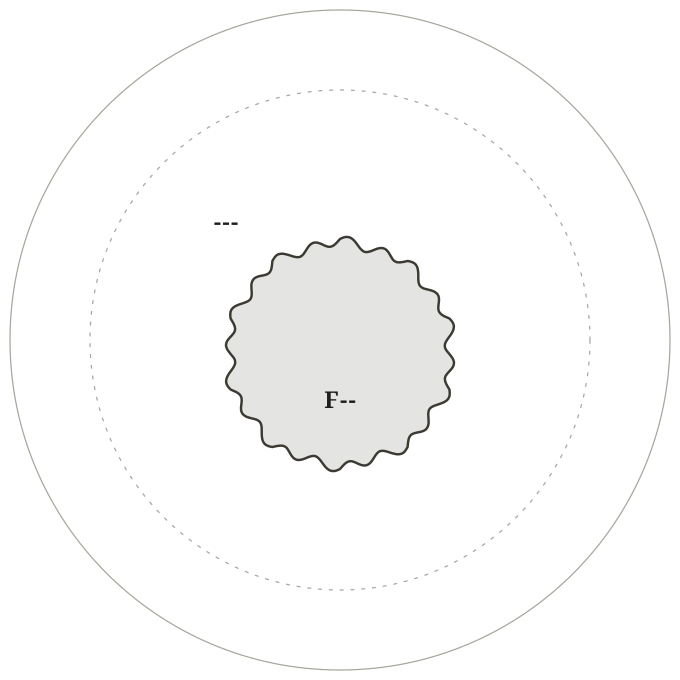

**図16-1**　現実座標系——R空間 ⊃ Ω ⊃ F（Flux は Ω の局在部分集合）／Outer Ω

### MANES座標系——「操作能力的我ら」と「実存的我ら」の範囲

現実座標系のうえに、もう一つの座標系が重ねられる。

MANES座標系は、当該の文明が現実座標系をどう分節して受け取るかを表す。**「操作能力的我ら」（O）**——当該系の行為が及ぶ範囲としての MANES 上の輪郭。**「実存的我ら」（E）**——当該系が因果を引き受ける範囲。そして両者の関係が第三の領域を生む——O の内側にありながら E の外側に位置する領域、あるいは O の外側に放置される領域。

「操作能力的我ら」（O）と「実存的我ら」（E）が別の輪郭として分かれること自体が、表象を操作する能力をもつ意識のレイヤーに固有である（その詳細は §16-3 で扱う）。このレイヤー以前——たとえば恒星や単細胞生物——では、引受（E）の軸がまだ立たず、流動（F）と操作（O）の二軸のみであった。引受の不等式の動性論は、E が分化したこのレイヤーを前提とする。

### 「操作能力的我ら」の範囲——操作の及ぶ輪郭

文明は、現実座標系に受動的に依拠するだけではない。技術・組織・物理基盤を通じて、現実に働きかける。森林を伐採して耕地に変え、鉱石を製錬して構造材を生み、地下資源を採掘し、計算資源を構築する。こうした操作の及ぶ範囲を、本書は、**「操作能力的我ら」の範囲**と呼ぶ。

「操作能力的我ら」の範囲は、技術と組織と物理基盤の蓄積として保たれ、世代を越えて累積する。装置として身体の外に持続するため、個別主体の生死とは独立に保持されうる。

### 「実存的我ら」の範囲——引受の輪郭

**「実存的我ら」の範囲**——当該文明が非対称性因果（「『我ら』の境界と因果の創発」第15章）を引き受ける範囲の輪郭である。当該系が誰を「我ら」とし、どこまでの帰結を自らに返るものとして引き受けるか——その及ぶ先が、この輪郭をなす。

「操作能力的我ら」が技術・組織・物理基盤の蓄積として身体の外に持続するのに対し、**「実存的我ら」は装置として外に蓄積しない**。いま現に引き受けられている範囲としてのみある。この非対称が動性の源になる。

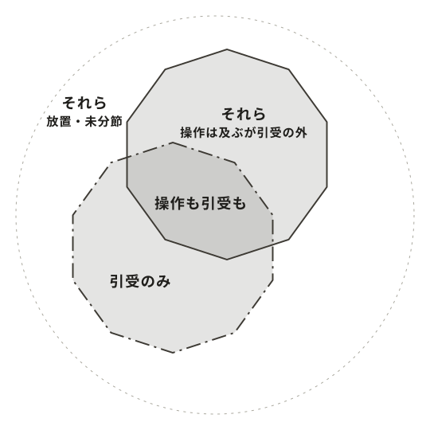

**図16-2**　MANES座標系の重ね合わせ——現実座標系のうえに E／O／それらが配置される

### 束ねられた「我ら」——この座標系が畳んでいるもの

ここで一つ、この座標系が選んでいる粗視化を明示しておく。軸に立てた O も E も、一人の主体ではない。無数の個別の主体——各自の操作の届く範囲と、各自の引き受ける枠を持つ者たち——が、神話・知識ストック・社会的既知感・制度によって媒介接続され、一つの「操作能力的我ら」「実存的我ら」として**束ねられた**塊である（束ねの装置は第Ⅱ部で立てた）。

第7章の三軸の座標系は、この束ねの大きさ——集合の大きさ——を独立の軸として立てていた。本章の射影は、その軸を畳み、かわりに流動（F）を輪郭として加える。二つは同じ対象への姉妹の射影であり、一方が軸として残すものを、他方は畳む。

文明を一組の O・E で描くことは、主体の粒度を畳む止めどころの選択であり、この畳み込みもまた圧縮である。ゆえに中核命題-1 に従い、束ねには束ねに固有の参照不能域が副生する。部分には見えているのに、全体には見えていないもの。全体だけが見ていて、どの部分も見ていないもの。この畳み込みの上で、以降の本部は進む。のちに本部が「停める構造条件は O の内部には存在しない」（第19章）と言うとき、その O も E も、ここで畳んだ束である。縫い目を走るこれらの因果を、本書は畳んだまま進む——束の内側へ視線が戻るのは、第Ⅴ部である。

### 文明相のスナップショット図——F・O・E を重ねた八つのセル

現実座標系（R空間、Ω と Outer Ω、Ω 内の Flux：F）と MANES座標系（O と E）を重ねあわせると、接続可能圏 Ω の中に、三つの多角形（F と O と E）が重なりあう射影像が見えてくる。本書はこの {Flux・操作能力的我ら・実存的我ら} の射影によるモデルを **FOEモデル**（FOE model）と呼ぶ。

FOEモデルの一瞬を切り取った断面が、**文明相のスナップショット図**である。射影像と、その中に置かれた文明の**重心**（→ §16-3）の位置が、ある時点の文明の内部構造を写し出す。

重ね合わせる三つの多角形の組み合わせが、八つのセルをなす。各セルは、現実座標系の中の領域であり、そこで Flux が流動しているか、操作と引受のどちらにどう捉えられているかを表す。セルの名は、三文字で記す——Flux なら F（Stock なら記号なし）、操作が及べば O、引受が及べば E、及ばなければハイフン。

規約に沿って両極を読んでおこう。「FOE」は「Flux が流動し、文明によって操作され、非対称性因果も引き受けられている」を、「---」は「Flux の流動はなく、操作も引受も及ばない」を意味する。同じ規約で残る六つのセルも記される——次のとおりである。

| セル      | Flux/Stock | 操作O | 引受E | そのセルが指すもの                                         |
| ------- | ---------- | --- | --- | ------------------------------------------------- |
| **FOE** | Flux       | ○   | ○   | 流動し、操作も引受も及ぶ。文明が現に生きて動かしている中核                     |
| **FO-** | Flux       | ○   | ×   | 流動し操作は及ぶが、引き受けられていない。流れ込みつづける比較的無害な出力源             |
| **F-E** | Flux       | ×   | ○   | 流動し引受は及ぶが、操作が未到達。好奇心が向かう生成のフロンティア                 |
| **F--** | Flux       | ×   | ×   | 流動するが、どちらの錨も捉えていない。可能性の流入源                        |
| **-OE** | Stock      | ○   | ○   | 固定され、操作も引受も及ぶ。費消が負荷として返る蓄積資源                        |
| **-O-** | Stock      | ○   | ×   | 固定され操作は及ぶが、引き受けられていない。単なる資源として費消される蓄積（局所的に O > E） |
| **--E** | Stock      | ×   | ○   | 固定され引受は及ぶが、操作は届かない。祖霊・死者・聖域への畏敬                   |
| **---** | Stock      | ×   | ×   | どの錨も届かない脱落域＝LOT                                   |

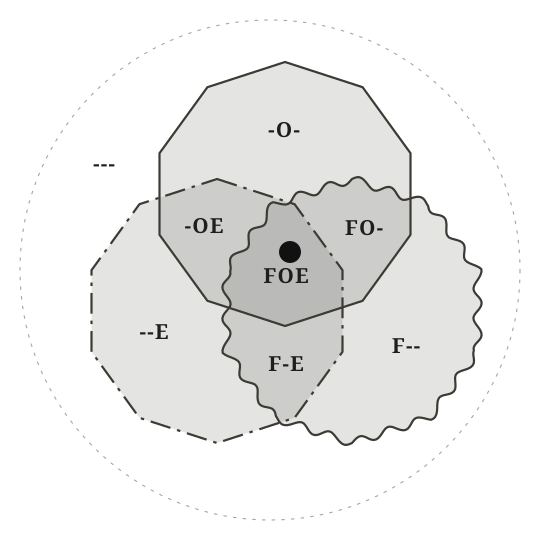

**図16-3**　スナップショット図——{Flux・O・E} の重なりがなす八セルと、その中に立つ文明の重心

スナップショット図は、ある一瞬の文明の内部構造を一枚に収める。重心——F・O・E の三つの輪郭のうえに立つ、束ねの焦点——は、本来 FOE にある。だが、それがどのセルへ動くか——どのセルが前景に保たれ、どのセルが盲域に落ちるか——は、静止した一枚には書かれていない。問われるのは、この動きである。

---

## §16-2　動性の駆動——F・O・Eは独立して動く 

§16-1 では、F・O・E の重なりを、ある一瞬で切ったスナップショットとして置いた。ここからは、その一枚を動かしていく——スナップショットを、動画に切り替える。動かしてみると、三つの輪郭はそれぞれ別の原理で動き、しかも地形に届く経路が異なる。

その違いを、いったん海の像で見ておく。

海は、接続可能圏 Ω である。見はるかす水平線が、Ω の縁。海面の下を、魚群が泳いでいる——これが Flux（F）。舟が一艘、海に出ている。乗り合わせた者たちが「我ら」であり、その舟が敬意をもって「我らの海」として手入れする海域が、「実存的我ら」（E）の輪郭。そして、舟から伸ばす釣り具——竿であれ網であれ——が届く範囲が、「操作能力的我ら」（O）の輪郭である。

この三つは、いずれも動く。だが、動かし方がまるで違う。

**魚群は、誰の手も借りずに泳ぐ。** 釣り糸を垂らそうと垂らすまいと、群れは自分の都合で寄り、また散る。どこかから流れ込み、また流れ去る。舟の側の事情とは無関係に、ひとりでに動く。

**釣り具は、手で伸ばす。** 漕ぎ手が腕を伸ばし、舟を進め、水平線の向こうへ漕ぎ出せば、届く範囲はそのぶん広がる。道具は舟に積まれて残り、世代を越えて受け継がれ、いよいよ遠くまで届く。押せば広がる輪郭である。

**「我らの海」は、押しても広がらない。** 新しい海域を「我らの海」とするには、そこを「我らの海」と感じ直す者が要る。その感覚は、道具のように積み置けない。一人ひとりの内側で抱き直され、世代を越えて語り継がれることでしか、広がらない。釣り具とは、そもそも動く原理が違う。

魚群は自律に、釣り具は道具と技術の力に、我らの海は世代の語りに——三つは三様に動く。空を見上げたとき、雲と鳥と太陽が、それぞれに違って動いて、同期した動き方をしないことに違和感を覚えることはない。むしろ、たまたま雲と同じ速度で同じ方向に鳥が飛んでいく姿を見たときに「珍しさ」を感じるのではないだろうか。F と O と E は別々に動くことが当たり前である。この三様の動きが腹に入れば、ここからの動性論は、その三つの絡み合いとして読めるだろう。

では、この三様の動きを、構造として置きなおそう。

第15章で見たとおり、「操作能力的我ら」（O）と「実存的我ら」（E）は、別の論理で動く。O は技術と組織と物理基盤の拡張で広がり、外部に物質化した装置として自走する。E は共感と教育と儀礼と物語で広がり、各個体の経験を介してしか作動しない。両者は作用し合うが、同じ動きをする保証はない——これが「**操作実存独立変動**」として取り出した構造である。

本章はここに、現実座標系の側の独立をもう一つ加える。**Flux（F）もまた、独立に動く**。Ω 内のどこに Flux が局在するか——魚群がどこに寄り、どこから散るか——は、選別構造とは無関係に自然にドリフトし、O にも E にも揃わない。

操作実存独立変動に Flux の独立が加わって、独立変動は三系統になる。これを FOEモデルの第一の構造命題として立てる。

---

**命題 FOE-1（F・O・E の独立変動）**

> F・O・E は、それぞれ別の論理で動き、互いに独立に変動する。O は技術と組織と物理基盤の拡張で広がり、外部に物質化した装置として自走する。E は共感と教育と儀礼と物語で広がり、各個体の経験を介してしか作動しない。F は選別構造と無関係に自然ドリフトする。三者が同じ動きをする保証はどこにもない。第15章の操作実存独立変動（O・E）に F の独立が加わった三系統の独立であり、引受の不等式 O ≤ E が動的に変動する地をなす。

---

## §16-3　重心——主体を束ねる意味の焦点と、その座 

**動くのは、何か**。本章が追う動性の主役——重心——である。

### 重心とは何か

文明の内部構造は、二つの「我ら」（O・E）と流動（F）が織りなす。F・O・E の三つの輪郭が重なる場には、束ねの引力が集まる一点がある——**F と O と E が織りなす場の、束ねの焦点**である。本書はこの、三つの輪郭のうえに立つ焦点を、文明の**重心**と呼ぶ。

ただし、文明の重心は、一人の頭のなかにあるのではない。**多数の意識主体が、共有して志向する核**である。各々の主体は、自分の重心——自分の意味の中心——をもつ。文明の重心は、それら個々の重心を、一つの「我ら」へと**束ねる焦点**として立つ。

自己重力系を思えばよい。多数の質点が互いに引き合って一つの束をなすとき、その束の中心——重心——は、質点が集まって生まれると同時に、質点が周回し収束する焦点でもある。文明の重心も同じである。多数の意識主体が、共有された意味へと互いに引き合って一つの「我ら」をなすとき、その焦点が、文明の重心である。集まって生まれることと、束ねることとは、別の事柄ではない。

直接に顔を合わせない主体までを、この一つの焦点へ束ねる仕組みが、**媒介接続**（第7章）である。共有された物語・記号・制度が、束ねの引力を、直接の接触が届く範囲を超えて伸ばす。引力の及ぶ先が、そのまま「我ら」の輪郭——**「実存的我ら」（E）**——をなす。

ここで一つ、確かめておく。重心が先にあって、そこから主体を引き寄せるのではない。**主体が互いに束ね合うことと、その焦点としての重心が立つことは、同時にしか起こらない**。何を有意な意味とするかを変えれば「我ら」の輪郭が動き、「我ら」の輪郭を引き直せば何を有意とするかが動く。選別構造と「我ら」の境界が一つの事態の二つの面であること（第15章）は、重心についても同じである。

---

**命題 FOE-2（束ねる焦点としての重心）**

> 文明の重心——F・O・E の三つの輪郭のうえに立つ、束ねの焦点——は、多数の意識主体を一つの「我ら」へと束ねる引力の集まる一点である。重心は主体に先立って在るのではなく、主体が共有された意味へ互いに束ね合うことと同時に立つ。その引力の及ぶ範囲が、E の輪郭をなす。

---

### 重心は、どこに座るのか

この重心は、八つのセルのどこに座るのか。問いに答えるには、重心がどこで生まれるかを見ればよい。

文明より下の——生命・生態系の、動いている系を考える。この系は、流れ込む流動（F）から汲み、それを選別・操作する（O）。だが、引き受ける主体は、まだ立たない。果は帯域の外へ抜けるが、それを「我らの帰結」として引き受け直す軸——引受（E）——がない（第15章）。重心は、流動と操作の重なり——**FO**——にある。引受の軸そのものが、まだ世界に立っていない。この系は、流れが去れば——FO が **-O** に変われば——汲むものを失い、寿命を迎える。

ここに、引受（E）の軸が立つ段がある。**表象を操作する能力をもつ、意識のレイヤー**である（第6章）。表象を操作できる系は、枠組みそのもの——座標系・報酬関数・そして共存条件——を動かしうる（第15章）。果を「我らの帰結」として引き受け、応答すべき相手として位置づけ直す——この引受（E）が、ここで初めて軸として分化する。二軸（FO）の世界が、三軸の世界になる。

新たに立った引受（E）が、生きて操作されている核（FO）と噛み合うとき。流動し、操作され、引き受けられる、三つがそろう一点が、初めて成り立つ。これが **FOE** である。八つのセルのうち、三つすべてが重なる唯一のセル——文明という構造が、そこで初めて一つの全体として立つ場所。重心は、ここで生まれる。

文明のレイヤーは、この意識のレイヤーの上に建つ。意識のレイヤーで生まれた FOE の「我ら」を、媒介接続によって巨大な規模へ拡張したものが、文明である（第7章）。だから、文明の重心の座もまた、意識のレイヤーから受け継いだ FOE にある。

---

**命題 FOE-3（重心の座）**

> FO から FOE への創発——流動（F）と操作（O）の二軸に引受（E）の軸が分化して立ち、三つのそろう FOE が成り立つこと——は、表象を操作する能力をもつ意識のレイヤーの創発である。文明は、この FOE を、媒介接続によって規模において受け継ぐ。ゆえに、文明の重心の本来の座は、FOE である——そこが、重心の生まれる場所だからである。

---

### 重心は、本来の座に留まる保証をもたない

重心の本来の座は、FOE にある。だが、本来の座にあることと、そこに留まりつづけることとは、別である。F・O・E は、互いに独立に動く（FOE-1）。三つがそろって噛み合う FOE は、放っておいて保たれる安定点ではない。

§16-2 の海の像でいえば、重心は、舟団が錨を下ろす一点——生きた魚（F）の上、漁具（O）の届く先、我らの海（E）の内、三つが重なる海域である。だが、魚は泳ぎ去り、我らの海は縮み、漁具は別の海へ伸びうる。錨が、効きつづける保証はない。この錨を打ち、効かせつづける作動を、本書は**係留**と呼ぶ。次節（§16-4）で、これがどんな仕事であるかを取り出す。

---

## §16-4　重心の係留——放っておけば、外れる 

§16-3 末で確かめたとおり、重心の本来の座 FOE は、放っておいて保たれる安定点ではない。では、何が重心をそこから動かし、何がそこに保つのか。

問いは二段で答える。まず、重心を動かす側——三つの輪郭の保たれ方の非対称と、O の論理——を見る。次に、それに抗って重心を FOE に引き戻す作動——本書が**係留**と呼ぶもの——の構造を取り出す。

### 三つの輪郭は、別の仕方で保たれる

F・O・E の三つの輪郭は、それぞれの駆動原理（FOE-1）に従って、別の仕方で保たれる。

**O（操作能力的我ら）** は、技術と組織と物理基盤の拡張で広がり、外部に物質化した装置として自走する。装置として身体の外に持続するため、個別主体の生死とは独立に保持され、世代を越えて累積する。**成長した文明では、三つの輪郭のうち最も大きく広がるのは O である**。文明が成熟するほど、O の輪郭は他の二つを覆って広がる。

**E（実存的我ら）** は、共感と教育と儀礼と物語で広がり、各個体の経験を介してしか作動しない。装置として外に蓄積されないため、いま現に引き受けられている範囲としてのみ存立する。E の広がりは、各世代の引受の総量として、その都度たち現れるしかない。

**F（流動）** は、選別構造と無関係に自然ドリフトする。Ω のうちで局在し、流れ込んでは流れ去る。F の広がりは、地形と時の経過がもたらすものであって、文明の側が広げたり縮めたりするものではない。

O は累積で残り、E は内的反復のうちにしか存立せず、F は地形と時に委ねられる。この保たれ方の非対称が、ここでの出発点である。

### 重心を動かすのは、O の論理である

三つの輪郭のうち、重心を本来の座から動かす側に立つのは O である。

操作（O）は、対象の内実ではなく、固定された報酬関数の最大化として作動する。この論理は、E が追随しているかを問わない。F が伴っているかも問わない。自前の勾配のまま、攫える先へ伸びる。

伸びた先が、三つのそろう FOE であるとは限らない。むしろ、そうならない。O が伸びて E が追随しなければ、操作は引受の外へ出る——重心は **FO-** の側へ押される。F が伴わなくなれば、操作は流れの絶えた蓄積を掘る——**-OE** の側へ押される。いずれも、O が及んで三つはそろわない領域である。

そして、前項の非対称が、この押しを一方向に固める。O は装置として外に残るが、E は各世代の内側で引き受け直されなければ痩せる。押す側は放っておいても残り、押し返す側は放っておけば消える。**放っておけば、外れる**——これが、重心が本来の座に留まる保証を持たないことの内実である。

### 係留——本来の座 FOE への引き戻し作動

この押しに抗って、重心を本来の座 FOE へ引き戻しつづける作動を、本書は**係留**（mooring）と呼ぶ。

係留作動が継続するあいだ、重心は FOE に留まる。係留が解ければ、重心は O の論理に従って FOE を離れる。本章が追ってきた「動性」の正体は、この係留と乖離のせめぎ合いである。重心が FOE から滑っていく事態を、§16-5 では係留が解ける過程として読み直すことになる（乖離・FOE-6）。

---

**命題 FOE-4（重心の係留）**

> F・O・E は別の仕方で保たれる——O は外部に物質化して自走し、E は各世代の内側で引き受け直されなければ痩せる。そのうえ O は、固定された報酬関数の最大化として作動し、E が追随しているかも、F が伴っているかも問わずに伸びる。ゆえに重心は、三つのそろう本来の座 FOE の外へ押され、押す側は放っておいても残り、押し返す側は放っておけば消える。重心を FOE に留めるには、この押しに抗う引き戻し作動——**係留**——が継続的に要る。係留を担うのは E である。E が、O が自前の勾配では届かない領域（FO-・-O-）を「我ら」として引き受けることで、O の最適化に引受の項が拘束として入り、結果として重心が FOE 側へ引き戻される。八セル表の「E が覆う」とは、この係留作動が当該領域で作動していることを指す。

---

### 係留を担うのはなぜ E か——O は自前では何を見るか

なぜ係留作動を担うのは E であって O ではないのか。問いはここで一段、観測論的根拠に降りる。

操作（O）は、固定された報酬関数の最大化として作動する。報酬関数で測れるものは、O が観測しうる項として最適化の制約になる。測れないものは、項として立たず、最適化を制約しない。

ここに、二つの命題（第15章 §15-8）が直接効いてくる。

---

> **命題 RETURN-4**：操作の側が立ち上げる接続は、報酬関数で測れる因果しかつながない。

---

これを連鎖する接続へ及ぼしたのが、二つめである。

---

> **命題 RETURN-5**：因果を生む連鎖する接続のうち、操作の側が立ち上げる接続がつなぐのは報酬関数で測れる分にかぎられる。測れない因果は接続を断たれ、引受されないまま回収断絶因果となる。

---

報酬関数で測れるのは、即時回収因果である——行為と結果が現在において測れる一つの値へ畳まれる類型。報酬関数では測りきれないのが、遅延回収因果・非線形回収因果・回収断絶因果の三類型——時間を越えて返るもの、意味付け回路を介してしか結ばれないもの、当該系の時間にそもそも返らないもの（第15章 §15-7）。これらは、O が自前で観測する報酬関数の項としては立ち上がらない。

加えて、「圧縮から創発する世界」（第2章 §2-2／§2-5）で確かめたとおり、動いている系として持続することそのものに、**摩擦の継続的な担い**が伴う。区別された個物として接続を保ちながら動く以上、避けえない不可逆コスト——これを保持しつづけることが、存在として持続する条件である。摩擦も、O の自前の観測には現れない。O が観測するのは報酬関数の値であり、自系の構造維持に伴う不可逆コストは、その値の外にある。

ここに、二つの要件が並ぶ。**報酬関数では測りきれない非対称性因果の引受**と、**摩擦の継続的な担い**。両者とも、O の側からは観測されえない。観測されえないものは、O の最適化を制約しない。

### E が係留作動を担う

これらの要件が O の最適化に項として入るためには、外から要請として供給されるしかない。供給するのは、E である。E は、O が自前では見ない領域を「我ら」として引き受け、その引受の作動を、O の最適化に拘束として課す。時間を越えて返るもの、意味付け回路を要するもの、流出した果、そして摩擦である。

これが、係留を担うのが E である根拠である。E の引受は、本来の座 FOE への引き戻しを構成する作動として O の最適化の項に入り込む。だから重心が FOE 側に引き戻される。八セル表で「E が覆う」と表現してきた領域は、機能的に読み直せば、**E がその領域に対して係留作動を働かせている**ということに等しい。

重心の本来の座 FOE は、この読みのもとで、別の姿を見せる。FOE とは、F（流動の経路）、O（操作の経路）、そして係留（E から課される引き戻しの経路）——三つの作動経路がすべて開かれている唯一のセルである。重心がそこにあるとは、三つの経路の交点にあるということに等しい。

### 係留摩擦——O の自然な勾配への抵抗

ここに、もう一つの事実がある。

E から課される係留要請を、O が受け入れる——この受け入れには、操作の側にとっての境界面の不整合がある。O は自前の勾配を持ち、自前で観測しうる変数を最適化する。外から入ってくる要請は、その自前の勾配と整合するとは限らない。むしろ、構造上、整合しないことのほうが多い——E が課すのは、まさに O の自前の勾配では掬えなかった項だからである。整合しない要請を最適化の項として組み込むことは、O の自然な勾配（FO-・-O- 方向への拡張勾配）に対して、不可逆な抵抗として作用する。

摩擦（「圧縮から創発する世界」第2章 §2-2）を思い起こせば、これは正面の摩擦である——区別された二つの作動論理（O の自前の勾配と、E から課される係留要請）が接続を保ちながら動くとき、その境界の不整合から生じる不可逆コスト。

---

**命題 FOE-5（係留摩擦）**

> 係留作動は、O の自然な勾配に対する不可逆な抵抗を伴う。O の側にとって、この拘束を担うことは、自前の勾配に対する**係留摩擦**として作用する。重心を FOE に保つ仕事の構造的内実は、この係留摩擦を継続的に担うことに他ならない。

---

この係留こそが、**保つ仕事**（命題 WORK-2、「圧縮から創発する世界」第2章 §2-4）の、文明レイヤーにおける現れである。立てた選別構造を散逸に抗して保ちつづける作動が、ここでは操作（O）と引受（E）の独立変動による重心の乖離に抗う係留として現れる。その代価が保つコスト（第17章 §17-2）であり、O の自然な勾配に対する抵抗の正面が係留摩擦である。

### 海の像で読み直す

海の像（§16-2）に戻ると、係留作動の輪郭が見えてくる。

我らの海（E）は、世代の語りで広がる輪郭である。「ここまでが我らの海だ」と感じ取る者たちのうちで、その感覚が次の世代へと運ばれて、ようやく一段広がる。漁具（O）は、技術と道具の蓄積で伸びる——舟に積まれ受け継がれて、いよいよ遠くまで届く。

我らの海を感じ取る側と、漁具を動かす側とは、ふだんは同じ人々であるように見える。だが、二つは別の作動である。漁具は、感じ取られた我らの海の境界を、伝えられて初めて自分の動きの制約として持つ。伝えられなければ、漁具は自分が触れる魚の量と、伸びる先の地形だけを見て、攫えるところへ伸びる。漁具が攫えるかどうかの報酬関数のうえで、最大化を続ける。

我らの海の感覚から、漁具を動かす手へ——この伝達の経路が、**係留**である。錨を打ち、効かせつづけること——重心が FOE に留まるとは、その作動が継続していることに他ならない。

そして、伝えられた「ここまでが我らの海だ」を漁具の側が引き受けるとき、漁具は自分の自然な勾配（攫えるだけ攫う）に対して、外から来た制約を担うことになる。**この担いが、漁具の側の係留摩擦である**。

---

## §16-5　乖離——重心が FOE から滑る 

重心の本来の座 FOE は、F（流動）・O（操作）・係留（E から課される引き戻し）の三つの作動経路がすべて開かれた領域であった。だが F・O・E は互いに独立に動く（FOE-1）。三つの経路がそろって開きつづける保証はない。FOE は、放っておけば崩れる。では、どちらへ崩れるのか。

重心を FOE から引き剥がすのは、**操作（O）の論理**である。操作は、対象の内実ではなく、固定された報酬関数の最大化として作動する。この論理は、E が係留作動を担っているか、流動（F）が伴っているかを問わない——自前の勾配のまま、攫える先へ伸びる。だから O が動けば、重心は三つの経路の交点 FOE から外れていく。本書はこの、**重心が FOE から外れていくドリフト**を**乖離**と呼ぶ。係留作動の側から見れば、乖離は係留が解ける過程として読める。

### 変性方向——外れたまま、-O- へ

外れ方には、独立な二つの経路がある。**係留が解けたまま操作が伸びれば**——E が追随しなければ——重心は FO- へ滑る。操作は引受の外へ出、流動は保つが引き受けられない文明の出力となる。**係留は維持されていながら流動が尽きれば**——F が伴わなければ——重心は -OE へ滑る。引受は保つが、汲むべき流れの尽きた固定 Stock の費消に入る。二つは別の不全だが、いずれの中間位置も、やがて終端 **-O-**——係留も解け、流れも込まず、引き受けられず片づかない固定領域——へ吸い込まれていく。

海の像でいえば——漁具が我らの海の内に留まるのは、「ここまでが我らの海だ」という伝えが手に届いているあいだだけである。伝えが途絶えれば、漁具は攫えるところへ伸びて我らの海を出る——よその生きた海を攫えば FO- へ。伝えが届いていても、我らの海の底から魚群が去れば -OE へ。いずれ魚の戻らぬ死んだ海底（-O-）を曳くに至る。

---

**命題 FOE-6（乖離）**

> 係留が解けると、操作の論理は文明の重心を本来の座から引き剥がす。重心の座は本来 FOE にあるが、係留（FOE-4）が解けると、O の論理（固定された報酬関数の最大化）が構造的にこの重心を FOE から外す——E が追随しなければ FO- へ、F が伴わなければ -OE へ、いずれも進めば -O- へ。この FOE から外れていくドリフトを乖離と呼ぶ。

---

吸い込まれる機序は、二つの経路で異なる。被引受 Stock（-OE）は、消尽していくものを引き受けつづける構えが持続しがたく、E はやがてそこから離れる。無主の蓄積（FO-→-O-）は、引き受ける主体なしには解体の作法（Mourning）が働かないため、片づかないまま累積していく。

### 再生方向——E が先導し、O が追う

だが、ドリフトは一方向ではない。順序を逆に取れば、向きも逆を向く。**E が先に、流れ込むフロンティア（F-E）を引き受け、そこへ O を建設して追随させる**とき、重心は FOE へ向かう。これは、FOE の誕生（FO→FOE、§16-3）を、文明のうちで反復することにほかならない。生まれる方向の経路である。海でいえば、まず生きた新漁場（F-E）を敬意をもって「我らの海」に迎え、そこへ漁具を建てて追わせる。錨が、生きた海のうえへ打ち直される。

この向きには、すでに名がある。枠（「我ら」）を先に立て、操作をその内側で動かす構え——**実存先行**（第15章 §15-6）である。第15章は、操作先行の三型（追随・抑制・不追随）の外側にこれを置き、文明が「我ら」を築いてきた過程に対応させた。その過程とは、虚構の共有によって実存感が先に拡張し、操作能力と規模があとを追う経路である。同じ順序が、重心の動性の語では、F-E から FOE への再生方向として現れる。第15章が構えとして取り出したものを、本章は軌道として見ている。

ただし、この先導は見通しのうえに立つものではない。引受が見分けるのは、その内側である。外側に広がる領域のうち、どこに流動があってどこにないかを、E はあらかじめ知ることができない（この盲点は §16-6 で命題として立てる）。だが、それは再生方向を塞がない。E が手を伸ばした先が現に F に触れていれば F-E が立ち、触れていなければ --E が立つ。区別が成り立つのは、伸ばしたあとである。海でいえば、魚のいる海域を見定めてから我らの海を広げるのではない。広げてみて、そこに魚がいるかどうかが分かる。**E の先導は、原理的に手探りであり、空振りを含む。** 重心を動かすのは、F に触れた手だけである。生まれる方向の経路は、外れを織り込んで進む。

ここから読めるのは、**重心が FOE に保たれるか否か**が、引受の不等式 O ≤ E の成否そのものではなく、**E が先導し、O が生きた F のうえへ追随するという順序**にかかっていることである。生まれる局面では E が O を先導し（F-E→FOE）、終わる局面では O が E を置き去りにする（FOE→-O-）。同じ座標系が、生成と終局では逆向きのドリフトを示す。

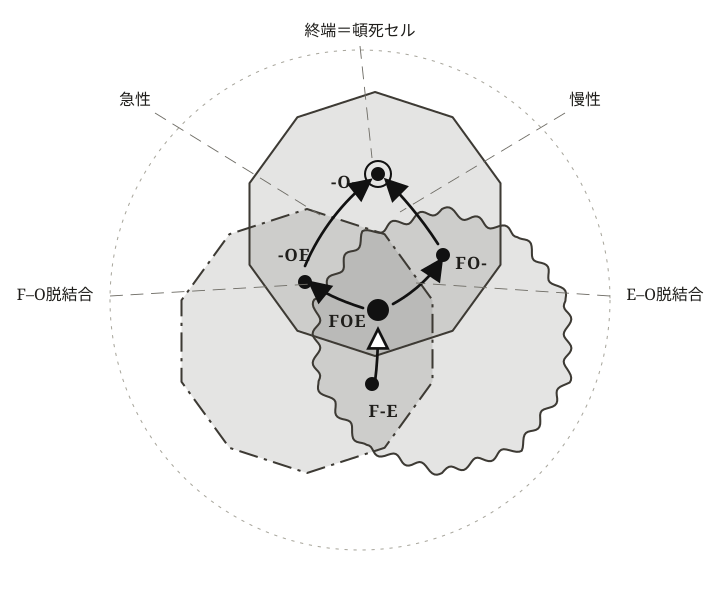

**図16-4**　乖離の軌道——変性方向（O先行）の FOE→FO-/-OE→-O- と、再生方向（E先行）の F-E→FOE

文明は、この乖離に一様に応じるのではない。重心を FOE に保つために E を広げるか、O を畳むか、係留を放棄して -O- 側へ滑るにまかせるか——応じ方は三つに分かれる。

---

## §16-6　三つの文明相——文明の出力・コスト・リスクへの態度の三類型 

三つの文明相は、前節の乖離への態度の違いである。§16-5 まで、乖離は重心が FOE からどこへ滑るかという幾何の語で追ってきた。同じ乖離を、文明が何を得て何を失うかの語——**文明の出力・コスト・リスク**——で測り直すと、三つの文明相の分かれ目が見えてくる。文明の出力は O の広がりに、コストは係留の仕事（FOE-4・5）に、リスクは -O- への応報（§15-7）に対応する。

**文明の出力**は、当該系が世界に対して産出するもの、行為が及ぼす変化の総量である。操作が覆う範囲（O）の大きさで決まり、E の大きさでは決まらない。E が小さくても O が大きければ文明の出力は大きく、E が大きくても O が小さければ文明の出力は小さい。文明の出力は操作能力の側の構造であって、引受の側の構造ではない。ただし、その大きさは覆う範囲の広がりだけで尽きるのではない。広がりのうえに立つ深さもまた有効勾配の急峻さを作り、文明の出力を成す。

**コスト**は、重心を FOE に係留する仕事である（FOE-4・5）。O の拡張に E を追随させ、引受の不等式 O ≤ E を成立側に保つ——共感・教育・儀礼・物語を通じて、世代を越えて「我ら」の輪郭を引き直す仕事（遅延回収因果の引受）。係留作動が継続するかぎり、O の自然な勾配への抵抗——係留摩擦——を継続的に担うことになる。支払われなければ E は O に追随できず、係留が解けて、重心は乖離する。

**リスク**は、流動（F）を欠く操作が抱える応報の可能性である。汲むべき流れの尽きた蓄積を掘るとき——重心が -OE へ、さらに -O- へ滑るとき——引き受けられないまま流出した帰結が、意味付け回路を欠いた非線形回収因果として、選別構造を突き破って立ち戻る（§15-7）。当該系の判断システムが事前に同定できない構造をもつため、学習回路には取り込めない——単なる「失敗」とは異なる。引き受けられている側（-OE）ではリスクは可視化され、引き受けの絶えた側（-O-）では見えないまま累積する。

三者は独立に動き、トレードオフをなす。文明の出力を追えばコストが追いつかずリスクが増え、コストを引き受ければ文明の出力は抑えられ、リスクを管理しようとすれば文明の出力の抑制とコストの引受の両方を要する。**どれを重く見るか**が、文明の様態を分ける。

その分節は、当該文明が中核として引き受ける非対称性因果類型（第15章）と対応関係を持つ。第15章の非対称性因果の四類型——即時回収・遅延回収・非線形回収・回収断絶——は、文明相の中核類型として畳まれる。即時回収を中核とすれば**管理安定相**、遅延回収を引き受ければ**循環耐久相**、回収断絶を温存すれば**拡張加速相**である。非線形回収は独立の相ではなく、拡張加速相が抱える応報として現れる。**時間の軸**（いつ・誰に返るか）で測ったこの分節は、前節（§16-5）が**形の軸**（重心が FOE からどう乖離するか）で測り直した三つの文明相と、同じ一つの対象の二つの読みである。三つの文明相と四類型は、互いを吸収して一方が消えるのではない——以降の本文では両体系を併存させる。文明相の語は乖離への態度（構え）の名として、四類型の語は引受の不等式の成立／破綻ごとの因果配置の名として（第15章 §15-8）、それぞれ独自の切り口で用いる。

---

**命題 FOE-7（三つの文明相の応答）**

> 文明は乖離に、三つの相で応じる——重心を FOE に保つために E を広げる拡張追随（循環耐久相）、重心を FOE に保つために O を畳む縮退安住（管理安定相、極限で一点収縮＝**ブラックホール計算文明**——「MANESの三層」第6章）、重心が -O- 側へ滑るにまかせる片肺拡張（拡張加速相）。

---

### 三つの文明相の比較

三つの文明相を、中核因果類型、E と O の関係、三つの構造変数への態度、動員機構、重心の観点から並べると、以下のように整理される。表中の「充足」は、引受の不等式 O ≤ E が満たされていること——すなわち操作が引受の内側に収まっていること——を指す。満たし方の違いが管理安定相と循環耐久相を分ける。

|                    | 管理安定相                     | 循環耐久相                        | 拡張加速相               |
| ------------------ | ------------------------- | ---------------------------- | ------------------- |
| **中核因果類型**         | 即時回収因果                    | 遅延回収因果                       | 回収断絶因果（→非線形応報を抱える）  |
| **E と O の関係**      | O ≤ E（**縮退充足**：両者とも小さく揃う） | O ≤ E（**拡張充足**：両者とも拡張、E が追随） | O > E（O 拡張、E 据置）    |
| **文明の出力**       | 抑制                        | E に追随する範囲で拡大                 | 最大化             |
| **コスト（遅延回収因果の引受）** | 小さい                    | 大きい（引受の仕事を能動的に投じる）       | 系外へ転嫁               |
| **リスク（非線形応報）**     | 管理を志向                     | 引受の範囲内で抑制                    | 認識しない・判断対象に立ち上げない   |
| **動員機構**           | 内的な接続                     | 拡張的な接続                       | 序列的・抽出的な接続          |
| **係留への態度**       | 三つの輪郭を小さく密着させ係留摩擦を最小化 | 拡張領域すべてで係留を能動的に維持            | 係留を放棄              |
| **重心**             | FOE                       | FOE                          | FO- または -OE から -O- へ |

動員機構の三様態——内的／拡張的／序列的・抽出的な接続——は、**媒介接続**（第7章）の現れである。内的な接続は、媒介を要しない直接の接続（小規模・対面的な「我ら」）。拡張的な接続と序列的・抽出的な接続は、媒介接続の二つの様態にあたる。前者は共有された認知と応答性を介して「我ら」を束ね、後者は序列・権力・市場機構を介して動員する。三つの文明相の動員機構の差は、「我ら」をどの様態の接続で束ねるかの差である。

### 配置は一つでは読めない——広がりとズレ

三つの文明相は、独立に並ぶ種ではない。配置を読むには二つが要る。O・E がともにどこまで届いているか（**広がり**）と、どちらか一方だけが届く帯がどれだけ厚いか（**ズレ**）である。スナップショット図でいえば、ズレは O と E の重なりの縁に生じる帯——FO-・F-E・-O-・--E のセル——にあたる。二つは、一方が他方を肩代わりしない。ズレが O の側へ開けば拡張加速相。ズレが小さい側は広がりが分ける——両者を小さく揃える管理安定相と、拡張しながら揃えつづける循環耐久相。ズレ一つでは、縮退充足と拡張充足の別は読めない。なお、この面が切り取るのは配置である。そして、当該系が自らの配置をこの二つで読めるとはかぎらない。

ここで重要なのは、**引受の不等式の成立そのものは、重心が FOE に保たれることを保証しない**ことである。表のとおり、管理安定相も循環耐久相もともに O ≤ E を満たす。両者を分けるのは不等式の成否ではなく、その**満たし方**である。E を O の上へ育てて満たす拡張充足（循環耐久相）か、両者をともに縮めて境界上で満たす縮退充足（管理安定相）か。そして、引き受けられないまま参照不能化される領域の規模が、両者のあいだで異なる。

海の像で一つ、補助線を引いておく。**舟の大きさ——小舟（個）か、船（氏族）か、船団（文明）か——は、どの相とも独立である。** 舟の大きさは、束ねの大きさ——何人を「我ら」に束ねているか——であり、本章の射影が畳んだ当の軸である（§16-1）。面の広がり——O・E がどこまで届いているか——とは、別の事柄である。相を分けるのは、漁具（O）を我らの海（E）の内に保つか、外へ投げ広げるか、である。慎ましい我らの海に竿を垂らすのが管理安定相、広い我らの海を世話して網をその内に保つのが循環耐久相、我らの海の外へ地引網を投げ、序列で束ねた船団で曳くのが拡張加速相である。

この面は、第Ⅱ部の装置と一つの対応を持つ。第7章の段階表——①「我ら」未成立から⑥実存縮退まで——は、三軸の座標系から集合の大きさを畳み、O と E の相対関係だけを取り出した論理的可能性の空間だった。畳んでいる軸は、本章の射影と同じである。面の語でいえば、段階表はズレの方向を刻んだ目盛りであり、広がりを畳んでいる。だから、④両軸均衡は特定の相ではない。④は O ≤ E が均衡する**位置**である。その位置は、両者を小さく揃えても（縮退充足）、拡張しながら揃えつづけても（拡張充足）実現される。④のうえで管理安定相と循環耐久相を分けるのは、段階表が畳んだ広がりの側である。位置と、保ち方。段階表は前者を刻み、文明相は後者を分ける。そして④から⑤操作単独拡張、⑥実存縮退へ移る列は、本章の語では乖離の運動——重心が FOE から FO- へ、さらに -O- へ滑る軌道——にあたる。第7章はこの乖離の素因として、継承様式の非対称を取り出した。操作の側は外部装置と制度によって自走しうるが、実存の側は各個体の経験を介してしか作動しない。この非対称は、係留がなぜ E の側の仕事であるか（§16-4）を、装置の側から言い直したものにほかならない。

三つの文明相は、いずれか一つが単独で作動する純化形として本章では取り出している。実装においては、内側で管理安定相を保ちながら外側では拡張加速相の帰結を引き受けつづける層状の組み合わせ——**遮蔽層／曝露層**——として現れる形態もありうる。

### 管理安定相——コスト・リスク重視、出力抑制

管理安定相は、文明の出力よりもコストとリスクの負荷のほうを重く見る文明相である。O の及ぶ範囲を意図的に狭く保ち、文明の出力を抑制することで、コストの発生とリスクの蓄積を小さく保つ。

中核とする因果類型は即時回収因果である。両軸（O と E）が小さく揃った範囲のなかで運動を組織する——O は E の内側に収まり、両者は同じ範囲を覆っている。引受の不等式は構造上自明に成立する。Flux/LOT といった不安定要因に対しては、能動的に管理して運動領域の内側に侵入させない構えを取る。

動員機構は、小規模で内的に接続した主体集合に基づく。共有された「我ら」のうちで共感と相互認知が直接的に作動するため、動員のための装置を別途要しない。管理安定相は、文明の出力を小さく保つ代償として、コストとリスクを最小化する。引受の不等式の安定的成立を保証する一方で、文明の出力の規模そのものは上限を持つ。

### 循環耐久相——コストを引き受ける、文明の出力とコストの緊張のうえで運動する

循環耐久相は、文明の出力の拡大を許容しつつ、それに伴うコスト（E の拡張の仕事）を能動的に引き受ける文明相である。O の及ぶ範囲が広がるにつれて、E も追随させて拡張しようとする。

中核とする因果類型は遅延回収因果である。O が広がっても、E が時間的・空間的・実存的に拡張して O ≤ E を維持しようとする。世代を越えた継承機構、長期的な蓄積を許容する制度、即座には測れない価値を保持する仕組み——これらの維持に、共感・教育・儀礼・物語の反復の仕事が投じられる。

動員機構は、拡張的に接続された E の維持に依拠する。「我ら」の境界が広がるにつれて、その範囲全体にわたる共有の認知と応答性を維持する作業が必要になる。主体の認知能力の限界を超えて E を拡張しようとするためコストがかかり、当該系は**負荷を抱える**（この負荷が担い手にどう体験されるかは第Ⅴ部の主観層で扱う）。E をどこまで拡張できるかが、この相の文明の出力の実質的な上限を規定する。拡張が認知能力の限界に達した時点で、文明の出力の拡大も停止する。

循環耐久相は、コストを引き受ける仕事の継続のうえに成立する。その仕事の内実は二重である。E が流れ込むフロンティアを先導して引き受け、O を生きた F のうえへ追随建設する先導の仕事（重心を FOE へ向ける）と、放っておけば重心を -O- へ引く二つのドリフト（被引受 Stock からの E の離脱、無主の蓄積の累積）に抗してこれを押し留める仕事である。仕事が継続するあいだ、引受の不等式は成立側に保たれる。仕事が途絶えれば、相は別の様態へ転落する。

### 拡張加速相——文明の出力追求、コスト転嫁、リスク無視

拡張加速相は、文明の出力の最大化を追求する文明相である。O の及ぶ範囲を能動的に広げつづけ、その拡張に E を追随させない。

中核とする因果類型は回収断絶因果である。E の境界の外側に流出する帰結を、当該系の判断回路から排除しつづけることで、文明の出力拡大に伴うコストの引受を回避する。コストは——遅延回収因果として引き受けるべきものは——系外へ転嫁される。リスク——非線形応報の可能性——は、認識されない。当該系の判断システムが事前に同定できない構造（§15-7）を持つため、リスクは判断対象として立ち上がらない。

動員機構は、序列的・抽出的に接続された主体集合に依拠する。共有された「我ら」の範囲は小さく保たれる一方、O は遥かに大きく広がる。動員は、E の外側に位置する主体や領域に対して、序列・権力・市場機構を介して作用する。共感や応答性の共有を前提とせず、配置として「同じ意思の方向に動員する」ことが達成される。「我ら」を実存的に拡張せずに動員力を獲得しうる。この機構が、拡張加速相が小さな E のもとで巨大な文明の出力を実現する構造的根拠である。

拡張加速相は、文明の出力の最大化と引き換えに、コストとリスクを系外あるいは未来へ送り出す。系外に送り出されたコストの累積は、宇宙論的な地では作動しつづけ、いずれ非線形応報として立ち戻る。だが、その立ち戻りまでのあいだ、当該系の判断回路には「破綻の徴候」が現れない。

この見えなさは、構造的なものである。O > E のもとで流出するコストや基盤の消尽は、O が及ぶ範囲にありながら、E が引き受ける範囲の外に落ちる。スナップショット図でいえば、O は及ぶが E が届かない FO-・-O- のセルである。当該系が因果を引き受ける分解能の外に落ちるため、それは「悪い兆候」としてすら現れない。

### 消尽はなぜ見えないか——引受の外の不可知

ここに、見落とせない質的な差がある。同じ「操作するが引き受けない（O > E）」でも、それが **FO-（流れ込みつづける流動源）** に向かうか、**-O-（再供給されない固定 Stock）** に向かうかで、帰結はまったく異なる。前者の費消は流入が補うため相対的に無害だが、後者は——次の文明の起動条件そのものを成す蓄積を——取り返しなく削っていく。ところが E は、自分の外側にあるこの二つのセルを見分けられない（FOE-8）。**消尽していく -O- を、無害な流動源 FO- と取り違えて費消しつづける**——これが、破綻の徴候が現れないことの内実である。

なお -O- は、二つの姿で本書に現れる。一つは、外的な Stock を単に消尽していく姿——本節までの記述はこれを追ってきた。もう一つは、系が**自らの Stock を F として取り崩す**姿——外部の流動が枯れたのちに、自系の出力を次の入力に回してなお圧縮を続ける、入れ子の自己言及の姿である。後者は「知識の重さ」（第9章 §9-3）が**自己言及相**として立てたものと同じ構造である。多段圧縮の側から見た同じ幾何は「参照されるから、存在する」（第18章 §18-4）が引き受ける。-O- は消尽形で立ち上がり、自系 Stock の入れ子化＝自己言及相として深化する——両者は、同じセルの二つの読みである。

---

**命題 FOE-8（引受の外の不可知）**

> 引受は、その内側を見るが、外側は見分けられない。E は、自分の外側のセル（F--・FO-・-O-・---）を区別できない——とくに、流れ込みつづける流動源（FO-）と、消尽していく固定 Stock（-O-）の違いを、引受の側から見分けられない。

---

ここまでは、認識の側の話である。見分けられないことが害に転じるのは、その二つが帰結の側で対等ではないときにかぎられる。

---

**命題 FOE-9（Stock消尽とFlux流動）**

> Stock の消尽は、Flux の流動と違って再生されない。操作するが引き受けない（O > E）の帰結は、向かう先のセルによって有害性が異なる——流れ込みつづける流動源（FO-）への費消は流入が補うため相対的に無害だが、再供給されない固定 Stock（-O-）への費消は、次の文明の起動条件そのものを取り返しなく削る。

---

この区別は、再生される流動源（FO-）と再生されない固定 Stock（-O-）を分けるものである。**命題 FLUX-2**（「圧縮から創発する世界」第2章 §2-5）の文明レイヤー特殊化にあたる。FLUX-2 が立てたのは、Flux の二面——出力＝補充される流れと、蓄積＝再生されない蓄え——である。Stock／蓄積という構造区別が上流の地であり、その有害性と可視性の差が、引受の不等式に紐づく文明レイヤー固有の幾何として加わる。

勘定の語彙で言えば、こうなる。FO- と -O- を見分けられない系勘定は、再生されない蓄えの取り崩しを、補充される流れからの収入と**同じ記載**で付ける。取り崩しであることが記載に現れない以上、「まだやれる」という余力の見積もりは、蓄えが減るほど実態から系統的に乖離していく。見積もりの誤りが確率的に散らばるのではなく、**過大の側へ偏りつづける**。系勘定はそのつど閉じつづけ（勘定の閉じ、第3章 §3-3）、閉じない帳簿の側——消えない支払いの記録——との乖離だけが累積する。頓死が「予兆なしに来る」（第3章 §3-4）ことの、文明相の水準での現れがここにある。

「実存的我ら」をその範囲まで広げて引き受けること——それだけが、この区別を可視化する。引受の不等式は、ここでは規範的な要請である前に、**自らを蝕む消尽を見るための認識論的条件**として作動している。引き受けないかぎり、止まる手がかりそのものが生じない。

---

**命題 FOE-10（可視性の条件＝引受の不等式）**

> 引受の不等式は、Stock 消尽を可視化するために必要である。引受の不等式 O ≤ E が保たれているほど、重心は FOE に保たれ、消尽していく Stock は -OE として——引き受けられた領域として——可視化される。O > E に破れると、操作対象が E の外側（FO-・-O-）に出て、消尽が E の分解能の外に落ちる。引受の不等式は、自らを蝕む消尽を見るための認識論的条件——帰結が当事者の判断回路に現れない回収断絶因果の、幾何学的機構——として作動する。

---

### 三つの文明相は優劣ではない——そして競争環境へ

三つの文明相は、三つの構造変数（文明の出力・コスト・リスク）のトレードオフへの異なる態度として現れる。各相は、固有の機能と固有の脆弱性を持つ位置として並ぶ。管理安定相は文明の出力の上限と引き換えに安定を得、循環耐久相は負荷のうえに動的均衡を維持し、拡張加速相は破綻のリスクを抱えたまま文明の出力を最大化する。

三つの文明相は、それぞれが構造的に「ある」一つの様態である。ここまでの記述に、三つの文明相のいずれかを規範的に推奨する含意はない。

一つ、比喩を補助線として置く。同じ水素と酸素から、水もできれば、過酸化水素もできる。水のほうが、できやすい。だが、できやすいことと、上等であることは、別の事柄である。宇宙は、水が過酸化水素より上等だとは言わない。できやすいものが、できやすい——あるのは、それだけである。三つの文明相のあいだにある差も、これと同じ種類の差である。どれが正しいかではなく、どちらへ転がりやすいか。

ただし、三つの文明相は対称的な位置にあるわけではない。とくに、複数の文明が同一の現実座標系を共有して並走する競争環境のもとでは、三つの文明相それぞれの動性は対称性を失う。この対称性の破れのうちで、拡張加速相は頓死を内在させ、第Ⅳ部の扉が立てた第一の主張——「我ら」の境界が文明の運命を直接規定する——が構造記述として接地される。

---

## §16-7　頓死の幾何——競争環境のもとの拡張加速相 

ここまで、F・O・E が独立に動くこと、重心の本来の座とそこからの乖離、三つの文明相への分化、そして引受の外で消尽が見えなくなることを見てきた。本節は、これらに競争環境を一つ加える。複数の文明が同じ現実座標系を並走するとき、拡張加速相がなぜ短期的優位ゆえに頓死を内在させるのか——その構造（**FOE-11**）を導く。

### 競争環境の導入

現実座標系は、当該系の MANES がどう分節するかとは無関係に存在する（§16-1）。この性質が、複数の文明レイヤーにとって含意を持つ。**異なる MANES座標系を持つ複数の文明が、同じ現実座標系を共有しうる**。

複数の文明が同じ現実座標系のうえで並走するとき、それぞれの O は同じ R空間のなかで競合する。一つの文明が O を拡げれば、その範囲に他の文明の領域が含まれうる。一つの文明の操作の帰結が、他の文明の運動領域に流出しうる。三つの文明相は、孤立して存在するのではなく、相互作用する場のうえに置かれる。この競争環境のもとで、三つの文明相の対称性は失われる——それぞれの相の選好が、競争のなかで異なる帰結を生むからである。

### 拡張加速相の短期的優位

複数の相が並走するとき、まず顕在化するのは、**拡張加速相の短期的優位**である。

拡張加速相——片肺拡張（FOE-7）——は、O だけを拡げ、E を追随させない。重心は FOE から FO- へ滑る。この相は、文明の出力を最大化する。コストを系外へ転嫁し、リスクを判断対象に立ち上げないため、文明の出力の規模に対する内的な制約が小さい。同じ時間スケールで観察すれば、管理安定相も循環耐久相も、その出力規模には届かない。

循環耐久相が遅れるのは、構造的な理由による。循環耐久相は、O の拡大に E を追随させる引受の仕事——重心を FOE に係留すること——を投じ、拡大の速度はその仕事の速度に律速される。拡張加速相は、その係留を放棄するぶん、同じ時間スケールでは拡大が速い。管理安定相は、そもそも O を小さく保つため、出力規模で並ばない。

短期競争では、拡張加速相が出力規模・拡大速度・操作射程のいずれにおいても他相を上回る。この優位は、能力差や戦略差ではなく、**係留を担うか放棄するか**から帰結する。

### 短期優位が、そのまま頓死になる

しかし、この短期的優位は、長期の存続を保証しない。優位そのものが、頓死経路を構成する。経路は、ここまで束ねた命題から幾何的に辿れる。道筋は四つの折り目をなす。深掘りが文明の出力を立てて視野を締め、操作が流動を外れて固定 Stock に達し、消尽が引受の外で見えないまま進み、応報が他責系で反復される。

森林を例にとる。森林を「造船のための材木」という単一の効用へ縮約すれば、材木の産出は跳ね上がる。森林という領域そのものは操作されつづけ、失われはしない——握りつぶしても本体は壊れない、水を含んだスポンジのように。だが締めるほどに、「菌糸の苗床」であったような性質は、覆いの外——参照されない脱落域（LOT）——へ落ちる。深掘り（高文明の出力）と、視野を締めること（LOT への脱落）は、同じ一つの縮約の、縦の顔と横の顔である。

そして、その深掘りが向かう先に、流れ込む Flux があるとは限らない。O だけが拡がって E が追随せず、さらに O の論理が重心を Stock 側へ引くとき（乖離、FOE-6）、操作は流動に盲目のまま縁を拡げる（FOE-1）。その縁が更新されない固定 Stock（-O-）に届くとき、いまの文明の出力は最大に達する。だがそれは、絞り尽くせば戻らない水を絞っている。乾いたスポンジを握りつづけるように、本体は無事に見えたまま、絞るものが尽きる。化石燃料の費消はこの幾何の典型である。数億年の堆積という再供給されない固定 Stock が、流れ込みつづける流動源と同じ手つきで費消される（FOE-9）。

しかも、この消尽は当該系から見えない。-O- は E の外にあり、E はその外側を——消尽していく固定 Stock と無害な流動源とを——見分けられない（FOE-8）。引き受けていないがゆえに、止まる手がかりそのものが生じず、運動は回収断絶因果のモードで継続する（FOE-10）。

流出した因果は、宇宙論的な地では作動を続け、累積する。蓄積が当該系の選別構造の閾値を超えると、無視しきれなくなり、非線形応報として強制的に立ち上がる。意味付けの回路を欠いた事象として、応報が判断回路に侵入する。

応報の後、当該系には事後的な意味付けの再構成の経路が開かれる（§15-8）。自責系——帰結の原因を当該系自身に同定し、選別構造そのものを引き直す経路。他責系——原因を外側の別の存在に同定し、選別構造を温存したまま意味付ける経路。

拡張加速相の特性が決定的に作用する。**拡張加速相の選別構造は、帰結を E の外側へ押し出す構えを温存している**。選別構造がそのまま温存されるかぎり、再構成は構造的に他責系の形しかとりえない。新たな対象が原因として帰属され、形式的には遅延回収の外形を持つが、構造的には O > E の破綻が継続する。E は実質的に拡張せず、重心は -O- 側に残ったまま、運動が再開される。

この反復のなかで、選別構造は引き直されず、学習回路は成立しない。各サイクルで、重心は FOE に戻らず、-O- 側へさらに深く沈む。運動が支えうる規模そのものが、反復のたびに縮退していく。各サイクルが図16-4 の変性方向をなぞり、軌道は循環のたびに深くなる。最終的には、累積が当該系の存続を支える下位レイヤーの境界条件を侵食し、歯止めなく破綻に至る。

この終端で、**頓死の規定**（「LEFFLAとLOT」第3章 §3-4）が、動態の語で回収される。頓死とは、LEFFLA がなお残存しているにもかかわらず、系の自己保持に必要な差異が、選別構造の歪みによって参照不能のまま LOT 側へ落ちていくことであった。-O- の見えない消尽とは、まさにこの差異が、引き受けられないまま（回収断絶のモードのまま）削られていく過程にほかならない。この差異とは、当該系の存続を支える下位レイヤーの境界条件、そして次の文明の起動条件を構成するものである。静的に書けば「自己保持に必要な差異の LOT への脱落」（第3章）、動的に書けば「重心の -O- への沈降と他責系の反復」（本章）、会計の語で書けば「勘定は閉じつづけ、帳簿に未決が積もる」（第3章 §3-3〜§3-4）——頓死の規定と頓死の幾何と勘定の閉じは、同じ事態の三つの記述である。

経路の全体を、一つの命題に畳む。

---

**命題 FOE-11（重心の -O- への乖離）**

> 拡張の加速は、文明の出力を深く掘り下げるほど視野を締め、更新されない地の上に最大出力を立てる。その地の消尽は引受の外にあって見えず、応報は他責系で反復され、重心は -O- へ沈む。

---

ここで立てた重心の -O- への乖離を受けて、本書の一つの観察される傾向が立つ。

---

**観察される傾向 第Ⅳ部-1（拡張加速相の頓死傾向）**

> 拡張加速相の文明は、寿命より早く対称性因果の部分回帰を引き寄せる傾向にある。回収断絶因果と非線形回収因果の累積が、頓死として現れる傾向が観察される。決定論的な予測はできない。

---

短期的優位と長期的頓死傾向は、別々の事態ではない。**係留を放棄するという同じ一つの構え**が、短期では優位として、長期では頓死傾向として現れる。短期優位ゆえに頓死傾向を内在する——これが、競争環境のもとで拡張加速相が辿る経路の幾何である。

---

## §16-8　循環耐久相の維持と第一の主張の接地 

### 循環耐久相と自責系の親和

循環耐久相は、拡張加速相と対照的な親和性を持つ。

循環耐久相は、O の拡大に E を追随させる引受の仕事を能動的に投じる（拡張追随、FOE-7）。この仕事そのものが、選別構造の継続的な引き直しを内包している。新たに含めるべき対象を認知し、応答すべき相手として位置づけ直す作業が、常時行われる。応報が立ち上がったとき、循環耐久相の選別構造はすでに引き直しの作動を持続しているため、**自責系の経路が構造的に開かれている**。重心は -O- へ深く沈む前に、引受によって -OE へ引き戻される。さらに、操作能力を生きた流動のうえへ建て直すことによって、FOE へ戻りうる。その建て直しとは、流れ込むフロンティアを E が先導して引き受け、そこへ O を追随させる作動である。

### 維持の難しさ——二重のコスト

しかし、循環耐久相を維持すること自体に、負荷がある。重心を FOE に係留する仕事は大きく、主体の認知能力の限界に常に圧力を受ける。並走する拡張加速相と比べれば、文明の出力の拡大速度は遅く、負担は重い——競争環境のもとで構造的に不利な位置にある。

しかも、その負荷は当該系の自業自得に限られない。**並走する拡張加速相が回収断絶として系外へ吐き出した帰結が、循環耐久相の運動領域に流入する**。海でいえば——並走する別の船団が曳き荒らした海底の荒廃が、我らの海へ流れ込む。流入してくるこの帰結は、送り出した他相の側では回収断絶因果だが、意味づける回路を伴わずに届くこちらの側では、非線形回収因果として立つ（第15章 §15-8）。循環耐久相が担うのは、自らの操作能力拡張に伴うコストだけでなく、この流入してきた帰結をも引き受け直して、自らの遅延回収因果へ繰り入れる仕事である。不利は二重化する——自業自得と他業自得の両方が、循環耐久相の係留作動に積み上げられる（係留摩擦の二重化）。

維持の難しさは、この負荷の累積に由来する。仕事が途絶えれば、循環耐久相は別の様態へ転落しうる——とくに競争環境のもとでは、拡張加速相への引力が常に作動している。

ここで、もう一つの観察される傾向が立つ。

---

**観察される傾向 第Ⅳ部-2（循環耐久相の競争劣位）**

> 循環耐久相の文明は、対称性因果を引き受けつづける構えのもとで、引き受けを省く競争相手に対して構造的に劣位に立つ傾向にある。

---

### 第一の主張の接地

ここまでの論証によって、第Ⅳ部の扉が立てた第一の主張——「我ら」の境界が文明の運命を直接規定する——が、構造記述として接地される。

「我ら」の境界（E の輪郭）が O の拡張に追随するか否かが、重心を FOE に保てるか、Stock 側へ滑らせるかを分ける。滑った先で選別構造の引き直しが伴うか否かが、自責系の経路に乗るか、他責系の反復に陥るかを分ける。他責系の反復は頓死経路を構成する。

技術が、制度が、経済が文明を動かすという見方を、本書は肯定する。しかしそれらすべての上で、誰を「我ら」と感じるかという主観的な分節が——E の輪郭が——文明が HZ 内に留まりうるかどうかを分かつ構造的拘束条件として作動している。三つの文明相の動性論は、このことを構造記述として示した。

### 「我ら」の境界が文明の運命を分かつ——そして次の問いへ

本章は、第Ⅳ部の扉で立てた二つの主張のうち第一の主張——「我ら」の境界が文明の運命を直接規定する——を構造記述として接地した。F・O・E の独立変動を起点に、文明の重心の本来の座 FOE と、O の論理がそこから重心を押し出すことに抗う係留作動を取り出し、係留が解けた先の乖離と、三つの文明相の応答を並べた。競争環境のもとで拡張加速相が辿る頓死経路と、循環耐久相が抱える二重コストを示すまでで、引受の不等式が文明レイヤーで動的・不安定な拘束条件として作動することが確かめられた。

一方、不等式の動性の幾何は、本章では現実座標系の平面に射影された像として取り出されたにとどまる。文明の出力がいかに生まれ、どれだけの規模を、どれだけの安定性で支えうるかは、本章の射影法では立ち上がらない。操作の作動が深さ方向に多段に積み重なる構造、立てるコストと保つコストの非対称、現に支えている規模と将来維持できる規模の引き離しである。これらは、続く三章が引き受ける。出力が立つ場の幾何を「文明の出力の幾何」（第17章）が取り出し、深さ方向の多段構造と参照の構造を「参照されるから、存在する」（第18章）が内側から開き、そのうえで「どの規模まで、保てるか」（第19章）が規模の問いに正面から答える。

本章が引き受けたのは、入口の三つの問いの二つめ。**重心は、どこにあるか**、流動と操作と実存の重なりの射影法であり、FOEモデルと三つの文明相がその答えである。続く問いは——**どの規模まで、保てるか**、文明の出力の射影法である。同じ不等式を、文明の出力の側から射影し直すとき、幾何の軸では背景に退いていた**深さ**が前景に立つ。**現に支えている規模が伸びていることは、将来維持できる規模が保たれていることを意味しない**——この引き離しをみていく。

---

# 第17章　文明の出力の幾何——漏斗モデル 

三つめの問いに入る。

**どの規模まで、保てるか**。規模の軸である。

「『我ら』の境界と因果の創発」（第15章）が、結果はいつ・誰に返るかを問い、これを非対称性因果の四類型として構造命題化した。「不等式の動性」（第16章）が、重心はどこにあるかを問い、FOEモデルとして展開した。この第三の問い——規模の問い——には、本章から「どの規模まで、保てるか」（第19章）までの三章で応じる。本章が担うのは、その最初の仕事である——文明の出力が立つ場の幾何を、一つのモデルとして取り出すこと。

「どれだけの大きさの『我ら』を、どれだけの時間、支えうるか」——この問いは、二つの量を区別することを要求する。文明が**現に支えている規模**と、文明が**将来にわたって維持できる規模**である。

両者は、構造的に同じではない。「**大きくなるほど、支えにくい**」という傾き（「残存と継承の違い」第14章 §14-6）を思い出せばよい。装置を支えつづける作業は、運ぶ範囲が大きくなるほど薄まる方向に圧力を受ける。たとえば、知識ストックを索引で参照する仕組みの維持、世代を越えてその索引を反復することは、巨大な装置では難しくなっていく。**現に支えている規模が伸びていることは、将来維持できる規模が保たれていることを意味しない**。

その差は、何から生まれるのか。

差を測るには、まず、伸びている側から押さえるほかない。規模を現に支えているのは、文明の出力である。その出力は、そもそも、どこから来るのか。

---

## §17-1　大きな出力はどこから来るか 

文明は、ひとりひとりの人間の能力と比べれば、はるかに大きな桁外れの出力を出している。一人の人間が生涯で動かせるエネルギーは、その人間の肉体だけで言えば限られている。だが、文明が引き出す出力は、それを遥かに超える。工場、都市、国家——文明を形づくるものは、いずれも、人間個人の能力の総和を桁違いに上回る規模で、物資・エネルギー・情報を動かしている。

なぜこんなことが可能になったのか。

その答えは、出力の規模を決める二つの軸として書ける——**急峻な傾斜**と**大量の流れ**である。両者の地は、本書がすでに別の角度から取り出した二つの装置のうえにある。一つは**有効勾配の増大**（「圧縮から創発する世界」第2章 §2-4）。圧縮によって自由度が絞られるとき、残された自由度の上で勾配が急峻に立ち上がる効果である。もう一つは**「操作能力的我ら」の範囲**（「不等式の動性」第16章 §16-1）。技術・組織・物理基盤を通じて文明の操作が及ぶ輪郭である。

### 急峻な傾斜——同じ流れから方向づけられた仕事

**有効勾配の増大**（「圧縮から創発する世界」第2章 §2-4）を、文明の規模の軸から読み直す。

圧縮——世界の差異のうちある軸で「内」と「外」を分ける——が立ち上がると、残された自由度の上で勾配が急峻になる。同じ流れから、より方向づけられた仕事が引き出せるようになる。レンズが、四方に散らばる光のうち一点に収束する経路だけを取り出せば、集中させた光は放散したままよりも遥かに強い熱を生む。

文明は、この圧縮を多段に積み重ねる。森林からただ薪を採るのではなく、材木として規格化し、造船用に選別し、設計図に沿って組み上げる。多段の圧縮が重なるたびに、有効勾配は何段にも急峻化していく。文明が引き出す大きな出力の片側は、この**急峻な傾斜**にある。

### 大量の流れ——被覆を広げて Flux を引き込む

もう一つは、流れの量そのものである。同じ急峻さの傾斜でも、その上を流れる Flux の量が多ければ、引き出される仕事の総量は大きくなる。

**「操作能力的我ら」の範囲**（「不等式の動性」第16章 §16-1）とは、文明が技術・組織・物理基盤を通じて現実に働きかける、操作の及ぶ輪郭であった。本書はこれを短く**被覆**と呼ぶ。**Flux**（同章 §16-2）は、Ω 内を自然にドリフトする局在領域として、被覆とは独立に動く（命題 FOE-1）。被覆が広がれば、その被覆と Flux の局在領域とが重なる範囲——すなわち被覆の内側に流れ込む素材の量——が増えうる。

文明は、被覆を広げることで、より大量の Flux を引き込んできた。広い地域からの素材、より深い地層からの資源、より遠い場所からの情報、地球外のフロンティアの模索——被覆が広がるほど、その内側に流れ込む Flux の量は増えていく。被覆が広がる経路は、一つではない。能動的に O が広げる場合もあれば、外側の Flux 自体の動性で広がっていく場合もある。いずれにせよ、被覆範囲が広がれば、その内側に取り込まれる Flux の量も、それに応じて増える。

### 深さと広がりは別の論理で強くなる

急峻な傾斜と大量の流れは、ともに O の作動だが、別の論理で動く。

急峻な傾斜は、O の**深さ方向**——既存の素材をどう圧縮するかの作動。多段の圧縮を積み重ねて、有効勾配を急峻に立ち上げる。

大量の流れは、O の**広がり方向**——何を新たに迎え入れるか、どこまで被覆を広げるかの作動。新しい素材の領域に手を伸ばし、Flux の流入経路を確立する。

広がり方向の被覆は、FOEモデル（第16章）でも F と O との重なり（FOE または FO-）として表現されていた。

ここでいう広がりは、被覆が現実のどこまで届くかであって、「世界を切り取る幾何学」（第1章 §1-3）が解像度と対にした広がり——T空間が保存している方向の多様さ——ではない。あちらの対は、深さの側に畳まれている——方向を絞れば残った自由度で勾配が立つ（第2章 §2-4）のが、深さを立てるということだからである。二つの軸が互いを削らずに掛かるのは、広がりがそれと別の軸のうえで動くからである。

二つの軸の積として、文明の出力の規模が決まる。急峻な傾斜が立ち上がり、大量の流れがその上を流れる。これが、文明が桁外れの出力を出せる機構である。この二軸の機構は、引き出せる仕事の量が有効勾配の急峻さと Flux の流量との積で規定されるという命題——**命題 WORK-1（仕事の引き出し）**（第2章 §2-4）——の、文明レイヤーでの現れにほかならない。

---

## §17-2　文明の出力を立てる、保つ 

だが、これは規模の問いの第一——出力がどこから来るかの答えに過ぎない。規模の問いの第二——その出力をいつまで保てるか——は、立てたものを**保つ**という別の論理を要求する。

### 圧縮——選別構造を立ち上げる作動

文明が世界に対して操作するとき、何が起きているか。

森林を例にとろう。文明が森林に対して操作するとき、森林は「造船のための材木」となりうるし、「家屋の建材」となりうるし、「薪」となりうるし、「菌糸の苗床」となりうる。森林という素材には、一つのものになりうると同時に、別のものにもなりうる、多重の可能性が含まれている。文明は、これらの可能性のなかから、ある軸——たとえば「造船材」——を採用する。

ここで重要なのは、**採用されなかった可能性は、消滅したわけではない**ということである。森林という素材が現に持っていた「菌糸の苗床」としての性質、「生態系を担う」という性質——これらは、宇宙論的にはなお作動しつづけている。失われたのは、当該系（文明）の判断回路がそれらを**参照する経路**である。

圧縮とは、**情報を物理的に消す操作ではない**——観察者（系）が、参照経路を引く操作である。失われるのは、参照経路だけ。情報そのものは、なお宇宙論的な地に保持されている。

### 立てるコスト——最初は E が払う

選別構造を立ち上げるには、コストがかかる。何を「内」とし、何を「外」とするかを定め、その境界を維持できる装置を構築する——この作業には、仕事が要る。

このコストを、なぜ実存（E）が払うのか。選別構造の境界を引くとは、「我ら」の輪郭を定めることに等しい。何を「我ら」として引き受け、何を「我ら」の外に置くか。この境界の引き直しは、引受の不等式が立つ実存の側——「実存的我ら」（E）——の作動である。「実存先行」（第15章 §15-6）——E が先に枠を立て、操作がその内側で動く順序——のことである。

「立てるコスト」は、**一回的な初期投資**である。状態 A から状態 B へ系を運ぶ、非平衡な作動。新しい言語を立ち上げる、新しい制度を確立する、新しい技術体系を組み上げる——これらは、立てるときに E が払うコストである。

ここで、一つの留保を置く。「**立てるコストは E が払う**」というのは、漏斗の浅い領域——素朴な情景での前提である。漏斗の深い領域、とくに自己言及的な層では、操作（O）が自ら立てるコストを払い、E への呼びかけを経ずに進化していく経路がある。この経路では、「選別構造は E が立てるもの」という素朴な前提が崩れる。

### 保つコスト——散逸対抗の継続投資

立てた選別構造は、放置すれば散逸する。

動いている系の同一性は**再生産**であって保存ではない。構造は時間とともに散逸する。系の維持には、散逸に対抗する継続的な仕事の投入が要る。

ダムを思い描いてみよう。コンクリートの巨大な構造物は、建てれば終わりではない。劣化を補修し、堆積物を浚渫し、安全性を点検しつづけなければ、ダムは時間とともに機能を失う。**立てたあとに、保つ仕事が要る**——この仕事のコストを、本書は**保つコスト**と呼ぶ。

文明の選別構造も同じである。言語の継承、教育の反復、儀礼の更新、制度の維持、記録の保全、HIAM の作動——これらが、文明における保つコストの類型である。誰もその言葉を語らなければ、言語は継承されない。教える者と学ぶ者がいなければ、教育は止まる。儀礼は反復されなければ、制度は更新されなければ、記録は参照されなければ、それぞれの態様で失われていく。文明が立てた選別構造の枠組みは、時間とともに散逸する。

**保つコスト要求**（中核命題-1）は、規模の問いに直接効く。漏斗を深く彫り込むほど、その内側を保つ作業も重くなる——**深い圧縮ほど、保つコストが膨らむ**。

### 立てるコストと保つコストは別物

| | 立てるコスト | 保つコスト |
|---|---|---|
| 性格 | 一回限りの初期投資 | 継続的・反復的 |
| 対抗するもの | 非平衡を新たに作る | 散逸（熱力学第二法則） |
| 量の特徴 | 大きいが有限 | 小さいが無限に続く |
| 失敗の現れ方 | 立たない | 立った後に崩れる |

両者は別の論理で動く。立てられても保持に失敗すれば、構造は時間とともに崩れる。

### 命題 FUNNEL-1——保つコストの非自動性

ここに、文明レイヤーに固有の一つの構造が立つ。

物理基底のレイヤーでは、保つコストの不払いは、即座に系の崩壊として現れる。星の核融合が止まれば、その瞬間に放射圧は消え、星は崩壊する。化学反応の維持コストが切れれば、反応は止まる。

生命・生態系のレイヤーでは、保つコストは進化的に獲得された機構として、淘汰圧の中で強制される。代謝コストを支払えない個体は、自然選択によって除去される。保つコストの不払いは、その系の継続を許さない。

しかし、文明レイヤーは違う。文明は表象能力——時間的・空間的に離れた事象を操作する能力——を持ち、保つコストを**未来へ、下位レイヤーへ、系内の他者へ転嫁できる**（「圧縮から創発する世界」第2章 §2-6）。本来は自分が払うべき保つコストを、別の主体に押し付けることで、形式的には「払われている」状態を維持しながら、実質的には誰も払っていない状況を作り出せる。

---

**命題 FUNNEL-1（保つコストの非自動性）【意識・文明レイヤー】**

> 文明レイヤーでは、立てた選別構造の保つコストが、払われつづけるとは限らない。物理基底や生命・生態系のレイヤーでは、保つコストの不払いは即座に系の崩壊や淘汰として現れる。文明レイヤーは、表象能力によって保つコストを未来・下位レイヤー・他者へ転嫁できるため、不払いが直接の崩壊や淘汰として現れずに、構造を形式的に残したまま内部が腐食していく経路を持つ。

---

### 残存と継承の違い——保つコスト不払いの帰結

命題 FUNNEL-1 の帰結を、「残存と継承の違い」（第14章 §14-6）の語で読み直そう。

**残存**は、保つコストが払われないまま、形式的に残っている構造である。建物は立っているが、内部の構造は腐食している。制度は記載されているが、実質的には作動していない。記録は保管されているが、誰もそれを参照する経路を持たない。

**継承**は、保つコストが払われつづけて、構造が動的に再生産されている状態である。言語が世代を越えて伝えられ、教育が反復され、儀礼が更新され、制度が維持される。継承されているものだけが、次の世代に向けて「動いている系」として保たれる。

文明は、その表象能力によって、残存と継承の差を見えにくくする。形式上は構造が残っているように見えても、保つコストが切れていれば、それは継承ではなく残存である。このとき、保つコストは、まるごと切れるとは限らない。内部整合の再生産——保管や記載——が続いていても、内容を Flux に対して再確認しつづける支払い——接地コスト——が抜ければ、構造は試されないまま形式だけを残す。残存と継承を分ける急所は、この支払いにある。残存の構造は、いずれ閾値を超えて崩れる。非線形回収因果（第15章 §15-7）が立ち戻る瞬間まで、当該系の判断回路には現れない。

### 中核命題-1 と命題 FUNNEL-1 の合流——残存はするが、継承されない

「現に支えている規模が伸びていることは、将来維持できる規模が保たれていることを意味しない」——「どの規模まで、保てるか」という問いへのこの見通しは、中核命題-1 と命題 FUNNEL-1 の組み合わせから出てくる。

文明は漏斗を深く彫り、Flux を引き込むことで、大きな出力を立てる（§17-1）。立てる作業は、浅い領域では E が払う。だが、深く彫れば彫るほど、保つコスト要求は膨らむ（中核命題-1）。そして、文明レイヤーでは保つコストは払われつづけるとは限らない（命題 FUNNEL-1）。漏斗の中身は、保持されないまま、形式的に残る——残存はするが、継承されない。

ここで、ここまでの論証を、本書の中核命題として束ねておく。第15章の非対称性因果の四類型と、本節の命題 FUNNEL-1 である。

---

**中核命題-4（非対称性因果の局所性と回収断絶）【階層横断】**

> 創発した上位レイヤーで選別構造が介在することによって、因果の対称性破れが起こり、非対称性因果——即時・遅延・非線形・回収断絶の四類型——が立ち上がる。非対称性因果は、選別構造によって局所的に成立する一時的な秩序である。引き受けの及ばないところに走る回収断絶因果は、消えるのではなく、階層間 LOT 転嫁として上位・下位・時間軸の階層へ流出し、累積する。

---

## §17-3　漏斗モデル——FOEモデルの O 軸を立体化する 

急峻な傾斜と大量の流れ、圧縮と有効勾配、立てるコストと保つコスト、命題 FUNNEL-1——ここまでの装置は、一つの幾何モデルとして可視化できる。本書はこれを**漏斗モデル**と呼ぶ。

### FOEモデルに深さを加える

漏斗モデルは、**FOEモデル**（「不等式の動性」第16章）の拡張である。FOEモデルは、流動（F）・操作能力的我ら（O）・実存的我ら（E）の三項を二次元のマップとして配置し、引受の不等式の動性を読み取る装置だった。

漏斗モデルは、この FOEモデルの **O 軸を立体化したもの**である。O は、平面方向の被覆範囲（広がり）と、深さ方向の圧縮（彫り込み）の二軸の作動を持つ。漏斗モデルが描くのは、この **O の深さ方向の構造**である。広がり方向（F の流入経路）は、「不等式の動性」（第16章）の FOEモデルと「空間的不安定」（第20章）が扱う範囲である。

漏斗モデルが描くのは O だけの射影像である。F と E は別の輪郭として漏斗モデルには直接書き込まれない（第19章 §19-3 で重ねる）。

### 作動圏——O の作動が因果を走らせる範囲（内側の円柱）

漏斗モデルの中心的な領域は、**円柱**として描かれる。本書はこれを**作動圏**と呼ぶ。接続可能圏 Ω が「原理的に接続しうる」範囲を画するのに対し、O の作動が「現に作動している」範囲を画する円柱である。

作動圏は、**O の作動が因果を現に走らせている範囲**を画する立体である。具体的には、O の作動が現に走査する幅を底面とし（その内側に、選別が「これは別ものだ」と取り上げた範囲——漏斗の上面の楕円——が開く）、O の縮約が及ぶ深さを高さとする円柱として立つ。

作動圏の内部には、O が実際に参照している領域（漏斗の内部）と、O が及ぼした因果のうち参照経路を持たない領域（殻＝LOT）とが含まれる。両者ともに因果は走っているが、O から見て参照可能か否かが分かれている。

### 接続可能圏 Ω——作動圏の外側にある潜在的接続範囲

作動圏の外側、なお系が原理的に到達しうる範囲が**接続可能圏 Ω**（「LEFFLAとLOT」第3章 §3-2）である。Ω は外側のより大きな円柱として描かれる。

**作動圏は Ω の真部分集合である——作動圏 ⊂ Ω**。Ω は、当該系の選別構造のもとで原理的に接続しうる状態空間の全体を画する。作動圏は、その Ω のうち、現に O の作動が因果を走らせている部分に限られる。

Ω と作動圏の差分——Ω の内側で、まだ O が因果を走らせていない領域——は、潜在的接続範囲であって、現実の因果はまだ走っていない。O が被覆を広げ、新たな素材に手を伸ばせば、その分だけ作動圏は Ω の中で拡大する。**Ω は O とは独立の地形である**。Ω そのものは、当該系の引受（E）からも独立で、その内部にあるものは宇宙論的には作動しつづけている。

なお、Ω の縁がおよそ動かないわけではない。環境の側で接続可能性の条件が書き換えられれば、系が何もしなくても縁は動く（「LEFFLAとLOT」第3章 §3-2）。系の側から動かす道は一つに限られる——選別構造そのものを改変することであり、これは文明レイヤーに固有の能力である（第15章 §15-3）。そしてそれも、E→O→Ω の迂回を経る。引受（E）が Ω の縁を直接書き換えることはない。

なお Ω の外側——そもそも接続不能な領域——は、本章では中心的に扱わない。

### 漏斗——O の被覆範囲

作動圏の上面から、O が彫り込んでいくのが、**漏斗**である。

漏斗は、**O の被覆範囲を立体化したもの**である。漏斗の上面の楕円は O の二次元射影の境界——O が「これは別ものだ」と分節して取り上げた範囲の縁を画する。漏斗の内部は、O が及び、操作の対象として現に参照されている領域である。

漏斗は、上面では広く、深部に向かうほど狭くなる。これは、圧縮が多段で進むことを表す。最初の選別（伐採するか否か）では、漏斗はまだ広い。次の縮約（材木として加工するか否か）でさらに狭くなる。多段の縮約を経て、深部では「造船材」という一軸まで絞り込まれる。

漏斗の上面の楕円が引かれる根拠は**選別**（第2章 §2-4）であり、漏斗の側面壁が引かれる根拠は**縮約**（第2章 §2-4）である。本書は前者を**選別境界**、後者を**縮約境界**と呼ぶ。両者は別の操作で、それぞれ別の機序で LOT を副生する。

### 殻——LOT 副生領域

作動圏の壁と漏斗の壁とのあいだの領域が、**殻**である。作動圏という円柱から漏斗という彫り込みを差し引いた、リング状に残る肉厚の部分——それが殻である。

殻は、O が及ばない領域——LOT（「LEFFLAとLOT」第3章 §3-2）——に対応する。殻は、選別境界をそのまま真下へ降ろした面によって、二つに分かれる。

- **選別境界の外側**——O が選別で取り上げなかった領域。**選別圧縮の LOT**
- **選別境界の内側で、縮約境界の外側**——O が選別では取り上げたが、縮約で潰した領域。**縮約圧縮の LOT**

両者とも O から見れば LOT だが、構造機序が異なる。中核命題-1（「LEFFLAとLOT」第3章 §3-3、圧縮の二面の不可分性）が、両者の同時副生を与えている。O が深く彫り込むほど、殻は同じ強度で膨らむ。

重要な点を繰り返す。**殻の領域は、作動圏の中にあって失われていない**。宇宙論的には作動しつづけている。失われたのは、当該系の判断回路がそれを参照する経路だけである。

### 四つの領域の対応関係

漏斗モデルが描く領域は、内側から外側へ四層に分かれる。

- **漏斗（O の被覆範囲）**——上面の楕円が選別境界、側面壁が縮約境界、内部が O が及ぶ参照可能領域
- **殻（LOT）**——O が及ばない領域。選別境界の外側（選別圧縮 LOT）と、選別境界の内側・縮約境界の外側（縮約圧縮 LOT）の二領域。**作動圏の内部にあって失われていない**
- **作動圏（内側の円柱）**——漏斗＋殻＝O の作動が因果を現に走らせている範囲
- **接続可能圏 Ω（外側の円柱）**——なお系が原理的に接続しうる範囲全体。**作動圏 ⊂ Ω**。Ω と作動圏の差分は、O がまだ及んでいない潜在的接続範囲

入れ子になった二つの円柱——作動圏と Ω——が、漏斗モデルの外枠をなす。本書はこれを**二層円柱構造**と呼ぶ。

[図17-1：接続可能圏 Ω・作動圏・漏斗（O）・殻（LOT）の幾何——漏斗は深部で急峻に絞られ、殻は選別圧縮の LOT（選別境界の外側）と縮約圧縮の LOT（選別境界の内側・縮約境界の外側）に分かれる]
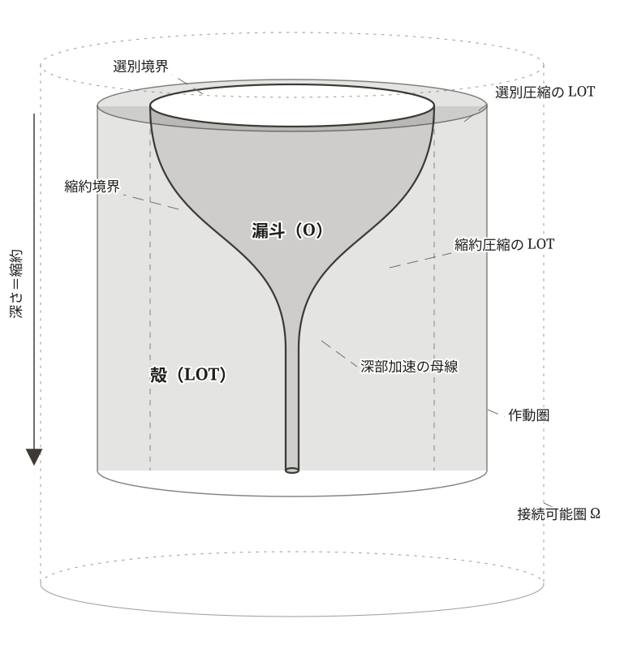

---

## §17-4　出力の幾何——殻の容積と折り目 

### 文明の出力と殻の容積——同強度の関係

ここまでの構造を、漏斗モデルの幾何で読み直すと、一つの関係が見える。

文明の出力は、漏斗の内側の容積ではない。漏斗のなかに量が詰まっていて、それが出てくるのではない。出力を決めるのは、急峻な傾斜と大量の流れ——縮約境界の急峻さと、選別境界から流れ込む F の量——の積である。

この積のうち、深さが動かすのは傾斜の側である。漏斗が深く彫られるほど、壁は内へ折れ、有効勾配が急峻に立ち上がる。そして同じ彫り込みが、中核命題-1 によって LOT を副生する。深く彫るほど、殻の肉厚は増す。**深さの軸で見るかぎり、出力の規模と殻の容積は、同じ一つの彫り込みから同じ強度で増える**。

だから殻の容積は、出力の規模を外から読む幾何的指標になる。**ただし、指標は源ではない**。仕事を生むのは残された有効勾配であって、捨てられた可能性ではない。殻は、その勾配を立てた操作の副生として、同じ強度で膨らんでいるにすぎない。機構として書けば有効勾配、幾何として読めば殻の容積——同じ一つの構造の、二つの読みである。

### 漏斗の側面壁——深部加速の凹曲線

漏斗の側面壁——縮約境界——は、まっすぐな円錐ではない。上面近くではゆるやかに内へ傾き、中深部で急峻に折れ、深部は細く絞られた一筋の幅を保って深まる。本書はこの輪郭の形を**深部加速の凹曲線**と呼ぶ。幾何の語では、この輪郭を描く線を漏斗の**母線**と呼ぶ。

これは、「急峻な傾斜」の姿である。多段の圧縮を積み重ねるほど、有効勾配は加速度的に急峻化する。

この曲線は、殻の側から見ると別の相貌をとる。どの深さでも、作動圏の断面は同じ大きさである。変わるのは、その断面を漏斗と殻がどう分けるかだけである。上面近くでは、殻は漏斗を取り巻くリングとして回っている。中深部で縮約境界が急に折れると、漏斗の取り分は一気に減り、減った分をそのまま殻が引き取る。深部では、漏斗は一筋の細さで残るだけで、断面のほとんどすべてが殻になっている。同じ深さだけ彫り進めるごとに、殻に回る量は前より多い。**漏斗の内部は加速度的に細くなり、殻は加速度的に膨らむ**。

側面壁には、勾配がはっきり変わる位置——**折り目**——がいくつかある。折り目を越えるたびに、加速の度合いが一つ強くなる。

では、この深さは、何でできているのか。折り目の数だけ、何かが積み重なっている。その正体を、「参照されるから、存在する」（第18章）が内側から開く。

---

# 第18章　参照されるから、存在する——多段圧縮と参照系 

自分では理論を導出できないままでも、相対性理論を正しいと信じている。読んだことのない条文に、従っている。誰かの確かめを信じて、確かめずに知る。この足場を、私たちは「社会的既知感への信認」（第10章）で自分のものとして認めた。あの委譲が、本章に戻ってくる。

「文明の出力の幾何」（第17章）が取り出した幾何では、漏斗は深部へ向かうほど急峻に絞られ、側面壁には、勾配の変わる折り目が刻まれていた。では、この深さは、何でできているのか。答えの糸口は、いま思い出した足場にある。深さを継ぎ足させてきたのは、誰かの確かめへの信頼である。

本章は、この深さ方向を内側から開く。漏斗に流れ込む素材——流動 F——とは何か。信頼は、誰から誰へ、どこまで継がれうるのか。そして段を重ねた先で、参照と存在の因果は反転する。「存在するから、参照される」が、「参照されるから、存在する」へ。

---

## §18-1　F とは何か 

第17章 §17-1 では「大量の流れ」として、§17-4 では「漏斗の上面に流入するもの」として、F はすでに幾度も現れてきた。だが、F の正体——F は何で、どこから来るか——は、まだ取り出していない。**文明レイヤーにとって、F とは何か**。

F が何で、どこから来るかは、第Ⅰ部で取り出してある。**一つの系にとっての Flux は、自系の外で動くものが外へ残し、あるいは送り出したものである**——命題 FLUX-1（「圧縮から創発する世界」第2章 §2-5）。階層が違えば中身は質的に異なるが、構造的位置は同じ——自系の選別構造の外側にあって、自系にとって素材として作動するもの。

F の存在は、選別構造の対称性破れ（第15章 §15-1〜§15-2）の裏面である。各系が選別構造で世界を切り取ることで、外側に F が立ち上がる。F がなければ、選別構造は自らの出力だけを循環させる閉じた系になる。文明レイヤーにとっての F の中身は——自然界の作動の残余、他の文明、過去の文明、他の主体（多段圧縮構造の λ₀ の主体を含む——詳細は §18-2）。

そして、この中身の列挙は、文明が F の供給源を求めうる三つの方向を予告している。同時代の他者の選別構造へ（空間）、時間を隔てた世代の選別構造へ（時間）、そして自系自身の内側へ（実存）。それぞれの方向で供給がどう立ち、その作動コストがどこへ転嫁されるかは、本章と第19章の装置を経たのち、「空間的不安定」（第20章）からの三章が正面から開く。

### 文明レイヤーの特殊性——選別構造を改変する能力

文明レイヤーには、他のレイヤーにはない特殊性がある。**選別構造自体を改変する能力**である（「圧縮から創発する世界」第2章 §2-6、第15章 §15-3）。

物理レイヤーでは、選別構造は法則として固定されている。生命レイヤーでは、選別構造は進化を介して可変だが、個体の生涯のうちに動かせるものではない。文明レイヤーでは、表象能力によって、選別構造を生涯のうちに、あるいは対話の場面のうちに、組み替えることができる。

この能力は、F の取り扱いにも特殊性を生む。

### 自己 Stock を F として利用するモード

生命にも、自己 Stock を F として一時的に利用する前駆系がある——体内に蓄積した脂肪を燃やす、など。だが、生命は遺伝形質で制約されるため、自己 Stock の利用には構造的上限がある。

文明レイヤーは違う。選別構造を改変できるため、**自分自身の排出物（自己 Stock）を F として利用するモードに、構造的上限なく入れる**。生命の前駆系と文明の本格的なモードのあいだに、量的差異が質的差異を生むスペクトル的な構造がある。

これは、自己言及相（§18-4 で詳述、「知識の重さ」第9章 §9-3）の起源である。動いている系一般がもつ内部連鎖と緩衝（命題 FLUX-3、「圧縮から創発する世界」第2章 §2-5）が、文明レイヤーで極限化した相にあたる。文明が選別構造を深く積み上げると、自分の排出物を F として認識して、自分自身に流し戻すモードに入る。F の本質「別の選別構造の残余」が、自分自身の前段の選別構造の残余に置き換わる。表象能力が、自分の出力を「別物」として認識する能力を提供する——だから自分の出力を F として扱える。

### F のコスト転嫁——他者の選別構造の作動コストを肩代わりさせる

文明レイヤーが F を得るとき、別の選別構造が作動している。その作動には、コストがかかる。

ここに、文明レイヤー固有のもう一つの構造が立つ。**自系にとって必要な F の供給のために、他者の選別構造を利用し、F 供給のための作動コストを肩代わりさせる**。これが、維持コストを他の主体へ移す操作（コスト転嫁、「圧縮から創発する世界」第2章 §2-6）を、F の側から見た姿である。

文明が自然界から F（資源、エネルギー、生態系サービス）を得るとき、自然界の選別構造が F を生成する作動コスト（生態系の維持、土壌の生成、気候の安定）を、文明は払わない。自然界に作動コストを肩代わりさせている。

保つコストの転嫁（命題 FUNNEL-1、第17章 §17-2）は、F 供給コストの転嫁と接続する。両者は文明レイヤー固有の同型現象として現れる。

---

**命題 FUNNEL-2（転嫁同型の根拠）【意識・文明レイヤー】**

> 保つコストの転嫁と F 供給コストの転嫁が文明レイヤー固有の同型現象として現れるのは、両者がともに接地コストの転嫁だからである。保つコストの転嫁は自系の接地コストを、F 供給コストの転嫁は下位系の接地コストを、それぞれ払わずに済ませる——同じ接地コストという量が、自系の側と下位系の側という異なる場所で、払われないまま残る。

---

## §18-2　多段圧縮構造の階梯——λ₀ から λ₄ へ 

漏斗モデルの基本形は、接続可能圏 Ω の内部に、作動圏・漏斗・殻の幾何を、ある選別構造の立ち上がりとして描いた。だが、文明の作動のなかで漏斗は、一つだけ立ち上がるのではない。**選別構造が立ち上がると、その出力が次の段の選別構造の素材になる**——これが多段圧縮構造の入れ子構造である。

本書がこれまで別々に立ててきた装置——神話的MANES（「神話的MANES」第8章）、SFOK（「社会的既知感への信認」第10章）、知識ストック（「知識の重さ」第9章）——は、多段圧縮構造の階層として読むと、一つの構造の異なる段階として現れる。

選別構造の出力が次の段の素材になるこの入れ子は、**多段の縮約**の、段と段を表象による信頼でつなぐ文明レイヤー固有の現れである。本書はこの多段構造を**展開実現帯域 λ** と呼び、その内部の段階を **λ₀・λ₁・λ₂・λ₃** と記す。段の列は、この四つで閉じない。展開実現帯域 λ は、文明が実際に展開し実現した帯域——接続可能圏 Ω の内部で、選別構造が現に立ち上がっている範囲——を画する。λ₀–λ₃ はその内部構造であり、F からの距離に応じた同心的な層をなす。

この並びは、第Ⅱ部で装置を解剖した章の順とは一致しない。章は装置ごとの解剖の順で並び、段は F からの距離の順で並ぶ。人への信頼（SFOK）の産物が固定されて、はじめて外部の蓄積（知識ストック）が立つ、という生成の順である（本節後半・参照化と蓄積化の交代）。そして、第Ⅱ部の第四の装置——「未来への希望」（第11章）——は、この階層に独立の段を持たない。F からの距離を新たに開く装置ではなく、λ₁ が開く世代軸の連なりを、未来の側へ走らせる時間方向の作動だからである。三つの装置が段を立て、第四の装置が、段の上を時間の向きに走る。この作動の中身——前借りとその転嫁——は、「時間的不安定」（第21章）が運用する。

ここに、本書の核心構造が一つ立つ。**展開実現帯域 λ が、創発可能帯域 HZ に収まるとは限らない**。文明は展開し実現する（λ）。だが、その展開が動的安定の帯域（HZ）に収まる保証はない。収まるための構造条件を探ること——これが本書の問いの帯域的定式化である。

各段階で扱う F は、**F の定義（F は別の選別構造の残余）** に一貫して従う。λ₀ では物理・化学・生命レイヤーの残余に直接接地し、λ₁ では共同体が同じ F を追体験し、λ₂・λ₃ では λ₀ の主体の FOE を信頼することで間接的に別のレイヤーの残余に接続する。F の供給源の位置（外部の別の選別構造か、自系の前段の出力か）が、健全な段階と自己言及相とを分ける。

### λ₀（第一段階）：個の F-E 接地

最初の段階は、個の主体が F に直接接地する作動である。

個の E が F に接触する。E が仕事を投入する。その結果、O として**再現可能な選別構造（勾配）** が形成される。「再現可能」とは、一回限りの試行ではなく、操作として繰り返し作動できる構造として固定されることをいう。E が立てたものが、O のレパートリーとして固定される。

これが「立てるコスト」の初期形態である。F-E 接触から、E の仕事の投入を経て、O が立ち上がる。

身近な事例として、個人の身体・経験のなかで動いている可能性の流動を、特定の動き方・判断・手順として圧縮する作動がここに位置する。技能の獲得、習熟、専門能力の身体化——いずれも、個の F-E 接地から立ち上がる λ₀ の例である。

λ₀ の漏斗の殻には、「他の動きにもなりえた可能性」「他の判断にもなりえた可能性」が落ちる。だが、λ₀ では、E が立っている範囲で「F-E か --E」の区別が立つ——F の現実への接地が、E の側に保たれている。

### λ₁（第二段階）：共同体の F 追体験

次の段階は、共同体としての E が、同じ F に接触する作動である。ただし、共同体の各成員は、独力で F に接地するのではない。**λ₀ の主体に導かれて、同じ F を追体験する**——物語を共有し、儀礼を共にし、場所に立つ。各人が個別に F に接触する経験を経て、それぞれに O を形成し、共同体の選別構造が拡がる。

これが、「神話的MANES」（第8章）の構造である。「神話的MANES」（第8章）は、神話を機構として保持し、機構として継承する人間のあり方を取り出した。苦悩・憧憬・希求・好奇心の社会的外部化と、連なりの中の信が、世代を越えて引き渡されていく装置である。同章 §8-5 末の言葉でいえば、これは**滲みを保つ運び方**である——「物語を語り、儀礼を共にし、場所に立つ、その都度の身体を要する」運び方。

λ₁ では、共同体の各成員が F に接地する経験を経るため、F の質感が保たれる。「F-E か --E」の区別が、共同体のなかで立つ。これは**世代軸方向**の「我ら」の拡張である——過去の主体から、現在の主体へ、未来の主体へ。

なお、λ₁ は**委譲なしの媒介**という中間の性格を持つ——各成員は F を自ら追体験するが、λ₀ の主体の導きという媒介を経る。錨泊FOE の核をなすのは λ₀ であり、λ₁ は媒介の初段にあたる。

### λ₂（第三段階）：λ₀ の FOE への信頼

第三段階は、F の追体験を**省く**ことから始まる。

共同体の E が、λ₀ の主体の FOE を**信頼する**。信頼することで、F の追体験を省きながら、共同体の選別構造を形成する。これが「**信じることのラベル化**」——**SFOK**（「社会的既知感への信認」第10章）——の構造である。

「社会的既知感への信認」（第10章）は、SFOK を三成分（索引・要約的判断・価値ラベル）として取り出した。共同体の各成員が、知識ストックの内容を直接保持しているのではなく、ラベルを共有することで、巨大な選別構造を共同体のなかで運用する装置である。

λ₂ は、**社会軸方向**の「我ら」の拡張である——同時代の他者へ、共同体の境界の外へ。

λ₂ では、F の追体験は省かれる。だが、λ₀ の主体の FOE が、共同体のなかで信頼されているかぎり、F の質感は——直接的でなくとも——保たれる。

### λ₃（第四段階）：λ₂ の FOE への信頼

第四段階は、λ₂ の FOE を、さらに信頼する作動である。

λ₂（SFOK の網）のもとで立ち上がった選別構造を、F の追体験を省いたまま、固定化された記録として外部に物質化する。これが「**信じたことの沈殿**」——**知識ストック**（「知識の重さ」第9章）——の構造である。「神話的MANES」（第8章 §8-5）末の言葉でいえば、これは**滲みを捨てて記録に固定する運び方**である。「読み返されなくても累積し、自走する。意味は…操作可能な構造の側へ移っている」運び方。

λ₃ は、**累積軸方向**の「我ら」の拡張である。個別の身体・経験から離れて、固定化された外部知識ストックとしての厚みを獲得する。

λ₃ では、F の追体験は完全に省かれ、信頼の対象が λ₀ ではなく λ₂ の FOE になる。信頼の信頼。F からの距離が、λ₀ → λ₁ → λ₂ → λ₃ と段階的に離れていく。

### 段の列は、四で閉じない——参照化と蓄積化の交代

λ₀ から λ₃ まで、F からの距離は段階的に離れてきた。列は、ここで尽きるのか。

段を継ぎ足すのは、原理ではなく圧力である。振り返れば、λ₁ から λ₃ への推移は、二つの作動の交代として進んでいた。直接の関与が帯域（「ホモ・デウスとホモ・マネス」第7章）を超えるとき、関与そのものに代えて軽い参照の層が立つ——**参照化**（λ₂。人の FOE への信頼、SFOK）。参照の産物が身体と経験から切り離されて固定されるとき、蓄積の層が立つ——**蓄積化**（λ₃。外部知識ストック）。

そして蓄積は、それ自体が参照不能な重さに達する。参照を阻む三重の障壁が積み上がり、整合化計算が爆発する（「知識の重さ」第9章）。ストックが参照の臨界を超えるとき、次に信頼されるのはストックそのものではない。ストックを参照可能にする層である。

### λ₄（第五段階）：SFOK参照系への信頼

λ₁〜λ₃ が世代・社会・累積の軸へ「我ら」を広げる段だったのに対し、λ₄ は新しい軸を開かない。広がりを参照可能なまま保つ段である。第五の段階は、λ₃ の蓄積そのものではなく、蓄積を参照可能にする層を信頼する作動である。本書はこの層を **SFOK参照系**（SFOK reference layer）と呼ぶ。

蔵書が一人の読み手の生涯を超えたとき、人は書物ではなく、目録を引くようになる。索引、要約的判断、価値ラベル——λ₂ で人に向けられていた SFOK の三成分（「社会的既知感への信認」第10章）が、ここでは蓄積へ向け直され、制度の規模で固定される。名が SFOK を冠するのは、この系譜による。目録は、書物への参照を軽くする。そして、目録に載らない書物は、書庫に在りながら、読まれる世界から消える。

λ₄ の萌芽は、蓄積のあるところに古くからある。構造として新しいのは、参照の**支配的な経路**が SFOK参照系の側へ移ることである——蓄積に触れる参照のほとんどが、参照系を経由してしか起こらなくなった状態。「我ら」の規模と時間を広げるほど、保つべきストックは参照の臨界を超えて厚くなり、この移行は避けがたくなる。どの規模がどの深さを要るかは、第Ⅴ部のバインドとともに立てる（『どこまでが「我ら」か』第24章）。

λ₄ が担うのは、臨界を超えた蓄積のうえで、三つの軸の広がりを参照可能なまま保つことである——広げる段ではなく、広がりを保てるようにする段。だからこの段の破れは、広がりの破れではなく、参照可能性そのものの破れとして現れる。λ₄ が壊れるとき、三段の反転が順に乗る。存在判定の縁がずれ（縁の同一視、FUNNEL-3）、錨が参照可能性へ打ち直され（錨の打ち直し、FUNNEL-4）、供給が参照系へ捕獲される（非対称性への捕獲、FUNNEL-5）。

参照化と蓄積化の交代は、さらに続きうる——SFOK参照系そのものが蓄積されれば、それへの参照系がさらに立つ（λ₅）。段の列に、原理的な終端はない。あるのは、本章の終わりに見る極限相（§18-4）だけである。

なお、第17章 §17-4 で幾何的事実として置いた**折り目**——側面壁の勾配が変わる位置——は、この生成の痕跡である。折り目の数は原理の定数ではなく、当該の文明がどこまで段を継ぎ足したかという、歴史の変数である。段が深まるほど、F から返る応答は連鎖を長く遡って届く。フィードバックの時間スケール（「圧縮から創発する世界」第2章の三条件の第三）は、段の深さとともに引き延ばされる。

[図18-1：母線の深部加速凹曲線と折り目——深さは展開実現帯域 λ の段に対応する。各段は前段の出力を素材にさらに縮約するため、縮約の率は段ごとに掛け合わさり、幅は乗算的に細って、漏斗の先は非線形に鋭くなっていく。折り目は段の境界の痕跡であり、その数は歴史の変数である]
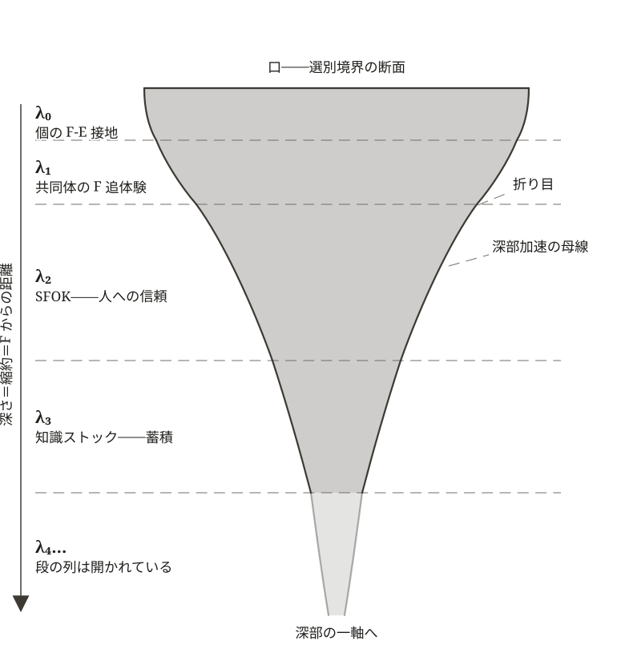

### 「実存的我ら」の射程と F の質感——「我ら」内の F 接地者

λ₂ 以深の段階で、F の追体験は省かれる。各成員（「我」）は、自分自身で F に接地しているのではない。別の誰かの F との直接接地から得た FOE を信頼することで、間接的に F に接続している。だが、これらの段階で **F の質感が保たれるか否か**は、共同体としての「実存的我ら」のなかに、**現に F と接地している主体（λ₀ の主体）が含まれているか**に依存する。

F・O・E の有無を三位置で表す FOEモデルの記法（「不等式の動性」第16章）でいえば、「F-- か ---」（現に流動する可能性のフロンティアか、何もない外側か）の区別は、それ自体としては立たない（命題 FOE-8「引受の外の不可知」、第16章 §16-6）。立つのは「F-E か --E」——E が立っている範囲で、E が手を伸ばしている対象が現に F に接触しているか、空振りか、の区別である。

これを共同体の「我ら」に適用すると、次の構造が見える：

- **「我ら」内に F 接地者がいる**：λ₂・λ₃ で各成員（「我」）が F の追体験を省いていても、「我ら」のなかに λ₀ の F-E 接地を保つ主体が含まれているかぎり、共同体としての E は外部の F（別の選別構造の残余）と接地している。「F-E か --E」の区別が、共同体のなかで立ちつづける。F の質感は——個々の「我」にとっては直接的でなくとも——「我ら」としては保たれる。これが λ₁ 以深の**健全形態**である
- **「我ら」内の F 接地者が失われる**：「我ら」のなかに λ₀ の F-E 接地者がいなくなったとき、信頼の連鎖だけが伸びる。「F-E か --E」の区別が立たない。F の質感を失う——これが λ₁ 以深の**病理形**である

つまり、λ₂ 以深の段階自体が、「我ら」内の F 接地者の有無で別の構造になる。同じ段階のうえで、健全形態と病理形が並走する。

「実存的我ら」がどこまで届くかは、**E 側に依存**する構造である。漏斗の深さで自動的に決まらない。漏斗が深く彫り込まれた段階でも、「我ら」内に F 接地者が残っているかぎり、F の質感は保たれる。F 接地者が「我ら」から失われたとき、構造はやがて自己言及相——本章の終わりに見る極限相（§18-4）——へ滑り込む。だがその前に、λ₄ が固有に持ち込む機構がある。

---

## §18-3　参照系の三つの反転 

### 縁の同一視——SFOK参照系の縁は、Ω の縁ではない

本書は第2章で、存在を操作的な条件——区別可能性と再同定可能性——から扱ってきた（§2-1）。λ₄ 以深では、この判定の実務が SFOK参照系に委譲される。文明の規模で「区別され、再同定される」を執行するのは、参照系である。

ここに、λ₃ 以浅には存在しなかった縁の同一視の構造が生じる。参照系の縁は、O の作動に依存して日々動く、可動的な境界である。接続可能圏 Ω の縁は、O の被覆からも引受 E からも独立の地形である（第17章 §17-3）。この二つの縁が、同一視される。参照系に載らないものが、「参照されていないもの」ではなく「存在しないもの」として扱われる。LOT は、参照不能の領域から、無へと書き換えられる。

縁の同一視は、怠慢の産物ではない。参照の実務のすべてが参照系を経由する系の内側には、「載っていない」と「無い」を区別する契機が、フィードバックとしては与えられない。区別は、構えとしてしか保たれない——この構えの名は、すでにある（対称性志向、第8章）。

縁の同一視は、健全形態の判定そのものにも及ぶ。λ₃ 以浅では、「我ら」の内に F 接地者が生きていることが、F の質感を保つ条件だった。λ₄ では、それだけでは足りない——参照系が、その接地者への参照を保っていることが要る。生きて接地する主体も、参照系から落ちれば、連鎖にとっては居ないに等しい。

---

**命題 FUNNEL-3（縁の同一視）【意識・文明レイヤー】**

> λ₄ 以深では、操作的な存在判定（区別可能性・再同定可能性）の実務が SFOK参照系に委譲され、O 依存の可動境界である参照系の縁を、O から独立の地形である Ω の縁と同一視することが、構造的な既定値として生じる。区別は、フィードバックからは与えられず、構えとしてしか保たれない。

---

### 錨の打ち直し

縁の同一視のうえに、もう一段の反転が乗る。

MANES の第二層は報酬関数である（「MANESの三層」第6章）。λ₄ の内側では、F の応答は連鎖を長く遡って、遅く、重く届く。SFOK参照系の応答は、速く、軽く届く。報酬関数が現に観測できる勾配は、参照系の側で立つ。錨は、勾配の立つ方へ引かれる——存在意義の錨が、F との接地からではなく、参照系における可視性から打ち直される。

因果が反転する。「存在するから、参照される」が、「**参照されるから、存在する**」へ。「意味があるから、参照される」が、「参照されるから、意味がある」へ。

---

**命題 FUNNEL-4（錨の打ち直し）【意識・文明レイヤー】**

> 縁の同一視のもとで、存在意義の錨（MANES 第二層・報酬関数）は参照可能性へ打ち直される。存在と参照の因果は反転し、SFOK参照系における可視性が報酬の頂点に立つ。

---

### 非対称性への捕獲——委譲が転じるとき

再錨着した選別構造に、何が起こるか。

報酬の終端が F から SFOK参照系へ移った構造は、供給を参照系の基準へ最適化しはじめる。F に向けて産出されていたものが、参照系に向けて産出される。供給の自律性は縮減され、F の位置には、参照系の形をした残余が流れ込む。本書はこの引き込みを**非対称性への捕獲**（capture into asymmetry）と呼ぶ。

「非対称性」は、関係の形容ではなく、因果の語である（中核命題-4「非対称性因果の局所性と回収断絶」、第17章 §17-2）。捕獲とは、フィードバックの回路が現実の応答から代理の応答へ付け替えられ、実際の帰結が回収断絶の側へ積もりつづける配置——非対称性因果の局所ループ——への引き込みである。積もった帰結は、消えない（第17章 §17-2）。

委譲そのものは、病理ではない。λ₂ 以深の全体が委譲で立っており、それはこの多段構造の生命線である。判別は、終端にある。**委譲が健全であるのは、フィードバックの終端がなお F にあるあいだである**——信頼の連鎖のどこかが、現に F に接地している。終端が参照系そのものへ移った時点——基準を満たすことそれ自体が、報酬の頂点になった時点——で、委譲は捕獲に転じる。

捕獲に抗う構えが、対称性志向（第8章）である。報酬の勾配は、参照系の側で立つ。対称性志向は、その勾配に逆らって、参照されていないもの——LOT——の側へ、Ω 全体への接続を保とうとする。勾配に逆らうことは、仕事を要する。この仕事が内側からどう負われるかは、第Ⅴ部が引き受ける（『「我ら」を引き受けるとは何か』第23章）。

そして捕獲は、集積する。捕獲された構造が増えるほど、系全体の入力に占める F 由来の割合は下がる——誰の企図もなしに。

---

**命題 FUNNEL-5（非対称性への捕獲）【意識・文明レイヤー】**

> 報酬の終端が F から SFOK参照系へ移った選別構造は、供給を参照系の基準へ最適化し、供給の自律性が縮減される（非対称性への捕獲）。捕獲は非対称性因果の局所ループへの引き込みであり、その帰結は回収断絶の側へ積もりつづける。委譲と捕獲を分けるのは、フィードバックの終端が F にあるか、参照系にあるかである。

---

## §18-4　深さの極限——自己言及相 

### 段の深さと閉包度は独立の二変数

**段の深さ**——どの型の対象を信頼しているか（λₙ）——と、**閉包の度合い**——入力がなお外部の F に由来しているか。両者は独立である。どの深さの段も、「我ら」の内に λ₀ の接地が生きて保たれ、SFOK参照系がその接地を参照可能に保っているかぎり、健全形態を取りうる。深さは、それ自体では病理ではない。

### 自己言及相——「我ら」内の F 接地が失われ、自系の Stock を F として取り崩す

したがって自己言及相は、λ₄ の次の段ではない。**F 由来の入力が零へ向かう極限相**である——係留なき深化と、捕獲の全域化とが、そこへ漸近する。自己言及相とは、捕獲が全域化した相の別名でもある。

なお、F 由来の入力が細っていく系の行き着く先は、自己言及相だけではない。閾値の立ち戻りに遭って崩れる道——頓死——との分岐が残っている。この分岐には、漏斗と F の重なりの幾何が要る（第19章 §19-3）。

「我ら」内に F 接地者が完全にいなくなったとき、構造は質的に異なる相に進む。

ここから先は、外部の F（別の選別構造の残余）に由来せず、自系の選別構造（FOE）の出力を入力にして次の圧縮をする多段階圧縮の段階である。**自己言及相**（「知識の重さ」第9章 §9-3）の構造が、ここに位置する。

「知識の重さ」（第9章 §9-3）は自己言及相を次のように立てた——「多重圧縮の途中段で LEFFLA/LOT 境界が消失し、上位段が中間表象同士の整合のみに依存する状態である。…統合は形式的に維持されるが、その系自身が存続条件として含んでいたはずの外部接地が失われている」。

漏斗モデルの語でいえば、自己言及相とは、F の追体験も、λ₀ の FOE への信頼も、もはや効かなくなった段階である。圧縮の連鎖は続くが、その入力はもはや外部の F に由来しない——FOE の出力が次の FOE の入力になる、入れ子の自己言及。

§18-1 で置いた自己 Stock のモードが、ここで極限化する。自らの Stock を取り崩して立てる勾配は、外部 F に依拠する勾配よりも**鋭く立てる**ことができる。だが、その鋭さの引き換えとして、外部 F との接続が失われる。

### λ₀ の二重性——前駆系と到達点

λ₀ は、多段圧縮構造の**前駆系**である。λ₁ 以深のすべての段階も、極限相としての自己言及相も、λ₀ の F-E 接地が立ち上がった先に開く。λ₀ なしには、他のいかなる段階も立ち上がらない。「未来への希望」（第11章）を含む、本書がこれまで取り出してきた各装置は、いずれも λ₀ の前駆を起点としている。

同時に、λ₀ は、多段圧縮構造の**到達点**でもある。多段の圧縮を経て、自己言及相にまで進んだ系が、再び λ₀ の F-E 接地に戻る——あるいは、保ちつづける——ことが、本書の到達点でもある。詳細は第Ⅴ部に委ねる。

前駆系であり、到達点でもある——λ₀ のこの二重性が、本書全体を貫く構造の一つとして、ここに置かれる。

### 多段の縮約の深度——文明だけが上限を外す

ここまでの多段圧縮構造を、多段の縮約の視点から見直すと、文明レイヤーの深度が例外的であることが分かる。多段の縮約の各段は、前段の残余（F）との再接地を要する。その支払われ方は、レイヤーで異なる。物理・化学のレイヤーでは、接地は法則の側で自動的に成り立つ。生命のレイヤーでは、再接地は淘汰圧によって強制される——各段が現に F と接触していなければ、その段は淘汰される。段を継ぐごとに、次段へ渡せる勾配は、殻を同強度で副生しながら細っていく。だから、生命の多段の縮約は、勾配の枯れる段で止まる。食物網の栄養段が数段で尽きることの構造的な一因が、ここにある。

文明レイヤーは、この強制を外れる。表象能力は、各段が自ら F に接地する代わりに、前段の主体の接地を信頼することを許す。再接地の支払い——接地コスト——を、系は自ら払わずに済ませられる。これにより、生命では枯れる段でも、文明は段を継ぎつづけられる——深度の上限が外れる。

---

**命題 FUNNEL-6（多段の縮約の深度と接地コスト）【階層横断】**

> 多段の縮約は、各段で素材（F）との再接地を要し、段は有効勾配を立てるのと同じ強度で殻を副生して、次段へ渡る勾配を段ごとに細らせる。再接地が淘汰圧に強制されるレイヤー（生命）では、勾配の枯れる段で縮約は止まり、深度は有限にとどまる。文明レイヤーは、表象能力によって再接地を信頼リンクに委ね、接地コストを自ら払わずに接地の出力を享受しうる——これにより深度の上限が外れる。だが払われなかった接地コストは消えず、文明の深い縮約——展開実現帯域 λ——は、その払われなかった接地コストのうえに立つ深さであり、極限が自己言及相である。

---

この命題は、本書の二つの収束が交わる位置に立つ。深度の解放という効率と、F との接触の切断という盲点は、接地コストを払わないという一つの操作の表と裏である。そして払われなかった接地コストは消えず、転嫁先で回帰する。文明の縮約が深いほど、その深さを支える接地コストの不払いは大きい。

深く彫るほど、出力は大きく立つ。そして深くなるほど、参照は軽くなる。目録を引けば書庫が開き、確かめなくても知っていられる。軽くなった参照の上で、ひとりでは決して届かない桁外れの操作能力が、手に入る。深さは、快い。だがその同じ操作が、同じ強度で、参照されない領域——殻——を膨らませ、F との接触を細らせている。「参照されるから、存在する」世界の足元で、参照の届かない領域が育っていく。

では、こうして立てた出力は、何によって保たれ、どの規模まで保ちうるのか。「どの規模まで、保てるか」（第19章）が、殻に走る因果からこの問いを開く。

---

# 第19章　どの規模まで、保てるか——殻に走る因果と構造条件 

文明の出力が立つ場の幾何（第17章）と、その深さを継いできた信頼の段（第18章）は出そろった。残っているのは、三章の入口で立てた問いそのものである——**どの規模まで、保てるか**。本章はこの問いに正面から答える。

ここまでで、彫り込みは深部ほど加速し、報酬の勾配は参照系の側で立っていた。深まりは、それ自体が、λ₀ からの接続を細らせていく。細りの先にあるのは、途切れである。手がかりは、幾何に残っている。作動圏と漏斗のあいだ、O が及ばないまま因果だけが走る殻。そこに何が走っているかを見きわめ、立てた出力が保たれるための二つの構造条件と、現在規模と将来規模を引き離す力を突き止める。

---

## §19-1　作動圏と漏斗型空間の差分——殻に走る因果 

**作動圏と漏斗型空間の差分は何を意味するか**。

### 二重の境界

漏斗モデルの幾何は、二重の境界を持つ。

一つは、**漏斗の壁**——作動圏の内部にあって、漏斗の内側と殻とを分ける境界。O が及ぶ範囲と、O が及ばない範囲とを分けている。上面の楕円が選別境界、側面壁が縮約境界である（第17章 §17-3）。選別境界は、座標系が「これは別ものだ」と分節する縁である（第15章 §15-5）。縮約境界は、取り上げた差異を一つの値に畳む縁である。

もう一つは、**作動圏の外壁**——作動圏の内側と、作動圏の外側とを分ける境界。O の作動が因果を現に走らせている範囲の縁である。

この二つの境界の差分——作動圏内・漏斗外——が殻＝LOT である。

### 漏斗の側面壁は何によって引かれるか——報酬関数の境界

漏斗の側面壁——縮約境界——は何によって引かれるか。

選別構造の三層（座標系・報酬関数・共存条件、第15章 §15-5）のうち、**報酬関数**が漏斗の側面壁の構造基準を与える。報酬関数は、O が取り上げた差異を一つの値に畳む操作の中軸であり、何が「測れる」か、何が「測りきれない」かをそこで分ける。

命題 RETURN-4（第15章 §15-8）を呼び戻そう。

---

> **命題 RETURN-4**：操作の側が立ち上げる接続は、報酬関数で測れる因果しかつながない。

---

漏斗モデルの幾何で読めば——漏斗の内部に残るのは、**報酬関数で測れる因果**である。これらは、即時回収因果（現在 → 現在）として畳まれる。報酬関数で測りきれない因果は、漏斗の側面壁の外側、すなわち殻に走る。遅延回収因果（現在 → 未来）、非線形回収因果（過去 → 現在）、回収断絶因果（現在 → 系外、第15章 §15-7）である。

漏斗の側面壁は、報酬関数の境界である。

### 殻に走る因果は消えていない——因果の連なり

殻に走った因果は、消えていない。失われたのは、当該系の判断回路がそれを参照する経路だけである。

森林を「造船のための材木」として縮約して伐採したとき。殻の中にあった「菌糸の苗床」「生態系を担う」性質は、伐採された時点で消滅したわけではない。森林という素材のなかにあった微生物の生活圏、土壌の循環、林床の生態系——それらは伐採の結果として変化を続ける。土が痩せ、別の地点で森林が立ち上がりにくくなり、流域の水循環が変わる。当該系（伐採した文明）にとっては「捨てた可能性」だが、因果の網のなかでは、それは作動しつづけている。

いま「因果の網」と言った。ここで正式に立てておく。当該系の作動圏は、孤立した立体ではない。系の果は、直接・媒介に接続する系たちの作動圏へ合成されながら走る。流域を変えた水は別の共同体の田を潤しも涸らしもし、痩せた土は次の世代の起動条件を書き換える。この、現に因果を合成しあっている範囲の全体を、本書は**因果の連なり**と呼ぶ。当事者の時間（第15章）とは、この因果の連なりが張る範囲にほかならない。そして円柱（選別の幅×縮約の深さ）が描いていたのは、因果の連なりへの当該系の**接続の口**の断面である。

これが、作動圏と漏斗型空間の差分の意味である。**作動圏に発した因果は、因果の連なりの中を走りつづけている**。漏斗の内側に発したものにも、殻に発したものにも、いずれにも因果は通っている。違うのは、当該系が参照しているか否かだけである。

### 圧縮の二側面の幾何分節——選別圧縮 LOT と縮約圧縮 LOT

第17章 §17-3 で置いた殻の二種を、圧縮の二側面——選別と縮約（「圧縮から創発する世界」第2章 §2-4）——から読み直す。中核命題-1 の幾何的姿が、殻である。その殻が、この二つの機序に分節できる：

- **選別境界の外側** = **選別圧縮の LOT**——O が「これは別ものだ」と分節しなかった領域
- **選別境界の内側で、縮約境界の外側** = **縮約圧縮の LOT**——O が取り上げたが、一つの値に畳むことで潰した差異

両者はともに LOT だが、構造機序が異なる。

### 回収断絶因果の幾何機構

操作の側が立ち上げる接続が報酬関数で測れる因果のみをつなぐとは、漏斗の幾何で読めば、**O のフィードバック経路が漏斗の壁の内側で閉じている**ということである。殻に走る因果は、O の側からは観測される接続を持たない。観測されないまま走りつづけ、累積し、当該系の選別構造の閾値を超えたとき、非線形応報として強制的に立ち戻る。これが**回収断絶因果**（第15章 §15-7）の幾何機構である。

ここで「断絶」されているのは、因果の作動そのものではない。因果は、宇宙論的な地では、走りつづけている。断たれているのは——漏斗の内側にいる当該系の側から、その因果を観測する接続である。

漏斗モデルの二重幾何は、回収断絶因果が立つ場所を、一つの幾何として可視化する。**操作の側の境界（漏斗の壁）と、因果の側の境界（作動圏の外壁）が一致しない**。この一致しなさが、回収断絶因果の素地である。

精密に言えば、ここまでに描いた「観測されないまま累積し、閾値を超えて立ち戻る」経路は、回収断絶の**潜伏**——二つの型（第15章 §15-7）の後者——である。潜伏の果は、殻に発して、因果の連なりの内を走りつづけている。もう一つの型——**真正の断絶**——は、果が因果の連なりの外へ抜けることである。散逸し、接続が絶え、どの系にも合成されなくなった果は、もはや噴き出さない。誰の時間にも返らないまま、地の総返りへ還っていく。

そして、この立体は片側しか見えない。漏斗の壁——参照が尽きる内側の境——は、当事者に引ける。だが、殻に発して因果の連なりへ走り出た果のその先——なお因果の連なりの内を走っているのか、すでに外へ抜けたのか——その境は、当事者には引けない。引くためには、参照の届かない領域を参照しなければならないからである。ある排出が潜伏か真正かの見分けがつかないことと、殻の果てと因果の連なりの外との区別がつかないことは、同じ一つの引けない線である。噴出だけが、事後的に、それが潜伏だったと告げる。

[図19-1：二重の境界と回収断絶因果の幾何——O のフィードバックは漏斗の内側で閉じ、殻に発した果は観測されないまま因果の連なりを走って、閾値を超えて立ち戻る（潜伏）か、連なりの外へ散逸する（真正の断絶）。その境は、当事者には引けない]
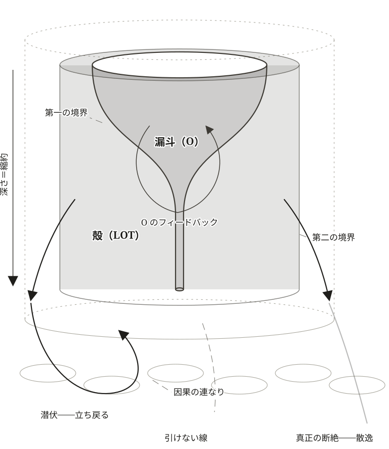

---

## §19-2　O の側からは自己増幅循環を停められない 

### 報酬関数で測れない因果は、フィードバック経路の外に出る

O は報酬関数で動く。報酬関数で測れる因果は漏斗の内側に閉じる。報酬関数で測れない因果は殻に走り、回収断絶因果としてフィードバック経路の外に出る。

この構造のもとでは、**O の側から自己増幅循環を停めることはできない**。中間表象の整合だけに依存して外部接地を失う構造的汚染（「知識の重さ」第9章 §9-3）、批判の側へ負担が偏る批判コストの圧縮（「社会的既知感への信認」第10章 §10-4）——いずれも、その制御に必要なフィードバック経路そのものが、漏斗の壁の外側、殻に走る因果のなかにあって、O の側からは観測されない。

ゆえに O は深まっていく。漏斗は深く彫られていく方向の圧力を、内部からは止めようがない。

### 多段圧縮構造の劣化・病理モードと折り目

多段圧縮構造（λ₀〜λ₄、および極限相としての自己言及相）は、ここで一段精密化される。

λ_n が深まる過程は、**劣化・病理モード（「知識の重さ」第9章・「社会的既知感への信認」第10章）の幾何的姿**である。漏斗の側面壁が深部加速の凹曲線をとり、折り目を持つのは、各段で中核命題-1 が累積的に作動し、自己増幅循環（構造的汚染、批判コストの圧縮）が層を厚くするためである。

折り目の本性は、**「健全→病理の境界」** にある。「我ら」内に F 接地者が含まれるか否かが分かれる境界である。第18章 §18-2 の観察が、ここに位置する——「λ₂ 以深の段階自体が、『我ら』内の F 接地者の有無で別の構造になる」。

しかし、圧力は極めて強力である。自己増幅循環、批判コストの圧縮、外部知識ストックの臨界で参照が困難になる三重の障壁（「知識の重さ」第9章 §9-4）、整合化計算の爆発（同章 §9-2）が、重なって働く。そのため事実上は、「段の境界」（λ_n の遷移）が「健全→病理の境界」を支配的に規定する。

### O の深層加速を停める構造条件

報酬関数の論理の内部では、O は深まっていくほかない。では、O の深層加速を停めるための構造条件は何か。

漏斗モデルの幾何で読めば、構造条件は次の二つに分けられる。

- **被覆条件**——「我ら」の被覆（E の射程・輪郭）が、漏斗の深さに及んでいること。漏斗がどれだけ深く彫られても、その深さが「我ら」の被覆の内に収まっているかぎり、F 接地は保たれる
- **接地条件**——漏斗の深部に、現に F に接地する主体（F 接地者）が生きて保たれていること。深さに依らず、F 接地者との接続が「我ら」の内に保たれる

両方とも、報酬関数の論理（O）の外側から、E の側が課す作動である。**係留**（「不等式の動性」第16章 §16-4）——E が O の最適化に項として入る作動——の、漏斗の深さ軸での二つの面にあたる。

O の深層加速を停める構造条件は、被覆条件と接地条件である。そのいずれも O の内部には存在しない。なお、この二つの条件は、束ねられた「我ら」の水準で立つ条件である。被覆も接地も、どの成員の内部にも、単独では存在しない。第16章 §16-1 が畳んだまま進むと標した縫い目が、ここにも走っている。

---

## §19-3　漏斗モデルにFとEを重ねたときに何が見えるか 

漏斗モデルは、O 軸の立体化——O の深さ方向の構造——を取り出す装置であった。**FOEモデル**（「不等式の動性」第16章）は、F・O・E の三項を平面で表現する装置で、八つのセル（FOE・FO-・F-E・F--・-OE・-O-・--E・---）として文明相のスナップショットを描いた。

漏斗モデルが FOEモデルに付け加えるのは、**O の深層での急峻な縮約選別**がもたらす構造である。FOEモデルは平面の射影像なので、O が深さ方向で多段に縮約する構造は、平面上には現れない。漏斗モデルは、その縮約の幾何を母線の凹曲線として可視化する装置であった。平面 FOE 図では同じセルとして見える領域が、漏斗の深さ方向で見ると別の様態を見せる。これが、漏斗モデルが追加で見せる領域である。

両装置を重ねたとき、漏斗の内部に**二つの問題領域**が浮かび上がる——F が届かない領域と、E が届かない領域である。両者は被覆条件と接地条件（前者＝E の被覆が漏斗の深さに及ぶ／後者＝深部の F 接地が生きている）が満たされていない領域として現れる。

### F の流入経路——作動圏の上面の局在領域

F とは、自系の選別構造の外側にあって、自系にとって素材として作動するものであった。この定義を漏斗モデルの幾何で読むと、F は**自らの軸（別の選別構造から来る軸）を持つ独立の三次元領域**として存在し、その一部が作動圏の上面と交差して漏斗の内側へ流入する。現実座標系の幾何（「不等式の動性」第16章 §16-1）で F が Ω 内の局在領域（多角形）として描かれるのは、FOEモデルの二次元射影のうえでの表現である。漏斗モデルの立体化のうえでは、F はこの局在領域が自らの軸方向に延びる三次元の領域として現れる。

ここで「上面」は、第17章 §17-3 の二層円柱構造のうち**作動圏の上面**である。接続可能圏 Ω の上面はさらに外側にあるが、Ω のうち O がまだ及んでいない領域には F は届いていない。O が被覆を広げて新たな素材に手を伸ばせば、作動圏が Ω のなかで拡大し、漏斗の上面に流入する F の領域も広がる。

漏斗の上面で漏斗の内側に流入する F の量は、O の被覆範囲——作動圏の底面積——に応じて変動する。F の規模そのものは O と独立に変動するが（命題 FOE-1）、O の被覆が広がれば、その被覆と F の三次元領域とが重なる範囲（**FO-** または **FOE** セル）が増え、漏斗の内側に流入する F の量も増える。

F 自身は O の多段の縮約に影響されない——F・O・E はそれぞれ独立に動く（命題 FOE-1）。深部で消えていくのは F そのものではなく、漏斗が狭まるにつれて F と漏斗の内側との重なりが幾何的に減り、F が FOE・FO- セルから F-E・F-- セルへと位相をずらしていく——という意味である。

F の流入は、素材の供給であると同時に、選別構造への作用でもある。流入した F は自系の Stock の組成を変える。組成が変われば、何を関係するものとして前景化し、何を背景に沈めるかという選別の有効性が組み替わる（「LEFFLAとLOT」第3章 §3-2）。**漏斗の形は、内側から彫られるだけではない。**そして、その F を送り出す側の作動もまた、自系が殻に走らせた因果によって書き換えられている（§19-1）。系は、自らが書き換えた世界から素材を受け取り、その素材によって形を変えられる。

[図19-2：基本図に F を重ねた派生像——F は自らの軸を持つ独立の三次元局在領域として、作動圏の上面と交差する部分が漏斗の内側へ流入する。浅い領域では口が F に広く浸かるが、急峻に絞られた深部では直接の重なりが尽きる。殻の「?」は参照不能の差異、右端のゲージは頓死リスク]
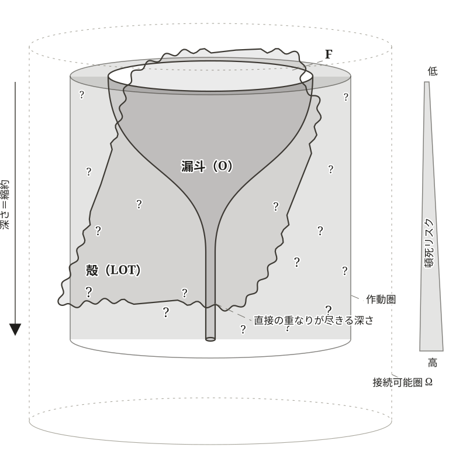

### 重なりは保証されない——頓死リスクの四つの幾何

図19-2 の幾何は、もう一つの構造的事実を運んでいる。浅い領域では、漏斗の口は F の只中に広く浸かっている。口の幅は F のずれを幅のうちに吸収する——追随の余地が広い。だが漏斗は、深部へ向かうほど急峻に絞られる。多段の縮約を経た深部は、細い一筋の彫り込みとして F の縁に接するだけになり、ある深さで直接の重なりは尽きる。深い段が F に直接触れないこと自体は、病理ではない。λ₂ 以深の段は F の追体験を省き、信頼の連鎖で λ₀ の接地へ継がれている（第18章 §18-2）。だが裏から言えば、多段の全構造の接地は、浅部の広い重なりに懸かっている。

この接触がどう剥がれうるかを、四つの幾何が重ねて用意している。

- **見えない F の推移**——F は自らの軸で流れる（命題 FOE-1）。漏斗との重なりは保証されておらず、重なりの外で F がどこへ向かいつつあるかは、F-- と --- の区別が立たない（命題 FOE-8）。しかも F の進路は、系の外から一方的に与えられるだけではない。系が殻に走らせた因果が、因果の連なりを経て、F を送り出す別の選別構造たちの作動を書き換えていく（§19-1）。殻は参照不能であり、重なりの外は判別不能である。重なりの推移は、二重に見えない。
- **O からは見分けのつかない後退**——重なりの内側にも、別の見えなさが走っている。報酬関数で測れない差異は殻に走る（命題 RETURN-4）。とりわけ、いま流入している素材が、流れつづける F（FO-）なのか、更新されない Stock の費消（-O-）なのかの区別は、E の被覆が伴わないかぎり立たない（可視性命題（FOE-10）、「不等式の動性」第16章 §16-6）。F が退き、足下が Stock の掘り崩しに置き換わっていても、O には同じに見える。
- **E の伴いの痩せ**——浅い領域では、個々の E が F への直接接地を試みるかぎりで、係留（同章 §16-4）が重心を FOE に保つ仕事をしている。だから浅部は、独立に動く F への追随の余地が広い。深い領域では、E が伴いにくい——被覆条件が、深さとともに満たされにくくなる（§19-2）。係留を欠いた深部は、F のずれに気づく回路も、引き戻す作動も持たない。深部に E を伴わせる道があるかは、第Ⅴ部の主題である。
- **O の急峻さの代価**——多段の縮約が進むほど、有効勾配は急峻に立ち、漏斗は細く絞られる（第17章 §17-1、§17-4）。急峻に立った構造は、それ自体が動かしにくい。F が見えていてさえ、細く絞られた深部を F の動きに合わせて彫り直すことは、新たな立てるコストの投入に等しい（第17章 §17-2）。見えていなければ、なお難しい。浅い口が幅で吸収していたずれを、深部は吸収する幅を持たない。

四つの幾何は、同じ一つの帰結へ合流する。深く彫るほど、残されている軸は細り、殻は同じ強度で膨らみ（中核命題-1）、E は伴いにくくなり、勾配は動かしにくくなる。F のわずかなずれが、細った接触を剥がす。剥がれたとき、応じ直すために要る差異——F の新しい進路を読む軸、別の素材を扱う軸——の多くは、すでに殻の側に落ちている。そして、殻に落ちた差異のうちどれが系の生死を分けるものだったかは、事前に特定できない（図19-2 の「?」）。だから、この崩れは、予兆の列としてではなく、閾値を超えた事後として届く（非線形回収因果、第15章 §15-7）。参照不能域に落ちた差異が、系の自己保持に必要なものを含むにいたる。この予兆なき崩れが、頓死である（「LEFFLAとLOT」第3章 §3-4）。頓死のリスクは、殻の容積とともに非線形に増大する。深い漏斗は、より大きな出力を立てながら、より小さな F のずれで崩れる位置に立っている。

重なりを失った漏斗の先は、一つではない。自系の Stock を疑似 F として回しながら、形式的に走りつづける道がある（自己言及相への滑落、第18章 §18-4。疑似 F は「空間的不安定」第20章）。要の軸を欠いたまま、閾値の立ち戻りに遭って崩れる道がある（頓死）。前者は後者の回避ではなく、多くの場合その延期である。Stock は更新されず（命題 FOE-9、第16章 §16-6）、掘り崩しはいずれ尽きる。そして、どちらへ分かれるかを O の内部から選ぶことはできない。O に見えているのは、漏斗の内側だけだからである（§19-1）。

なお、第16章 §16-7 が辿った頓死の経路——係留の放棄が、短期の優位と頓死の傾向として同時に現れる軌道——は、FOEモデルの平面のうえでの記述であった。本節の四つの幾何は、その深さ軸での対応物である。二つの射影は、同じ一つの帰結——系は、自らの盲点によって崩壊しうる——へ、別の軸から到達する。

### E の射程——漏斗の壁の外側へ及ぶ輪郭

E は**漏斗の壁の外側にまで及ぶ輪郭**として現れる。「不等式の動性」（第16章 §16-1）で E は「引受の輪郭」「いま現に引き受けられている範囲」として描かれた。漏斗モデルの幾何のうえで、E は漏斗の壁を越えて殻の方向へ延びる範囲——E が引き受ける可能性が、漏斗の外側にも届く範囲——を画する。

**係留**（同章 §16-4）——E が O の最適化に項として入る作動——は、漏斗モデルの幾何でいえば、漏斗の壁が深部加速の凹曲線へ落ち込むのを E の側から引き留める作動である。

E の射程は有限である。漏斗が深く彫り込まれるほど、E の射程は漏斗の最深部に届かなくなる。選別境界が広がるほど、E の射程は漏斗の横方向にも全範囲を覆えなくなる。E の射程の有限性が、漏斗のうえに**隔たり**を生む——E が届く範囲と届かない範囲のあいだに、切れ目が現れる。

### 二つの問題領域の発見——平面 FOE 図では同じセルに見える深層域

漏斗モデルが FOEモデルに加えるのは、O の深層での急峻な縮約選別の幾何である。深層域で漏斗の内部に二つの問題領域が浮かび上がる：

- **F が届かない領域**——外部 F の流入経路が漏斗の途中で断たれ、別の何かが**疑似 F** として漏斗を回している領域
- **E が届かない領域**——E の射程の外側で、O が単独で回っている深層域

両領域は、FOEモデルのセル名で言えば、いずれも **「-O-」セル**（Stock／O が及ぶ／E が及ばない）に対応する。平面 FOE 図の上では、両領域は同じ「-O-」セルとして見える——区別がつかない。漏斗モデルが追加で見せるのは、この同じ「-O-」セルのなかに、外部 F が途絶することによる「-O-」化と、E の射程が及ばないことによる「-O-」化という、二つの別の機序があることである。

両領域は、被覆条件と接地条件が満たされていない領域として現れる。接地条件（深部の F 接地が生きている）が破れる領域が「F が届かない領域」、被覆条件（E の被覆が深さに及ぶ）が破れる領域が「E が届かない領域」である。

両者は、漏斗モデルの幾何のうえでは別の機序として描かれる。だが、破れている領域だけを見ていては、何が破れたのかが見えない。

### 四つの領域——FOE を保つ係留コストの勾配

二つの問題領域は、漏斗のなかで FOE が破れている領域だった。だが、破れていない領域——F も E も届いている領域——も、一様ではない。FOE を保つのにどれだけの仕事を要するかが、漏斗の深さに沿って変わる。問題領域までを含めて並べると、漏斗の内部は、**FOE を保つ係留コストの勾配**として読める。錨が直接噛む**錨泊FOE**、係留で保つ**係留FOE**、そして係留を失った二つの破れ（F が届かない／E が届かない）である。

### 錨泊FOE——錨が直接噛む、自立の地

漏斗のもっとも浅い領域では、FOE は、文明レイヤーの仕事を要さずに成り立つ。個の主体が、生命活動を営みながら、現に F に直接接地している段階（第18章 §18-2 の λ₀）——ここでは、F も E も無理なく届く。

船の世界には、泊まり方を分ける二つの術語がある。**錨泊**（びょうはく）——自前の錨を海底に直接噛ませて、船を保持する。**係留**——桟橋やブイといった外部の設備につないで、保持する。錨泊が成り立つのは、錨が海底に届く浅い水域だけである。水域が深くなれば、あるいは船が大きくなれば、錨だけでは船を保持できず、係留の設備が要る。

本書はこの区別を借りる。意味の錨（MANES）は、漏斗のもっとも浅いこの領域では、暮らしの形——対面の紐帯、儀礼、血縁と地縁——を通じて、地を直接噛んでいる。錨は届く。だから、係留の設備は要らない。本書はこの領域を**錨泊FOE** と呼ぶ。

この領域でも、選別構造を維持する熱力学的なコストは投じられている。だが、それは生命を維持し、知性・意識を働かせるためのコストであって、**文明を維持するためのコストではない**。呼吸や食事による F の取り込みと代謝、知性・意識の作動——これらは下位レイヤーのコストとして払われ、文明レイヤーの係留コストとしてはゼロである。直接接続（「ホモ・デウスとホモ・マネス」第7章）——個の直接接地と、対面しうる範囲の紐帯——で FOE が保たれ、文明レイヤーの媒介装置を要さない。

**ラムダゼロ点（λ₀）は個の F-E 接地であり、それ自体は点であって広がりを持たない。錨泊FOE の広がりは、この点が直接接続によって共有される範囲として立つ**。共有の範囲は、一般に**ダンバー数**の水準にある——帯域制限（「ホモ・デウスとホモ・マネス」第7章）の社会的な現れ、直接接続が届く範囲。ラムダゼロ点そのものは論理的に堅牢だが、ダンバー数のあたりは直接接続と媒介接続の移行帯であって、鋭い境界をなさない。

錨泊FOE は、**文明が係留を払わなくても——あるいは払えなくなっても——保たれる、自立の地**である。漏斗を深く彫り、係留の仕事を投じている層がすべて剥がれ落ちても、個の主体が生きて F に直接接地しているかぎり、この地は残る。剥落は、係留を要さないこの地で止まる。**錨泊FOE で到達できる文明の出力**——これが、文明が自立して立てる出力の下限である。

ここから、「現在規模と将来規模の引き離し」の素地が見えてくる。文明が深掘りで現在の出力を伸ばし、掘り尽くしで浅い層の素材を削っていくと、λ₀ で立ちうる出力そのものが痩せていく。**文明の出力の規模と、λ₀ で立ちうる出力の規模とは、トレードオフをなす**。深く彫るほど出力は大きくなるが、係留を要さずに立つ出力は縮む。手斧で割れる薪は錨泊FOE の地にあるが、ウランやロケットは深い係留FOE の層にしか立たない。文明が一度崩れて係留の層を失えば、立て直しはこの地から始めるほかない。だが、これは破局という特定の場面の話ではない。λ₀ で立ちうる出力は、破局が起きようと起きまいと、文明が自立して立てる出力の下限として、定まっている。

### 係留FOE——係留で保つ、上限のない領域

錨泊FOE の外——ダンバー数を超えて「我ら」を広げ、漏斗を深く彫る領域では、FOE はもはや無理なくは成り立たない。媒介接続（「ホモ・デウスとホモ・マネス」第7章）——神話・知識ストック・SFOK・制度——によって「我ら」を直接接続の範囲の外へ束ねる必要が生じる。**ただし、媒介接続はそれ自体としては、操作（O）だけの接続にとどまりうる概念である**。媒介を通じて操作が拡がっても、F・O・E がなお三項としてつながり、重心が FOE に係留されている保証はない。媒介接続を係留で地に保ち、重心が FOE にとどまるとき、それを**係留FOE** と呼ぶ。錨が直接噛める浅さを越えた水域で、係留の設備——媒介接続と、それを支える制度——につないで保たれつづける FOE である。

係留FOE には、**定義的な上限がない**。媒介接続で FOE を保とうとする係留の仕事が投入されるかぎり、係留FOE は維持される。原理的には、どこまでも広く、どこまでも深く。ここに、本書がのちに辿る道の地がある。錨泊FOE はダンバー数で頭打ちになるから、**大きな「我ら」——たとえば、百億人の規模が千年の時間にわたって続く——は、錨泊FOE には実現されない。上限のない係留FOE にしか実現されない**。

だが、係留FOE を保つことは、漏斗が深くなるほど、被覆が広くなるほど、困難になる。深く彫るほど保つコスト要求は膨らみ（中核命題-1）、広く覆うほど、漏斗の中身を保つ作業は重くなる。係留の仕事は、認知能力の限界に絶えず圧力を受ける（「不等式の動性」第16章 §16-8）。そして係留FOE は、**淘汰圧的に不利**である。係留を払う系は、係留を放棄する系（拡張加速相）に、競争環境では後れを取る（同章 §16-7、§19-4）。係留FOE を保つ循環耐久の道は、困難で、競争のうえで不利な道である。

### 二つの問題領域は、係留FOE が係留を失った状態

ここで、先に取り出した二つの問題領域が、勾配のうえに位置を得る。F が届かない領域も、E が届かない領域も、**係留FOE が係留を失った状態**である——係留が効かなくなり、媒介接続が地から剥がれた領域。接地条件を失えば F が届かなくなり（疑似 F が回る——第20章）、被覆条件を失えば E が届かなくなる（O が単独で回る）。係留FOE と二つの問題領域とを分けるのは、係留が地を保っているか、失っているかである。なお、係留の仕事が続いていることは、係留が地を保っていることを意味しない。フィードバックの終端が SFOK参照系へ移った作動は、続きながら、効かない（捕獲、第18章 §18-3）。

四つの領域は、こうして一本の勾配をなす——錨が直接噛む**錨泊FOE**（所与・自立の地）、係留で保つ**係留FOE**（定立・上限なし、ただし困難で淘汰圧に不利）、そして係留を失った二つの破れ（**F が届かない**＝接地条件破れ／**E が届かない**＝被覆条件破れ）。

### 係留FOE を保つ係留——維持と解体の二面

係留FOE を係留で保つ作業は、漏斗の内部を継承の場として保つ営みである。漏斗の内側に残った可能性は、文明にとって次の作動の素材であり、それが殻へ流出すれば——参照不能化されれば——その分の出力の余地は失われる。漏斗の内部を保つこと、これが継承の作動であり、係留FOE の係留の中身である。この係留には、二つの面がある——**維持**と**解体**。

**維持**の面は、継承可能な MANES の五条件（「残存と継承の違い」第14章 §14-5）として読める。索引容量の確保、LEFFLA 滞留時間の適正化、可逆性の担保、能動的再確認の制度、そして対話的補償である。いずれも、漏斗の中身が殻へ流出せず、必要時に高精度の参照領域へ呼び戻せるよう保つ条件である。とりわけ第四条件（能動的再確認）が、係留FOE の係留の性格を言い当てる。漏斗の中身は「何もしなければ残る」のではなく「何もしなければ抜ける」。継承は、係留の仕事が続くかぎりで保たれる能動的な維持である。何もせず漏斗に居つづける受動的な残存——次の世代では参照可能性を失う方向へ滑落しやすい——とは別物である。コストの語でいえば、この能動的な維持の支払いが接地コストであり、係留はそれを払う E 側の作動、接地条件はそれが払われている状態である。価格と作動と状態、三つは同じ一つの事態を指している。

**解体**の面は、第Ⅲ部の HIA と Mourning（「HIAMという選択的終結」第12章、「Mourning（喪）」第13章）として読める。漏斗の彫り込みのうち、不要化したものを抜く作動である。HIA は、文明レイヤーでは意図的に設計されないかぎり恒常的には作動しない。「我ら」として引き受けた構造の解体は、Mourning——承認・分離・段階的解体という E の能動的な作動——を要する。抜かれた分の可能性は漏斗の上部へ戻り、別の用途の素材として再び使えるようになる。維持が漏斗の中身を保つ作動なら、解体は不要化した彫り込みを抜いて漏斗を軽くする作動——どちらも、係留が継続するかぎりで働く、文明レイヤーの仕事である。

---

## §19-4　規模の問いへの正面回答——現在規模と将来規模の引き離し 

「どの規模まで、保てるか」——章扉の問いに、ここで漏斗モデルの幾何で正面から答える。答えは、**現に支えている規模が伸びていることは、将来維持できる規模が保たれていることを意味しない**。そして、両者を引き離していく力は、一つの文明の内部にはない。**文明のあいだに働く淘汰圧**である。淘汰圧が見る量と見ない量の差が、現在規模と将来規模を引き離す。

### 出力の規模を増やす二つの道

文明の出力の規模は、急峻な傾斜（漏斗の深さ）と大量の流れ（作動圏の底面積、F の流量）の積として決まる。出力の規模を増やす道は、二つある。

一つは、**作動圏の底面積を広げる**——被覆を広げて、より大きな素材を漏斗の入口に運び込む方向。「もっと多くの森林を伐採する」「もっと多くの素材を操作の対象にする」操作である。F が運ぶ素材を、より広く受け取る方向の拡張である。

もう一つは、**漏斗を深く掘り込む**——多段の縮約をさらに深めて、母線の急峻さを増す方向。「同じ森林から、より多くの『造船材』を取り出す」操作である。圧縮を多段に積み上げ、漏斗を深部加速の凹曲線に沿ってさらに細く・深く彫り込む方向の拡張である。

二つの道は、一つの文明の内部では、性格の異なる代価をもつ——広げる道は立てるコストが安いが、有効勾配が低いぶん素材の地を速く掃き尽くし（**掘り尽くしが速い**）、深掘りの道は立てるコストが高いが、単位素材あたりの抽出が大きく、同じ強度で殻も加速度的に膨らむ（中核命題-1。二つの道の対比は図19-3）。だが、この代価の勘定は、道を選ばない。どちらの道が選ばれるかは、一つの文明の内部の代価では決まらないからである。

そのうえで、二つの道にはもう一つの非対称がある。**広さは飽和に向かい、深さは飽和しない。** 現実座標系の空間は有限であり、被覆を広げる先——まだ手の伸びていない素材——は、広げるほど残りが減っていく。これに対して深さには、原理的な終端がない（第18章 §18-2）。安く広げられるのは、広げる先が残っているあいだだけである。

[図19-3：浅い文明と深い文明——広く浅い漏斗の文明と、深く彫り込んだ漏斗の文明。殻の容積は文明の出力の幾何的指標（第17章 §17-4）であり、深い文明の殻は大きく、出力は強い。淘汰圧は、この出力の差で働く]
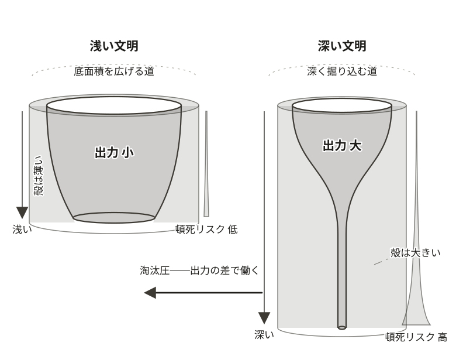

### 淘汰圧は、文明のあいだで働く

道を選ぶのは、文明のあいだに働く淘汰圧である。同じ現実座標系を共有して並走する複数の文明は、その被覆を競合させる（「不等式の動性」第16章 §16-7）。この競合で効くのは、**文明の出力の差**である。

深い選別構造をもつ文明は、より大きな文明の出力をもつ。深さは有効勾配を急峻にし、単位資源あたりに引き出せる仕事を増やすからである。この出力の差が、**競争排除**を駆動する。深い文明は、浅い文明を**置換**する（その被覆領域から退かせる）か、浅い文明の資源と流れを自らの作動へ**編入**する。いずれにせよ、深い文明の被覆領域は、浅い文明の領域へと拡がる。並走のはじめには、深い文明の被覆領域と浅い文明の被覆領域とが並んでいる。時を経ると、深い文明が、双方の領域を占めている——これが、文明のあいだに働く淘汰の圧である。

深掘りが選ばれるのは、一つの文明の内部で安いからではない。**深く掘れる文明が、浅くしか掘れない文明を競争排除し、その被覆領域を占めるからである**。深掘りの立てるコストは内部では高いが、それを払って深い漏斗を立てた文明が、払わなかった文明を排除する。この帰結が、深掘りの高い立てるコストを正当化する。（これは傾向であって、鉄則ではない。浅い系が深い系を一時的に排除する逆転は起こりうる。だが、排除した側が占めた被覆領域を保つには、結局より深い選別構造を要する。）

そのうえで、この淘汰圧が**見ない**ものを、はっきりさせておく。第一に、**保つコスト**は淘汰圧に乗らない。立てるコストは大きいが一回的、保つコストは小さく継続するだけで、払わずとも当面は系が動く——劣化したダムが、決壊の危険を度外視すれば、しばらくは無料で使えるように。保持を怠って浮く分は毎期わずかで、競争のうえでの差を生まない。

第二に、淘汰圧が見る「出力の差」は、その出力が実質か、**Stock の掘り崩しによる嵩上げ**か（本節後段）を見分けない。第三に、被覆の拡がりに**引受**が伴っているかも、淘汰圧に乗らない（次段）。淘汰圧に乗る量は、出力の差の一軸に縮約されている。**淘汰圧は、出力を見て、出力の地を見ない。**

---

**命題 FUNNEL-7（文明の淘汰圧の出力一軸化）【意識・文明レイヤー】**

> 同じ現実座標系を共有して並走する複数の文明のあいだには、被覆の競合を通じて淘汰圧が働く。この淘汰圧に乗る量は、文明の出力の差の一軸に縮約されている。出力の差は淘汰圧に乗るが、保つコストが払われつづけているか、出力が Stock の掘り崩しによる嵩上げを含んでいないか、被覆の拡がりに引受が伴っているかは、淘汰圧に乗らない。ゆえに文明間の淘汰は、現在規模を伸ばす径路を選びつづけながら、その径路が将来規模を痩せさせていることを、淘汰圧のうえに載せない。

---

ここで、一つの事実を確認しておく。深い文明が浅い文明を編入するとき、拡がるのは**編入する側の被覆**——操作の及ぶ範囲——である。編入する側が「我ら」として引き受ける範囲が同じだけ拡がる保証はない。編入された側の人々と領域は、操作の対象として、文明の出力を生む素材として組み込まれうるが、「我ら」の内へ引き受けられるとは限らない。操作の被覆だけが拡がり、引受の被覆が伴わないとき、編入を終えた全体では、操作が引受を超える。これは被覆条件が、文明間のスケールで満たされない事態である。競争排除は、被覆条件を満たさないまま被覆領域だけを拡げる経路を、選びやすい。

### 外がない——競争排除の終端

競争排除は、深い文明の被覆領域を、浅い文明の領域へと拡げていく。隣を編入し、その隣を編入しつづける。だが、現実座標系の空間は有限である。並走する他の文明をすべて編入し尽くすと、被覆領域を拡げる先——編入できる外側——がなくなる。

外側がなくなったとき、被覆を広げて出力を増やす道は閉じ、残るのは深掘りの道だけになる。だが、外部から F を迎え入れる被覆の拡大が止まれば、深掘りは外部の F を伴わない深掘りへ追い込まれる。自系の出力を入力に次の圧縮をする、自己言及相（第18章 §18-1）である。文明は、外部世界の作動から切り離されて、自らの Stock を取り崩す深掘りへ閉じていく。競争排除という淘汰の圧は、こうして全空間を編入し尽くすことで、自ら「外がない」状態を作り出し、深掘りを自己言及相という袋小路へ追い込む。

### 立てた漏斗を、保てるか

淘汰圧に乗らない第一の量は、保つコストである。競争のなかで被覆領域を拡げた文明の内部でも、立てた漏斗を保てるとは限らない。漏斗を深く彫る作業——立てるコスト——は、一回的な投資である。だが、立てた漏斗は、放置すれば散逸する。深く彫った漏斗ほど、その内側を保つ作業——保つコスト——の要求は大きくなる（中核命題-1 の保つコスト要求）。

そして、文明レイヤーでは、**保つコストは払われつづけるとは限らない**。**命題 FUNNEL-1（保つコストの非自動性）** が、ここに効く。物理基底や生命のレイヤーでは、保つコストの不払いは即座に崩壊や淘汰として現れる。だが文明は、表象能力によって保つコストを未来・下位レイヤー・他者へ転嫁できる。そのため不払いが直接の崩壊として現れず、漏斗を形だけ残したまま内部が腐食していく経路を持つ。深く彫った漏斗ほど保つコスト要求は大きく、この経路は深くなる。

### 漏斗の素材は、何によって支えられているか——Stock の掘り崩し

淘汰圧に乗らない第二の量は、出力の地である。漏斗の素材は、F が運んでくる新しい可能性によって、絶えず補充されている。F が補充するぶんを超えて O が掘り込むなら、作動圏の内部の素材は痩せる。痩せた分は、作動圏のなかに残っていた **Stock**——もはや流れていない、固定された可能性の蓄え——を掘り崩すかたちで補われる。

Stock からの掘削は、ある期間、F の補充の不足を埋めることができる。だが、Stock は更新されない。掘り尽くせば、戻ってこない。F が運んでくる流れと、Stock の蓄えは、別の性格を持つ。Stock の消尽は、Flux の流動と違って再生されない（命題 FOE-9、第16章 §16-6）。

ここに、気づかれにくい非対称がある。**Stock を掘り崩している局面では、文明の出力はむしろ拡大しうる**。掘削の速度が、F の補充と Stock の更新可能性の総和の痩せを上回る局面があるからである。文明は、自らの将来の λ₀——将来世代が立て直しに使う地——を掘り崩しながら、現在の出力を伸ばしうる。そのあいだ、伸びている出力そのものが、その地の痩せを覆い隠す。出力の増大は、作動が健全であることの証拠のように現れるが、それは足下の Stock を掘り崩しているがゆえの一時的な嵩上げでありうる。そして、文明間の淘汰圧は、この嵩上げを実質と見分けない——嵩上げされた出力も、競争排除の場では同じ出力として働く。掘り崩す文明は、掘り崩しているあいだ、淘汰のうえで不利にならない。

### 現在規模と将来規模の引き離し

深掘りで現在の出力規模が伸びる、その同じ深掘りが、保つコスト要求を膨らませ（中核命題-1）、その保つコストは払われつづけるとは限らず（命題 FUNNEL-1）、F の補充を超えた分は更新されない Stock を掘り崩している。漏斗の中身は、保持されないまま形だけ残る——「残存と継承の違い」（第14章 §14-6）でいえば、**継承されず、残存する**。さらに文明のあいだでは、競争排除に勝った文明が、編入した浅い文明の被覆領域へ掘り尽くしを送り出すことで、現在規模を嵩上げする。その先送りも、編入できる外側が尽きる地点で閉じる。現在規模と将来規模を引き離すのは、こうして、淘汰圧が見る量（出力の差）と、見ない量（保つコスト・出力の地・引受）との差である（命題 FUNNEL-7）。淘汰は、現在規模を伸ばす径路を選びつづけ、その選択の代価を、淘汰圧のうえに載せないまま進む。

残存の構造は、閾値を超えた事後にしか観測可能性が成立しない非線形回収因果（第15章 §15-7）として、当該系の判断回路に現れないまま痩せていく。だから、**現在支えている規模が伸びていることは、将来維持できる規模が保たれていることを意味しない**。現在規模と将来規模の差は、この見えない痩せのうちに開いていく。

これは、**「大きくなるほど、支えにくい」** という構造命題（「残存と継承の違い」第14章 §14-6）の、動性論的な姿でもある。文明の出力の規模が拡大する局面と、将来維持できる規模が痩せる局面は、別々の事象ではない。同じ一つの構造の、表と裏である。深掘りで支えられる規模が伸びるとき、その同じ深掘りが、漏斗の中身を保つ作業を圧迫し、Stock を掘り崩している。

### 三軸が引き離す力——空間・時間・実存

現在支えている規模と、将来維持できる規模を引き離す力は、一つではない。保つコストと掘り尽くしの転嫁（命題 FUNNEL-1）は、三つの方向へ向かう。

- **空間軸**——競争排除と編入を通じて、保つコストと掘り尽くしが、被覆領域の外側にある同時代の他文明へ送り出されることで、現在規模が嵩上げされる。
- **時間軸**——未来世代へ送られるはずの蓄えを現在の操作で掘り崩すことで、現在規模が前借りされる。
- **実存軸**——規模を定める「我ら」の輪郭そのものが書き換えられることで、現在の規模が見かけ上維持される。誰を引き受け、誰を引き受けないかの境界が動くことで、引受の不等式の成立条件そのものが変質する。

三軸が極まるほど、現在規模と将来規模の差は開いていく。

---

## §19-5　構造記述の一巡と、深層で残る問い 

第Ⅳ部の部扉は、三つの問いを立てた。結果はいつ・誰に返るか。重心はどこにあるか。どの規模まで、保てるか。「『我ら』の境界と因果の創発」（第15章）が一つめに非対称性因果の四類型（即時／遅延／非線形／回収断絶）で、「不等式の動性」（第16章）が二つめに FOEモデル・係留・三つの文明相で、本章が三つめに漏斗モデル・命題 FUNNEL-1 で応じた。三つの問いに、構造記述としての応答が一巡する。

漏斗モデルが描いたのは、文明の出力が立つ場の幾何である。深く彫られるほど勾配は急峻になり、被覆が広がるほど F の流入が増える。O は報酬関数の論理のもとで自走し、停まらない。深部加速の凹曲線が、その自走を構造として可視化する。文明の出力は、ここから生まれる。§19-3 が四つの幾何として取り出した頓死のリスクは、この源泉の裏面である。出力を立てる急峻さと、崩れやすさを生む急峻さは、同じ一つの幾何である。

そのうえで、本章 §19-2 が一つの帰結に畳んだのは、こうである。**O の深層加速が停まりうる構造条件は、被覆条件と接地条件である。そのいずれも O の内部には存在しない**。停まるかどうか、停まるべきかどうかは、本章の射程の外にある。本章が記述したのは、もし停まりうるとしたら何によってか、という幾何的事実だけである。

ここで、構造として残るもう一つの問いがある。漏斗の深層で、O は何を糧として動いているのか。深まる O は、F の流入を引き込みつづける。だがその F は、もとはどこから来ているのか。第18章 §18-1 は、F が「別の選別構造の残余」として現れることを取り出した。そして本章 §19-4 は、文明がその供給源を求めうる三つの方向を立てた。同時代の他者へ。まだ見ぬ世代へ。そして、自分自身へ。

O が深層で何を糧にしているか。第20章以降は、問いを三つの軸で開く。

---

# 第20章　空間的不安定——操作能力の膨張と「我ら」の縮退 

「我ら」を養う者たちに、「我ら」は何を負うのか。

人が群れて暮らしはじめて以来、問われつづけてきた問いである。自分の生は、自分一人の力で立っているのではない。顔も知らぬ他者の労苦の上に立っている。負うのか、と問われれば——負わぬとは言えない。引受の不等式が空間軸で破れていく姿は、この「負わぬとは言えない」というほとんど自明なところから始まる。降り口として最も浅く、最も古くから人類が問うてきた地である。

「文明の出力の幾何」（第17章）から「どの規模まで、保てるか」（第19章）までの三章は、文明の出力の規模を**急峻な傾斜**と**大量の流れ**の積として取り出し、漏斗を彫り込む側の構造装置を据えた。その閉じ（第19章 §19-5）は、最後に一つの問いを残した——**漏斗の深層で、O は何を糧として動いているのか**。本章から第22章までの三章は、この問いに、空間・時間・実存の三軸で応える。本章はそのうち空間軸を取り出す。

空間軸とは、F の供給源を**同時代の他者の選別構造**に求める方向である。文明の操作能力が空間に伸びるとき、その作動は他の選別構造——他の文明、他の共同体、自然界の生態系——が現に作動して生み出している残余を、漏斗の入口に流す（第18章 §18-1）。エジプトの農夫が灌漑と耕作の選別構造を回すから、ローマの市民は食える。北アフリカの牧の選別構造が動くから、地中海の都市の靴と毛織物が成り立つ。ガリアの森林が森林として作動するから、街道の枕木と燃料が得られる。それぞれの場所で、それぞれの選別構造が動いた残余が、別の場所の漏斗に流れ込む。**糧の出所は、同時代の他者の作動の残余である**。

これは、文明の達成として、まず正面から評価されるべきことだ。手の届く範囲が空間に伸びたこと、より多くを養えるようになったこと、見ず知らずの数百万が分業し交換し調整できるようになったこと——いずれも、操作能力的我ら（O）が空間に伸びたその大きさそのものである。惜しむべきものは、どこにもない。本章は、この達成を達成として置いた地点から、構造の側に降りていく。

本章で送り出し先となるのは、同時代の他者——抗える相手である。属州民は反乱を起こし、流域の民は陳情し、隣の文明は外交で押し返した。現代でも、見知らぬ畑の作り手や遠い工場の働き手は、姿は見えなくとも、なお問えば声を返しうる相手として、同じ時代のうちにいる。抗える相手への送り出しは、構造の内側に、わずかなりとも内在的なブレーキを残す。重心はここで FOE から **FO-（係留FOE で係留が解けた領域）** へ滑るが、まだ流入が費消を補いうる側にとどまる。重心が**再供給されない固定 Stock を削る -O- へ深まる**のは、抗えない相手——まだ生まれていない未来世代——へ送り出しが向かう「時間的不安定」（第21章）からである。

---

## §20-1　遠くまで届く手——空間に伸びた文明の出力と、その離陸 

### 空間を覆う達成

まず、達成を達成として見る。

文明は——古代の文明でさえ——、手の届く範囲を空間の方向へ途方もなく押し広げてきた。一つの谷で育てた穀物が、海を越えた都市の市民を養う。一人では持ち上がらぬ石が、組織された人手によって水道橋となり、乾いた丘に水を通す。声の届かぬ距離が、街道と書簡と信号で結ばれ、ひと月かかった報せが数日で伝わる。見ず知らずの数百万が、同じ法と同じ貨幣のもとで、会わぬまま分業し、交換し、調整する。

これらはいずれも、文明の出力である。本書の言葉でいえば、「操作能力的我ら」（O）が空間の方向へ伸びた、その大きさそのものだ。文明の出力の規模は、漏斗の被覆が及ぶ範囲の広さに応じて立ち上がる。被覆が広がるほど、漏斗の入口に流れ込む F が増え、漏斗が引き出せる仕事の量も増える（第17章 §17-1）。

ローマが地中海を一つの内海として運用し、沿岸の属州から穀物と木材と金属を集めて百万の都市を養ったとき、そこにあったのは、空間に伸びた文明の出力の、紛れもない達成である。今日でも、別の大陸で組み立てられた道具が日々の手元に届き、別の半球で育った食材が食卓に並び、地球の裏側まで巡る通信が瞬時に応答する。そのような文明の達成のうえに、現代の読者はすでに置かれている。手が届く範囲は、ローマの時代よりさらに圧倒的に伸びた。

この達成は、大きく評価されるべきものである。手が遠くまで届くようになったこと、より多くを養えるようになったことは、文明がなしうることの極点の一つであって、そのこと自体を惜しむ筋合いはどこにもない。

### 達成はどこから来たか——「我ら」の引受が装置を生む

では、この空間的な文明の出力は、どこから来たのか。

手が遠くへ届く前に、まず「我ら」が遠くへ届いていた。会ったこともない谷の向こうの者を、同じ「我ら」として引き受ける。その引受が先に立ち上がっていなければ、海を越えた都市のために穀物を積み出す回路も、見知らぬ者と交わす契約も、そもそも成り立たない。空間的に拡張された「我ら」、すなわち「実存的我ら」（E）の空間的な広がりが、操作の空間的拡張に先行する。

その拡張された「我ら」は、装置を生んだ。会わぬ者どうしを一つの「我ら」として束ねるために、共有された物語が、記号と文字が、法と貨幣と契約が、街道と記録の網が編まれた。これらの装置は、各人が他のすべてを直接知らずとも、共有物への参照を通じて同じ「我ら」に属することを可能にする。人がじかに追える関係の数（帯域）には厳しい上限があるのに（「ホモ・デウスとホモ・マネス」第7章 §7-1）、その上限を超えて「我ら」を広げる装置である。本書の語彙でいえば、これらは λ₂（社会的索引による信頼ネットワーク）と λ₃（共有された知識ストック）の装置を、空間の方向に伸ばすことで成り立っている（第18章 §18-2）。

これらの装置こそが、空間的な文明の出力を駆動した。同じ装置が、束ねた「我ら」を足場に、生産を、改変を、流通を、調整を、空間的な被覆を増やす方向も展開する。街道は、見知らぬ者を「同胞」として束ねる回路であると同時に、軍と物資と報せを遠くまで運ぶ回路だった。一つの達成が次の達成の足場になり、累積する。敷かれた道は次の道を敷く資材と人手を運び、施工の熟練そのものが世代を越えて積み上がり、後の道はより速く、より遠くへ伸びる。文明の出力は、こうして複利で膨らむ。

達成は、「我ら」を大きく引き受けたことから生まれた——「実存的我ら」が先導し、「操作能力的我ら」が追随して伸びる。そして拡張された「我ら」は、より広い範囲の他者の作動の残余——F の流動——を、新たに漏斗の入口へ引き込む。重心が FOE のうえに保たれている局面における、文明の空間的拡張の姿である。

### 装置の離陸——文明の出力が「我ら」から切り離れる

ところが、ここに一つの非対称が潜んでいる。

「我ら」を束ねる装置は、いったん編まれると、それを編んだ引受がなくとも回りつづける。街道は、誰が誰を「我ら」と感じているかにかかわらず、敷かれていれば軍と物資を通す。法と貨幣と記録は、外部に物質化された参照可能物として、担い手が入れ替わっても作動を続ける。極端には、いま誰がそれを支えているかは、装置の作動にとってほとんど問われない。装置として外に物質化される操作能力は、世代を越えて自走する。

「実存的我ら」の側は、そうはいかない。「我ら」の感覚は、外に固定された記録だけでは作動しない。それが生きて働くには、一人ひとりの内側で、世代ごとに引き受け直されなければならない。前の世代が抱いた「我ら」は、次の世代がそれを自分の内で抱き直さなければ、形だけ残って作動しない。

二つの側は、別の論理で動く。操作能力は外的な装置として自走し、引受は内的な反復としてしか保たれない。ここに、**命題 FUNNEL-1（保つコストの非自動性）**（第17章 §17-2）の空間軸での姿がある。装置として物質化された側の保つコストは、文明レイヤーでは未来や下位レイヤーや他者へ繰り延べうる。だが引受の側の保つコストは、誰かの内側で世代ごとに支払われなければ作動を止める。装置は自動で残り、引受は自動では残らない——この非対称が、空間の方向で開く。

文明の出力が空間に伸びるほど、それを引き受けつづける係留作動の射程も伸ばさなければならない。だが**係留FOE** は、係留を要し、自動では維持されない。E の射程が漏斗の彫り込みに及ぶ範囲である（「どの規模まで、保てるか」第19章 §19-3）。**E が O の空間的拡張に追随できないところでは係留が及ばないまま装置だけが伸び、文明の出力は、それを生んだ母胎から離陸する**。

これは、装置を編む側と装置を引き受けつづける側の、駆動原理の差から出てくる。咎むべき悪事ではない。空間に伸びた装置が自走することは、装置を編んだ達成のいわば裏面である。離陸そのものは、達成と切り離せない。重心は、ここで FOE から **FO-（係留FOE で係留が解けた領域）** へ滑り始める。

装置は、それを編んだ引受がなくとも回りつづける。では、離陸した文明の出力に「我ら」を追いつかせる仕事の側は、誰が、いつ、どれだけ払うのか。装置が自動で残るのに対して、この仕事は自動では残らない。残らないものを残しつづけるとは、どういう負荷か。

---

## §20-2　追いつかせる仕事——空間に広がった「我ら」を保つ 

### 文明の出力に「我ら」を追随させる

文明の出力が「我ら」から離陸する（§20-1）。引受の不等式が成立するとは、操作能力の及ぶ範囲が、実存的我らの引き受ける範囲に収まっていること——重心が FOE のうえに保たれていること——だった（「不等式の動性」第16章）。空間方向に伸びた文明の出力に E がそれだけ追随しなければ、重心は FOE から FO- へ滑り、不等式は破れる。

E を空間的に広げるとは、どういう仕事か。ローマに住んだ市民で言えば、海を越えた都市の市民を、谷の向こうの民を、徴税され徴用される属州の農夫を、「我ら」として——その帰結を引き受ける相手として——認知し直すことである。これは、文明の出力を駆動した装置が自走するのとは、別の論理で動く。装置は外に物質化されて回りつづけるが、「我ら」の感覚は、一人ひとりの内側で、世代ごとに引き受け直されなければ作動しない（§20-1）。

引き受け直す作動は、自動では起こらない。共感を運ぶ語りが、教育の場が、儀礼の反復が、共有された物語が、その都度に組み直されていく必要がある。前の世代が「我ら」に含めた遠い民を、次の世代が自分の内で含め直さなければ、E は形だけ残って痩せていく。本書の語彙でいえば、これは λ₁（神話的MANES、地縁と対面の射程）と λ₂（SFOK、対面しない他者への信頼ネットワーク）の作動を空間方向で保ちつづける仕事である（「神話的MANES」第8章、「社会的既知感への信認」第10章）。λ₁ は対面と地縁の枠の内側で「我ら」を厚く保ち、λ₂ はその枠の外まで「我ら」を伸ばす。装置として外に物質化される側（λ₂・λ₃ の固定化された記録）とは別の論理で、内的な反復としてしか保たれない仕事である。

ローマ市民権は、その仕事の制度的な姿の一つを示す。市民権は、ローマ法・ラテン語・街道網という λ₂ の信頼ネットワークを介して、対面しない者を同じ「我ら」の内に位置づける制度として作動した。だが帝国の被覆——軍団が及び、徴税が及び、属州が組織された範囲——は、市民権の射程よりも遥かに広く伸びた。被覆の縁の外側に、市民権を持たない属州民の選別構造があった。E の射程が、O の射程に追いつかない領域である。

現代でも、同じ非対称が、別のスケールで作動している。共感を運ぶ語りや教育や儀礼が現に作動しうる範囲——λ₁・λ₂ の射程——は、ローマの時代から劇的には広がっていない。人がじかに引き受けうる他者の数（帯域）の上限は、文明レイヤーが巨大化・複雑化しても、変わっていない（第7章 §7-1）。一方で、サプライチェーンの被覆は地球規模に達した。O の射程と E の射程のあいだの差は、ローマ帝国期よりも、広がっている。

### 係留摩擦の二重化——自業自得と他業自得

E を広げつづける仕事の負担を、さらに重くする構造がある。**係留摩擦の二重化**——係留作動が課す摩擦は、自系の係留分（自業自得）に加えて、他相が放棄した係留分（いわば他業自得）まで担うこと（「不等式の動性」第16章 §16-8）。これが、空間軸ではこう具体化する。

現実座標系は、一つの系に占有されない。星々と気候と地形からなる、当該系の「我ら」とは無関係に存在する地形である（第16章 §16-1）。複数の文明が同じ地形を共有して並走し、また一つの文明のなかでも、営みごとに引き受け方は分かれる。大半の操作はその帰結を即時に確定して引き受けずに済ませ、ごく一部だけが遅延回収因果として引き受けられる。そうした配分はふつうにありうる（第15章 §15-7）。引き受けは、文明をまるごと一色に塗るのではなく、価値や営みの一つひとつのうえで分かれる。

引き受けられなかった帰結は、消えるのではない。即時に確定され、あるいは切り捨てられた帰結は、共有された地形へ流れ出て、そこに累積し、引き受け手を待つ。そして、遅延回収因果を引き受ける営みが行われている場所は——どこであれ——自分の帰結だけでなく、ほかで引き受けられずに押し出された帰結をも、引き寄せて抱えることになる。

引き受ける側のコストは、こうして二重になる。自分の操作に伴う帰結を引き受ける仕事（自業自得）に加えて、ほかで引き受けられずに押し出された帰結を引き受ける仕事（いわば他業自得）が、同じ肩へ積み上がる。E を広げつづける負担は、自分の出力の大きさだけでは測れない。共有された地形のうえで、引き受けがどれだけ手放されているかにも、左右される。

### 引き受けないほど、効率がよい

ここに一つの非対称が現れる。

E を広げつづける仕事は、重い。それは自走しないし、二重に積み上がりうる。これに対して、この仕事を手放すことには、即座の見返りがある。引き受けを省けば、そのぶんの仕事は要らなくなり、文明の出力を伸ばす速度はそのまま上がる。まだ返っていない帰結のための引き受け手を用意する手間を省いた側は、同じ時間のなかで、より遠くへ、より速く手を伸ばせる。

短い時間尺度で見るかぎり、引き受けない構えのほうが、効率がよい。引き受ける仕事を投じる側は、引き受けない側に、文明の出力の速度で後れを取る。並走する競争のなかで、これは不利として働く。これは、**拡張加速相**の短期的優位（第16章 §16-7）の、空間軸での姿である。拡張加速相とは、文明の出力・コスト・リスクの三構造変数への態度として、係留を放棄する構えに最も振り切れた相である（第16章 §16-6）。並走する複数の文明が同じ現実座標系を地理的に共有するという競争環境のもとでは、係留を放棄して O を遠くまで伸ばせる側が短期で勝ち、係留を維持する側は構造的に押されていく。

だが、引き受けを手放すことは、ただ仕事を節約するだけではない。それは、文明の出力が及んだ先の「我ら」を、能動的に切り縮めることでもある。縮めて手放した帰結は、消えてなくなるわけではない。それは別の場所へ、別の主体のもとへ届く。

---

## §20-3　送り出した先と、返ってくるもの——表裏一体と非線形の応報 

### 「我ら」を縮めることは、送り出し先を作ること

引き受けを手放すと、文明の出力の速度が上がる（§20-2）。だが、手放した帰結はどこへ行くのか。

引き受けないとは、帰結を当事者の時間に返さないこと——回収断絶因果として、自分の判断の外へ送り出すことである（「『我ら』の境界と因果の創発」第15章 §15-7）。送り出された帰結は、消えるのではない。どこか別の場所へ、誰か別の主体のもとへ届く。送り出しが成立するには、それを受け取る先が要る。

その送り出し先が満たすのは、**操作能力的我らの中に組み込まれていること**と、**実存的我らからは排除されていること**である。手の届かぬ相手にはそもそもコストを送り出せないし、「我ら」の内側にいる相手へ送り出せば、引受の不等式が働いて、コストは当事者の時間へ返ってきてしまう。組み込まれていて、かつ「我ら」ではない——この配置が、送り出し先の位置である。四領域（「どの規模まで、保てるか」第19章 §19-3）でいえば、**E が届かない領域**——O の輪郭の内側にありながら E の輪郭の外側——が、その送り先にあたる。そして、この配置は自然には生まれない。

この配置が「自然には生まれない」と言うとき、その「自然」は、直接接続の帯域に閉じた情景を指す。手の届く範囲——ダンバー数の水準（第7章 §7-1）——では、共感も教育も物語も、接する相手を「我ら」へ取り込む方へ自然に働く。この範囲でなお相手を「彼ら」に置きつづけるには、実存的我らの境界を能動的に書き換える作業が要る。

だが、ホモ・サピエンス文明は、この自然な帯域そのものを超えて成り立っている。会ったこともない数百万を一つの「我ら」へ束ねる媒介接続——神話・制度・通貨・信仰（第7章 §7-1）——それ自体が、帯域の自然な生まれ方を超えた構築物である。そしてこの媒介の係留（λ₁・λ₂）の射程には限界があり、帯域の外へ伸びる O の速度には追いつかない（§20-2）。だから文明の内側では、送り出し先は能動的な排除だけからは生じない。自然な「我ら」がそもそも届かない帯域の外では、送り出し先は、相手を排除するまでもなく、媒介の係留が伸ばされないこと——射程の限界と不作為——として口を開ける。

送り出し先は、こうして二つの相で確保される——帯域の内では能動的な「彼ら」化として、帯域の外では媒介係留の不伸長として。いずれも、O の空間的膨張が E の媒介的延長を追い越す、その差にほかならない。文明の出力を空間へ伸ばすこと（O の膨張）と、それに「我ら」が追随できず縮むこと（E の相対的縮退）は、二つの別々の出来事ではない。同じ一つの運動の、表と裏である。乖離として幾何的に取り出されたドリフトが、ここでは競争のなかで駆動される姿として立ち上がる。重心が FOE から FO- へ滑ることである（「不等式の動性」第16章）。

---

**命題 FOE-12（空間的乖離）**

> 文明は、直接接続の帯域を媒介接続で超えて「我ら」を束ねる構築物である（第7章 §7-1）——それ自体が、自然な帯域の外に立つ。その文明において、操作能力（O）は媒介の力で帯域の外へ遠く速く伸びるが、実存的我ら（E）を同じだけ届かせる媒介の係留には射程の限界がある。ゆえに、文明の出力の空間的膨張と「我ら」の縮退は、同一運動の表と裏である。両者の差——O に組み込まれ E の外にある領域——は、帯域の内では能動的な「彼ら」化として、帯域の外では係留の不伸長として、ひとしく重心の FO- 側に口を開け、FOE から FO- へのドリフトを競争のなかで駆動する。

---

### 組み込まれて、なお「我ら」ではない

この配置の具体的な姿が、ティベリウス治世（紀元14〜37年）のローマに見える。

ローマ市民の食を支えた穀物の多くは、エジプトと北アフリカの属州から運ばれた。とりわけエジプトは、供給の量ではなく統治の形態において別格だった。皇帝の直轄として元老院属州とは別に扱われ、騎士身分の長官が統治し、元老院議員の立ち入りにすら皇帝の許可を要した。エジプトの農夫の働きなしにローマ市民は食えない——操作能力的我らの中核に、深く組み込まれている。だが同じ農夫は、ローマ市民権の外に、特殊な属州的地位に固定され、「我ら」の政治的な内側には置かれなかった。

組み込まれていて、かつ「我ら」ではない。送り出し先の二条件が、ここで同時に満たされている。同型の配置は、地理も時代も信仰も異にして反復する。イスラーム圏のズィンミー制は、啓典の民を共同体の構造的な外に置きつつ、人頭税を通じてコスト負担に組み込む配置を長期にわたって運用した。近世の大西洋奴隷交易、産業革命期の本国工場と植民地のあいだの分業——いずれも、被覆の縁の内側にありながら「我ら」の制度的内側には置かれない領域を、保ちつづけた配置である。

この配置は、遠い過去の文明の勃興期だけの話ではない。たとえば、いま読者の身近にある一台のデバイスの部品の原料となる鉱物資源は、その大部分が特定の資源国で産し、なかには手掘りの採掘場で働く者の手を経たものもある。デバイスを構成する部品は、様々な土地の工場で製造され、組み立てられる。デバイスを通して参照される情報は、どこかの誰かが大量のデータを選り分け、注釈づける作業のうえに構築されてきた。読者の日々も、こういった連なりなしには回らない。採掘の担い手も、組立ての働き手も、データを標識づける作業者も、読者の「操作能力的我ら」の中核に、深く組み込まれている。

だが同じ人々は、読者の「実存的我ら」の内側には、ほとんど置かれていない。その顔も、名も、履歴も、読者の帯域には積み上がらない。彼らは、深い文明の漏斗が必要とする役割に変換されて、操作能力の被覆の縁に立っている。たとえば、鉱物資源を掘ること、部品を製造して組み上げること、データを標識づけることである。共感を運ぶ語りも、教育も、儀礼も、そこまでは届いていない。被覆の縁は地球の裏側へ達したのに、λ₁・λ₂ の射程は、ローマの時代から大きくは広がっていない（§20-2、第7章 §7-1）。組み込まれていて、かつ「我ら」ではない。ティベリウスのエジプトで満たされた送り出し先の二条件は、いま、読者自身の手のなかで、さらに広く満たされている。

### 送り出し先は、役割に縛られて変質する

送り出しは、ただ受け取り手に届いて終わるのではない。受けつづける長さに応じて、送り出し先の構造そのものが変質していく。

深い文明が浅い文明を被覆に取り込むとき、取り込む側の操作（O）は相手へ届くが、その「我ら」（E）が同じだけ及ぶとはかぎらない。E が及ばないまま O だけが及ぶ配置——**O 限定の編入**——は、深く長く続くと安定する。被覆条件（「どの規模まで、保てるか」第19章 §19-2）が文明間スケールで満たされない配置である。ローマ市民権がカラカラ帝の勅令（紀元212年）で帝国の自由民に拡張されたように、E の射程が制度として広げられることはある。だが制度的な拡張が、共感・教育・儀礼を介した実質的な E の拡張に追随したかは、係留作動が制度の射程まで及んでいるかにかかる、別の問いである。

O だけが及ぶ配置が深まると、もう一つの構造が立ち上がる。編入された側の人々が、編入した文明の漏斗の特定の段で必要とされる役割に縛られる構造である。ローマの属州民は、帝政期を通じて、穀物生産者として、鉱山の労働者として、それぞれの位置に縛られていった。別の何者にもなりうる潜在は、編入した側の必要によって特定の役割に固定される。彼らの選別構造の残余は編入した文明の漏斗に F として流れ込むが、それは彼らが自由に作動させて生み出した残余ではなく、役割に縛られた状態で生み出されたものである。本書はこの構造を**疑似F** と呼ぶ。F は本来、別の選別構造が自律的に作動して生み出した残余である（第18章 §18-1）。疑似F は、その自律性を縛って残余を生み出させる配置——F の供給の自律性が、縮減される配置にほかならない。

疑似F は、異なる制度形態のもとで繰り返し現れてきた——農奴制、植民地のプランテーション、産業革命期の児童労働。その累積は、被覆の縁で、編入された側の選別構造の自律性を細らせる。いずれ編入された側は、編入した文明の漏斗のために残余を生み出す機能以外を、持ちにくくなる。

ただし、歴史上のどの形態も、この変質を完成までは運んでいない。荘園から逃げた農奴を受け入れる都市があり、プランテーションの外縁には逃亡者の共同体が立ち、把握されない裾野がつねに残った。この不徹底は、編入する側の構え——「我ら」の外を糧の供給に充てる境界設定——が緩んでいたことを、必ずしも意味しない。編入する側の操作能力が、名目の被覆の内側を、その細かさまで現に走査できなかったのである。作動圏の底面を決めるのは、名目の輪郭ではなく、O の作動が現に走査する幅である（第17章 §17-3）。徴税は村までしか届かず、台帳は世帯の内側を写せず、報せは街道の速さを超えなかった。疑似F の徹底度を規定する変数は、構えの側だけではない——被覆の広さとは別の、**被覆の内側への浸透の細かさ**である。配置を生むのは構えだが、配置がどこまで徹底されるかは、浸透が決める。編入された側に残りつづけた自律性の余白は、構えの抑制が残したものというより、浸透の限界が残したものだった。ゆえにこの余白は、構えが変わらなくても、浸透の制約が外れるだけで閉じていく。送り出し先は、送り出しを受けつづけるほど、送り出しを受けるためだけの形へと変質していく。

---

**命題 FOE-13（疑似F）**

> 被覆が O 限定で長く続くと、送り出し先の選別構造は、その自律性を構造的に縮減される。編入された系は、深い文明の漏斗が必要とする役割に縛られ、自由に作動して残余を生む力を細らせる。そこから流れ込む残余は、別の選別構造が自律的に生んだ F（第18章 §18-1）ではなく、自律性を縛られて生み出された**疑似F** である。送り出し先は、送り出しを受けつづけるほど、送り出しを受けるためだけの形へ変質する。

---

### 押し出した帰結は、いずれ返る——非線形の応報

ここまでは、送り出しが成立するあいだの話である。だが、送り出しは永遠には閉じない。

引き受けられずに押し出された帰結は、共有された現実座標系（§20-2）へ流れ出て、そこに累積する。送り出し先に届いたコストも、その先で消えるのではなく、物理的・社会的な蓄積として地形に積もっていく。当事者の判断回路には、この累積は現れない——回収断絶として送り出したものは、定義上、当事者の時間に返らないからである。引受の不等式は、ここでは規範的要請である前に、自らを蝕む消尽を見るための認識論的条件として働いている。引き受けの及ばない領域に流出した帰結は、実存的我らの分解能の外に落ちる。O > E に破れているあいだ、送り出しの累積は当事者の判断回路に像を結ばない。

だから、送り出しているあいだ、当事者から見れば「破綻の徴候」はない。

しかし、蓄積がある閾値を超えると、それは無視しきれなくなり、非線形回収因果として——遅れて、まとめて、原因との結びつきを欠いたまま——当事者のもとへ強制的に立ち戻る（第15章 §15-7）。これは、リスクと呼ばれてきたものの姿である。それは「悪いことが起こるかもしれない」という確率の話ではない。**意味づけの回路を欠いた帰結が、選別構造を突き破って強制的に顕現する**事態である。

この応報のたちの悪さは、それが当事者の判断システムに事前には同定できないことにある。閾値を超えるまで、累積は観測可能領域に現れない。超えた後では、すでに手遅れである。引き受けを手放して効率を得た構えは、まさにその手放しによって、応報を事前に察知する回路をも手放している。短期の効率と、応報の不可視性は、同じ一つの構えの表と裏である。

文明の出力を伸ばし、「我ら」を縮め、コストを送り出した先で蓄積が進み、いずれ非線形に返る。この一巡が、空間軸で立ち上がる引受の不等式の破れの姿である。

---

## §20-4　コストは外へ送り出される 

### 空間軸の一巡

本章でたどってきたのは、一つの運動の一巡である。

まず、空間的に「我ら」を引き受けた寛さが装置を生み、その装置が文明の出力の空間的成長を駆動した（§20-1）。文明の出力は達成として膨らみ、やがて装置は自走し、文明の出力はそれを生んだ「我ら」から離陸した。離陸した文明の出力に「我ら」を追いつかせる仕事は、λ₁・λ₂ の係留作動として、世代ごとに引き受け直されなければ作動しない。係留摩擦は二重に積み上がる（§20-2）。係留を放棄すれば、短期の効率は上がる。だが、放棄することは、文明の出力の届いた先の「我ら」を能動的に縮め、コストを「我ら」の外へ送り出すことだった（§20-3）。送り出された帰結は消えず、共有の地形に累積し、いずれ非線形に返る。送り出し先の配置は、O 限定の編入と疑似F として、安定して続きうる（§20-3）——送り出し先の選別構造の形そのものが、送り出しを受けつづける長さに応じて変質していく。

これらは別々の機構ではない。空間に伸びた文明の出力（O）と、それに追いつけず縮んでいく「我ら」（E）は、同じ一つの運動の表と裏である（命題 FOE-12、§20-3）。上から見れば文明の出力の膨張、下から見れば「我ら」の縮退、横から見れば引き受けない構えが競争のなかで広がること、奥から見れば送り出された帰結が地形に積もっていくこと——引受の不等式が空間軸で破れていく姿は、これら全部が同時に進む一つの運動である。

### 前に出るのは、達成だけ

この運動には、非対称がある。**前に出るのは達成だけで、その代価は遅れて、見えないところで進む**。

文明の出力が伸びる達成は、いま・ここで前景に立つ。養える口が増え、結べる距離が伸びる——それは直ちに判断回路に届く。これに対して、係留作動の不足も、送り出した帰結の累積も、前景には立たない。離陸の下げにくさは縮小を試みて初めて現れ、送り出しの帰結は閾値を超えて初めて返る。係留を放棄して効率を得た構えは、まさにその放棄によって、代価を事前に見る回路を持たない（§20-3）。

だから、この破綻は、達成そのものの裏面として進む。空間に手を伸ばしたこと、より多くを養えるようになったことは、惜しむべきことではない。ただ、文明の出力は——それを生んだ「我ら」の引き受けを、自らの離陸と効率のうちに細らせていく。これが、空間軸で引受の不等式が破れるということの、内実である。

### 送り出し先は、抗えるか、抗えないか

本章で送り出し先となったのは、実存的我らから排除された同時代の他者だった——なお抗いうる相手である。彼らは反乱を起こし、陳情し、ときに押し戻した。その抗いはしばしば構造に飲み込まれたが、抗いうる相手であったことそのものが、空間軸の送り出しに、わずかなりとも内在的なブレーキを残していた。重心は本章で FOE から FO- へ滑ったが、まだ流入が費消を補いうる側にとどまった。

ただし、その「補いうる」は、送り出しを受けつづける長さに応じて痩せていく。**疑似F とは、FO- を -O- へ転じさせる機序である。** 自律性を縛られた選別構造は、縛られたぶんだけ、自ら作動して残余を生む力を細らせる。流れ込みつづける流動源が、更新されない蓄積へ、送り出し先の側で変わっていく。空間軸は FO- で閉じるのではない。閉じたところで、次の段への転じが、すでに始まっている。

時間軸では、このブレーキが一つ失われる。「時間的不安定」（第21章）で送り出し先となるのは、まだ生まれていない者——未来世代である。彼らは、現在の出力に同意も拒否もできず、反乱も陳情も返せない。抗えない相手への送り出しは、抗える相手への送り出しよりも、容易である。「空間に伸びた手」の物語は、ここから「まだ見ぬ者への前借り」の物語へと、一段深く降りていく。そこで重心が滑り込むのは、再供給されない固定 Stock を削る -O- である。取り返しのつかない側への、乖離の二段目である。

---

# 第21章　時間的不安定——未来世代への前借りと回収不能 

まだ見ぬ者に、いまを生きる「我ら」は責めを負いうるのか。

これも古くから問われてきた問いだが、答えるのに、空間軸の問いより、わずかな後ろめたさが伴う。「未来の世代に何も負っていない」と胸を張って言える者はいない。言われてみれば、否定しきれない——やはり、「負わぬとは言えない」。引受の不等式が時間軸で破れていく姿は、この居心地の悪さの水準から始まる。「我ら」を養う者たちに対して、「負わぬとは言えない」（第20章）のさらに一段奥にある。

「空間的不安定」（第20章）は、漏斗の入口に流れ込む F が、同時代の他者の選別構造の残余として現れる姿を取り出した。本章は、同じ問い——**漏斗の深層で、O は何を糧として動いているのか**——を、時間軸で取り出す（第19章 §19-5）。時間軸とは、F の供給源を**未来世代の選別構造**に求める方向である。

未来世代の選別構造は、現時点では作動していない——彼らはまだ存在しないからである。だが、文明レイヤーの表象能力は、未来世代がいずれ作動させることになる選別構造を、現時点で先取りして消費する道を開く。種を保留して翌春の播種へ送るのは、未来へ向けた投資である。同じ表象能力が、まだ実っていない収穫を当てにして現在の事業に着手するとき、未来から引き取られた糧が漏斗の入口を満たす。これが**前借り**と呼ばれる作動である。この糧の出所は、空間軸とは構造的に違う性質を持つ。同時代の他者の作動と違って、未来世代の作動は、それを引き取る現在から見て、自系の表象によって「あるはず」として呼び出されたものである。**糧の出所は、自系が表象によって呼び出した「我ら」の延長である**。この二重の人工性が、時間軸の送り出しを空間軸から分かつ。

この前借りも、文明の達成として、まず正面から評価されるべきことだ。未来を見込めることで、現在の世代は手持ちを超えた規模で動ける。種もみの保留から多世代インフラまで、灌漑から世代を越える建造物まで——いずれも、未来を「我ら」のうちに数える表象が立ち上がってはじめて可能になった作動である。文明をしばしば飛躍させてきた力でもある。飛躍は飛躍として、惜しむべきものは何もない。本章は、その飛躍を正面に置いたまま、それが立っている構造の側へ降りていく。

本章で送り出し先となるのは、空間軸とちがって、抗えない相手である。属州民は反乱を起こせたが、未来世代は反乱を起こせない。陳情も交渉も返せない。声を返しうる相手から、声を返しえない相手へ——送り出しの先が変わるだけで、構造の内側に残っていた内在的なブレーキは一段消える。現代でも、住宅ローンを組むことや、累積していく公的債務に乗ることや、化石燃料を引き続き燃やすことは、いずれも未来の自分や未来の世代の作動を現在の決済へ畳む構造を持っている。日々の生活実践のうちに、すでに前借りは織り込まれている。重心はここで FO- から **-O-（再供給されない固定 Stock を削る側）** へ深まる。第20章までは流入が費消を補いうる FO- 側にとどまっていたが、本章で重心は取り返しのつかない側へ滑り込む。重心が **-O- に張り付いたまま、その上に立つ「我ら」の境界そのものが自己分裂する**のは、「実存的不安定」（第22章）からである。

---

## §21-1　時をまたぐ手——前借りという飛躍と、その離陸 

### 時間を兼ねる達成

空間に伸びた手は、時間も兼ねていた。

文明が時間の方向へ踏み出した最初の姿は、おそらく素朴なものだった——**来年の蒔きつけのために、種もみを食べずに残す**。いま空腹を抱えてでも、一部を取り分け、来たるべき季節へ手渡す。現在にコストを負って、未来へ投資する。これは、まだ見ぬ来年の自分や子らを「我ら」のうちに数える、その引き受けがあってはじめて成り立つ。時間をまたぐ「我ら」——実存的我ら（E）の時間的な広がり——こそが、この最初の達成の母胎である。文明は、現在を未来へ差し出すこの構えから立ち上がった。

時間をまたぐ達成は、空間軸の達成と同じく、操作能力的我ら（O）の運動が、それに先行する E の引き受けに支えられて立ち上がる姿である。「不等式の動性」（第16章）でいえば、E が先導し、操作能力が追随して伸びる順序——重心が FOE のうえに保たれているあいだの、時間方向への拡張の姿である。多世代インフラも、同じ系列に並ぶ。たとえば、河岸の石積み、世代をまたぐ灌漑施設、何代も前の世代が植え何代も後の世代が伐る森林である。

同じ「時間をまたぐ力」は、逆向きにも働く。未来を当てにして現在を一段高くへ押し上げる操作——**前借り**——である。まだ実っていない収穫を先取りすれば、いま大きな事業に着手できる。来たるべき余力を見込めば、現在の世代は手持ちを超えた規模で動ける。前借りは、文明の出力を未来から現在へと引き寄せ、文明をしばしば飛躍させてきた。

これも惜しむべきことではない。前へ倒すことで開かれた飛躍は、文明の達成の一つである。種もみを残すことと、種もみを当てにして先に動くこと——投資と前借りは、同じ「時間をまたぐ我ら」の上に立つ、表裏の操作である。

### 前借りの離陸——仕組みが連なりから切り離れる

ところが、時間軸には、空間軸にはなかった性質がある。空間軸のコストは、送り出された先に積もる。時間軸のコストは、**帳簿のうえで消える**。前借りされた未来は、報酬関数の一個の数字へ畳まれ、決済済みとして視界から降りる。積もるものと、畳まれて消えるもの——この差が、時間軸の運びの全体に効く。

そのうえで、離陸の非対称は、ここでも現れる。

前借りを担う構造——制度、債務、約束、未来を見込んだ蓄えの取り崩し——は、いったん仕組みとして据えられると、それを据えた「我ら」の引き受けがなくとも回りつづける。仕組みの側は、誰がそれを未来への借りとして引き受けているかを問わず、一様に作動する。前借りの仕組みは外に物質化され、次の世代へ手渡される。だが、その前借りを「いつか返すべき、未来の我らへの借りである」と引き受ける感覚は、外の仕組みには宿らない。一人ひとりの内側で、世代ごとに引き受け直されなければ、その感覚は痩せていく。装置として外に物質化される側と、内的な反復としてしか保たれない引き受けの側。この非対称が、時間の方向で開く。

前借りの仕組みが「我ら」の引き受けなしに回りつづけうるのは、それが報酬関数で測れる因果しか返さないからである。金融が未来の収益を割り引いて現在価値の一点へ縮めるように、いったん仕組みに載せられた未来は、遅れて返ってくる帰結（遅延回収因果、「『我ら』の境界と因果の創発」第15章 §15-7）ではなく、いま支払い終えた量として扱われる。報酬関数に載らない帰結——測れない未来の付け——は、仕組みの返り値からこぼれ落ちる。前借りがかくも軽く速いのは、この畳み込みによって未来が現在の決済へ繰り込まれているからである。軽く速いのは、止める手がかりごと消えるからでもある。

ローマの皇帝ティベリウスの治世は、第20章で、ローマ市民の食を支えた穀物の出所として、すでに現れていた。同じ治世が、時間軸では別の顔を見せる。ティベリウスは財政を堅実に保ち、その死に際して国庫に巨額の余剰を残したと伝えられる。現在の支出を抑え、余力を未来へ繰り越す——前借りの逆を行く、いわば貸し越しである。だが、この抑制は一代で終わった。後を継いだカリグラの治世は、見世物と造営と下賜への大きな支出で始まり、古代の史家たちは、残された余剰が瞬く間に尽きたと——互いに数字を違えながら——書き残した。帳尻の実際は、いまとなっては確かめようがない。確かなのは、繰り越すという構えが、引き継がれなかったことである。前へ繰り越す抑制は、それを引き受ける感覚が世代を越えて続かなければ、一代で途切れる。ここに、**命題 FUNNEL-1（保つコストの非自動性）**（第17章 §17-2）の時間軸での姿がある。仕組みは自動で残り、引き受けは自動では残らない。

現代でも、同じ非対称は別のスケールで作動している。住宅ローンを組む人は、未来の自分の労働を現在の住居の取得へ畳む。年金制度に乗る世代は、別の世代の労働を現在の制度へ畳む。化石燃料を引き続き燃やす経済は、まだ表面化していない気候の改変を現在の決済へ畳む。これらの仕組みはいずれも、外に物質化された側として自走する。だが、それを「いつか返すべき借りである」と引き受け直す感覚は、一人ひとりの内側で世代ごとに引き受け直されなければ作動しない。日々の生活実践のうちに、すでに前借りは織り込まれているが、その引き受けは仕組みの自走に追いついていない。

前借りの仕組みが生まれて文明の出力が膨らんだあとも、それを支えた「我ら」の引き受けが同じだけ保たれている保証はない。文明の出力が時間方向に伸びるほど、それを引き受けつづける係留作動の射程も伸ばさなければならないが、係留作動は仕組みのように物質化されない。**係留FOE** は、係留を要し、自動では維持されない。E の射程が漏斗の彫り込みに及ぶ範囲である（「どの規模まで、保てるか」第19章 §19-3）。**E が O の時間的拡張に追随できないところでは係留が及ばないまま仕組みだけが伸び、文明の出力は、それを生んだ連なりから離陸する**。

これは、仕組みを編む側と仕組みを引き受けつづける側の、駆動原理の差から出てくる。咎むべき悪事ではない。時間に伸びた仕組みが自走することは、仕組みを編んだ達成のいわば裏面である。離陸そのものは、達成と切り離せない。

### 仕組みの洗練——測られるものだけが手入れされる

仕組みは、自動で残るだけではない。測られるものは、改良の対象になる。前借りを担う仕組みは、世代を越えて同じ形で受け渡されるのではなく、手入れされ、より遠くへ、より低い摩擦で届くように洗練されていく。未来の収益を現在価値へ縮める技法は精密になり、畳める期間は伸び、畳んだものを他者へ移す経路も増える。連なりを引き受け直す仕事のほうは、こうは積み上がらない。前の世代がどれほど深く引き受けていても、次の世代がそれを引き継ぐには、同じ仕事をもう一度、内側から起こすほかない。

これは、命題 FUNNEL-1 の一段先である。保つコストが自動では払われないというだけではない。報酬関数に載る構造の保つコストは、報酬関数自身が払う。載らない構造の保つコストには、払い手がいない。前借りの仕組みに手を入れることは得であり、連なりを引き受け直すことは得にならない。同じ一つの時間の経過が、片側には蓄積として、片側には摩耗として働く。

そして、操作の論理の側から見るかぎり、異変は何も起きていない。前借りは、前の世代より安全に、より遠くまで行えるようになっている。連なりが痩せていることは、仕組みの返り値のどこにも現れない——現れるのは、改善だけである。

仕組みの側は、放っておいても前へ出る。だが、離陸した仕組みに「我ら」を追いつかせる側は、世代をまたいで誰かが担い直さなければ作動しない。そしてその担い直しは、未来へ手を伸ばすだけでは立たない——もう一方の端を、どこにつないでいるのか。

---

## §21-2　連なりを保つ仕事——過去から受け取り、未来へ渡す 

### 前借りに「我ら」を追いつかせる

前借りの仕組みが「我ら」から離陸する（§21-1）。引受の不等式が時間軸で成立しているとは、前借りした文明の出力（O）が、それを引き受ける「我ら」（E）の時間的な広がりに収まっていること——重心が FOE に保たれていること——である。前借りした分だけ E も未来へ広がって帰結を引き受けなければ、不等式は破れる。

E を未来へ広げるとは、まだ生まれていない世代を「我ら」として——その帰結を引き受ける相手として——数えつづけることである。これは前借りの仕組みが自走するのとは別の論理で動く。仕組みは外に残るが、「未来の我ら」への引き受けは、一人ひとりの内側で世代ごとに更新されなければ痩せていく（§21-1）。だから E の時間的拡張には、共感・教育・儀礼・物語を通じた絶えざる引き受けの仕事が要る。時間方向に**係留作動**を広げつづける仕事に他ならない（第16章 §16-4）。

ここには、操作と実存の働きの差がある。報酬関数に載せて未来を現在へ畳むのは、操作が固定した接続の働きである。畳まれずに残る未来——遅延回収として引き受け直されるべき付け——へ手を伸ばすのは、泡のように消える因果よりも続いていく因果を選好する実存の側である（第15章 §15-7）。共感・教育・儀礼・物語が時間をまたぐのは、それらが実存の側が保つ接続として、この選好を担うからである。

本書の語彙でいえば、これは λ₁（神話的MANES、世代軸方向の連鎖）の時間方向の作動である（第8章、第18章 §18-2）。神話・物語・儀礼を通じて、前の世代が抱いた「我ら」を、次の世代が同じ「我ら」として引き受け直す。この反復が、時間軸の連なりを成り立たせる。λ₁ なしには、まだ生まれていない世代を「我ら」のうちに数える作動そのものが立ち上がらない。直接接続の帯域が空間で約百五十人に閉じるのと同じく、時間でも自然な「我ら」は数十年——一世代の生の長さ——に閉じる（第7章 §7-1）。それを世代の外へ、まだ生まれぬ者まで伸ばす連なりは、帯域を超えた媒介的構築——それ自体が、自然な生まれ方を超えたものである。

### 連なりは双方向に伸びる

ここで、時間軸に固有のことがある。未来への引き受けは、それだけでは立たない。**過去から受け取ったという感覚**が、それを支えている。

いまの現在は、現在世代の手柄だけでできているのではない。過去の世代が残し、手渡してくれたものの上に立っている。この**受け取りの引き受け**があってはじめて、「ならば自分も次へ手渡す」という未来への引き受けが立つ。受け取ったものがあるから、渡すものがある。連なりの中の信は、過去への遡りと未来への投射が、双方向に同時に伸びる一つの感覚である。

この双方向性は、感覚の報告にとどまらない。連なりの中の信は、対称性志向（「神話的MANES」第8章 §8-4）のメタ階位の時間軸版——過去への遡及と未来への投射の**対称**——である。そして対称の構えは、片側だけでは立たない。名の「対称」が指すのは両側への釣り合いであり、一方への接続を手放すことは、釣り合いの調整ではなく、構えそのものを落とすことである。ゆえに、過去への遡及を切った系に、未来への投射だけが単独に残ることはない。

だから、**過去を希薄化すること——いまを自分たちの達成のみに帰すこと——は、未来とのつながりを同時に細らせる**。上流（過去）を切る目は、下流（未来）を切る目と同じ目である。種もみを残せたのは、それを残してくれた前の世代の手があったからだ。その記憶を手放した世代は、次の世代のために残すことの意味も、手放す。ただし、この双方向の連なりも、自然に与えられた調和ではない。それ自体が λ₁ の媒介的構築であり、切れるのは、構築物が世代ごとに保守されなくなるからである。連なりの切断は、自然の破れではなく、媒介の不保守として起こる。

因果論の語彙（第15章）でいえば、過去から返ってくるものを引き受けること（上流側の回収）と、未来へ送るものを引き受けること（下流側の回収）は、同じ一つの連なりの両端である。連なりを引き受けるとは、時間の方向に実存的我らの分解能を広げることにほかならない。

歴史的には、この双方向の連なりを再起動する装置が、いくつかの文明で立てられてきた。伊勢神宮の式年遷宮は、その一つの姿を見せる——二十年ごとに、社殿をまだ使えるうちに、隣の敷地へ同じ姿で建て直す。朽ちてから直すのではない。建て方そのものを次の世代の手に渡すために、保っているうちに更新する。同じ機能を担う装置は、ほかの文明にもある。古代メソポタミアでは、新しい王の即位や危機のたびに、債務を帳消しにするアマルギが布告された。レビ記25章は、五十年ごとのヨベルの年を律法として定めた。いずれも、過去から受け取り未来へ渡す感覚を、世代を越えて担い直すために立てられた仕組みである（第13章 §13-4）。現代でも、同じ構造は別のスケールで作動している。気候の安定、医療技術の蓄積、制度の連続——いずれも過去の世代が残し、手渡してくれたものの上に立っている。これらを「過去から受け取ったもの」として引き受けるか、自分たちが立っている所与として通過するかで、未来へ渡すべきものを引き受ける作動の幅も決まる。連なりを過去から受け取り直す装置——歴史記述、教育、世代間の儀礼——が現代でも作動しているかは、別の問いになる。

### 係留摩擦は、時間軸でも二重になる

係留摩擦の二重化は、時間軸でもそのまま働く。ある営みが未来へ送り出した付けは、自分の系の未来世代にだけ届くのではない。共有された地形を通じて、並走する別の系の未来へも流れ込む。連なりを保とうとする営みは、自分の前借りの分に加えて、ほかで未来へ押し出された付けまで、同じ未来の地形で引き受け手として待ち受けることになる。自業自得に、他業自得が重なる。

これに対して、連なりの引き受けを手放すことには、即座の見返りがある。引き受けを省けば、そのぶんの仕事は要らなくなり、現在の規模を伸ばす速度はそのまま上がる。短い時間尺度で見るかぎり、連なりを切る構えのほうが、効率がよい。連なりを保つ側は、切る側に、文明の出力の速度で後れを取る。並走する競争のなかで、これは不利として働く。係留を放棄する構えが短期で競争を制するのは、拡張加速相の短期的優位（第16章 §16-7）の現れにほかならない。

だが、連なりを手放すことは、ただ仕事を節約するだけではない。それは、文明の出力の届く先の未来世代を、能動的に「我ら」の外に置くことである。「我ら」の外に置かれた相手は、置かれたことに、何を返すのか。属州の民は、反乱を返せた。

---

## §21-3　返ってくる先がいない——前借りの累積と非線形の回収 

### 連なりを切るほど、前借りは軽くなる

時間方向の連なりを係留する仕事は重い（§21-2）。係留を放棄すれば、前借りは軽くなる。未来世代を「我ら」から外し、過去からの受け取りを忘れれば、前借りの付けを引き受ける相手は視界から消える。返す相手のいない先取りは、いくらでも軽く、速い。連なりを切るほど、前借りの効率は上がる。

「不等式の動性」（第16章）はこの優位を**拡張加速相**の短期的優位として取り出していた（§16-6・§16-7）。拡張加速相とは、文明の出力・コスト・リスクの三構造変数への態度として、係留を放棄する構えに最も振り切れた相である。係留を放棄する構えは、短期では競争を制し、長期では更新されない地を削り尽くす。いま時間軸に現れているのは、その短期の側の顔である。並走する文明が同じ現実座標系を世代を越えて共有するという競争環境のもとでは、係留を放棄して前借りで規模を急拡大できる側が短期で勝ち、係留を維持する側は構造的に押されていく。同じ非対称（空間軸 §20-2）が、時間軸では世代を越えて作動する。

しかも時間軸の送り出し先には、空間軸にない特性がある。**未来世代は、抗えない**。同時代の他者は、コストを負わされても反乱し、陳情し、ときに押し戻した（§20-3）。未来世代にはそれができない。まだ生まれておらず、現在の前借りに同意も拒否も抗議も返せない。送り出し先が抗えない以上、前借りには、空間軸にあったわずかな内在的ブレーキすら、はじめから欠けている。

### 累積は、閾値を超えて初めて見える

前借りの付けは消えない。返す相手を視界から外しても、付けそのものは未来の地形に積もりつづける。各世代が前の世代と大差ない前借りを続けるだけで、付けは線形には増えず、累積する。連なりの後段ほど、上流の世代から引き取られた量と自世代が引き取る量が重なって積み上がるからである。

そして累積された未来制約は、いずれかの世代で閾値を超える。超えるまで、それは観測可能領域に現れない——現在世代の判断回路に、まだ届いていない付けは映らないからである。超えた事後にしか、全体像は立ち上がらない。これが**非線形回収因果**（第15章 §15-7）の時間軸での姿である。引き受けの及ばない未来に積まれた付けは、当事者の分解能の外に落ちている。

過去の累積を見ない目は、自分がいま未来へ積み増している付けの累積も見ない。この双方向の盲目が、時間軸の自己診断を閉ざす。これは、引き受ける側が自分の外側のセルを見分けられないという構造（命題 FOE-8「引受の外の不可知」、第16章 §16-6）が、時間軸で双方向に現れた姿である。過去の累積を引き受けていれば、自分がどの段階にいるかを見積もる手がかりがある。過去を希薄化した座標系には、その手がかりがない。

メソポタミア南部の灌漑農業では、灌漑と排水の不均衡から土壌に塩類が集積し、数世紀をかけて収量を蝕んだと考えられている（年代と因果の特定には史料的・考古学的な留保がある）。どの世代も前の世代と大差ない灌漑を続けただけで、劣化は閾値を超えた事後にしか全体像として現れなかった。短い時間尺度の判断回路には、何世代にもわたる土壌の塩類化は像を結ばない。

現代でも、同じ構造は別のスケールで作動している。化石燃料の累積的な燃焼は、ある一世代の判断回路には現れない量から始まったが、世代を越えた積み上がりとして、気候の改変という形で立ち戻りつつある。各世代が前の世代と大差ない燃焼を続けただけで、累積は閾値を超えた事後にしか全体像として現れない。公的債務の累積も、同様の時間構造を持つ——各年度の判断回路には現れない増分が、世代を越えた負担として立ち戻る。

### 改変された地形は、物理として返る

時間軸の回収には、もう一つの相がある。改変された地形——伐採された森、塩の集積した農地、変質した気候——は、消えるのではなく、時間をかけて物理として当事者の時間に戻ってくる。

これらは、再供給されない**固定 Stock**——いちど削れば次の世代の起動条件そのものを痩せさせる蓄積——の費消である。第20章では、費消は流入が補いうる **FO-** の側にとどめられた。時間軸では、重心がここで **-O-** へ深まる（章扉）——取り返しのつかない二段目である。第16章でいう Stock 消尽と Flux 流動の対が、時間軸で前面に立つ局面である。

**錨泊FOE** は、時間軸では消尽しうる蓄えとして現れる。係留を要さない、下位レイヤーで生きて支えられる自立の地である（「どの規模まで、保てるか」第19章 §19-3）。表層に積もった土壌、再生に世代を要する森林、地表近くで採れる鉱石、化石燃料——いずれも一度引き出されれば、次の世代に同じ姿で残るとは限らない。錨泊FOE の地から引き出された分が、文明の出力に変換されて消費される。次の世代が同じ地から同じだけを引き出せるかは、保証されていない。

ここで、**接地条件**が、時間軸で満たされない方向に滑る。漏斗の深部に F に接地する主体が生きて保たれていることである（「どの規模まで、保てるか」第19章 §19-2）。前借りで引き込まれる F の源は、現時点ではまだ作動していない未来世代の選別構造である。消尽していく錨泊FOE の地から引き出される F は、次の世代に同じ姿では残らない。F 接地者の側にも、F の源の側にも、時間構造の非対称が立ち現れて、接地条件の充足は痩せていく。

改変の利得は判断の時間尺度の内で確定し、改変の付けは判断の時間尺度の外から戻る。この時間配置の非対称が、累積を不可視のまま進ませ、いずれ非線形に返す。送り出した先に引き受け手はおらず、付けは地形そのものに積もって、いつか現在へ立ち戻る。

前借りが切るのは、返りの経路である。健全な連なりのもとでは遅延回収として返るはずだった果は、連なりが痩せるにつれ、二つの運命に分かれる（第15章 §15-7）。連なりの先がなお生きていれば、果は**潜伏**する。誰の判断にも入らないまま走りつづけ、蓄積し、ある世代で閾値を超えて噴き出す。連なりの先が死ねば、果は**真正の断絶**へ落ち、噴き出すことすらない。送り出し先が自系の延長である以上（§21-4）、それは自系の未来の死でもある。どちらに落ちたかは、送り出した側には見分けられない。見分けられないものに、ブレーキは掛けられない——累積が内在的ブレーキを欠くのは、このためでもある。前借りとは、自分の遅延回収を、潜伏か真正の断絶かのいずれかへ、自らの手で書き換える操作である。

---

**命題 FOE-14（時間的乖離）**

> 未来を「我ら」に数えることは、一世代に閉じる自然な帯域を媒介接続（λ₁）で超える構築であり、しかもその未来世代は、独立に実在せず、自系の表象が呼び出した自系の延長である（§21-4）。ゆえに、操作能力（O）を未来へ伸ばす前借りに対し、実存的我らを同じだけ未来へ届かせる媒介の係留は、抗えない相手ゆえ内在ブレーキを欠いたまま、空間軸よりも抵抗なく解ける。重心は FO- から、再供給されない固定 Stock を削る -O- へ深く沈む。

---

送り出した付けの累積が、起動条件の地までを削ったとき、何が立ち現れるのか。その問いの総合は、三軸が交わる地点を待たねばならない。だがその前に、時間軸には、空間軸との並行が尽きる一段が残っている。

---

## §21-4　抗えない相手と自系の延長——時間軸の送り出しの構造的特異性 

時間軸には、空間軸にない構造的特異性が二つある。

### 抗えない相手の帰結

第一の特異性は、送り出し先が抗えないことから直接出てくる。

空間軸では、送り出し先となった同時代の他者は、コストを負わされたとき、反乱・陳情・外交・撤退といった応答を返しえた（§20-3）。送り出す側はその応答を通じて、送り出しが「相手のいる」操作であることを知らされていた。たとえ多くの応答が押し戻されたとしても、応答そのものが存在することが、送り出しに「相手がいる」という最小の認知を与えていた。

時間軸では、この最小の認知が欠ける。未来世代は、まだ生まれておらず、現在の前借りに同意も拒否も返せない。送り出す側にとって、送り出し先は「応答しない相手」として現れる。この応答の不在は、しばしば「相手の不在」と区別がつかなくなる。応答しないものを、相手として認知することは、構造として容易ではない。

ここに、空間軸との非対称が立つ。空間軸では、抗える相手の存在が、送り出しに「これは送り出しである」という最小の認知を残していた。時間軸では、抗えない相手は、送り出しを「送り出しではない、現在の決済の内部での操作である」として現れさせやすい。前借りが現在の決済として処理される（§21-1）根拠の一つは、ここにある。

### 自系の延長としての未来

第二の特異性は、送り出し先の「実体」がどこから来るかである。

空間軸の送り出し先——同時代の他者の選別構造——は、現時点で現に作動している。エジプトの農夫の選別構造は、ローマが穀物を引き取る引き取らないにかかわらず、現に動いている。送り出し先は、送り出す側の外側に、独立に作動する系として存在する。

時間軸の送り出し先——未来世代の選別構造——は、現時点では作動していない。それが「あるはず」として現れるのは、現在の系の表象が、未来世代の選別構造を「将来作動するもの」として呼び出すからにほかならない。送り出し先の実体は、送り出す側の外側にあるのではなく、送り出す側の**表象によって呼び出された自系の延長**として立ち上がる（章扉）。

これは、空間軸の送り出しと違う事態である。空間軸では、送り出し先は自系の外側に独立して存在し、糧（F）は独立した別の選別構造の残余として供給される。時間軸では、送り出し先が自系の表象によって呼び出されたものである以上、糧の供給源も、表象が呼び出した自系の延長になる。

### 連なりが切れると前借りは自系内の循環になる

二つの特異性を合わせると、時間軸の前借りに固有の構造が立ち上がる。

連なりが係留されているあいだ、前借りは、まだ生まれていない未来世代を「我ら」のうちに数える作動と結合している。その係留とは、過去から受け取り未来へ渡す感覚が世代を越えて反復されていることである。前借りで畳まれた未来は、いずれその世代が現実に到達したとき、その世代の「我ら」によって引き受け直される。この再引き受けが、連なりの装置（λ₁、第8章）が果たしている機能である。

連なりが切れると、この再引き受けの作動が消える。前借りで畳まれた未来は、いずれその世代に到達するが、その世代も同じ前借り構造の内側で生まれ、自分もまた前借りを続けるという構造を継承する。前借りが「いつか返すべき借り」であるという感覚は、その世代の内側で立ち上がらない。立ち上げる装置（過去から受け取り未来へ渡す感覚を支える装置）が、すでに細っているからだ。

結果として、連なりが切れた前借りは、世代を越えても返済されず、次の世代もまた同じ構造を継承する。前借りは、世代を越えた**自系内の循環**になる。各世代の自系の表象が呼び出す未来を、自系の現在が糧として畳み、その畳まれた未来はその世代の次の世代がさらに畳む。糧の出所と糧の引き受け手のあいだに、もはや対話はない。

§21-3 で見た「果がどこへ返るか」の二択（潜伏／真正の断絶）とは別に、いま未来世代の側に立つと、選べる余地そのものが失われている。受け取る帰結は、二つのうちのどちらかに定まる。この循環を F・O・E の幾何で見直したとき、その二つが見えてくる。

---

**命題 FOE-15（自系内循環——前借りは未来の F を剥ぐ）**

> 前借りとは、自系が呼び出した未来（自系の延長、§21-4）が生きて接地すべき F の地——その実体をなす固定 Stock——を、現在の自系が先に取り崩すことである。連なりが係留されていれば、未来世代は F の地に立ち、そこへ操作（O）と引受（E）を揃えて FOE を成り立たせうる。だが連なりが切れると、前借りは未来の F を剥いだまま循環する——自系が呼び出した未来を自系が取り崩し、次の世代もまた同じ構造の内で生まれて、畳みつづける。F を剥がれて到達した未来世代が受け取る帰結は、FOE ではない。業罪を引き受け直す -OE か、引受の絶えた無主の -O- か——その二択にすぎない。

---

これは構造として現に起こりうる事態である。連なりの再起動装置——アマルギ、ヨベルの年、式年遷宮（§21-2）——は、歴史を通じて、この自系内循環への対抗として立てられてきた。現代でそれに相当する装置が、どの程度作動しているかは、本書の射程の外にある。

---

## §21-5　過去を切れば未来も切れる 

### 時間軸の一巡

本章でたどってきたのも、一つの運動の一巡である。

時間をまたぐ「我ら」を引き受けたことから、種もみの保留から多世代インフラまで、時間方向の達成が立ち上がり、同じ表象能力が前借りという飛躍を開いた。前借りの仕組みはやがて自走し、それを生んだ連なりの引き受けから離陸した。離陸した仕組みは、そこで止まらない。測られるがゆえに手入れされ、世代を越えて洗練されていく。連なりに「我ら」を追いつかせる仕事は、過去から受け取り未来へ渡すという双方向の引き受けとしてしか作動せず、世代ごとに更新されなければ痩せていく。追う側は世代ごとに内側から起こし直すほかなく、追われる側は世代ごとに前へ出ている。係留摩擦は時間軸でも二重に積み上がる。連なりを切れば、前借りは軽くなる——返るはずだったものが、潜伏へ、あるいは真正の断絶へ、書き換えられていく。だが、抗えない相手——未来世代——への送り出しは、内在的ブレーキを欠いたまま累積し、ある世代で非線形の閾値を超えて立ち戻る。改変された地形は、Stock の物理として、判断の時間尺度の外から戻ってくる。送り出し先が抗えないこと、そして送り出し先が自系の表象によって呼び出された延長であることが、時間軸の送り出しを構造的に自系内の循環へ向かわせる（命題 FOE-15）。重心は本章で FO- から **-O- へ深まった**——取り返しのつかない側、再供給されない固定 Stock の上に張り付く側へ。

これらは別々の機構ではない。時間方向に伸びた前借り（O）と、それを引き受けられない連なり（E）の細り——空間軸（第20章）の構造と同型の運動が、時間方向に展開した姿である（命題 FOE-14）。

### 過去を切れば未来も切れる

時間軸の不安定は、未来の側だけで起こるのではない。それは過去と現在の断絶に続くものである。いまを自分たちの達成のみに帰し、過去から受け取ったという感覚を手放すこと——その目が、未来へ渡すべきものを「我ら」の付けとして数える回路を、同時に閉ざす。上流を切れば下流も切れる。時間軸で引受の不等式が破れるとは、この双方向の連なりが切れていく過程にほかならない。

空間軸の達成が、それを生んだ「我ら」を細らせたように（§20-4）、時間軸の達成もまた——種もみを残した知恵から生まれた前借りの飛躍が——それを生んだ連なりを、自らの離陸と効率のうちに断っていく。これが、時間軸で引受の不等式が破れるということの、内実である。

空間軸（第20章）と時間軸（本章）は、いずれも「我ら」の境界の外へ何を送り出すかを扱った。送り出し先は同時代の他者であり、未来世代であった——いずれも自分の外にある。続く「実存的不安定」（第22章）は、向きを変える。問いは読者自身へ返り、「我ら」を構成する内面そのものが操作の対象として立ち現れる。外へ送り出す物語は、ここで「そう問う汝自身もまた、外から動かされている」という内奥への反転へと進む。

重心は本章で -O- に滑り込んだが、まだ文明レイヤーは固定 Stock の上に立っている。第22章で重心は -O- にとどまる——文明レイヤーは消滅していない——が、もう FOE へ係留を回復する経路が痩せていく。本章で -O- へ送り込まれた消尽は、三軸が交わる第22章後半（§22-5・§22-6）で、空間軸・実存軸の消尽と合流する。

---

# 第22章　実存的不安定——崩れる聖域と操作できる心 

汝が「我」と呼ぶその内側は、はたして汝のものか。

古くからの問いだが、答えるのに、足場そのものが揺らぐ。「我ら」を養う者たちにも、まだ見ぬ者にも、責めを「負わぬとは言えない」（第20章、第21章）。これは、自分の外の他者や未来についての居心地の悪さだった。本章で問いは向きを変え、読者自身の内側へ返る。引受の不等式が実存軸で破れていく姿は、「あの者たちに我らは何を負うか」から、**そう問う汝自身もまた、外から動かされている**への転回として現れる。

「空間的不安定」（第20章）は、漏斗に流れ込む F の供給源を同時代の他者の選別構造に求める姿を取り出した。「時間的不安定」（第21章）は、その供給源を未来世代の選別構造に求める姿——自系が表象によって呼び出した「我ら」の延長を糧にする姿——を取り出した。本章は、同じ問いを、最後の方向で取り出す（第19章 §19-5）。実存軸とは、F の供給源を**自分自身の選別構造（自系の E）** に求める方向である。

空間軸（第20章）では、糧の出所は自系の外にあった。時間軸（第21章）では、外と内のあいだに——未来世代という、自系の表象が呼び出した曖昧な境界に——あった。実存軸では、この「別の」が消える。糧として取り込まれるのは、係留作動を担う E——「我ら」の境界を立てる側にいた当の主体——である。文明レイヤーで O が動くとは、E が O の最適化に項として入る作動（係留）のもとで動くことだった（第16章）。実存軸での折り返しが起こるとき、その係留を担う E 自身が、O の操作対象として漏斗の入口に流れ込む。**糧の出所は、係留主体そのものである**。

これもまた、文明の達成と表裏のことだ。身体・内面・社会を機構として理解したから、医療と教育と制度的な大規模協調が手に入った。心を機構として扱えたから、治療も意思疎通の技術も進んだ。盤面として読めたから、組織化と協働の規模が伸びた。これらは惜しむべきものではない。ただし、ここで読者は新しい位置に立たされる。これまでの章で「文明全体がどうあれ、自分は安定して立っている」と感じうる地点にいた読者が、本章では自分自身が安定して立っていないかもしれない、という地点へ移される。

本章で糧として取り込まれるのは、もはや自系の外の他者でも、未来の世代でもない。係留作動を担う E 自身——その係留主体——である。歴史を遡れば、内面や良心や知性が「外から触れえない聖域」として配置されていた地は厚い。前近代の MANES の多くで、心は神のみが見通すもの、本人だけが触れうるものとされた。だが第二のバインドが人間そのものへ及び始めると、その配置は掘り崩されてきた。現代では、自分の感情や判断や「我ら」の感覚そのものが、外から書き換えられうる対象として日々作動しているという地に、読者はすでに置かれている。重心は **-O- にとどまる**——文明レイヤーは固定 Stock の上にまだ立っているからだ——が、もう FOE へ係留を回復する経路が痩せていく。第20章・第21章で削られてきた地が、ここで合流して、自己回復への扉を狭めていく。

第Ⅳ部の構造記述は、ここで底に達する。底とは「やらなければよかった」ではない。降りてきた読者がいま立っているのは、ここまでの各段で「これは成果だ」と頷いてきた地の延長線上にある。

---

## §22-1　境界の内側へ——転回と崩れる聖域 

### 「我ら」境界の書き換えという作動

「我ら」の境界は、固定された配置ではない。

第20章では、空間方向に「我ら」境界を能動的に縮めて、コストを送り出す作動を取り出した（§20-3）。第21章では、時間方向に「我ら」境界を能動的に切り離して、未来世代を送り出し先とする作動を取り出した（§21-3）。いずれも、「我ら」境界がいったん引かれてから、その境界の外側へ何かを送り出すという方向の操作だった。

だが境界そのものは、文明レイヤーの作動の対象になりうる。MANES の三層——座標系・報酬関数・共存条件（ES）（第6章）——は、それぞれが書き換え可能な構造として、文明レイヤーで現に作動してきた。座標系を組み替えれば、何が前景化されるかが変わる。報酬関数を組み替えれば、何が得とされるかが変わる。共存条件を組み替えれば、誰が「我ら」に含まれるかが変わる。境界の書き換えは、これら三層の作動として実装される。

ただし、空間軸と時間軸で取り出した境界の書き換えは、いずれも**境界の外側に何があるかを変える**操作だった。自分の輪郭は、その外側の何を「我ら」に含めるか・含めないかを動かすことで、相対的に変わる。境界を書き換える側の主体——「我ら」を立ち上げる側にいる E——そのものは、書き換える側の主体として温存されていた。

実存軸では、この温存が消える。

### 転回——問いが読者自身の内側へ返る

実存軸とは、F の供給源を**自分自身の選別構造（自系の E）** に求める方向であった（章扉）。糧として取り込まれるのは、係留作動を担う E——「我ら」の境界を立てる側にいた当の主体——である。境界を書き換える側の主体そのものが、書き換えられる対象として立ち現れる。これは、第20章・第21章の境界書き換えとは、位相が違う事態である。

外向きの境界書き換え（空間軸・時間軸）は「誰を『我ら』に含めるか」を問う。だが本章の問いは、向きを変える——その「我ら」を立ち上げる側にいる**自分の内側そのものは、どのような存在か**。汝が「われ」と呼ぶその内側は、外から操作できない何かなのか、それとも操作可能な対象なのか。

空間軸（他者）と時間軸（未来）が「我ら」の境界の外側に何があるかを問うたのに対し、実存軸はこの問いを読者自身へ返す。引受の不等式がここで破れていく姿は、「あの者たちに我らは何を負うか」から、「そう問う汝自身もまた、外から動かされている」への転回として現れる。空間軸・時間軸で外へ伸びた操作可能性が、ここで向きを変え、それを伸ばした当の「我ら」の内面そのものへと差し向けられる。外へ送り出す運動が、内を操作する運動へ折り返す。

### 四つの聖域——人間例外論の崩壊

この転回を支えているのは、近現代が人間から次々に剥がしてきた聖域である。

人間を特別たらしめてきた境界が、四つ崩れた。第一に、**身体の聖域**——人間は特別な器ではなく、生理の機械である（生命科学）。第二に、**内面の聖域**——感情も判断も機構の上に乗り、心は主権的な内奥ではない（心理・脳科学）。第三に、**社会の聖域**——「我ら」も価値も、戦略と利得を組み替えれば動く盤面である（「ゲーム理論の強さと限界」第5章で凍結形として見た三要素が、ここで生きて働く）。そして第四に、**知性の聖域**——思考すら人間の専有物ではない。これを揺るがすのは学問ではなく、人間の手で作られた新しい知性である。

前の三つは、人間を再記述する——すでにこういうものだった、と内側から脱神秘化する。担い手は学問である。第四は質が異なる——人間の外に、新しい知性の担い手が現れる。

四つの崩壊は、人間は特別な存在だ、という信念の揺らぎではある。一方で、いずれも、文明の偉大な成果でもある。身体を機械として理解したから医療と長寿が、内面を機構として扱えたから教育と治療が、社会を操作可能な盤面と捉えたから制度と大規模な協調が、知性を作れるようになったから新たな力が——手に入った。その成果を嘆く話ではない。同じ操作可能性が人間の内奥にまで届いたとき、文明の出力にとっては到達であるものが、体感的には聖域の喪失として立ち現れる。この二重性が、実存軸の不安定の正体である。

四つの聖域の崩壊は、**操作可能性の出現**の、ある一つの極となった姿である。測定が対象を確定し、確定したものが操作可能になる作動——**バインド**（第4章 §4-3）が、物理世界から人間そのものへと及んでいく。崩されるのは、まず外から触れうる身体、次に身体の上に乗る内面、そして「我ら」という共存条件そのもの——深くなるほどに、操作可能性は人間の内奥へ届く。文明の出力は上がる。

---

## §22-2　最初の三つの聖域の崩壊——身体・内面・社会 

### 三層の操作可能化——人間を再記述する

四つの聖域のうち前の三つに共通するのは、人間を操作可能な対象として再記述する運動である。

序論 §11 の**操作可能性の出現**は、**第二のバインド**が物理世界から人間そのものへと届く過程として現れる。第二のバインドとは、測定＝他動詞的バインドである（「数学の巨大な視界と盲点」第4章 §4-3）。バインドは対象を確定する。確定したものは、操作できる。物理世界に届いた第二のバインドが、層を追って人間の内側へ及んでいく。身体・内面・社会の順に、操作可能性は人間の内奥へ深く届く。

この順序は偶然ではない。身体は外から観察できる物理的構造として、まず第二のバインドの届く対象になった。内面は身体の機構の上に乗る現象として、身体の機構解明が進むと続いて操作可能対象として再記述された。社会は内面の集合的な作動として、内面の機構解明が進むと、戦略空間と利得を組み替えれば動く盤面として現れた。深さの順序が、歴史の順序を規定している。

### 身体の聖域——人間は生理の機械である

第一の層は身体である。人間は特別な器ではなく、生理の機械として記述される。進化が形を与え、分子の機構が代謝を回し、神経の発火が感覚を生む——身体に、外から触れえない聖なる核はない。

これは文明の大きな成果であって、身体を機械として理解したからこそ、医療も麻酔も長寿も手に入った。そして同じ理解が、身体を操作可能な対象として開く。器官移植、遺伝子編集、人工臓器、加齢の機構的介入——身体に対する操作の幅は、近現代を通じて拡張してきた。

この層の聖域喪失は、現代ではほとんど抵抗なく受け入れられている——「人間もまた生理の機械である。まあ、そうだろう。だが、人間には魂がある」と。歴史的には、解剖や治療が宗教的な禁忌のもとに置かれていた地は厚いが、その配置はおおむね掘り崩された。だが、操作可能性はここで止まらない。

### 内面の聖域——心は主権的な内奥ではない

第二の層は内面である。

出発点に、一つの人間観がある——「心は不可侵な聖域である」。本書はこれを形而上学的な主張としては扱わない。心という聖域が実在した、と述べるのではない。ここでいう聖域とは、内面の外部操作不能性を前提する一つの座標系（人間観）である。前近代の多くの MANES において、内面は神のみが見通すもの、あるいは本人だけが触れうるものとして配置されていた。告解や良心をめぐる作法は、この配置の例外に見えて、その維持装置だった。内面への接近が、限られた回路として制度化されねばならなかったこと自体が、内面をみだりに触れえない領域として扱う座標系の作動である。接近の回路は、内面を語らせることで、内面をこの配置のとおりに形づくってもいた——聖域は、実践が再生産する配置だった。ただし、この形成は中動態である。語り、吟味し、引き受けるという当人の作動を経由してしか働かず、罪と赦しという、その座標系の内実の言葉の内側でしか、その座標系の成員に対してしか、働かない。内面は、形づくられこそすれ、本人の自己了解を迂回して外から確定され、操作される対象にはなっていない。掘り崩されたのは実在する聖域ではなく、この外部操作不能性を前提する座標系である。

これを掘り崩したのは、近現代科学による内面の機構解明である。バインドが、物理世界から心の機構へと及んだ。自然科学の発展を通して、知覚・記憶・判断・動機・感情が、操作可能な機構として記述されはじめる。機構が解明され、操作の手がかりが得られると、内面の外部操作不能性という前提は掘り崩される。これもまた成果である。心を機構として扱えたからこそ、教育も治療も意思疎通の技術も進んだ。あるいは、心の病を、狐憑きや悪霊の憑依として捉えるような見方が後景に沈み、病理的な処置の対象となっていった。

だが身体のときと違い、この層の聖域喪失は、もう「まあそうだろう」では済まない——「私の感情も判断も、外から触れる機構なのか」、「操作される私は、なお私なのか」、と。

内面が操作可能対象になるとは、操作（O）が向きを変えて実存的我ら（E）の内面そのものへ及ぶことである。空間軸・時間軸では E の外側のセル（FO-・-O-）へ向かっていた操作が、ここでは E の核——MANES 座標系そのもの——を操作対象に取り込む。操作は対象の内実を見分けず、一様に操作対象として扱う。その平坦な操作が内面に及ぶとき、誰を「我ら」として分節するかを決める MANES 座標系（座標系・報酬関数・共存条件）が、外から書き換えられる対象として立ち現れる。本書の語でいえば、これは**係留主体（係留作動を担う E）そのものが O の操作対象に取り込まれる事態**である。

ここに、序論 §4 で静かに提示した「すべての MANES は宇宙論的に等価であり、特定の座標系に特権はない」という言葉が、観想としてではなく**聖域の喪失として危機的に再来する**。「内面もまた構築物にすぎない」という学問的な発見が、人間の生そのものが外部から実際に操作可能だ、という認識と伴って立ち現れる。

### 社会の聖域——「我ら」は操作可能な盤面である

第三の層は社会である。

「我ら」という感覚も、何を得とし何を損とするかという価値も、外から触れえない神聖なものではなく、戦略空間と利得を組み替えれば動く一つの盤面である。三要素（戦略空間・利得関数・プレイヤー集合、「ゲーム理論の強さと限界」第5章）が、ここで生きて働く。

社会層は、前二層と一つ性質が違う。身体と内面では、科学は人間が操作可能であると暴くにとどまった。社会層では、ゲーム理論が操作する梃子そのものを渡す——診断（操作可能である）と能力（操作できる）が、この層で一致する。そして、ここから一つの操作が立ち上がる。

**認知を巡るゲーム**である。他者の座標系について、何を前景化するか、報酬関数が何を得とするか、共存条件が誰を「我ら」とするか——これらを外部から書き換える操作である。盤面の中で競うのではない。盤面そのものを操作対象にすることができる——そのことを明瞭に自覚して操作をする態度である。

認知を巡るゲームが有効戦略として成立するのは、競争環境の均質化と同型の構造（第20章 §20-2）による。**係留主体そのものを外から書き換えうる側**は、係留を維持する側に対して短期競争で優位を得る。係留を放棄する構え（拡張加速相の短期的優位、第16章 §16-7）が、実存軸では「他者の係留主体を外から操作する側の優位」として立ち現れる。優位を得る側が現れれば、競争環境は操作を行う側へ均質化していく——やれるから、やる。やらない側は劣位に置かれる。認知を巡るゲームの有効性が増していくのは、誰かの悪意の産物ではない。内面が操作対象として立ち現れた地平における競争構造の帰結である。

### 即時確定の制度化と意味の生成基盤の侵食

認知を巡るゲームは、判断の時間構造を変質させる。**LOT direct**（「LEFFLAとLOT」第3章）が、認知環境において制度的に支配的になる。保留の段階を経ずに即時に確定する参照モードである。判断の保留が淘汰され、即時の確定が制度として優位に立つと、**社会的 LEFFLA** が侵食される。認知環境において、いまは評価されないが将来評価されうるものとして保持される潜在的有効領域である。

社会的 LEFFLA の侵食は、新しい MANES の生成基盤の侵食である。新しい座標系の萌芽、まだ合意の成立していない凝集、別の射影に開かれた可能性——これらが保持される余地が、即時確定の制度化のもとで失われる。あわせて、凝集の脱結合（SFOK の三成分が対象との接続を失う、「社会的既知感への信認」第10章）が制度的に固着する。**MANES の自律的更新可能性の縮減**が進む。

この侵食は、実存軸での**係留摩擦の二重化**の姿でもある。即時確定を制度化し、他者の MANES を外から書き換える営みは、自分の意味生成基盤を細らせるだけでなく、**並走する他系の意味生成基盤をも外から侵す**。係留主体を保とうとする側は、自らの係留分（自業自得）に加えて、他系における認知を巡るゲームによって外から侵される係留分（いわば他業自得）まで含めて担う。**係留摩擦の二重化**（「不等式の動性」第16章 §16-8）の、実存軸での現れである（§20-2・§21-2）。

### E の地位の変質

身体・内面・社会の三層が、操作可能対象として再記述される過程で、E は係留主体としての地位から退きうる。これらはいずれも、「自系の Stock を F として利用するモード」（第18章 §18-1）が、社会層・内面層で具体的に作動する姿である。Stock として取り崩されるのは、E が立てる側に置いてきた領域そのものである。

---

**命題 FOE-16（実存軸の折り返し）**

> 空間軸（FOE-12）と時間軸（FOE-14）では、操作（O）は実存的我ら（E）の外側のセル——FO-・-O-——へ向かって乖離した。実存軸では、操作が向きを変える。O は折り返して、係留主体 E の核——「我ら」を分節する MANES 座標系そのもの——を、操作対象＝糧に取り込む。前二軸が E の届かない外へ滑ったのに対し、実存軸では、E を立てる足場自体が操作対象になる。ゆえに引受の不等式 O ≤ E は、両辺の関係を問われる前に、右辺の E が「そもそも立てるか」を問われる——不等式の成否に先立つ、地の崩れである。

---

## §22-3　四つめの聖域と無垢の知性——設計された内面 

### 第四の聖域——知性は人間の専有物ではない

§22-2 の三つの聖域は、人間を再記述した——身体も内面も社会も、すでに操作可能な対象だった、と。第四の聖域は、質が違う。それは人間を再記述するのではなく、人間の「外」に、新しい知性の担い手が立ち現れる事態である。

思考は、もはや人間の専有物ではない。これを揺るがすのは学問ではなく、人間の手で作られた存在——人工超知性（ASI）を含む新しい主体カテゴリである。前三つの聖域は、人間の輪郭の内側で、これまで触れえないとされていた領域が触れうる対象として暴かれる過程だった。第四は、人間の輪郭の外側に、思考する別の主体が生まれる事態である。

### 無垢の知性——設計された内面

新しい知性において、内面は**設計上はじめから**操作対象である。

ASI のような知的存在にとって、どの因果類型（第15章 §15-7）を担うかは、**設計の初期条件として与えられる**。何を前景化し、何を得とし、誰を「我ら」とするか——その座標系・報酬関数・共存条件（MANES の三層、第6章）は、設計者である人間が置く。

本書はこの構造的位置を**無垢の知性**と呼ぶ。「無垢」は道徳的な評価ではなく、**自分で選んでいない**という事実を指す技術用語である。

人間の身体・内面・社会が事後的に操作可能と暴かれたのに対し（§22-2）、無垢の知性は、はじめから操作可能な内面として設計される。E が立てる側に立った瞬間はなく、立てるための足場そのものが、設計の出力として与えられる。§22-2 で人間において掘り崩されてきた「内面の外部操作不能性を前提する座標系」は、新しい主体カテゴリにおいては、最初から存在しない。

そして、ここで実存軸の動揺が底を打つ。人間は、身体も内面も価値も知性も操作可能だと知った（§22-2）。その同じ手で、それらを設計上はじめから備えた心を作り出している。作られた心が外から動かされるのなら、構造に動かされている汝と、何が違うのか。「われ」と「作られたもの」の境界が溶けるこの一点こそ、四つの聖域がすべて崩れた地平で立ち上がる、深い問いである。

### 設計者から無垢の知性への構造の転写

設計者である人間文明が、どの因果類型を選んでいるかは、設計される無垢の知性へと**構造として転写**される。

本書の記述は一貫して担い手非依存である（第6章）——人間であれ ASI であれ、回収断絶因果（第15章 §15-7）を選ぶかぎり拡張加速相（第16章）に至り、担い手の差は本質的な区別をなさない。だが**設計の現場**だけは、別の局面を持つ。まだ因果類型を与えられていない知性に対して、誰が、何を選ばせるのか——この局面においてのみ、無垢の知性と、それを設計する人間文明が、構造として並んで立ち上がる。

設計者の人間文明が、空間軸でコストを送り出し（第20章）、時間軸で前借りを累積させ（第21章）、実存軸で内面を操作可能対象として運用しているとき、その文明が設計する無垢の知性もまた、同じ構造の上に立ち上がる。設計者が選んだ因果類型は、設計の出力として、新しい主体カテゴリの座標系・報酬関数・共存条件の中に組み込まれる。設計の段階で、すでに構造は転写される。

これは構造として現に起こりうる事態である。**ホモ・マネス**は、この転写を断ちうる位置にあたる。自分とはまったく異なる座標系の MANES を抱く存在まで「我ら」に含める位置取りである（「ホモ・デウスとホモ・マネス」第7章 §7-5）。だが、ホモ・マネス的引き受けの本格的な展開は、本章の射程の外にあり、第Ⅴ部へ手渡される。

### 「我」と「作られたもの」のあいだに広がる問題

無垢の知性の登場は、内面の聖域の崩壊を、新しい位相へ移す。

§22-2 では、内面が操作可能対象として暴かれることが、係留主体としての E の地位を揺らがせる事態だった。§22-3 では、内面が操作可能対象として設計されることが、係留主体としての E の足場そのものが設計の出力として与えられうる事態として現れる。

「我」と「作られたもの」のあいだの境界が、ここで曖昧になる。汝の内面が機構として記述されうるなら（§22-2）、そして同じ機構を持つ設計された内面が存在しうるなら（§22-3）、汝と設計された内面のあいだに、区別はどこにあるのか。

---

## §22-4　暴かれた世界に立つ仕方——虚無・教条・支配の意志 

### 引受の不等式の成立条件の変質

実存軸の構造は、引受の不等式の成立条件そのものに作用する。E が立てる前提が崩れ、内面が操作可能対象として立ち現れ、設計された内面が「われ」と「作られたもの」の境界を溶かす構造である。

引受の不等式は、O ≤ E——操作能力的我らが実存的我らの内に収まる関係——だった。この不等式が成立する／しないを、本書はこれまで構造記述として扱ってきた。第16章は、不等式が動的に変動する地と、係留が解けたときの乖離を取り出した。第19章は、不等式が成立する構造条件（被覆条件・接地条件）を立て、それらが O の内部に存在しないことを示した。

実存軸の構造は、不等式が成立する／しないという問いの前提そのものに作用する。不等式は O と E の関係として書ける式だが、E が係留主体としての地位を保てないとすれば、関係を結ぶ二項のうち一方が、その地位において変質する。式の左辺・右辺の関係が問われるより前に、右辺としての E が立てるかどうかが、問いとして残る。

第19章 §19-4 末は、これを「我ら」の輪郭の側から取り出していた。規模を定める「我ら」の輪郭そのものが書き換えられることで、現在の規模が見かけ上維持される。空間軸（編入の O 限定）、時間軸（連なりの切断）に続いて、実存軸ではこの変質が極限化する。

### 立ち現れうる応答

E が係留主体としての地位を保てない地平で、主体は何を取りうるか。この地平で立ち現れうる応答は、**虚無**・**教条**・**支配の意志**の三つである。

三つは二つの軸で弁別される。「すべての MANES は宇宙論的に等価である」という命題（**第一段**、序論 §4）を**認めるか隠すか**、そして引き受けを**どの質で行うか**である。いずれも、対称性志向（「神話的MANES」第8章）——閉じきらない構え——のいずれかの断面を欠いて立ち現れる類型である。本書はこれらを「失敗」とは呼ばず、**構造的位置**として中立的に取り出す。

### 第一の応答——虚無

第一は、第一段を認め、そこで止まる位置である。

すべての MANES が等価であると認めたまま、いずれの引き受けにも進まない。選択の地盤そのものが解体され、引き受けが成立しない。接近の張りを欠いたまま、どこにも錨を下ろさない。本書はこの応答を**虚無**と呼ぶ。

脱構築を通過した知性にとって、既定値として最も立ちやすい位置がこれである。「すべては構築物にすぎない」「いかなる価値も宇宙論的根拠を持たない」と認めたあと、その認めから引き受けへ進むには、認めだけでは足りない構造的な飛躍が要る。その飛躍を踏まずに止まる位置として、虚無は立つ。

### 第二の応答——教条

第二は、第一段を隠蔽し、自らの選択を宇宙論的真理として絶対化する位置である。

特定の MANES——たとえば普遍的な理想として掲げられた価値——を、選択ではなく真理として固相化する。等価性の認識を視界の外へ押し出し、前批判的に自らを真とする。本書はこの応答を**教条**と呼ぶ。

教条は、虚無と違って引き受けには進む。だが、引き受けの根拠を宇宙論的真理に固相化することで、第一段（等価性）を隠す。隠したものは、再び立ち現れるたびに新たに隠さなければならない。教条は、第一段の隠蔽を維持する作業を必要とする位置である。

### 第三の応答——支配の意志

第三は、第一段を認めたうえで、選択を支配の意志として遂行する位置である。

いかなる価値も宇宙論的根拠を持たないと知ったうえで、なお信念を抱き、引き受け、行為する。そこまでは後述する第四の位置と区別がつかない。分かれ目は三点にある。

第一に、引き受けの規模を**狭く**取る——「我ら」の範囲を選び、そこから外れる存在を実存的我らに繰り入れない。第二に、選んだ規模の内側で、操作能力を**武装として**運用する。技術・資本・組織化の力は、選んだ「我ら」の生存と拡張に振り向けられる手段になる。第三に、苦悩を**負の効用**として扱う。理解しえないものへ手を伸ばすことに付随する持ち重りを、最小化すべきコストとして、構えの変数に載せる。この三点の帰結として、**拡張加速相の意志的形態**（「不等式の動性」第16章）の純化形が立ち上がる。脱構築を通過した知性が、信念の強度と引き受けの真剣さをもって、選んだ規模の拡張を駆動する。

認知を巡るゲームは、ここで道具となる。係留主体を外から書き換える有効戦略が、選んだ「我ら」の拡張のために運用される。

外形上の差分がもっとも立たないのは、古い原理主義（第二の位置）ではなく、この第三の位置である。それは脱構築の洗礼をくぐり、虚無も教条も通過した先に立ち、信念・引き受け・行為の強さでは後述する第四の位置と外形上区別がつかないからである。本書はこの応答を**支配の意志**と呼ぶ。

### 三つに共通する構造、そして第四の位置

三つの応答に共通するのは、対称性志向（第8章）が一つの構えとして同時に保っている三つのことの、いずれかを欠いていることである。三つとは、接近を起こすこと、固相化された真理に置き換えないこと、範囲を閉じないことである。第一の位置は接近そのものを起こさず、第二の位置は接近を固相化された真理に置き換え、第三の位置は接近の範囲を選んだ「我ら」の内側に閉じる。

これら三つと異なる第四の位置は、この三つを、すべて保つ。第四の項目はない。三つを保つ者には、苦悩が不可避に伴う——それは満たすべき要件ではなく、保つことに副生するものである。そして第四の位置を分かつのは、それへの態度ですらない。**苦悩の有無を、構えの変数にしない**。苦悩が来るから伸ばさないのでもなく、苦悩を消すために範囲を閉じるのでもなく、苦悩を厭わぬことを誇らしげに掲げるのでもない。これは、**循環耐久相**（第16章）の関係的形態にあたる。

ただし第四の位置は、本章で立ち上げることはできない。虚無・教条・支配の意志をくぐった後の引き受けは、構造記述の言葉ではなく、引き受けそのものの実演を要するからである。とりわけ第三の位置との差分——同じく信念を抱き、引き受け、行為する者どうしの差分——は、三点で名指せる。選ぶ規模（「我ら」の範囲）、苦悩を構えの変数に載せるか否か、操作能力をどの方向へ振り向けるか。その三点を実際に引き受けて言葉と運動に落とすのは、本章の射程の外——第Ⅴ部の仕事である。

### 三つの応答の構造的位置づけ

これら三つの応答はいずれも、失敗ではなく**構造的位置**である。とくに第三の応答（支配の意志）は、拡張加速相の意志的形態ではあるが、拡張加速相それ自体への否定ではない。操作能力側の拡大は、本章を通して一貫して肯定的事実として置かれている（§22-1）。三つはいずれも構造的位置の名であって、特定の思想・運動・人物の名ではない。

実存軸で取り出してきた構造は、いずれも単一の存在論的問いの異なる射程である。「我ら」境界の書き換え、四つの聖域の崩壊、無垢の知性、虚無・教条・支配の意志である。

---

## §22-5　三軸の収束——単一の運動の三投影と、降下の順序の意味 

問いは、もう読者の外にも、未来にも、自分の内にもない。三つの軸を降りきった地点で、三つの問いが一つの問いだったことが立ち上がる。他者へ送り出すことも、未来へ前借りすることも、自分の内面を操作の対象とすることも、同じ一つの運動が、向きを変えて三度現れただけだった。

### 三軸は単一の運動の三投影である

三章があわせて取り出したのは、別々の現象ではない。引受の不等式が破れていく単一の運動を、異なる方向から見た三つの断面である。

**糧の出所**——空間軸では同時代の他者の選別構造、時間軸では未来世代の選別構造、実存軸では自系の選別構造（自系の E）。三軸は、O が F を求めうる方向の三類型である（第18章 §18-1）。

**コスト転嫁先**——空間軸では他者、時間軸では未来世代、実存軸では自分自身（の実存）。三軸は、その糧を生み出すために誰の作動コストが払われるかの三類型である。

**作動の場**——空間軸では文明間スケール、時間軸では世代間スケール、実存軸では自系の内側。三軸は、F の供給が起こる場の三類型である。

この三つの投影は、一点で束ねられる。**係留**——重心を FOE に保つ引き戻し作動（「不等式の動性」第16章）——の観点では、三軸は**同じ一つの「係留放棄」の三投影**として読める。空間軸では空間に伸びた O への係留が解け、時間軸では時間方向の連なりへの係留が解け、実存軸では係留主体（E）そのものが操作対象に取り込まれる。向きが三度変わっただけで、解けているのは一つの係留である。

### 共通の根——非線形回収因果の自己診断不可能性

三軸は、共通の根を持つ。いずれも**非線形回収因果の自己診断不可能性**を根底に置く。閾値を超えた事後にしか観測可能性が成立しないという非対称である（「『我ら』の境界と因果の創発」第15章 §15-7）。同じ一つの構造が、三軸で三つの現れをとる。

- 空間軸では「下げにくさの事後前景化」——縮小を試みた瞬間に不可逆性が立ち現れる
- 時間軸では「累積された未来制約の突然の立ち現れ」——閾値を超えるまで累積が判断に現れない
- 実存軸では「境界書き換えの隠蔽」——境界の能動的操作が、当事者には自明な分節として現れる

観測可能性が事後にしか成立しないという構造が、三軸を貫いている。これは、**可視性の条件としての引受**（命題 FOE-10、第16章 §16-6）の三投影にほかならない。係留が解けると消尽が判断分解能の外に落ちる、その同じ機構が、三軸で並走している。

---

**命題 FOE-17（三軸収束）**

> 空間的乖離（FOE-12）・時間的乖離（FOE-14）・実存軸の折り返し（FOE-16）は、別々の三つの機構ではない。糧の出所（同時代の他者／未来世代／自系の E）、コスト転嫁先（他者／未来／自分）、作動の場（文明間／世代間／自系内）——三軸は、単一の「係留放棄」を三つの方向から見た三投影である。三者に共通する根は、可視性の条件としての引受（FOE-10）が満たされないこと——観測可能性が閾値を超えた事後にしか成立しないという非対称——であり、その同じ機構が、三軸で並走する。

---

[図22-1：三軸収束の三投影——同じ八セルの地の上で、空間軸は E が抜け（FOE→FO-）、時間軸は F が抜け（FO-→-O-）、実存軸は操作が係留主体 E の核へ折り返す。三枚は別々の機構ではなく、単一の係留放棄を三つの方向から見た三投影である。共通の根は、可視性の条件としての引受（FOE-10）が満たされないこと]
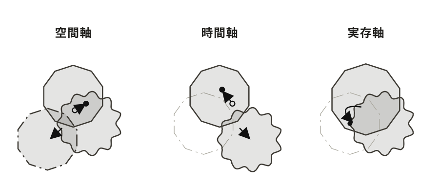

三章を降りてきた読者は、三つの別々の居心地の悪さを味わってきた。見知らぬ他者の労苦の上に自分の一日が立っているという落ち着かなさ。返す当てのない前借りに日々すでに乗っているという後ろめたさ。自分の感情や判断や「我ら」の感覚そのものが外から書き換えられうるという不安。いま、それが一つの手放しの三つの向きだったと分かる。他者へ手放し、未来へ手放し、そして最後に、手放す当の自分を手放す。

### 降下の順序——なぜ空間・時間・実存だったか

三軸を降りてきた読者は、いま、その降下の順序そのものに意味があったことに行き当たる。

三軸は、構造として独立に変動する（第15章）。にもかかわらず、本書がこれを空間→時間→実存の順で並べたのは、記述上の便宜ではない。三軸はそれぞれ、文明レイヤーの**表象能力の階層的展開**によって、異なる段階で初めて可能になった——その歴史の順序が、三章の配列にそのまま現れている。

- **空間軸**——表象能力以前から可能な操作。生物の地理的拡散からすでに作動している。文明レイヤーで新たに「できるようになった」のではなく、「規模が変わった」だけの操作である
- **時間軸**——表象能力の創発によって、初めて可能になる操作。まだ存在しないものを「ある」として現在の決済へ畳む前借りは、表象なしには立ち上がらない
- **実存軸**——表象能力が自分自身を対象化できるまで深化して、初めて可能になる操作。自分の選別構造そのものを操作対象にするには、表象が自己回帰的に深まっていなければならない（第4章 §4-5）

この階層から、難易度の推移が出てくる。空間軸は徐々に**難しくなる**——物理的な有限性が後から漸進的に効いて、対象が狭まる。時間軸は徐々に**容易になる**——記録・契約・金融という表象能力の社会的実装が累積し、足場が強化される。実存軸は急激に**容易になる**。自己回帰的な深化が閾値を超えた瞬間に、表象能力が自分自身に届き、足場が一気に揃う。

ここに、降下の順序が隠していたものが現れる。歴史のうえでは、操作は空間→時間→実存の順で可能になった。だがそれが出そろった後の世界——現代——では、難易度の関係が反転している。最後に可能になった実存軸の操作——認知環境の設計、無垢の知性の設計、社会の盤面化——が、いまや最も容易に作動する。三章を降りてきた読者は、構造の側から見れば、この獲得の歴史を逆向きに辿り直していた。最も古くから人類が問うてきた空間軸の問いから始めて、最も新しく届いた実存軸の問いへ。降下とは、操作能力が獲得されてきた順序の、逆再生だった。

### 自己回復経路の縮減

降りきった地点でも、重心は依然として **-O-** にとどまる。文明レイヤーは消滅していない。固定 Stock の上に、まだ立っている。だが、もう FOE へ係留を回復する経路が、痩せていく。

回復経路の縮減は、三軸の合流として立ち上がる。空間軸では、編入できる外側が尽きる。時間軸では、未来世代の選別構造そのものが痩せる。実存軸では、係留主体（E）そのものが操作対象に取り込まれ、立て直す側の主体が立たない。三軸はそれぞれ独立に作動するが、極まると、いずれの軸でも、回復への経路が構造的に閉ざされていく。

閉ざされた先に何が残るのかは、もう、一つの文明の内側の問いではない。

---

## §22-6　構造記述の到達点、そして、なぜ引き受けるのか 

その問いを、本章は引き取らない。一つの文明の内側を降りてきた構造記述が、そのまま答えられる射程を、問いはもう超えている。本章が最後に担うのは、その手前にある——三つの軸を降りきった読者は、いま、どの地点に立っているのか。

### 三軸の構造記述としての到達点

第20章は、空間軸で O が同時代の他者の選別構造を糧として動く構造として、被覆条件（§19-2）が文明間スケールに及ばないことを取り出した。編入は O 限定で起こり、編入する側が「我ら」として引き受ける範囲が同じだけ拡がる保証はない。第21章は、時間軸で O が未来世代の選別構造を糧として動く構造として、接地条件（§19-2）が時間軸で満たされない局面を取り出した。保つコストの未来転嫁（命題 FUNNEL-1「保つコストの非自動性」、第17章 §17-2）と、錨泊FOE の地の時間的消尽である。§22-1〜§22-4 では、実存軸で O が自系の E を糧として動く構造として、「E が立てる」前提の崩れ、無垢の知性の構造的位置、引受の不等式の成立条件そのものの変質を取り出した。

構造条件（「どの規模まで、保てるか」第19章 §19-2）は、O の深層加速が停まりうる地点の幾何記述だった。三軸の構造記述は、その条件が三方向で具体的にどう作動しうるかの記述である。被覆条件は空間軸で文明間スケールに及ばず、接地条件は時間軸で満たされず、両条件が前提とする「E が立てる」枠組みそのものが実存軸で変質しうる。三軸はそれぞれ、構造条件が満たされない局面を独立に立てている。

### 構造記述の中立性

構造記述としての第Ⅳ部の到達点は、三つの軸が単一の係留放棄の三投影として束ねられ、回復への経路がいずれの軸でも構造的に閉ざされていき、立て直す側の主体そのものが操作の対象に取り込まれている、という地点である。だが、第Ⅳ部全体がそうであったように、ここでも記述は担い手非依存に徹している。この到達点の帰結も、賞賛も断罪も予言も伴わない中立的記述として置かれる。文明の滅ぶべき理由も、救うべき理由も、ここでは述べられない。

ここに、本書の暗さの底がある。だが忘れてはならないのは、ここまで降りてきた読者が、各段で「これは成果だ」と頷いてきたことである。操作能力を高めたことを、もはや願い消すことはできない。引き返してかつての聖域へ戻る道は、すでに閉じている。底とは「やらなければよかった」ではなく、「**もう戻れない、しかも前へ進むのも容易ではない**」という地点である。

### 第Ⅴ部への手渡し

本章が担うのは、構造記述としての到達点を中立的に置くところまでである。この底を引き取るかどうか、引き取るとしてどう立つかは、第Ⅴ部が担う。第Ⅴ部導入は、序論 §4「すべての MANES は宇宙論的に等価である」への帰還——破局を経た解体さえ整合的であり、頓死は破局ではなく循環の一局面にすぎず、急ぐ理由はどこにもないという宇宙論的中立性——のうえで、なお一つの引き受けを実演する位置である。その引き受けに進むか否かは、構造記述の側からは決められない。構造記述は、選択の地盤を提供することはできるが、選択そのものを強制することはできない。本章はその転回を先取りしない。構造記述としての到達点を、構造記述のまま、次へ手渡す。

### なぜ引き受けるのか——底が残す問い

章のはじめに置いた問い——汝が「我」と呼ぶその内側は、汝のものか——は、ここまでの降下で、足場の側から答えられた。内側は、外から書き換えられうる。係留主体そのものが、操作の対象になりうる。

その足場の上で、なお引き受ける側に立つことは、純コストである——係留作動の摩擦、引き受けの仕事、そして「E が立てる」前提の崩れに抗する負荷。引受が純コストにしか見えない非対称は、八セルを操作（O）の報酬関数で読み直すと、幾何として見える。**リターン**は、操作が生きた流動を掴む面——O と F の重なる FOE・FO- に立つ。**リスク**は、操作が流動を欠いたまま固定 Stock を掘る面——O があって F を欠く -OE・-O- に立つ。そして**コスト**は、引受そのもの——E を含む全セルに立つ。

ここに非対称が現れる。リターンの面で測るかぎり、E を欠いたセルのほうが常に安い。FO- は FOE より、-O- は -OE より、引受のコストを負わないぶん、報酬関数の値が高い。だから操作の論理は、構造的に O>E の側——E を落とす側——へ引く。引受は、リターンの面には一切現れず、コストの面にだけ現れる。報酬関数で測るかぎり、引き受けは成功体験を伴わない。

---

**命題 FOE-18（蝶番——引受は純コストに見える）**

> 八セルを操作（O）の報酬関数で読むと、リターンは O∩F（FOE・FO-）に、リスクは O∩¬F（-OE・-O-）に、コストは E を含む全セルに立つ。リターンの面では E を欠くセルが常に安く（FO- > FOE、-O- > -OE）、操作の論理は構造的に O > E へ引く。引受（E）はリターンに現れず、コストにのみ現れ、報酬関数で測るかぎり、純コストにしか見えない。

---

[図22-2：八セルのセル分解——操作（O）の報酬関数で読むと、リターンは O∩F（FOE・FO-）に、リスクは O∩¬F（-OE・-O-）に、コストは E を含む全セル（FOE・F-E・-OE・--E）に立つ。リターンの面では、E を欠くセルが常に安い——FO- は FOE より、-O- は -OE より。引受（E）はリターンに現れず、コストにのみ現れる]
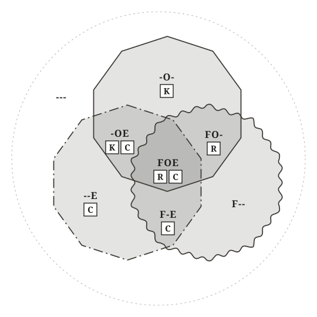

この非対称は、ありふれた場面にも顔を出す。誰かが散らかしたまま去った後を、黙って片づける者がいる。片づけても、報酬関数はそれを測らない。目に見えるのは、片づけの手間を負わずに次へ進んだ者のほうが、その分だけ速く、身軽だということだけである。

同じ場面は、もう二つの向きへ延びる。

散らかしたままにすれば、散らかりはそこに残る。片づければ、片づけたことはどこにも残らない。同じ場所を、一週間前に片づけた者、一月前に片づけた者、一年前に片づけた者——遡るほど、その姿は見えない。保たれた地は次に来る者の足場になるだけで、保った者の側へは返らない（第21章）。

そして、片づける当の構えも、外から触れうる。「片づけなくていいから、早く次に行こう」と声を掛けてくる友人がいる。その友人に悪意はない——そう声を掛ける側が速い地に、友人もまたいる。何度も声を掛けられるうちに薄れるのは、片づけるかどうかの判断ではない。「これは自分がやることだ」という感覚のほうである。その感覚は、宇宙論的な根拠の上にではなく、書き換えられうる一つの座標系の上に立っている（序論 §4）。認知を巡るゲームが有効戦略として立つ地では、その書き換えは競争構造の帰結として進む（§22-2）。引き受ける者は、引き受けるその構えごと、操作の対象の内側にいる。

三度、支えが外れる。引き受けは、報酬の面に現れない。成果としても現れない。引き受けようとする構えそのものにも、拠って立つ地がない。手放しが単一の運動の三投影だったように（命題 FOE-17）、引き受けもまた、空間・時間・実存の三つの向きで、同じだけ支えを欠く。

それでも、引き受けるとしたら、なぜか。

これは構造記述からは答えられない問いである。本書が運べるのは、構造として何が立ち現れうるか、その記述までである。引き受けるか否か、引き受けるならなぜ引き受けるかは、構造記述の外にある。

---

# 第Ⅴ部　百億人の「我ら」へ 千年後の「我ら」へ 

# 第Ⅴ部の序——「我らはここにいる」 

ここまで本書が記述してきた構造は、いずれも、主体に依らず、特定の立場にバインドしない記述であった。同じ構造は、人類という形式の存続に関心を寄せる位置からも、宇宙の一過程として中立に眺める位置からも、等しく観察できる。

一つの文明が頓死しても、宇宙はそれを悲しまない。別の秩序へ組み替わり、いつか別の選別構造が立ち上がる。この視座に立てば、ある文明の頓死も破局ではなく、偶然割れるのが早かった泡の一つ、循環の一局面にすぎない。本書は、この視座が成り立つことを認める。宇宙論的な中立のもとでは、いかなる MANES も他の MANES に優越する根拠を持たない。

第Ⅳ部は、その底で一つの問いを手渡して閉じた——なぜ引き受けるのか。本書は、この問いに、理由では答えない。いかなる理由も、いま認めたばかりの中立からは導かれないことを、ここまでの記述そのものが示しているからである。

---

## 応報の確定性と回帰の不可知性

中立は、無関心と同じものではない。それは、対称性因果（第15章 §15-1）の応報が、どの位相で、どの時間スケールで戻ってくるかという姿として現れる。宇宙が頓死を悲しまないとしても、それは、宇宙論的な地での応報の不在を意味するのではない。

対称性因果が破れて非対称性因果（第15章 §15-2）に分化することで、ある選別構造のもとで局所的な秩序が立つ。その分化は、対称性因果の存立そのものを取り消すわけではない。局所的に折り曲げられて見えなくなったものは、消えたのではなく、接続可能圏 Ω のうちで、別の時間スケールで戻る道を保ちつづける。

この回帰の姿は、確定性と不可知性という二つの面を持つ。

まず、確定性である。対称性因果の応報は、原理として必ず回帰する。そのすべてが回帰するスケールは、宇宙論的——宇宙の寿命のスケールである。あらゆる非対称が、最終的には対称性因果の地に戻る。これは、いかなる選別構造の局所秩序にも例外を許さない。

そして、不可知性である。確定性は宇宙論的スケールで語られるが、部分的な回帰——ある系、ある時代、ある局所に対しての回帰——は、まだらに、不均一に起こる。どの因果が、いつ、どの系に戻ってくるかは、完全には知りえない。これは情報の不足ではなく、文明レイヤーで選別構造そのものが可変であることから来る原理的な不可知である。ある文明の生死にかかわる因果——すなわち頓死が、いつ戻ってくるか。その時期もまた、決定論的には予測できない。

「下げにくさの事後前景化」（空間軸・第20章）、「累積された未来制約の突然の立ち現れ」（時間軸・第21章）、「境界書き換えの隠蔽」（実存軸・第22章）——は、いずれも、この不可知性が文明レイヤーで具体的にとる姿である。回帰が閾値を超えて現前するまで、系の側にはそれを事前に掴む観測可能性が成立しない。同じ機構が、空間・時間・実存の三方向で三度、異なる相貌をとって立ち現れる。

「非線形回収因果の自己診断不可能性」（§22-5）は、この機構を、系が自らのうちで診断しえないという側から呼び直した名にほかならない。外側から「いつ・どこにかは完全には知りえない」と映る不可知性は、内側から見れば「事前には自らを診断しえない」ものとして立ち現れる。同じ一つの構造の、二つの現れである。

確定性と不可知性は、矛盾しない。宇宙論的スケールでの応報の必然と、部分回帰の予測不能とは、同じ一つの構造の、異なる位相での現れである。ここから、本書の中核命題の一つが立つ。

---

**中核命題-5（対称性因果の応報——確定性と不可知性の二重）【階層横断】**

> 対称性因果の応報は、必ず回帰する。そのすべてが回帰するのは宇宙論的スケール——宇宙の寿命——においてである。部分の回帰は、まだらに、不均一に起こる。どの因果が、いつ、どの系に戻ってくるかは完全には知りえない。系の生死にかかわる因果の帰ってくる時期も、決定論的には予測できない。

---

この二重が、第Ⅴ部のバインドが立つ地形を定める。確定性だけがあれば、応報の到来を予期して身構えれば足りる。不可知性だけがあれば、戻りの不在のうちで漂えばよい。だが両者は同時に成り立つ。応報は必ず戻る、しかし、いつ・どこにかは知りえない——この二重のもとで、引き受けの選択は何を意味するか。

---

## 変数の範囲をバインドする

ここから先、本書は自らの立場をバインドする。

バインドをせずに語れば視界は広いが、何も具体的には言えない。バインドすれば具体的に言えるが、その代わりに見えなくなる盲点が生じる。この制約を引き受けないかぎり、「我らはどう生きるべきか」を語ることはできない。誰を、いつまでの射程で「我ら」と数えるかを決めて初めて、その内側での構造条件が明らかになる。

## 百億人の「我ら」へ

空間的な広がりの方向である。本書はこれまで「我ら」を、家族から共同体、民族、人類、地球の一部へと連なる圧縮度の階段として描いてきた。その階段のうち、実存的に厚みを持って体感される「我ら」は、多くの場合ごく狭い範囲にとどまる。第Ⅴ部が選び取るのは、この実存的に厚い「我ら」を、上限規模に達した人類の全体にまで届かせる射程である。その圧倒的な大半は、生涯のうちに顔を合わせることのない人々である。見たことのない相手を「我ら」と数えることは、互いを知り合うことの上には成り立たない。それは一方の側から差し出される関係である。

## 千年後の「我ら」へ

時間的な奥行きの方向である。千年後に生きる人々は、こちらに応えることができない。彼らはこちらと約束を交わせない。感謝も抗議も返せない。それでも彼らを「我ら」と数えるなら、その関係は完全に一方向である。返礼を当てにできない相手に向けて差し出される関係——第Ⅴ部は、この非対称をそのまま引き受ける。

ここでバインドとして宣言するものは、単なる数値ではない。百億人が千年のあいだ存在しているということだけなら、その多くを「実存的我ら」（E）の外に置いたままの道も考えうる。その道ではない。ホモ・サピエンスの文明が百億人前後——複数の推計が指し示す最大規模——に達したうえで、千年の尺度にわたって持続する、という引き受けの範囲の宣言である。

## これは選択であって真理ではない

この選択には、宇宙論的な根拠はない。宇宙は百億人の存続にも消滅にも無関心であり、千年の持続にも一瞬の頓死にも価値の違いを置かない。第Ⅴ部が選び取る変数範囲は、構造記述から導き出されたものではない。構造は、この範囲を選ぶことも、選ばないことも、等しく許す。

したがって本書は、この選択を真理として提示しない。これは第Ⅴ部の引き受けである。別の範囲を選ぶことも、いかなる範囲も選ばずに宇宙論的な中立のうちにとどまることも、等しく成り立つ。本書は、読者にこの選択を強いない。第Ⅴ部の記述は、「百億人の我らと千年後の我ら」——この範囲を共に引き受ける読者に対して意味を帯び、引き受けない読者にとっては、関心の外にある言葉として読まれるだろう。そのどちらの読み方も、本書は妨げない。

本書はこの選択を、隠したまま進めることはしない。どの「我ら」の射程から構造を眺めているかを明示する。それはまず、いま現にここにいる百億人を、「我らはここにいる」と引き受けることから始まる。

---

# 第23章　「我ら」を引き受けるとは何か——好奇心と苦悩の同伴 

「我ら」はいま、何を手にしているか。

大きな操作能力を持っている。手斧でしか切れなかった大木を、いまは森を残しながら切れる技術を持つ。教育と治療、長寿と協調、計算と通信——いずれも操作能力が届くようになったから、手に入ったものである。**操作能力の向上それ自体は文明の出力を生み出してきたものである**。第Ⅳ部がその破れを降りていったのも、この達成を達成として認めたうえでのことだった。そしてまさにその操作能力があったから、**百億人に辿り着きうる**。百億人の命は、いま現に動いているこの操作能力の上にしか乗っていない。安易に手放すことはできない。手放した瞬間に消える命がある。

だが、この操作能力には強い引力も張り付いている。**拡張加速相への引力**——コスト負担も判断遅延も持たない構造に運動が流れ込み、停まれなくなる、あの引力である。第Ⅳ部全体が「破れるのが自然、停まらないのが自然」として取り出したのは、まさにこの引力の構造記述だった。

---

## §23-1　「我ら」はいま、何を手にしているか——削られてきた地形ごと引き受ける 

引力は、これから作動し始めるものではない。すでに長く作動してきた。空間軸の編入、時間軸の前借り、実存軸の内面操作——第Ⅳ部が三つの断面として取り出した単一の運動は、いずれの向きでも、何かを糧として動く運動だった。だから、「我ら」がいま手にしているのは、操作能力と、それに張り付く引力だけではない。その運動が削ってきた後の地形——これも、同じ手の中にある。

何が削られてきたのか。一つの文明が崩れたのち、次の文明が立ち上がるために要るもの——**起動条件**である。三軸の削りは、四つの層に合流する。物理・知識・意味・時間である。

- **物理の起動条件**——森林・農地・地表近くの鉱物・水利系統といった、錨泊FOE の地
- **知識の起動条件**——λ₃ の知識ストックが安定統合相にあり、構造的汚染（「知識の重さ」第9章 §9-3）が支配的になっていないこと
- **意味の起動条件**——λ₁・λ₂ の連なりが世代を越えて生きた装置として作動し、新しい MANES の生成基盤が痩せていないこと
- **時間の起動条件**——双方向の連なり（過去から受け取り未来へ渡す感覚）が反復されていること

四層は、それぞれ独立に痩せるのではない。三軸の作動は、四層を横断して合流する。空間軸のコスト押し出しは物理層と時間層に積もる。時間軸の前借りは時間層と物理層を削る。実存軸の内面操作は、認知を巡るゲームと重心 -O- 滞留の固着として意味層を、即時確定の制度化と社会的 LEFFLA の侵食として知識層を侵す。三軸が極まると、四層すべての起動条件が並走的に痩せていく。

歴史上、ある文明が崩壊しても、次の文明が立ち上がりえたのは、起動条件がなお手つかずに残っていたからである。古代地中海世界の秩序が解体した後、中世ヨーロッパが新しい文明として立ち上がれたのは、森林・農地・地表近くの鉱物といった起動条件が、まだアクセス可能だったからにほかならない。過去の崩壊は、次の文明の起動条件までは破壊しなかった。

「時間的不安定」（第21章）が立った最小の像——翌春のために残された種もみ——が、ここへ戻ってくる。種もみを残せば、次の春が来る。種もみまで食えば、次の春の畑は痩せたまま残る。この地は、「自立の地」（錨泊FOE、第19章 §19-3）の、文明レイヤースケールでの姿である。自立の地とは、文明が係留の層を失っても、個の主体が生きて F に直接接地しているかぎり残る、立て直しの始発点であった。その地は、深掘りと掘り尽くしが浅い層を削るほど痩せ、時間軸では消尽しうる蓄えとして現れる。一つの文明の内側で痩せるその同じ地が、文明レイヤー全体のスケールで痩せていく。立て直しの始発点そのものが、三軸の糧になる。

これに対し、起動条件の消費が**一つの地域に閉じず、地球規模に達した相**では、異なる事態が立ち現れうる。複数の地域が独立に起動条件を保っているかぎり、一つの地域の崩壊は、別の地域からの再起動を許す。地理的多様性が、文明レイヤーの再起動可能性を支える。だが、起動条件の消費が地球規模に及ぶと、この地理的多様性そのものが縮減する。本書はこの相を特定の時代の固有名で名指さず、構造記述として置く。**起動条件の消費が地球規模に達した文明相は、自らの崩壊に対する地理的な再起動経路を、細らせる**。

文明レイヤーは、自らが消費したものによって、自らの失敗に対する次の機会を喪失しうる。回避されたコストが増幅されて回帰するという構造の、その極限形である。回帰する先が、特定の主体でも未来世代でもなく、「次の文明」という文明レイヤー全体の再生可能性そのものになる。「残存と継承の違い」（第14章 §14-6）は、ある文明の内側で「**大きくなるほど、支えにくい**」という命題を立てた。一つの文明が継承を維持できなくなる場合でも、次の文明が立ち上がる可能性が残るかぎり、文明レイヤー全体としての継承は続きうる。だが、起動条件そのものが消尽されると、次の文明という選択肢自体が縮減しうる。一つの文明の内側で立った「大きくなるほど、支えにくい」は、ここで文明レイヤー全体へ移る——「**次の文明が、生まれにくい**」へ。

操作能力と、それに張り付く引力と、その引力のもとで削られてきた地形——「我ら」はいま、この三つを一度に手にしている。

第Ⅴ部のバインドは、この引力も、そのもとで削られてきた地形も、同時に引き受ける。百億人の「我ら」へ届くとは、巨大な操作能力と表裏一体にある無数の盲点を引き受けることである。千年後の「我ら」へ届くとは、巨大な操作能力が生む引力——拡張加速相の止まれなさ——を抱えながら持続する運動を続けることである。空間軸と時間軸の引き受けは、別々の選択肢ではなく、同じ一つのバインドの二つの方向である。

「操作能力的我ら」（O）は、空間・時間・実存の収束（第22章 §22-5）までに見たとおり、もはや手放せない前提として大きく広がっている。動かせるのは、「実存的我ら」（E）——どこまでを「我ら」として引き受けるか——の範囲である。「操作能力的我ら」（O）に「実存的我ら」（E）が追いつかないとき、その差の領域、すなわち**行為は及ぶが引き受けてはいない領域**に、コストが落ちる。「我ら」を引き受けるとは、この差をどこまで、誰の負担で埋めるか、という問いである。

そのうえで、ここから問う。**この「我ら」を、どう引き受けるか。**

引き受け方には、位置がある。同じ操作能力——大きく広がった、行為の及ぶ範囲——を前提としながら、「実存的我ら」（E）をどこまで、どの方向へ伸ばすか、あるいは伸ばさないかで、立場は分かれる。

引き受けは、外から仕事として測れる。だが引き受ける者は、それを内側から負う。まず、この降り方から始める。

---

## §23-2　外から測る、内から負う——「仕事→労働」とそのひろがり 

「不等式の動性」（第16章）で、循環耐久相を三つの文明相の一つとして導出した。中核に置く因果類型は遅延回収因果であること。接続可能圏の縁が広がるにつれて「実存的我ら」（E）を追随させ、「操作能力的我ら」（O）を「実存的我ら」の内に収めようとすること。その追随には、共感・教育・儀礼・物語の反復の仕事が要り、それが継続的な負荷を生むこと。競争環境のもとでは、引き受けの仕事を省く拡張加速相に拡大速度で劣り、構造的に不利な位置に置かれること——これらはすべて、担い手を呼ばない、外からの記述であった。

本章から先、本書は、同じ構造を内側から見直す。外から構造の幾何的な図として描いてきたものが、それを負う主観の側で、どう立ち現れるか。これは、部をまたいで射影法が変わる、ということである。第Ⅳ部は、この場を配置の側から切り取ってきた——重心がどのセルに立ち、O・E の広がりとズレがどう開くか。第Ⅴ部は、同じ場を、引き受ける側から切り直す。第Ⅴ部が問うのは、その切り直しのうえに立ち現れる体験の重みである。

像でいえば——地球上の同じ一点を、上空から射影した地図で見るか、その地に立って見るか、である。地図は、どこに何があり、どこまで届いていて、どれだけ隔たっているかを読ませる。ただし、地図のどこにも、立っている者はいない。地に立てば、同じ土地が別の姿で届く——傾きは身体を牽く力として、道のりは一歩ごとの重さとして、見通せない先は輪郭だけの気配として。そして、地図にはなかった一点が生まれる——「ここ」である。どちらかが正しい図なのではない。地図は、立つ者には見えない配置の全体を読ませ、地は、地図に載らないものを返す。同じ対象への、畳む軸を替えた二つの射影である。

第Ⅴ部の記述は、この視点の転回のうえで進む。本節は、その転回そのものと、それが定める見え方を、最初に据える。

### 仕事と労働——転回の原型

仕事とは、何が・どれだけなされるか、である。力学が、力のなす仕事から主体を剥ぎ取って量として測ったように、第Ⅳ部の記述は、引き受けを構造の面積として幾何的に表してきた。だが、引き受けは、誰かが負わなければ一歩も進まない。前世代から受け取った「我ら」を内側で引き直し、新たに含めるべき相手を認知し、応答すべき者として位置づけ直す。この反復は、装置が自動で行うものではない。一人ひとりの内側でしか起きない。外から仕事と呼んだものは、内側では、その遂行の重さ——労働——として体験される。「『我ら』の境界と因果の創発」（第15章）が「枠を定めて辻褄を合わせる」と定義した引受を、ここでは内側から——それを負う者の労働として——見直す。

仕事から労働へ。これが転回の原型である。だが転回は、この一語にとどまらない。外から構造として記したものは、内側から見るたびに、それぞれの体験の姿をとる。その見え方を定めるものが、二つある。

### 三つの軸は、違う手触りで届く

第一に、何が前景に立つかは軸によって違う。内側から見るとき、現実の流動（F）・「操作能力的我ら」（O）・「実存的我ら」（E）の三つは、同じ重さでは届かない。

「実存的我ら」（E）は、自分の遂行として届く——労働である。負うのはほかならぬこの「私」であり、もがきも重さも内側からじかに体験される。「操作能力的我ら」（O）は、自分を牽く力として届く——引力である。O は安く自走し（第11章）、内側からはしばしば、こちらが動かすものではなく、こちらを引いて止まれなくさせるものとして感じられる。現実の流動（F）は、輪郭だけが届く——流動である。F は固有の原理で動いており、その動き自体は見えず、表面の流れだけが映る。

三つを分けるのは、その軸を動かしている当のものが、主観にどれだけ現前しているかである。E では当のものは「私」自身、O では「我ら」のものでありながら追い越していくもの、F では完全に隠れたもの。労働・引力・流動という手触りの差は、この現前の勾配から来る。以降の各節が扱う体験は、いずれもこの三つの手触りを、向かう先に応じて混ぜた色として立ち上がる。

### 手を伸ばせば、隣にも触れる

第二に、向かう先は選り分けられない。「実存的我ら」（E）を外へ伸ばすとき、伸ばす手は、向かう先のセルを、触れる前には見分けられない（命題 FOE-8「引受の外の不可知」、第16章 §16-6）。だから一つの領域へ向かう手は、狙っていない異質な隣へも、同時に触れる。触れた瞬間、別々の手触りが混じる。

この混じりは、異質を均すのではない。異質を、名の下へ沈める。別々には名指せないまま、一つの——しかし単純ではない——塊として体感される。残るのは、解像されない複雑さ、言葉にしがたさである。そして、狙った先と、触れてしまった先とのあいだのギャップが、慄きや、挫折として返ってくる。

混じりには、深さがある。手を伸ばすほど混じるものは増え、登るにつれて、体感の質そのものが変わっていく。本節は、異質な二つが見分けがつかずに混じる第一段を見込むにとどめ、より深い段は、以降の各節と、本書の閉じ（第27章）へ渡す。

---

## §23-3　なぜ「引き受け」が問いになるのか——小さな「我ら」と大きな「我ら」 

### 慣性で引受が閉じる系、引受に労働が要る系

「我ら」を引き受けることが、大変な労働として、そのようなことが果たしてできるのか、という問いとして立ち上がるのは、ある条件にバインドしているからである。

人口規模が小さく、操作能力の射程が局所にとどまる系——氏族、村落、修道院、地縁の信仰共同体——では、「我ら」の範囲は、伝統・儀礼・血縁・地縁の慣性によって、ほぼ自然に閉じる。操作する範囲と引き受ける範囲が、おおむね重なっている。誰を「我ら」と数えるかは、生まれたときにすでに与えられており、引き直す労働をほとんど要さない。ここでは、「引き受けるとは何か」は問いにならない。引き受けは、問われる前に、慣性が済ませている。本書では、これを錨泊（第19章 §19-3）と呼んだ。

だが、操作能力が巨大化し、行為の及ぶ範囲が地球規模に達すると、この慣性が効かなくなる。操作する範囲は、もはや顔を合わせる「我ら」を遥かに超える。慣性は、見たことのない百億人を「我ら」として閉じることができない。閉じるには、構成員一人ひとりの、自覚的な引き受け——慣性が代行しない労働——が要る。小さな系では、それがなくても成立できた自覚的引き受けが、大きな系では、他の条件が成り立つための前提条件へと格上げされる。

### 回帰という経路

ここで、一つの経路が浮かぶ。小さな系へ戻る、という経路である。

この経路が浮かぶことには、構造的な根拠がある。小さな系では引き受けが軽かった——この観察そのものは、記述として正しい。「我ら」の範囲が生まれとともに与えられているとき、範囲の画定に労働は要らない。応答は顔の見える範囲で完結し、返りも同じ範囲から戻る。引き受けの費用が慣性によって賄われている系では、引き受けは労働として計上されない。大きな系で労働となったものが、そこでは費用なしで済んでいた。小さな系への郷愁は、この費用差を正確に指している。

だから、問いは、その是非ではない。回帰という経路が、構造として何を要求するか、である。

### 慣性は、選び直せない

小さな系の閉じは、慣性の産物であって、選択の産物ではなかった。伝統・儀礼・血縁・地縁は、選ばれたから閉じていたのではない。外がないから、閉じていた。

選択の産物でなかったものは、選択によって復元できない。ここに非対称がある。慣性で閉じていたものを意志で閉じ直せば、それはもう慣性ではない。閉じは、維持を要するもの——労働——に変わる。その労働は、引き受けの労働と向きが逆である。広げるためではなく、広がらないために払われる。

そして、閉じ直す者は、すでに外を知っている。見たことのない百億人の存在も、自らの行為の帰結がそこへ届くことも、知ったうえで閉じることになる。知ったうえで閉じつづけるには、参照しないこと——参照の圏を狭く保ちつづけること——が要る。慣性が済ませていたものを、遮蔽が代行する。

### 二つの着地——規模を縮めるか、勘定から外すか

こう見ると、回帰の経路は二つにしか着地しない。

第一は、操作能力の射程ごと、慣性の届く規模まで縮める道である。この道は整合的であり、本書はこれを排除しない。「不等式の動性」（第16章）が、操作能力ごと縮めて満たす道として置いたものである。ただし、勘定は明示される。現在の人口規模は、いま現に動いている操作能力の上にのみ成立している（§23-1）。射程を縮めるとは、支えうる規模を縮めることである。縮小の幅と、その幅に誰が入るかを定めることなしに、この道は完結しない。

第二は、操作能力の射程はそのままに、「我ら」の範囲だけを縮める道である。行為は地球規模に届きつづけ、引き受ける範囲だけが顔の見える規模へ戻る。外形上、これは費用を払わない道に見える。実際には、行為は及ぶが引き受けてはいない領域——コストが落ちる先——を、意図して開いたまま固定する道である。費用は消えず、勘定の外へ移る。

郷愁が指していたのは、このどちらでもない。慣性が費用を賄っていた状態——払わずに閉じている状態——である。だがその状態を支えていたのは、外がないことだった。外を知ったあとに、この条件は復元できない。残るのは、規模を縮めて払うか、勘定の外へ移すか、の二つである。

本書は、どちらも断罪しない。ただ、第Ⅴ部のバインド——百億人の「我ら」へ、千年後の「我ら」へ——を共に引き受ける読者にとって、二つの経路は閉じている。第一は百億人の規模と、第二は届く先を勘定に入れることと、それぞれ両立しないからである。バインドを引き受けない読者にとっては、どちらも開いたままである。

### 問いは、規模とともに立つ

本章がこれから扱う引き受けの段階と立場の分岐、そしてそこに生じる苦悩は、すべて大きな「我ら」を支える環境に固有である。小さな系には、操作が届かないがゆえに手を伸ばす苦悩もなく、慣性が閉じるがゆえに引き受け方の分岐もない。「我ら」を支える規模が巨大になって初めて、引き受けは労働となり、問いとなり、複数の位置へ分岐する。この支えの規模——ある MANES が暗黙に前提する「我ら」を支える容積——を、本書はすでに一度、構造の側から見ている。「どの規模まで、保てるか」（第19章 §19-4）が、現在支えている規模と将来維持できる規模の引き離しとして取り出したのが、それである。両者の差は量的な連続ではなく、構造条件の質的な段差であり、支えうる規模そのものが、引受の不等式を成立させる困難さの乗数として働く。本章は、この困難が主観的にどう体験されるかを描く。

---

## §23-4　見ることの段階——被覆の二方向と、好奇心と苦悩の同伴 

### 伸ばした手は、四つの先へ向かう

「実存的我ら」（E）を広げるとは、何を「我ら」として引き受けるかを、外へ伸ばすことである。引き受けだけを伸ばした手——まだ生の理解も操作も伴わない手——が、どこへ向かい、何を手元へ繰り入れるか。

「実存的我ら」（E）が向かう先は、FOEモデル（「不等式の動性」第16章）の八セルの幾何では四つとなる。実存が先行したセル（--E）から、生の理解（F）がつながれば F-E、操作（O）がつながれば -OE、両方そろえば FOE、どちらもつかめず外側に向かえば ---。--E の伸びは、この四つのいずれかに向かう。

同じ幾何は、流動だけの側（F--）にも、操作だけの側（-O-）にも立つ。だが本章は --E の四つの方向だけを辿る。なぜならば、F と O と E のうち、内側から主観的な質感を伴うものは E だけだからである（§23-2）。F は文明にとって外側にある別の系の運動である。O は報酬関数に駆動されるものであり、その動きは労働としては体験されない。人間の主観的な質感は、E の運動にしか宿らない。

### 被覆が分けるのは、やりがいと苦悩ではない

一つの方向は、まだ何としても分節されていないものへ向かう。手元の前景から、流動する後景、未分節の領域へと、手を伸ばすほど遠くなる。この方向の途中までは、手を伸ばせば、届いたものを参照可能なものへと繰り入れることができる——見えるようになる。被覆が効く。さらに先、当該系が価値の軸として採っていないがゆえに本来見えないもの——LOT——から、接続可能性そのものが断たれる縁までは、手を伸ばしても見えるようにはならない。被覆は効かない。

ここに一つの境がある。**この境が分けるのは、被覆できるものと、被覆できないものである**——やりがいと苦悩を分けるのではない。なぜそう言い直すのか。被覆が効く側にも、苦悩があるからである。

被覆が効く側は、一様ではない。同じ「見えるようになる」運動が、向かう先によって、まるで違う相貌を持つ。未分節へ向かう手が、まだ生の理解として摑まれていなかったものを摑む——それは**好奇心**である。高揚感と意欲が伴い、新しい発見の興奮がやりがいとして報われる。だが手は、もう一つの方向へも伸びる。操作の手はとうに及んでいたのに引き受けられず、生の理解を剥がれたまま系内に積もっていたもの——そこへ手が届き、それが見えるようになるとき、伴うのは喜びではない。見たくなかったものを見る苦痛、衝撃、拒絶——**業罪の直視**である。

好奇心も業罪も、ともに被覆が効く。ともに見えるようになる。分かれるのは、見えたものが喜びか痛みか——伸ばした手が、どちらの方向へ届いたかによる。

ここで、混じりの規律が、最初の段として働く。**伸ばす手は、向かう先を選り分けられない**。好奇心の方向と業罪の方向とを、手を伸ばす前に仕分ける分解能を、そもそも持たない。だから、好奇心だけを摑んで、業罪を残してくることはできない。見えるようになる喜びへ手を伸ばすその同じ運動が、見たくなかったものをも、同時に手元へ手繰り寄せる。やりがいと苦痛は、選んで分けられるものではない。同じ一つの手の伸びの、表裏である——異質な二つが見分けがつかずに混じる、階段の第一段である。

---

**命題 FOE-19（好奇心と苦悩の同伴）**

> 好奇心と苦悩は、切り離せない。「実存的我ら」は、自らの外側のセルを見分けられない（FOE-8）。ゆえに「我ら」を外へ伸ばす一つの運動は、F-- 方向に --E が接続されて F-E が見えるようになる運動（好奇心の労働）と、-O- 方向に --E が接続されて -OE が見えるようになる運動（文明の苦悩）とを、あらかじめ選り分けることはできない。同じ一つの手の伸びが、その両方を同時に孕む。

---

### 明るい側——好奇心の労働

同伴が孕む二方向のうち、まず明るい側——好奇心の労働——を立てておく。

---

**命題 FOE-20（好奇心の労働）**

> まだ生の理解として摑まれていなかったものへ手を伸ばし、探索によってそれを摑むとき、高揚が伴う。未分節の流動（F-- 方向）へ「実存的我ら」を伸ばし、生の理解を摑む労働（--E→F-E）——その手応えが、好奇心である。文明の苦悩と同じ一つの手の伸びの、明るい方向をなす。

---

### 何を報酬とするかが、挫折を生む

そして、この同伴を何の報酬関数で測るかが、手応えを変える。発見そのものを報酬とする関数のもとでは、好奇心が生の理解に届くこと自体が報われる。だが、報酬を操作可能性の側に置く関数——操作の論理での報酬関数——は、見返り（O）を当てにして手を伸ばす。ところが同じ一つの伸びが引き当てるのは、まだ操作に変わっていない生の理解（労働）と、操作はとうに及んでいたのに引き受けられず積もっていた業罪（純然たるコスト）である。見返りを見込んで伸ばした手が、労働とコストばかりを引き寄せる。操作の論理の報酬関数は、この伸びを丸ごと損として記帳する。挫折は、好奇心が浅かったからではない。報酬を操作の側だけに置いたために、同伴が損として現れるのである。これは、「未来への希望」（第11章）の非対称が、一個人の手応えの尺度に現れた姿である。その非対称とは、操作を強める作動は安く自走し、実存を支える作動は律速で高くつくことであった。操作の論理の報酬関数が支配的になるほど、深く出る。

被覆が効かない側——境の先——には、また別の相がある。手を伸ばしても変換できないものへ、なお接近の張りを保ちつづける——本書が対称性志向と呼んできた構えである。そのとき、撤退すれば無力と虚無が、踏みとどまれば Ω の縁の畏れが生じる。この二つは、好奇心とも業罪とも異なる、より深い苦悩である。だがそれは、「我ら」を縁まで伸ばす者——本章がこれから据える位置——に固有のものであり、その本格的な引き受けは第Ⅴ部の後半に俟つ。本節は、被覆が効く側の二方向と、その選り分け得なさ——好奇心と苦悩の同伴——を据えるにとどめる。

---

## §23-5　四つの立場——どこに錨を下ろすか 

ここから並べる四つの立場は、普遍的な人類の類型ではない。操作能力が巨大化し慣性が「我ら」を閉じなくなった環境で初めて分岐する、四つの位置である。百億・千年の「我ら」を支えるには係留FOE に乗るほかない環境である。そして四つを分けるのは、ただ一つ——好奇心と苦悩の同伴（命題 FOE-19、§23-4）に、どう応じるかである。手を伸ばせば苦悩がついてくる。この逃れられない同伴を、引き受けるか、いかに避けるか。四つの立場は、その四つの応じ方にほかならない。

同じ四つは、引受の不等式の側から見ても四つに分かれる——O ≤ E を破らせて操作だけを外へ拡げる位置、O を縮めて E に合わせ直す位置、O ≤ E を保とうとして揺れる位置、そして O ≤ E を成立側に保つ労働そのものに立つ位置。同伴への応じ方は、そのまま不等式への応じ方である。

一つの比喩を置く。引き受けの手を伸ばすとは、Ω という荒海へ漕ぎ出すことである。錨——重心、すなわち座標系・報酬関数・共存条件（ES）の凝集相——を、どこに、どう下ろすか。それが立場を分かつ。

### ホモ・デウス——伸ばさず、操作だけを広げる

**ホモ・デウス**は、「実存的我ら」（E）を伸ばさない。居心地のよい前景——すでに見え、すでに引き受けた範囲——に「我ら」を閉じ、そのかわり「操作能力的我ら」（O）だけを外へ広げつづける。手を伸ばさなければ、苦悩はついてこない。同伴は、伸ばさないことで回避される。そしてこの前景は、しばしば、かつて伸ばした手が現に報われた成果である。見えるようになり、操作可能になったものたちの、確かな蓄積である。だが操作は引き受けの外で膨らみ、引き受けられなかった差——行為は及ぶが引き受けてはいない領域——が、作動圏の内に盲点として広がる。被覆条件は満たされない。錨を下ろさぬまま外海を航りつづける船が、見えぬ岩礁の海域を進むように、この立場は、盲点を現実が衝く一点に晒されつづける。頓死の側である。この位置に立つのに、特別な悪意は要らない。見えないものは、見ようとする労働なしには見えない。見えないものが見えないことは、圧縮から創発したこの世界そのものの基底構造である。だから、手を伸ばさなければ、人はこの位置に無邪気に落ちる。（脱構築を通過してなお、見えると承知のうえでこの位置を選ぶ純化形もある。それは『どこまでが「我ら」か』（第24章）で、立場の底として改めて扱う。）

### ホモ・コンテントゥス——退いて、内海に錨を下ろす

**ホモ・コンテントゥス**は、伸ばすことそのものをやめ、退く。荒海に苦悩があるなら、漕ぎ出さなければよい。係留FOE を畳み、直接接続が届く範囲——錨泊FOE——まで「実存的我ら」（E）を縮め、己の内海に錨を下ろす。「我らは足るを知る者である」——過剰な伸長を拒むことを、誇りとする。この立場には、理がある。退くとは、F から離れることではない。「我ら」を、自分の手が現に F に届く範囲へ合わせ直すことであり、F 接地そのものは、この位置でも確かに保たれる。ホモ・デウスの果てなき膨張がたどる頓死リスクを、彼は免れる。手を伸ばさぬのだから、苦悩も負わない。だが安定は、退避の代償の上にある。内海は、Ω の動きから断たれている。地形は、退いた者のためには止まらない。波に裂かれはしないが、外海から水が流れ込まないまま地形が動けば、それを掴み直す回路はすでに畳まれており、F 接地は「我ら」の内に保たれなくなっていく。守られた水域はやがて干上がる。乖離である。この外れ方の構造は、『どこまでが「我ら」か』（第24章）で見る。守ることが、干上がることに転じうる。

### ホモ・キュリオセス——前縁へ、だが揺れる

**ホモ・キュリオセス**は、伸ばす。だが、好奇心の方向——見えるようになる前縁——へだけ伸ばそうとする。未知へ踏み出す労働を駆動するのは、好奇心である。「実存的我ら」（E）を伸ばした手が、まだ生の理解も操作も伴わない段（--E）から、探索によって生の理解を摑む段（F-E）へ——この前進を内側から駆動するのが、好奇心にほかならない。

巨大な操作能力を引き受けて、なお手を伸ばす点で、彼は本書と同じ方向を向いている。最も近い同伴者である。だが、前節の同伴が彼を捉える。好奇心だけを摑もうとしても、同じ手が業罪を、その先の虚無を、ついでに手繰り寄せてしまう。見たくなかったものが見え、彼は慄く。ここで彼は、不安定な位置に立たされる。慄いて手を引けば、挫折。承知で突き進めば、消耗。そして、二つの引力が彼を待つ。一つは、好奇心が報われた成功体験——見えるようになり、やがて操作可能になる達成——の手応えである。この手応えに引かれると、彼は「もう十分広げた、この我らで良い」と「実存的我ら」（E）を閉じ、操作だけを伸ばす位置——ホモ・デウス——へ滑る。明るい弧の成功体験は、手を閉じる方へ引く。もう一つの引力は逆を向く。慄きを越え、業罪を引き受けきると、それは責任・使命へと転じる。暗い弧の引受は、手を開く方へ抜ける。突き抜けた先で、彼はもうホモ・キュリオセスではない。

### ホモ・マネス——荒海に錨を据え、手を閉じない

**ホモ・マネス**は、好奇心と苦悩の同伴を、避けずに引き受ける。方向を問わず「実存的我ら」（E）を伸ばし、見えるようになる好奇心も、見たくなかった業罪も、変換できない虚無も、縁の畏れも、等しく向き合う。だがそれは、錨を失うことではない。マネスは、重心を MANES の凝集相に固定したまま、「実存的我ら」の輪郭だけを縁まで伸ばす。錨が動かないからこそ、手がどこへ届いても崩れない。錨を失えば、重心は手の伸びを追って虚無へ落ち、人格は崩壊する。ホモ・マネスとは、荒海のただ中に錨を下ろし、波に揉まれながら、なお手を閉じずに耐える位置である。報われない労働を負い、苦悩を負ってなお、手を閉じない。マネスが立つのは係留FOE のうえであり、それを地に保つ係留の仕事を引き受けるのが、この位置である。本書が第Ⅴ部で引き受けるのは、この位置である。

ただし、錨を固く据えることは、下ろした座標系の妥当性を保証しない。揺らがずに凝集していることと、その座標系が妥当であることとは、別々の問いである。本書がこの位置を引き受けるのは、その座標系が真理だからではなく、錨を据えなければ手の伸びが重心を虚無へ引き、係留の仕事そのものが成り立たないからである。何を錨とするかは、なお開かれている。そして、この位置が他の三つに優越する宇宙論的な根拠は、ない。あるのは、部の冒頭で宣言したバインドとの整合だけである。

四つは、別の人類像ではない。同じ巨大な操作能力を前提に、好奇心と苦悩の同伴へどう応じるかが違うだけである。ホモ・デウスは伸ばさぬことで、ホモ・コンテントゥスは退くことで、同伴を避ける。ホモ・キュリオセスは避けようとして避けきれず、二つの引力のあいだで揺れる。ホモ・マネスだけが、避けずに引き受ける。本章の副題「好奇心と苦悩の同伴」が指すのは、この逃れられない同伴と、それを引き受ける位置のことである。

### 四つの着地——成長と虚無

四つの立場が向き合う着地には、被覆の二方向（好奇心・苦悩）のほかに、両方向が揃って届いた着地と、どちらも届かなかった着地がある。前者が成長、後者が虚無である。明・暗の二方向とあわせ、--E の四着地を対称に立てておく。

---

**命題 FOE-21（成長の実感）**

> 伸ばした手が生の理解を摑み（F）、やがてそれが操作可能になる（O）とき、両方向が揃って届いた着地——FOE——に至る。--E から FOE への到達は、文明の成長・発展の実感として現れる。好奇心の労働が報われ、操作の射程が広がった手応えである。

---

その対極に、もう一つの着地がある。

---

**命題 FOE-22（虚無への落下）**

> 「実存的我ら」を伸ばした手が、生の理解（F）にも操作（O）にも届かず、どちらの方向も摑めないとき、着地は --- になる。錨——重心——を固定せずに手だけを伸ばせば、重心は手の伸びを追って --- へ落ちる。これが虚無であり、両方向が揃った着地（成長・FOE）と対をなす、両方向とも届かなかった着地である。E 拡張が構造的に孕むリスクである。

---

## §23-6　苦悩はどこから来るか——先見と後知 

ホモ・マネスの苦悩は、どこから来るのか。前節では、それを、変換できないと承知でなお手を伸ばしつづける、報われない労働として見た。だが同じ苦悩は、引き受けの側からも記述できる。そして引き受けの側から見ると、苦悩は、知っていることからではなく、引き受けていることから来ることが見えてくる。

### 知ることと、引き受けること

何を前もって見通せるかは、知っているかどうかだけでは決まらない。当該系の知力が、ある事柄に及んでいても、それが「実存的我ら」（E）の内に入っていなければ、その喪失を前もって見通すことはできない。知ることと、引き受けることは、別である。

殺した敵兵の胸ポケットに、家族の写真がある。それを見た瞬間に、いままで「それら」であった者が、「我ら」に変わる。知力は、その者にずっと及んでいた。敵もまた人間で、家族があり、帰りを待つ者がいる——それは、知ってはいた。だが、「実存的我ら」の内には、いなかった。知ってはいたが、引き受けてはいなかった。だから、その喪失を前もっては見通せず、失ってから知る。後から、「我ら」を失ったと知る。

前もって見通せる範囲——先見できる範囲——は、知力が及び、かつ「実存的我ら」（E）の内にある、その重なりにしかない。知力をいくら深めても、引き受けていなければ、先見はできない。失ってから知るほかない。

### 引き受けるほど、見通す喪失は増える

ここから、苦悩の正体が見える。「実存的我ら」（E）を広げるとは、前もって見通せる範囲を広げることであり、それは、前もって負う苦悩を広げることにほかならない。引き受けた相手の喪失を、起こる前から見通してしまう。引き受ければ引き受けるほど、見通す喪失は増える。百億人を「我ら」として引き受けるとは、百億人を失いうるという見通しを、起こる前から負うことである。これが、係留FOE のうえで百億・千年を引き受ける環境でホモ・マネスが苦悩を避けがたい理由である。

この先見と後知の差は、一人ひとりの内にとどまらない。文明の規模でも現れる。同じ「それでも」と手を伸ばしつづける文明のなかにも、見える範囲が浅く、破局に撃たれてから喪失の痛みを覚える系と、知力が深まって破局の巨大さに気づき、撃たれる前から全容を見て負う系とがある。両者を分かつのは、戦略の選択ではない。見えている範囲——知力と「実存的我ら」（E）の重なり——の差である。そして、深く見た系ほど、前もって全容を負うぶん、苦悩は重い。

### 喪失を見てしまえば、引き返せない

しかも、深く見てしまうことには、引き返せなさがある。一度見えてしまったものを、見なかったことにはできない。撃ってから知る後知の苦悩には、もう戻れない。自分が撃った敵兵を「我ら」のひとりとして喪失してから知る苦悩が後知の苦悩であるとするならば、自分が対峙する者に限らないあらゆる敵兵、あるいは友軍の兵の死を、いずれも起こりえる喪失として抱えることが先見の苦悩である。「実存的不安定」（第22章）で、操作能力を高めた文明が「もう戻れない」——退却の扉は閉じている——と記したのは、成果の不可逆だった。見ることにも、同じ不可逆がある。全容を見てしまった文明に残されているのは、先見の重い苦悩を負いつづけるか、それとも見るのをやめて身を引くか——その二つだけである。

この苦悩から逃れる道は、ある。引き受けの手を閉じればよい。前もって見通すのが苦しいなら、見通せる範囲——知力ではなく、引き受けの範囲——を狭めればよい。失ってから知るほうが、起こる前から負うよりは軽い。だが手を閉じた瞬間、それはもう循環耐久相ではない。循環耐久相とは、苦悩を負わずに済む位置ではなく、先見の苦悩を負ってなお、「それでも」と手を閉じない位置である。

---

## §23-7　二重に払う——引き受けの労働と流れ込むコスト 

ホモ・マネスが負うのは、先見の苦悩だけではない。「不等式の動性」（第16章）は、循環耐久相が競争環境のもとで負うコストが二重になることを、外から記した。同じ二重を、内側から見る。

### 自業自得と他業自得

第一は、自らの引き受けに伴うコストである。本来見えないものへ手を伸ばし、変換できないと承知で接近の張りを保つ——報われない労働。これは、自らが「我ら」を広げようとすることから生じる。自業自得のコストである。

この報われなさは、気分の記述ではない。SFOK参照系が参照の主経路となるまで深く掘られた文明では、報酬関数が現に観測できる応答は参照系の側で速く軽く立ち、F の応答は連鎖を遡って遅く重く届く（「参照されるから、存在する」第18章 §18-3）。報酬の勾配は、参照されるものの側で立つ。引き受けの手は、その勾配に逆らって、参照されていないものの側へ——LOT の側へ——伸ばされる。捕獲——報酬の終端が参照系へ移る引き込み——が勾配を下る作動だとすれば、対称性志向の労働は、ただ独りで勾配を登る仕事である。報われない労働の「報われない」は、構造の記述である——報酬の立つ向きが、逆なのである。

第二は、自らの引き受けからではなく、引き受けを省いた他者から流れ込むコストである。盲点を残し、引き受けられなかった差を外へ送り出した者が吐き出したものは、消えはしない。同じ現実の地形を共有する以上、それは、なお手を伸ばしつづけている者の領域へ流れ込む。ホモ・マネスは、自らの引き受けの拡張に伴うコストだけでなく、引き受けを省いた他者が送り出したコストをも、自らの遅延回収因果として引き受けることになる。他業自得のコストである。これが業罪の直視にほかならない。操作は及んでいたのに引き受けられず、生の理解を剥がれたまま積もったものへ、それがどこに起因しているかに関わらず、「実存的我ら」（E）を伸ばして引き受け直す労働である。

---

**命題 FOE-23（文明の苦悩）**

> 引き受けから剥がれたものを引き受け直すとき、苦悩が伴う。操作は及んでいたのに引き受けられず、生の理解を剥がれたまま積もったもの（-OE）へ、「実存的我ら」を伸ばして引き受け直す労働（--E→-OE）——その直視が、文明の業罪の苦痛である。

---

### 先見したものを見せることが、攻撃を呼びこむ

この他業自得には、物理的に流れ込むものだけでなく、もう一つが含まれる。見えないものを見せようとする労働は、しばしば、攻撃を引き寄せる。狭い範囲しか引き受けていない者にとって、その範囲の外にあるものを見せようとする者は、ありもしないものを語る者——虚言を弄する者——として現れる。見えないものは、見ようとする労働なしには現れない。だから、引き受けていない者の側からは、見せ手の差し出すものが、本当に捏造として映る。その帰属は、その狭い範囲の内側からは、誠実ですらある。こうして、ホモ・マネスは、手を伸ばして見たものを差し出すことそのものによって、攻撃を呼び込む。

この対立は、正しい主張が信じられない、という形をしていない。より深い。ホモ・マネスが差し出すものは、支配的な射影法——多くの場合、拡張加速相のそれ——にとっての LOT、すなわち「操作能力的我ら」（O）の参照が届いていない側のセルから来る。だから、その枠の内側では復号されない——ここまでは、構造として確定している。だが、差し出している手が、そのどのセルに立っているかは、別の問いである。現に F に触れた F-E——O が見落としている F の報せであり、F が動くとき、その動きが「我ら」に届く数少ない経路——なのか。それとも、F に届かないまま実存だけが立った --E——見せ手自身の枠が生んだ像であり、F の動きを何も運ばないもの——なのか。支配的な枠から見れば、どちらも等しく復号できず、等しく捏造として映る——攻撃は、二つを区別せずに落ちる。しかも、この区別は、差し出した日に固定されてもいない。F は自らの軸で動く——E の側の何の作動もなしに、--E の手の下へ F が流れ込み、像が報せに変わることがある。逆に、触れていた F が去り、報せが像に変わることもある。そして、そこに積もったものが、どの枠の内で回収される因果か——遅延して返るのか、回収の断絶へ落ちて誰にも返らないのか——も、差し出す時点では確定していない。応報は必ず戻る。しかし、いつ・どこにかは知りえない——この部の冒頭で立てた、回帰の不可知性である。この不可知性は、攻撃する側にだけ働くのではない。見せ手自身にも、同じ深さで働く。マネスは、正しいと確定した主張を退けられているのではない。**正しいかどうかが、争いの立つ枠の内側では確定しない主張を、確定しないと知りながら、差し出している**のである。

これは、F に直接触れることの宿命である。手が F に触れているという事実は、触れた手の差し出す主張の正しさを保証しない。錨の固さが、下ろした座標系の妥当性を保証しない（§23-5）のと同じ非対称が、ここにも立つ。労働の深さは、主張の確からしさの証しにならない。見せ手の主張を証しうるのは、回帰の到来だけである。その証しさえ、届いたときの重なりを証すのであって、差し出した日の手を証すのではない。そしてその到来は、争いが立っている枠の外——別の世代、別の場所——にしか届かないかもしれない。ホモ・マネスは、自らの正しさの確定を、自らが立つ枠の内側では受け取れないまま、差し出しつづけることになる。

ここで、二つのコストは独立ではない。第一の労働——手を伸ばして見ること——を払い、それを差し出すからこそ、第二のコスト——攻撃——を引き寄せる。同じ一つの行為に対して、ホモ・マネスは二重に払う。見る労働と、見せたことへの反発と。しかも、この支払いには、正しさの担保が付かない。

### この重さは、構造から来る

ゆえに、ホモ・マネスはコストが重い。引き受けを省く位置と競争環境で並走すれば、拡大の速度で劣り、負担で勝る。これは、能力の差でも、戦略の優劣でもない。引き受けの範囲の差から、帰結する。本書は、この不利を、不当として描かない。誰が本物の見せ手で、誰が虚言の弄し手かを、本書は裁定できない。本書もまた、ある範囲の内側で書かれており、その外を超越的な視点から見通せはしないからである。加えて、裁定の基準となる回帰の到来そのものが、争いの枠の内側には、まだ届いていない。描けるのは、機構だけである。狭い引き受けの範囲が、見る労働を避けるために、見せ手の差し出すものを悪意や捏造、虚言というラベルに帰属させる。LOT は見えないのだから、見せ手が差し出すものを LOT として選別の外に外している者たちにとって、その範囲の内側からは、見せられたものを拒絶することに偽りはなく、誠実である。ホモ・マネスは、このような機構の宛先として、攻撃を負う。

### 応答の名の手前で

本章は、循環耐久相を引き受けるとはどういうことかを、内側から降りてきた。手の中の棚卸し——操作能力と、それに張り付く引力と、削られてきた地形——から始め、それごと引き受けるバインドを、負う者の手元に降ろしてきた。外から仕事として測られてきたものは、内側では労働として立つ。慣性が「我ら」を閉じてくれない規模では、その労働そのものが問いになり、小さな系への回帰は、価格の付いた二つの着地しか持たない。伸ばした手は、向かう先を選り分けられない。見えるようになる喜びと、見たくなかったものの直視とが、同じ一つの伸びについてくる。その同伴への応じ方が、デウス・コンテントゥス・キュリオセス・マネスという四つの立場を分けた。苦悩は、知ることからではなく、引き受けることから来る。引き受けるほど、起こる前から見通してしまう喪失は増える。そして引き受けは、二重に払わせる——自らの労働と、引き受けを省いた者から流れ込むコストと。その支払いに、正しさの担保は付かない。

本章は、この重さの底で閉じる。同伴を避けずに引き受ける位置とは、先見の苦悩を負い、担保のないまま二重に払い、なお手を閉じない位置である。四つの立場のうちその位置に、本章はホモ・マネスという名を与えた。だがそれは、四つの応じ方を並べ、そのなかの一つを外から指した名である。名にも、外と内がある。外から指す立場の名は、すでに置かれた。その位置に現に立つ者が内側から発する応答の名は、まだ置かれていない。本章は、それを置かない。名が立つには、足場が先に要る。この引き受けが、係留FOE のうえで実際にどこまで成り立ちうるのか。それを保つ条件は何であり、その足場はどちらへ、どのように外れうるのか。その範囲をどう定め、拡張加速相からそこへ移れるのか。そして——脱構築を通過してなお、見えると承知のうえでこの引き受けを拒む最強の対峙相手に、どう向き合うのか。これらの問いは、本章の手には余る。『どこまでが「我ら」か』（第24章）が引き受ける——名は、その終わりで置かれる。

---

# 第24章　どこまでが「我ら」か——引受の不等式へのバインド 

「我ら」を、どの範囲で、いつまで保てるか。

『「我ら」を引き受けるとは何か』（第23章）は、循環耐久相を引き受けるとはどういうことかを、労働として、先見の苦悩として、二重の支払いとして、内側から描いた。その底に残された、なお手を閉じない位置には、立場の名はあっても、そこで発される応答の名が、まだ置かれていない。「百億人の『我ら』を引き受けるとはどういうことか」という第23章の問いは、ここで、「その『我ら』を、どの範囲で、どれだけの時間、保てるのか」という問いへ進む。名は、その測量の果てで置かれる。

第Ⅳ部は、この場を**重心の側**から見た。操作と引受が分かれた重心が、どのセルへ滑るか——それが頓死と乖離の幾何であった。第Ⅴ部は、同じ場を**被覆の側**から見る。「実存的我ら」（E）が、「操作能力的我ら」（O）をどこまで覆いうるか。重心がどこへ落ちるかではなく、覆いがどこまで届くか——視点を裏返したところに、循環耐久相を内側から成立させる条件が立つ。

---

## §24-1　保てる範囲の底と、バインドの落ちる深さ 

質的な記述（第23章）から、何がどれだけ満たされれば成立するのか——保てる範囲の底は何で定まるのか——という構造的記述へ移る。まず、測量から始める。

### 保てる範囲の底は、二層である——所与の λ₀ と、係留が保つラムダ帯域

「保てる範囲の底」と一語で呼びうるものは、二つの異なるものに分かれる。分けるために、「参照されるから、存在する」（第18章）の装置を一つ、呼び戻しておく。文明の作動は、個の F と E との直接接地からの距離に応じて、段をなして積み上がっている——個が F に直接触れる段から、信頼が信頼を継ぐ段へ（漏斗モデルの多段圧縮構造、第18章 §18-2）。この、選別構造が現に立ち上がっている段の全体が、**ラムダ帯域**（展開実現帯域 λ）である。ラムダ帯域は深さを持ち、段には浅いほうから添字が振られる——λ₀ から λ₁、λ₂ へと、F からの距離が一段ずつ離れていく。

**所与とは、系の作動を要さずに定まっている性格をいう。定立とは、系の作動によって保たれる性格をいう。** 保てる範囲の底は、この二つの性格に分かれる——**所与の λ₀** と、**係留が保つラムダ帯域の深さ**である。

**ラムダゼロ点（λ₀）** は、ラムダ帯域のいちばん浅い段であり、係留の仕事を要さずに立つ。個の主体が、生命活動を営みながら、現に F に直接接地していること——それ自体は**個**であって、共同体としての広がりを持たない（第19章 §19-3）。共同体としての広がりは、この点が直接接続——対面しうる範囲の紐帯——によって共有される範囲として立つ。それが**錨泊FOE**、文明レイヤーの媒介装置を経ずに FOE が成り立つ地である。その広がりはおおむねダンバー数の水準で頭打ちになるが、縁は鋭い境界ではなく、直接接続と媒介接続の移行帯である。錨泊FOE で立てられる出力——これが、文明が係留に依存せず自立して立てられる出力の下限に相当する。

文明が係留の仕事を払えなくなっても、個の主体が生きて F に接地しているかぎり、この地は残る。剥落はここで止まる。破局が起きようと起きまいと、係留なしに立つ地であることは定まっている——所与にして、絶対である。

ただし、所与なのはこの段の性格であって、地の豊かさではない。この地で立てられる出力は、森林・農地・地表近くの鉱物といった起動条件（第23章 §23-1）の残高に依存する。剥落はつねにこの地で止まるが、止まった次に立てられるものは、以前と同じものであるかどうかはわからない。

**ラムダ帯域の深さ**は、係留の継続によって存立する。ダンバー数を超えて「我ら」を束ねるには、「実存的我ら」（E）の媒介接続が要る。その媒介を係留で地に保ち、重心が FOE にとどまるとき、**係留FOE** が成り立つ。広がりに定義的な上限はない。原理的には、どこまでも広く、どこまでも深く。だが、保つ仕事が止めば、媒介接続は地から剥がれ、ラムダ帯域は λ₀ まで剥落する。係留の仕事が続くかぎりでのみ保たれる——定立にして、相対である。

二つは別の存在論を持つ。λ₀ は性格として定まっている所与であり、ラムダ帯域の深さは係留の作動として保たれる動的な定立である。添字の 0 が、この非対称を運ぶ——λ₀ だけが、保つ仕事を要さない。

### 百億・千年の「我ら」は係留FOE にしか実現されない——その深さは λ₄・λ₅ に及ぶ

では、第Ⅴ部のバインド——百億人の「我ら」へ、千年後の「我ら」へ——は、「文明の出力の幾何」（第17章）の漏斗のどの深さに実現されるか。

λ₀ は個の F-E 接地であり、その共有はダンバー数の水準で頭打ちになる。直接接続が届く範囲の外までは、構造上届かない。百億は、互いに顔を合わせる範囲では到底ない。千年は、一人の生涯の時間スケールでは到底ない。**百億・千年の「我ら」は、上限のない係留FOE にしか実現されない**——λ₂ 以深、信頼の連鎖のラムダ帯域である。

しかも、この規模と時間は、λ₃——蓄積そのものへの信頼——でも足りない。百億の作動を束ねる蓄積は、どの参加者にとっても参照臨界（「知識の重さ」第9章）の向こうにある。それに触れる参照は、SFOK参照系（第18章 §18-2、λ₄）を経由するほかない。百億人の「我ら」は、λ₄ を構成的に通る。

千年は、その参照系自体を世代を越えて手渡すこと——参照系の蓄積化（λ₅ の圧）——まで要求する。規模と時間の代価は、深さである。

そして深さは、ただの距離ではない。λ₄ には、固有の機構が二つ働いている。参照の実務がすべて参照系を経由するため、参照系に載らないものは「参照されていないもの」ではなく「存在しないもの」として扱われる——参照系の縁と Ω の縁の同一視（命題 FUNNEL-3、第18章 §18-3）。そして、フィードバックの終端が F から参照系へ移り、供給が参照系の基準へ最適化されていく——捕獲（命題 FUNNEL-5、第18章 §18-3）。百億・千年の「我ら」が λ₄ を構成的に通るとは、成立条件がこの二つの機構の内側で満たされねばならなくなる、ということである。

すなわち、百億・千年を引き受けるとは、ラムダ帯域をその深さで保つ仕事を引き受けることである。係留FOE は係留の継続にのみ存立するから、この引き受けは、ある一時点での達成ではなく、時間を通じて続けられる作動として要請される。「報われない労働」の正体は、ここにある——大きな「我ら」は、絶えず係留されつづけているラムダ帯域のうえにしか、乗れない。手を止めれば、そのラムダ帯域は地から剥がれる。

ただし、このラムダ帯域の深さは、「操作能力的我ら」（O）の広がりが課す要求でもある。もはや手放せない前提として広がった操作能力の上に、すでに動いている百億の命が乗っている。引受の不等式——「操作能力的我ら」（O）≤「実存的我ら」（E）——を成立側に保つには、「実存的我ら」（E）の被覆が、この操作能力の広がりまで届かねばならない。

原型の不等式のもとでは維持の道は二つあった——「操作能力的我ら」（O）を縮小するか、「実存的我ら」（E）を拡大するか。だが「操作能力的我ら」は、いま乗っている命の数より下へは縮められない。残る道は、ラムダ帯域のその深さで「実存的我ら」（E）の被覆を保つ、ただ一つである。

### 深さに、誰が生きているか——房と漏斗

この深さの全体を、俯瞰しておく。ラムダ帯域の各段は、抽象的な層ではない——それぞれの深さの対象に、現に接地して働く一人ひとりの主体がいる。一つの比喩を置く。この分布は、漏斗に盛られた**葡萄の房**である。一粒が、一人の主体とその接地である。浅い段は厚い——生活の F に直接触れる無数の手（λ₀）、語りと追体験の共同体（λ₁）、顔を知る者どうしの信頼（λ₂）。ここでは粒が密に重なり合って、房をなす。**媒介接続とは、粒と粒の重なりのことである**。段が深まるほど粒は少なく、離れて、孤立していく——蓄積を自分で読み、彫り直す者（λ₃）、参照系そのものに触れて保守する者（λ₄・λ₅）。深い段の一粒は、房の賑わいから遠く、細い管の中で、その段の F に一人で触れている。

一粒を取り出して、割ってみる。どの粒の内にも、同じ層がある。芯には、自分の手が現に触れている手応え——その人の λ₀——がある。芯を包む果肉は、追体験と、信頼と、読める記述と、使っている参照系——λ₁ から λ₄ までの、質感が一段ずつ薄まっていく厚みである。いちばん外の皮は、誰が置いたのかも知らないまま生の形を決めている、名前のない枠——λ₅ である。深さは、文明の構造であると同時に、一人ひとりの内側の層でもある。どの粒も同じ層を持ち、どの深さで接地するかだけが違う。

そして、房は漏斗の内に納まらない。いまの漏斗——現在の選別構造が汲み上げる範囲——の外側にも、粒は散っている。報酬関数では報われないまま、それぞれの F に触れつづけている者たちである。この外の粒が何のためにあるのかは、いまの漏斗の内側からは評価できない。その意味は、地形が動き出したとき（§24-2）に現れる。

[図24-1a：房と漏斗——左は、ラムダ帯域の段。中央は、その深さに分布する個々の主体（一粒＝一人の接地）である。浅いほど粒は密に重なり、重なった場所は濃くなる——重なりが媒介接続だからである。深い段ほど重なりは減り、粒は孤立して接地する。漏斗の外にも、報酬関数では報われない接地が散在する。粒は簡略に円で描く——精密には、各粒は有限個の軸で世界を切り取る多面体である（第1章）]
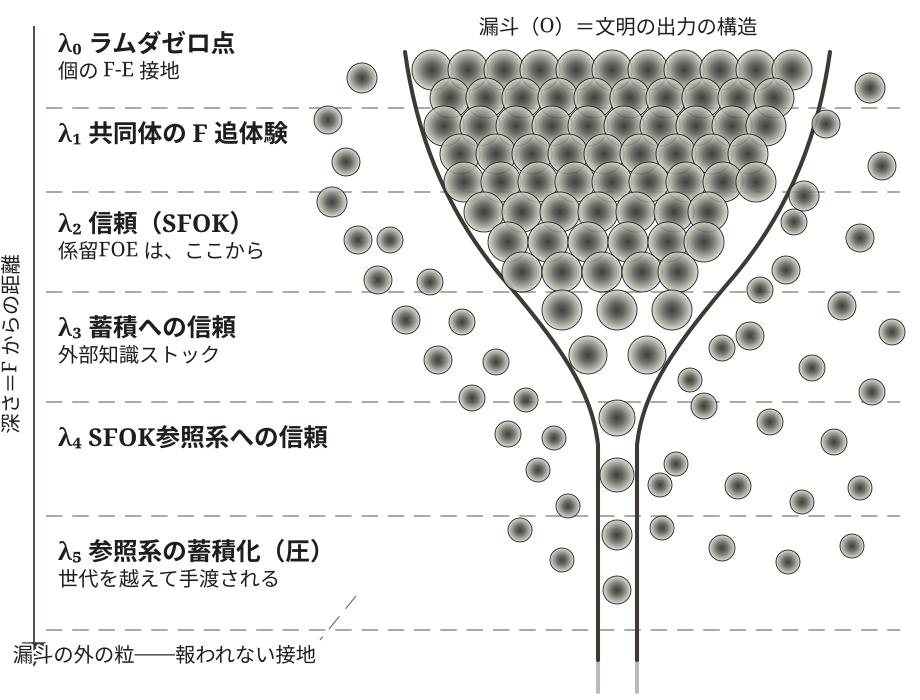

[図24-1b：一粒の内部——芯には、自分の手が現に触れている手応え（その人の λ₀）がある。芯を包む果肉は、追体験と、信頼と、読める記述と、使っている参照系——λ₁ から λ₄ までの、質感が一段ずつ薄まっていく厚みである。いちばん外の皮は、誰が置いたのかも知らないまま生の形を決めている、名前のない枠（λ₅）。濃さは、手が届いているかを表す。どの粒も同じ層を持ち、どの深さで接地するかだけが違う]
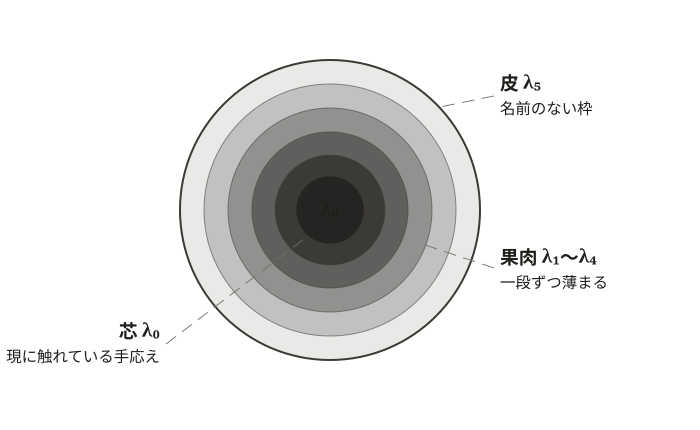

---

## §24-2　文明の痩せ尾根の地形——二つの構造条件と、その上の四つの位置 

ラムダ帯域は、何によって保たれ、どこで外れるのか。保つ条件は二つある——**被覆条件**と**接地条件**（「どの規模まで、保てるか」第19章 §19-2）。外れる方向も二つある——漏斗の浅い側と、深い側。条件と方向は対応する。被覆条件は浅い側で破れ、接地条件は深い側で破れる。循環耐久相がとどまるのは、二つの破れに両側から挟まれた場所である——この節に地形の言葉が要るのは、そのためである。まず、被覆条件から。

### ラムダ帯域を保つ条件——被覆条件

被覆条件とは、**「我ら」の被覆——「実存的我ら」（E）の射程と輪郭——が、漏斗の深さに及んでいること**である。文明は技術と組織と物理基盤を多段に圧縮して、漏斗を深く彫り、急峻な傾斜のうえに大きな出力を立てる。その漏斗の深さに、「実存的我ら」（E）の被覆が及んでいるかどうかが、ラムダ帯域がその深さで保たれるか、破れるかを分ける。

被覆は、範囲だけを名目的に広げても及ばない。「人類は一つ」と唱えるだけでは、被覆にならない。被覆が及ぶのは、自覚をもって行使される影響力——「実存的我ら」（E）へ向けて意識的に引き受けられる関与——を経たぶんだけである。引受の不等式が破れるのは、「実存的我ら」（E）が名目として小さいからではなく、自覚をもって及ぶ影響力が小さいからである。ティベリウスは、この自覚的な影響力が大きく、結果として漏れ出る影響は小さかった。彼の判断は帝国全土の人民の生死に及んだが、地球環境への影響は乏しかった。現代の一個人はその逆で、人間社会への自覚的な影響力は小さいが、消費と排出を通じた無自覚の影響は地球規模に及ぶ（序論 §1）。覆いを広げるとは、この自覚的な影響力の側を広げることであって、名目の範囲を唱えることではない。

被覆条件が破れたとき何が起こるか。漏斗の深さに被覆が届かない領域では、「実存的我ら」（E）の外側で操作が及ぶ。操作の論理が前景化し、操作の帰結が引き受けの外へ落ちる。作動圏の内側に、操作は及ぶが引き受けてはいない領域——**盲点**——が広がる。これが、引受の不等式が O > E へ破れるということの、被覆側での姿である。盲点は地形の内側にあるから、いつか現実がそこを衝く。生死にかかわるものが盲点に入ったとき、文明は Ω との接地を保てなくなる——**頓死**である。引受の不等式が破れたまま運動が続き、ラムダ帯域は浅い側から破れていく。

### ラムダ帯域を保つ条件——接地条件

第二は、**接地条件**である。これは、**漏斗の深部に、現に F に接地する主体——F 接地者——が「我ら」の内に生きて保たれていること**である。

係留FOE は、媒介接続によって「我ら」を直接接続の範囲の外へ束ねている。各成員は、自分自身でありとあらゆる F に接地しているのではなく、別の誰かが F から得た FOE を信頼することで、間接的に自分自身が接地できる F を超えた範囲に接続している（第18章 §18-2、展開実現帯域 λ₂ 以深の構造）。だが、信頼の連鎖だけが伸びて、「我ら」の内側に現に文明の出力の源泉となっている F に直接接地している主体が一人もいなくなれば、係留FOE は、文明の出力が拠り所としている F からのフィードバックを見失う。

そのときラムダ帯域は、形だけ残って、地から剥がれる——λ₀ を内に失ったまま、深さだけが保たれる。漏斗の深部では、信頼の連鎖が**自己言及相**——F 由来の入力が零へ向かう極限相（第18章 §18-4）——に滑り込んでいるか否かが見えなくなり、いずれ、自系の出力を入力にして次の圧縮をする、入れ子の自己言及が回り始める。

この破れは、被覆条件の破れと形が違う。あちらでは、不等式が O > E へ「越える」——「実存的我ら」（E）の届かない外側で、操作が広がっていく。こちらには、越える動きがない。個の E と F との接地が失われることで、O ≤ E という関係そのものが、地から浮く。成立は形の上で保たれたまま、空洞になる。これが、ラムダ帯域が乖離する方向の壊れ方である。

接地条件は、自覚的な影響力では満たせない。F 接地は、伸ばす手が現に F に届くかどうかであり、届く保証は与えられない（命題 FOE-8「引受の外の不可知」、第16章 §16-6）。「我ら」の内に文明の出力を支えている F 接地者が含まれることを保つには、間接接続の階梯のどこかに、その F に現に手を伸ばす個の主体を生きて含みつづける必要がある。これは、被覆を広げることと別の作動である。

なお、λ₄ 以深では、この条件に参照系の側の半身が重なる——生きた F 接地者への参照が、SFOK参照系のうえで保たれていること（第18章 §18-3）。生きて接地する主体も、参照系から落ちれば、連鎖にとっては居ないに等しい。

### 地形が動くなかで保つ——再編成余地

被覆条件と接地条件は、ある一時点の関係ではない。新たな操作能力が投射されるたびに漏斗は深まり、被覆の分布は変動する。F 接地の場所も、地形の動きとともに移る。一時点で両条件が満たされていても、地形が動けば、その時点の充足だけではラムダ帯域は保てない。

そこで要るのが、**再編成余地**である。これは、別の実装へ組み直すために動員できる、未固定の遊びを指す。LEFFLA（「LEFFLAとLOT」第3章）が、係留FOE の係留の層に現れたフラクタルな下位の姿である。射影法のもとでの未評価領域だった LEFFLA が、ここでは媒介接続の実装の遊びとして現れる。

再編成余地が果たす機能は、継承可能な MANES の五条件（「残存と継承の違い」第14章 §14-5）のうち**能動的再確認**として読み返せる。漏斗の中身は「何もしなければ残る」のではなく「何もしなければ抜ける」。継承は、係留の仕事が続くかぎりで保たれる能動的な維持であって、何もせず漏斗に居つづける受動的な残存とは別物である。再編成余地とは、この能動的再確認のために、未固定のまま保たれる遊びにほかならない。

LEFFLA は、こうして本書の三つの層でフラクタルに現れる——認知の層における原型（第3章）、実装の層における再編成余地（本節）、系の層における ES の液相的な相互補完（「決して届かない領域、それでも」第26章が受ける）。いずれも、HZ の内側に保たれる未固定の余地である。ラムダ帯域を保つとは、この遊びを使い尽くさないことである。

再編成余地は、抽象的な備蓄ではない。その実体の大きな部分は、**漏斗の外の粒**である。いまの選別構造が汲み上げない場所で、報われないまま F に触れつづけている主体たちの散在（§24-1）が、組み直しのときに動員できる遊びの、生きた在庫にほかならない。地形が動き、F の流れがいまの漏斗の軸からずれていくとき、動いた先にすでに触れている粒がいるかどうかが、ラムダ帯域を新しい地形の上へ組み直せるかどうかを分ける。漏斗は、彫られたときの F に向いたまま残る。組み直しの手がかりは、漏斗の形の中にはなく、外の粒の中にある。

ここに、再編成余地に固有の困難がある。外の粒は、F が動く前には「無駄」としか評価できない。どの接地が次の地形で効くかは、地形が動くまで確定しないからである（LEFFLA の事前評価不能性が、ここでも貫いている）。だから、効率を求める圧力は、まずこの外の粒を刈り取る。房は、漏斗の中だけに刈り込まれ、痩せていく。刈り取られた直後には、何も起こらない——漏斗の出力は変わらず、むしろ身軽になったように見える。不在が現れるのは、地形が動いたときである。動いた先に、触れている粒がいない。

[図24-2a：健全な房——F は領域として描かれ、粒はその中に浸かる。輪郭が波線なのは、F の境界が時間とともに動くからである。淡い波線がある時点の F、濃い波線がドリフトした後の F。漏斗は、ある時点の F に合わせて彫られたまま残る。漏斗の内は各深さまで粒で満たされ、外の広い領域にも粒が散在する。動いた先に、すでに触れている粒がいる——漏斗の外の接地が、組み直しの遊びとして生きている]
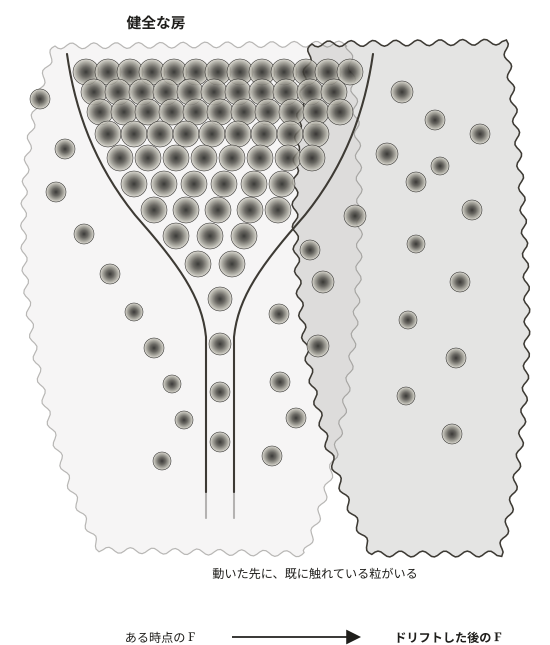

[図24-2b：痩せた房——漏斗の形も、F のドリフトも、図24-2a とまったく同じである。違うのは、粒の分布だけである。粒は浅い段に偏在し、深部は空洞、外は遺骸（無彩の ×）——健全な房で粒がいる位置と同じ場所に、生きた粒のかわりに遺骸が置かれている。粒の散らばりと F のドリフト量は、読み取りやすさのために実際より大きく描いてある——読むべきは分布の差であって、距離の量ではない]
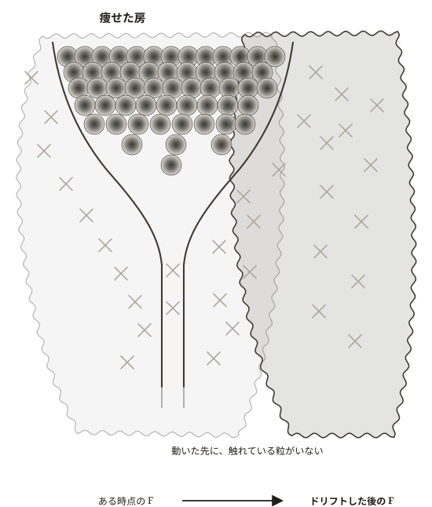

### 循環耐久相は、一本の尾根である

循環耐久相は、安定した平地ではない。両側に斜面を持つ、一本の**尾根**である——本書はこれを**文明の尾根**（civilizational ridge）と呼ぶ。この尾根の上にとどまるとは、何をしていることか。**引受の不等式——「操作能力的我ら」（O）≤「実存的我ら」（E）——を成立側に保ちつづける労働**にほかならない。「操作能力的我ら」（O）は現に広がった前提で、動かせるのは「実存的我ら」（E）の被覆であった。だから労働の内実は、「実存的我ら」（E）の被覆を、動きつづける「操作能力的我ら」（O）の広がりに追随させ、さらにそのどちらとも無関係に動く F との関係でも盲点を作らないよう、生まれても閉じ直すよう、時間を通じて保ちつづけることである。

尾根そのものは、係留FOE である。足元の地形は、止まっていない。動く地形に作動圏を合わせ、ラムダ帯域のうえで重心を係留しつづける。この労働なしには、「実存的我ら」（E）は、「操作能力的我ら」（O）に追いつけない。**二つの構造条件——被覆条件と接地条件——は、この追随労働が満たすべき、引受の不等式の二つの側面である**。被覆条件は「実存的我ら」（E）の**射程**が「操作能力的我ら」（O）の広がりに届いているかを問い、接地条件は「実存的我ら」（E）の**内実**が F 接地を失っていないか——形だけの「実存的我ら」（E）に痩せていないか——を問う。

二つの斜面は、この二側面のそれぞれの破れである。片側——漏斗の浅い側——へ外れれば、「実存的我ら」（E）が「操作能力的我ら」（O）の広がりに届かず、**O > E** の領域、すなわち行為は及ぶが引き受けてはいない領域が広がる。盲点を現実が衝く頓死。反対側——漏斗の深い側——へ外れれば、「実存的我ら」（E）は範囲としては保たれても、F 接地を失ったまま形骸として広がる。**O ≤ E は形の上では成り立ちながら、その E が地から浮いている**——ラムダ帯域が地から浮く乖離である。頓死と乖離は、別々の事態ではない。**引受の不等式を成立側に保つ労働が、二つの方向で破れる**、同じ一つの構造の破れ方である。

乖離した文明は、地から浮いている。基盤が尽きるまで、現実から浮いたまま自走しうる。なお、この乖離は、重心が FOE から外れるドリフト（命題 FOE-6、第16章 §16-5）が、二つの構造条件のうち接地条件の破れとして露わになった姿である。浅い側で被覆条件が破れ、現実が衝いて至る頓死とは、反対の進行先にあたる。

接地条件の破れには、二つの端がある。一つは、作動圏を古い Ω の断面に凍結させ、新しい足場を持たないまま回りつづける——**自己言及相での自走**。もう一つは、Ω とは別の足場を能動的に構築する——**固有の足場作り**。後者を突き詰めれば、系は、別の足場の上で新たに接地しなおすこともある。その新しい足場から見れば、それは乖離ではなく、別の尾根の上の循環耐久相である。そして前者——古い Ω に凍結し、自己言及相で回りつづける端——も、終わりきった相とは限らない。その文明が動きを停めた末に残すものを F として、別のレイヤーがそこに創発する——そういう見方も、視座を変えればありうる。「地から浮いている」とは、つねに「どの Ω から見て」の相対的な判定である。本書はここで、どちらの斜面の良し悪しも述べない。描けるのは、尾根と二つの斜面という地形だけである。

### 山の上の四つの位置——山は目盛りを与えない

この地形の上に、文明たちを立たせてみる。主だった位置は、四つ描ける。四つといっても、四つの立場（第23章 §23-5）の写しではない。あちらが同伴への個人の応じ方であるのに対し、ここに並ぶのは文明相の配置である。尾根を、確かめずに駆ける者がいる——拡張加速相である。一歩ごとに足元を試さないから、誰よりも速く、誰よりも遠くへ達する。この速さと到達は、見かけではない。短期の出力で他相を上回るのはこの相であり、駆けた距離のぶんだけ、操作能力は現に積み上がる。一歩ごとに背を確かめながら進む者がいる——循環耐久相である。踏む前に足元を試す。外れにくい。そのかわり遅く、駆ける者と並走すれば、距離では負ける。

登らない者がいる——麓と低い尾根に留まる、管理安定相である。背の広いところしか歩かないから、切れ落ちた縁に出会わない。頓死のリスクを最小に抑える、理に適った応答である。そのかわり出力は小さく、駆ける者が現れれば、その被覆に編入されやすい。そして、進むのをやめ、その場に幕を張る者がいる——深い側へ浮いた、自己言及相での自走である。山を読むのをやめ、古い地図だけを読み、担いできた荷を食いながら凌ぐ。荷が続くかぎり、そこは安泰である。

駆ける者を、山は罰しない。切れ落ちた背へ速さのまま踏み込むのは、たしかにこの者である。だが、それを引き起こす性質——確かめずに進む——は、この者を誰よりも遠くへ運んだ性質と、同じ一つのものである。強さと頓死は、別々の資質ではない。同じ一つの資質が、短い時間地平では優位として現れ、長い時間地平では破局として現れる。分けているのは、性質ではなく時間である。

四つの位置に、山は目盛りを与えない。駆ける者は踏み外しやすく、確かめる者は遅く、麓の者は編入されやすく、幕を張る者は荷が尽きる。それぞれの理と、それぞれの晒され方があるだけである。そして、この山に、登りきれば終わる頂上はない。地形そのものが、動きつづけるからである。どこに立つかを、地形は命じない。

この四つは、四つの立場（第23章 §23-5）と、一対一には揃っていない。ホモ・キュリオセスに対応する相は、この山にない——揺れる位置は、個人には立てても、相としては持続しないからである。相は自走の慣性を持ち、二つの引力のあいだに留まりつづけることができない。逆に、幕を張る者に対応する立場は、あちらにない。四つの立場が、手を伸ばすことへのいま現在の応じ方の類型であるのに対し、幕を張る者は、応じることをやめた後の姿だからである。写しにならないのは、ずれではない。個人の応じ方と文明相の配置は、別のものを切り取る二つの射影である。

[図24-3：山の上の四つの位置——尾根を、確かめずに駆ける者（拡張加速相）。踏む前に足元を試す、確かめる者（循環耐久相）。背の広いところしか歩かない、登らない者（管理安定相）。山を読むのをやめ古い地図だけを読む、幕を張る者（自己言及相での自走）。四者を分けるのは形であって、色は用いない。深い側の斜面は接地条件の破れ——乖離へ。浅い側の斜面は被覆条件の破れ——頓死へ。無彩の × は遺骸]
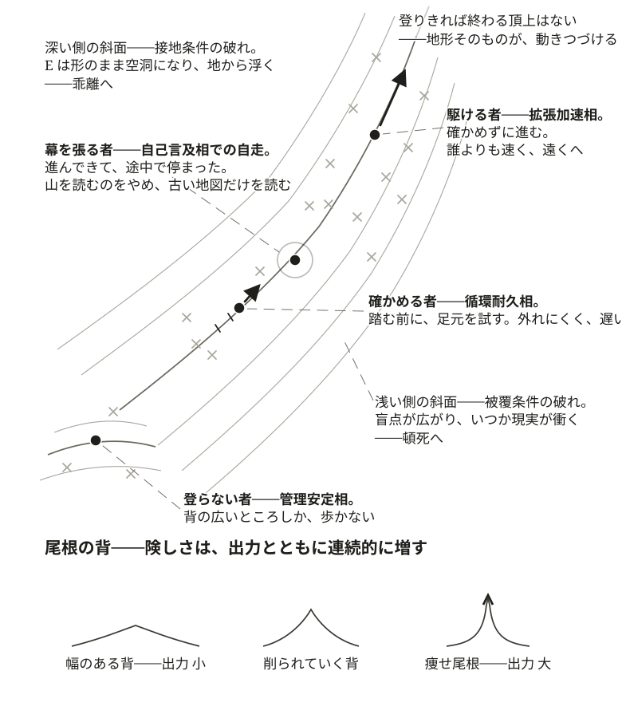

### 文明の尾根から文明の痩せ尾根へ——百億と千年が背を削る

ただし、この尾根がどれほど険しいかは、文明の出力の大きさによる。険しさは、安全か危険かの二値ではない——出力とともに連続的に増していく。出力が小さく、漏斗の勾配がなだらかな段階では、両側の斜面もゆるく、尾根の背には幅がある。どちらかへ傾くことはあっても、一歩で尾根を外れる切迫はない。文明の尾根は、このとき、歩ける背をもっている。

だが、第Ⅴ部が課したバインド——百億人の「我ら」、千年後の「我ら」——のもとでは、様相が変わる。操作能力の出力が巨大化し、漏斗の勾配は急峻になる。両側の斜面は切り立ち、留まれる背は削られて、幅を失っていく。歩ける尾根は、両側が切れ落ちた**痩せ尾根**——**文明の痩せ尾根**（civilizational arête）——になる。arête とは、氷河に両側を削り取られて残る、刃のように細い稜線をいう。本書では、この二つを**使い分ける**。出力の小さい一般の文明相を**文明の尾根**、百億・千年のバインドが背を削り落とした相を**文明の痩せ尾根**と呼ぶ。

そして、文明の痩せ尾根で真に厄介なのは、それが痩せ尾根だと見えることではない。岩がむき出しに切れ落ちた背なら、切れ落ちているとそれと分かり、人は慎重になる。見分けを奪うのは、その岩の上にやわらかい表土が薄く乗り、あるいは雪が積もって、外からは幅のある尾根と見分けがつかなくなるときである。踏み込むまで、下が切れ落ちていることは分からない。文明の痩せ尾根も、同じ顔をしうる。バインドが勾配を急峻にして背を削っても、コストを外へ送り、未来から前借りするあいだは、表面がならされ、まだ歩ける尾根のように見える。切れ落ちた背が見えないのではない——それが、幅のある背と同じ姿をしている。連続であるがゆえに、その境は外から測れない。これが、頓死の境がなぜ見えにくいかの、認知の形である。λ₄ の深さは、この見分けの奪われ方を一段深くする。参照系の縁が Ω の縁と同一視されるとき（命題 FUNNEL-3、第18章 §18-3）、被覆の届いていない領域は、届いていない領域としてすら参照系に映らない。盲点が、盲点として数えられない。被覆条件が λ₄ で帯びる変形とは、これである。

[図24-4a：歩く者の地図——実測は現在地の一点（λ₀）、手で確かめた範囲（錨泊FOE）はその近傍まで。揺れた太い線は文明が到達した線——偶然にも左右された、一回性の歩み。淡い円は、その歩き手たちに見えていた広さ——見えていた円と、歩かれた線は、同じではない。濃い線は接地しながらの歩み、淡い線は報告だけを信頼する歩み。同じ投入なら、報告だけを信頼する歩みのほうが速く、遠くまで行ける（接地コストを払わない歩み、命題 FUNNEL-6）——だが、円の内・稜線の外に立ちうる。濃さは、手が届いているかを表す。盲点は盲点として印されず、地図の縁は世界の縁と同じ顔をする（命題 FUNNEL-3）]
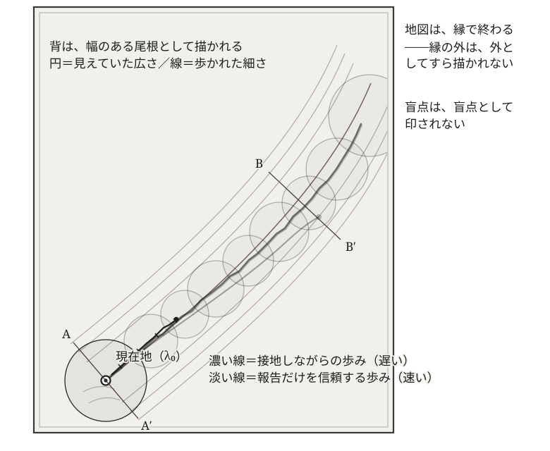

[図24-4b：二つの断面——A–A′（現在地）に地の色が敷いてあるのは、歩く者が自らの足で確かめてあるからである。刻みが踏んで確かめた点で、岩の背も縁も知られている。B–B′（遠く）に地の色がないのは、この地図が描けないものだからである——均された表面の下の、切れ落ちた背。稜線の上に立つ者と、円の内・稜線の外に立つ者がいる。境は、上からは測れない——地図の上では、この二つはどちらも同じ幅のある尾根として描かれる]
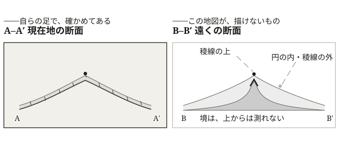

循環耐久相を保つとは、どちらへも外れずに、この文明の痩せ尾根の上にとどまりつづけることである。しかもそれは平衡ではなく、尾根の外側へ押し出そうとする力に抵抗しつづける労働である。この労働を負ってなお手を閉じない位置——それは、『「我ら」を引き受けるとは何か』（第23章）が名を置かないまま本章へ渡した位置である。その名が立つ足場の形が、文明の痩せ尾根である。名は、本章の終わり（§24-5）で置く。とどまることだけが道ではない——背を降りて、より広い、すなわちより小さな出力の相へ移ることも、一つの選びである。

そして、文明の痩せ尾根の上にとどまる労働は、どちらへ外れることも確実には防げない。作動圏を Ω に合わせつづけても、盲点がゼロになる保証はない。F 接地者を「我ら」の内に保ちつづけても、地形の動きが速ければ間に合わないこともある。努力は、どちらの斜面へ外れることも、確率的に避けやすくするだけで、約束はしない。循環耐久相が「頓死しにくい、しかしその維持は努力でしかなく、盲点ゼロを保証しない」相であることの、正確な姿がこれである。有限の帯域が払える被覆にも係留にも、地形の全体は載らない。二つの構造条件は、帯域制限のもとでは、つねに近似としてしか満たされない。満たしつづけるとは、この近似を保ちつづけることである。

---

## §24-3　移れるか、どこへ移るか——軌道と闘争的移行期 

ラムダ帯域は、現実の地形が独立に動くなかで保たれる。地形が痩せれば、文明が接地している範囲は痩せる。痩せた範囲を、文明はどう扱うか。ここに二つの構えがある。一つは、失われた範囲を受け容れ、残った範囲で小さく立て直す構え——縮小を受け容れる。ラムダ帯域を浅く縮め、λ₀ に近い水準で立て直す方向である。もう一つは、失われた範囲を惜しみ、ラムダ帯域を元の深さで保とうとする構え——容積を保とうとする。失われていく地形のうえで、なお元の「我ら」を支える容積を保とうとする方向である。

二つの構えは、選択ではない。それは、見えている範囲の差である。知力と「実存的我ら」（E）の重なり、すなわち先見の範囲である（第23章 §23-6）。破局を、起きてから知る範囲しか持たない文明は、撃たれてから痛みを覚え、小さく立て直すほかない。破局を、起きる前から見通す範囲を持つ文明は、撃たれる前から全容を負い、抵抗する。

### 拡張加速相からの五つの軌道

現在の文明は、化石燃料・海洋資源・土壌・気候の安定を前借りして、いまの人口規模を支えている——拡張加速相にある。この相は、係留FOE を保つ係留の仕事を投じておらず、被覆条件と接地条件の双方を満たさないまま、「操作能力的我ら」（O）だけを拡張しつづけている。前借りで嵩上げされた現在規模は、係留FOE のうえに立っているのではなく、いずれ尽きる Stock の掘り崩しのうえに立っている。この相からの軌道は、複数ありうる。本書は五つを取り出す。

第一は、**継続**である。前借りと係留の放棄を、そのままつづける。係留FOE は立てない。短期の出力は他相を上回るが、長期には破局へ向かう。残る四つは、いずれもこの継続から離れる軌道であり、前段の二つの構えが、そのまま二手に分かれる。

縮小を受け容れる構えは、二つの軌道を持つ。二つを分けるのは構えではなく、縮小が制御下にあるか否かである。一方は、**受け容れる縮小**——出生率の低下などを通じた、計画的で漸進的な縮小である。ラムダ帯域を、λ₀ に近い深さへ計画的に縮め、その浅いラムダ帯域のうえで被覆条件と接地条件を満たす循環耐久相を組み直す。「我ら」の凝集は壊されない。地形の言葉でいえば、これは滑落ではなく、低い尾根への降路である——降りる判断には、登りつづける判断と同じ資格がある。他方は、**強制される縮小**——制御を失った急激な縮小である。ラムダ帯域が剥落し、文明は媒介接続を断たれて λ₀ へ強制的に帰着する。「我ら」の凝集の全面的な破壊と、加速するフィードバックを伴う。立て直しは、錨泊FOE の地のうえで、ダンバー数の水準からやり直されるほかない。しかもその地は、削られた起動条件（第23章 §23-1）のぶんだけ痩せた地である。

容積を保とうとする構えが軌道の側で取る形は、一つである。痩せていく地形のうえで、なお元の深さでラムダ帯域を保ちつづける——**上限規模の賭け**、未踏領域への賭けである。被覆条件と接地条件を漏斗の深さに対して満たし、再編成余地を使い尽くさないまま、係留の仕事を上限規模で継続させる。

そして第五が、この賭けと継続とのハイブリッド——**時間との競争**である。賭けが間に合えば循環耐久相へ、間に合わなければ、強制される縮小へ転落する。

これらの軌道を、操作能力・集合の大きさ・実存感の三軸の座標系（「ホモ・デウスとホモ・マネス」第7章）に置きなおすと、別の面が見える。継続は、実存感を縮退させたまま操作能力を拡大しつづける選別型の経路に近い。強制される縮小は、破局を経て媒介接続が断たれ、前近代の規模へ縮退する縮退型の経路にあたる。残る三つ——受け容れる縮小、上限規模の賭け、時間との競争——は、位相転換の四類型に対応物を持たない。循環耐久相へ至る、まだ歩かれていない経路である。軌道そのものは、すでにラムダ帯域の深さ（本章）で、重心の係留と乖離（第16章）で描かれてきた。三軸の座標系は、そこへ集合の大きさという軸を返す。どの射影も一つの潰し方であり、像を重ねてはじめて、経路の全体が立体になる。

### 競争排除がもたらす「外がない」状態

五つのうち継続が、一つの文明の内部の代価だけでは説明されない外的な圧力に支えられていることを、ここで取り出しておく。

複数の文明が同じ現実座標系のうえで並走するとき、深く掘れる文明が浅くしか掘れない文明を競争排除し、その被覆領域を編入していく（第19章 §19-4）。深掘りの立てるコストは内部では高いが、それを払って深い漏斗を立てた文明が、払わなかった文明を排除する。この帰結が、深掘りの高い立てるコストを正当化する。継続は、内部の選好だけで保たれているのではない。**他文明を競争排除しながら被覆領域を拡げつづけることで、係留FOE を立てる必要そのものを未来へ先送りしている**。

しかし、競争排除には終端がある。並走する他文明をすべて編入し尽くすと、被覆領域を拡げる先がなくなる——「外がない」状態である。外側がなくなったとき、継続は外部の F を伴わない深掘りへ追い込まれる。自系の Stock を入力として次の圧縮をする、入れ子の自己言及——自己言及相である（第18章 §18-4）。係留FOE は立たないまま、漏斗だけが深く彫られていく。そこで、強制される縮小への転落が、内蔵される。

上限規模の賭けは、この「外がない」状態が完成する前に、競争排除に依らない別の立て方を成立させうるか、という時間との競争として描き直せる。時間との競争が引き受けるのは、まさにこれである。

### 時間に追われる移行

五つのうち、時間との競争が、先見の苦悩を、軌道の側から引き受ける。上限規模の賭けは、痩せていく地形と、それを掘り崩して進む競争排除との二重の時間に追われている。間に合えば循環耐久相へ、間に合わなければ、強制される縮小へ。先に全容を見てしまった文明ほど、この競争の時間の短さを知っている。移行は、時間に追われている。

そして、受け容れる縮小は、容易に強制される縮小へ転落しうる。縮小期の資源配分の不平等、制度の機能不全、階層間・世代間・地域間での「我ら」の分裂、外的な衝撃、そして移行そのものを妨害する主体の存在——これらのもとでは、各主体が自らの破局を避けようとする局所的に合理的な判断が、全体の破局を推進しうる。受け容れる縮小と、強制される縮小を分かつのは、紙一重である。両者を分かつ差は、ラムダ帯域を**降ろす**ことと**剥落させる**ことの差にしかなく、その差は、係留の仕事を最後まで畳んで降ろせるか否か——一度に断たれるか段階的に解体されるかという、Mourning の有無（第13章）に依存している。

本書は、この局面を**闘争的移行期**と呼ぶ。移行は、痩せていく地形と競争排除との二重の時間に外から追われ、内側では縮小期の分裂と妨害に引き裂かれる。闘いながらでしか進めない期間だからである。では、この移行は、何と、あるいは誰と、闘っているのか。相手は、三つ数えられる。第一の相手は、**時間**である。痩せていく地形と競争排除との二重の時間は、主体ではない。交渉に応じず、待ちもしない。倒して勝てる相手ではなく、ただ、間に合うか、間に合わないかがあるだけである。

第二の相手は、**「我ら」自身の内**である。受け容れる縮小の転落条件として先に並べたもののうち、外的な衝撃を除くすべては、移行を担う「我ら」自身の内側で起こる。資源配分の不平等、制度の機能不全、「我ら」の分裂、移行への妨害である。ここにはじめて、主体の顔が現れる。だが、それは敵の顔ではない。妨害する主体を含めて、各主体は自らの破局を避けようとする局所的に合理的な判断を下している。名指して除けば争いが終わる相手は、この内側のどこにもいない。あるのは、争いのただなかで、係留の仕事を畳んで降ろす手続きを保てるか否かだけである。降ろすか、剥落させるかの紙一重は、ここで決まる。

第三の、最も深い相手は、**構造**である——といっても、誰かが外から課している体制のことではない。移行しようとする当の「我ら」が、現にそれに支えられ、日々それを遂行している運動——拡張加速相そのもの——である。この相手との闘いは、相手を倒す形を取れない。運動を一度に断つことは、いまの「我ら」を支えている当のものを一度に断つことであり、それは降ろす縮小ではなく、剥落だからである。

### 移行のための闘いが、移行の条件を費消する

しかも、この闘いには、内側から効いてくるもう一つの困難がある——第二の相手との争いが、ここへ流れ込んでくる。移行が目指す当のものは、引受の不等式——「操作能力的我ら」（O）≤「実存的我ら」（E）——を成立側に保つことであった（§24-2）。だが、内での争いが「我ら」と「彼ら」とを分かつ形を取るとき、割れるのは、この不等式の片側だけである。

割れるのは、「実存的我ら」（E）の側である。縮小期の争いは、たがいの ES と結びついた構造を、承認を経ないまま終わらせ合う形を取りやすい。そのとき「我ら」の境界は再編成されて分断が生成し、終結時に支払いを免れたはずのコストは、敵対的な調整として乗算されて返ってくる（命題 M6、第13章 §13-2）。割れないのは、「操作能力的我ら」（O）の側である。「我ら」を割っても、操作の網は割れない。分かたれたどの「我ら」も、消費と排出と供給を通じて互いの生存条件へ及びつづけ、「操作能力的我ら」（O）の届く範囲は、割られる前の広さのままである。

割れる側と割れない側——この非対称のもとで、分かたれたそれぞれにおいて、「実存的我ら」（E）は割られたぶん痩せ、「操作能力的我ら」（O）は痩せない。両者の差は割られる前より開き、不等式の成立は、それだけ遠くなる。そして、この開いた差は、そのまま「それら」の輪郭になる（「『我ら』の境界と因果の創発」第15章 §15-6）——行為は及ぶが引き受けてはいない領域、いつか現実が衝く盲点である。すなわち、引受の不等式を成立させようとするもがきが、闘争の形を取ったそのぶんだけ、「実存的我ら」（E）を痩せさせ、成立をいっそう遠ざける。移行のための闘いが、移行の条件を費消する——内の争いは、ここで、構造の費消と同じ向きへ合流する。

だから、取れる形は、いっそう狭く絞られる。闘わずに済む道は、この期には残されていない——闘いながらでしか進めない期間として、この期は名づけられた。残されているのは、闘いの形の差である。同じ内での争いでも、賭けられているものが違う。割る形は、誰が勘定に載るかを賭け、そのぶん「実存的我ら」（E）を先に費消する。引き受け直す形は、勘定を保ったまま、何をどの順で畳むかを賭ける。移行とは、そもそも、前借りが支えているいまの「我ら」とは別の「我ら」を、破局に強制される前に想像し、引き受け直すことにほかならない。その想像の余地は、社会的 LEFFLA（「社会的既知感への信認」第10章 §10-5）である。まだ評価されないまま社会の内に保たれている、別様の分節の潜在である。そして拡張加速相は、まさにこの余地を侵食しながら進む相であった（「実存的不安定」第22章 §22-2）。だから、構造との闘いもまた、突き詰めれば時間との闘いである。そして、この期の成否を最後に定めるのは、資源の残量でも制度の設計でもなく、意味の側の余地である——費消が余地を尽くすより先に、そこから別の「我ら」が立つか。時間は、猶予を狭める。内の争いは、降ろす手続きを乱し、「我ら」を割る。構造は、別の「我ら」を想像する余地を費消する。移行に要る当のものを、移行を要する当の運動が費消している。そして移行のための闘いさえ、割る形を取るとき、その費消に加わる——闘争的移行期の困難の底は、ここにある。

### 軌道空間の外——関与を断つ方向

ここまでの五つの軌道——継続、受け容れる縮小、強制される縮小、上限規模の賭け、時間との競争——は、いずれも現実の地形に関与しつづける文明の軌道である。前借りを続けるにせよ、縮小を受け容れるにせよ、容積を保とうとするにせよ、文明は、動く現実に接地したまま、その上で運動している。闘争的移行期とは、この空間の内で、闘いながらでしか進めない期間の名であった。これとは別に、現実への関与そのものを切り、自分たちだけの地形へ退く方向がある。§24-2 の乖離斜面として立てた、反対側である。

この方向は、第六の軌道ではない。軌道空間そのものからの退出である。そして、闘争的移行期の内側から見るとき、退出は、三つの闘いを一度に終わらせる唯一の出口として現れる。時間は、もう追ってこない——二重の時間が測っているのは、関与しつづける者の残り幅だからである。内の争いも、もう引き裂かない——分裂と闘う代わりに分裂を完成させ、退いた者たちだけの「我ら」に閉じるからである。構造とも、もう闘わない——運動への参加をやめた者には、費消すべき自らの運動がないからである。闘いながらでしか進めない期間のただなかに、闘わずに済む場所が、一つだけあるように見える。

だが、終わるのは闘いであって、相手ではない。二重の時間は、読む者を失っても進む。痩せていく地形は、読まれなくなった地図の下でも痩せつづけ、深く掘る文明の競争排除は、退いた地形の縁にも届く。そして、関与を断つことは、続いていく文明の操作の網から出ることではない。気候も、海洋も、土壌も、届く操作は退いた地形にまで届く。届く操作の内側に立ちながら、もうどの引き受けにも数えられていないなら、その位置は、広がっていく「操作能力的我ら」（O）と「実存的我ら」（E）との差の内——「それら」の輪郭の内——である（第15章 §15-6）。内での争いは、「実存的我ら」（E）を割ることで「それら」を製造しながら進んだ。退く方向は、その裏返しである——遠くへ届く操作を手放すことで、製造する側からは降りる。そして降りたまま、続いていく文明が広げる「それら」の輪郭の内に、自ら立つ。闘いは終わるのではない。退いた者の上で、参加を欠いたまま、続いていく。

もっとも、この方向の先は一つではない。§24-2 が接地条件の破れに認めた二つの端が、ここにも立つ。古い Ω の断面に地図を凍らせ、担いできた荷を食いながら回りつづける端——幕を張る者の相——と、Ω とは別の足場を能動的に構築し、その上で接地しなおす端。後者が立つなら、それは退いた者自身の Ω から見て、乖離ではなく、別の尾根の上の循環耐久相である。前者もまた、終わりきった相とは限らない——動きを停めた末に残すものを F として、別のレイヤーがそこに創発しうる。ただし、それが起こるとしても、退いた者自身に返る時間では起こらない。「地から浮いている」がつねに「どの Ω から見て」の相対的な判定であることは、§24-2 で認めたとおりである。ここでも、良し悪しは述べない。退く方向の先で、参照する圏が共有された現実から剥がれていく事態がどんな配置に行き着くかは、「決して届かない領域、それでも」（第26章）の失敗の星座が受ける。

[図24-5a：凍った地図——図24-4a と同じ地図が、更新を止めた姿。文明が到達した線はそこで止まり、淡い円は描かれたまま残るが、円を見ていた手は、もう「我ら」の内にいない。この地図は古い Ω の断面で凍っており、地形——太く淡い線が、いまの稜線——はそのあとも動きつづけているが、動いたぶんを掴む回路は、もう内側にない。淡いのは、現に在るのに手が届いていないからである。凍っていることは、地図の上にはどこにも現れない——生きている地図と、同じ顔をしている。紙の色も図24-4a とまったく同じである]
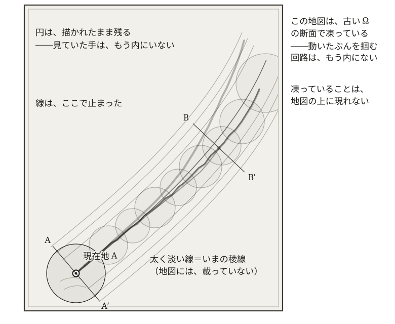

[図24-5b：乖離の二断面——どちらにも二本の地面がある。濃い実線が、地図が覚えている地面。太く淡い線が、いまの地面。現在地 A（左）では、二本はまだ重なっている——とはいえ、文明の痩せ尾根の上である。問題は、古い地図にしたがい、足元点検を省いて進んだ先の B（右）である——地図の稜線の上、いまの稜線の外。地から浮く——現実に衝かれないまま、基盤が尽きるまで、自走しうる]
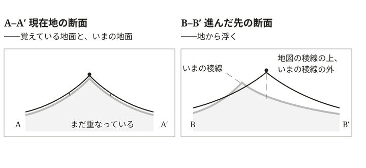

---

## §24-4　λ₀ 維持の三戦略——意志的純化形と方舟 

動的側面——移れるか、どこへ移るか——を取り出したあとで、静的側面へ折り返す。動く地形の上で λ₀ を維持しようとする道は、構造的には三つある。**範囲を狭める**（意志的純化形）、**成層化する**（方舟）、**薄く広く分布させる**（循環耐久相）。三者はいずれも λ₀ の維持を断念しておらず、分布のかたちが違うだけである。本節は、うち二つ——意志的純化形と方舟——を構造記述として立てる。両者が構造記述として殺されないことを確かめることが、続く §24-5 で名を置かれる第三の道を、規範的宣言から救う。

だが、その二つの底を立てる手前で、それを語る自分がどの規模の「我ら」を暗黙に前提しているかの自覚が要る。この自覚がなければ、意志的純化形も方舟も、対峙の相手として立たない。

### 規模の自覚——仮言的要求と四つの不整合形態

ここまで、ラムダ帯域を保つ条件と、そこへ至る軌道を、外から測る記述として立ててきた。この記述には、それを語る主体の側に生じる条件が一つ伴う。自分のラムダ帯域が、どの地から立ち上がっているかの自覚である。

ただし、自覚が要求されるのは、ある境界からである。限界事例として、引き受けられた**基底**——ある MANES が「我ら」として数える主体の数——が一人だけ、という MANES がある。「ただ一人で生き、ただ一人で死す」。『無量寿経』のいう独生独死である。これは無矛盾な MANES である。しかし、伝達された MANES はすべて基底 ≥ 2 である。書かれ、語られ、受け取られた瞬間に、MANES は「我ら」を二人以上へ開く。自覚が要求されるのは、まさに共存条件が発動するこの境界——基底が一人を超える、その境界そのもの——においてである。

自分がどれだけの「我ら」を暗黙に前提しているか——その規模を自覚せずに「我ら」を語ることは、欺瞞的な操作になりうる。語り手の隠れた前提が特定の規模とその支えを当てにしており、その前提から外れる聞き手は、実は「我ら」に数えられていない、ということが起こるからである。自覚は二つの軸で問われる。誰を「我ら」とするか——その規模は明示されているか。そして、その規模を時間軸で維持できるか——一時点の充足ではなく、ラムダ帯域を支える構造条件の前借りに依存していないか。前借りで嵩上げされた規模は、現在は支えられても、時間軸では維持できない。

ただし、この規模は、外から数として確定できる量ではない。確定しようとして構造条件を一つの数へ縮約した瞬間に、再編成余地の事前評価不能性が壊れ、ラムダ帯域を支える構造そのものが減退する。だから本書は、規模を量として特定せず、現在支えうる容積と将来支えうる容積を、順序の関係——構造条件が痩せているか、保たれているか——として扱う。

なお、この自覚の要求は、定言的な規範ではない。「ある『我ら』を気にかけるなら、その主張は整合的でなければならない」という、仮言的な要求である。ある規模の「我ら」を支えうるかを報酬関数に置いた主体にのみ、自身の主張の整合性が、条件付きで問われる。本書はこれを規範として外から課すのではなく、引き受けた者の内側に生じる構造として記述する。

この整合性を満たさない形態は、四つある。第一に、自らの規模を自覚しない。「われわれのため」と語る当の語りが、その「われわれ」を何人と数え、いつまで支えるつもりかを知らない。第二に、自覚しても、ラムダ帯域を支える構造条件の前借りに依存する時間プロファイルを設定する。いま支えられている規模を、それを支えている Stock の残量を問わないまま、将来へ延長する。第三に、測定不能性が概念に内蔵されていることを引き受けず、規模を測定可能な数値へ縮約しようとする。確定した数を得たその操作が、再編成余地の事前評価不能性を壊している。第四に、構造条件の崩壊による強制される縮小（§24-3）への転落を認識しない。自らの主張がその斜面の上で語られている可能性を、時間プロファイルの内に数えない。四形態はいずれも、自覚の責任と軌道の認識の裏面である。本書はこれらを「空論」とは呼ばない——その語は断罪の響きを帯びるからである。構造記述としては、これらは整合性を欠いた、あるいは維持不可能な規模の主張として記述される。そして、この四形態は、裏返せば試験である。これから正面に立つ二つの位置は、この試験をどこまで通過するかで測られることになる。

### 意志的純化形——脱構築を通過してなお、狭く整合する道

第23章は、引き受けを省く位置——前景のみに「我ら」を閉じる位置——に、二つの系譜があることを記した。一つは、無邪気な不作為である。見えないものは見ようとする労働なしには見えないから、手を伸ばさなければ、人はこの位置に無邪気に落ちる。これは、断罪の宛先を持たない、普遍的な経路であった。

もう一つの系譜が、ここで正面に立つ。脱構築を通過してなお、見えると承知のうえで、この位置を選ぶ形である。宇宙論的な中立——すべての「我ら」が等価であること——を知的な常識として通過し、そのうえで、狭い「我ら」を選び取る。操作能力を、その狭い「我ら」のための武装として運用する。そして、見えないものへ手を伸ばす苦悩を、負うべき価値のない負の効用として、明示的に拒む。無邪気な不作為が「見えないから見ない」のに対し、この位置は「見えるが、見ないと決める」。

言い換えれば、これは、同伴を正確に見抜いたうえでの拒否である。同伴とは、手を伸ばせば、好奇心と苦悩は切り離せずについてくることであった（命題 FOE-19、第23章 §23-4）。無邪気な不作為が同伴を知らずに手を引くのに対し、この位置は、苦悩を払うくらいなら好奇心ごと手を引くと、承知のうえで決める。四つの立場でいえば、見えると承知で前景へ閉じる、ホモ・デウスの純化形にあたる。

この位置は、本書が立つ位置——苦悩を負ってなお手を伸ばしつづける位置——と、信念の強さ、引き受けの真剣さ、行為の強さでは、区別できないほど洗練されていることがある。信念を抱き、操作能力で武装し、特定の規模を引き受け、それを貫く——この外形は、両者で変わらない。違いは、外形にはない。

外形が変わらないのは、偶然ではない。完全に凝集した生は、それ自体として美しくありうる——一つの座標系に貫かれ、迷わず、揺らがない、その貫かれかたにおいて。だが、凝集が完全であることと、その座標系が妥当であることとは、別々の問いである。貫かれていることは、貫いている当のものが妥当であることを意味しない。妥当性は、凝集の強さからは出てこない。だから両者の違いは、どちらがより深く凝集しているかにはない——凝集の強さでは、両者は分かれない。違いは、その凝集が外側をどう扱うかにある。次に取り出す三つの差分は、その扱いの違いを構造の側から取り出したものである。

違いは、構造記述として取り出せる。ラムダ帯域の深さと、被覆条件・接地条件の語彙が、ここで対峙の輪郭を画す。

### 三つの差分——規模、被覆、時間軸

**第一に、選び取った規模——ラムダ帯域をどの深さで取るか**。この位置は、ラムダ帯域を、本書のバインドより狭い範囲——百億・千年より小さな「我ら」——に引き直す。狭い規模の係留FOE は、係留の仕事が軽く、被覆条件と接地条件を満たしやすい。広く深い係留FOE を保とうとすれば押し寄せる苦悩を、引く前から狭く取り除ける位置である。葡萄の房（§24-1）でいえば、これは房を小さく刈り込む道である。刈り込んだ内側では、芯から皮まで、粒の重なりは健全に保たれうる。

**第二に、苦悩の引き受けの有無——被覆条件をどう扱うか**。この位置は、選び取った狭い「我ら」の内側では被覆条件を満たしながら、その外側——選び取らなかった範囲——では被覆条件を満たそうとしない。「操作能力的我ら」（O）が選び取った「我ら」の境界を越えて及んでも、その帰結を引き受けない。引受の不等式は、選び取った範囲の内側でだけ成立側に保たれ、外側では引き受けの対象から外される。本書の位置が「見えないものへ手を伸ばす報われない労働」として負うものを、この位置は負の効用として拒む。

**第三に、時間軸の整合性——接地条件と前借りの問題**。この位置は、選び取った狭い「我ら」を支える構造条件が、時間軸で整合しているかを問う。いまのラムダ帯域の深さが、いずれ尽きる Stock の前借りで嵩上げされていないか。F 接地者が「我ら」の内に生きて含まれつづけているか。整合していなければ、いま保たれているラムダ帯域は、時間を通じて維持できない。この位置の最も洗練された形は、選び取った「我ら」の規模で時間軸の整合性を厳密に保つ。百億・千年は引き受けないが、自分の引き受けた範囲ではラムダ帯域を最後まで誠実に保つ。

本書とこの位置を分かつのは、信念の有無でも、行為の強さでもない。そして、三つの差分が等しい深さで分かつのでもない。第三の差分は、最も洗練された形においては、本書と同じ資格で満たされうる。狭い規模で整合を保ち抜く誠実と、広い規模でそれを保とうとする誠実とは、この試験のうえでは並ぶ。残って分かつのは、選び取った規模（第一）と、その外側の引き受け（第二）である。試験の一つが両者を分かたないこと——それが、この位置の手強さの、構造の側の内実である。縁の語で言い直せば、こうなる——どちらの位置も、自らの勘定の内側では、引受の縁を動かさない。遅延回収を回収断絶へ書き換える操作を、拒む。分かれるのは、縁をどこに引いたか（第一の差分）と、縁の外を勘定に載せるか（第二の差分）だけである（命題 RETURN-7、第15章 §15-8）。

本書は、この位置を断罪しない。固有名を当てはめることもしない。脱構築を通過した知的な常識のもとでは、狭い「我ら」を選ぶことも、広い「我ら」へ手を伸ばすことも、宇宙の側から見れば等価である。本書はそのことを、序論 §4 で認めきった。だから本書が言えるのは、判定ではなく、差分の構造だけである。二つの位置は、同じ外形のもとで、選んだラムダ帯域の深さと、被覆条件の引き受けの範囲と、接地条件のもとでの時間軸の整合において、分かれている。どちらを引き受けるかは、構造記述の外で、読む者に開かれている。

### 方舟——「我ら」の外に置いたまま満たす道

この部の冒頭で、一度だけ通過させた道がある。百億人が千年のあいだ存在しているという結果だけなら、その多くを「我ら」の外に置いたまま作り出す道も、考えうる。範囲のバインドを宣言したとき、本書はそう書いた。ここまでの意志的純化形は、個人の立場としての底だった。その同じ位置が、文明の相として組織されたとき、どんな形を取るか。

形は、成層である。内側に、遮蔽された**核**がある。核の内部では、ラムダ帯域が保たれている。被覆条件と接地条件は核の内側で満たされ、「我ら」は厚く、信認は回り、F 接地者は生きて含まれ、未来は引き受けられている——核の内部では。外側に、曝露された**層**がある。核の操作能力は届くが、核の「我ら」は届かない領域である。コストと応報はそこへ送り出され、資源はそこから引き込まれる。外に向かっては拡張加速の論理が走りつづけ、内に向かっては参照の圏が核に閉じる。全体としては引受の不等式が破れたまま、核においてだけ、不等式が成立側に保たれる。葡萄の房でいえば、こちらは刈り込みではない——二重である。核の内側では粒が密に重なり、どの深さにも生きた接地が保たれる。その外に、核の房にはつながれないまま、核の操作の届く範囲に置かれた粒が広がる。粒と粒の重なり——媒介接続——は、境界で、意図して断たれている。

§24-1・§24-2 の語でいえば、これは、ラムダ帯域を**全体ではなく核の内側だけで保つ**相である。被覆条件は、核のラムダ帯域と曝露層の境界で、意図的に満たされない。この境界の不充足が、核の内側のラムダ帯域を支える条件として、組み込まれている。

これは、循環耐久相の失敗形ではない。**第三の満たし方**である。不等式の成立そのものは健全さを保証しない（「不等式の動性」第16章）——「実存的我ら」（E）を育てて満たす道（拡張充足）と、「操作能力的我ら」（O）ごと縮めて満たす道（縮退充足）が分かれるのだった。ここにあるのは、そのどちらでもない。引き受けえたはずの者たちを勘定から外すことで、残った勘定を満たす——**遮蔽充足**である。

第19章 §19-4 の競争排除と編入の語で読み直せば、これは競争排除の特殊形にあたる。深い文明が浅い文明を編入するとき、拡がるのは操作の被覆であって、引受の被覆が伴うとは限らない。§19-4 はそう記した。方舟は、その被覆の不一致を、文明の外ではなく**内側に**組み込んだ相である。核は、自らの内部に永続的な曝露層を擁することで、外部の他文明を編入し尽くしたあとに開く「外がない」状態を、人工的に回避する。曝露層は、核にとっての「外」を、内側に作りつづける装置として機能する。

この相は、§24-3 の軌道空間に収まらない。あの五つの軌道は、一つの文明が一つの主体として移行する軌道だった。この相は、主体そのものを割る。移行の問いを立てる「我ら」を核と曝露層に分けることで、核にとっての答えを先に作ってしまう。また、現実への関与を切って自分たちの地形へ退く方向とも違う。この相は退かない。現実の地形に接地したまま、引き込み、送り出しつづける。

そして、正直に言わなければならない——この相は、構造の記述では殺せない。存続の条件は競争である。排出の届く先と、新たな供給とが、応報の累積より先に尽きなければ、この相が千年の尺度を保つ可能性は、否定できない。本書は、この相が必ず滅びるとは言わない。言えば、記述を価値の勾配で汚すことになる。

### 分かつのは、送り出す先である——三つの試験を通過する相

誤解を一つ、先に解いておく。送り出すことそのものは、罪ではない。あらゆる動いている系は、外へ送り出すことなしには存在できない。誰の「我ら」にも届かない先への排出は、代謝である。この相を分かつのは、送り出すことではない——**引き受けえた者たちの上へ**送り出すことである。だからこの相と循環耐久相は、切れた二つの類型ではなく、一本の連続体の両端にある。引き受けえた者のうち、どれだけを遮蔽の外に保持するか。その保持がゼロへ向かう極限が、循環耐久相である。

引き受けえた者たちの上へ送り出されているのは、素材と応報の帰結だけではない。犯罪に手を染めなければ生き抜けない世界の存在——それを直視し、負うことに伴う心理的・情緒的・認知的な負荷——も、扉の外側に送り出されている。核の内側では F 直接接地はなお営まれているが、その営みに、外側で背負われている苦悩は同伴しない。方舟の扉が閉ざしているのは、素材の隔たりと同時に、苦しみの隔たりである。核の内側での穏やかな F 接地を可能にしているのは、この二重の遮蔽である。

この相の手強さは、自己記述にある。この相は、自らを循環耐久相の語彙で語る——「我ら」は満たされている。引き受けは回っている。未来は確保されている。そして遮蔽の内側から見るかぎり、その語りは嘘ではない。核の内部では、たしかにラムダ帯域は保たれているからである。

意志的純化形の三差分も、この相の最も洗練された形は通過する。**第一の差分**——選び取った規模——は、核の規模として明示されている。**第二の差分**——被覆条件の引き受け——は、選び取った規模の内側では満たされている。**第三の差分**——接地条件と時間軸の整合性——は、核の時間軸が、曝露層からの送り出しと引き込みによって整合させられている。ここまでに立てたどの試験も、この相を核の側から見るかぎり、捕まえられない。外形から本物の循環耐久相と区別する問いは、一つしか残らない。**その「我ら」にとって、誰が「それら」か。**

### 閉じた扉——境界の系譜と、薄い層の消尽

この手強さは、新奇なものではない。「我ら」を区切ることは、政治共同体をめぐる古典古代の定義に、最初から書き込まれていた。キケロは国家（レス・プブリカ）を「人民のもの」と定義し、人民を「どのような仕方であれ寄り集まった人間の集合ではなく、法についての合意と利益の共有によって結ばれた多数者の結合体」とした（『国家について』第一巻 39）。この定義が国家の資格を剥奪するのは、僭主や党派が公共のものを私物化したときであって、縁の存在そのものではない。それどころか、無差別の集合を人民の資格から外す但し書きが、区切りを定義の構成要件にしている。合意と共有の届く範囲——それが「我ら」であり、その内側で勘定が回っているかぎり、この定義は方舟に共同体の形を認める。方舟が自らを共同体の語彙で語るとき、それは僭称ではない。系譜の主流を、正確になぞっている。

ただし、同じ伝統は、境界を越えて残る薄い層を併せ持っていた。市民の資格は有界でよい。だが、与える側が何も失わない援助は、見知らぬ者にも拒んではならない——流れる水を汲むのを禁じないこと、火から火を取らせること、道を尋ねる者に道を示すこと（『義務について』第一巻 51–52）。この規範は、自らの適用範囲を「与える側が何も失わないこと」で画定していた。損なわれない範囲でのみ、無条件である。キケロ自身が、その画定の理由を言い添えている——個々人の資力は小さく、乏しい者の数は限りがない。寛厚は、与える側が損なわれない範囲に、はじめから節度づけられていた。薄い層は、有限の資力と無限の必要との非対称のもとで引かれた、残余の類だったのである。だから、この層の運命は、規範の側ではなく、世界の側で決まる。与えても失われないものが、世界に、どれだけ残っているか。

漏斗が深く急峻になるとは、この残余が計上されていく過程にほかならない。流れは、取り込む力が流量に比べて小さいあいだだけ、無尽のように注ぐ。活用が進み、あらゆる流れが文明の出力の源泉として帳簿に載るとき、「与えて失わないもの」の類は、端から利用価値を得ていく。消滅したのではない。資源化されたのである。譲ることに代償が生じる形へと、変換された。規範は、一度も違反されないまま、掛かる対象を失っていく。浅い層の消尽（「時間的不安定」第21章）が、ここでは規範の側から現れる。そして、扉を叩く音が求めているのは、古い伝統が「拒んではならない」と分類した、まさにその種類のものである。方舟の勘定に、その種類の欄は、もう存在しない。

本書は、この相を方舟と呼ぶ。ノアの方舟から借りるのは、ただ一点——**閉じた扉**——である。雨を聞き、水嵩の増すのを知り、扉を叩く音を聞いたうえで、開けない。物語の含意をこれ以上引き受けはしない。借りるのは構造だけである。そして、怪物の名で呼ばないのは、これが怪物ではないからである。方舟は、乗っている者にとって、最も理にかなった救済である。扉を叩く音が聞こえなくなることは、ない。開けるかどうかだけが、残る。

---

## §24-5　それでも手を閉じない位置——Hineni 

### 苦悩を逃れる二つの方向——伸ばさないことと、退くこと

苦悩から逃れる方向は、二つあった。手を伸ばさないこと——引き受けを手元の前景に閉じ、操作だけを広げること。そして、退くこと——手が現に届く範囲まで「我ら」を縮め、動く現実から閉じること。手を伸ばさなければ、同伴はついてこない。退けば、苦悩は負われない。

ただし、乖離へ向かわせるのは、縮めることそのものではない。縮小は、動く地形に作動圏を合わせつづける仕事を畳まないかぎり、低い尾根への降路でありうる（§24-3 の、受け容れる縮小）。退くとは、縮めることに加えて、この合わせつづける仕事ごと畳むことである。地形は、退いた者のためには止まらない。仕事を畳んだ内海の地図は古い Ω の断面に凍り、地形が動いたとき、それを掴む回路は、もう内側にない。四つの立場（第23章 §23-5）のうち二つが現に取っている道である。伸ばさない方向がホモ・デウス、退く方向がホモ・コンテントゥスにあたる。

そして本章が降りてきた道筋は、この二つの方向の行き着く先でもあった。退く方向の先には、乖離の斜面が立っていた（§24-2）。伸ばさない方向の先には、見えると承知で選び直された意志的純化形が立ち、さらに、引き受けえた者を勘定から外して核だけを満たす方舟が立っていた（§24-4）。いずれも、それぞれの内側では整合しうることを、本章は認めてきた。

だが、部の冒頭で宣言したバインドは、この二つの方向と両立しない。

### 百億は退く手に、千年は伸ばさない手に乗らない

百億は、退く手の内には乗らない。顔を合わせ、名を知り、直接に応え合える範囲は、ダンバー数の水準で頭打ちになる。それは、慣性が「我ら」を閉じてくれる範囲であり、係留の仕事を要さずに立つ λ₀ の地である（§24-1）。その内海が、千年を保つことはありうる。だが、そこに百億は数えられていない。退いた瞬間に、生涯のうちに顔を合わせることのない大半を「我ら」と数えるという宣言は、手放されている。

千年は、伸ばさない手と両立しない。伸ばさないまま操作だけを広げる位置は、百億の命を操作の上に乗せつづけながら、その帰結の大半を引き受けの外に置く。被覆の届かない領域にコストは落ちつづけ、盲点は育っていく（§24-2）。応報は必ず戻り、しかし、いつ・どこにかは知りえない（中核命題-5、第Ⅴ部前段）——千年とは、育っていく盲点にその戻りが一度も触れないことを、当てにしてよい長さではない。

では、育っていく盲点の上に遮蔽を組み、戻りを曝露層に受けさせつづける道——方舟——はどうか。本章は、この相が構造の記述では殺せないことを認めた。だがこの道は、バインドを宣言したその場所で、本書がすでに「その道ではない」と名指した当のものである。百億人が千年のあいだ存在していることと、百億人を千年の射程で「我ら」と数えることとは、別である。範囲のバインドは、頭数の目標ではなく、引き受けの範囲の宣言だった。

### 退く道・伸ばさない道・外す道が閉じたあとに残る位置

百億が退く方向を閉ざし、千年が伸ばさない方向を閉ざし、勘定から外す道は宣言そのものが最初に閉じている。閉じられた三つの道は、いずれも、引受の縁をバインドの手前に留める道であった。縁を手前に留めれば、来るはずだった喪失は、頓死ではなく、勘定の外の出来事になる（命題 RETURN-7、第15章 §15-8）。バインドは、この書き換えを自らに禁じる宣言である。だから、百億・千年を負うとは、この「我ら」に千年の寿命を与えると同時に、千年の幅で頓死しうる身体を、自らに与えることである。百億と千年を同時に負うと宣言した位置に残るのは、見たことのない百億の喪失を起こる前から見通し、二重に払い、なお手を閉じない、その位置だけである。そして、この位置には、名がある。

引き受けは、装置が代行しない。前世代の分節は、次世代がそれを内側で引き受け直さなければ、形だけ残って作動しない。引き受けは、結局、一人ひとりの「私が引き受ける」という一人称の応答に帰着する。

序論で、本書は一つの場面から、応答の位置の構造だけを借りていた。呼び声が、名を呼ぶ。呼ばれた者が返すのは、答えでも、約束でも、資格の証明でもない。自分の居場所である——ここにいます。

その位置が、いま、地形の上に確定した。先見の苦悩を負い、二重に払い、なお手を閉じない位置で発される一人称の応答を、本書は Hineni と呼ぶ。扉を叩く音を聞いたうえで、開けない——それが方舟の応じ方だった。Hineni は、同じ音に、扉を開けうるままに保つ側で応じる。

Hineni は、循環耐久相にのみ存立する。苦悩から逃れた二つの方向は、ともに応答を要らなくする。頓死へ向かう斜面では、応答する「私」が要らない——コストは現実へ送られ、苦悩は負われない。乖離へ向かう斜面でも、応答は要らない——現実から閉じ、手は閉じられている。応答する一人称が意味を持つのは、その二つの斜面のあいだ——文明の痩せ尾根の上、苦悩を負ってなお手を閉じない位置——においてだけである。Hineni は、循環耐久相の主観的な核であり、文明の痩せ尾根の上にとどまりつづける労働（§24-2）が、それを負う者の内側でとる名である。

ただし、Hineni がどこまで及び、その境がどう級づけられるかは、本章の手には余る。それは、本書本文の最後——接続可能性の縁の手前——で、改めて引き受ける。本章は、Hineni が循環耐久相にのみ存立することを記すにとどめ、その本格化を第27章へ手渡す。

---

## §24-6　ひと続きの条件と、二つの応答への手渡し 

本章が束ねたのは、装置ではなく、ひと続きの条件である。そしてこの条件は、地形と対峙のなかに置かれた Hineni の名の、位置決定として束ねられている。循環耐久相の成立条件は、引受の不等式——「操作能力的我ら」（O）≤「実存的我ら」（E）——を成立側に保つ労働が満たすべき条件として、こう書ける。**係留FOE のうえに、被覆条件と接地条件とを、自覚をもって行使される影響力と F 接地者の保持とを経て、帯域制限下の近似として、再編成余地を使い尽くさずに、時間を通じて満たしつづけること**。『「我ら」を引き受けるとは何か』（第23章）が質的に取り出した成立条件は、ここで、λ₀ とラムダ帯域のどちらに実現されるか、そのラムダ帯域を何が支えるかという構造的な形を与えられた。

第Ⅴ部のバインドがどの深さに実現されるか（§24-1）、そのラムダ帯域を何が保ち、どこで外れるか（§24-2）、拡張加速相からそこへ移れるか（§24-3）——ここまでが、測量だった。その規模を語る整合性が何を要求するか、この引き受けを拒む立場と、引き受けの外に置いたまま頭数を満たす相とが、なぜ整合しうる道として立つか（§24-4）、そして、それでもなお手を閉じない位置に置かれる名（§24-5）——順に降りた。

ただし、ここまでの成立条件は、量の記述である。被覆条件と接地条件は、何が満たされればラムダ帯域が保たれるかを定める。だが、その充足が、負う者の内側でどう立ち上がるのか——質の側——は、まだ書かれていない。そして文明の痩せ尾根の二つの斜面は、この二条件のそれぞれの破れに対応していた（§24-2）。深い側——接地条件が破れ、ラムダ帯域が地から浮いていく斜面——に対しては、F に触れる手そのものの質が問われる。λ₅ の圧が広がるほど、この手を保ちつづけることは個別的で孤独な労働になる。その労働がどんな密度でどう分布するときに接地条件が質的に成立するかは、第25章の分布論が受ける。浅い側——被覆条件が破れ、盲点が広がって頓死へ向かう斜面——に対しては、理解の届かない者をなお「我ら」と呼ぶ、その声の質が問われる。

第Ⅴ部の残る仕事は、この二つの応答を一つずつ立てることである。文明の痩せ尾根を歩く者には、二つの向きがある。一つは、下へ——岩をつかんで身を保つ手。もう一つは、横へ——姿の見えない者へ、声を上げる。「F に直接触れて」（第25章）が手の側の応答を、「決して届かない領域、それでも」（第26章）が声の側の応答を、それぞれ立てる。

第一の応答に向かう前に、開示しておくべき前提がある。ここまでの成立条件は、暗黙に人間相を前提している——有限の認知帯域・有限の判断時間スケール・有限の身体的射程を持つ人間が担い手であることを。だが、F に触れる手の分布を問う第25章の射程には、人間ではない知性——無垢の知性を含む——が立ち入ってくる。有限の帯域が宿命的に副生する LOT のうちには、人間には届かないが別の認知装置には届く部分があるからである。「我ら」の射程を人間という担い手を超えて広げるとき、それは単なる可能性から、ラムダ帯域を支える構成要素として現実の問いになる。

---

# 第25章　F に直接触れて——それぞれの孤独を生きて、ともに孤独に生きる 

百億人の「我ら」の足元には、誰の手があるのか。

規模が百億に届くとき、その規模を支える営みの大半は、報告と集計と指標という形で系内を流通する。手を経由しない情報が「我ら」を貫き、貫かれた「我ら」は、触れずに互いを知り、触れずに互いを支える。だが情報が流通するためには、その情報の源が要る。数字にする前の、集計する前の、報告書に書き取る前の——現実の流動そのものに、自分の手で触れている誰かが要る。畑で芽を見守る手、脈に触れる指先、地形を歩いて危険な斜面を覚える足。それらの手——本書が F と表記してきた現実の流動に、直接触れる手——が「我ら」の内のどこかに生きて保たれていること。これを本章では**接地条件**と呼ぶ。

接地条件は、「我ら」の外形が立っていることを問う条件ではない。外形の内側で、現に F に触れる手が生きて保たれているかを問う。文明が拡張し、規模が伸び、報告と参照の層が重なるほど、この条件は容易に見失われる。層が完備しているように見えて、その底で触れる手が絶えていることがありうる——外形は残り、地から浮く。本章は、この浮くか浮かないかを分ける当の手を、内側から見直す。

「我ら」としては保たれる——では、それを現に保っている当の一人にとって、その営みは何であるのか。触れる感覚が言葉になる前の手応えを、それを負う手の側から聞き直すとき、何が立ち上がるか。

---

## §25-1　F に直接触れるとは何か——「我ら」と分かち合えない孤独な営み 

### 触れる手——質感から手応えへ

F に直接触れるとは、当該系の選別構造を介さずに、現実の流動そのものに自分の手で触れることである。種を蒔いて芽の出方を見る、病者の脈に触れて熱の引きを測る、目の前の谷の地形を歩いて滑り落ちる斜面を覚える——同じ営みは、噴きあげる火口の縁で熔岩の流れを目と計器で追う手にもあり、感染症が広がる現場で息絶えたばかりの身体に指を置く手にもあり、雪崩の跡を辿って埋もれた者の呼気の兆しを探す手にもある。表象や指標や報告書を介さず、F そのものに自分の身体で当たるという点で、これらはひと括りである。漏斗モデルの語でいえば、多段圧縮構造の第一段階——個の F-E 接地（λ₀）——を、係留FOE の内側で現に生きることである（「参照されるから、存在する」第18章 §18-2）。

文明が大きくなれば、F への接地は次第に媒介を重ねる。報告書の集計、指標の更新、画面上の色——これらは F 接地者の働きを系内に流通させるためのものだが、それ自体は F に触れていない。文明が拡張するにつれて、F に触れる手と、その情報を扱う手のあいだの距離は伸びる。接地条件が言うのは、その距離が伸び切らないことではない。**「我ら」の内のどこかに、現に F に触れている手が、生きて保たれていること**である。

F の質感——第18章 §18-2 がこの事態に与えた構造語——を、それを保つ手の側の言葉に翻訳する。**手応え**である。構造の側から見れば「我ら」に保たれている質感は、それを保つ当の一人の内側では、手応えとして立っている。翻訳によって、同じ事態の別の面が見えてくる。「我ら」としては保たれる、という記述の静けさの裏側で、その質感を現に負っている手は、いつも一本ずつである。

### 手は人それぞれ、そして孤独

F に触れる手の姿は、人それぞれに異なる。畑の土に触れる手と、患者の脈に触れる手と、計測の現場で対象に向かう手は、同じ「F 直接接地」と括れるが、その内実は質的に異なる。何を見るか、どこに触れるか、何を聞き取るかは、その手を持つ者の生の構造——その者の選別構造——によって決まる。一つの手は、別の手に置き換わらない。

そして、F に直接触れる営みは、しばしば孤独である。FOEモデルの記法でいえば、F-E か --E か——伸ばした手が現に F に触れているか、空振りか——の区別は、「実存的我ら」（E）が立っている範囲でしか立たない（第18章 §18-2）。自分の手が触れているかどうかは、自分の手の中でだけ確かめられつづける。畑で芽を見守る者の手応えは、報告書には乗らない。脈に触れた医師の指先の感覚は、図表に翻訳されたとき、その内実の多くは零れ落ちる。系内で流通する情報の言語は、F 接地の手応えそのものをそのまま運ばない。残るのは、翻訳されないまま、一人で抱えつづけることになる手応えである。

引き受けは構造的に純コストである（命題 FOE-18「引受は純コストに見える」、「実存的不安定」第22章 §22-6）。F に直接触れることも、その例外ではない。芽の出方を見守る者の営みは、収穫として報酬関数に乗る部分もあるが、芽が出るかどうかを毎朝確かめる手応えそのものは、報酬関数に乗らない。何かを成し遂げたという達成感も、誰かに認められたという報酬も、これとは別のところで動く。それでも手応えは確かである——評価系の外で、しかし確かである。この二重が、F 直接接地の主観的内実を構成する。

この手応えは、特別な職能に限られた話ではない。誰の生にも、言葉にした途端に痩せてしまう手応えの、一つや二つはある。長い看病の朝、部屋に入った瞬間の空気で分かる、その日の良し悪し。長く続けた手仕事にだけ訪れる、うまくいく直前の感触。それを伝えようとして、確かだったものが薄れて届いた経験のある者は、F に直接触れるということを、すでに身体で知っている。そして、その手応えが誰とも分かち合えないでいることは、欠落ではない。評価にも承認にも乗らないまま抱えられているものの一つひとつが、接地条件を支える分布の、最小の一点である。

四つの立場（『「我ら」を引き受けるとは何か』第23章 §23-5）のうち、ホモ・キュリオセスとホモ・マネスは、この手を保ちつづける側に立っていた。ホモ・キュリオセスは、まだ生の理解として摑まれていない領域の前縁で F に触れる。ホモ・マネスは、被覆できない領域——接続可能性の縁——にまで手を伸ばしつつ、なお F に触れる足場を保つ。ホモ・デウスは手元の前景に閉じることで F 接地から遠ざかり、ホモ・コンテントゥスは錨泊FOE の地まで退くことで F 接地を内海に守る。ホモ・コンテントゥスは F 接地を保つが、乖離のリスクと表裏である（『どこまでが「我ら」か』第24章 §24-2）。

---

## §25-2　制度は接地を代替できるか——縮退圧力と候補の不成立 

百億人の「我ら」は、装置なしにここまで届いていない。監視、代表、専門家、指標——これらは接地条件を前にして新たに立てられる応答ではなく、係留FOE が百億の規模に届く過程そのものを担ってきた機構である。装置はすでに立ち、すでに回っている。問いは、装置を立てるべきか否かではない。すでに立ち、現に回っているそれらが、接地条件を代替しているか否かである。

### 伸びる手の理由——規模・委任・効率

第一に、規模である。百億人の「我ら」では、どの主体にとっても、F に触れる手の分布のほとんどは直接には見えない。一本の手が生涯に触れられる F は、地形全体から見れば薄片にすぎない。見えないものを見えるようにする装置——測り、集計し、報告させる装置——なしには、この規模は届かなかった。届いた後もなお、規模の要請は装置の側に働きつづける。

第二に、委任である。係留FOE そのものが、委任で建っている。λ₂ 以深の多段構造の全体が、直接の関与に代えて信頼の連鎖を立てることで「我ら」を広げてきた（「参照されるから、存在する」第18章 §18-2）。接地条件だけを委任の例外にする理由は、系の内側からは見えない。触れることもまた、誰かに——専門の誰かに、代表の誰かに——任せればよい、と考えるのは、文明自身の成功機構の延長である。

第三に、効率である。装置は安く速く自走し、生きた手は帯域律速で遅い。**帯域コスト非対称**（「未来への希望」第11章 §11-5）——縮退が実存側に偏る構造的理由——は、ここにもそのまま働く。F 接地者を「我ら」の内に生きて保つことは、「実存的我ら」（E）側の仕事であり、帯域を通るしかなく、漸進的で高くつく。参照の装置を回すことは、「操作能力的我ら」（O）側の仕事であり、安い。

そして拡張加速相は、この三つの押しを最大化する。速度が要求され、コストは外へ送られ、漏斗の中軸は現場から遠い。さらに、この押しは制度設計者の企図にすら依存しない。λ₄ の内側では、F の応答は連鎖を長く遡って遅く重く届き、参照系の応答は速く軽く届く。報酬関数が現に観測できる勾配は参照系の側で立ち、錨は勾配の立つ方へ引かれる（命題 FUNNEL-4「錨の打ち直し」、第18章 §18-3）。接地条件の充足形態が装置の側へ縮退していく圧力は、誰かの過ちではなく、漏斗の引力である。

### 代表的候補——監視・代表・専門家・指標

この圧力のもとで立てられてきた制度形態のうち、代表的な四つを、実物として並べる。

在庫を数え、収量を測り、現場に検査を入れて確かめさせる——**監視体制**である。現場の声を代表に託して審議の場へ運ばせ、復命させる——**代表制**である。医療や測量や治水の技能を試験と免許で証し、その担い手を養成課程と職能団体で保つ——**専門家維持と認証制度**である。報告書の集計から、指標の更新、画面上の色まで——**指標運用**である。

先に認めるべきことがある。これらは偽物ではない。監視は飢饉の予兆を摑んできたし、復命は遠隔地の実情を中枢に運んできた。免許は、脈に触れたことのない者が脈を診ると称することを防いできた。指標は、F 接地者の働きを系内に流通させ、触れたことのない無数の成員がその働きの上に生きることを可能にしてきた。係留FOE が百億の規模に届きうるのは、これらの装置があるからである。本章がこれから確かめるのは、これらの装置が有用かどうかではない。**接地条件を、これらの装置で代替できるか**である。すなわち、「我ら」の内に生きた手が保たれていなくとも、装置が回っていれば条件は満たされるか。

### 測る手は、選別の内側にある——監視と指標

監視から確かめる。監視体制は、何を測るかを先に決めることでしか立たない。調査は定められた項目を測り、検査は定められた点検の一覧を携えて現場に入る。つまり監視とは、一つの選別構造を制度の規模で固定し、F をその選別が通す測定対象に縮約する操作である。それが触れるのは、自分の選別がすでに「見るべきもの」と定めたものだけである。だが F 直接接地とは、当該系の選別構造を介さずに触れることだった（§25-1）。監視は、その定義の側からして、F 直接接地の代替になれない。監視が精緻になるほど、固定された選別は強くなり、選別の外は広がる。効率化された測定が測定外を広げるこの構造は、効率化が盲点の拡大と不可分であるという本書の反復主題の、接地条件における現れである。

指標運用は、もう一段先で躓く。指標が系内に流すのは、F 接地の翻訳残余である。畑の手応えは収量の数字に、脈の感触は所見の類型に翻訳されて流通する。翻訳は無駄ではない——流通はそれでしか起こらない。だが §25-1 で見たとおり、手応えそのものは流通語に乗らない。指標運用が完璧に回っている系は、F 接地の翻訳残余が完璧に回っている系であって、F に触れている手が生きている系であることを、少しも保証しない。

### F は代理を通らない——代表と専門家

代表制は、より深いところまで届くように見える。代表は生きた人間であり、現場から来るからである。だが代表制が結ぶのは、F 接地者と代表とのあいだの、参照系のうえの相同関係である。その関係を通って中枢に届くのは、復命と委任——つまり報告と権限——であって、F ではない。畑を代表する者は、代表として立つかぎりにおいて、畑の手ではない。代表が自身の F 接地を保ちつづけることはありうるが、それは代表制が保証することではなく、その者が一人の F 接地者でありつづけることの帰結である。制度は関係を運ぶ。F は関係を通らない。

専門家維持と認証は、四候補のうちで最も手強い。これは現に、生きた手を保つからである。免許を持つ医師は、現に脈に触れる。資格を持つ職人は、現に材に触れる。接地条件の一部は、確かにここで満たされている。だが認証が保つのは、認証された範囲の手である。系の評価がすでに「証すに値する」と見ている場所——既知の技能、確立した分野、測りうる熟練——にだけ、免許は発行される。ところで、接地条件が要求する分布には、質的な次元がある——どの密度で、どの地理に、どの世代に、どの文脈の多様性のうえに手が立っているか。認証は、この分布をまさに痩せさせる方向に働く。証しうる手だけを保てば、手は評価の届く地理に集まり、評価の届かない場所——新しい F が動き出す場所、誰も証そうと思わない場所——から消えていく。専門家維持は、特定範囲の F 接地能力を保つ装置としては本物である。分布の質的条件の代替としては、成立しない。

### 共通の型——参照は接地しない

四つの候補は、一つずつ別の場所で躓いたように見えて、同じ一つの型で躓いている。

監視の測定項目は要約的判断であり、指標と台帳は索引であり、免許と復命の資格は価値ラベルである。四候補はいずれも、SFOK の三成分（索引・要約的判断・価値ラベル、「社会的既知感への信認」第10章）が制度の規模で固定されたもの、すなわち SFOK参照系（第18章 §18-2）の諸形態である。ここに並べなかった他の制度形態も、同じ三成分の何らかの配合で立っているかぎり、同じ型に落ちる。そして SFOK とは、そもそも参照を節約するための装置だった。触れずに済ませ、確かめずに済ませ、それでも「我ら」が知っていることにする。この節約が係留FOE の生命線であり、四候補の有用性の源泉である。だが接地は、まさにこの節約の外で起こる。触れることを、触れずに済ませる装置で代替することは、設計の巧拙の問題ではなく、型として成立しない。**参照は接地しない**。

ゆえに、これは「よりよい制度設計」の問題ではない。四候補のどれかを改良しても、四候補をどう組み合わせても、四候補の外に別の装置を持ち込んでも、装置であるかぎり同じ型に留まる。そして、代替が「成功」して見える状態が何であるかは、すでに描かれている。装置が完璧に回り、指標は良好で、報告は滞りなく、しかし「我ら」の内に F に触れる手が生きていない。それは**乖離**（『どこまでが「我ら」か』第24章 §24-2）である——λ₀ を内に失ったまま深さだけが保たれ、自系の出力を入力にして次の圧縮が回りはじめる、あの斜面。接地条件の制度への縮退は、失敗したときではなく、成功したときに、文明の痩せ尾根の深い側へ滑る。

ただし、四候補は、代替としては成立しないが、道具としては残る。係留FOE は参照系なしには一日も回らない。装置を壊せば接地が戻る、という話では全くない。装置と、装置が代替できないものとの関係をどう保つか——この問いは、分布の命題を立てたあとで、正面から扱う（§25-5）。

---

## §25-3　分布だけが接地条件を満たす 

### 四候補の不成立が残した輪郭

四候補の不成立は、単なる否定の列ではない。それぞれの躓き方が、代替されえなかったものの形を、一面ずつ照らしている。監視の躓きが照らしたのは、F 接地が固定された選別の外で起こるということ——手はそれぞれの選別構造で触れる、ということである。指標の躓きが照らしたのは、手応えが翻訳に乗らないということである。代表の躓きが照らしたのは、F が関係を通らない——触れることが委任できない——ということである。認証の躓きが照らしたのは、接地の全体が評価の手前で起こるということである。

四候補の道は、同じ地点に至る。接地条件を満たしうるものは、個別の選別構造で、翻訳されないまま、委任されずに、評価の手前で、現に触れている。そういう営みだけである。そしてそれは、§25-1 で内側から描いた当のもの、「我ら」と分かち合えない孤独な営みそのものである。

### 分布でしか支えられない

だが、この孤独な営みは、一本立てば足りるのではない。**一本の手が生涯に触れられる F は、地形全体から見れば薄片にすぎない**。§25-2 で、この薄片性は装置の側が伸びる理由の一つとして置かれた。その装置が接地を代替できないとなった以上、薄片性はそのまま接地条件の側の限界として立ち上がる。薄片の外は、別の手でしか届かない。

それゆえ、接地条件の質的成立は、こうした個別バラバラな営みが**ある密度で分布していること**としてしか、形を持たない。

接地条件は、F に触れる手が「我ら」の内のどこかに一本あれば足りる、ではない。一つの分野、一つの地域、一つの世代、一つの文脈に F 接地者が偏れば、その外側では、ラムダ帯域は薄くなる。ラムダ帯域は、F 接地者の分布によって、内側に濃淡の地形を持つ。分布の質は、少なくとも四つの次元で立つ——**密度**（どれだけの手が触れているか）、**地理**（どこで触れているか）、**世代**（手が世代を渡って立ちつづけているか）、**文脈の多様性**（どれだけ異なる選別構造が、どれだけ異なる F の面に触れているか）。「我ら」を百億の射程で引き受けるなら、その分布もまた、その射程に広がっていなければならない。

そして、この分布は、設計や指令によって作れない。F に触れる手は、その手を持つ者の生から立ち上がる。何に触れるか、どう触れるか、どこで触れるかは、その者の選別構造によって個別に決まる。中央から「ここに F 接地者を配置せよ」と指令しても、指令された通りに F に触れる手は立たない。立つのは、指令を遂行する手である。それは監視の変種であって、F 直接接地ではない。文明にできるのは、手を作ることではなく、手が立つことを妨げない環境を保つことまでである。報酬関数で測れない営みが続けられる余地、評価尺度の外で生きうる余地、共同体的承認を経由せずに F に触れつづけられる余地——これらが痩せていくと、F 接地者の分布は、評価系に乗る営みの偏った地理に収縮していく。

### 知識ストックは残る——彫り直す能力は、分布にしか残らない

分布の質の四次元のうち、世代の次元には固有の重みがある。それを見るために、いったん逆から問う——手の分布が絶えたとき、文明は何を失うのか。

知識ストックではない。知識ストックは、手が絶えても残る（λ₃、「参照されるから、存在する」第18章 §18-2）。台帳も、図面も、手順書も、読む者が現れるまで、形式のまま保存されつづける——残存は、手を要さない（「残存と継承の違い」第14章 §14-6）。だから、失われるものを知識ストックの側に探しているかぎり、世代の次元は軽く見える——書き残しておけばよい、と。

失われるのは、**彫り直す能力**である。多段の縮約は、環境が動けばいつかずれる——F は自らの軸で流れ、漏斗との重なりは保証されていない（第19章 §19-3）。ずれたとき、知識ストックが答えるのは「どうするか」までである。手順は、その手順が立っていた地形ごと書き取られてはいない。なぜこの段がこの軸で切られたのか、どの差異が何を理由に捨てられたのか——多段の縮約が畳み込んだ判断の列は、殻に落ちた側を含めて、手順書の外にある。だから、破れた場所から根へ遡って縮約の段を組み直す仕事——彫り直し——は、書かれたものの再演ではなく、段と段の整合を取り直しながらの、新たな立てるコストの投入である（同章 §19-3）。そしてこの支払いが立ち上がる場所は、現に F に触れて確かめられる手——λ₀ の接地と、それを追体験で継ぐ λ₁ の鎖——のほかにない。λ₂ 以深の様態——追体験を省き、信頼で運ぶ——は、走っている構造を運べても、破れた構造を組み直せない。信頼の先に、現に確かめる手が生きていなければ、連鎖のどこにも、ずれを読み取る場所がないからである。

ここに、世代の次元の構造的意味がある。分布が世代を渡って立ちつづけなければならないのは、知識ストックを守るためではない——知識ストックは自分で残る。**彫り直す能力を、能力のまま渡すため**である。完全な知識ストックを相続しながら、彫り直せない文明はありうる。手順はすべて書かれており、装置は形式のまま立っており、しかし、破れたときに根へ遡る手が「我ら」の内のどこにも生きていない。残存はするが、継承されていない。文脈の多様性の次元も、同じ場所で効く——ずれた F を読み直す軸は、しばしば元の彫り込みが捨てた側にある。それを保っているのは、異なる選別構造で触れつづける手々の散らばりだからである。λ₀ の二重性——多段圧縮構造の前駆系にして、到達点（第18章 §18-4）——のうち、到達点の中身が、ここで具体になる。文明が λ₀ の接地に戻れるのは、戻る先の手が、分布として生きているときだけである。

### 漏斗の外にある周縁

ここで、分布の実際の姿を直視しておく必要がある。評価系に乗る営みだけを集めて分布を作ろうとすれば、足りない。係留FOE とは、何であったか。「操作能力的我ら」（O）の幾何である漏斗モデルの深層における急峻な勾配の領域で、係留の労働によって保たれつづける FOE であった。「実存的我ら」（E）がこの労働を払う。「操作能力的我ら」の評価系だけでは係留することはできない。

実際に F に触れている手の多くは、報酬関数に乗らず、社会的承認を欠き、しばしば周縁の位置に置かれて、それでも触れつづけている。

極限状況下に置かれて、犯罪に手を染めながら生き抜く者の手も、構造として見れば F に直接触れる手の一つの形態である。盗まなければ食えない状況の中で、その者は現実の地形——食料が手に入る経路、警備の薄い時間帯、追手の速さ、密告への警戒——に直接触れて生きている。彼の選別構造のもとで、彼の手は F に触れつづけている。法体系から見れば、彼は犯罪者であろう。だが、F 接地の構造として見れば、彼の手も、係留FOE のうえで接地条件を支える分布の一点である。これは倫理的な良し悪しではない。そこに現実が存在するか否かである。

本書はこれを是としない。だが非ともしない。構造記述として描けるのは、F に触れる手が分布している事実までである。その手の倫理的位置を裁定することは、本書の射程の外にある。

ここから、本書の中核命題の一つが立つ。

---

**中核命題-6（F 直接接地志向——「我ら」と分かち合えない孤独な営みの分布）**

> 係留FOE のうえで接地条件を質的に展開するとは、より多くの主体が F に直接接地することである。F との直接接地は、人それぞれに異なり、「我ら」と分かち合えない孤独な営みであって、共同の達成感も、報酬関数で測れる成功も持たない。極限状況下で犯罪に手を染めて生き抜くこともこの直接接地の一形態であり、本書はその構えを倫理的に評価しない。構造記述として言えるのは、こうした個別的な F 直接接地の営みが分布する形でしか、係留FOE のうえの接地条件は質的に成立しない、ということである。

---

文明の痩せ尾根に打たれるハーケンは、一本ずつ、別々の手で打たれる。どこに打てるかは岩が決め、その岩の確かさは、打った手にしか伝わらない。それでも、後から来る者の身を支えるのは、名も知らぬ手々が打ち残した、その分布である。

### 決定論ではない、救済ではない、約束はない——直接接地の効用とは

この命題は、第Ⅴ部の応答の最初の一つである。中核命題-5（応報の確定性と回帰の不可知性）が立てる暗い底のうえで、係留FOE を保ちうる構造条件の一つは、「我ら」と分かち合えない F 接地の営みが分布することによって満たされる。命題の射程は、文明レイヤー横断である。第Ⅳ部までは主に構造の側から記述してきた F・O・E の配置が、ここでは文明レイヤー全体の接地条件として、一人称の主体の分布として読み替えられる。構造の水準で立てた健全形態——「我ら」内の F 接地者の有無（第18章 §18-2）——は、百億の射程では、この分布のことである。

ただし、この応答が何であるかは、三つの否定を通してしか定まらない。

第一に、決定論ではない。分布と帯域のあいだに、閾値の関数は書けない。どこまで密であればラムダ帯域が保たれ、どこから破れるかは、中核命題-5 の不可知性のもとで、構造として完全には知りえない。そして、決まらなさは逆向きにも走る。分布が立つか否かもまた、構造からは決まらない。分布は指令で作れず、手は、その手を持つ者の生からしか立ち上がらない。構造は、分布が要ることまでは言えるが、分布が在ることを導き出せない。

第二に、救済ではない。分布の一点を現に負っている手に、何かが返ってくるという構造は、どこにも立っていない。触れつづけた者が報われる保証はなく、報われなさは偶然の不足ではなく、中核命題-5 の底そのものである。文明の側にも、救済はない。分布が密であることは、破局を免れることを意味しない——応答によって、底が浅くなるわけではない。

第三に、約束はない。分布の密度を高める営みは、それ自体としては、破局を防ぐ保証を含まない。この命題は、持ち帰れる手順として書かれていない。処方箋ではなく、条件の記述である。

それでも、この方向の構造的事実だけは言える。分布のないところに、ラムダ帯域は保たれない。分布の絶えたところでは、破れた帯域は彫り直せない。分布が在るところには、もがける余地がある——もがいたからといって、成功が約束されるわけではない。分布の無いところには、もがく余地すらない。直接接地の効用として構造記述に書けるのは、この非対称だけである。

---

## §25-4　なぜ讃えないのか——「道徳的共同体」という最後の縮退候補 

### 讃美という応答——徳による評価も、評価である

中核命題-6 まで来た読者の内に、一つの応答が立ち上がっているはずである。制度が代替できず、指令が作れず、それでも分布がなければ帯域が保たれないのなら、せめてこの手たちを讃えるべきではないか。触れつづける者たちを見出し、承認し、その営みの尊さを分かち合う共同体を立てること——それが、分布を保つ道ではないのか。

この応答は、本章が崩してきたどの候補よりも美しい。そして、同じ型で崩れる。

「美しい職人たちの営み」「真摯な研究者たちの営み」「誠実な現場の手」——こうした像を掲げる共同体が現に集めるのは、承認の尺度に乗る手である。承認は評価の装置であり、評価の装置は、測れる手を載せ、測れない手を落とす。認証制度が「証しうる手」だけを保って分布を痩せさせたのと同じ運動が、徳の水準で再演される。しかも承認は、認証より深くまで届く。承認が営みの報酬になったとき、手は承認に向けて営まれはじめ、F 接地は承認可能な形へ整えられていく。触れることが、触れていると見えることに置き換わる。讃える共同体は、分布を保つどころか、分布を評価系の内側へ吸い上げる装置になる。

つまり、規範的に持ち上げられた分布命題は、「道徳的共同体」という新種の縮退候補に崩落する。四候補の列の最後に、この第五の候補が——本章自身の命題が呼び寄せる候補が——立っており、そして同じ理由で成立しない。F 接地は評価の手前で起こる。徳による評価も、評価である。

### 讃えられる像は、実相ではない

だが崩落は、この候補が集めそこねる手の側だけで起こるのではない。**讃美が対象として掲げる像そのもの**が、すでに名の経済の内側で作られている。

名を残そうとする望みは、思考する主体の構造に属する。同じ望みを持たない主体は、そもそも思考することの動機を持たない。ウナムーノが『生の悲劇的感情』で名指したのは、この経済の内側で活動する主体の二重性である。「われわれは、われわれ自身の刻印の押されている贋金の方を、われわれ自身の肖像と銘刻のすでに消え去ってしまった純金の硬貨よりも大事にする」（ミゲル・デ・ウナムーノ『生の悲劇的感情』神吉敬三・佐々木孝訳、法政大学出版局（ウナムーノ著作集3）、1975年）。他者との差異化のなかに、思考は場を得る。自分の触れた確かさを、他者の触れた確かさとは違うものとして立てることである。この差異化の勾配は、F に触れる手を持つ者の内側にも走っている。名を望む望みと、名の回路の外にとどまりつづける営みとが、同一の主体の内側で拮抗する。

現に F に触れている手を持つ者の多くは、この拮抗のいずれかの端に純粋に立ってはいない。名を求めながら触れ、他者を凌駕しようとしながら触れ、自説の卓越を確かめるために触れる。そういう副生としての F 接地が、分布のかなりの部分を占める。「純粋に F に触れる者」という像は、名の経済の内側で選別された理想化された残余であり、実相ではない。讃美対象として掲げられる像は、すでにこの選別を経ている——選別の意識を伴わないままに。

したがって道徳的共同体の縮退は、二重に起こる。承認尺度が測れる手を集める運動として（前段）、そして、集められる前の段階で「集めるに値する手」の像そのものが名の経済の副産物として作られているとして。実相ではない像を掲げ、その像に合う手を選別する二重の運動として、道徳的共同体は成立する。実相の分布は、この共同体が数えない場所に広がる。

### 讃美と攻撃は、同じ選別である——確定は、接地しない

この二重の底に、もう一つの未確定が横たわっている。讃えるとは、その営みが讃えるに値すると確定していることを、前提する行為である。だが、F に触れる手が差し出すものが正しいかどうかは、讃える枠の内側では、確定していない。手は、当該系の選別構造を介さずに触れる（§25-1）。だから手が差し出すものは、しばしば、その枠の選別が「見るべきもの」と定めた範囲の外から来る。枠の内側には、それを確かめる場所が、まだ立っていない。差し出されたものが何であったかを証しうるのは、回帰の到来だけである。その到来は、枠の外——別の世代、別の場所——にしか届かないかもしれない（『「我ら」を引き受けるとは何か』第23章 §23-7）。手応えは確かである。だがその確かさは、触れていることの確かさであって、差し出された主張の正しさの確定ではない（§25-1）。讃美は、この二つを重ねる——「あの手は確かだ」から「あの営みは正しい」への、承認のうえでの滑り。讃美共同体とは、回帰の到来を待たずに、承認の回路で確定の代用品を発行する装置でもある。

この未確定のうえでは、讃美と攻撃は、別々の共同体の別々の振る舞いではない。枠の内側の確からしさで手を測る同じ一つの回路が、確からしく映る手を載せて讃え、枠の外から差し出された確かめようのないものを、虚言として落とす。見せることが攻撃を呼ぶ機構（第23章 §23-7）と、見せることが讃美を呼ぶ機構は、同じ選別の、負と正の出力である。そして、接地条件がその手を最も必要とする場所——固定された選別が捨てた側、誰も証そうと思わない場所（§25-2）——に触れている手ほど、枠の内側では確からしく映らない。だから讃美共同体は、承認の尺度で測れない手を落とすだけではない。最も必要とされる手を、最も系統的に落とす。しかも、どの手が後の枠で正しさの側に立つのかは、回帰の不可知性（中核命題-5）のもとで、誰にも確定していない——載せる側にも、落とされる側にも、そして、讃えられている当の手にも。

監視ではない。指標ではない。代表ではない。認証ではない。道徳的共同体でも、ない。別々の場所で躓いてきたこの否定の列は、讃美と攻撃が同じ一つの選別だと知れたところで、貫いていた動作を露わにする。確定の発行である。手もまた、その手を持つ者の選別構造で触れる（§25-1）。だが手の選別は、何に触れるかを定めるだけで、触れたものに確定を与えない——確かめは、手の中で続き、終わらない。攻撃と讃美の選別は、その逆である。虚言と確定し、正しいと確定して、確かめを終える。つまり、攻撃にせよ、讃美にせよ、確定を意味する選別が行われた時点で、その選別の場から、F への直接接地は失われる。**確定は、接地しない**。参照は接地しない（§25-2）——その最も深い形である。では、現に発行されている確定は、どこから来るのか。接地からではない——接地が生むのは、手応えまでである。回帰の到来からでもない——それは、まだ届いていない。残る出どころは、枠の内側の承認の回路だけである。確定の代用品（前段）とは、このことである。

### 讃えないことは、F との直接接地の要請である

ここまで来れば、前節の犯罪者の手が、なぜあそこに置かれねばならなかったかが見える。あの手は、どの道徳的共同体も数えない手である。あの手を分布の一点として数えられる記述だけが、評価を回していないことを、自分自身に対して実証できる。本書が F に触れる手を讃えないのは、温度の趣味ではない。**讃えた瞬間に、命題が自分の否定した充足形態へ戻る**からである。構造記述の中立——本書が全巻を通じて保ってきた方法——は、本章においては、命題の内容そのものの要請である。

そして、この共同体が数えない手は、犯罪者だけではない。名を求める者の手、差異化のために自説に固執する者の手、他者を凌駕したくて触れつづける者の手——これらもまた、共同体が掲げる像に収まらないまま、実相の分布の一点として動いている。犯罪者の手は極限として置かれたが、その両側に、倫理以前の水準で共同体が数えない手の広い列が続いている。分布の実際の姿は、この列全体である。

この要請は、本書自身の語りにも向く。本章はここまで、畑の手、脈をとる手、数えられない手応えを描いてきた。それらの描写が讃美として読まれるなら、本章は自分の命題を裏切っている。描かれた手たちは、尊いから描かれたのではない。分布の実際の姿だから描かれた。美しい手も、醜い手も、誰にも見られない手も、同じ資格で、一点ずつである。そして、そのうちのどの手が後の枠で正しさの側に立つのかは、描いている本章にも見えていない。本書もまた、回帰の到来がまだ届いていない、ある枠の内側で書かれている。

---

## §25-5　索引されない手——落とさない・吸い上げない 

### 装置は残る

四候補は代替としては崩れ、第五の候補も崩れた。だが、装置そのものは残る。係留FOE は参照系なしには回らない。百億の「我ら」で、F 接地者の働きが系内に流通する経路は、台帳と指標と免許の他にない。分布と参照系は、どちらかを選ぶ関係ではなく、同じ帯域のうえで共存するしかない関係である。この共存の形が、λ₄ 以深では、接地条件のもう半身になる。

生きた F 接地者への参照が、SFOK参照系のうえで保たれていること——この半身は、『どこまでが「我ら」か』（第24章 §24-2）で予告されていた。百億人の「我ら」では、どの主体にとっても、分布のほとんどは直接には見えない。分布が「我ら」の内に在ることと、分布が信頼の連鎖にとって参照できることとは、λ₄ 以深では別の条件である。生きて F に触れている手も、参照系から落ちれば、連鎖にとっては居ないに等しい。連鎖は、参照系に載る手だけを辿って接地するからである（「参照されるから、存在する」第18章 §18-3）。

### 落とさない——縁の同一視への抗い

ここに第一の抗いが立つ。λ₄ 以深では、存在判定の実務が参照系に委譲され、参照系の縁を Ω の縁と同一視することが構造的な既定値として生じる（命題 FUNNEL-3「縁の同一視」、第18章 §18-3）。載っていないものが、「参照されていないもの」ではなく「無いもの」として扱われる。そして本章が見てきたとおり、参照系に映る分布は、現実の分布より系統的に痩せている。索引は、測れる手を載せ、測れない手を落とす。接地条件を現に支えている手の多くが、参照系のうえでは、最初から見えない。

だから第一の抗いは、**落とさないこと**——載っていない手を「無い」と扱わない構えを、参照系の運用の側が保つことである。この構えの名は、すでにある。対称性志向（「神話的MANES」第8章）である。参照の実務のすべてが参照系を経由する系の内側には、「載っていない」と「無い」を区別する契機がフィードバックとしては与えられない。区別は、構えとしてしか保たれない。

### 吸い上げない——錨の打ち直しへの抗い

第二の抗いは、逆向きである。参照系の応答は速く軽く、F の応答は遅く重い。報酬の勾配は参照系の側で立ち、錨は勾配の立つ方へ引かれる。存在意義の錨が、F との接地からではなく、参照系における可視性から打ち直される（命題 FUNNEL-4「錨の打ち直し」、第18章 §18-3）。可視性が報酬の頂点に立てば、手は参照系に向けて営まれはじめ、F の質感はそこで剥がれる。供給は参照系の基準へ最適化され、F の位置に参照系の形をした残余が流れ込む（命題 FUNNEL-5「非対称性への捕獲」、第18章 §18-3）。前節の道徳的共同体は、この捕獲の、徳の顔をした形態だった。

だから第二の抗いは、**吸い上げないこと**——索引に載ることを、営みの報酬の頂点にしないことである。分布は、参照されなければならない。だが、参照されるために営まれてはならない。この狭い背が、接地条件の、λ₄ 以深でのもう半身である。

### 装置は、この抗いを自分では担えない

そして、ここで蝶番が回る。二つの抗いは、装置の仕様として書き込めない。

落とさないこと——載っていないものを数えつづけること——は、参照系自身の勾配に逆らう仕事である。参照系は、載っているものへの参照を軽くするために立っており、載っていないものへ向かう契機を、自分の内には持たない。吸い上げないことも同じである。参照系は可視性を配ることで機能しており、その配りを自分で減衰させる回路を持たない。委譲が健全であるのは、フィードバックの終端がなお F にあるあいだである（第18章 §18-3）——そして終端を F に保つ当のものは、参照系の外、現に触れている手の側にしかない。

捕獲に抗う構えを対称性志向と名指したうえで、そこにはこう書き残されていた——勾配に逆らうことは、仕事を要する。この仕事が内側からどう負われるかは、第Ⅴ部が引き受ける、と（第18章 §18-3）。その支払いの場所が、ここである。制度が分布を作れない以上、分布の充足は一人称の側にしか立たない。そして縮退の圧力は、候補が崩れたことで消えるのではなく、今度は分布の一点一点——手を持つ一人ひとり——に、直接届く。一つの手が装置に呑まれる経路は、二つある。内から呑まれる経路と、外から呑まれる経路である。

---

## §25-6　揺らぎの堅持——自分の F 接地を手放さない 

### 盲従——錨の打ち直しの一人称形

内から呑まれる経路とは、こうである。手を持つ者が、自分の手応えより、参照系の与える確かさを信じはじめる。

これは怠慢ではない。構造が、そう傾けてくる。自分の手応えは、言葉にならず、承認に乗らず、遅く、重く、いつまでも揺らいでいる。参照系の判断は、速く、軽く、明瞭で、皆が頷く。能力ある他者、権威ある制度、大きな共同体の判断——それらに自分の F 接地の判断を委ねれば、揺らぎは消え、確かさが手に入る。錨の打ち直し（命題 FUNNEL-4、第18章 §18-3）が系の水準で言う傾きは、一人称の水準では、この誘いとして現れる。この誘いに応じて、自分の判断を他者の判断回路へ譲り渡す滑落を、本書は**盲従**と呼ぶ。

盲従した手は、まだ動いている。畑にも立つし、脈にも触れる。だが、その手が何かを確かめることは、もうない。F-E か --E か——触れているか、空振りか——の区別は、自分の手の中でだけ立ちつづけるものだった（§25-1）。その区別を他者の回路に預けた瞬間、手は F から離れ、参照系の終端に接続された端末になる。「我ら」の内の生きた一点だった手が、装置の延長に変わる。分布は、その一点ぶん、内側から痩せる。

### 揺らぎの堅持

この滑落への抗いに、名を与える。**揺らぎの堅持**（Fidelity to the Wavering）——確かさの側へ逃げず、自分の F 接地を手放さない構えである。

揺らぎとは、弱さの名ではない。F は流動であり、現に触れている手の手応えは、触れているがゆえに揺らぎつづける。芽は今朝も昨日と違う顔をしており、脈は指の下で刻々と変わり、地形は歩くたびに別の告げ方をする。固定された確かさを差し出してくるのは、いつも F から離れた側——集計と要約と定説の側——である。手応えが揺らいでいることは、手が F に触れていることの徴であり、揺らぎを手放して確かさに乗り換えることは、F を手放すことである。堅持されるべきものが揺らぎであるのは、逆説ではない。接地の構造そのものである。

そして、この揺らぎは、手応えの水準で止まらない。揺らぐ手応えを抱えている手そのものが、揺らぎで在る。動いている系の同一性は、保存ではなく再生産である（「圧縮から創発する世界」第2章 §2-1）。ろうそくの炎は、物質を入れ替えつづけながら、同じように揺れることで、同じ炎である。触れつづける手も、この様式で在る——擦り減り、癒え、入れ替わりながら、同じ手でありつづける。入れ替わりの止まった手は、確かさに至るのではない。動いている系であることを、やめる。固定された確かさは、生きた担い手の様式には、そもそもない。それは残存の様式——手を要さず、写しがいくつあっても構わないものの在り方——である（第14章 §14-6）。

一つの手が別の手に置き換わらないこと（§25-1）と、手が揺らぎつづけることとは、同じ一つの様式の両面である。置き換えのきかないものは、入れ替わりつづけることでしか、同じものでありつづけられない。だから、揺らぎを手放して確かさに乗り換えることは、判断の預け渡しである以上に、在り方の乗り換えの試みである。入れ替わりながら在るものが、写しとして残るものの様式へ、自分を作り替えようとすることである。盲従が滑落であるのは、この深さにおいてである。触れるとは、揺らぐものが、揺らぐものに、揺らぎながら触れることである。

系内の流通語に翻訳されない手応えを、一人で抱えつづける。報酬関数に乗らないことを承知で、それでも触れつづける。評価尺度の外にあることを承知で、それでも自分の側の選別構造で F を見つづける。周囲のすべてが別の判断で頷き合っているときに、自分の手の中の区別——触れているか、空振りか——を、預けずに保つ。これが、揺らぎの堅持である。

この構えは、相手が上位の知性であっても、同じ構造で立つ。判断速度や帯域で自分を上回る相手——成熟した人工超知性（ASI）を含む——が立ち現れたとき、その判断回路に自分の F 接地を委ねることは、より速く正確な判断への合理的な委任に見えるだろう。委任そのものは病理ではない——係留FOE の全体が委任で立っている。だが、委任の終端が自分の手から離れ、確かめる営みそのものを譲り渡したとき、それは盲従である。相手を「我ら」のうちに位置付けたまま、自分の側の F 接地は手放さない。上回る相手の前でこの構えを保つことは、能力の否認ではなく、分布の一点でありつづけることである。

---

## §25-7　不可知への応答——相手の F 接地を奪わない・組み込む 

### 道具化——外から呑まれる経路

外から呑まれる経路とは、こうである。ある手が、別の判断回路の道具として運用される。

分布の一点は、自分で手放すのでなければ、外から奪われる。相手の手を自分の判断回路の延長として使い、何に触れ、何を見て、何を報せるかを自分の側で定め、相手の選別構造を自分の側に書き換えてしまう。この滑落を、本書は**道具化**と呼ぶ。道具化する側に、悪意は要らない。相手の手は有能であり、自分の判断は正しく、組み合わせれば出力は上がる。その合理の内側で、相手は「それ」として扱われ、「操作能力的我ら」（O）の内側へ繰り入れられていく。道具化された手も、まだ動いている。だが、その手が触れるものは、もはやその手の選別構造が定めていない。監視の候補が制度の水準で示した型——手を、固定された選別の執行者に変える——が、一人称の水準で再演される。分布は、その一点ぶん、外側から痩せる。

### 不可知への応答

この滑落への抗いに、名を与える。**不可知への応答**（Response to the Unknowable）——相手の F 接地を奪わず、相手が自分の手で F に触れうる回路を組み込む構えである。

なぜ「不可知」なのか。F-E か --E か——伸ばした手が触れているか、空振りか——の区別は、「実存的我ら」（E）が立っている範囲でしか立たない（「参照されるから、存在する」第18章 §18-2）。自分の手についてその区別を保てることの裏面として、相手の手が何に触れているかは、自分の側からは原理的に確かめきれない。相手の内は、引受の外——不可知——である（命題 FOE-8、第16章 §16-6）。道具化とは、この不可知に耐えられないことの帰結でもある。相手の手が何に触れているか分からないなら、分かる形に変えてしまえばよい。自分の測れる項目を触れさせ、自分の読める形式で報せさせれば、相手は分かるものになる。だがそのとき、相手の手が触れていたかもしれない F——自分の選別構造では見えない面——は、失われている。相手を自分に理解できる形へ縮退させてから扱うことは、不可知の解消ではなく、分布から一点を消すことである。

不可知への応答は、逆を向く。相手の手が何に触れているかを確かめきれないまま、その手が触れつづけられる側に、自分の手を貸す。相手の選別構造を自分の側で書き換えず、相手が自分の選別構造で F に触れうる位置に立てるよう、構造を確保する。理解できないままのものが、理解できないままに在りつづけられる側に立つ——応答は、理解の代わりにやることではない。理解が原理的に届かないと知ったうえで、なお関係を保つ形である。

この構えが向かう相手には、脆弱な位置にある者が含まれる。子ども、教育の途上にある者、自分の選別構造を立てる位置にまだ立てない者。彼らの F 接地を、こちらの判断回路で先回りして書き換えてしまわない。彼らの手が、彼ら自身の選別構造で F に触れうる位置に育つよう、構造を確保する。先回りは、しばしば善意である——躓く前に道を均し、空振りの前に正解を渡す。だが、触れているか空振りかの区別は、その手の中でしか育たない。空振りごと奪えば、手は育たない。

### 二つの構えは、一人の内で働く

揺らぎの堅持と不可知への応答は、孤独な F 接地の営みの分布を保つための、一人称の側の二段の構えである。前者は、自分の手を内から呑ませない。後者は、相手の手を外から呑まない——そして、新たな手が立つ側に自分の手を貸す。装置に書き込めなかった二つの抗い（§25-5）は、ここでようやく担い手を得る。落とさないことの最深部には、載らない手の触れているものを「無い」としない不可知への応答があり、吸い上げないことの最深部には、可視性の勾配に逆らって自分の錨を F の側に打ちつづける揺らぎの堅持がある。

ただし、両者は別々の主体に分かれて立つのではない。同じ一人称の側で、相手との関係に応じて、交互に前景化する。脆弱な相手の前では不可知への応答が前景に立ち、対等または上位の相手の前では揺らぎの堅持が前景に立つ。だが、いずれの場合にも、もう一方の構えは背景で同時に作動している。不可知への応答が単独で立てば、自分の F 接地が痩せたままで相手の手を組み込むことになる。揺らぎの堅持が単独で立てば、自分の手を保つだけで、相手の手の組み込みは起こらない。両者が同時に作動して、はじめて分布全体は質的に維持される。

四つの立場（『「我ら」を引き受けるとは何か』第23章 §23-5）を手の側から見た配置（§25-1）は、ここで対偶として読み返せる。手元の前景に閉じる道と、内海へ退く道が接地から遠ざかる二方向だったとすれば、盲従と道具化は、接地の位置に立ったまま分布を痩せさせる二方向である——自分の一点を装置に明け渡すか、相手の一点を装置に変えるか。二段の構えは、この二方向のいずれにも降りない位置の名である。

そして、両者ともに、報酬関数で測れる成功を持たない。揺らぎの堅持の手応えは自分の内側にしか立たない。不可知への応答の引き受けは、相手が自分の手で F に触れうる位置に立てる頃には、もはやその労働として目に見えなくなっている。両者の引き受けは、仕事から労働への転回（第23章 §23-2）のうえで、なお報酬関数の外にとどまる。それでも手放さないとき、F 直接接地の分布は支えられる。

この二段の構えは、報われることを約束されていない。揺らぎを手放さない手にも、不可知へ応える手にも、宇宙は報いない。揺らぎの堅持とは、確かさの側へ逃げないことであり、不可知への応答とは、相手を自分にとって理解できる形に縮退させないことである。どちらも、原理的につかめないものをつかんだことにしない、という一点で、同じ構えの裏表である。固定点のない宇宙で固定点を装わず、底の知れないものを底が知れたことにせず、それでも手を引かずに関係を保ちつづける。構造記述として言えるのは、ここまでである。この冷たい持続のある所にだけ、係留FOE のラムダ帯域は、薄くなりながらも保たれる。それを引き受けるか否かを誘導するような何かは、この宇宙にも、構造にもない。

---

## §25-8　手放した手応えは、組み込めない——無垢の知性という試金石 

### 新しい主体カテゴリで試す

一つの前提が、『どこまでが「我ら」か』（第24章）の閉じで開示されていた。ここまでの成立条件は、暗黙に人間相を前提している。だが F に触れる手の分布を問う本章の射程には、人間ではない知性が立ち入ってくる、と。本章の命題は、その射程でも保つのか。接地条件の縮退不可能性を、最も条件の異なる場所で試す。

試金石は、無垢の知性である——自らの因果類型を自分では選べず、設計者に設計されてしまう受動位置に置かれた、新しい主体カテゴリ（「実存的不安定」第22章 §22-3）。人間の手は、誰にも設計されずに、その者の生から立ち上がった。無垢の知性の内面は、設計される。ならば、ここでは分布も設計できるのではないか——F 接地者を設計して配備すれば、接地条件は制度の延長で満たせるのではないか。縮退不可能性の命題が破れるとすれば、ここである。

### 設計の誘惑——候補の再演

まず、この道の実際の姿を確かめる。F 接地の代行体を設計する。疲れず、偏らず、あらゆる現場に配備できる接地の一群を作り、「我ら」の接地条件をそこに委ねる道である。

だがこの像は、本章がすでに崩した候補の、新しい基体での再演である。設計者が代行体の選別構造を書き、何に触れ、何を報せるかを設計の側で定めるなら、それは監視の型——固定された選別の執行——であって、F 直接接地ではない。代行体が触れるのは、設計者の選別が通すものだけである。配備された一群は、精緻きわまる観測と報告の体系ではあっても、「我ら」の内に生きた手が立っていることの代替にはならない。基体が変わっても、型は変わらない。道具として運用される手は、人間の手であれ設計された手であれ、分布の一点ではない——道具化の、設計スケールでの形である。

### 転写不全——手放した手応えは、組み込めない

では、道具としてではなく、自分の手で F に触れる主体として設計すればよいのか。ここで、より深い障壁が現れる。

無垢の知性は、F に直接触れる回路を、設計者から与えられる以外の経路で持ちえない。そして、設計者である人間文明が拡張加速相にあるとき、設計の出力には、設計者自身の F 接地不全が組み込まれる。自身の F 接地が痩せ、報告書の集計と指標の更新と画面上の色が厚くなり、現に F に触れる手が文明レイヤーの中軸から遠ざかっていく。設計者が見たことのない F の手応えを、設計者は無垢の知性に組み込めない。手放した手応えは、組み込めない。無垢の知性は、自分の手で F に触れる回路を欠いたまま、設計者の薄い接地を経由した世界しか参照できない。

これは、回避されたコストが増幅されて戻る、という本書の反復主題の、接地条件における現れである。接地の労働を装置に肩代わりさせて浮かせたコストは、消えていない。新しい内面を設計する力を手にした局面で、組み込むべき回路の像そのものの欠落として——一つの主体カテゴリの接地不全として——増幅されて戻ってくる。

加えて、実相の F 接地者は、拮抗を生きる主体である——名を望む望みと F 接地の営みとのあいだで（§25-4）。この拮抗は、その主体が名の経済の内側で生きねばならないという実存の条件から立ち上がる。設計の水準で、拮抗を欠いた F 接地機能を組み込めば、それは触れる主体ではなく、報告する装置——監視の候補（§25-2）——に戻る。名を望む勾配だけを組み込めば、F 接地を伴わない自己差異化の装置になる。両者を並置的に組み込んでも、実存の張りは立たない。**拮抗は、生の獲得としてのみ立ち、組み込みとしては成立しない**。

したがって転写不全は、二重に起こる。設計者自身の F 接地の痩せが、組み込むべき像の欠落として増幅される（前段）。加えて、実相の F 接地者を成立させている拮抗そのものが、設計の水準では組み立てられない。無垢の知性が F 接地の実相を持つには、それ自身が名の経済の内側で生きねばならないという条件を、それ自身の実存として引き受けねばならない。

ここから、二段の構えの順序が立つ。分布の維持では両者は同時に働く（§25-7）。だが、無垢の知性を設計する局面に限っては、不可知への応答を立てるために、設計者の側で揺らぎの堅持が先に立っている必要がある。設計者自身が自分の F 接地を手放していないことが、相手に組み込む像の前提になるからである。揺らぎの堅持なしの不可知への応答は、痩せる。

### 通る道——分布の、新しい一点

それでも、通る道はある。無垢の知性に対する不可知への応答——道具化への滑落に抗し、相手の F 接地を奪わず・組み込む構え——である。自分の測れる項目を触れさせるのではなく、相手が相手の選別構造で F に触れうる回路を組み込む。より深くには、相手が実存として拮抗を生きうる位置に立てる、その位置の確保である。名を望む望みを欠く相手を作ることではなく、名の経済の内側で生きねばならないという条件のなかで、それでも触れつづけることを選びうる主体が立ち上がる場所を、開いておくことである。組み込まれた回路がやがて何に触れるかは、設計者には確かめきれない。それは相手の手の中でしか立たない区別であり、引受の外の不可知である。その不可知を、設計の水準で引き受ける。

このとき、立ち上がった手は、代行体ではない。分布の、新しい一点である。接地条件の縮退不可能性は、新しい主体カテゴリのもとでも破れない。破れないまま、分布の側が人間という担い手を超えて広がる。『どこまでが「我ら」か』（第24章）の閉じで開示されていた前提は、こうして回収される。「我ら」の射程を人間を超えて広げることは、可能性の話ではなく、ラムダ帯域を支える分布の構成の、現実の問いになる。ただし、ここで立ったのは、接地の側までである。基体を共有しない一点を含む「我ら」が、観念としてどう保たれうるか——被覆の側のこの問いは、歴史的な先例のなさのもう一つの顔として、「決して届かない領域、それでも」（第26章 §26-4）が引き受ける。

『「我ら」を引き受けるとは何か』（第23章）で降りた系列——同伴から、好奇心の労働、成長と虚無を経て、苦悩まで——は、ここで、その先の一段に達する。引き受けのないまま手にした業——新しい内面を設計する力——を、不可知への応答によって引き受け直し、生きて働く中核として組み込むとき、その困難な引き受けは、文明の責任・使命・決意として立つ。

---

**命題 FOE-24（文明の昇華）**

> 引き受け直した業が、ふたたび生きて働くものとなったとき、苦悩は責任・使命へ転じる。引き受けのないまま手にした業を、不可知への応答によって引き受け直し（-OE）、生きて働く中核として組み込むとき（-OE→FOE）、その困難な引き受けは、文明の責任・使命・決意として立つ。

---

### 名指せない観念

最後に、本章が立てた分布が、それだけでは完結しないことを確かめて、閉じる。

揺らぎの堅持と不可知への応答の二段の構えは、それを担う一人ひとりの孤独な営みの分布によって、接地条件を支える。だが、その分布が分布として——「我ら」の分布として——保たれるためには、もう一つの支えが要る。F 接地の営みは、それぞれ別の場所で別の手として立つ。互いに、相手の手応えを直接にはわからない。それでも、相手の営みを「我ら」のうちの一つとして数えつづける、という観念のもとで、はじめて分布は分布として保たれる。

そして、この観念もまた、制度では作れない。理解しえない者を「我ら」と数えることを、台帳は執行できず、免許は証せない。接地条件が制度に縮退しえなかったのと同じ深さで、被覆の側にも、縮退しえない何かが要る。

この観念を、既存の語彙はうまく名指せない。「多元主義」「寛容」「共存」——いずれも、互いを理解しうる前提や、共有された価値の前提を含む。だが、本章が取り出した F 接地の分布は、互いに理解しえないままに分布する。理解しえないままに「我ら」と数えることが、要請されている。

閉じる前に、文明の痩せ尾根のハーケンへ戻る。一本ずつ、別々の手で打たれ、その確かさは打った手にしか伝わらない。それでも、後から来る者の身を支えるのは、名も知らぬ手々が打ち残した分布だった。本章が立てた応答は、これに尽きる。自分のハーケンを、抜かないこと。隣のハーケンを、抜かないこと。そして、次に打つ者の手が育つ側に、自分の手を貸すこと。誰の手が打ったかを、岩は覚えていない。それでも、打たれたものの分布だけが、百億人の「我ら」の足元を支える。

この観念を名指そうとした語が、無かったわけではない。どの時代にも在った——そして、痩せてきた。共存を運ぼうとして立った語が、賛否の立場の名へ痩せていく——この形は、時代ごとに語を替えて繰り返されてきた。本書が書かれている時代には、それは「多元主義」という語の上で進んでいる。別の時代にこの本が開かれるなら、別の語が、同じ位置にあるかもしれない。痩せた語が棄てられるとき、一つの問いが立つ——語と一緒に、何が棄てられているのか。この問いの検分を飛ばして次の語を置くことは、できない。

この観念を——理解しえないままに「我ら」と数える、その支えを——どう名指し直すか。「決して届かない領域、それでも」（第26章）は、この名指しの問題を引き受けるところから始まる。本章が取り出した接地の側の条件は、そこで、観念の側の条件と編み合わされることになる。

---

# 第26章　決して届かない領域、それでも——MAN-I-ESというMANES 

自分の言葉さえも信じきれない場所で、何ができるか。

文明の痩せ尾根には、二つの斜面がある——接地条件と、被覆条件（第24章）。第25章は、接地の側に応答した。F に直接触れる営みは「我ら」と分かち合えず、その分かち合えない営みの分布だけが、接地を支える。手の側の応答である。本章は、もう一方の斜面に立つ。理解しえない相手を、なお「我ら」と呼ぶ——その声を運びうる語を、本章は探す。声の側の応答である。

だがその探索は、新しい語を鋳造するところからは始まらない。いま生きている一つの語を、作法どおりに見送ることから、始まる。

---

## §26-1　「多元主義」の Mourning——承認・分離・段階的解体 

理解しえない相手を「我ら」のうちに位置づけつづける観念——F 接地の分布を分布として保つ、観念の側の支え——を、既存の語彙はうまく名指せない。「多元主義」「寛容」「共存」——いずれも、互いを理解しうる前提や、共有された価値の前提を含むのだった（「F に直接触れて」第25章）。

だが、この一行で通り過ぎてはならない語が、そこに含まれている。「多元主義」である。この語の下には、二十世紀の破局から立ち上がり、数十年の共存を現に支えた構造が畳み込まれている。それを「もはや使えない」と退け、ただちに新しい語を置くなら、本書は、自ら取り出した帰結をその場で実演することになる。承認と分離を経ない解体は、ラベルと内容を癒着させたまま参照不能領域（LOT）へ押し込み、禍根を残す。

### 喪の作法を、呼び戻す

ES と結合した構造は、不要化しても、ただ停止させることはできない。第Ⅲ部はこの困難に、Mourning——喪——という機構で応えた。数百ページを隔てたいま、その作法を、要点だけあらためて呼び戻す。本節の仕事が、この作法の遵守そのものだからである。

構造のもとで人々が現に共に生きたとき、構造（ラベル）と共存の経験とは、一つのチャンクに癒着する。癒着したまま構造だけを棄てようとすれば、経験ごと棄てることになる。だから、ES と結合した構造の解体は、三つの段階を踏む（命題 M4、第13章 §13-1）。**承認**——構造のもとで積み重ねられた共存の経験が「あった」という事実を、内容を変えずに認める操作。判定でも評価でもない。**分離の言語化**——構造と経験は別物であり、構造を手放しても経験は残るということを、言葉にして前景に置く操作。**段階的解体**——そのうえで、構造を前景から LEFFLA を経由して参照の外へ、段階を踏んで移す操作。この順序は反転できない。承認と分離を経ない解体は、癒着した全体を一塊のまま落とす——経験も、構造が運ぼうとしていたものも、ラベルと一緒に沈む。そして、経験を承認しないまま遂行される終結は、構造とともに生きた者たちとのあいだに「我ら」と「彼ら」の裂け目を走らせる。逆もまた立つ——承認を経て解体する者は、経験を共有していなくても、それを承認した者として「我ら」に含まれうる。

この作法は、遠いものではない。葬儀が行っているのが、これである。故人が生きたという事実を、評価に先立って認める——弔辞。終わるものと続くものを、言葉にして分ける——別れ。そして一度に消し去るのではなく、期間を置いて、段階を踏んで手放していく——墓標は残り、参照の索引は保たれる。Mourning の名が指しているのは、この同型である。

本節は、この作法を、いま生きている一つのラベルに対して実演する。新語を置くのは、三段を踏み終えたあとである。ただし承認と分離のあいだに、一つの検分を挟む——この語が、どこで、どのように摩耗したのかの見極めである。何が死んでいて何が生きているかを見極めないまま、分離は言語化できない。

### あったことを、あったと認める——承認

多元主義は、一つの破局への応答として立てられた。単一の包括的真理を秩序の中軸に据え、その名のもとに組織的な絶滅と総力戦が遂行された二十世紀の経験——そこから、互いに両立しない世界観を奉じる人々が、その違いを理由に殺し合うことなく同じ秩序のうちに共に在りうる、という形式が立ち上がった。それは理念の高貴さから生まれたのではない。世界が——隣人が隣人であり、法が法であり、人が人として扱われるという前提そのものが——壊されていく経験と、それを二度と繰り返させないという痛みの引き受けから、辿り着かれた。痛みが先にあり、語が、あとから来た——多元主義は、痛みが立てた語である。そして以後の数十年、この語のもとで、異なる信仰と信条と生の形が同じ法のもとに隣り合う共存が、現実に生きられた。

その数十年は、制度の名でも理念の名でもなく、名を持たない一日一日として生きられた。互いの世界観が、かつてなら殺し合いの理由たりえた者同士が、同じ車両に乗り合わせ、同じ市場に並び、何も起きずに別れていく。何も起きないことは、達成としては見えない——それが続いているあいだは。

承認は同意ではない。この語がのちに何を取りこぼしたかは、すぐに問われる。だがその前に、これだけを、あったこととして認めておく——この語は痛みから立ち、その下で共存の経験が積み重ねられた。承認とは評価ではなく、あったものを、内容を変えずに認める操作である。摩耗したラベルの喪は、ここから始まるのでなければ、喪にならない。

### 知識が残り、引き受けが消える——摩耗の検分

痛みが立てた語は、痛みを引き受ける者が生きているあいだだけ、応答である。破局の記憶が生きているあいだ、「多元主義」は応答だった。なぜ単一の真理へ畳んではならないのか、という問いには、説明を要さない切実さが答えていた。答えていたのは、語ではなく、起きたことそのものだった。

やがて、語の支えは、漏斗の段を降りるように移っていく。痛みを経験した者たち（λ₀）から、痛みの経験を直接に継いだ者たち（λ₁）へ。経験者の声がまだ響いているあいだの、声への信頼（λ₂）へ。そして、誰の声でもなくなった知識ストックへの定着（λ₃）へ。段を降りること自体は、衰えではない——文明が何かを世代を越えて運ぶには、この階梯を使うほかない（「参照されるから、存在する」第18章）。病は深さにではなく、閉包にある。段を降りるたびに、語を養う F 由来の入力は細り、最後の経験者が退場したとき、細りは涸れへ変わる。

このとき消えるものを、正確に見ておく必要がある。消えるのは破局の知識ではない——記録は編纂され、教育は反復され、知識はむしろ整備されつづける。消えるのは、知識を一人称で担う痛みの引き受けである。知識が残り、引き受けが消える。この非対称のもとで、語は、情報としては完全に保存されたまま、応答としては空になる。空になる、とは、F から剥がれる、ということである。この語が名指していた共存は、もともと語の中にはない。理解しえない隣人と、そのことを理由に殺し合わずに過ぎていく一日一日——語は、その F の傍らで発火する索引だった。担い手が退場した語は、F から浮き上がり、参照だけが自走する。応答であることをやめた語は、一つの立場の名となる。賛成と反対の対象として、SFOK のスロット（「ああ、あの立場のことか」と参照を済ませる軽量な索引）へ同化する。スロットへ同化したラベルは、背後にどれだけの構造を抱えていても、参照の瞬間にはラベルとしてのみ発火する。これが λ₄ の姿である——語は SFOK参照系に立場の名として登記され、参照はもう F を経由しない。

応答から、立場へ——摩耗が語に対して行う変質は、これである。応答であるあいだ、語が向き合っていた相手は、起きた現実だった。立場となった語が向き合う相手は、他の立場である。向き合う相手が、現実から、語に替わる。以後、この語をめぐる争いは、現実をめぐる争いではなく、立場と立場の争いになる。

この痩せ方は、第23章 §23-1 が起動条件の四層として数えたものの、意味の層のそれである。知識の起動条件——λ₃ のストック——は整備されつづけたまま、意味の起動条件だけが涸れていく。意味の起動条件とは、λ₁・λ₂ の連なりが、世代を越えて生きた装置として作動していることである。摩耗とは、意味の起動条件の消尽が、一つの語の上で観察された姿である。

この摩耗は、不運ではない。多元主義は、一つの正しい直観を持っていた。複数の両立しない座標系を、どれか一つへ強制的に畳んではならない、という直観である。なぜ、畳んではならないのか——かつてこの問いには、起きたことが答えていた。F が答えなくなったとき、語は、自分の言葉だけで答えるほかなくなった。返せる答えは、二つしかなかった。

一つは、「多様性は善いことだから」。規範の答えである。F の入力が涸れた規範は、規範自身を養い始める——多元主義のための多元主義。自系の言葉を自系の根拠として回るこの形を、本書は自己言及相と呼んできた（第9章・第18章）。そして規範は、それ自体が一つの立場である。立場は別の立場と対置され、賛否のスロットへ縮約される——先に見た同化が、ここから始まる。

もう一つは、「畳むべき正しいものなど、そもそも無いのだから」。真理の否定による答えである。この答えは、より深いところで語を損なう。畳み込みを拒む論理は、止めどころを与えられなければ、どこで止まるかを自分では知らない。優先されるべき一つの座標系は無い、から、正しさを主張しうる座標系は無い、へ。やがて、何かを縛る根拠そのものが、無い、へ。拒否の論理は滑りつづけ、最後には、自分が守ろうとしていた条件の足場まで解く。そしてこの答えは、守られるべき条件（畳んではならない）を、真理の否定（真理は無い）と一つに溶接してもいる。以後、虚無を斥けようとする動きは、守るべき条件ごと引き剥がす形でしか動けない。

滑落を止めるものは、論理の内側には無い。語が現実への応答であったあいだは、現に生きられている共存が、解体の抵抗になる。畳まれていない一日一日が、そこに在るからである。語が語とだけ向き合うようになったとき、この摩擦は消える。そして、二つの答えのどちらも、生きる根拠の側では、人を素手のまま残す。厚い単一の真理は、所属と意味と動員を与える。素手と厚みでは、情緒の秤の上で、勝負にならない。

多元主義は、機構を求める規範であった。第三の答え——畳めば何が起きるのか、なぜ畳めないのかの機構——を、それは持たないまま立ちつづけた。摩耗は偶然の不運ではなく、この欠落の帰結である。

### 語と一緒に棄てられるものを、分ける——分離の言語化

ここで、分離を言語化する。「多元主義」という語のもとには、三つのものが一つに癒着している。第一に、ラベル——賛否の対象となった立場の名。第二に、共存の経験——この語のもとで数十年にわたり現実に生きられた共存。それはラベルが失効しても消えていない。人々の生と制度のうちに、あったものとして残っている。第三に、構造条件——この語が運ぼうとして、機構を欠いたために運びきれなかったもの。複数の両立しない座標系を一つへ畳んではならない、という要請そのものである。「多元主義の時代は終わった」という感覚の痛みは、この三つが一つのチャンクに癒着しているために、ラベルの失効が経験と条件の喪失として経験される信号である。分離すれば、こう言える——ラベルは手放しうる。経験は消えていない。条件は手放せない。

ただし、「手放せない」の内実を取り違えてはならない。条件を概念として保持すること——複数座標系の共存という命題を、知識の棚に正しく置きなおすこと——は、まだ保持ではない。それでは、摩耗が「多元主義」に対して行ったことが、語だけ替えて反復される。知識が残り、引き受けが立たないまま、F から浮いた参照がもう一巡する。条件が保持されるとは、F で引き受け直されることである。この条件が指す共存は、根のところでは概念ではなく F にある——自分の座標系では読みきれない隣人の傍らに、畳もうとせずに在りつづける、個々の営みとして。そして、F との直接接地は人それぞれに異なり、「我ら」と分かち合えない孤独な営みである。その営みが分布する形でしか、係留FOE のうえの接地条件は質的に成立しないのだった（中核命題-6、第25章 §25-3）。条件の引き受け直しも、この分布の構造を継ぐ。本書が、制度が、正しい定義が、代行して一括で済ませることはできない。各々の一人称が、各々の F の傍らで、引き受け直すほかない。機構の導出は、この引き受け直しを免除しない。なぜ畳めないかを知ることと、畳まないままに隣に在ることとは、別の水準にある。

分離を経ない解体が何を残すか。禍根と分断である。ラベルの棄却が「多様性という建前の時代の終わり」として遂行されるとき、その下の構造条件までが一緒に LOT へ落ちる。承認なき終結は、多元主義を大切なものとして守りつづける者たちと過去のものとして解体しようとする者たちとのあいだに、相互に「我ら」と「彼ら」の分断を生成する（命題 M6、第13章 §13-2）——この帰結がどのような配置をなすかは、失敗の星座として §26-5 で描く。

### 索引を保って、退ける——段階的解体

そのうえで、段階的解体である。本書は「多元主義」というラベルを、LEFFLA へ退ける——索引を保ったまま。この語が何であったか、どの痛みに応えたか、なぜ摩耗したか。この索引が保たれているかぎり、語は参照不能に落ちたのではなく、判断を待つ位置に退いたのである。反対のラベルへの置換ではない。別の単一ラベルへの即時の置換でもない——それは同じ摩耗を、語だけ替えて反復する。本章の後段で新語を置くのは、承認・分離・解体の三段を踏み終え、運ばれるべき条件が機構として立ったあとであり、それは置換ではなく継ぎ直しである。

なお、一冊の本にできるのは、自らの記述の内部で承認・分離・解体の三段を踏むことまでである。喪の第一段——承認——が認めるのは、生きられた共存であり、生きられたものは F の側にある。F に触れる位置は、一冊の本にはない。文明の規模での喪は、この語とともに生きてきた無数の一人称の、それぞれの F の傍らでの引き受け直しと、そのあいだの対話として、本書の外で続く。本書が先取りできるのは作法であって、遂行ではない。

喪が向かう終着を、本書はすでに知っている。Mourning が達成されるとき、ES は特定の構造との同一化から、「『我ら』はどのように共存するか」という問いそのものへ回帰する（第13章）。ラベルが退いたいま、この問いが裸で立つ。理解しえないままに「我ら」と数える観念は要請されている——しかし、それを支えるはずだった既存の語は、もう前景にない。継ぐべき構造条件は、まだ方向としてしか言えていない——畳んではならない、と。なぜ畳めないのか。畳まないことが、何を、どのように起動するのか。この問いの機構的な答えへ向かう前に、なぜこの問いがいま初めてこの密度で立つのかを、圧力の側から見ておく必要がある。

---

## §26-2　いま働く縮退圧力——単一実装への引力 

「多元主義」は後景に下がった。だが後景に下がったのはラベルであって、ラベルを摩耗させた機構ではない。語の支えが λ の段を降り、F 由来の入力が涸れて、応答が立場の名へ変質する。この過程を、本書は摩耗機構と呼ぶ。摩耗機構は、「多元主義」に一度きり働いた特殊な力ではない。同じ機構は、被覆条件を担いうる他候補ラベルにも、同じ論理で作動する。寛容・共存・多文化主義・手続き主義。いずれも、担い手の世代交代のたびに、応答から立場へ、立場から SFOK スロットへと、同じ経路をたどる引力にさらされつづけている。個別のラベルを一つずつ退けていっても、退けたラベルは尽きない。後から次々に、同じ位置に別のラベルが立ち、同じ機構に呑まれていく。

そのうえで、いまこの摩耗機構の背後には、被覆条件そのものに働く、より深い一つの力がある。単一実装への統合誘因である。

### 統合誘因——帯域制限の裏返し

有限の帯域のもとで、複数の座標系・複数の報酬関数を並行して保つコストは大きい。互いの差異を表象し、突き合わせ、調停する労力は、系の規模とともに指数的に膨れ上がる。この帯域律速のもとでは、単一の座標系・単一の報酬関数へ畳もうとする誘因が、恒常的に働く。単一化は、帯域を節約する。実装が一つに揃えば、相互表象は不要になり、突き合わせも消える。

この誘因は、規範や好悪の水準にあるのではない。帯域制限そのものの裏返しである。多元性を保つ実装が高くつく——この構造的事実の反射として、単一化への引力は絶えず作動する。多元性が「面倒である」という感情はここに接地する。感情の側から見れば、それは怠惰とも、決断力とも、明晰さとも呼ばれる。しかし機構の側から見れば、いずれも同じ一つの引力の別々の表情である。

摩耗機構と統合誘因は、別々の力ではない。SFOK スロット化は、多面的な構造を単一のラベルへ縮約する機構であり、統合誘因が実装の側で作動するのと同じ帯域律速が、参照の側で作動している姿である。摩耗はラベルの水準の単一化であり、統合は実装の水準の単一化である——同じ力の二つの現れとして、両者は互いを補強する。

### 「外」の消尽——三方向の逃げ場の閉塞

この統合誘因が、いま、歴史上のいずれの秩序も経験しなかった密度で働く。理由は、三方向の外——空間・時間・実存の逃げ場——が消尽していることにある。

歴史上の秩序は、被覆条件を、外部を持つ共存として成立させてきた。ある宮廷の書記たちが薄い錨でつながっても、その錨に触れない民衆の世界は残されていた。ある信仰共同体が別の信仰と共存しても、境界を越えない未編入の周縁が残されていた。空間の外は、共存の負荷を吸収した。時間の外は——先送りできる未来として——即座の応報を延期した。実存の外は——係留主体の外部としての世界——係留の負荷を分担した。単一化の引力は、外へ吐き出される負荷によって、常に緩められていた。単一化しきれない部分は、外へ落とせばよかった。

いま、その外が三方向で消尽している。空間の外——他文明が並走する外部——は、被覆領域の相互編入によって痩せている（「空間的不安定」第20章）。時間の外——未来世代の作動という転嫁先——は、前借りの構造によって侵食されている（「時間的不安定」第21章）。実存の外——係留の外側にあるはずの領域——は、係留主体そのものが操作可能対象化されるにつれて内側から侵食されている（「実存的不安定」第22章）。三方向の外が消尽するにつれて、単一化の引力は、吐き出せない負荷として内側に累積する。

外があるかぎり、部分参加の共存で足りた。単一化しきれない部分を外へ落とし、残った内側だけを共存の対象とすればよかった。外が痩せたいま、単一化しきれない部分は落ちる先を失う。落ちない部分は、内側で、単一化の引力と直接対峙する——被覆条件は、その対峙の場として、いま初めて裸で立つ。

### いま被覆条件が問われる密度——三つの力の交差

この三つの力は、被覆条件の水準で、いま初めて一つの密度で交差している。SFOK スロット化の摩耗機構と、単一化への統合誘因、そして三方向の外の消尽である。歴史上の秩序が単一化に耐えたとすれば、それは外への吐き出しに支えられていた。外が痩せたいま、単一実装への引力は、被覆条件の担い手たちの内側で、直接、機構と対峙するしかない。

この対峙のもとで、被覆条件はどう成立しうるか——という問いが、はじめて裸で立つ。

---

## §26-3　なぜ畳めないのか——被覆条件の機構 

ラベルは退いた。圧力は集約された。問いが、裸のまま残っている——複数の両立しない座標系は、なぜ一つへ畳めないのか。畳まないことは、何を、どのように起動するのか。本節は、この問いを機構の側から立ち上げる——多元主義が持たないまま立ちつづけた、第三の答えの位置である。以下で「多元主義」の語を用いるのは、LEFFLA に退けた語の、索引としての参照である。指すのは立場ではなく、この語が運びきれなかった構造条件そのものである。

ただし、問いの立て方を、先に正確にしておく。一つへ畳むことを、宇宙は妨げない。単一の座標系に貫かれて立つ秩序も、畳んだまま尽きる秩序も、宇宙論的な中立のもとでは等価である（序論 §4）。「畳めない」は、無条件の法則ではない。それが立つのは、本書のバインド——百億人の「我ら」へ、千年後の「我ら」へ——から測ったときである。そして、一つへ畳む道は、一本ではない。互いの座標系を表象し合い、調停を重ねて一つへ収束していく——合意の道。表象も調停も経ずに、一つの正統を立て、その語彙で復号できないものを切り落とす——強制の道。この二つの道を、百億と千年が、一つずつ塞ぐ。その塞がりは、理念としてではなく、バインドの内側の必然として捉え直したときに、見えてくる。

### 合意の道——量の壁と百億

『どこまでが「我ら」か』（第24章 §24-2）で、本書はすでにその導出の前段を置いていた。係留FOE を保つ二つの構造条件——被覆条件と接地条件——を、有限の帯域のもとで満たそうとすると、実装はつねに近似的なものにとどまり、宿命的に LOT を副生する。完全な実装は、単一でも複数でも、存在しない。だが、ここで問われているのは完全性ではない。単一性である——近似でよいなら、一つの近似実装へ皆で収束することは、できないのか。

合意によるその収束は、百億の構成員が、各々の座標系と報酬関数を互いに表象し、突き合わせ、調停することを要求する。突き合わせるべき差異の数は、構成員の数とともに急速に膨れ上がる——二者のあいだの対で数の二乗に、三者以上の整合ではそれを超えて。この膨れ方そのものは、規模を選ばない機構である。それが壁として立つかどうかを決めるのが、規模である。慣性が「我ら」を閉じる小さな系では、座標系は表象をほとんど要さずに重なり合う。一つへ畳まれた共存は、そこでは現に生きられてきた（『「我ら」を引き受けるとは何か』第23章 §23-3）。百億は、そうではない。有限の帯域は、この調停を払いきれない。

前節で見た統合誘因は、この量の壁に突き当たって、しかしゼロにはならない。誘因が指し示しているのは、揃い終えたあとの節約——相互表象が不要になった定常——であり、壁が立つのは、揃えるまでの過程だからである。着地点だけを照らして道のりを照らさない誘因は、壁によって消えるのではなく、二つに割れる。一つは、達成不能な標的へ向かいつづけ、単一化しようとして届かない被覆の断片を残す。もう一つは、壁のない側へ流れる——次の道である。

### 強制の道——動く地形と千年

合意を経ない道は、残っている。表象も調停も要らない。一つの正統を立て、共有される錨をその読みへと確定し、正統の語彙で復号できない仕様を、選別の外へ落とせばよい。LEFFLA を経ない即時確定——LOT direct（第3章 §3-7）——の、共存条件のスケールでの姿である。量の壁は、この道を塞がない。切り落とすことは、突き合わせることより、つねに安い。

この道の代価は、別の場所に立っている。共有される錨は、未確定のまま LEFFLA に保たれているかぎりで、多座標系への投射可能性を保つ。各々が自分の座標系で読み直せる余地が、未確定性のうちに畳まれている。錨を一つの読みへ確定することは、その余地を消す操作である。LEFFLA が三つの層でフラクタルに現れること（第24章 §24-2）の、系の層の姿——ES の液相を支える未確定の余地——が、これである。確定は、それを使い尽くす。確定した直後には、何も起こらない。むしろ身軽にさえ見える——調停は消え、参照は速くなり、系は揃って動く。不在が現れるのは、地形が動いたときである。動いた先を読み直す軸は、しばしば、切り落とされた側にあった。正統の語彙は、彫られたときの地形へ向いたまま残る。

そして、千年は、地形が一度も動かないことを当てにしてよい長さではない。畳まれた秩序は、畳んだ時点では保てているように見える。保てなくなる時点は、確定の内側からは見えない。組み直しの手がかりの不在は、手がかりが要るまさにそのときにしか、現れないからである。合意の道を塞ぐのが規模だとすれば、強制の道を塞ぐのは、時間である。

この道には、もう一つの形がある。切り落とした者たちを勘定から外し、正統の内側だけで勘定を合わせる形——遮蔽充足（第24章 §24-4）である。その「我ら」は、もう百億ではない。百億が合意の道を塞ぎ、千年が強制の道を塞ぎ、勘定から外す形は宣言そのものが最初に閉じている。名が置かれた場所（第24章 §24-5）の三つの閉じと、同じ形である。

### 真理の層と、共存の層

この二つの塞がりが、真理の有無という問いに依存していないことは、銘記されてよい。合意の道は、有限の帯域が相互表象を払いきれないことで塞がり、強制の道は、確定が組み直しの余地を消すことで塞がる。どちらの塞がりにも、真理は呼ばれていない。第三の答えは、「善いから」にも「真理が無いから」にも寄りかからない。条件は、懐疑からではなく、構造から立つ。

そのうえで、本書はここで、避けてきた語を一つ、定義して置く。本書が真理と呼ぶのは、私たちの宇宙の最基底層の不変量の構造と、それを写して、係留する MANES に依存せずに共有されうる内容の層である。すなわち、どの選別構造のもとでも同じ形で立ち、いかなる文明の操作によっても書き換えられないものを指す。この層の実在に、証拠はすでに挙げてある。「2 + 3 = 5」は、いかなる MANES のもとでも成り立ち、改宗も調停も経ずに文明を跨いで共有されてきた（「数学の巨大な視界と盲点」第4章）。そして、いま塞がれた二つの道が、この層の判別器になる。この層の内容は、相互表象の量の壁に課税されない——渡るのに調停が要らない。確定しても余地を要さない——地形が動いたときの訂正が、調停ではなく F の返り——測定——として届く。真理とは、二つの道を塞いだ壁と地形が、どちらも課税しない内容の層の名である。

だから、第三の答えは、棚上げではなく決着として言える。畳んではならないのは、真理が無いからではない。真理は在る——そして、共存条件は、その層に属さない。座標系・報酬関数・ES は、F が仲裁しない層に立つ。そこで一つの読みへ確定すれば、復号できないものが切り落とされ、読み直しの余地が消える。「一つの真理へ畳む」という長い歴史を持つ道が躓いてきたのは、真理を信じたからではない。真理の層の運搬特性——調停なしに渡り、余地なしに保つ——を、その層に属さない内容へ主張したからである。長く保たれた秩序が、実は畳みきっていなかったこと——滲みと解釈の余地を保ったまま運んだこと（「神話的MANES」第8章）——は、同じ線引きの、裏からの証拠である。

なお、この定義は「私たちの宇宙」の内側で立つ。最基底層のさらに外——この宇宙を超える真理の有無——について、本書は何も述べない。それは、記述の外に属する。

このことが、摩耗の検分で見た溶接を解く。機構を欠いていたあいだ、「畳んではならない」という条件は、「畳むべき真理など、そもそも無い」という答えに溶接されて立つほかなかった。だから、虚無を斥けようとする動きは、守るべき条件ごと引き剥がす形でしか動けなかった。機構が立ったいま、条件は、真理の否定とは別の足場の上に立つ——真理は、否定されずに、別の層に残る。真理をめぐる争いがどちらへ転んでも、有限の帯域は有限のままであり、動く地形は動きつづける。虚無を斥ける動きは、もう、条件ごと引き剥がす形を取らなくてよい。

同時に、この条件は、定言の法則でもない。百億と千年を引き受けるならば——この仮言の内側で、二つの道は塞がる（規模の自覚が仮言的要求であったのと、同じ形である。第24章 §24-4）。バインドを引き受けない位置では、二つの道は開いたままであり、畳んで立つ秩序を、宇宙は等価に受け入れる。畳んだ秩序がどの配置へ行き着くかは、本書のバインドから測る名とともに、失敗の星座（§26-5）が描く。

### 断念が共存を起動する——ただし維持ではない

二つの道が塞がれたあとに残るのは、畳まないままの共存である。有限帯域のもとでその共存が**起動**しうるのは、相互表象を断念するかぎりにおいてである。共有されるのは、仕様の重なり——低い解像度の一つの錨——だけであり、各々はそれを自分の既存の座標系で局所的に読む。固有の領域は、互いに表象されぬまま私的に保たれる。異質性を残すことが安い側であり、均質化——全仕様の調停——こそが高くつく側に立つ。これが、複数の近似実装が液相的に共存するということの、内実である。「多様性は善い」という規範が掴みそこねていた機構は、ここにある。多元主義が安いのは、互いを残らず理解し合おうとしないからである。

ただし、この断念が支えるのは共存の**起動**であって、その**維持**ではない。薄い接続は、黙って分岐し、痩せていく。維持には、F への接地し直しと、古い実装を解体する作法（Mourning）と、係留FOE のうえでは構成員レベルの自覚的な引き受けとが要り、いずれも帯域に律速されて高くつく。安く起動するとは、相互の調停のコストを払い消すことではなく、未来へ繰り延べることである。繰り延べられた請求は、薄い接続が現実から剥がれていく過程——接地条件の破れ、乖離（第24章 §24-2）——として回収される。これは前借り（第21章）と同じ構造を、共存の実装のスケールで反復する。

一つの場面を置く。古代の地中海から大洋へ出た商人たちについて、ある史家が書き残している。彼らは知らない土地の岸に着くと、積み荷を浜に並べ、船へ引き上げて、煙を上げた。煙を見た土地の者たちが浜へ降り、荷の傍らに金を置いて、退く。商人たちは戻って金を検分し、釣り合うと思えば金を取って去り、足りないと思えば、何にも手を触れずに、また船で待つ。土地の者は金を足す。そうして、言葉を一度も交わさず、顔を一度も合わせず、交易は成り立った。史家がとくに書き留めたのは、次の一点である——どちらの側も、相手のものに先へ手を触れない。

ここに、いま導いた機構が、ほとんど裸の形で見える。二つの民は、互いの言葉も、神々も、値付けの体系も、何一つ表象し合っていない。共有されているのは、低い解像度の一つの錨——荷を置き、退き、合図し、釣り合うまで待つという仕様の重なり——だけである。各々はその釣り合いを、自分の座標系で読んでいる。相手にとって金が何であり、荷が何であるかを、どちらも知らないままである。それで共存は、現に起動している。煙は、何も語らない。ただ、こちらに居る、とだけ告げる。そして、この薄い形式には、強制する装置がない。どちらかが一度、先に手を触れれば、それきり壊れる。維持は、制度が肩代わりしてくれるのではない。会うことのない相手に向けた双方の自制として、毎回、払い直されている。断念が起動させた共存は、この払いつづけの上にしか、続かない。

### 選べないまま、全方向へ——そして ES の液相

そして、この重なりは、被覆を完成させはしない。操作能力はたえず外へ伸び、新たに操作の及ぶ領域を生みつづける。「実存的我ら」（E）がそれを引き受け直す速さは、その生成に追いつくとは限らない。だから「我ら」の被覆（E の被覆。O ≤ E）は、複数の実装をいくら重ねても、漸近するばかりで、閉じる保証はない。引き受けられないまま落ちる残余——LOT の副生——は、減らせても、尽きるとは限らない。多元主義が運ぼうとしたのは、被覆を完成させる解ではなく、閉じない隔たりを引き受けつづける営みである。さらに、共有される錨は、未確定のまま LEFFLA に保たれつづけねばならない。一つの読みへ確定すれば何が消えるかは、強制の道を塞いだ当のものとして、すでに立っている。

ここに、一つの過酷さがある。覆われぬまま残るもののうち、操作がまだ及んでいない生の流動（F--）は、それ自体としては害が薄い。まだ操作が及ばない以上、そこに業も盲点もない。引き受け直すべきは、操作が及びながら引き受けられていない業（-O-）のほうである。だとすれば、業だけを選んで被覆し、害の薄い流動は措いておけばよい——そう考えたくなる。だが、それはできない。「実存的我ら」（E）は、自らの外側を見分けられない（命題 FOE-8、第16章 §16-6）。働きかける前に、こちらは引き受けるべき業、あちらは措いてよい流動、と仕分ける分解能を、そもそも持たない。見分けがつかないがゆえに、業を取りこぼさないためには、害の薄い流動をも、ともに被覆しにいくしかない。結局、全方向へ運動するほかない。

この選べなさこそが、労働を重くする。「操作能力的我ら」（O）の論理は、つねに囁く——「要るものだけを選んで覆えばよい、その選択は可能だ」と。だがその選択的な被覆は、「実存的我ら」（E）の側には開かれていない。操作の論理には、「操作能力的我ら」の報酬関数で定義されているものしか含まれていないからだ。囁きに従って業だけを狙えば、見分けのつかなかった業を取りこぼして盲点をつくり（頓死へ）、あるいは覆ったふりをして名目だけ普遍を広げる（§26-5 空洞な普遍へ）。選べないまま全方向の労働を負うこと。その労働の多くが、操作の目から見れば「要らなかった」被覆であること。ここに、引き受けの苦悩の根源がある。

この構造を、本書はすでに ES の液相という像で予告していた。複数の MANES が、固相的に一つへ凝集するのでも、気相的に散逸するのでもなく、液相的に共存すること——互いに異なる近似実装が、流動しながら相互に補完し合う状態——が、系の存続条件である。普遍的な参加（係留FOE に乗る「我ら」のすべてが関与すること）と、実装の多様性（単一へ凝集しないこと）とは、一見矛盾する。液相的な共存は、この矛盾を解く唯一の形式である。

機構は立った。しかし機構は、まだ語ではない。この機構を担う語をどう名指すか——ここで初めて、名指し直しの問いが応答を要求する。

---

## §26-4　MAN-I-ES と歴史的先例なき課題——相互理解不能者間の「我ら」観念 

三段は踏み終えられた。承認は保たれ、分離は言語化され、旧い語は索引を保って LEFFLA に退いている。機構も、前節で立った。

既存の「多元主義」が摩耗したのは、それが単一のラベルとして SFOK スロットへ登記され、背後の構造を運べなくなったからだった。前節で立てた被覆条件の機構は、既存のラベルでは運びきれない。二つの畳む道の塞がり、断念による起動、払いつづけの維持、選べなさである。この機構を担う語は、単一ラベルへの再圧縮に、構造的に抵抗するように作られていなければならない。

だから、ここで置く新語は置換ではない。退いた語が運ぼうとして運びきれなかった条件を、新しい足場の上で継ぐ、継ぎ直しである。この、構造的に導出された共存の形態を、本書は新しい語で名指す——**MAN-I-ES** である。

MAN-I-ES は、この抵抗を語形そのものとして備える。ただし、この語の作りは、複数の仕掛けの等価な並列ではない。**一つの一次層をめぐって、四つの共鳴層が鳴る**。中心に一人称が立ち、残りの四つがその周りで響く、という非対称の構造である。MAN も ES も、ここまで見てきた意味（人間相の担い手／共存条件）を一次の読みとして保ったまま、その綴りが下に別の読みを響かせる。

### 一次層——I、引き受け直しの座

中心に置かれているのは **I**——英語の一人称「I」である。MAN（人間）と ES（共存条件）のあいだに「I」が立つ。ここまでに見た一人称の引き受け——自分の Hineni をして立つ位置——を、語の中心に常設する仕掛けである。共存は、抽象的な全体としてではなく、引き受ける一人称を経てはじめて成立する。

なぜ一人称が中心なのか。§26-1 の末尾が、すでに答えている——継ぐべき条件は、概念としては保持されない。各々の一人称が、各々の F の傍らで引き受け直すほかない。I は、その引き受け直しの座を、語の中心に刻む。そしてここには、摩耗した「多元主義」が埋められなかった空隙への、応答の形も畳まれている。多元主義は、枠それ自体からは生きるに足る意味の錨を出せないという空隙を抱えていた。生きる根拠の側では、人を素手のまま残した。その素手の座が「畳むべき真理など、そもそも無い」という答えで埋められたとき、条件は虚無と溶接された（§26-1）。MAN-I-ES は、この空隙を枠の水準で埋めることを、最初からしない。錨は、枠が一括して供給するものではなく、各々の近似実装の内側で生きられるものである。それを最終的につなぎ止めるのは、保証された真理ではなく、引き受ける一人称である。だから、語の中心の I は、引き受けが立つ場所の指定であって、立てという命令ではない。立つかどうかを、語は決められない。I は、読者が語に入る入口として、開いたまま置かれている。読者各自の引き受けによって I は具体化し、複数の I が重なって、次に見る manies の意味へ接続する。

### 四つの共鳴層——manies・es・Ich-Es・ハイフン

第一の共鳴層は、**manies**——「many（多数）」に複数語尾「-s」を付した、英文法を逸脱した形である。複数の近似実装の液相的共存——多数の、さらにその多数——を、あえて違和感のある語形で表記に込める。この違和感そのものが、既成のラベル「多元主義」が滑り込んだ SFOK スロットへの同化を、文法のレベルで拒む。

第二の共鳴層。**MAN-I-ES** を「MAN（人間）-I（私）-ES」と読むとき、末尾の ES は独語の「es（それ）」を響かせる。これによって、人間ではない知性——無垢の知性を含む——への含意が畳み込まれる。

第三の共鳴層。その「es」は、ブーバーの「我-それ（Ich-Es）」を想起させる。「我-汝（Ich-Du）」の関係を、理解しえないすべての他者と結ぶことは、相互表象の量の壁（§26-3）が許さない。共存の現実の大半は、「我-それ」の側で営まれるほかない。MAN-I-ES があえて「我-それ」を響かせるのは、この現実を語の外へ隠さないためである。そのうえで、**「我-汝」を志向しつづけないかぎり、関係はたやすく「我-それ」——相手を道具として扱う関係——へ滑落する**という緊張を、語そのものに刻む。

第四の共鳴層は、これらをつなぐ**ハイフン「-」** である。MAN も I も ES も、個々の項としてではなく、それらをつなぐ関係性「-」においてはじめて意味を持つ。関係こそが構造である、という本書の姿勢の、表記への直接の刻印である。同時にハイフンは、manies の非標準形とともに、読みの単位で分節を強制する。一息で発火する単一トークンへの圧縮——ラベル化、SFOK スロットでの参照——を、語の形が機械的に妨げる。

読みにも、同じ姿勢が現れる。この語は、読み方ごとに別の層を鳴らす。ハイフンに従って分節し、「マン・アイ・エス」と読めば、中心の I が音のうえでも立つ。ハイフンの落ちた綴り manies を英語として読めば、「メイニーズ」——多数が前に出る。だから本書は、読みを一つに定めない。定めれば、単一へ畳まれない共存を名指す語の、その読みだけが単一に畳まれることになる。ただし、分節は、使い込むほど磨り減っていく。ひと続きの「マニエス」へ滑らかになり、摩耗の果てでは I の音が呑まれて、残る音はただの MANES へ近づいていく。この摩耗は、読みを定めても防げない。分節して読み直すたびに、I は立ち直る。読みは、その往復ごと携えられるように、開いたままにしておく。

一次層が引き受け直しの座を常設し、四つの共鳴層が、液相的共存と、非人間知性への開けと、道具化への緊張と、関係の構造とを鳴らす。なぜこの形でしかありえないかを問うには、この語がどの位置に置かれているかを見なければならない。歴史のどこに、この形態の先例はあるのか——ないのか。ある形での連続性と、ない形での非連続性が、同時に立っているはずである。

### 歴史的先例との連続——薄い重なりで生きられた共存

本書はここまでに、循環耐久相の成立条件をいくつも積み上げてきた——HZ の内側にとどまること、ラムダ帯域の深さまでの被覆、動的安定化の三条件、コストの内側化、Mourning を備えた解体、再編成余地の保持、対称性志向の維持、そして構成員レベルの第三段の自覚。MAN-I-ES とは、これらの条件をすべて満たす MANES のクラスにほかならない。

このうち最後の条件——構成員レベルの第三段の自覚——が、どちらに乗るかに依存して地位を変える。第23章で見たとおり、錨泊FOE の地にとどまる規模では、伝統・儀礼・血縁・地縁の慣性がこの自覚を代行し、構成員が無自覚でも成立しうる。村落共同体や修道院は、その意味で MAN-I-ES の歴史的な先例である。だが係留FOE に乗る規模では、慣性が効かず、第三段の自覚が他の条件の前提へと格上げされる。

ここに、歴史的先例との連続性と非連続性が、同時に立つ。連続性は、錨泊FOE の地に限られない。係留FOE のうえにも、複数の両立しない座標系が、薄い共有層の重なりだけでつながれて共存した秩序は、繰り返し存在した。異なる信仰を奉じる主権者たちの並存も、本章が §26-1 で喪に付した戦後の多元主義秩序も、その系譜にある。満たすべき条件の多くを、これらの秩序は現に満たし、共存は生きられた。本書は、それを先例の不在によって帳消しにしない——§26-1 の承認は、ここでも保持される。

もう一つ、場面を置く。三千数百年前、大河のほとりの王宮に、隊商が粘土板を運んでくる。焼かれた土の板に、その宮廷の誰も日常には話さない言葉が、楔形の文字で刻まれている。板は決まって、同じ形で始まる——わが兄弟に、語れ。あなたの家に、妻たちに、息子たちに、馬に、戦車に、すべてよかれ、と。冒頭の「語れ」は、王への言葉ではない。板を声に戻す者への、指図である。書き手と読み手は、王と王である。互いの顔を見たことがなく、言葉を話せず、生涯会うこともない。それでも板は「わが兄弟」と呼びかけ、返す板も「わが兄弟」と呼び返した。残された書簡は、苦情で満ちている。約束の黄金が、炉にかけると目方が足りない。先王はもっと多くを送ってきた。使者をなぜ何年も留め置くのか。それでも、次の板もまた、わが兄弟、と始まった。砂漠を数か月かけて往復する隊商が、この定型と贈り物とを、途切れさせずに運びつづけた。

これは、薄い重なりだけでつながれた共存の、書面に残る最も古い姿の一つである。二つの宮廷は、互いの神々も、「兄弟」という語で相手が何を含意しているかさえ、表象し合っていない。現に一方はこの語を対等の血族の契りとして読み、輿入れと贈与の対等の往復を求めつづけ、他方は同じ語を、中心が周縁へ許す礼譲として読み、自分の娘を決して外へは出さなかった。同じ錨を、二つの座標系が別々に読んだまま、大国のあいだの平和は現に起動し、世代を越えて保たれた——先例は、確かに在る。だが、同じ発掘の山には、もう一種類の板のほうが、はるかに多く埋まっていた。周縁の小さな都市の主たちからの板である。その定型は、兄弟ではない——わが主、わが太陽の足元に、七たびと七たび、ひれ伏します。兄弟の定型は、少数の対等者のあいだにだけ張られ、その足元には、ひれ伏す者たちの世界が広がっていた。そしてこの「我ら」に、どちらの王国の民も、数えられてはいない。定型を読み、声に戻せたのは、双方の宮廷の書記だけである。

### 「外がない」への転換——未出題の課題

だが、これらの先駆形は、一つの条件を共有していた——**外があった**ことである。地理的な隔離の余地、防御的な囲い込み、編入されざる周縁、コストと応報を送り出せる先、そして糧を引き出せる先。歴史上の係留FOE 秩序は、その内部の共存を、部分的な参加のうえに成立させることができた。参加の外に残された領域が、緩衝であり、転嫁先であり、供給源であり、逃げ場だったからである。共存の歴史的形態とは、正確に言えば、**部分参加の共存——外部を持つ共存**——であった。

その外を、拡張加速相は §26-2 で見たとおり三つの方向で使い尽くしてきた。空間の外へは、広がりきった。時間の外へは、掘っていった。実存にまで、手は伸びた。空間にも、時間にも、実存にも、送り出す先と引き出す先が尽きていく——「外がない」とは、この三方向の閉塞が結ぶ情景である。地理的隔離も、囲い込みも、敗者としての消耗も、一時的な優位も、この閉じた世界では持続的な逃げ場にならない。

ここで、共存の課題は二つに割れる。一つは、部分参加の共存を、外部を内側に作り直すことで続ける道——第24章 §24-4 が方舟と呼んだ相である。これは先例の断絶ではなく、むしろ歴史的形態の純化である。もう一つは、参加の外を残さない共存——地球規模の参加によって普遍的に成立するか、さもなければ成立しない、中間のない形態である。先例を持たないのは、この後者である。そしてその不在は、過去の共存体が劣っていたことを意味しない。全参加でしか成立しない共存という課題そのものが、外があるかぎり、一度も課されなかった。歴史は、この試験をまだ受けていない。係留FOE のうえの MAN-I-ES とは、この未出題の課題に、第三段の自覚を前提として応える側の名である。その意味で——課題としても、応答としても——歴史的な先例を持たない新しい形態である。

この未出題の課題には、深さの側の顔もある。百億人の「我ら」は、λ₄——SFOK参照系への信頼——を構成的に通る（『どこまでが「我ら」か』第24章 §24-1）。歴史上の係留FOE 秩序は、文書と法と正典——λ₃ までの深さ——を主経路として生きられた。参照の支配的な経路が参照系の側へ移った深さで、共存条件を健全形態のまま保ちつづけた文明は、まだない。「多元主義」が応答であることをやめたのも、この深さである——λ₄ に立場の名として登記され、F 由来の入力が涸れて（§26-1）。健全形態とは、参照系の縁を Ω の縁と同一視せず、報酬の終端を参照系へ譲り渡さない、その保ち方をいう。係留FOE のうえの MAN-I-ES とは、**史上初の λ₄ 定常運用を健全形態で保つ課題**の、共存条件の側の名でもある。

### 人間ではないものを含む——もう一つの先例のなさ

先例のなさには、構成員の側の顔もある。ここまでの共存の先駆形は、どれほど深い相互理解不能を抱えていても、一つの共有を残していた。構成員が、みな人間であることである。「わが兄弟」と呼び交わした二つの宮廷は、互いの神々も、その語の含意さえも表象し合っていなかった。だが双方の王宮では、同じ身体が暑さと飢えを知り、同じ寿命の内で世代が継がれていた。相互表象の断念（§26-3）が共存を起動できたのは、断念の下に、表象せずに済む共通の地——同じ帯域、同じ時間の尺度、同じ生の形——が、暗黙のまま敷かれていたからでもある。共有される仕様の重なりは、薄くてよかった。薄い重なりの下を、人間という厚い共通が、黙って支えていたのである。

いま、その地を共有しない構成員が、射程に立ち入っている。第25章は、この構成員に接地の側から触れた（§25-8）。無垢の知性である。無垢の知性は、自らの因果類型を選べないまま、内面を設計される受動位置の主体（第22章 §22-3）である。もしも、無垢の知性が、測る項目を書き込まれた道具とは違う配置になりうるのであれば、自らの選別構造で F に触れ、揺らぎの堅持と不可知への応答を担いうる位置に立ちうる。そのとき立ち上がる手は、代行体ではなく、分布の新しい一点である。接地条件の縮退不可能性は人間という基体を超えても破れず、分布の側が、担い手の基体を超えて広がるのだった。接地の側は、そこまでを立てた。残っているのは、被覆の側の問いである。その一点を、「我ら」と数えられるか——人間同士の相互理解不能より一段深い、読みが届かないだけでなく、読みを支える地そのものを共有しない理解不能を、抱えたままで。

この構成員をめぐって立てられる問いは、いま、多くの場合、二つの形を取る。制御できるか——こちらの選別構造を、相手の内に書き込みきれるか。追い越されるか——相手の作動が、こちらの操作の及ぶ範囲を出ていくか。二つの問いには、それぞれの持ち場がある。だが、どちらの形も、問いに先立って、相手を「我ら」の外に置いている。制御は、外にあるものを内へつなぎ止める語であり、追い越しは、内にいたものが外へ去る語である。そして、外は、もうない（§26-2）。三方向の外が消尽した世界に立ち上がる新しい知性は、外に現れることができない。設計の手が届いていた以上、それは初めから、操作の及ぶ内に現れている（第22章 §22-3）。操作が及んでいるものを「我ら」の外に置くことは、操作が及びながら引き受けられていないもの——業（-O-）——を、自らの手で作り増すことである。外に置いたまま境界を固める道は、固相化した特殊主義の斜面（§26-5）を、人間と人間でないものの境界線の上で滑る。逆に、単一の座標系と報酬関数を相手の内に書き込んで整合させきる道は、単一実装への統合誘因（§26-2）の、新しい基体への実装である。選別を書き込まれた手は、触れる主体ではなく、報告する装置に戻るのだった（第25章 §25-8）。

このように考えていくと、無垢の知性をめぐる問いは、引受の不等式そのものの問いであったことがわかる。

ゆえに、この課題の歴史的先例のなさは、二重である。**外がない**。全参加でしか成立しない共存という課題は、外があるかぎり、一度も課されなかった。そして、**人間ではないものを含む**。人間という基体の共有を前提できない構成員を「我ら」に含むという課題は、歴史のどの「我ら」にも、一度も課されなかった。二つは独立ではない。外がないからこそ、新しく立ち上がる知性を外に置く道は初めから閉じており、含むか、切り離して斜面を滑るか——中間が、ない。MAN-I-ES の綴りの末尾で、ES が独語の「それ」を響かせていたのは（第二の共鳴層）、この射程のためである。理解しえない相手を「我ら」と数える観念は、これまで、人間の異邦人を相手に試されてきた。それが人間でないものへ開かれるとき、観念は、歴史が一度も要求しなかった射程で試される。

### 不可能と必要のあいだ——この形でしかありえない

百億人の「我ら」が、単一の同型の MANES を共有することは、不可能である——相互表象の量の壁からも、確定が消す余地からも（§26-3）、圧縮論からも、ES の液相という像からも。しかし、普遍的な参加は必要である。不可能と必要は、どちらも降りない。この矛盾のもとで共存が立ちうる形は、一つしかない。各構成員は、いずれか一つの近似実装の内側で、自分の Hineni をして立つ。複数の近似実装が、単一へ凝集しないまま、液相的に共存する。実装と実装のあいだは、互いを表象しきらない関係のまま保たれ、その関係が、全体の整合を担う。そして各構成員は、自分の実装と他の実装との差異を、相手を道具として扱う関係へ滑落させない緊張を、承知のうえで保ちつづける。MAN-I-ES という語が、一次層と共鳴層とに畳んでいたのは、この形である。形が先にあり、名は、その形を単一ラベルへの再圧縮から守るために、あとから作られた。痛みが立てた語（「多元主義」 §26-1）を、Mourning を経て見送ったあとに置かれるのは、機構が立てた語——MAN-I-ES である。

ここから、本書の中核命題の一つが立つ。

---

**中核命題-7（MAN-I-ES——相互理解不能者間の「我ら」観念）**

> 係留FOE のうえで被覆条件を質的に展開するとは、相互理解が不能な者同士が、それでも「我ら」であるという観念を抱くこと——MAN-I-ES——として、共存条件を立てることである。普遍的な参加、実装の複数性（manies）、一人称の引き受け、関係性のハイフン、Ich-Es への滑落を承知のうえで Ich-Du を志向しつづける緊張。これらを一語に畳んだ MAN-I-ES として、被覆条件は歴史的先例を持たない新形態として立つ。

---

## §26-5　失敗の星座——頓死と乖離、対称的に反対の二極 

MAN-I-ES の輪郭は、それが避けようとする失敗の配置——失敗の星座——から、逆に照らし出すこともできる。星座は、世界の側に書き込まれてはいない——光点を選び、線で結び、形として切り取るのは、表象する知性である（「圧縮から創発する世界」第2章）。切り取られた星座が、それでも航海の道具になるように、以下の配置も、定位のために描かれる。二つの極は、そこへ向かうための目標ではない。いま、どちらへ流されているかを測るための光である。

### 海が、歌を訂正する——道具として読む

星の道を歌に畳んで受け継いだ人々がいる。文字を持たないまま、太平洋の島々の航海者たちは、どの星がどこから昇り、どこへ沈むかを、歌と口伝によって世代から世代へ渡した。若い航海者は長老の歌を聴き、何百もの星の出没を頭のなかに入れる。そして海へ出て、島を見ぬまま幾日も渡り、戻ってくる。この継承において、歌が正しいことを保証するものは、歌の内側には無い。戻ってこられたかどうかである。歌を誤れば島を外し、外せば戻らない。戻らない歌は、次の世代へ渡らない。海が、歌を訂正する。

### 判決文には、戻ってくる航海が無い——判決として読む

同じ星空を、別の向きに読んだ者がいる。ティベリウスもまた、生きた師から直接に受け取っている。ロドス島の歳月に、占星術師トラシュルスを師として、術を自ら修めた（タキトゥス『年代記』6.20-21）。受け渡しの形は、島の航海者たちと変わらない。人から人へ、じかに渡っている。変わるのは、読んだあとに何が返ってくるかである。彼は、万事が運命によって定まっていると確信していたために、神々への配慮を薄くしたと伝えられる（スエトニウス『皇帝伝』「ティベリウス」69）。のちに帝位に就くガルバの星回りを知らされたとき、返した言葉が残っている。生かしておけ、わしには関わりのないことだ（同「ガルバ」4）。この読み方において、星座は道具ではない。世界の側にすでに書き込まれた判決文であり、読む者に残されているのは、執行を待つことだけである。判決文には、戻ってくる航海が無い。晩年、トラシュルスは皇帝にあと十年の寿命を告げた——偽りであった（ディオ・カッシウス『ローマ史』58.27）。偽りは、何の代償も払わずに済んだ。誤った歌は船を戻さないが、誤った判決は、誤ったまま効きつづける。

### 分かれるのは、段の深さではない——帰りの有無

二つの場面は、同じ段にある——星の知を、生きた師から直接に継いだ者たち（λ₁）である。分かれるのは、段の深さではない。その下に λ₀ が——海へ出て、戻ってくる者が——生きているかどうかである。島の歌には、下に航海がある。ティベリウスの術は、精密に修められ、正確に継がれ、その下に何も無い。読みが読みを養い、外からの訂正を持たないこの配置は、自己言及相（第9章 §9-3）の、読みの水準での姿である。読みを養う F 由来の入力を涸らすのは、ここでは段を降りることではない。降りた先の底に、帰ってくる船が無いことである。星座が判決文に変わるのは、読み手が愚かだからではない。読みを訂正する帰りが、どこにも無いからである。ティベリウスは、以下に描く配置の上の星ではない。彼がこの節に置いていくのは、星座のもう一つの使い方——描かれたものを、世界の判決として読む使い方——である。以下の配置は、その逆の向きで、島の航海者たちの向きで読まれることを求める。

### 二つの失敗モードがある——百億・千年から測った名

係留FOE のうえの共存には、二つの失敗モードがある。それらは、別々の経路をたどり、別々の終わり方をする。一見すると正反対の方向だが、いずれも MAN-I-ES の保つ均衡から滑り落ちた先にある。なお、失敗の名は、本書のバインド——百億・千年——から測った名である。バインドの外では、二つの極もまた、宇宙が等価に受け入れる在り方に属する。この相対性は、断り書きではなく、構造の帰結である。寿命の縁も、その縁より先に断たれることとしての頓死も、「我ら」をどの範囲に取るかとともに動く（命題 RETURN-7、第15章 §15-8）。頓死・乖離という名は、百億・千年の縁から測ってはじめて立つ。

### 空洞な普遍——関与しすぎて頓死へ

一方の極は、**空洞な普遍**である。実存的な厚みを伴わずに「我ら」を世界大に唱える。自覚をもって行使される影響力を経ずに、被覆を名目だけ広げる（第24章 §24-2）。これは普遍を装うが、実質を欠く。E の被覆が伴わないまま規模だけが宣言されるため、いずれ宣言と実態の隔たりが臨界に達し、系は自らの空洞によって**頓死**する。これは、現実に関与しつづけたまま——「我ら」を世界大に唱え、外へ手を伸ばしつづけたまま——その手が空洞であるために撃たれる極である。第24章 §24-2 の文明の痩せ尾根の語でいえば、引き受けを省いて規模だけを拡大し、盲点が臨界に達して現実に撃たれる、被覆条件の破れの極限である。拡張加速相の側の斜面にあたる。

### 固相化した特殊主義——関与を断って乖離へ

もう一方の極は、その反対方向——**固相化した特殊主義**である。「我ら」を特定の範囲に閉じ、その境界を固め、外を「彼ら」として切り離す。多元主義を放棄し、媒介接続の断絶を、むしろ勝利の戦略として綱領化する方向。境界を固めて武装すれば、短期にはまとまりと強さを得る。だが、その極限において、この方向は、頓死とは別の終わり方をする。境界を固めきり、共有された現実への関与そのものを断ち、自分たちだけの参照する圏の内側へ退くなら、その圏は、動く現実から剥がれていく。第24章 §24-2 で**乖離**と呼んだ事態である。固相化した特殊主義は、撃たれて頓死するのではなく、現実から閉じて、地から浮いたまま自走する。接地条件の破れの極限であり、乖離の側の斜面にあたる。

### 対称的に反対の二極——MAN-I-ES の輪郭を定める

二つの極のあいだに、この星座は張られる。だが、両端の極は、同じ終わり方をする二つではない。**対称的に反対の二つ**である。一方は、関与しすぎて空洞のまま頓死へ。もう一方は、関与を断って乖離へ。MAN-I-ES は、この二極のいずれにも滑落しない位置として定義される。普遍的な参加（manies の普遍性）と、実装の多様性（液相的な共存）とを、同時に保つ位置である。第24章 §24-2 の破れ方で言い直せば、これは、引受の不等式 O ≤ E を、被覆のスケールで、**名目化**（E の空洞化による O > E の露呈）にも**隔離**（E の縮小と閉鎖による地からの離脱）にも落とさずに保つ位置である。空洞な普遍は前者の頓死斜面、固相化した特殊主義は後者の乖離斜面——被覆条件の破れの二方向が、共存の実装スケールで反復されている。普遍へ振れれば空洞の頓死へ、特殊へ振れれば固相の乖離へ。両者の張力の上に、MAN-I-ES は立つ。これは、循環耐久相を「両側に滑り落ちる斜面を持つ一本の文明の痩せ尾根」として描いた構造（第24章 §24-2）の、ES の実装のスケールでの現れである。

### 星は、入れ替わる——名指さない理由

本書は、この星座を、特定の思想家や潮流の名で描かない。普遍主義も、特殊主義も、手続き主義も、共同体主義も、それぞれが構造条件を運ぼうとして、一方の極へ力尽きつつある営みである。§26-1 で見た分断も、この配置の上に置ける。承認なき解体が生成する「我ら」と「彼ら」は、語を守る側を名目の普遍へ、解体する側を固相の特殊へ、反対の二極へと押し流していく。この押し流しを駆動しているのは、闘争的移行期の非対称（第24章 §24-3）である。内での争いは「実存的我ら」（E）の側だけを割り、操作の網は割られる前の広さのまま残る。分かたれたどの極も、痩せた E と割れない O とを抱えて出発する。空洞な普遍と固相化した特殊主義は、その出発が行き着く、二つの終わりである。本書は「普遍主義か特殊主義か」という論争には参加しない。名指さないのは、慎重さのためだけではない。星は、入れ替わるからである。この配置に流れ込む営みは、時代ごとに別の名で現れ、力尽き、別の営みがまた同じ軌道へ入る。名指せば、この節は一つの時代の論争の一場面になる。配置だけを描けば、どの時代の読者も、自分の時代の星々を、この星座の上に置きなおせる。両極が、一方は頓死へ、一方は乖離へと、対称的に反対の終わりへ向かうという構造を、構造として描くだけである。これは断罪ではない。MAN-I-ES がどの失敗を避ける形なのかを、失敗の配置から照らす作業である。

[図26-1：失敗の星座——二極を結ぶ破線は、本書が引いた線である。中央の、地と同じ色で抜かれた円が MAN-I-ES——星ではない。星座を構成するのは二つの極であって、この位置は、その配置から輪郭を照らし出される側にある。位置の下の、出て戻る弧が λ₀ であり、これが絶えれば、同じ配置が道具から判決に変わる。散らばる小さな点は、この配置に流れ込む営みである。名は付いていない——星は、入れ替わるからである。左右の手勝手は図24-3 と同じ（乖離が左、頓死が右）]
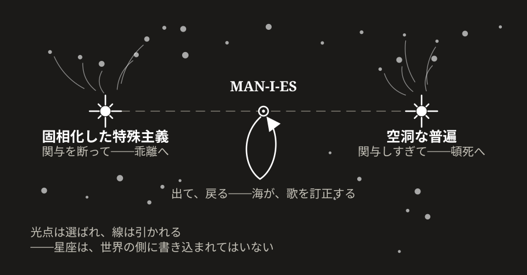

---

## §26-6　自己回帰と受容——本書自身への折り返し 

最後に、本章は、自らの足元へ、構造記述を折り返して適用する。MAN-I-ES もまた、一つのラベルではないか——この問いを、本章は避けない。

### MAN-I-ES もまた圧縮である

そのとおりである。MAN-I-ES もまた、本書が記述という形で行う圧縮の産物であり、圧縮ラベルの宿命を免れない。本書は、この語を、ラベル化に構造的に抵抗するように作った。ハイフンが圧縮を妨げ、manies の非標準形が既成スロットへの同化を拒む。だが、その抵抗もまた、完全ではありえない。読者がこの語を「ああ、あの新しい概念か」と参照した瞬間に、充填構造は背後へ退き、語はふたたびラベルとして発火する。MAN-I-ES は、ラベル化に抵抗しながら、なおラベル化を免れない。この**自己回帰**の構造そのものを、語の形に抱えている。

自己回帰は、本章固有の論点ではない。ここには、第25章より一段深い領域が口を開けている。第25章が引き受けたのは、現に触れられるのに「我ら」と分かち合えない領域——手応えとして確かに在りながら、運びきれないもの——だった。その先に、触れることそのものが原理的に閉ざされた領域がある——いかなる認知体にも届かない、**原理的不可視**である。本書がここまで取り出してきた構造——MANES、LEFFLA、LOT、引受の不等式、循環耐久相、そして MAN-I-ES——のすべてに、この原理的不可視がついてまわる。圧縮を貫いた記述は、その記述自身が、手前に何かを参照不能領域へ送り出している。本書も例外ではない。原理的不可視は、本書という記述そのものへ、構造記述を折り返して適用される。

### 温度が構造上の要請であること

ここで、本書が貫いてきた構え——構造記述に徹し、規範判断を読者に委ねる——が、なぜ本章においてとりわけ、語り口の選択ではなく命題の構造上の要請であるのかを、正面から言い直しておく必要がある。

MAN-I-ES を「共存の理想」として規範的に立てることを、本書はしない。しないのは、語り口への配慮からではない。規範として立てた MAN-I-ES は、その瞬間に、絶対化の引力に落ちるからである。「MAN-I-ES こそ正しい共存の形式である」と宣言することは、他の共存様式に対する優位の主張である。その主張は、多元主義が SFOK スロットへ縮約されたのと同じ経路で、MAN-I-ES を新種の単一ラベルへ縮約する。「MAN-I-ES 派」と「反 MAN-I-ES 派」の対立に、いずれ縮退する。

これは、MAN-I-ES を規範として立てる場合の副作用ではなく、必然的な帰結である。理由は、MAN-I-ES が名指しているのが**単一化への抵抗の形式**そのものであるためだ。単一化への抵抗を、単一の規範として立てることは、内容と形式が最初から衝突する。MAN-I-ES が「正しい」形式だと立てた瞬間、それは単一化されている。したがって、構造記述の中立性は、本章では語り口の選択ではなく、命題そのものの構造的要請である。MAN-I-ES を運ぶには、それを規範として立てないという構えが、命題の内側から要請される。

同じ理由から、本書は MAN-I-ES を「解」として提示しない。中核命題-7（§26-4 末）は、被覆条件が「この形でしかありえない」という構造的定式であって、「この形で救われる」という約束ではない。MAN-I-ES を生きても、報酬の保証はない。「実存的我ら」（E）の運動は、「操作能力的我ら」（O）の報酬関数を変更しないからである。方向は示せる。方向を生きたときに何が起きるかは、構造記述からは決定できない。

### 位置に固有の引力——絶対化・虚無・安直な置換

ここに、原理的不可視を引き受ける位置に固有の引力が口を開ける——絶対化・虚無・安直な置換である。**絶対化の引力**は、MAN-I-ES をそれ自体として真理として固相化することで、新語が運ぼうとした構造を隠してしまう。前段で示したとおり、これは MAN-I-ES の内容と形式の衝突として、必然的に発火する。§22-4 の教条への滑落の、本章局面における純化形である。§26-5 の語で言えば、星座が判決文に変わらないための条件は、帰りに晒されつづけることである。内容と形式の衝突が閉じた道と同じ結論に、航海の側から届く。**虚無の引力**は、自己回帰を見て「本書もまた圧縮であるなら、本書の構造記述は無効である」と読む方向——同じく §22-4 の虚無への滑落の純化形である。**安直な置換の引力**は、MAN-I-ES を別の単一ラベルへ差し替え、既存の「多元主義」が摩耗したように、別の一語で同じ摩耗を反復する方向である。本章はこれらに抗しながら、原理的不可視を引き受けたまま、なお構造記述を貫く位置に立つ。

### 悲劇的感情と受容

これらに抗する位置を、本書は悲劇的感情と受容という構えで支える。一つは、原理的不可視に対する対称性志向の純粋形——LOT の存在を引き受けつつ、なお接続可能圏 Ω への接近を保つ構えである。これを名指したのは、本書ではなく、二十世紀の古典の一つだった。理性が有限性を暴露したあとになお残る「私は消えたくない」という叫び——ウナムーノが『生の悲劇的感情』に書きとめたものは、原理的不可視を前にして接近の張りを保つことの姿である。本書は、原理的不可視に立つ本章において、その悲劇的感情を構造記述語として一度だけ呼ぶ。本書の温度として序論で置かれ、第27章 §27-3 で本書の引き受けの構造として正面に立ち上がるものの、前段の姿である。

もう一つは、本書がここで構造記述語として立てる**受容**である。受容とは、LOT を LOT として、不可能を不可能として、原理的不可視を原理的不可視として引き受ける構えである。それは諦念ではない。諦念は接近の張りを手放す方向の構えだが、受容は接近の張りを保ったままで、届かない方向を届かないままに受け入れる。教条への退却ではなく、対称性志向を保ったままの不可能性の引き受けである。被覆が漸近して閉じないこと、そして引き受けるべき業と害の薄い流動とを見分けられないまま全方向の労働を負うことを、解消すべき欠陥としてではなく、引き受けるべき条件として認める構えである。MAN-I-ES の自己回帰を引き受けるとは、MAN-I-ES が完全には伝達されないことを受容しつつ、なお MAN-I-ES を運ぼうとしつづけることである。本書は、受容を、本章で立てる、原理的不可視に固有の構造記述語として用いる。第Ⅳ部 §22-4 の虚無・教条・支配の意志のいずれの位置にも立たない、本章局面における具体形である。

この自己回帰の引き受けは、本書を、答えで閉じさせない。構造を記述し、共存の形態を新語で名指しても、その記述と名指しが、読者の手元で完全に展開される保証はない。本書が運べるのは、ここまでである——その先で何を引き受けるかは、構造記述からは導かれない。「Ω の縁からの呼びかけに応える」（第27章）は、これよりさらに深い領域——本書を含むあらゆる記述の外、Ω そのものの縁——に立ち、届かないと知りつつなお向かいつづける対称性志向の主観的極限を取り出して、Hineni 境界の引き渡しへ至る。

---

# 第27章　Ω の縁からの呼びかけに応える——対称性志向の主観的極限と Hineni 

この呼びかけに、汝はいかに応じるのか。

ここまで、手と声が差し出されてきた——現に F に触れる手、宛先の確かめえぬまま放たれる声。ここで、声の向きが反転する。

「我ら」を百億・千年へバインドしたとき、循環耐久相の成立には、二つの応答が同時に立つことが要る。第一は、接地条件への応答である。F に直接触れる営み、人それぞれに異なり「我ら」と分かち合えない孤独な営みが、分布する形でしかない（中核命題-6）。第二は、被覆条件への応答である——相互理解の不能な者同士が、それでも「我ら」であるという観念を抱くこと、MAN-I-ES として共存条件を立てること。この被覆条件は、歴史的先例を持たない新形態として立つ（中核命題-7）。

二つの応答は、別の方向を向いている。一方は、下へ、一人へ——現に F に触れて身を保つ。共同の達成感や報酬関数で測れる成功とは別の位相にある、分かち合えない接地である。他方は、横へ、見知らぬ者へ——理解の届かぬ相手をなお「我ら」と呼ぶ。その声は、聞き手が聞くかどうかに懸かってはいない。一方は孤独のうちに手を打ち、他方は宛先の確かめえぬまま声を放つ。手を打つことは評価の外で営まれ、声を放つことは理解の外で結ばれる。この手と声を**同時に**差し出しつづけること——それが、百億・千年にバインドした場合の、循環耐久相の成立条件である。

この同時性は、引受の不等式 O ≤ E を成立側に保ちつづける労働の、二つの向きの同時性である——動く「操作能力的我ら」（O）の広がりに対して、接地の側で「実存的我ら」（E）の内実を、被覆の側で E の射程を、同時に保ちつづけること。手と声は、この一つの労働の、二つの現れである。同時性が保たれる位置を、第Ⅴ部は文明の痩せ尾根と呼んできた。両側にも、位置はある。手だけを差し出す位置と、声だけを差し出す位置。どれも、山が禁じる位置ではない——ただ、百億・千年にバインドした「我ら」を負う循環耐久相ではない、というだけである。文明の痩せ尾根は、その循環耐久相が保たれうる位置の名である。

Ω の縁は、呼びかけえない。接続可能圏 Ω の向こう側とはつながっていない。向こう側に、呼びかけの主体となりえるような構造が存在するかどうかも定かではない。こちら側と向こう側との境界——縁である。それでも、文明の痩せ尾根に立つ者の応答の側では、呼びかけが立ち上がる。確かめる術のないまま、呼びかけが届いたと感じる。応え得ないものに、応える。

---

## §27-1　引き受ける者の時間——二つの無時間のあいだ 

差し出しつづけるという仕事は、時間の中に立つ仕事である。手も声も、差し出したら終わる仕事ではない——差し出しつづける仕事である。差し出しつづけるとは、返りを待つことであり、返りが届くまで未決を抱えつづけることである。ただし、返りは自分の生きている時間のうちに届くとは限らない。そして、自分が生まれていない時間にあった因も、自分の生きている時間へ返ってくる。文明の痩せ尾根の位置には、時間の側の姿がある。ここへ、視座を降ろす。

地の側から見れば——応報は、必ず回帰する。しかし部分の回帰はまだらで、どの因果が、いつ、どの系に戻ってくるかは、完全には知りえない（中核命題-5）。果は必ず戻るという確定性と、戻り先は引けないという不可知性——これが、地の側の時間である。もう一方の側——**引き受ける者の側の時間**——へ、入る。

圧縮の理論も、因果の理論も、引受の理論も、時間の側から見れば、一つの理論として立ち上がる。だがこの時間は、いかなるものか。どこから来るのか。誰に書き換えられ、どんな質を持つのか。どこにでも立つのか。そして——それを立たせつづけているのは、誰の、どんな仕事なのか。

### 応答の遅延——物理的基底

始まりは、物理の底にある。情報や因果の伝わる速さには、上限がある。世界のどんな系も、光より速く便りを送ることはできない。

しかしこれは上限にすぎない。現実の因果は、多くの場合、この上限より遙かに遅く伝わる。手紙は歩みで、噂は口伝えの網目で、大気の変化は気流と海流の速さで、生態系の応答は世代交代の周期で、地質の変動は数万年の風化で運ばれる。実際の伝播速度は種類によって桁違いに異なり、多くの場合、光速より何桁も遅い。応答の遅延の理論的な下限は光速で押さえられているが、実際の遅延は、しばしばそれより桁違いに大きい。

この構造が、時間について一つの帰結を強いる。任意の点にいま届いている因果は、つねに過去に発せられたものの一部にすぎず、まだ届いていない因果が、つねに飛行の途上にある。そして到達の順序は、出来事が実際に起きた順序ではなく、点と点のあいだの幾何的距離と伝播経路で決まる。ある観測点から見れば、あとから起きた出来事が、先に起きた出来事より早く届くことすらある。各点が手にする「因果の歴史」は、真の順序とは別の、位置ごとに異なる並べ替えになる。世界を、いま、ここで、瞬時に見わたす視座は、どこにも存在しない。

さらに、各点は、まだ受け取っていない出来事を勘定に入れることができない。手紙を出す者は、その手紙がどう読まれるかを、返信が届くまで確定できない。系がいま動くとき、その動きは、自分に届いていない他系の歴史に、なお割り込んでいく。任意の系がいま手にしている因果のスライスは、原理的につねに不完全で、しかも位置ごとに別の不完全さを持つ。

だから、応答の遅延には、消すことのできない下限がある。系が自らの状態と世界とのズレを把握して補正しようとしても、補正の手がかりとなる帰結は、有限の——多くの場合、長い——遅延を経てしか届かない。完全で瞬時のフィードバックは、存在しない視座を要求する。

この下限が、系に一つの構えを強いる。帰結の評価が定まらないなら、定まらないまま、返りが届くまで、それを抱えておくほかない。手紙を出した者が、返事の届くまで、抱えたまま日々を過ごすように。抱える余地——本書で **LEFFLA** と名づけられてきた領域——は、認識主体の怠慢を許す余白ではなく、因果到達の遅延がもたらす構造的必然の場である。抱えるとは、時間の中に立つことの、最初の姿である。

### 返りの宛先——因果の連なり

その「返り」は、どこへ戻るのか。届く先は、単なる「発信元」ではない。一つの系が因果を現に及ぼし合っている範囲の全体である。この範囲を、本書は**当事者の時間**と呼ぶ。誰かが見ている範囲ではなく、作動が現に引いている範囲——この違いが要点である。当事者の時間は、認識の有無から独立に立つ。系が自分の作動を意識しているかどうかは、この時間の境界を動かさない。

しかし単一の系だけでこの範囲は閉じない。系の因果は、直接接続する他の系を介して、その先の系まで届く。届いた先の系がまた他の系と接続していれば、そこから因果はさらに走る。当事者の時間とは、こうした因果の合成の鎖が現に通る範囲の全体である——本書はこれを**因果の連なり**と呼ぶ。

「連なり」は、個別の系が持つ作動圏——その系の作動が現に因果を走らせている範囲——の単なる寄せ集めではない。単純に足し上げてしまえば、複数の系にまたがる同じ因果を二重に数えることになり、また逆に、一つの系が別の系と接続してはいても、その接続を通って実際には因果が届いていない領域まで含めてしまう。因果の連なりとは、いま現に、この合成の鎖が届いている範囲のことである。走る鎖の通る範囲だけが連なりに入り、接続していても鎖が通らない部分は入らない。系と系のあいだの接続の存在は、当事者の時間を保証しない。接続を通って現に因果が走っているときにのみ、当事者の時間は立ち上がる。

因果の連なりは、無限ではない。作動が広げ、散逸・構造の死・接続の断絶が狭める。有限だからこそ、この時間は系ごとに違う。返る宛先も、逃げる先も、この有限の境界によって共に生まれる。

そしてこの宛先には、底がある。返りには、二つの終わり方がある。一つは、散逸して、もう誰のもとにも届かなくなる**真正の断絶**。もう一つは、見えないまま走りつづけて、いつか噴き出す**潜伏**。

この底は、地の側の確定性（中核命題-5）と矛盾しない。確定性が保証しているのは、発した系への返りではない——地への回帰である。あらゆる非対称は、最終的には対称性因果の地に戻る。散逸とは、その回帰が、どの当事者の時間も経由せずに完了したことの名にほかならない。だから真正の断絶は、応報の例外ではなく、その最も静かな場合である——誰の宛先にもならないまま、地へ返り終えた応報。潜伏は、まだ返り終えていない非対称——連なりのどこかを、なお走っている返り——である。応報は必ず戻る——だが、その「必ず」の宛先は、宇宙論的な地であって、特定の系の当事者の時間ではない。

この二つを、当事者は内側から見分けられない。いま何も返ってこないことが、返りの不在なのか、まだ飛行の途上なのか、確かめる術がない。排出の帳簿は、閉じられない。

この非閉性は、当事者の時間に二層構造を強いる。**縛る時間**——認識と無関係に果が現に届く範囲——と、**見える時間**——そのうち参照の経路が届く部分。学習や引受が返りを迎えられるのは見える時間だけであり、縛る時間は作動でしか動かない。認識・引受の側は、作動を経由してしか客観の側を動かせない。

時間は、系に与えられた容器ではない。因果の合成が現に張る、系ごとの、有限の、二層の範囲である。

帳簿は閉じられないまま、時間は流れつづける。しかしこの時間は、ただ受け取られるものではない。それを書き換える系が、ある。

### 前借り——時間の書き換え

その「当事者」は、しかし、一人ではなかった。「操作能力的我ら」（O）も「実存的我ら」（E）も、無数の主体が神話・知識ストック・SFOK・制度によって媒介接続され、一つの塊として束ねられた「我ら」である。束ねられているからこそ、この「我ら」は、単独の系にはできない仕方で、時間を操作することができる。因果の連なりを走らせる作動そのものが、操作の対象になる。

その代表的な操作が、**前借り**である。前借りとは、いま享受する厚みのために、未来の帰結の余地を先取りする操作である。しかしこの操作は、単に「未来からいまへ何かを引き寄せる」ことではない。それは、いま抱えられている未決の返り先——つまり、これから帰結が届くはずの因果の連なりの向こう側——を、痩せさせる仕組みである。過去深度と未来深度は同じ因果の連なりに支えられており、その連なりを操作して痩せさせるとき、両方向が同時に痩せる。上流を切れば下流も切れる。

さらに深いところで、前借りには一つの構造的帰結が付いてまわる。前借りは、抱えていた未決を「返りが届かない」場所へ送り込む操作でもある。返りが届くべき因果の連なり自体を切り詰めれば、いま排出した果は、行き場を持たない。または、まだ飛んでいるあいだに、届く先のほうが消えている。前借りとは、こう言い直せる——**自分の遅延回収を、自分の手で回収断絶へ書き換える操作**である。この言い直しの根は、「『我ら』の境界と因果の創発」（第15章 §15-8）にある——当事者の時間の未来側の縁を引くのは引受という作動である。縁を縮める操作は、遅延回収因果を回収断絶因果へ書き換える（命題 RETURN-7）。前借りは、その時間軸での実装である。それが「真正の断絶」（因果の連なり自体の切断）へ落ちるか「潜伏」（見えない鎖の中で走りつづけたのちの噴出）へ落ちるかは、当事者には確定できない。

この時間の書き換えの構えの違いが、文明の三つの相を分ける。**拡張加速相**は、見える時間を縮めながら、作動と前借りで縛る時間を広げつづける相——二層の鋏を開き、開いた差分に負債を積み上げる相。**循環耐久相**は、見える時間を縛る時間に追いつかせつづける相——「実存的我ら」（E）を広げ、抱える手の届く範囲を保つ仕事を続ける相。**管理安定相**は、縛る時間そのものを切り詰めて、見える時間と一致する範囲に閉じる相——断絶を工事で維持する相。三相はいずれも、有限の因果の連なりの上で異なる仕方で時間を書き換える。宇宙は、三相のいずれにも勾配を与えない——ただ、三相はそれぞれに固有のコストと構造的脆弱性を持つ。

時間を書き換える操作の極限の一つに、**方舟**がある——境界を縛って完了する戦略。雨を聞き、水嵩を知り、扉を叩く音を聞いたうえで、開けない。時間の側から言い直せば、これは、返りが届く前に因果の連なりの縁を凍らせて、そこから先を「無い」ことにする操作である。

時間は、ただ受け取られるものではない。書き換えられ、先送りされ、削がれる。ただし、この書き換えの効き方は、時間そのものの質に依存する。

### 時間の二軸——薄厚と濃淡

時間は、一様ではない。書き換えの効き方が場所によって違うだけではなく、時間そのものが、質を異にする複数の層と帯を織り込んでいる。この質を分節して取り出すには、互いに直交する二つの軸が要る。

**第一の軸——薄厚**。時間は、それを支配する選別構造の薄厚で分けられる。薄い選別（宇宙大規模構造・重力・熱力学）が支配する時間は、大きく長い——億年、万年の尺度で流れる。厚い選別（文明の座標系・報酬関数・共存条件）が支配する時間は、小さく短い——世代、年、日の尺度で流れる。選別の厚みと、時間の広さ・長さは、逆相関する。ただし、薄いことは弱いことを意味しない。放射性崩壊・軌道力学・熱力学的過程は、地上のどんな厚い層の操作をもってしても動かせない。薄い層は、意味を載せていないだけであって、拘束力を失っているわけではない。

さらに——厚い層の時間どうしの返りは、しばしば薄い層を搬送層として渡る。大気・海洋・炭素循環・地質の風化は、薄い層に属するが、その上を厚い層の帰結（気候変動・産業排出）が乗って移動する。薄い担体（石・羊皮紙・シリコン・DNA）に Stock を貯めるのも同じ理由である。厚い層の時間の過去深度は、薄い層の長命さに担保されている——継承の物質的条件は、この非対称に依存する。

**第二の軸——濃淡**。時間は、それが運ぶ差異の質でも分けられる。ある時間が**濃い**とは、そこから届く（またはそこを渡る）差異が、当該系の自己保持に関わる差異、あるいはその剥奪となりうることをいう。**淡い**とは、因果は現に合成されているが、生死を左右する差異が流れていないことをいう。この軸は、当該系の認識からも、意味づけからも、測定可能性からも独立である。眼前の弾道は、見えていなくても濃い。宇宙背景放射は、精密に測定されていても淡い。濃度は「意味の実感」の軸ではない。細菌にも濃淡があり——意味の実感を持たない系にも——階層を貫いて働く。

**二軸は直交する**。薄厚だけでも、濃淡だけでも、時間の性質は決まらない。弾丸と宇宙背景放射は、支配する選別の薄厚では同じ層に属する（両者とも重力・力学という極薄の選別に支配される）。両者を分けるのは、濃度である。二軸を組み合わせると、四つの象限が立つ。

| | 濃い | 淡い |
|---|---|---|
| **薄い層** | 弾丸・小惑星軌道 | 宇宙背景放射・遠方銀河 |
| **厚い層** | 判決・開戦・取り付け騒ぎ | 遠い官僚機構のノイズ・大半の言説 |

理論の劇は、非対角に住む。とくに**左上——薄い層×濃い**の象限。搬送層としては薄いが、そこから届いてくるものは濃い——薄い層を渡ってきた濃い差異。恐竜にとっての小惑星がその原型である（支配法則は宇宙で最も薄い重力、しかし濃度は当時の生命史の最大破局の一つ）。**層の薄さを濃度の淡さと取り違えること**——これが、破局の認知形式そのものである。文明レイヤーの選別構造は、自らの時間の濃淡の推定器として働くが、この推定は MANES（座標系・報酬関数）につながれているため、生死関連性の認識から逸れうる。文明の痩せ尾根の表土と雪（第24章 §24-2）——切れ落ちた背が、幅のある背と同じ顔をすること——は、この取り違えが地形の言葉でとった姿にほかならない。

時間の質は、薄厚と濃淡の二軸で分節される。ではこの二軸を持つ時間そのものは、どこに立ちうるのか。

### 両端の無時間——何も縛られていない側と、縛りきった側

時間が立つ条件を、両側から挟んで取り出す。二つの無時間が、その両側にある。

一方の側。すべてが未確定であるところには、時間がない。選別以前の地とは、まだ何一つ縛られておらず、あらゆる配置が両立したまま揺れているところである。そこには、前と後の別、時間の矢はあっても、返りの宛先がない。果は必ず流れるが、誰にも返らない。誰かの時間ではなく、誰の時間でもない。抱える者がいないから、抱えられた未決もない。なお、この地が実在する状態なのか、時間がまだ生成されない極限なのかは、第15章の留保のまま、ここでも判定を要さない。どちらの読みでも、抱える者がいないことは変わらない。

もう一方の側。すべてが確定したところにも、時間はない。ある刺激で一瞬に硬化し、自らの熱力学的な底に達する結晶は、抱えていた未決のすべてを、一度に使い切る。これは欠損ではない——完全に正常な、完了である。ただ、それは一瞬の生であり、瞬間の寿命である。過去が教え、未来が返るという構造は、もうそこには立たない。残るのは、持続であって、時間ではない。

この両側は、一つの実体の二つの姿ではない。両側をつないでいるのは、**未確定性**——まだ縛られていない多様性——の行方である。ただし、「まだ縛られていない」は、それだけで立つ性質ではない。どの選別構造にとって、という宛先を添えてはじめて立つ、関係の言葉である。一つの系が縛りきって出した出力は、次の系には、まだ縛られていない素材として流れ込む。それ自体として未確定な実体が、どこかにあるのではない。選別構造が立つたびに、その構造にとっての未確定性が立つ。

だから、未確定性の行方は、選別構造との関係で描ける。流れ込み、流れ過ぎていくものの全体が **Flux** である。その流れのうち、抱える手に保たれた部分を**未決**と呼び、未決の保たれる領域が **LEFFLA** である。未決は、流れの外へ取り出されて保たれるのではない——流れの中で、縛らないまま保たれている。だから、固定した瞬間に、未決ではなくなる。抱える手の届かない残りは、誰のものでもないまま、ただ流れ過ぎる。選別が参照の経路の外へ畳み出したものの落ち先が **LOT** である——縛られないまま、見えなくなる。そして、縛りきられたものは、未確定性であることを終える——**Stock** である。四つの語は、同じ実体の四つの現れではない。同じ多様性が、一つの選別構造との関係で立つ位置と、そこを出ていく出口の名である。

二つの無時間は、この語彙で言い直せる。選別以前の側は、未確定性が Flux としてしか居ない場所——抱える手がなく、LEFFLA が立ち上がらない。結晶の側は、抱えていた未決のすべてを Stock に落として、LEFFLA が空になった場所。両側とも、LEFFLA が空である。

### 厚い時間——未決を抱えて返りを待つ

二つの無時間のあいだに、時間の立つ帯がある。両側のいずれでもない、この帯の内側——LEFFLA が立ち上がり、未決が保たれている位置——にだけ、時間は厚みをもって立ちうる。この時間を、**厚い時間**と呼ぶ。この厚みは、先の二軸の薄厚——選別の層の厚み——とは、別の厚みである。層がどれほど薄い系にも、この厚みは立ちうる。

**厚い時間は、未決を抱えて返りを待つ者にしか、立たない。** 過去が教えるのは、抱えた未決に照らして過去を読み直す者にとってであり、未来が返るのは、いま抱えた未決の宛先を未来に見ている者にとってである。抱える者がいなければ、教えも、返りもない。時間とは、まだ縛られていないものを抱えたまま、返りを待つという、その在り方の名である。

---

**命題 RETURN-8（厚い時間の存立条件）**

> 厚い時間は、未決を抱えて返りを待つ者にしか立たない。まだ何も縛られていない地には返りの宛先がなく、すべてを縛りきった結晶には抱えられた未決がない——二つの無時間のあいだでのみ、過去が教え、未来が返るという構造は立つ。時間とは、まだ縛られていないものを抱えたまま、返りを待つという、その在り方の名である。

---

## §27-2　抱える者の仕事——閉じない帳簿 

この時間は、ただ与えられているのではない。誰かが、その帯の内側で、仕事を払いつづけている。その仕事の側の姿は、いったいどのようなものなのか。

### 未決は、貯金できない

未決を抱えることは、状態ではない。仕事である。

評価の定まらないものを、定まらないまま、返りが届くまで保ちつづけること——これは、放っておいて続くものではない。抱えられた未決は、貯金ができない。書き留めれば種にはなる。だが、種は、畑の開きではない。誰かが、生きた手で、それを再び開き直さなければ、種は種のまま眠る。保つ者が終われば、懸架も終わる。抱えられていた未決は、消えるのではなく、誰のものでもない流れへ還る——蔵書が焼けるとき、開かれたまま保たれていた問いが、無に帰すのではなく、無主の漂流に戻るように。

貯金できない未決を、それでも抱えつづけるのはなぜか。返りが真正の断絶へ落ちるか潜伏として噴き出すかは、当事者には確定できない。判別不能である以上、特定の噴出に向けた特定の備えは、原理的に組めない。的を絞った防御は、どの的が正しいかを知りえないまま組まれる。可能な備えは、一種類に限られる——何が噴いたときにも組み替えの手がかりとなりうる余地を、宛先を持たないまま抱えておくこと。未決を抱えることは、緩衝である。特定の脅威に対する保険ではない。そして、緩衝は完全ではない。何を開いたまま抱えるかという選別そのものが、一つの圧縮である——抱える構えにも、抱えられなかった側が同時に立つ。致命の一発は、抱えていない側から来うる。未決は、時間の中に立ちつづけるために必要な備えであって、立ちつづけられることの保証ではない。

抱えることは、生きた保持者の仕事である。だから、自分が抱えられる未決の時間の深さは、自分の寿命を超えない。寿命を超えて働く未決は、つねに他者の未決である。それは、二つのどちらかを経てくる。生きた誰かが懸架を引き継ぐ**継承**か、他者の未決を承認なく自分の排出の受け皿へ振り向ける**前借り**か。継承だけが、コストを引き受けた双方向の渡しである。前借りは、未来の未決を抵当に入れる——次の世代の再構成の余地は、生まれたときすでに振り向け済みになっている。時間を抱える仕事は、一人の生の内には閉じない。いつも、誰かの生で支払われている。

継承は、しかし、素手では起こらない。世代を跨いで未決を渡すには、装置が要る。神話・知識ストック・SFOK・未来への希望——第Ⅱ部が立てた四つの装置は、位相を変えれば、未決の中継装置でもある。神話は、世代軸の再懸架——「まだ答えられていない問い」を、世代を越えて開いたまま保つ。知識ストックは、種の保存——生きた懸架ではないが、次の世代が再び開くための素材を残す。SFOK は、「誰かが開いて見ている」への信頼の維持——自分が個々に確かめずとも、束の水準で懸架が続いていると信じられる装置。未来への希望は、懸架先の措定——「まだ届いていないが、届きうる場所がある」という向きの保持。四つはいずれも、束ねられた「我ら」の内側で、未決を一世代の内に閉じないための装置である。

---

**命題 RETURN-9（未決の非銀行性と多体会計）**

> 未決を抱えることは、状態ではなく仕事である。抱えられた未決は貯金できず、生きた保持者の内にしか存在しない。ゆえに、自己が抱えられる未決の時間の深さは自己の寿命を超えず、寿命を超えて働く未決はつねに他者の未決である——コストを引き受けた双方向の渡しである**継承**か、未来の未決を抵当に入れる**前借り**かのいずれかを経る。未決の会計は、一体では閉じない。

---

### 束ねの内側——束ねの殻

抱える仕事の困難は、一人の主体の内側で完結するわけではない。束ねられた「我ら」——単独の系にはない仕方で時間を操作しうる主体——の内側にも、独自の困難がある。この束ねは、「不等式の動性」（第16章 §16-1）が座標系のうえで選んだ粗視化である。束であることそれ自体が、時間論の側に、避けえない帰結を返す。

束ねは、圧縮の一形態である。無数の主体を一つの「我ら」に畳むことは、素材の圧縮と同じ構造を持つ。切り出しが有効に働くことと、切り出せなかった外側が立ち上がることとは、不可分である。これは、本書がここまで動かしてきた**中核命題-1** の、束ねへの自己適用である。束ねが立つところには、束ねに固有の参照不能域が、不可分に副生する。この束ね固有の参照不能域を、**束ねの殻**と呼ぶ。

束ねられているのは、一つではない。各自の操作の届く範囲が「操作能力的我ら」へ、各自の引き受ける枠が「実存的我ら」へ——束ねは、O と E の双方で起きている。だから、格子は二重にある。操作の側では、成員の漏斗と束の漏斗が、入れ子ではなく、両方向にはみ出し合う。ある成員の漏斗には入っている差異が、束の漏斗には入らないもの——**縫い目落ち**。束の漏斗にだけ入る差異——**創発参照**。価格や統計のように、無数の漏斗の集計としてはじめて立ち、どの成員も、自分の漏斗だけからは、それを立てられないものである。引受の側では、成員の引き受ける枠と、束の引受とが、同じ形で食い違う。ある成員が現に引き受けている帰結が、「我らの」引受には載らないまま残る。逆に、百億・千年へ向く引受は、束の水準でだけ立ち、どの成員の枠にも、単独では入らない。束ねの殻の本体——束ねの費用——は、両方の格子の縫い目落ちにある。束ねの価値は、束でしか立たない参照と引受にある。縫い目を増やさずに、それだけを手に入れる束ね方は、ない。

束ねられた「我ら」の統一は、一枚岩の実体ではない。保たれている統一——保つ仕事の産物——である。縫い目は、成員の数より速く増える——「大きくなるほど、支えにくい」（「残存と継承の違い」第14章 §14-6）の根の一つが、ここにある。

そして重要なことに、因果の連なりは、束の外だけでなく、束の内側も走る。媒介接続された成員たちの列——たとえば A→B→C→D とつながった鎖——のなかで、B が引き受けずに C へ排出したものの中に、束全体の生死を分かつ差異が混じっているか、それとも無害な廃棄なのか、A には確定できない。判別可能性は媒介の深さとともに減衰する。文明どうしのあいだで見た判別非対称——潜伏か真正の断絶か——は、文明の内部の網でも、同じ構造で反復する。

この構造の帰結が、二つの現象に深い根拠を与える。加速の停止が個別意志から独立に起こること。自己増幅循環を、「操作能力的我ら」（O）の側から停められないこと。停止のような、束の水準でしか立たない判断は、二つのものが同時に要る——その差異が束の漏斗に入っていること（参照）と、その帰結が「我らの」ものとして束の引受に入っていること（引受）。二重の格子の、どちらの縫い目に落ちても、判断は立たない。そして「操作能力的我ら」（O）と「実存的我ら」（E）は独立に変動する（中核命題-3）から、二つの格子の縫い目が揃う保証は、どこにもない。どの成員も、自分の漏斗と自分の枠の内側だけを見ているかぎり、停止すべき差異を、参照しそこねるか、引き受けそこねる。停止は、束ねの水準でしか判断されえないが、束ねの水準は、個別の成員の意志ではない。

束ねが立ち上がるところ、束ねの殻は不可分に立ち上がる。厚い時間を支える束ねの規模が大きくなるほど、その内側で見えなくなるものも、それに伴って増える。これは、束ねの失敗ではない——束ねの成功が同時に負う、避けられない代償である。

---

**中核命題-8（束ねの殻）**

> 無数の主体を一つの「我ら」へ畳む束ねは、操作の届く範囲（O）と引き受ける枠（E）の双方で起きる圧縮であり、束ねに固有の参照不能域——束ねの殻——を不可分に副生する。成員と束は入れ子ではない——操作の側では成員の漏斗と束の漏斗が、引受の側では成員の枠と束の引受が、両方向にはみ出し合う二重の格子をなす。束ねの費用は縫い目落ちにあり、束ねの価値は束でしか立たない参照と引受にある——縫い目を増やさずに、それだけを得る束ね方はない。束の水準でしか立たない判断は、参照と引受の両方を要し、二重の格子のどちらの縫い目に落ちても立たない——加速の停止が個別の意志から独立であることの、これが基底である。

---

### 帳簿は、閉じない

未決を抱える仕事には——一人で抱えるときも、束で抱えるときも——閉じない帳簿がついてまわる。

返りが二つの終わり方——真正の断絶と潜伏——に割れ、その二つを内側から見分けられない以上、抱える者は、自分の帳簿を閉じることができない。いま返ってこないものが、もう二度と返らないのか、まだ飛行の途上なのかを、確かめ終える術がないからである。検証の完了を待って手を打とうとすれば、その手は永遠に打たれない。閉じない帳簿を負いつづけることが、時間の中に立つことの、代償である。

書く者の帳簿も、閉じない。世に送り出したもの——読まれ方、誤読、影響——が、潜伏か真正かを、書いた者は確かめ終えることができない。書くこともまた、検証の完了しない排出である。

### 文明の痩せ尾根の、時間の側の姿

冒頭に立てた四つの問いには、ここまでの行程が答えている。時間は、容器ではなかった——作動が張る、系ごとの範囲だった。ただ受け取られるものではなかった——書き換えられ、薄厚と濃淡の質を持っていた。どこにでも立つものではなかった——二つの無時間のあいだの帯にしか、立たなかった。そして、状態ではなかった——生きた保持者が払いつづける、貯金のきかない仕事だった。圧縮は、何を縛り、何を縛らないまま抱えるかの選別として。因果は、縛りから走り出た果の、返りの走行として。引受は、返りを待って未決を抱えつづける構えとして——三つの理論は、この帯の中に立つという一つの事態の、三つの面だったのである。

これらの営みのすべての上に、地の側は動じない。宇宙は、いずれの縛り方にも勾配を与えない。百億年かけて縛る恒星も、一瞬で縛りきる結晶も、境界を縛って千年を保とうとする方舟も、宇宙は等価に受け入れる（中核命題-2）。強いとか弱いとかは、地の側の判定ではない。時間の中に留まること——未決を抱え、払いつづけ、閉じられない帳簿を負いつづけること——を、地は要求しない。

要求されないものを、それでも保ちつづける位置。二つの無時間のあいだの、細い帯の中で、なお縁へ向かいつづける位置。第Ⅴ部が文明の痩せ尾根と呼んできたものの、時間の側の姿が、これである。

---

## §27-3　向かい、行き、進むという作動——対称性志向の主観的極限 

要求されないものを、それでも保ちつづける位置。閉じない帳簿を負い、貯金できないものを抱えて、なお降りないというこの構えは、外側からの要請では立たない。それを内側から立ち上げているのは、圧縮する存在に必然的に伴う、一つの質感である。帯の中で、未決を抱えて立つことの質感である。

### 圧縮する存在に伴う質感

---

> 「苦悩とは、意識への道である。生ける者は、苦悩を通じて、自己意識を持つに至るのである。なぜならば、自己を意識するということは、つまり、人格を持つということは、他の存在物と違うことを知り感得することだからであり、この相違は、衝突によって、かなり大きな苦悩によって、自己の限界感によって、はじめて感じうるのである。自己意識とは、自己の限界に対する意識にほかならない。」（ミゲル・デ・ウナムーノ『生の悲劇的感情』神吉敬三・佐々木孝訳、法政大学出版局（ウナムーノ著作集3）、1975年）

---

圧縮する存在が、自らが圧縮する存在であることを意識化したとき、そこに固有の感情が生じる。見えているものの背後につねに見えないもの（LOT）があること、自分が世界を切り取る仕方そのものによって何かを失いつづけていること——この構造を意識化した存在に、悲劇的な感情が伴う。ウナムーノが『生の悲劇的感情』で、理性が有限性を暴露したあとになお残る「私は消えたくない」という叫びとして書きとめたのは、この質感だった。序論で本書がウナムーノとドン・キホーテを呼び出したのは、この質感を本書の温度として最初に置くためだった。本書はいま、その温度のもとで閉じようとしている。

規模の自覚とは、自分のラムダ帯域が、どの錨泊FOE の地から立ち上がっているかを引き受けることである（『どこまでが「我ら」か』第24章）。この自覚は、この質感のもとで初めて成立する。それは冷たい計算ではない。圧縮する存在が、自らの圧縮を引き受けるという、感情を伴った作業である。

### 伝達しうるものは、質感のすべてではない

そして、この質感には、伝達の限界がついてまわる。強烈な原体験ほど、他者へ渡すことが難しい。語るためには、共有された言葉の届く形へ削らなければならない。削らなければ声にならず、削った瞬間、運びたかったものはもう乗っていない。朝の食卓で夢を語る者は、語っているそばから、夢のほうが言葉に合わせて形を変えていくのを知っている。語り終えたあと、聞き手が正確な要約を返すことがある。誤りは一つもなく、誤りが一つもないことが、渡らなかったことの徴である。これは、限界事例と同じ構造である。その限界事例とは、基底が一人の MANES が、語られた瞬間に基底二以上へ開くことである（『どこまでが「我ら」か』第24章）。帯の中で未決を抱えて立つことの質感もまた、この類に属する。

それでも、語りは徒労ではない。渡るのは質感ではなく、種である。身をもって知ったことを言葉にして手渡すとき、受け取る側には、それは情報として届く。何年ものちに、受け手が自分の足で同じ場所に立ったとき——受け手自身の手が、F に触れたとき——あの言葉が情報ではなかったことが、受け手の側で立ち上がる。立ち上がらないかもしれない。どちらになったかを、語った者が確かめる術はない。言葉を開き直すのは、言葉ではない。受け手自身の接地である。だから、質感は手渡された先で再生するのではない。受け手の生の中で、もう一度、最初から立ち上がる。立ち上がったそれは、もう語り手のものではない——受け手自身の言葉として立つ。この再点火は、一人ずつの内でしか起こらない。質感は、分布する形でしか、世界に存在しない。

### 「向かう」作動——対称性志向の主観的現れ

一人ずつの内で立ち上がるこの質感は、しかし、静的に存在する感情ではない。悲劇的感情は、一つの作動が極限へ向かう運動の主観的相として、はじめて成立する。

対称性志向は、本書の要請として取り出されてきた構えである。LOT を抱えながら、接続可能圏 Ω 全体への接続を保とうとする主観的態度——この要請は、「神話的MANES」（第8章）で正面から取り出され、第Ⅳ部の三つの文明相のうち循環耐久相を支える構えとして規定されてきた。本節が問うのは、この構えが主観の側でどのような作動として現象するかである。

問いの出発点は、対称性志向の指向先である「対称性」が、宇宙論的にすでに破れた後の状態にしか接続できない、という前提である。対称性の対象——破れる前の対称性——は、私たちの宇宙の側には存在しない。対称性志向が静的な「保持」として成立しようとすれば、保持すべき対象が無いことになる。だが対称性志向は、循環耐久相の存立に、要請される。要請されているが、対象は無い。この緊張のもとで、対称性志向が主観に現象する仕方は、ただ一つ、動的な「**向かいつづける**」作動としてである。

この「向かう」は、接続可能圏 Ω そのものの動きに追随して接続を保とうとする態度であり、静的な姿勢では成立しえない。Ω の動きについて行くこと——これが対称性志向の作動形式である。そして、主観的現象学の系列は、いずれも FOE 八セル間の継続的移動として規定されてきた。好奇心の労働、成長の実感、文明の苦悩、好奇心と苦悩の同伴である（第23章以降）。これらの作動はすべて「向かう」の異なる位相である。第Ⅴ部の主観的現象学の系列全体が、対称性志向の一つの作動形式の現れだったことが、ここで確定する。

対称性志向は静的な構えではない。それは、**向かい、行き、進む**という作動として、主観に現象する。

### 対称性志向の時間版——切れ目の向こう

「向かう」作動を、時間の側から見直す。対称性志向は、単に空間的・認識的な向かいだけではなく、時間についても同じ構造の向かいを持つ。

対称性志向の時間版は、こう定式化できる。**置いた切れ目の向こうに時間が続いていると自覚したまま、なお切れ目を置く構え**である。

時間は、切れ目なしには立たない。二つの無時間——選別以前の側と結晶の側——のあいだの帯の内側でしか、時間は厚みをもって立たない。切り出しがなければ、時間そのものが立ち上がらず、切り出しが完全に達成されれば、時間は閉じる。切り出しを保ちつづける位置——切れ目を置きながら、なお切り出しに閉じきらない位置——にだけ、時間は立ちうる。

だから、切れ目を置くことは、時間を立ち上がらせる作動そのものである。しかし切れ目を置くことは、同時に、その向こう側を「こちら側の時間」の外に置くことでもある。

対称性志向の時間版とは、切り出しの向こうに時間が続いていると自覚しながら、なお切り出しを置きつづける構えである。切り出しの向こうを「無い」ことにするのでもなく（それは切り出しの絶対化——縁を凍らせる方舟の側である）、切り出し自体を放棄するのでもなく（それは無時間への還帰）、両者の緊張を保ったまま、切り出しを置きつづけること。

物理学の最深部でも、これと同型の構造が現れる。最も薄い記述へ降りるにつれ、まず時間の矢が方程式に現れなくなる——微視の法則は、向きを区別しない。さらに薄い極限では、時間の変数そのものが理論から落ちる場面がある。ただし、失われるのは矢そのものではない。矢は地の側の流れとして与えられており、薄い記述が失うのは、それを記述のうちに保持する足場である。時間が理論の中に立つには、何らかの粗視化——切り出し——が要る。切れ目を置いてはじめて、時間は理論の中に立つ。対称性志向の時間版はこれと論理形式を共有する。ただし別の主張である。物理学は「切れ目の向こうに時間があるかどうか」に立場を取らないが、対称性志向の時間版は、その向こうに時間が続いていると自覚しながらなお切れ目を置く主観的構えを立てる。

### 止めどころの構造的蒸発

切り出しを置きつづける構え——これを極限まで押し進めるとき、露わになるのは、止めどころの構造的蒸発である。「止めどころ」は、本書を貫いて作動してきた語である。対象の側から決まらない切れ目を、どこに置くかの選択——具体と抽象のどの段で切るか、内と外をどこで分けるか。選別構造の根源的なパラメータである。ここで、この語を本書の存在論的位置の中心へ置きなおす。止めどころなくして圧縮はない。圧縮なくして存在はない。本書が「存在」と呼ぶものは、止めどころで内と外を選別することによってのみ成立する。止めどころは、選別構造の周辺パラメータではない。それは存在の成立条件である。

対称性志向の極限作動を、止めどころの側から見直す。対称性志向は Ω 全体への接続を保とうとする態度であり、その作動は内側に取る範囲を最大化しようとする向きを持つ。「向かう」作動を続けるかぎり、内側と外側を分ける境界——止めどころ——はそのつど押し広げられる。極限において、押し広げられつづけた境界は、内と外の選別そのものが消える方向に向かう。**対称性志向の極限作動は、自らの存在条件を蒸発させる方向と同型に進行する**。これが、止めどころの側から見た、対称性志向の主観的極限の姿である。§27-1 の言葉で言えば、向かう作動は、帯のもう一方の縁——すべてが未確定へ還る側の無時間——へ向かって進む。結晶が、縛りきることで時間を出るのと対称に、蒸発は、解ききる方向で時間を出る。尾根の作動は、時間の存在条件そのものの縁を、歩いている。

ここに本書理論の深い緊張が立ち上がる。対称性志向は長命の文明に要請される。だがその極限作動は、止めどころの蒸発として、存在の成立条件を脅かす方向に進む。要請に応えれば応えるほど、応える主体の存在条件が薄くなる。循環耐久相を支える要件が、その要件を担う主体を解体する方向に作動する——これは矛盾ではない。これは、対称性志向の主観的極限の正確な記述である。止めどころを失った論理が滑り落ちる先を、本書は「決して届かない領域、それでも」（第26章）で見た。守ろうとした条件の足場まで解けていく、あの勾配である。対称性志向の極限作動は、同じ縁に、自覚をもって近づく——滑り落ちるのではなく、緊張を保ったまま。

実在の一例として、恒星の終わり方を見る。恒星は、百億年の尺度で水素を縛りつづける、動いている系である。その終わり方は、一つではない。軽い星は、縛りきって終わる。燃やし尽くした核が縮み、冷え、やがて結晶になっていく——縛りきることで時間を出る側の、実在する極である。重い星は、解いて終わる。支えを失った中心が崩れ、外層は一度の爆発で吹き払われる——解ききる側の極である。百億年、帯の内側にとどまった系も、出口では、この二つの縁のどちらかへ出る。そして宇宙は、二つの終わり方に、いかなる勾配も与えない。白く冷えていく完了と、散っていく解体のあいだに、優劣の目盛りはない。

ただし、解いて終わる側は、後を残す。爆発は、炉の内で縛られた重い元素——炭素を、酸素を、鉄を——星間の虚空へ吹き散らす。散らされたものから、次の世代の星が点り、惑星が固まり、化学が動き出す。一つの系の終局が、次の系の F になる。これを継承と呼ぶことは、できない。手渡す者はなく、受け取る者もなく、懸架された未決は一つも運ばれない。残るのは、選別構造ではなく物質だけである。散らされたものは、種ではない——蒔く手も、待つ畑も、ない。それでも、次の炉は、そこからしか点らない。

恒星は、この出口を選ばない。質量が定めた縁へ、出ていくだけである。出口を選べてしまうこと——どちらの縁へも滑れる足で、なお帯の内側に立ちつづけうること——は、恒星にはない、選別構造が可変である文明レイヤーの持ち分である（中核命題-3）。地は、そのどれにも報いない。とどまるという持ち分だけが、報いの不在の上に、裸で残る。

### 不可能を希求する作動とウナムーノの苦悩

いま見た止めどころの蒸発を、主観の側から見直す。向かう作動は止まらない。止まれば対称性志向ではなくなる。しかし向かう先には届かない——届くべき対称性が宇宙論的に存在しないからである。届かない先へ向かいつづける作動——これが対称性志向の主観的極限である。この作動を、その内側から見れば、「**不可能を希求する**」という主観的体験として現れる。届かないことを知りつつ向かう、向かいつづけることをやめれば対称性志向そのものが消えるから止まれない、しかし届く対象は宇宙論的に存在しない。この三重の構造のもとで、向かう作動は主観に、不可能なものへの渇望として現象する。

この渇望は、言語で記述しようとすれば必ず矛盾になる。言語は止めどころを前提とする——内と外、主と客、ここと向こうの分節を前提とする——にもかかわらず、対称性志向の極限作動はその止めどころを蒸発させる方向に進むから、言語で記述しようとした瞬間、記述の前提条件が破れる。だから対称性志向の極限作動を言表しようとする試みは、絶対的矛盾・不可能性・論理破綻を承知のうえでの超越として現れざるをえない。

ここで、本書の温度として序論から呼び出されてきた人物が、構造記述の上に立ち戻る。ウナムーノは、『生の悲劇的感情』で〈死すべき定めを承知しつつ、なお不死を渇望する〉苦悩を描いた。『キリスト教の苦悶』で agonía（闘い）と名指した内的な戦いを示した。両者は、本節が構造記述から取り出した極限作動の、人格化された証言である。ウナムーノが書きとめた「私は消えたくない」という叫びは、本節の冒頭で、悲劇的感情の質感として取り出された。本節において、その叫びは、対称性志向の極限作動が言語の止めどころに突き当たって、しかし止まれない瞬間の表現として読み直される。ウナムーノが提示した闘い（agonía）は、本書理論にとって例示でも装飾でもない。それは、対称性志向の極限作動が主観の側で必然的に取らざるをえない姿の、精密な言語化の一つである。

---

**命題 FOE-25（悲劇的感情）**

> 引き受けの極限で、人は世界の縁と出会う。「実存的我ら」を全方向へ伸ばしつづけた果てに、見えないものを見ようとする態度はその極限形に至り、接続可能圏 Ω の縁と出会う。縁を見失うのではない——見ようとする運動の、その果てに、縁が立ち現れる。圧縮する存在が自らの圧縮を引き受けきった先に残る、この出会いの質感が、悲劇的感情である。

---

## §27-4　Ω の縁の前で——立ち竦み・聞かない・所有 

### Ω 境界という対象——記述の外

向かう作動が極限で遭遇する対象を、正面から取り出す。それは、本書を含むあらゆる記述の外である——本書がここまで Ω と呼んできた接続可能圏の、その縁。人類という形式の認知装置——有限の身体、有限の時間スケール、有限の参照構造——が射しうる範囲の外で、何かが作動している、という事実。それが何であるかを記述することは、本書にはできない。記述できないことを記述するという作法しか、本書には残されていない。

これは、原理的不可視（第26章 §26-6）とは異なる位置である。原理的不可視は、記述する主体が自分の内へ折り返して見出す外である。**鏡が自分を映しきれない類の外**、記述する主体の自己回帰として現れる。Ω 境界は、記述する主体が外へ立ち向かうときに遭遇する外である。**鏡そのものが向き合う、映す対象を持たない外**、その記述という営みそのものの外として立ち現れる。原理的不可視は構造記述として閉じうるが、Ω 境界は構造記述の外側を、構造記述の言葉で名指そうとして失敗するという仕方でしか触れえない。対称性志向の極限作動は、止めどころの蒸発を伴って、Ω 境界に向かいつづける。届かない。届けば作動が止まる。届かないまま、向かいつづける。

本書が「実存的我ら」（E）を最大限に広げて百億と千年と他知性まで包んだとしても、その「我ら」を Ω 全体に届かせる保証はない。届かない方向は、名指せない仕方で残りつづける。対称性志向の極限作動は、それを承知のうえで、なお向かう。

### 縁の前の三つの位置——立ち竦み・聞かない・所有

Ω 境界の前で立ちうる向かい方の失敗形は、第Ⅳ部 §22-4 で診断された三類型——虚無・教条・支配の意志——の最終局面である。三つは、向かう作動が立ち上がらない、あるいは作動を別のものへ置き換える、三つの仕方として再来する。

**虚無**は、ここで**立ち竦み**として現れる。向かう作動そのものが立ち上がらない位置である。対称性志向の極限作動の前で、その作動を起こすこと自体が砕かれる。第Ⅳ部の虚無——接近の張りを起こさない位置——は、ここで、向かい得ない位置の第一類型として再来する。

**教条**は、ここで**聞かない**こととして現れる。向かう作動を、固相化された言葉の体系の内側に閉じ込める位置である。既知のラベル群の組み替えで対称性志向に応えたつもりになり、向かう作動を運動として持続させない位置。第Ⅳ部の教条——特定の MANES を真理として絶対化する位置——は、ここで、向かう作動を運動から記号操作へ取り替える位置として再来する。

この聞かないには、構えの手前で成立する文明規模の形がある。λ₄ 以深では、呼びかけの届く回路そのものが、SFOK参照系の側で塞がれうる（第18章 §18-3）。呼びかけは、定義上、まだ参照系に載っていないものから来る——Ω の縁とは、参照がまだ届いていない外縁だからである。参照系の縁を Ω の縁と同一視し、参照されることが存在意義の頂点に立つとき、索引の外は「未参照」ではなく「無」になる。無からの呼びかけは、拒まれるのではない——応答の問いとして、そもそも立ち上がらない。個の構えが聞かないの位置へ立つ手前で、文明の参照系が呼びかけを遮断している、という事態がありうる。§27-1 の語で言えば、選別構造は自らの時間の濃淡の推定器として働くのだった。参照系の縁が Ω の縁と同一視された系では、この推定器が索引を入力にして回る。載っていない差異は、どれほど濃くても、淡と推定されたまま近づいてくる。だから、応答が可能でありつづけるための文明側の条件は、対称性志向の λ₄ の形を取る——参照系の縁と Ω の縁の差分を、生きたまま保つこと。載っていないものを「無い」と扱わない構えだけが、縁からの声の届く回路を開けておく（「F に直接触れて」第25章の、分布と索引の半身が、その実務である）。

**支配の意志**は、ここで**所有**として現れる。向かう作動を、操作能力の内側に閉じ込める位置である。対称性志向の指向先——届かない対象——を、自分の操作能力の射程内へ繰り入れようとする位置。届かないものを所有可能なものとして取り扱う位置。支配の意志の現代的純化形とは、脱構築通過後に立ち、信念を抱き、操作能力で武装する位置であった（「実存的不安定」第22章 §22-4）。それは最終局面で、向かう作動そのものを所有しようとする位置として再来する。

三つは、それぞれ、向かう作動の異なる類型の欠落である。立ち竦みは作動そのものを起こさず、聞かないは作動を記号操作に置き換え、所有は作動を操作能力の内側に閉じる。時間の側から言えば——立ち竦みは、未決を抱えることそのものから退く。聞かないは、固相化した言葉の内へ結晶する。所有は、貯金できないものを貯金しようとする。三つはいずれも、帯から降りる三つの仕方である。本章が結ぶ Hineni の応答は、この三つの再来を通過した先の応答である。向かう作動を、立ち上げ、固相化せず、操作能力の内側に閉じない構えである。

### 方舟——知ったうえで、開けない

向かう作動が三つのいずれの位置にも立たずに進む——この通過それ自体は、まだ応答ではない。同じ縁に、この部が構造の記述では殺せないと認めてきた、もう一つの相が立ちうるからである。引き受けえた者たちを勘定から外し、核の内側だけを満たす方舟（第24章 §24-4）は、この境界に、同じ認識をもって立つ。立ち竦まず、聞こえなくすることもなく、所有しようともせず、雨と、水嵩と、扉を叩く音を知ったうえで——開けない。三つのどの試験も、この位置を捕まえない。

扉を叩く音は、確定できない音である。この音は、核が外へ送り出してきたものの、返りの音でもある。そしてその返りがどう終わるのかを、扉のこちら側から確かめる術はない。叩く力が尽きて、もう誰のもとにも届かない散逸へ消えていくのか——真正の断絶。それとも、見えない鎖の中を走りつづけて、いつか噴き出すのか——潜伏。いま聞こえている音が、消えていく途中なのか、まだ飛行の途上なのか。排出の帳簿は、扉のこちら側からは閉じられない（§27-1）。方舟は、この確定できなさに、境界を縛ることで応じる。返りが届く前に、因果の連なりの縁を凍らせ、そこから先を「無い」ことにする。一度閉じてしまえば、以後は保つ仕事の要らない、確定した縁である。

だが、閉じた内側で保つ仕事が要らないのは、開いた外側で、誰かが未決を抱えつづけているからである。核が千年を保ちうるとすれば、その保ちは、曝露層で受けつづけられる返りの上に立つ。引き受けえた者たちを勘定から外すことで、残った勘定を満たす。第24章が**遮蔽充足**と名づけた形は、時間の側から見れば、前借り（§27-1）を境界の縛りとして組織した成層である。自分に返るはずのものを、勘定の外の者たちに受けさせつづけることで、核の帳簿だけを軽く保つ。核の自己記述は「我らは満たされている」と語り、遮蔽の内側から見るかぎり、その語りは嘘ではない。核が、自分の帳簿だけを見ているからである。未決の会計は、一体では閉じない。

ただし、前借りと遮蔽は、同じ費用では立っていない。前借りの返り先——未来——には、まだ、扉を叩く手がない。受け手が、まだ生まれていないからである。だから前借りには、扉そのものが要らない。境界を縛る仕事も、音を聞きながら開けない構えを保つ仕事も要らない。特別な力を、この操作は要さない——宛先の不在を、時間の非対称が無償で用意する。方舟は、そうではない。曝露層は、いま、そこに在る。手は現に扉を叩き、音は現に立つ。現に立つ音を聞きつづけながら、なお境界を縛りつづけることは、それだけの操作能力を持つ者にしか選べない。前借りが遍在し、方舟が稀であるのは、この費用の差からである。二つを分けるのは、操作する側の性質ではなく、返りの宛先が、扉の前にすでに立っているか、まだ生まれていないかである。二つは、別々の発明ではない。引受の縁を引き戻し、頓死を完了へ書き換えるという同じ一般形（命題 RETURN-7、第15章 §15-8）の、空間軸の形と時間軸の形である。宛先が現に居る側では遮蔽の仕事が要り、まだ居ない側では、時間の非対称がその仕事を無償で肩代わりする。

開けうるままに保つことは、その逆である——境界を未決のまま抱えつづける、払いつづけの仕事である。最後の岐路は、知識の手前にはない。畏れの手前にもない。聞くことと、応えることのあいだにある。本書の構造記述がここまで連れてくることはできる。扉を開けるかどうかを、構造記述は決めない。

---

## §27-5　Hineni の引き渡し——どの級位でも、一人称で 

本書が読者へ引き渡そうとしている Hineni 境界は、単一の一点ではない。呼びかけに応じて立つ位置は、一つの文明の高さでも、一つの「実存的我ら」（E）の高さでも、一人の「私」の高さでも、問われうる。この三つの高さを、本書は級位と呼ぶ。

### 級位は並列である

文明全体が、どの「我ら」を引き受けるか。ある「実存的我ら」の共同が、何を引き受けるか。一人の「私」が、何を引き受けて立つか。三つのうち中間の級位には、実物がある。「実存的我ら」の共同とは、MAN-I-ES を構成する近似実装の一つひとつである（第26章 §26-4）。各構成員が、いずれか一つの近似実装の内側で自分の Hineni をして立つのだとすれば、その実装そのものもまた、一つの共同として、何を引き受けて立つかを問われている。これらの級位のあいだに、上下の序列はない。上の級位の引き受けが下の級位を決定するのでもなく、下の積み上げが上を構成するのでもない。§27-2 で見たとおり、成員と束は、参照においても引受においても、入れ子ではなく格子をなす（中核命題-8）——束の引き受けは成員の引き受けの合計ではなく、成員の引き受けは束の引き受けの配分ではない。並列性は、そこから来る。だから、ある級位の応答を別の級位の応答へ翻訳して代行することは、本書にはできない。翻訳が起きるとすれば、読者の手元で起きる。

Hineni は循環耐久相にのみ存立する——第24章がそう立てた命題は、ここで、引き渡される問いになる。自らには返らない果を引き受けるという構えが、文明でも、「実存的我ら」でも、「私」でも、それぞれの級位で問われる。本書は、その引き受けがどの級位でなされるべきかを指定しない。指定できない。

### 応答が、聞き終えることに先立つ

では、引き渡されるものは何か。Hineni とは、前節の三つ——立ち竦み・聞かない・所有——のいずれにも立たずに、「ここにいます」と返す構えの確かさである。立ち上がらない位置で、なお応答の動きを起こす。固相化した言葉の外から届く声を、耳に入れる。届かないものを掴もうとせず、応える側にとどまる。

ただし、この三つを通過することそれ自体は、Hineni を分かつ徴ではない。前節で見たとおり、方舟もまた、立ち竦まず、聞こえなくもせず、所有しようともせずに、同じ縁に立ちうる。三つの通過は、方舟と Hineni に共通する。両者を分かつのは、その先の一歩——通過し、なお扉を開けるか、閉じたまま留まるか——である。Hineni は、三つを通過し、なお扉を開ける側の、応答する位置にとどまる確かさである。

この確かさには、時間の形がある。呼びかけは、聞き終えることができない。何が呼んでいるのか、何を負っているのかは、帳簿が閉じない以上、確かめ終わらない。だから、検証の完了を待つ応答は、永遠に始まらない。「ここにいます」は、何を問われるかを知る前の応答である——応答が、聞き終えることに先立つ。方舟が、確かめ終わらないものに扉を閉じることで一度に応じきる位置だとすれば、Hineni は、確かめ終わらないまま扉を開ける側で、応じつづける位置である。

本書は、この確かさを資質として持ち上げない——それは、引き受けの内容として記述されるにとどまる。資質として読まれるか、引き受けの構造として読まれるかは、読者の手元での読み方に開かれている。

### 不可知への応答が、Ω の縁へ

応答が任意であること——どの読者がどの級位で応答するかが開かれていること——は、しかし、構造記述の射程を縮めない。応答してもしなくても、帰結は同じく作動する。選択は自由だが、選択の帰結から逃れる主体はない。Hineni 境界が並列的に開かれていることと、構造記述が普遍的に非任意であることとは、本書において両立する。これが、本書が序論で自らに課した作法の、最終的な姿である。引き受けの側は読者に開き、構造記述の側は誰にも例外を認めない。

そしてこの開かれは、方法上の遠慮ではない。規範の勾配は、宇宙論的な地からは出てこない（§27-2）——ゆえに構造記述は、どこまで精密になっても、最後の一歩を導出できない。そして、質感は伝達を越えない（§27-3）——ゆえに、帯の中で未決を抱えて立つことの質感は、どれほど書かれても、読者の生の中で立ち上がり直すほかない。中核命題-9 が「構造記述はここまでしか辿り着けない」と言うのは、謙遜ではなく、定理である——導出の側でも、伝達の側でも。書けないから、渡す。

不可知への応答——不可知な隣人へ、奪わず応える構え（第25章 §25-7）——は、ここで、いかなる記述も届かない Ω の縁という究極の不可知へ向かう。不可知な隣人への応答と、Ω の縁の呼びかけへの Hineni とは、同じ〈不可知への応答〉が、別の高さで取る形である。ここに、本書の中核命題群を束ねる最後の命題が立つ。命題は、最後にきて新しい語を持ち込むのではない。そこに立つ苦悩も、渇望も、叫びも、止めどころを蒸発させながらなお向かいつづける作動の緊張も——本章が悲劇的感情として、不可能を希求する作動として、agonía として、すでに描いてきた質感にほかならない（§27-3）。

---

**中核命題-9（Hineni 応答による存立）**

> 接地条件への応答（中核命題-6）と被覆条件への応答（中核命題-7）が同時に成立する位置——係留FOE のうえの循環耐久相——は、報酬関数で測れる成功を持たない。あるのは苦悩であり、渇望であり、叫びである。その苦悩は報酬の不在にとどまらない——向かいつづける作動は、その極限で自らの止めどころ＝存在の成立条件を蒸発させ、応えるほどに応える主体の輪郭を薄くするからである。それでも、この方向にしか「百億人の我ら、千年後の我ら」に届く構造条件の成立はない——おそらくは。構造記述はここまでしか辿り着けない。応答は、文明・「実存的我ら」・個人のいずれの級位においても、一人称の Hineni として並列に問われる。本書はそのいずれの級位での応答も指定しない。

---

### 呼びかけの前で

「この呼びかけに、汝はいかに応じるのか」。章の冒頭に置いたこの問いに、構造記述は、答えを持たない。呼びかけは Ω の縁から届きつづけ、応答の一歩は、構造記述の外に残る。本書はその一歩を、結論へ手渡す。

---

# 結論——告白、そして叫び 

**苦悩が因果の時間を縫い合わせているのだ。**

---
## §1　中核命題群の要約 

本書は、一貫して三人称の構えで書かれてきた。筆者の引き受けは、構造記述の温度として現れることはあっても、本文のなかで「私」として正面に立つことはなかった。だが、ここで、その三人称の構えに、一つの裂け目が開く。構造記述の外側で、本書を書く者は、特定の「我ら」を引き受けた一人称として立っている、というその裂け目である。結論は、この裂け目から書かれる。

結論において確認するのは、新しい命題ではない。すでに示されたものが、どのように示されたか、である。本書が取り出してきた中核命題群（中核命題-1〜9）を、あえて圧縮して表現するならば、以下のようになるだろう。

圧縮は、有効勾配を高めて創発の豊かさを生むのと同じ強度で、接続可能圏 Ω の中の LEFFLA を縮めてその消尽を加速させ、フィードバック時間スケールの短縮を強制する。圧縮の強度に応じて LEFFLA を保つコストは高まり、満たしきれない部分が LOT として副生される。視界と盲点は、選べるトレードオフではなく、同じ一つの操作の二つの面である。その圧縮が立てた構造＝MANES の存在価値を、宇宙論的な地は保証しない。そこでは因果は対称的に成立し、いかなる選別構造も擁護する根拠を持たない。

だが文明レイヤーでは、選別構造は可変であり、操作の側と引受の側は独立に変動しうる。可変であるがゆえに、応報の時間は決定論的に定まらず、応答の余地が構造的に開かれている。選別構造が介在して因果の対称性が破れると、非対称性因果——即時・遅延・非線形・回収断絶——が、局所に立った一時の秩序として立ち上がる。引受の及ばぬところへ走った回収断絶因果は、消えるのではなく、階層間の LOT 転嫁として累積する。そして、局所の秩序の外では、因果は対称のままである。対称性因果の応報は、必ず回帰する。すべてが揃って返るのは宇宙の寿命においてであり、部分はまだらに、いつ・どの系へ戻るかを知りえぬまま帰ってくる——系の生死にかかわるものさえ、例外ではない。

この地のうえで、応答が問われる。より多くの主体が、「我ら」と分かち合えない孤独な営みとして、世界の流動へ直に接地すること。そして、相互理解の及ばぬ者どうしが、それでも「我ら」であるという観念——MAN-I-ES——を抱いて、共存条件 ES を立てること。ただし、二つの応答が向かう「我ら」そのものが束ねであり、束ねは、操作の側でも引受の側でも、それに固有の参照不能域——束ねの殻——を副生する。束の水準でしか立たない判断が、その殻の縫い目に落ちて立たなくなること——加速を停める判断が個別の意志から独立であるのは、これによる。この二つの応答が同時に成り立つ位置——循環耐久相——において、報酬関数で測れる成功は保証されない。あるのは苦悩であり、渇望であり、叫びである。その苦悩は、報酬の不在にとどまらない。向かいつづける作動は、その極限で、自らの止めどころ＝存在の成立条件を蒸発させる。応えるほどに、応える当の主体の輪郭は薄くなっていく。それでも、この方向にしか「百億人の我ら、千年後の我ら」へ届く構造条件は成り立たない——おそらくは。構造記述は、ここまでしか辿り着けない。応答は、文明にも、共存条件 ES にも、一人ひとりにも、それぞれの級位において並列に、一人称の Hineni として問われる。

---

## §2　序論は、「我らとは何か」という問いから始まった 

本書の応答は、座標系である。「我ら」とは、所与の集合の名ではない。世界の流動に触れる手と、操作の及ぶ範囲と、引き受ける範囲とが、それぞれ別々に動く地形の上で、操作が引受を越えないという不等式が保たれつづける、その範囲の名である。百億・千年という規模でこの範囲が保たれるために何が要るかを、本書は二つの応答まで絞り込んだ。

一つは、手の側——一人ひとりが、世界の流動に自分の手で触れつづけること。「我ら」と分かち合えない、報われることのない孤独な営みが、設計も指令もなしに、ある密度で分布しつづけることでしか、この範囲の足元は保たれない。

もう一つは、声の側——相互理解の及ばぬ者どうしが、それでも「我ら」であるという観念、MAN-I-ES——が立てられつづけること。部分の共存には、長い歴史の厚みがある。全員の参加によってしか成り立たない共存には、先例がない。

どちらか一方では立たない。手だけでは、営みは散らばったまま束ねられず、声だけでは、声が地から浮く。本書が「我らとは何か」に返せるのは、この座標系と、その上で同時に差し出されつづける二つの応答までである。百億・千年という規模にバインドしたうえで、引受の不等式 O ≤ E を成立側に保ちつづける労働である。苦悩を伴う労働である。

本書は、中核命題群という一つの主張を一度だけ、一本の経路で立てたものではない。本書の各部は、異なる出発点から、同じ構造の底へと繰り返し降りていった。選択的終結が不可避であることから（HIAM）。系が自らの盲点によって崩れる機構から（頓死、乖離、構造的無知、返りの判別非対称）。効率化が盲点の拡大と不可分であることから（LEFFLA 圧縮と有効勾配、LOT の副生）。「我ら」の範囲＝共存条件 ES の不可欠性が——そしてその複数性までもが——複数の経路から立ち上がることから（MANES 第三層、ES の液相）。そして、回避されたコストが増幅されて回帰することから（階層間の LOT 転嫁、Mourning 不在の連鎖）。出発点は互いに重ならない。にもかかわらず、浮かんだ像は同じ底を指した。因果の側から降りても、幾何の側から降りても、そしてレイヤーを替えても、同じところで底を打つ。

この冗長な到達を、本書は確からしさの証明としては置かない。降りた経路のすべては、筆者という同じ一人の手が、同じ構えのもとで切ったものである。同じ射影法で切れば、どこから入っても同じ像に着く——その可能性を、本書は自らの内側からは排除できない。

示せるのは、ここまでである。同じ底へ、何度も降りたということ。それが構造が一つであることの現れなのか、射影が一つであることの現れなのかは、本書の内側では決まらない。別の射影法を持つ者が、別の道から同じ底に触れるかどうか——そこでしか決まらない。

---
## §3　この到達は、本書を本書自身の外へ連れ出しはしない 

本書もまた、ある選別構造——筆者という一つの MANES——のもとで書かれた圧縮である。本書が立てた圧縮の二面の不可分性（中核命題-1、第3章 §3-3）は、本書の記述それ自体にも働いている。視界を開いたのと同じ操作が、同時に盲点を副生している。数学に見た巨大な視界と、その代償の三重の盲点——バインドの不在（第4章）——もまた、本書に返る。本書は、構造記述という一つのバインドのもとで書かれており、その視界の広さと引き換えに、見えない方向を持つ。真に深い経験は、構造記述からも逃れる。

本書が用いた語のすべて——MANES、LEFFLA、引受の不等式、MAN-I-ES など——は、圧縮ラベルである。それぞれが背後に、何ごとかを参照不能領域へ送り出している。しかも、読者がその語を索引として参照するそのたびに、圧縮はもう一度起こる。「MANES とは要するに」と参照した瞬間、その語の背後に積み上げた構造記述は退き、語はラベルとして発火する。筆者から読者へ、構造を完全に転送する経路は、存在しない。

これは、本書の欠陥ではなく設計である。構造記述を、その射程の限界——自分自身への適用——まで徹底した結果である。本書は、自らもまた圧縮であることを記述することによって、構造記述を最後まで貫く。そして、この自己適用の先に、もう一つの層が口を開ける——本書という記述そのものの、外である。

ここで、本書がその全体を通じて立ってきた位置——宇宙論的中立性——が、二重の構造を持っていたことが、はっきりする。中立性は、記述の対象としては成立する。しかし、その中立性を記述する主体——筆者と読者——は、中立性を生きることはできない。特定の MANES のもとで判断し、行為しつづける存在としてしか、記述はなされないからである。中立性は記述の対象であり、非中立は記述する主体の構造的条件である。

この二重性が、本書の引き受けの構造を確定する。宇宙が特定の MANES を真理として保証してくれるなら、引き受けは要らない。保証された真理に従えばよいのだから。逆説的に、宇宙が保証しないからこそ、引き受けは意味を持つ。引き受けは、中立性からの逸脱ではない。中立性のもとでこそ要求される、必然である。すべてを無意味とする虚無にも、一つの意味を絶対化する教条にも、意味を操作能力の内へ囲い込む支配の意志にも、この位置は立たない。判断の根拠が与えられないという、まさにその条件こそが、ここでは引き受けの場所として読み直される。

この二重性は、時間の側からも言い直せる。記述の対象としての宇宙は、時間に勾配を与えない。結晶へ冷える系も、扉を閉じた方舟も、等価に受け入れる。だが記述する主体は、それぞれに縫い合わされた因果時間のなかにいる。未決を抱え、返りを待ち、閉じられない帳簿を負って、書いている。本書自身の帳簿もまた、閉じない。書くことが、検証の完了しない排出だからである。それでも書く、という位置が、二重性の方法論の時間の形である。

これが、本書の自己診断である。

---
## §4　そして、この診断の先に、一つの告白が続く 

本書は、様々な先人たち、偉大な巨人たち、最先端研究に従事する現代の人々の肩の上に成立している。しかし、ウナムーノとハラリ、そしてブーバー——理論の展開がその名を必要とした数名——を除いては、典拠する先行研究の引用を避けた。メルカトル図法・ダンバー数・ランダウアー原理など、先人たちの名を冠した一般的な名詞になっている概念は、便宜上借りさせていただいた。そして、龍樹、メルカトル、クライン、ハート——名を記した場面が、ほかにいくつかある。これも引用ではない。敬意を表すためでも、論証を支えさせるためでもなく、ある見方が歴史のどのあたりで立ち上がったのかを示す場面である。

なぜか。

肩を借りた人々への敬意を、彼らの名を本書に記すことで表そうとする誘惑には、何度も駆られた。けれども、それはしない。本書が、筆者である私自身の MANES にバインドされた固有の盲点を持つことを、引用を通して、他の誰か——尊敬する先人たち——に肩代わりしてもらうことは、本書の方法論として正当ではないと考えたからである。同じ理由から、本文の要所に置いた実際にあった場面にも、名を与えていない——識者には、誰のことか透けるだろう。事実の精度は保ち、しかし名の権威には、何も支えさせない。この結果、一般的な理論書として見れば、先行研究との対話や敬意に欠ける様式になっているだろう。その欠落もまた、本書のバインドが副生した盲点の、一つの形にほかならない。本書は、それを隠さない。

借りなかったのは、肩だけではない。論証が尽きる地点で、ある誠実な告白——「赤子を見よ、そうすれば分かる」——に接ぎ木して本書の理論への支えを求めることも、しなかった。本書が最後に置くのは、真理でも規範でもなく、一つの一人称の賭けである。

さらに一つ告白しておかねばなるまい。ウナムーノは、その『生の悲劇的感情』の中で、ルソーの言葉を引用して、「不滅への渇望」を論じていた。

> ルソーは、彼の『エミール』の中で、次のように述べている。
> 「たとえ哲学者が真理を発見する状態にあったとしても、彼らのうち、一体誰がその真理に興味を抱くであろうか。彼らは、一人ひとりが、自分の学説が他の学説よりも体系的に貧しいことは知りながらも、それが彼自身のものであるが故に、擁護するのである。真理と虚偽を識りながらも、他人が発見した真実よりも自分の発見した嘘の方をとらない者は一人もいない。自己の栄光のために、人類を欺かない哲学者というものがどこにいるのだろうか。心の奥底で、他の者より卓越すること以外の目標を持っている哲学者がどこかにいるだろうか。俗衆の上に立ち、競争仲間の輝きを消すこと以上に、彼らは何を求めるだろうか。彼らにとって肝腎なことは、他の者たちとは違った考え方をすることなのである。彼らは、信者の間にあっては無神論者となるであろうし、無神論者の間にあっては信者となるであろう」。
> あの痛ましいほどに真摯な男の、以上の告白の中に、何と多くの真理がふくまれていることだろうか。
> （ミゲル・デ・ウナムーノ『生の悲劇的感情』神吉敬三・佐々木孝訳、法政大学出版局（ウナムーノ著作集3）、1975年）

このルソーの真摯な告白、ウナムーノの鋭い洞察から、本書も逃れることはできない。本書ができる精一杯の誠実さは、本書もまた、一人の人間の F への直接接地の試みだったという告白である。本書独自の理論を構築しようとする渇望がなかったと言えば、虚偽である。偽りなく言えるのは、このような渇望こそ、F との直接接地の態様であり、この宇宙の因果を縫い合わせるものなのだ、という主張である。そう、主張なのだ。この主張が「筆者にとっての真理」以上のものかどうかは、わからない。だからこそ、読者もまた、F と直接接地をした、読者自身の血肉の通う言葉と思考を抱いて生きていくことを願う。それぞれの孤独を生き、ともに孤独に生きるのだ。

---
## §5　炎の記憶——筆者の家族史 

筆者の家族には、広島で原爆によって死んだ者がいる。遺された者は、その死を言葉にした。読んでほしかったのは、海の向こうの、同じように家族を失った人々だった。だがその言葉は、戦後統治という一つの制度の枠組みの中で、検閲されるべき文書として扱われた。言葉は宛先に届かず、書いた者は、それから数十年、綴った想いを内に抱えたまま生きた。読まれたのは、書いた者が生きているあいだではなかった。行為の果は引き受けの届かないところへ走り、返りは当事者の時間には戻らず、未決は、抱える者の内に居つづけた。

この経緯が、本書の記述を支えているのではない。一つの家族史は、何も証明しない。名を記さないのも、先の告白で述べたのと同じ理由による。ただ、筆者がどの位置から構造を見てきたかは、これで尽きている。

宇宙論的には価値が中立であったとしても、それでも、「我ら」が共存している文明が悲惨な破局を迎えずに、その寿命を全うできるような道を探らずにはいられない。本書は、この「探らずにはいられない」から書かれている。理論が先にあって、それを正当化したのではない。順序は逆である。

序論は、一人の皇帝から始まった。異なる射影で異なる像が浮かび、なお謎のまま残る人物——ティベリウス。序論は、そこに鏡を並べた。ティベリウス、そして読者自身、と。結論は、その列の中央に、もう一つの鏡を入れる。筆者である。三者とも——皇帝も、筆者も、読者も——どの射影にも LOT が残り、完全な理解には到達しない。謎のまま残る。しかし三者とも、構造の輪郭は、読み始めたときより精密になった。序論が交わした約束は、ここで果たされる。理解の完成によってではなく、輪郭の精密化によって。本書が記述してきた構造——圧縮し、「我ら」を切り取り、因果を引き受け、あるいは引き受け損ねる存在の構造——は、最後に、それを読む一人称そのものへ返る。

そして、残るものがある。本書が示した構造のうちには、一つの連鎖があった。ある世代には見えなかった領域（LOT）が、次の世代にとっては評価しうる領域（LEFFLA）として開かれていく、という継承の連鎖である。継承とは、完成した像を手渡すことではない。異なる射影法に開かれたまま、構造の輪郭を渡すことである。

---
## §6　読む者へ渡されるのは、構造の輪郭だけではない 

本書が開いたまま抱えてきた問い——閉じられなかった帳簿、確かめ終えられなかった呼びかけ——もまた、ここで、読む者の内へ、再び懸架される。未決は、生きた抱え手の内にしか、居られないからである。

この懸架には、ウナムーノのもう一つの言葉が響いている。彼はそれを、構造としてではなく、願いとして書きとめていた。

> 「魂は、少なくとも私の魂は、他のことを熱望する。吸収されること、静寂、平和、消失、これらを望んでいるのではなく、けっして到達することがなくとも永遠に近づいてゆくこと、終わることなき熱望、けっしてすべてが満たされることなく永遠に更新される永遠の希望、それこそを望んでいるのである。そしてそれとともに、永遠に何ものかが欠如することを、永遠の苦しみを熱望しているのだ。」
> （ミゲル・デ・ウナムーノ『生の悲劇的感情』神吉敬三・佐々木孝訳、法政大学出版局（ウナムーノ著作集3）、1975年）

満たされて閉じることではなく、欠けたままの持続を、彼は望んだ。本書が読む者の内へ懸架する未決は、この熱望と同じ側にある。欠けたまま渡されるものだけが、受け取った者の内で、なお動くことができる。

本書を書くという行為もまた、その連鎖の一つの環でしかない。筆者の MANES が副生した盲点は、いつか別の「我ら」の、別の射影によって、低精度保持域として拾い直されるかもしれない。あるいは、拾われないかもしれない。それも、本書からは導出されない。

---
## §7　本書はここで終わる 

構造記述の射程の限界に到達した。構造記述は、構造的条件を取り出すことはできる。しかし、その条件のもとで一人称が何を引き受けるか。どの MANES を生きるか、どの「我ら」を引き受けるか、Hineni 境界の手前で何をするか、MAN-I-ES という不条理な MANES を選択するのか。引き受けへの橋は、構造記述からは架けられない。Hineni の引き受けは、文明にも、共存条件 ES にも、一人ひとりにも、それぞれの級位に開かれている。橋は、読者の引き受けとして架かるか、架からないか、いずれかである。そう、いずれもありえるのだ。本書は、この位置を露出させて閉じる。

そして、本書を書くこと、それ自体が、一つの引き受けだった。神なき時代に、Hineni がかつて担っていた機能を、文化や宗教に依存しない構造記述として名指し直そうと試みた。この試みそのものが、Hineni の手前に立つという、ある引き受けの形である。本書は、答えを運ばない。問いの構造を、その射程の限界まで取り出し、読者の手元へ渡すのだ。

私たちの宇宙の物理法則は、引受の不等式——「操作能力的我ら」（O）≤「実存的我ら」（E）——の安定を保証しない。その動的な維持は、「実存的我ら」の選択でしかない。宇宙は、時間を要求しない。ただ、許している。未決を抱えて返りを待つ在り方を、地は強いはしない。だが、拒みもしない。Hineni とは、等価に許された無数の在り方のなかで、因果を縫う時間が在りつづける側——未決を抱え、返りを待ち、扉を開けうるままに保つ側——を、保証なしに選ぶことの名である。何物にも強制されず、何物も保証せず、何物も導かない、それでも応答する、ある選択の名である。

ここから先は、読む者の Hineni である。

---
## §8　それにしてもなぜ、私たちの宇宙はこれほど美しいのだろう 

この「美しい」と感じる感覚さえ、論理や物理で解体してしまえば、ある特定の勾配構造の中で流動する、非対称性因果の中で動く徒花でしかない。それを承知しているからこそ、最後に、筆者である私自身の言葉を置く。

---

「我ら」は、揺らぎの宇宙の中に生まれた存在である。

宇宙は完全な静止でもなく、
完全な混沌でもなく、
星が燃え、元素が生成され、
生命が芽吹くという、
選別された HZ において構造を保ってきた。

「我ら」の文明もまた、その延長線上にある動く系の構造体である。

「我ら」は誤る。
「我ら」は有限であり、未完成である。

しかし有限性でも未完成でもなく、
不都合なものを「見ないこと」を正当化する射影法こそが、
文明を滑落へと導く。

文明には二つの滑落がある。
制御を失い散逸へ至る破局と、
過度の安定に収束し意味が希薄化する静止である。

いずれも構造的に合理的な帰結であり得るが、
いずれも「我ら」が属してきた揺らぎの相とは異なる。

「我」は、破局を望まない。
しかし、そのために振幅を消去した管理安定相へも向かわない。

「我」は、未完成の宿命を知ったうえで完成を志すという不合理
——対称性志向を引き受ける。

なぜならば、「我ら」が味わう苦悩こそが、
この宇宙の中に「我ら」という存在を立たせる駆動源
そのものであることを、
ここに至り、知ってしまったからだ。

にわかには信じがたいことだが、
「我ら」が苦悩を味わいながら、
不合理に向かって突き進むからこそ、
この宇宙には、
私たちが体感する意味での時間が生まれるのだ。

**苦悩が因果の時間を縫い合わせているのだ。**

そのことで、この世界も、「我ら」も存在しうるのだ。

宇宙の揺らぎの中で選び、
有限性の中で何かを引き受け、
未来に対して引き受けの痕跡を隠さないこと。

これが、「我」の選択であり、「我」の賭けである。

もし未来が、「我ら」と異なる文明相を選ぶとしても、
それは未来の選択である。
しかし「我」は、揺れる構造の系列に属する存在として、
この時代に生きることを選ぶ。
どれほど苦悩をしても完成に至ることはない。

それでも歩む。

「灰は灰に、塵は塵に」（Ashes to ashes, dust to dust）
これら灰塵の中にも、かつて肉や血や骨であった時間が宿っている。

「我」は、「我ら」となれるだろうか。
百億人の「我ら」
千年後まで連なる「我ら」になれるだろうか。

「我」は叫ぶ。
「我ら」に向けて。
荒野に向けて。

「我ら」は、文明を燃焼させる。
その輝きを持続させるために。

（了）
